# TemporalStore CI/CD Design

This document proposes a practical CI/CD system for TemporalStore as both an
open-source storage engine and a managed cloud service.

The goals are:

- keep source-only repositories clean and reproducible
- build debug and release artifacts without overwriting each other
- test correctness before performance
- package server, proxy, metaserver, clients, monitoring UI, and smoke tools
- deploy safely to AWS/GCP/Azure style clusters
- support fast rollback and zero/low-downtime upgrades
- never publish third-party dependency trees, generated build outputs, binaries,
  temporary AWS tokens, or presigned URL files to Git

## 1. CI/CD Principles

TemporalStore has several risky surfaces: custom storage, replica replay,
shared-file/object storage, block cache, native client SDKs, and cloud
deployment scripts. CI/CD should therefore separate fast correctness checks from
heavier integration and scale tests.

Core rules:

1. Every PR must pass formatting, static checks, unit tests, and source hygiene.
2. Every merge to `main` must produce immutable versioned artifacts.
3. Every release candidate must pass component tests and smoke tests.
4. Every cloud rollout must start with one canary data node.
5. No rollout is promoted unless health, replay lag, write errors, read errors,
   and Prometheus scrape health pass defined gates.
6. Rollback must be a first-class pipeline stage, not a manual recovery plan.

## 2. Branch And Release Model

Recommended branches:

| Branch | Purpose | Artifact policy |
|---|---|---|
| `main` | normal development and managed-service source | build debug artifacts and release candidates |
| `main-no-deps` | clean public/open-source branch | source-only, no vendored dependencies or binaries |
| `release/x.y` | stabilization branch for a release line | signed release artifacts |
| `hotfix/x.y.z` | urgent production fix | minimal diff, full correctness gates |

Recommended version format:

```text
temporalstore-${semver}+${git_sha}
```

Example:

```text
temporalstore-0.1.0+2f9c094
```

Every built artifact should include:

- git SHA
- branch
- build timestamp
- compiler version
- dependency manifest
- feature flags, such as `ENABLE_MTCACHE`
- ABI/API version for client SDKs

## 3. Pipeline Overview

```mermaid
flowchart LR
  PR["Pull Request"] --> Hygiene["Source Hygiene"]
  Hygiene --> Unit["Unit Tests"]
  Unit --> Component["Component Tests"]
  Component --> Merge["Merge To Main"]
  Merge --> Build["Debug + Release Build"]
  Build --> Package["Package Runtime + SDKs"]
  Package --> Smoke["Smoke Test"]
  Smoke --> Staging["Deploy To Staging"]
  Staging --> Scale["Scale / Replay / Cache Tests"]
  Scale --> Canary["Production Canary"]
  Canary --> Rollout["Rolling Rollout"]
  Rollout --> Observe["Post-Deploy Observation"]
```



## 4. CI Jobs

### 4.1 Source Hygiene

Run on every PR:

- `clang-format` or equivalent formatting check
- C++ lint if enabled
- shellcheck for `.sh`
- basic Python syntax check for helper scripts
- JSON/YAML validation
- Terraform validation for infrastructure folders
- copyright/provenance policy check
- forbidden-file check

Forbidden file patterns:

```text
dependencies/
third_party/
node_modules/
build/
dist/
release/
debug/
*.a
*.so
*.tar
*.tar.gz
*.zip
*.log
*.jsonl
terraform.tfstate
*presign*
*presigned*
```

Forbidden secret patterns:

```text
AWS_SECRET_ACCESS_KEY
X-Amz-Security-Token
X-Amz-Signature
BEGIN RSA PRIVATE KEY
BEGIN OPENSSH PRIVATE KEY
github_pat_
password=
```

### 4.2 Unit Tests

Run on every PR:

- partition/index tests
- stream/local-file/shared-file tests
- page-store tests
- oplog tests
- command executor tests
- data model tests: STRING, HASH, SET, FEATURE, IPS, RISK,
  TemporalAggregate
- client router tests
- metaserver metadata tests

Unit tests should use local temporary directories and should not require AWS.

### 4.3 Component Tests

Run on PRs that touch storage, replication, metaserver, SDK, or protocol code.

Minimum component tests:

- one metaserver + one data node
- one metaserver + two data nodes
- primary-only table smoke
- primary + secondary table smoke
- direct SDK STRING put/get
- proxy SDK STRING/HASH smoke
- module ingest/query smoke
- blockcache smoke with DRAM-only
- blockcache smoke with SSD path
- shared-file store condition-check smoke

### 4.4 Replication And Recovery Tests

Run before merging storage/replication changes:

- primary write, secondary replay, secondary read visibility
- no-sleep time-to-visible measurement
- primary crash before page dump
- primary crash after page dump
- secondary restart after oplog truncation
- secondary rebuild from page/index plus recent oplog
- split-brain guard: stale primary rejects writes after promotion
- promotion guard: secondary cannot promote if replay lag is unsafe

Important correctness rule:

```text
Oplog alone is not enough after old updates have been dumped into pages.
Recovery needs page streams, index metadata, and oplog after the checkpoint.
```

### 4.5 Performance Tests

Do not block every PR on performance tests. Run them nightly and before release.

Required workloads:

- plain STRING set/get baseline
- HASH read/write baseline
- FEATURE sequence query
- IPS query
- RISK window count
- TemporalAggregate single-key smoke
- TemporalAggregate high-cardinality workload
- concurrent write/read workload
- secondary visibility lag workload
- blockcache cold/warm/hot read workload

Report:

- QPS
- p50/p95/p99/max latency
- CPU
- memory
- disk/EFS bytes
- blockcache hit ratio
- oplog append latency
- page dump latency
- secondary lag
- error count

## 5. Build Design

Build outputs must be separated:

```text
build/debug/
build/release/
artifacts/debug/
artifacts/release/
```

Build matrix:

| Build | Purpose |
|---|---|
| debug | developer test, symbols, assertions |
| release | production binaries |
| release-stripped | deployable runtime |
| release-asan | memory correctness lane |
| release-tsan | race detection lane, run selectively |
| client-sdk | C++ dynamic/static client library and headers |

Runtime feature matrix:

| Feature | CI expectation |
|---|---|
| `ENABLE_MTCACHE=OFF` | always build |
| `ENABLE_MTCACHE=ON` | always build for release candidate |
| SSD blockcache | smoke test with a temp SSD path |
| shared-file store | component test |
| S3/object store | future integration lane |

## 6. Package Design

Create separate packages instead of one huge tarball.

Recommended packages:

```text
temporalstore-server-${version}.tar.gz
temporalstore-metaserver-${version}.tar.gz
temporalstore-proxy-${version}.tar.gz
temporalstore-client-tools-${version}.tar.gz
temporalstore-cpp-sdk-${version}.tar.gz
temporalstore-python-sdk-${version}.tar.gz
temporalstore-go-sdk-${version}.tar.gz
temporalstore-java-sdk-${version}.tar.gz
temporalstore-rust-sdk-${version}.tar.gz
temporalstore-monitoring-ui-${version}.tar.gz
```

Each package should include:

- `MANIFEST.json`
- `VERSION`
- `LICENSE`
- binary or source payload
- runtime dependency manifest
- SHA256 checksum

Example `MANIFEST.json`:

```json
{
  "name": "temporalstore-server",
  "version": "0.1.0",
  "git_sha": "2f9c094",
  "build_type": "release",
  "features": ["mtcache", "shared-file"],
  "created_at": "2026-06-07T00:00:00Z",
  "entrypoints": ["bin/temporalstore-server"],
  "runtime_libs": ["libthrift.so.0.11.0", "librocksdb.so.6.11"]
}
```

## 7. Artifact Storage

Do not store built artifacts in Git.

Use:

- GitHub Releases for open-source source releases and small source artifacts
- S3/GCS/Azure Blob for runtime packages
- ECR/GAR/ACR for Docker images
- checksums and signed manifests for integrity

For AWS:

```text
s3://matrixark-artifacts/${project}/${version}/${package}
```

Presigned URLs are allowed only as temporary deployment plumbing and must never
be committed.

## 8. Container And VM Images

Two deployment formats should exist:

1. VM package:
   - tarballs installed into `/opt/temporalstore`
   - systemd units for metaserver, proxy, and data node

2. Container package:
   - `temporalstore/metaserver:${version}`
   - `temporalstore/proxy:${version}`
   - `temporalstore/data-node:${version}`
   - `temporalstore/monitoring-ui:${version}`

The VM package is useful for early AWS/EFS testing. The container package is
better for managed cloud and Kubernetes.

## 9. Deployment Topologies

### 9.1 Small AWS Test Topology

```text
1 meta/proxy/client/UI node
2 data nodes
shared EFS mounted only where data nodes need it
optional extra EBS/NVMe path for SSD blockcache
```

Use this for:

- smoke tests
- packaging tests
- first scale tests
- observability tests

### 9.2 Production Topology

```text
3 metaserver nodes
N proxy nodes
N data nodes across availability zones
shared storage or object storage backend
local SSD/NVMe for blockcache
Prometheus/Grafana/alerting
```

Metaserver and data-node scaling should be independent.

## 10. Rollout Strategy

### 10.1 Data Node Rolling Upgrade

1. Mark one data node as draining.
2. Stop assigning new primary partitions to it.
3. Wait for replicas to be healthy elsewhere.
4. Stop the old process.
5. Install the new package.
6. Start the new process.
7. Verify heartbeat, partition load, and replay.
8. Re-enable placement.
9. Continue node by node.

Gate before continuing:

- process alive
- heartbeat healthy
- no partition stuck loading
- replay lag below threshold
- write error rate near zero
- read error rate near zero
- Prometheus scrape healthy

### 10.2 Proxy Rolling Upgrade

Proxy rollout is easier:

1. Remove one proxy from load balancer.
2. Install package.
3. Start new proxy.
4. Run proxy smoke tests.
5. Re-add to load balancer.
6. Continue.

### 10.3 Metaserver Upgrade

Metaserver upgrade needs stricter control:

1. Verify metadata snapshot.
2. Upgrade followers first.
3. Move or step down leader if needed.
4. Upgrade leader last.
5. Verify table routing and placement version.

## 11. Rollback Strategy

Every deploy should keep:

```text
/opt/temporalstore/releases/${version}
/opt/temporalstore/current -> releases/${version}
/opt/temporalstore/previous -> releases/${old_version}
```

Rollback:

1. Stop service.
2. Point `current` back to `previous`.
3. Restart service.
4. Verify health gates.

Data compatibility rules:

- If a release changes page/index/oplog format, it must define downgrade safety.
- If downgrade is unsafe, the rollout must require an explicit migration stage.
- New readers should support old page versions for at least one release window.

## 12. Observability Gates

Every deploy should validate:

- metaserver `/vars`
- data-node `/vars`
- proxy `/vars`
- Prometheus scrape status
- node CPU and memory
- bthread worker usage
- partition load status
- oplog append latency
- page dump latency
- shared-store error count
- blockcache hit ratio
- secondary replay lag
- client error rate

Deployment should stop if:

- a primary partition cannot load
- secondary replay is stuck
- write error rate rises above threshold
- read error rate rises above threshold
- storage append failures appear
- stale-primary writes are accepted

## 13. CI/CD For Open Source

The open-source CI can start smaller:

- format/lint
- unit tests
- local one-node smoke
- local two-node smoke with shared-file temp directory
- Docker build
- SDK package checks
- forbidden-file and secret scan

Do not require AWS for external contributor PRs.

## 14. CI/CD For Managed Cloud

Managed cloud needs the full pipeline:

- release build
- package signing
- image build
- staging deployment
- canary rollout
- rolling upgrade
- rollback test
- scale test
- secondary lag test
- storage cleanup test
- observability gate
- cost cleanup verification

## 15. Immediate Next Steps

1. Add GitHub Actions or equivalent CI for source hygiene and unit tests.
2. Add a reusable `package_release.sh` lane that emits separated packages.
3. Add a `smoke-packaging` CI job using the scripts in `tools/workspace/smoke-packaging/`.
4. Add a nightly AWS staging job that reuses the one-cluster topology.
5. Add a deployment gate that fails when TemporalAggregate smoke fails.
6. Add secondary-read policy tests:
   - primary read-after-write
   - secondary stale-tolerant read
   - time-to-visible on secondary
7. Add artifact manifest generation and checksum verification.
8. Add rollback test to the AWS staging pipeline.
