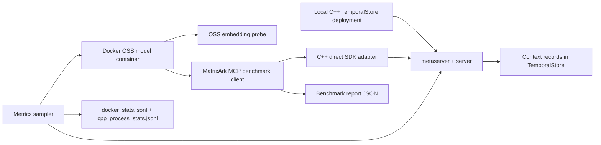

# MatrixArk C++ TemporalStore Docker OSS Scale Testing

This document describes the local scale test that runs MatrixArk context extraction, ingestion, retrieval, and context packing against a live C++ TemporalStore deployment while an OSS model container is running. It also records CPU, memory, latency, and pipeline metrics for debugging.

## What This Test Proves

- OSS model runtime is available in Docker using `sentence-transformers/all-MiniLM-L6-v2`.
- MatrixArk can run a scaled context pipeline and generate model-backed embeddings in the container.
- MatrixArk extraction, batch ingestion, restart/reload, retrieval, and hit-rate checks run through the C++ TemporalStore direct SDK.
- C++ TemporalStore metaserver/server CPU and RSS are sampled while the benchmark runs.
- Docker container CPU and memory are sampled while OSS model and benchmark work is running.

Current limitation: the OSS model probe and live C++ TemporalStore benchmark run in the same Docker setup, but the benchmark client still uses the current MatrixArk MCP extraction/retrieval path. The direct SDK storage path is real C++; model inference for the MCP benchmark should be wired deeper into MatrixArk as a future step.

## Workflow



## Prerequisites

Run from WSL/Linux, not PowerShell:

```bash
cd <workspace>/Codex/2026-06-07/what-s-the-topology-for-all/temporalstore-service-fix
docker --version
test -f output-ubuntu22/release/sdk/lib/libbcache2.so
```

The OSS embedding model must exist locally:

```bash
python3 tools/download_context_oss_models.py --source modelscope --skip-vlm
test -f .local/context-oss-models/sentence-transformers/all-MiniLM-L6-v2/modules.json
```

## Run Command

Small debug run:

```bash
EVENTS=40 QUERIES=8 EVENTS_PER_LANE=5 BATCH_SIZE=20 \
  tools/run_matrixark_cpp_docker_oss_scale.sh
```

Scaled run:

```bash
EVENTS=200 QUERIES=80 EVENTS_PER_LANE=50 BATCH_SIZE=20 \
  MS_PORT=19300 \
  tools/run_matrixark_cpp_docker_oss_scale.sh
```

The script starts a local C++ TemporalStore deployment unless `START_CPP=0` is set.

By default, the wrapper uses `python:3.12-slim` and installs CPU-only PyTorch plus `sentence-transformers` at container runtime. This avoids large Docker image layer export failures on local WSL Docker. If you want a reusable image, set `BUILD_IMAGE=1`.

The C++ direct SDK is linked against host Ubuntu libraries. The wrapper mounts host library directories read-only and symlinks only the non-libc SDK dependencies into `/tmp/ts-libs` inside the container. This avoids accidentally loading the host `libc` into the Debian Python container.

## Artifacts

All artifacts are written under:

```text
.local/context-debug/cpp-docker-oss-scale/
```

Important files:

- `oss_model_pipeline_result.json`: OSS model probe and context contract result.
- `cpp_temporalstore_benchmark.json`: MatrixArk extraction/ingestion/retrieval benchmark through C++ TemporalStore.
- `docker_stats.jsonl`: raw Docker CPU/memory samples.
- `cpp_process_stats.jsonl`: metaserver/server CPU/RSS samples.
- `summary.json`: merged summary of benchmark and resource metrics.
- `run.log`: full command log.

## Metrics To Inspect

From `cpp_temporalstore_benchmark.json`:

- `backend`: must be `temporalstore-direct`.
- `ingest_mode`: should be `batch` for VikingMem-style logical session ingestion.
- `events`, `queries`, `batch_size`.
- `ingest_latency_ms_avg`, `ingest_latency_ms_p50`, `ingest_latency_ms_p95`.
- `retrieval_latency_ms_avg`, `retrieval_latency_ms_p50`, `retrieval_latency_ms_p95`.
- `hit_rate`.
- `restart_before_query`: proves readback after MCP restart.

From `summary.json`:

- `resource_metrics.docker_cpu_pct_max`.
- `resource_metrics.docker_memory_mib_max`.
- `resource_metrics.cpp_processes.metaserver.cpu_pct_max`.
- `resource_metrics.cpp_processes.metaserver.rss_mb_max`.
- `resource_metrics.cpp_processes.server.cpu_pct_max`.
- `resource_metrics.cpp_processes.server.rss_mb_max`.

## Debugging

If the model is missing:

```bash
python3 tools/download_context_oss_models.py --source modelscope --skip-vlm
```

If the C++ deployment is stale:

```bash
BUILD_TYPE=Release OUT_DIR=output-ubuntu22/release DEPLOY_DIR=/tmp/matrixark-cpp-docker-oss-19300 \
  CLUSTER_NAME=matrixarkcppdocker19300 NAMESPACE_NAME=deploy_ns TABLE_NAME=deploy_table \
  MS_PORT=19300 MS_RAFT_PORT=19310 MS_SNAPSHOT_PORT=19320 SERVER_PORT=19301 \
  tools/deploy_local_ubuntu22.sh stop
```

Then rerun the wrapper. Use `STOP_CPP_ON_EXIT=1` if you want the wrapper to stop the local deployment at the end.

If Docker stats are empty, the benchmark likely completed before the first sample. Reduce `SAMPLE_INTERVAL_SECONDS`:

```bash
SAMPLE_INTERVAL_SECONDS=1 EVENTS=200 QUERIES=80 tools/run_matrixark_cpp_docker_oss_scale.sh
```

## Latest Local Validation

Latest command:

```bash
EVENTS=40 QUERIES=8 EVENTS_PER_LANE=5 BATCH_SIZE=20 \
  tools/run_matrixark_cpp_docker_oss_scale.sh
```

Result from the local run on June 21, 2026:

```json
{
  "oss_model_status": "passed",
  "embedding_backend": "sentence-transformers",
  "embedding_dim": 384,
  "cpp_benchmark_status": "passed",
  "backend": "temporalstore-direct",
  "events_requested": 40,
  "messages_ingested": 40,
  "queries": 8,
  "ingest_mode": "batch",
  "batch_size": 20,
  "batches": 2,
  "hit_rate": 1.0,
  "ingest_latency_ms": {
    "avg": 1000.569,
    "p50": 510.358,
    "p95": 1490.781
  },
  "retrieve_latency_ms": {
    "avg": 138.776,
    "p50": 18.419,
    "p95": 994.849
  },
  "docker_cpu_pct_max": 281.91,
  "docker_memory_mib_max": 745.7,
  "metaserver_cpu_pct_max": 548.0,
  "metaserver_rss_mb_max": 48.36,
  "server_cpu_pct_max": 15.0,
  "server_rss_mb_max": 55.16
}
```

What passed:

- `oss_model_pipeline_result.json` exists and reports OSS embedding model usage.
- `cpp_temporalstore_benchmark.json` exists and reports `backend=temporalstore-direct`.
- `summary.json` contains Docker and C++ process metrics.
- No C++ fatal assertion or SDK load error appears in `run.log`.

For larger runs, increase `EVENTS`, `QUERIES`, and `EVENTS_PER_LANE`. Keep `BATCH_SIZE >= 20` to match the session-batch extraction pattern used in VikingMem-style benchmarking.

The latest artifact paths are:

```text
.local/context-debug/cpp-docker-oss-scale/oss_model_pipeline_result.json
.local/context-debug/cpp-docker-oss-scale/cpp_temporalstore_benchmark.json
.local/context-debug/cpp-docker-oss-scale/docker_stats.jsonl
.local/context-debug/cpp-docker-oss-scale/cpp_process_stats.jsonl
.local/context-debug/cpp-docker-oss-scale/summary.json
.local/context-debug/cpp-docker-oss-scale/run.log
```
