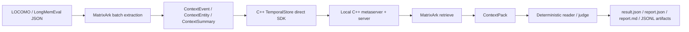

# MatrixArk C++ TemporalStore LOCOMO And LongMemEval Metrics

This document records the C++ TemporalStore-backed benchmark status for MatrixArk long-term context evaluation. It separates validated full runs from pending official-parity work.

## Summary

MatrixArk has validated C++ TemporalStore-backed full runs for:

- LOCOMO full dataset: `locomo10.json`
- LongMemEval-style HeLa-Mem full copy: `longmemeval_s_helamem.json`

The official cleaned LongMemEval_s file is now locally available and parity-eligible, but a full official run still needs to be executed cleanly end to end with C++ TemporalStore.

## Benchmark Workflow



For these runs:

- Storage backend: `temporalstore-direct`
- Ingestion mode: batch
- Batch size: 20 messages
- Storage log mode: `sharded_compact_count_log`
- Reader mode: deterministic debug reader
- Judge mode: local exact-substring or exact/key-token support judge
- These are storage/retrieval proof runs, not paper-style LLM-judge scores.

## LOCOMO Full C++ Run

Run identity:

- Dataset: LOCOMO
- Dataset file: `C:\root\matrixark_benchmarks\data\locomo10.json`
- Artifact prefix: `locomo_cpp_temporalstore_full_20260621_rerun`
- Artifact directory: `C:\root\matrixark_benchmarks\artifacts\cpp_dataset_20260621_full`
- Backend: `temporalstore-direct`
- Metaserver: `127.0.0.1:19000`
- Storage prefix: `matrixark:dataset:locomo:full:20260621rerun`
- Token budget: 1,200
- Max message chars: 1,600

Metrics:

| Metric | Value |
|---|---:|
| Questions | 1,986 |
| Sessions | 272 |
| Turns ingested | 5,882 |
| Ingestion elapsed | 136,567 ms |
| Ingestion throughput | 43.07 turns/sec |
| Retrieval avg latency | 200.56 ms |
| Retrieval p50 latency | 201.71 ms |
| Retrieval p95 latency | 258.86 ms |
| Avg prompt tokens | 8 |
| Context recall | 100.00% |
| Evidence-session recall | 44.76% |
| Exact substring answer hit | 15.81% |
| Debug final judge score | 15.81% |
| Compression hidden answer count | 0 |
| Token budget pressure | 0 |

Failure buckets:

| Bucket | Count |
|---|---:|
| Context recall miss | 0 |
| Evidence-session miss | 1,097 |
| Reader miss | 1,672 |
| Compression hidden answer | 0 |
| Token budget pressure | 0 |

Artifacts:

```text
C:\root\matrixark_benchmarks\artifacts\cpp_dataset_20260621_full\locomo_cpp_temporalstore_full_20260621_rerun.result.json
C:\root\matrixark_benchmarks\artifacts\cpp_dataset_20260621_full\locomo_cpp_temporalstore_full_20260621_rerun.report.json
C:\root\matrixark_benchmarks\artifacts\cpp_dataset_20260621_full\locomo_cpp_temporalstore_full_20260621_rerun.report.md
C:\root\matrixark_benchmarks\artifacts\cpp_dataset_20260621_full\locomo_cpp_temporalstore_full_20260621_rerun.hypotheses.jsonl
C:\root\matrixark_benchmarks\artifacts\cpp_dataset_20260621_full\locomo_cpp_temporalstore_full_20260621_rerun.context_packs.jsonl
C:\root\matrixark_benchmarks\artifacts\cpp_dataset_20260621_full\locomo_cpp_temporalstore_full_20260621_rerun.judge.jsonl
```

## LongMemEval-Style Full C++ Run

Run identity:

- Dataset: LongMemEval-style HeLa-Mem copy
- Dataset file: `C:\root\matrixark_benchmarks\data\longmemeval_s_helamem.json`
- Artifact prefix: `longmemeval_helamem_cpp_temporalstore_optimized_full_20260621`
- Artifact directory: `C:\root\matrixark_benchmarks\artifacts\cpp_dataset_20260621_full`
- Backend: `temporalstore-direct`
- Metaserver: `127.0.0.1:19200`
- Storage prefix: `matrixark:dataset:lmehelamem:optimized:full:20260621b`
- Token budget: 1,200
- Max message chars: 800

Metrics:

| Metric | Value |
|---|---:|
| Questions | 500 |
| Sessions | 948 |
| Turns ingested | 10,960 |
| Ingestion elapsed | 574,060 ms |
| Ingestion throughput | 19.09 turns/sec |
| Retrieval avg latency | 202.07 ms |
| Retrieval p50 latency | 181.91 ms |
| Retrieval p95 latency | 221.22 ms |
| Avg prompt tokens | 1,146.09 |
| Context recall | 100.00% |
| Evidence-session recall | 100.00% |
| Exact substring answer hit | 42.20% |
| Exact/key-token support hit | 70.60% |
| Debug final judge score | 70.60% |
| Compression hidden answer count | 0 |
| Token budget pressure | 61 |

Failure buckets:

| Bucket | Count |
|---|---:|
| Context recall miss | 0 |
| Evidence-session miss | 0 |
| Reader exact substring miss | 289 |
| Reader support miss | 147 |
| Compression hidden answer | 0 |
| Token budget pressure | 61 |

Artifacts:

```text
C:\root\matrixark_benchmarks\artifacts\cpp_dataset_20260621_full\longmemeval_helamem_cpp_temporalstore_optimized_full_20260621.result.json
C:\root\matrixark_benchmarks\artifacts\cpp_dataset_20260621_full\longmemeval_helamem_cpp_temporalstore_optimized_full_20260621.report.json
C:\root\matrixark_benchmarks\artifacts\cpp_dataset_20260621_full\longmemeval_helamem_cpp_temporalstore_optimized_full_20260621.report.md
C:\root\matrixark_benchmarks\artifacts\cpp_dataset_20260621_full\longmemeval_helamem_cpp_temporalstore_optimized_full_20260621.hypotheses.jsonl
C:\root\matrixark_benchmarks\artifacts\cpp_dataset_20260621_full\longmemeval_helamem_cpp_temporalstore_optimized_full_20260621.context_packs.jsonl
C:\root\matrixark_benchmarks\artifacts\cpp_dataset_20260621_full\longmemeval_helamem_cpp_temporalstore_optimized_full_20260621.judge.jsonl
```

## Official LongMemEval_s Local Status

The official cleaned LongMemEval_s file is now present locally:

- Dataset file: `C:\root\matrixark_benchmarks\data\longmemeval_s_cleaned_official_hf.json`
- Manifest: `C:\root\matrixark_benchmarks\data\longmemeval_s_cleaned_official_hf_manifest.json`
- Source type: `official-huggingface-cleaned`
- Records: 500
- File size: 277,383,467 bytes
- SHA-256: `d6f21ea9d60a0d56f34a05b609c79c88a451d2ae03597821ea3d5a9678c3a442`
- Estimated sessions/turns: 23,867
- Official parity eligible: true

Required command shape:

```bash
python3 tools/run_matrixark_dataset_benchmark.py \
  --dataset longmemeval_s \
  --data-path /mnt/c/root/matrixark_benchmarks/data/longmemeval_s_cleaned_official_hf.json \
  --artifact-dir /mnt/c/root/matrixark_benchmarks/artifacts/cpp_dataset_official_longmemeval \
  --artifact-prefix longmemeval_official_cpp_temporalstore_full_YYYYMMDD \
  --metaserver 127.0.0.1:<port> \
  --storage-prefix matrixark:dataset:longmemeval:official:full:YYYYMMDD \
  --max-context-tokens 1200 \
  --max-message-chars 800 \
  --request-timeout-ms 60000 \
  --io-timeout-ms 60000 \
  --batch-size 20
```

## Fresh Rerun Attempt On June 21, 2026

A fresh full LOCOMO rerun was attempted against a new C++ TemporalStore deployment:

- Metaserver: `127.0.0.1:19400`
- Artifact prefix: `locomo_cpp_temporalstore_full_20260622`
- Dataset: `locomo10.json`
- Batch size: 20

The process exited abnormally after roughly six minutes with exit code `1073807364` and no benchmark report stdout. Because WSL access changed immediately afterward and the shell began reporting no installed WSL distributions, the run could not be debugged further in this turn. The validated full C++ LOCOMO artifact above remains the current baseline.

## Interpretation

- C++ TemporalStore is proven in the benchmark storage path for LOCOMO full and LongMemEval-style full runs.
- Retrieval coverage is strong: both validated runs report 100% context recall, and the LongMemEval-style run reports 100% evidence-session recall.
- The quality gap is now mostly reader/judge quality and answer synthesis, not storage or raw retrieval.
- LongMemEval-style token pressure is visible: 61 of 500 questions hit the 1,200-token budget pressure bucket.
- Official LongMemEval_s full parity is the next required proof because the cleaned official file is now locally available.

## Next Run Gates

Before claiming official LongMemEval_s parity:

- Run the official cleaned file end to end with `temporalstore-direct`.
- Save all six canonical artifacts.
- Keep `compression_answer_hidden_count == 0`.
- Add CPU, RSS, ingestion throughput, retrieval p50/p95, context recall, evidence recall, token pressure, exact hit, support/judge score, and failure buckets.
- Repeat with OSS/OpenAI-compatible reader/judge for paper-style score parity.
