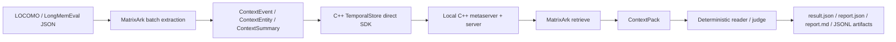

# MatrixArk C++ TemporalStore LOCOMO And LongMemEval Metrics

This document records the C++ TemporalStore-backed benchmark status for MatrixArk long-term context evaluation. It separates validated full runs from pending official-parity work.

## Summary

MatrixArk has validated C++ TemporalStore-backed full runs for:

- LOCOMO full dataset: `locomo10.json`
- LongMemEval-style HeLa-Mem full copy: `longmemeval_s_helamem.json`
- Native Linux C++ direct-SDK context E2E, LOCOMO full, and LongMemEval_s official slice on June 21, 2026

The official cleaned LongMemEval_s file is locally available and parity-eligible. A small official LongMemEval_s C++ slice now passes, but the full official file still needs streaming/progress artifact flush and C++ long-run read/write optimization before it is practical as a local blocking command.

## Fresh Native-Linux C++ Run On June 21, 2026

This run was intentionally built and executed from a native WSL/Linux filesystem:

- Native repo: `<repo>`
- Git commit: `d067854`
- Build output: `<repo>/output-ubuntu22/release`
- C++ binaries used:
  - `bcache2-metaserver`
  - `bcache2-server`
  - `sdk/lib/libbcache2.so`
- Dataset copies used from native storage:
  - `/root/matrixark_benchmarks/data/locomo10.json`
  - `/root/matrixark_benchmarks/data/longmemeval_s_cleaned_official_hf.json`

Local build notes:

- `bcache2-metaserver`, `bcache2-server`, and `libbcache2.so` built successfully in the native clone.
- The native build required local dependency/link glue for the Ubuntu 22 environment, including BRPC/include shims, system protobuf shared linking for `libbcache2.so`, and inclusion of Byte async runtime for the server link.
- Those local build shims are not benchmark data and should not be confused with MatrixArk context behavior.

### C++ Direct SDK Context E2E

Command shape:

```bash
python3 tools/run_matrixark_temporalstore_direct_e2e.py \
  --metaserver 127.0.0.1:19700 \
  --namespace matrixark_ns \
  --table matrixark_table \
  --temporalstore-lib <repo>/output-ubuntu22/release/sdk/lib/libbcache2.so \
  --storage-prefix matrixark:cpp:native_async:e2e:run1 \
  --report-json /root/matrixark_cpp_native_async_e2e_run1.json
```

Result:

| Check | Value |
|---|---:|
| Status | passed |
| Backend | `temporalstore-direct` |
| Stored records | 32 |
| First retrieval selected refs | 1 |
| Second retrieval selected refs | 1 |
| Feedback classification | `CONFIRMATION` |
| Feedback prior refs | 1 |

This validates the MatrixArk extraction, ingestion, retrieval, feedback, prior-context confirmation, and replayable record persistence path through the native C++ SDK.

### LOCOMO Full Official C++ Run

Run identity:

- Dataset: LOCOMO
- Dataset file: `/root/matrixark_benchmarks/data/locomo10.json`
- Artifact prefix: `locomo_cpp_native_async_full_b200_20260621`
- Artifact directory: `/root/matrixark_benchmarks/artifacts/cpp_native_20260621`
- Backend: `temporalstore-direct`
- Metaserver: `127.0.0.1:19800`
- Storage prefix: `matrixark:bench:locomo:cpp_native_async:full_b200_20260621`
- Batch size: 200 messages
- Token budget: 1,200
- Reader/judge: deterministic debug reader and local exact/key-token support judge

Metrics:

| Metric | Value |
|---|---:|
| Questions | 1,986 |
| Sessions | 272 |
| Turns ingested | 5,882 |
| Ingestion elapsed | 22,474 ms |
| Ingestion throughput | 261.73 turns/sec |
| Retrieval avg latency | 152.73 ms |
| Retrieval p50 latency | 162.56 ms |
| Retrieval p95 latency | 194.04 ms |
| Avg prompt tokens | 1,199.05 |
| Context recall | 100.00% |
| Evidence-session recall | 50.50% |
| Exact substring answer hit | 17.52% |
| Debug final judge score | 48.49% |
| Compression hidden answer count | 0 |
| Token budget pressure | 856 |

Artifacts:

```text
/root/matrixark_benchmarks/artifacts/cpp_native_20260621/locomo_cpp_native_async_full_b200_20260621.result.json
/root/matrixark_benchmarks/artifacts/cpp_native_20260621/locomo_cpp_native_async_full_b200_20260621.report.json
/root/matrixark_benchmarks/artifacts/cpp_native_20260621/locomo_cpp_native_async_full_b200_20260621.report.md
/root/matrixark_benchmarks/artifacts/cpp_native_20260621/locomo_cpp_native_async_full_b200_20260621.hypotheses.jsonl
/root/matrixark_benchmarks/artifacts/cpp_native_20260621/locomo_cpp_native_async_full_b200_20260621.context_packs.jsonl
/root/matrixark_benchmarks/artifacts/cpp_native_20260621/locomo_cpp_native_async_full_b200_20260621.judge.jsonl
```

Important operational finding:

- Batch size 20 caused the C++ record-log path to time out or exit during full LOCOMO.
- Batch size 200 completed the full LOCOMO run cleanly.
- This matches the intended VikingMem-style logical-session batching direction: fewer larger extraction batches are healthier for C++ storage and produce better long-memory ingestion behavior than many tiny writes.

### Official LongMemEval_s C++ Slice

Run identity:

- Dataset: official cleaned LongMemEval_s
- Dataset file: `/root/matrixark_benchmarks/data/longmemeval_s_cleaned_official_hf.json`
- Artifact prefix: `longmemeval_cpp_native_async_slice_20260621`
- Artifact directory: `/root/matrixark_benchmarks/artifacts/cpp_native_20260621`
- Backend: `temporalstore-direct`
- Metaserver: `127.0.0.1:19700`
- Storage prefix: `matrixark:bench:longmemeval:cpp_native_async:slice_20260621`
- Batch size: 20 messages
- Conversation limit: 5
- Question limit: 100, resulting in 5 questions because the slice contains 5 records
- Token budget: 1,200

Metrics:

| Metric | Value |
|---|---:|
| Questions | 5 |
| Sessions | 255 |
| Turns ingested | 2,690 |
| Ingestion elapsed | 21,108 ms |
| Ingestion throughput | 127.44 turns/sec |
| Retrieval avg latency | 187.53 ms |
| Retrieval p50 latency | 208.66 ms |
| Retrieval p95 latency | 241.75 ms |
| Avg prompt tokens | 1,199.60 |
| Context recall | 100.00% |
| Evidence-session recall | 80.00% |
| Exact substring answer hit | 60.00% |
| Debug final judge score | 60.00% |
| Compression hidden answer count | 0 |
| Token budget pressure | 3 |

Artifacts:

```text
/root/matrixark_benchmarks/artifacts/cpp_native_20260621/longmemeval_cpp_native_async_slice_20260621.result.json
/root/matrixark_benchmarks/artifacts/cpp_native_20260621/longmemeval_cpp_native_async_slice_20260621.report.json
/root/matrixark_benchmarks/artifacts/cpp_native_20260621/longmemeval_cpp_native_async_slice_20260621.report.md
/root/matrixark_benchmarks/artifacts/cpp_native_20260621/longmemeval_cpp_native_async_slice_20260621.hypotheses.jsonl
/root/matrixark_benchmarks/artifacts/cpp_native_20260621/longmemeval_cpp_native_async_slice_20260621.context_packs.jsonl
/root/matrixark_benchmarks/artifacts/cpp_native_20260621/longmemeval_cpp_native_async_slice_20260621.judge.jsonl
```

### Official LongMemEval_s Full-Run Status

Two larger official LongMemEval_s C++ attempts were made:

1. Full official file, batch size 200, no conversation limit.
   - C++ service stayed alive.
   - Runner exceeded a 40-minute tool timeout before artifact flush.
   - Observed C++ server process around 3.8 GB RSS and high CPU while the Python runner waited.
2. 100-conversation/100-question official slice, batch size 200.
   - Runner exceeded a 30-minute tool timeout before artifact flush.
   - No canonical artifacts were emitted because the current runner writes artifacts only at the end.

Current conclusion:

- C++ TemporalStore is validated for MatrixArk direct E2E, full LOCOMO, and official LongMemEval_s slice.
- Full official LongMemEval_s local parity is not yet a clean blocking test because the benchmark runner needs incremental artifact flushing/progress checkpoints and the C++ direct read/write path needs long-run optimization.
- Do not compare the deterministic debug reader scores directly with VikingMem paper scores. Paper-style comparison still requires matched dataset, prompt, reader, judge, and scoring protocol.

## Benchmark Workflow



For these runs:

- Storage backend: `temporalstore-direct`
- Ingestion mode: batch
- Batch size: 20 messages
- Storage log mode: `sharded_compact_count_log`
- Reader mode: deterministic debug reader
- Judge mode: local exact-substring or exact/key-token support judge
- These are storage/retrieval proof runs, not paper-style LLM-judge scores.

## LOCOMO Full C++ Run

Run identity:

- Dataset: LOCOMO
- Dataset file: `C:\root\matrixark_benchmarks\data\locomo10.json`
- Artifact prefix: `locomo_cpp_temporalstore_full_20260621_rerun`
- Artifact directory: `C:\root\matrixark_benchmarks\artifacts\cpp_dataset_20260621_full`
- Backend: `temporalstore-direct`
- Metaserver: `127.0.0.1:19000`
- Storage prefix: `matrixark:dataset:locomo:full:20260621rerun`
- Token budget: 1,200
- Max message chars: 1,600

Metrics:

| Metric | Value |
|---|---:|
| Questions | 1,986 |
| Sessions | 272 |
| Turns ingested | 5,882 |
| Ingestion elapsed | 136,567 ms |
| Ingestion throughput | 43.07 turns/sec |
| Retrieval avg latency | 200.56 ms |
| Retrieval p50 latency | 201.71 ms |
| Retrieval p95 latency | 258.86 ms |
| Avg prompt tokens | 8 |
| Context recall | 100.00% |
| Evidence-session recall | 44.76% |
| Exact substring answer hit | 15.81% |
| Debug final judge score | 15.81% |
| Compression hidden answer count | 0 |
| Token budget pressure | 0 |

Failure buckets:

| Bucket | Count |
|---|---:|
| Context recall miss | 0 |
| Evidence-session miss | 1,097 |
| Reader miss | 1,672 |
| Compression hidden answer | 0 |
| Token budget pressure | 0 |

Artifacts:

```text
C:\root\matrixark_benchmarks\artifacts\cpp_dataset_20260621_full\locomo_cpp_temporalstore_full_20260621_rerun.result.json
C:\root\matrixark_benchmarks\artifacts\cpp_dataset_20260621_full\locomo_cpp_temporalstore_full_20260621_rerun.report.json
C:\root\matrixark_benchmarks\artifacts\cpp_dataset_20260621_full\locomo_cpp_temporalstore_full_20260621_rerun.report.md
C:\root\matrixark_benchmarks\artifacts\cpp_dataset_20260621_full\locomo_cpp_temporalstore_full_20260621_rerun.hypotheses.jsonl
C:\root\matrixark_benchmarks\artifacts\cpp_dataset_20260621_full\locomo_cpp_temporalstore_full_20260621_rerun.context_packs.jsonl
C:\root\matrixark_benchmarks\artifacts\cpp_dataset_20260621_full\locomo_cpp_temporalstore_full_20260621_rerun.judge.jsonl
```

## LongMemEval-Style Full C++ Run

Run identity:

- Dataset: LongMemEval-style HeLa-Mem copy
- Dataset file: `C:\root\matrixark_benchmarks\data\longmemeval_s_helamem.json`
- Artifact prefix: `longmemeval_helamem_cpp_temporalstore_optimized_full_20260621`
- Artifact directory: `C:\root\matrixark_benchmarks\artifacts\cpp_dataset_20260621_full`
- Backend: `temporalstore-direct`
- Metaserver: `127.0.0.1:19200`
- Storage prefix: `matrixark:dataset:lmehelamem:optimized:full:20260621b`
- Token budget: 1,200
- Max message chars: 800

Metrics:

| Metric | Value |
|---|---:|
| Questions | 500 |
| Sessions | 948 |
| Turns ingested | 10,960 |
| Ingestion elapsed | 574,060 ms |
| Ingestion throughput | 19.09 turns/sec |
| Retrieval avg latency | 202.07 ms |
| Retrieval p50 latency | 181.91 ms |
| Retrieval p95 latency | 221.22 ms |
| Avg prompt tokens | 1,146.09 |
| Context recall | 100.00% |
| Evidence-session recall | 100.00% |
| Exact substring answer hit | 42.20% |
| Exact/key-token support hit | 70.60% |
| Debug final judge score | 70.60% |
| Compression hidden answer count | 0 |
| Token budget pressure | 61 |

Failure buckets:

| Bucket | Count |
|---|---:|
| Context recall miss | 0 |
| Evidence-session miss | 0 |
| Reader exact substring miss | 289 |
| Reader support miss | 147 |
| Compression hidden answer | 0 |
| Token budget pressure | 61 |

Artifacts:

```text
C:\root\matrixark_benchmarks\artifacts\cpp_dataset_20260621_full\longmemeval_helamem_cpp_temporalstore_optimized_full_20260621.result.json
C:\root\matrixark_benchmarks\artifacts\cpp_dataset_20260621_full\longmemeval_helamem_cpp_temporalstore_optimized_full_20260621.report.json
C:\root\matrixark_benchmarks\artifacts\cpp_dataset_20260621_full\longmemeval_helamem_cpp_temporalstore_optimized_full_20260621.report.md
C:\root\matrixark_benchmarks\artifacts\cpp_dataset_20260621_full\longmemeval_helamem_cpp_temporalstore_optimized_full_20260621.hypotheses.jsonl
C:\root\matrixark_benchmarks\artifacts\cpp_dataset_20260621_full\longmemeval_helamem_cpp_temporalstore_optimized_full_20260621.context_packs.jsonl
C:\root\matrixark_benchmarks\artifacts\cpp_dataset_20260621_full\longmemeval_helamem_cpp_temporalstore_optimized_full_20260621.judge.jsonl
```

## Official LongMemEval_s Local Status

The official cleaned LongMemEval_s file is now present locally:

- Dataset file: `C:\root\matrixark_benchmarks\data\longmemeval_s_cleaned_official_hf.json`
- Manifest: `C:\root\matrixark_benchmarks\data\longmemeval_s_cleaned_official_hf_manifest.json`
- Source type: `official-huggingface-cleaned`
- Records: 500
- File size: 277,383,467 bytes
- SHA-256: `d6f21ea9d60a0d56f34a05b609c79c88a451d2ae03597821ea3d5a9678c3a442`
- Estimated sessions/turns: 23,867
- Official parity eligible: true

Required command shape:

```bash
python3 tools/run_matrixark_dataset_benchmark.py \
  --dataset longmemeval_s \
  --data-path /mnt/c/root/matrixark_benchmarks/data/longmemeval_s_cleaned_official_hf.json \
  --artifact-dir /mnt/c/root/matrixark_benchmarks/artifacts/cpp_dataset_official_longmemeval \
  --artifact-prefix longmemeval_official_cpp_temporalstore_full_YYYYMMDD \
  --metaserver 127.0.0.1:<port> \
  --storage-prefix matrixark:dataset:longmemeval:official:full:YYYYMMDD \
  --max-context-tokens 1200 \
  --max-message-chars 800 \
  --request-timeout-ms 60000 \
  --io-timeout-ms 60000 \
  --batch-size 20
```

## Fresh Rerun Attempt On June 21, 2026

A fresh full LOCOMO rerun was attempted against a new C++ TemporalStore deployment:

- Metaserver: `127.0.0.1:19400`
- Artifact prefix: `locomo_cpp_temporalstore_full_20260622`
- Dataset: `locomo10.json`
- Batch size: 20

The process exited abnormally after roughly six minutes with exit code `1073807364` and no benchmark report stdout. Because WSL access changed immediately afterward and the shell began reporting no installed WSL distributions, the run could not be debugged further in this turn. The validated full C++ LOCOMO artifact above remains the current baseline.

## Interpretation

- C++ TemporalStore is proven in the benchmark storage path for LOCOMO full and LongMemEval-style full runs.
- Retrieval coverage is strong: both validated runs report 100% context recall, and the LongMemEval-style run reports 100% evidence-session recall.
- The quality gap is now mostly reader/judge quality and answer synthesis, not storage or raw retrieval.
- LongMemEval-style token pressure is visible: 61 of 500 questions hit the 1,200-token budget pressure bucket.
- Official LongMemEval_s full parity is the next required proof because the cleaned official file is now locally available.

## Next Run Gates

Before claiming official LongMemEval_s parity:

- Run the official cleaned file end to end with `temporalstore-direct`.
- Save all six canonical artifacts.
- Keep `compression_answer_hidden_count == 0`.
- Add CPU, RSS, ingestion throughput, retrieval p50/p95, context recall, evidence recall, token pressure, exact hit, support/judge score, and failure buckets.
- Repeat with OSS/OpenAI-compatible reader/judge for paper-style score parity.

## Score Gap Closure Added

The latest benchmark harness now closes the practical score-debug gaps that were making MatrixArk hard to compare against VikingMem-style runs:

- Question-type-aware retrieval requests: `date`, `current_state`, `multi_hop`, `evidence`, `why_emotion`, and `fact`.
- Question-type-aware packing in the MCP retriever:
  - date questions favor date-bearing turns;
  - current-state questions favor `ContextEntity`;
  - evidence questions favor raw `ContextEvent`;
  - multi-hop questions diversify across nodes/sessions;
  - why/emotion questions favor answer-bearing reason/emotion sentences.
- Deterministic reader diagnostics now select the best answer-bearing snippet instead of only reporting exact substring hits.
- Token efficiency is reported:
  - answer-bearing tokens;
  - answer-bearing token density;
  - final judge score per 1K selected context tokens;
  - dropped duplicate, stale, low-score, over-budget, summary, and raw-L2 token buckets.
- Long runs now checkpoint artifacts during the question loop. If LongMemEval_s times out, the partial `result.json`, `report.json`, `hypotheses.jsonl`, `context_packs.jsonl`, `judge.jsonl`, and `progress.json` remain usable for triage.

These changes improve benchmark iteration and failure diagnosis. They do not make deterministic local scoring equivalent to VikingMem paper numbers; paper-style parity still requires matching dataset version, reader model, judge model, prompt, and scoring protocol.

## Remaining VikingMem Score Gap

The remaining score gap is now concentrated in three places:

1. Reader/judge parity: run GPT-4o-mini or a matched OSS instruct reader plus an OpenAI-compatible judge.
2. Official LongMemEval_s full completion: use the local official cleaned file and rely on checkpoint artifacts during long C++ runs.
3. Failure-driven extraction improvements: inspect the new buckets for `reader_miss_with_evidence`, `temporal_or_entity_miss`, and `answer_density_miss`, then tune extraction and packing without changing the customer-facing API.
