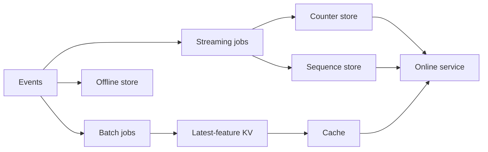
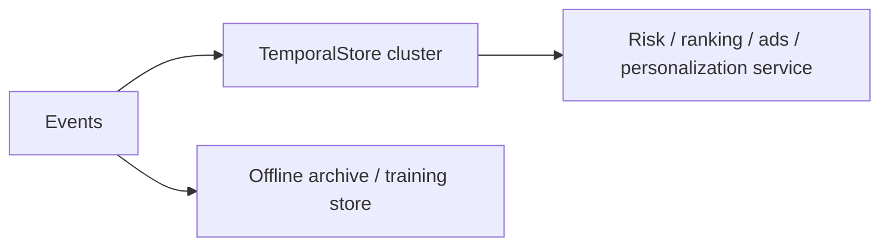
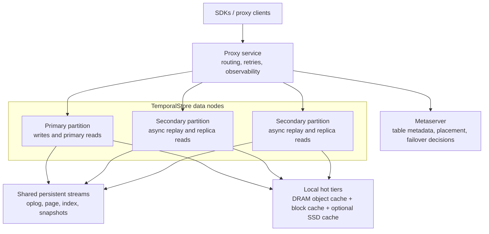

# TemporalStore One-Cluster Architecture

TemporalStore's product direction is one online serving cluster for several feature-serving patterns that usually require separate systems:

- latest profile lookup
- high-cardinality temporal aggregation
- risk and fraud counters
- frequency caps
- long sequence features
- persisted online state with hot/cold serving

The goal is not to replace every offline system. Training data, replay data, audits, and large analytical joins still belong in an offline lake, warehouse, or offline feature store. The goal is to remove unnecessary online fragmentation: one online cluster should serve the feature state that production traffic needs now.

## Why One Cluster

Many teams end up with this shape:



This creates duplicated routing, duplicated failover, duplicated materialization logic, and many consistency questions.

TemporalStore aims for this online shape:



The offline path remains, but the online serving path becomes one cluster with multiple data models.

## Cluster Shape



A production cluster can expose both direct SDK and proxy SDK paths:

- direct SDK: lower latency, client owns topology refresh and routing
- proxy SDK: simpler customer integration, proxy owns routing and retries

For early cloud service testing, one metaserver node plus two data nodes is enough to validate data paths. For production, the metaserver should be replicated and the data node count should scale by partition count, memory pressure, and write throughput.

## Data Models In One Cluster

TemporalStore should support multiple online-serving models in the same cluster.

| Model | What It Stores | Example |
|---|---|---|
| Latest KV / Hash | latest profile fields | `user_id -> age, city, device_type` |
| TemporalAggregate | bucketed counters/sums/min/max | `device_id -> failed logins in last 30 min` |
| Risk / Frequency Cap | bounded counters by entity and dimension | `campaign_id:user_id -> impressions in last hour` |
| Sequence Feature | timestamped behavior rows | `user_id -> recent clicked item ids` |
| Large Object / Page-backed State | objects that may outgrow memory | long profile blobs or cold sequence pages |

This is the key product claim: the user should not need a different online store for every feature shape.

## TemporalAggregate Write Path

TemporalAggregate is the clearest example of why one online cluster matters.

An ingest request contains:

```text
key              device_123
metric           failed_login_count
dimensions       country=US, result=failed
timestamp_ms     event time
bucket_width_ms  60000
value            1
op               COUNT
```

The server computes:

```text
bucket_id = timestamp_ms / bucket_width_ms
field = encode(metric, bucket_width, sorted_dimensions, bucket_id)
```

Then it updates a bucket inside one hash object:

```text
HashObject(device_123)[failed_login_count|60000|country=US&result=failed|bucket_id] += 1
```

This means repeated events for the same `(key, metric, dimensions, bucket)` collapse into one aggregate cell. The system does not need to store or scan every raw event for count/sum/min/max features.

## TemporalAggregate Query Path

A query asks for a window:

```text
key = device_123
metric = failed_login_count
dimensions = country=US, result=failed
start = now - 30 minutes
end = now
bucket_width = 1 minute
op = COUNT
```

The server computes the bucket range:

```text
start_bucket = start / bucket_width
end_bucket = (end - 1) / bucket_width + 1
```

Then it range-scans only matching bucket fields and folds the values:

```text
COUNT/SUM -> add bucket values
MIN       -> minimum bucket value
MAX       -> maximum bucket value
```

Query cost is proportional to matching bucket count, not raw event count. A 30-minute query at one-minute granularity scans up to 30 bucket cells for one exact dimension combination.

## Why This Is More Flexible Than Offline Aggregation

Offline aggregation works well for stable daily features:

```text
feature definition -> batch job -> materialized table -> online lookup
```

But risk, fraud, ads, and recommendation features change quickly:

- change the serving window from 30 minutes to 10 minutes
- add a filter such as `country=US`
- split by `result=failed`
- add a new metric
- test a different bucket width
- serve a new entity type such as `ip + account_id`

With an offline-only pipeline, many of these changes require a new job and a new materialized table. With TemporalStore, the online model can accept new metrics and dimensions directly. Teams can add serving features without creating a separate stream job for every rule.

TemporalStore still should export or mirror events to offline storage for training and audit. The difference is that offline no longer has to be the only place where the feature is computed.

## Example: One Cluster For Risk And Feature Serving

```mermaid
sequenceDiagram
    participant App as Application
    participant TS as TemporalStore
    participant Off as Offline archive

    App->>TS: INCR device failed_login_count(country=US,result=failed)
    App->>TS: INCR campaign:user impression_count(placement=feed)
    App->>TS: ADD user sequence row(item_id, action, timestamp)
    App->>Off: Append raw event for training/audit
    App->>TS: Query failed logins last 30 min
    TS-->>App: count + per-bucket values
    App->>TS: Query recent behavior sequence
    TS-->>App: filtered rows
```

One cluster can serve:

- risk counters for login abuse
- frequency caps for ads
- latest profile features for ranking
- long behavior sequences for inference
- persisted online state that can be recovered after restart

## Consistency Model

The current design is primary-write with asynchronous secondary replay:

- writes go to the primary partition
- primary reads are freshest
- secondary reads may lag under write load
- secondary lag must be measured and surfaced in metrics

For features where exact freshness matters, route reads to the primary or require a freshness guard. For high-QPS read-heavy serving where small staleness is acceptable, secondary reads can help scale reads.

Future production work should add stronger failover semantics, clearer read consistency options, and lag-aware routing.

## Hot And Cold Serving

TemporalStore keeps hot objects and indexes in memory. Page/block data can be cached locally and persisted through shared streams.

The serving hierarchy is:

```text
hot object state in memory
local block cache / optional SSD cache
shared persistent streams
```

For large feature objects or cold historical windows, this lets the cluster keep queryable state beyond pure memory capacity. The customer tradeoff is clear: hot data should stay in memory for low latency; cold data remains queryable but costs more latency.

## What Should Be Open Source First

The first open-source milestone should focus on the one-cluster online-serving story:

- latest KV/hash lookup
- TemporalAggregate with count/sum/min/max
- sequence feature model with bounded filters
- direct C++ SDK and proxy SDK
- simple metaserver deployment
- shared-file or object-store-compatible persistence path
- metrics and monitoring UI
- benchmark scripts for high-cardinality temporal features

Avoid overclaiming production features until they are implemented and tested:

- strong failover
- multi-region replication
- multi-tenant control plane
- wildcard dimension query planner
- approximate distinct count
- sub-key TTL for every bucket
- managed cloud autoscaling

## Startup Positioning

TemporalStore is strongest when positioned as a real-time feature serving engine, not as a generic cache clone.

The pitch:

```text
One online cluster for high-cardinality temporal features,
risk counters, frequency caps, long sequence features,
and persisted feature serving.
```

The strongest buyer pain is not plain key-value lookup. It is the operational cost of building and maintaining many separate online feature pipelines. TemporalStore wins if it lets teams ship new online temporal features faster while keeping serving latency and infrastructure cost under control.
