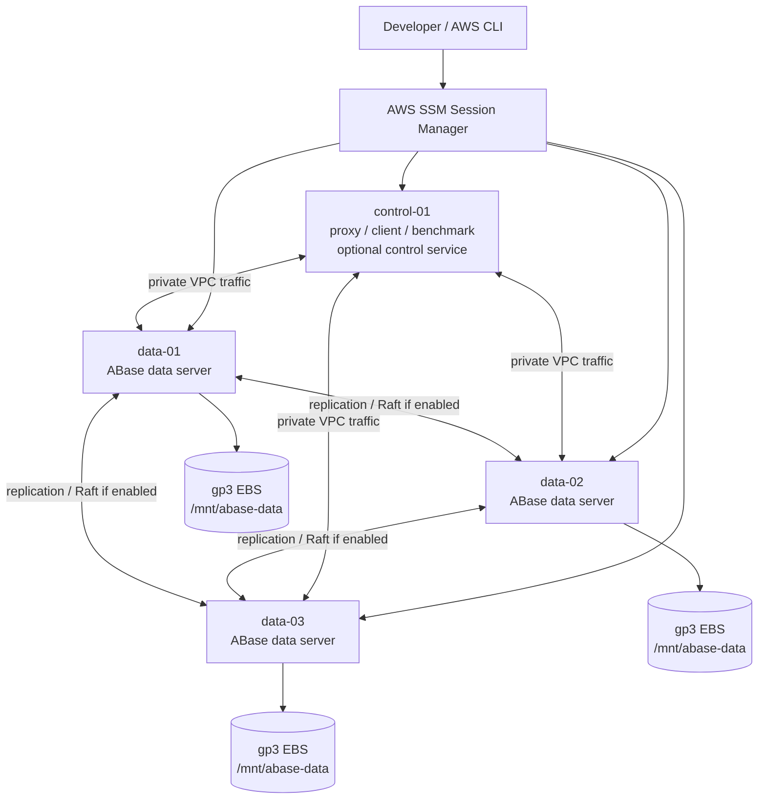
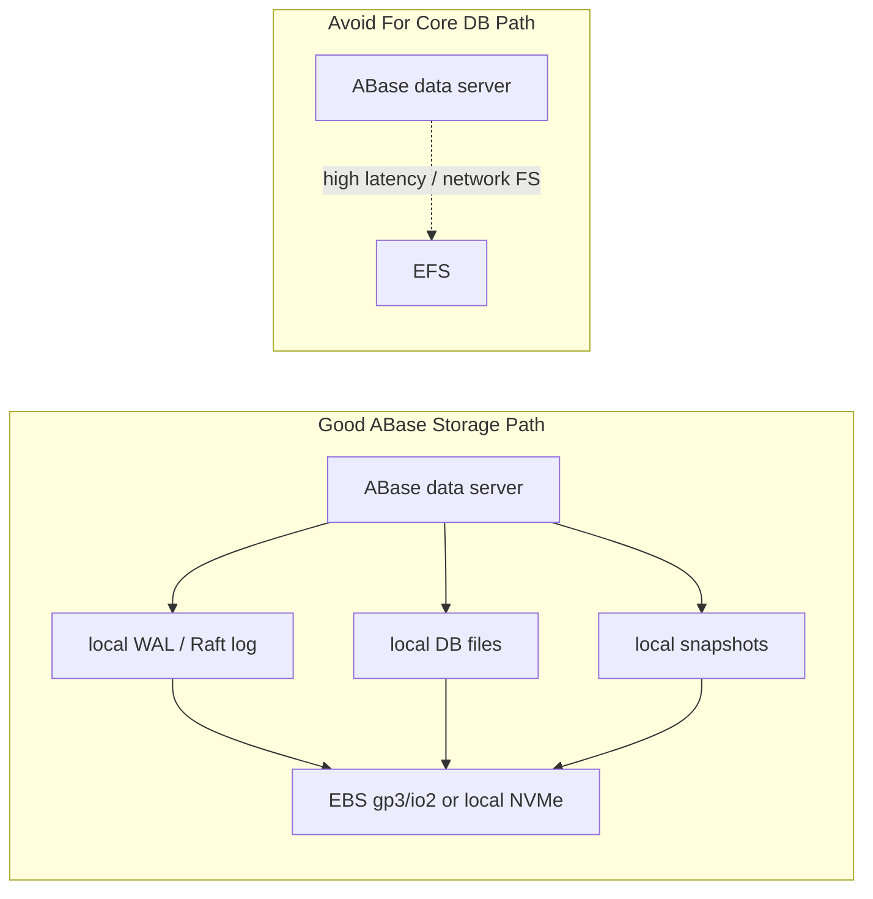
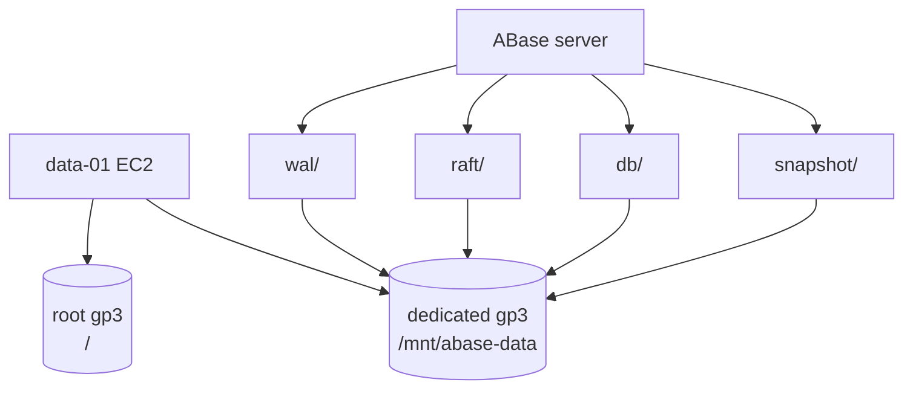
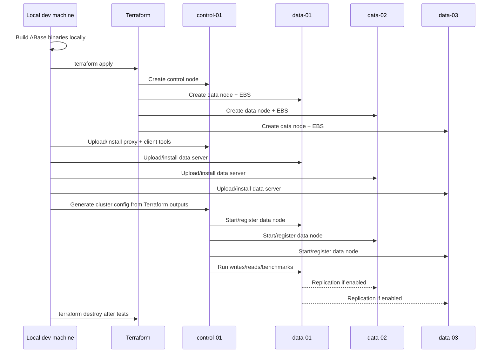
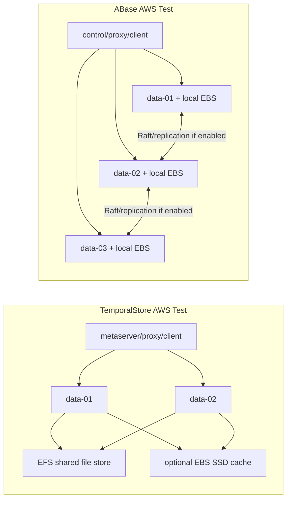

# ABase AWS Deployment Design

This document describes a small AWS deployment for validating ABase as a distributed KV/database service. It intentionally mirrors the operational style of the TemporalStore AWS test cluster, but uses a different storage topology because ABase is expected to behave like a replicated database with local persistent storage.

The Terraform stack lives at:

```text
infra/aws/abase-test
```

## Objectives

The first AWS milestone is not a production deployment. It is a repeatable test bed for answering concrete engineering questions:

- Can the local ABase binaries run on clean Ubuntu 22.04 EC2 instances?
- Can data nodes use dedicated local EBS volumes for DB, WAL, Raft log, and snapshot paths?
- Can proxy/client traffic reach the data nodes through private IPs?
- Can the cluster survive one data-node restart?
- If the local ABase build includes Raft or replica logic, can replicas catch up after failure?
- What are baseline p50/p95/p99 latencies for write, read, mixed traffic, and large values?

## High-Level Topology

Default shape:

- 1 control/proxy/client node
- 3 data nodes
- 1 public subnet in one availability zone
- SSM access enabled
- SSH closed by default
- one dedicated gp3 EBS data volume per data node



## AWS Resources

Default resource sizing is intentionally small:

| Role | Count | Instance | Root EBS | Extra Data EBS | Purpose |
| --- | ---: | --- | ---: | ---: | --- |
| control/proxy/client | 1 | `t3.small` | 20 GB gp3 | none | run proxy, client tools, benchmark tools, optional control service |
| data node | 3 | `c7i.large` | 20 GB gp3 | 30 GB gp3 | run ABase storage/data process |

The default data volume settings are:

```text
data_volume_gb               = 30
data_volume_iops             = 3000
data_volume_throughput_mbps  = 125
```

These are cheap smoke-test settings. For meaningful database performance testing, increase instance size, EBS size, IOPS, and throughput.

## Why ABase Uses Local EBS, Not EFS

TemporalStore can test EFS/shared-file mode because its shared-store path is designed around page, index, oplog, and snapshot streams that can be read by multiple nodes.

ABase should use local block storage for its core database files. ABase-style systems usually need low-latency local persistence for:

- Raft logs or replication logs
- WAL files
- RocksDB/TerarkDB/LSM files
- compaction output
- snapshots
- high-throughput random reads and writes

EFS is a network filesystem. It is useful for shared artifacts, debug bundles, or backup staging, but it should not be the default path for ABase database files. For core ABase storage, prefer:

- `gp3` for cheap functional and moderate performance testing
- `io2` for stronger latency and durability testing
- instance NVMe for maximum local performance when data loss on instance termination is acceptable or replication covers durability



## Node Filesystem Layout

Control node:

```text
/opt/abase
  binaries/
  configs/
  clients/
  benchmarks/

/var/log/abase
  proxy.log
  client.log
  benchmark.log
  control.log
```

Data node:

```text
/opt/abase
  binaries/
  configs/

/mnt/abase-data
  db/
  wal/
  raft/
  snapshot/
  tmp/

/var/log/abase
  server.log
  raft.log
  compaction.log
```

Terraform attaches each data volume as `/dev/sdf`. On AWS Nitro instances, Linux usually exposes it as `/dev/nvme1n1`. The data-node user-data script formats the device as XFS and mounts it at `/mnt/abase-data`.



## Terraform Layout

```text
infra/aws/abase-test/
  versions.tf
  variables.tf
  main.tf
  outputs.tf
  user_data_control_node.sh.tftpl
  user_data_data_node.sh.tftpl
  README.md
```

What Terraform creates:

- VPC
- internet gateway
- one public subnet
- route table
- node security group
- EC2 IAM role with SSM
- optional S3 artifact read policy
- control EC2 instances
- data EC2 instances
- one dedicated EBS data volume per data instance

What Terraform does not do yet:

- build ABase
- upload artifacts
- generate ABase configs
- register tables
- start ABase services
- run benchmarks

Those steps need the exact local ABase binary names, flags, config files, and table-management commands.

## Deployment Commands

From:

```text
infra/aws/abase-test
```

Initialize:

```powershell
$env:AWS_PROFILE="temporalstore"
terraform init
```

Validate:

```powershell
terraform validate
```

Preview:

```powershell
terraform plan `
  -var "aws_profile=temporalstore" `
  -var "aws_region=us-west-2" `
  -var "availability_zone=us-west-2a"
```

Create:

```powershell
terraform apply `
  -var "aws_profile=temporalstore" `
  -var "aws_region=us-west-2" `
  -var "availability_zone=us-west-2a"
```

Destroy after testing:

```powershell
terraform destroy `
  -var "aws_profile=temporalstore" `
  -var "aws_region=us-west-2" `
  -var "availability_zone=us-west-2a"
```

The operating rule is:

```text
build locally -> launch AWS -> test -> collect results -> destroy AWS
```

## Access

SSH is closed by default. Use SSM:

```powershell
aws ssm start-session `
  --profile temporalstore `
  --region us-west-2 `
  --target <instance-id>
```

Terraform outputs convenient SSM commands for:

- `data-01`
- `control-01`

If an admin UI or monitoring page is later added, expose it only to your current IP:

```powershell
terraform apply -var "allowed_ui_cidr=<your-ip>/32"
```

## Deployment Workflow



## Service Placement

Control node should eventually run:

- ABase proxy, if available
- ABase CLI/client SDK tools
- benchmark binaries
- table/namespace creation tool
- optional metaserver/control process
- optional monitoring UI

Data nodes should eventually run:

- ABase server/storage process
- replication/Raft worker, if separate
- compaction/background workers
- metrics endpoint, if available

Expected ABase service configuration:

```text
node_id         = data-01
listen_addr     = <private-ip>:<server-port>
data_dir        = /mnt/abase-data/db
wal_dir         = /mnt/abase-data/wal
raft_log_dir    = /mnt/abase-data/raft
snapshot_dir    = /mnt/abase-data/snapshot
cluster_peers   = data-01,data-02,data-03 private IPs
```

The exact names will change once we map the local ABase codebase.

## Test Plan

### 1. Infrastructure Smoke

Verify AWS and host layout:

- all instances appear in Terraform output
- SSM can connect to every node
- data nodes have `/mnt/abase-data`
- data volume is XFS
- nodes can reach each other by private IP

### 2. Binary Smoke

Verify local ABase artifacts:

- server binary starts with `--help`
- proxy binary starts with `--help`
- client or benchmark binary starts with `--help`
- required shared libraries exist on Ubuntu 22.04
- logs are written under `/var/log/abase`

### 3. Single-Node Functional

Before testing replication:

- start one data node
- create one table/namespace
- write plain string KV
- read plain string KV
- restart server
- verify data survives restart

### 4. Three-Node Functional

Then validate cluster behavior:

- start all three data nodes
- create one replicated table/namespace
- write through proxy or client
- read from leader/primary
- read from follower/replica if supported
- verify data distribution

### 5. Failure And Recovery

Basic failure cases:

- stop one follower
- continue writes if quorum remains
- restart follower
- verify catch-up
- stop leader/primary
- verify whether failover exists
- verify RPO/RTO behavior

### 6. Performance

Measure:

- write QPS
- read QPS
- mixed read/write QPS
- p50/p95/p99 latency
- large-value latency
- hot-key latency
- disk usage growth
- compaction behavior
- replication lag, if exposed

Recommended first benchmark matrix:

| Test | Keys | Value Size | Read/Write | Notes |
| --- | ---: | ---: | --- | --- |
| small point KV | 1M | 128 B | 95/5 | cache-like serving |
| balanced KV | 1M | 1 KB | 50/50 | common online KV |
| write-heavy | 1M | 1 KB | 10/90 | WAL/Raft pressure |
| large value | 100K | 16 KB | 95/5 | object/value path |
| hot key | 1K hot keys | 128 B | 99/1 | hotspot behavior |

## ABase vs TemporalStore Deployment



Key difference:

- TemporalStore validates shared-storage serving.
- ABase validates local-disk distributed KV/database behavior.

## Cost Control

Keep these defaults for short smoke tests:

```text
control_node_instance_type = t3.small
data_node_instance_type    = c7i.large
data_volume_gb             = 30
root_volume_gb             = 20
```

Destroy after tests:

```powershell
terraform destroy
```

Stopping EC2 instances reduces compute charges, but EBS volumes, public IPs, snapshots, and other resources can still cost money. For this test stack, prefer `terraform destroy` when idle.

## Open Items

The next engineering step is mapping the local ABase codebase into this AWS shape:

- server binary name
- proxy binary name
- client or benchmark binary name
- required shared libraries
- config file format
- table/namespace creation command
- storage path flags
- Raft or replication flags
- metrics endpoint
- health-check endpoint
- process supervision with systemd

Once those are known, this Terraform stack can grow from infrastructure-only into a one-command deploy-and-test environment.
