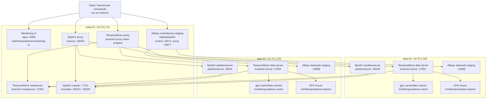

# AWS One-Cluster Binary Topology

This document describes how the current AWS test cluster places TemporalStore,
ByteKV, and ABase binaries on the same small EC2 cluster.

The operating rule is: reuse one shared cluster for comparison tests. Do not
create separate ABase or ByteKV clusters for routine testing.

## Cluster Shape

| Node | Instance | Private IP | Instance type | Main purpose |
|---|---|---|---|---|
| `meta-01` | `i-003c930417f7ee609` | `10.70.1.79` | `t3.small` | control plane, proxy, monitoring UI, client/benchmark host |
| `data-01` | `i-0724d90b323786546` | `10.70.1.163` | `c7i.large` | data services, cache/data EBS, EFS mount |
| `data-02` | `i-096334bd8cc7ab259` | `10.70.1.202` | `c7i.large` | data services, cache/data EBS, EFS mount |

The metaserver node does not mount EFS. Data nodes mount EFS and the extra gp3
cache/data volume.

## Topology

## Binary Placement

| System | Binary or runtime | Node | Path | Status in current AWS stack |
|---|---|---|---|---|
| TemporalStore | `bcache2-metaserver` | `meta-01` | `/opt/temporalstore/bin` | runtime artifact staged; used by smoke/scale scripts |
| TemporalStore | `bcache2-proxy` | `meta-01` | `/opt/temporalstore/bin` | packaged when present; proxy-path tests use it |
| TemporalStore | `bcache2-server` | `data-01`, `data-02` | `/opt/temporalstore/bin` | runtime artifact staged; scale scripts start data servers |
| TemporalStore | C/C++ client libs and client tools | `meta-01` | `/opt/temporalstore/lib`, `/opt/temporalstore/sdk/lib`, `/opt/temporalstore/bin` | client/benchmark host is `meta-01` |
| TemporalStore | monitoring UI | `meta-01` | `/opt/temporalstore/monitoring-ui` | served by nginx on `8088` |
| ByteKV | `kvmaster` | `meta-01` | `/opt/bytekv/bin/kvmaster` | concrete systemd bootstrap |
| ByteKV | TSO service | `meta-01` | inside `kvmaster` config/runtime | config exposes TSO endpoint on `26020` |
| ByteKV | `kvproxy` | `meta-01` | `/opt/bytekv/bin/kvproxy` | concrete systemd bootstrap |
| ByteKV | `partitionserver` | `data-01`, `data-02` | `/opt/bytekv/bin/partitionserver` | concrete systemd bootstrap |
| ByteKV | `bytekv_aws_smoke` | `meta-01` | `/opt/bytekv/client-tools` when uploaded by test script | client/benchmark tool |
| ABase | master/control binaries | `meta-01` | `/opt/abase/bin` | artifact staging plus env; launch command depends on package layout |
| ABase | proxy binaries | `meta-01` | `/opt/abase/bin` | artifact staging plus env; tested proxy endpoint is `19077` |
| ABase | datanode binaries | `data-01`, `data-02` | `/opt/abase/bin` | artifact staging plus env; data path prepared |
| ABase | local SDK/probe scripts | `meta-01` | `/opt/abase` or copied test path | used for local direct/proxy probes |

## Default Ports

| System | Role | Node | Port |
|---|---|---|---:|
| TemporalStore | monitoring UI | `meta-01` | `8088` |
| TemporalStore | metaserver | `meta-01` | `17000` |
| TemporalStore | data server | `data-01` | `17001` |
| TemporalStore | data server | `data-02` | `17002` |
| ByteKV | master | `meta-01` | `26010` |
| ByteKV | TSO | `meta-01` | `26020` |
| ByteKV | proxy | `meta-01` | `26030` |
| ByteKV | partitionserver | `data-01` | `26040` |
| ByteKV | partitionserver | `data-02` | `26041` |
| ABase | control | `meta-01` | `19074` |
| ABase | proxy | `meta-01` | `19077` |
| ABase | datanode | `data-01` | `19088` |
| ABase | datanode | `data-02` | `19089` |

## Storage Placement

| Path | Nodes | Used by | Purpose |
|---|---|---|---|
| `/opt/temporalstore` | all nodes | TemporalStore | runtime, configs, UI, client libs |
| `/opt/bytekv` | all nodes | ByteKV | runtime and generated configs |
| `/opt/abase` | all nodes | ABase | staged runtime, configs, probes |
| `/var/log/temporalstore` | all nodes | TemporalStore | logs |
| `/var/log/bytekv` | all nodes | ByteKV | logs |
| `/var/log/abase` | all nodes | ABase | logs |
| `/mnt/temporalstore-cache/mtcache-ssd` | data nodes only | TemporalStore | MtCache SSD tier on extra gp3 EBS |
| `/mnt/temporalstore-cache/bytekv-data` | data nodes only | ByteKV | partitionserver RocksDB/WAL/snapshot test data |
| `/mnt/temporalstore-cache/abase-data` | data nodes only | ABase | data/WAL/Raft test data staging path |
| `/mnt/temporalstore-shared` | data nodes only | TemporalStore | EFS shared page/index/oplog/snapshot testing |

ByteKV and ABase use the data-node gp3 volume for test data. TemporalStore uses
both the data-node gp3 volume for MtCache SSD and EFS for shared-store tests.
The metaserver node intentionally has no EFS mount.

## Service Startup Model

TemporalStore:

- Runtime artifact: `temporalstore-runtime-release-mtcache-ssd.tar.gz`.
- Package script: `scripts/package_temporalstore_runtime.sh`.
- Contains release binaries and monitoring UI.
- Data servers are usually started by scale/smoke scripts so different storage
  modes can be tested without changing Terraform.

ByteKV:

- Runtime artifact: `bytekv-runtime-release.tar.gz`.
- Package script: `scripts/package_bytekv_runtime.sh`.
- Terraform writes configs and systemd units for `bytekv-master`,
  `bytekv-proxy`, and `bytekv-partitionserver`.
- Client benchmarks use `bytekv_aws_smoke` from the meta node.

ABase:

- Runtime artifact: `abase-runtime-release.tar.gz`.
- Terraform prepares `/opt/abase`, `/var/log/abase`, and data-node storage
  paths.
- The current combined stack stages control/proxy/datanode metadata but does
  not yet define a final product-grade systemd command for every ABase binary.
  That remains package-layout dependent.

## Client Path

There is no separate client EC2 instance in the current cost-saving topology.
Run clients and benchmarks from `meta-01`.

| System | Direct path | Proxy path |
|---|---|---|
| TemporalStore | client SDK or tools to `bcache2-metaserver` and data servers | `bcache2-proxy` when enabled |
| ByteKV | `bytekv_aws_smoke` uses master/TSO metadata and routes requests | `kvproxy :26030` |
| ABase | local direct SDK/probes use master plus datanode RPCs | ABase proxy endpoint `:19077` when RESP/Thrift mode is enabled |

## Operational Notes

- Keep the shared one-cluster policy for routine tests.
- Keep `meta-01` cheap: control plane, proxy, UI, and benchmark host only.
- Keep EFS on data nodes only. The meta node does not need EFS.
- Keep runtime artifacts out of git. Upload archives to the Terraform artifact
  bucket for deployment.
- Keep dependency trees and build products out of commits.
