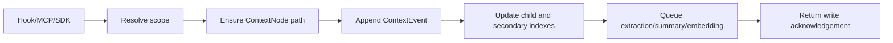
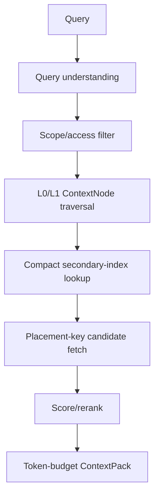

# Building Context Management On TemporalStore

Modern agents need memory that is fresher and more structured than a vector
database dump, but cheaper than replaying every transcript. MatrixArk context
management uses TemporalStore as the hot serving layer for that memory: ordered
events, evolving entities, resource chunks, summaries, embeddings, and compact
indexes all live in a time-aware storage engine built for retrieval.

This blog explains the technical design, the serving data shape, and how the
ingestion/extraction/retrieval pipeline works.

## Related MatrixArk Blogs And Manuals

This page is the product-level technical blog. It intentionally summarizes and
links to the deeper MatrixArk context writeups:

- [Context ingestion, extraction, retrieval manual](context_ingestion_extraction_retrieval_manual.md)
- [MatrixArk context management deep dive](matrixark_context_management_ingestion_extraction_retrieval_blog.md)
- [Context secondary index mechanism](matrixark_context_secondary_index_mechanism.md)
- [Secondary-index tree retrieval for LOCOMO-style recall](matrixark_secondary_index_tree_retrieval_locomo_flow.md)
- [Resource and skill parsing pipeline](matrixark_resource_skill_parsing_pipeline.md)
- [Context node materialization](matrixark_context_node_materialization.md)

## Why TemporalStore

Context management has three awkward properties:

1. Most writes are time ordered.
2. Most reads ask for the latest or most relevant slice, not the whole history.
3. Memory quality depends on connected records: events, summaries, entities,
   resources, topics, and session boundaries.

TemporalStore matches that shape:

- timestamp-keyed writes for messages and events;
- bounded time-window scans for recent memory;
- compact secondary-index postings for topic/entity/resource filtering;
- native batching and async durability policies for high write throughput;
- page/block storage and cold-scan paths for lifecycle management;
- C++ and Rust engines that can share the same public contracts.

## Serving Records

The public first-release surface uses compact serving records:

| Record | What It Stores | Why It Exists |
| --- | --- | --- |
| `ContextNode` | Scope/tree node such as tenant, user, session, topic, shared resource. | Lets retrieval traverse memory by layer instead of scanning every record. |
| `ContextEvent` | Timestamp-keyed message/fact/action event. | Preserves ordered memory and supports recent-window recall. |
| `ContextSegment` | A small group of related events. | Keeps dense leaf nodes from growing into huge candidate sets. |
| `ContextEntity` | Latest state about a person, project, preference, decision, owner, topic, etc. | Gives cross-session recall without scanning all sessions. |
| `ContextSummary` | Latest L0/L1 summary for session, topic, resource, or node. | Compresses long histories into cheap prompt-time evidence. |
| `ContextEmbedding` | Vector for event text, summary, entity, or chunk. | Supports semantic lookup and rerank. |
| `ContextIndex` | Compact postings keyed by scope, index name, and time bucket. | Prefilters candidates before record fetch. |
| `ResourceChunk` | Chunked resource text with stable URI reference. | Lets files and PDFs participate in the same recall path. |
| `SkillSection` | Reusable procedural/context blocks. | Allows tenant/global skills to be retrieved with access control. |

Verbose replay/debug/audit records are intentionally outside the serving-hot
public surface for the first open-source release.

## Scope And Placement

Every ingestion and retrieval request is normalized at the boundary:

```json
{
  "tenant_id": "tenant_acme",
  "user_id": "u_42",
  "session_id": "codex-thread-123",
  "agent": "codex"
}
```

That produces a stable `scope_key`. Context records attach to a `ContextNode`
and can be routed by a placement key such as:

```text
context:<scope_key>:node=<node_hash>
```

Placement matters because context management has many connected records. If
events, summaries, entities, chunks, and indexes for the same hot node are
spread randomly, retrieval turns into fanout. If they share a routing key where
locality matters, retrieval becomes:

```text
node traversal -> index lookup -> selected partitions -> candidate fetch
```

Shared resources and global skills are intentionally separate:

```text
tenant:<tenant_id>/shared/resources/...
tenant:<tenant_id>/shared/skills/...
global/resources/...
```

Access control decides whether those records are visible before scoring.

## Ingestion Example

An agent message arrives:

```json
{
  "agent": "codex",
  "event": "UserPromptSubmit",
  "scope": {
    "tenant_id": "tenant_acme",
    "user_id": "u_42",
    "session_id": "codex-thread-123"
  },
  "message": {
    "role": "user",
    "text": "Alice approved Project Aurora GPU spend up to 45000 dollars."
  }
}
```

The ingest pipeline:



The hot event value should be compact:

```json
{
  "ts": 1780000000000,
  "ref": "evt_7f3",
  "node": "n_session_project_aurora",
  "role": "user",
  "text": "Alice approved Project Aurora GPU spend up to 45000 dollars."
}
```

Fields that are derivable or only useful for debug should stay out of the hot
record. The serving path wants information, not repeated metadata.

## Extraction And Promotion

Extraction produces serving state:

```json
{
  "entity_type": "approval",
  "entity_name": "Project Aurora GPU spend",
  "state": "approved up to 45000 dollars by Alice",
  "operator": "LATEST",
  "source": "evt_7f3"
}
```

Promotion decides where that state should live:

- Session-only facts stay under the session/conversation node.
- Durable user preferences move to the user node.
- Project-level state moves to a topic node.
- Resource facts attach to the resource node.
- Shared policy facts attach to tenant/shared or global nodes.

That is the key to cross-session recall. A new session does not scan every old
session; it first checks promoted user/topic/entity summaries.

## Summary Generation

Summaries are separate `ContextSummary` records, not duplicated inside every
event.

Recommended generation policy:

```text
leaf L0 summary = recent events + selected entities
leaf L1 summary = compressed L0 + important state
parent summary = child summaries + selected entity/operator state
```

Parent refresh should not recursively scan every raw leaf event. If a summary is
missing or stale, retrieval can fall back to recent event/entity embeddings,
secondary indexes, and sparse lexical matching.

## Retrieval Pipeline

Normal retrieval is placement and index driven:



Scoring combines:

- semantic similarity;
- sparse lexical match;
- temporal decay;
- same-session boost;
- cross-session quota;
- shared-resource quota;
- business boosts, such as pinned policy or accepted feedback.

Selected references must be deduplicated before token packing.

## ContextPack Shape

A compact ContextPack should carry useful content, not internal noise:

```json
{
  "same_session": [
    {"type": "summary", "text": "Project Aurora GPU spend was approved up to 45000 dollars."}
  ],
  "user_memory": [
    {"type": "entity", "text": "Alice is the finance approver for Project Aurora."}
  ],
  "shared_resources": [
    {"type": "chunk", "text": "GPU purchasing policy requires finance approval above 25000 dollars."}
  ],
  "telemetry": {
    "selected_refs": 3,
    "broad_scan_used": false
  }
}
```

Detailed audit, replay, model traces, full paths, hash noise, and repeated
metadata should not be emitted into the prompt hot path by default.

## Storage Lifecycle

TemporalStore separates logical memory lifecycle from physical storage reclaim:

- Temporal compression creates compact summaries/entities.
- Context GC can mark raw events eligible after compression and retention.
- Cache eviction only frees memory.
- Physical reclaim requires tombstones plus page/block compaction or safe skip.
- Cold scans for compression/GC should not promote pages into the hot cache.

That makes context storage sustainable without losing the serving memories that
are still useful.

## Deployment And Models

Use the platform manuals:

- [Linux build and deploy](linux_deploy.md)
- [macOS build and deploy](macos_deploy.md)
- [Windows Docker install](windows_docker_install.md)

For OSS model support:

```bash
./tools/install_context_oss_models.sh
source .local/context-oss-models/context_oss_models.env
```

That path supports OpenViking/VikingMem-style local readers and embeddings such
as Qwen through Ollama/vLLM and `sentence-transformers/all-MiniLM-L6-v2`.

## Design Rule

Use raw events for evidence. Use summaries, entities, topics, and compact
indexes for normal recall. The system should preserve detailed history, but the
serving path should stay small, fast, and scoped.

## Implementation Checklist

Use this blog together with the older MatrixArk context docs when changing the
implementation:

- Ingestion should write compact hot records and avoid verbose debug fields.
- ContextNode children should be discovered through parent-child indexes.
- Secondary indexes should use compact postings, not one row per event.
- Parent summaries should use child summaries plus selected entity state.
- Retrieval should prefer placement/index fetch and reserve broad scan for
  fallback/debug.
- ContextPack should dedupe refs and avoid repeated internal strings.
