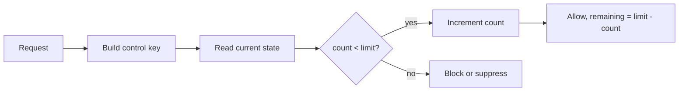

# Control State: Frequency Caps, Quotas, Pacing, And Risk-Style Serving Control

Control State is TemporalStore's public capability for fast-changing serving
signals: counters, caps, quotas, pacing, eligibility, suppression, and
risk-control state. It replaces narrower names such as CPC or Risk for the
first open-source surface because the same primitive serves many online control
problems.

This blog explains the technical shape and shows how to implement frequency
caps and related controls on TemporalStore.

## Related MatrixArk Blogs And Manuals

Control State sits next to Context and Feature in the first open-source
TemporalStore surface. Read this blog with:

- [TemporalStore open-source surface](open_source_surface.md)
- [Feature sequences and aggregates technical blog](blog_feature_sequences_and_aggregates.md)
- [Context Management technical blog](blog_context_management_temporalstore.md)
- [Cross-storage control/agent parity](cross_storage_control_agent_parity.md)
- [Client/proxy control-plane parity](client_proxy_control_plane_parity.md)

## Why Control State

Online systems often need to answer questions like:

- Has this user seen campaign `c123` more than 5 times today?
- Is this account currently suppressed?
- How much daily quota remains for a tenant?
- Is a promotion eligible for this device and region?
- Should a high-risk action be blocked for the next hour?

These are not long raw feature sequences. They are fast state lookups and
updates under time windows or TTLs.

Control State is optimized for that serving shape:

```text
read current state -> apply rule -> atomically update state -> return decision
```

## Core Concepts

| Concept | Example | Notes |
| --- | --- | --- |
| Entity key | `user:u42`, `account:a9`, `device:d7` | The thing being controlled. |
| Control key | `campaign:c123:impression`, `login:failed`, `quota:tenant` | The signal or policy dimension. |
| Window | `1h`, `1d`, rolling or calendar aligned. | Defines reset/expiration semantics. |
| Counter | impressions, clicks, failed logins. | Usually incremented on accepted action. |
| Cap | max 5 impressions/day. | Returns allow/block plus remaining count. |
| Quota | 100000 requests/day. | Can be global, tenant, user, or campaign scoped. |
| Suppression | blocked until timestamp. | TTL-backed state. |
| Eligibility | allow only if state matches policy. | Often combines counters and flags. |

## Key Design

A practical key layout:

```text
control:<tenant>:<entity_kind>:<entity_id>:<control_kind>:<control_id>:<window>
```

Examples:

```text
control:t1:user:u42:campaign:c123:impression:2026-07-24
control:t1:device:d7:login:failed:rolling_1h
control:t1:tenant:t1:quota:api_requests:2026-07-24
control:t1:account:a9:suppression:checkout:active
```

The value is compact state:

```json
{
  "count": 4,
  "limit": 5,
  "window_start_ms": 1784880000000,
  "expires_at_ms": 1784966400000,
  "updated_at_ms": 1784890000000
}
```

Use TTL/expiration to prevent unbounded growth. For hot controls, the current
state should be a single current value, not an append-only debug history.

## Frequency Cap Example

Policy:

```json
{
  "name": "campaign_daily_impression_cap",
  "entity": "user",
  "control": "campaign_impression",
  "limit": 5,
  "window": "calendar_day"
}
```

Serving request:

```json
{
  "tenant_id": "tenant_acme",
  "user_id": "u42",
  "campaign_id": "c123",
  "event": "impression"
}
```

Serving algorithm:



Response:

```json
{
  "decision": "allow",
  "count_after": 5,
  "limit": 5,
  "remaining": 0,
  "expires_at_ms": 1784966400000
}
```

The next impression in the same window returns:

```json
{
  "decision": "block",
  "reason": "frequency_cap_exceeded",
  "count": 5,
  "limit": 5,
  "retry_after_ms": 1784966400000
}
```

## Risk-Style Controls

Risk control can be represented as the same Control State primitive:

```text
control:t1:account:a9:checkout:risk_score:current
control:t1:device:d7:login:failed:rolling_1h
control:t1:user:u42:suppression:payment:active
```

Example state:

```json
{
  "state": "suppressed",
  "reason": "failed_login_spike",
  "expires_at_ms": 1784893600000,
  "updated_at_ms": 1784890000000
}
```

That is why the public name is Control State, not Risk. Risk is one use case;
the capability is broader.

## Atomicity And Durability

Control State updates need predictable semantics:

- A single-key counter update should be atomic.
- Multi-key policy decisions should declare whether they are best-effort or
  transaction-like.
- Async durability is faster and is the default for high-QPS controls.
- Sync durability can be selected for state that must survive node loss before
  acknowledgement.
- Idempotency keys should be used when replaying from durable queues.

For high-volume ingestion, a durable queue can acknowledge the agent/app quickly
and let TemporalStore consume offsets. The control update should commit the
processed offset only after the configured durability threshold is reached.

## Time Windows

Calendar day key:

```text
control:t1:user:u42:campaign:c123:impression:2026-07-24
```

Rolling window key:

```text
control:t1:device:d7:login:failed:bucket_17848900
```

For rolling windows, store small buckets and aggregate only the buckets needed
for the window:

```text
rolling_1h = sum(last 60 one-minute buckets)
```

The public first-release surface should keep exact mature aggregates and avoid
high-cardinality sketches until they are production ready.

## Cache And Expiration

Control State is cache-friendly:

- hot keys stay in memory;
- expired windows are eligible for logical deletion;
- physical reclaim happens later through generic TemporalStore compaction;
- cold GC scans must avoid hot-cache promotion.

Cache eviction is not deletion. A control key evicted from memory must still be
recoverable from durable storage until it expires and is reclaimed.

## Example: API Tenant Quota

Key:

```text
control:t1:tenant:t1:quota:api_requests:2026-07-24
```

Value:

```json
{
  "used": 483221,
  "limit": 1000000,
  "expires_at_ms": 1784966400000
}
```

Decision:

```json
{
  "decision": "allow",
  "remaining": 516779
}
```

## Example: Pacing

Campaign pacing is a control state with target rate:

```json
{
  "spent": 1300,
  "budget": 5000,
  "target_spend_by_now": 1500,
  "pace": "under",
  "multiplier": 1.12
}
```

The serving system can boost, dampen, or pause delivery based on this state.

## Operational Metrics

Useful metrics:

- update QPS;
- read QPS;
- p50/p95/p99 decision latency;
- atomic update failures;
- idempotent replay count;
- expired key count;
- hot-cache hit rate;
- durable read fallback count;
- async durability lag;
- queue processed offset and persisted offset.

## Public Surface

The first open-source surface should expose Control State as a small, generic
capability:

- counters;
- caps;
- quotas;
- pacing;
- eligibility;
- suppression;
- control/risk state.

It should not expose unrelated internal modules or broad Redis collection-clone
commands. Minimal string/hash Redis compatibility can coexist, but Control
State should remain the product-level API.

## Implementation Checklist

When implementing or reviewing Control State behavior:

- Keep it generic: counters, caps, quotas, pacing, eligibility, suppression,
  and risk-style state all use the same capability.
- Use current-value state with TTL/expiration, not append-only debug history.
- Make single-key counter updates atomic.
- Require idempotency when replaying from durable queues.
- Distinguish API acknowledgement, append acceptance, and durable persistence.
- Keep high-QPS controls async by default, with sync policy available for
  critical state.
- Do not expand the first open-source Redis API beyond minimal string/hash and
  explicit Control State commands.
