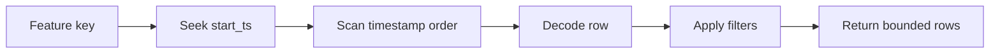
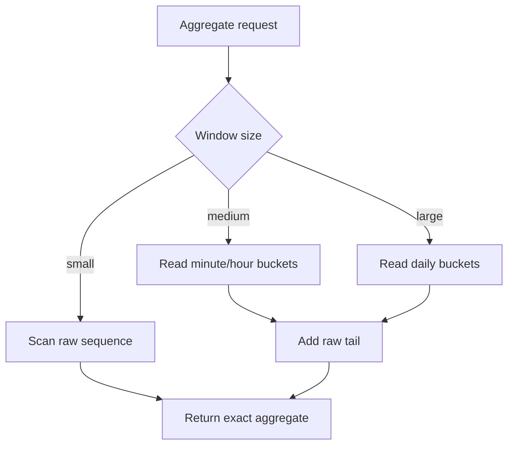

# Long Sequence Features And FeatureAggregate On TemporalStore

TemporalStore's Feature capability stores timestamped observations and serves
bounded time-window reads. FeatureAggregate lives inside the Feature capability
and computes serving-time aggregates over those observations.

This blog explains how long sequence features work, how aggregates should be
modeled, and how to keep online reads fast.

## Related MatrixArk Blogs And Manuals

This blog expands the older MatrixArk feature notes and keeps the public design
aligned with the first open-source surface:

- [TemporalStore sequence feature benchmark](feature_sequence_benchmark.md)
- [Control State technical blog](blog_control_state_frequency_caps.md)
- [Context Management technical blog](blog_context_management_temporalstore.md)

## Why Long Sequence Features

Many recommendation, ads, search, and personalization systems need histories:

- item impressions by user;
- clicks by campaign;
- merchant visits by buyer;
- content dwell time;
- failed actions by device;
- purchases by category;
- model feedback over time.

The write shape is naturally time ordered:

```text
entity key + timestamp -> observation row
```

TemporalStore keeps those observations in timestamp order so serving code can
ask for recent windows without scanning an entire table.

## Feature Observation

Example observation:

```json
{
  "entity_key": "user:u42",
  "feature": "content_interaction",
  "ts": 1784890000000,
  "value": {
    "gid": 1002048,
    "action_type": 3,
    "duration": 91,
    "author_id": 777
  }
}
```

Stored shape:

```text
feature:<tenant>:<feature_name>:<entity_key>
  timestamp -> serialized observation row
```

The timestamp is the primary order key. The value is a compact row payload. In
the current C++ sequence feature path, the row is protobuf-compatible and query
filters decode candidate rows.

## Window Query

Query:

```json
{
  "entity_key": "user:u42",
  "feature": "content_interaction",
  "start_ts": 1784886400000,
  "end_ts": 1784890000000,
  "limit": 100,
  "filters": [
    {"field": "action_type", "op": "=", "value": 3}
  ]
}
```

Execution:



This is excellent for small bounded windows. It is intentionally not a full
analytical scan engine. Keep online windows bounded and use aggregates when the
serving request only needs counts/sums/min/max/latest.

## FeatureAggregate

FeatureAggregate computes serving-time aggregate values over observations.

Examples:

```text
count clicks in last 1 hour
sum purchase amount in last 7 days
max dwell time in last 24 hours
latest category viewed
avg session duration today
```

Recommended request:

```json
{
  "entity_key": "user:u42",
  "feature": "content_interaction",
  "window": {
    "start_ts": 1784886400000,
    "end_ts": 1784890000000
  },
  "aggregates": [
    {"name": "click_count", "op": "count", "filter": {"action_type": 3}},
    {"name": "total_dwell", "op": "sum", "field": "duration"},
    {"name": "latest_author", "op": "latest", "field": "author_id"}
  ]
}
```

Response:

```json
{
  "click_count": 12,
  "total_dwell": 728,
  "latest_author": 777
}
```

## First-Release Aggregate Set

The first public aggregate set should stay exact and mature:

| Aggregate | Meaning |
| --- | --- |
| `count` | Number of matching observations. |
| `sum` | Sum of numeric field. |
| `min` | Minimum numeric field. |
| `max` | Maximum numeric field. |
| `avg` | Sum divided by count. |
| `first` | Earliest value in window. |
| `latest` | Latest value in window. |

High-cardinality/sketch aggregates should be gated until production ready:

```text
distinct_count
top_k
heavy_hitters
hll
histogram
percentile
quantile sketches
```

Those are useful, but they need carefully defined accuracy, memory, merge, and
compatibility semantics.

## Multi-Cardinality Features

A common feature asks for aggregates at several granularities:

```text
user x item
user x category
user x author
user x campaign
tenant x campaign
```

Do not create a separate public capability for each cardinality. Keep them under
Feature:

```text
feature:<tenant>:content_interaction:user:u42
feature:<tenant>:content_interaction:user:u42:category:gpu
feature:<tenant>:content_interaction:user:u42:author:777
feature:<tenant>:campaign_delivery:tenant:t1:campaign:c123
```

FeatureAggregate can compute over the correct key/window. If a cardinality is
hot enough, maintain pre-aggregated bucket rows.

## Raw Sequence vs Pre-Aggregated Bucket

Raw sequence row:

```json
{
  "ts": 1784890000000,
  "gid": 1002048,
  "action_type": 3,
  "duration": 91
}
```

One-minute aggregate bucket:

```json
{
  "bucket_start_ms": 1784890000000,
  "click_count": 4,
  "view_count": 91,
  "duration_sum": 5102,
  "duration_max": 180
}
```

Serving strategy:

- use raw sequence for small windows and explainability;
- use bucket aggregates for long windows;
- combine coarse buckets plus recent raw tail when the window is partly current.

Example:

```text
last 7 days clicks =
  sum(sealed hourly buckets for days 1-6)
  + sum(sealed minute buckets for current day)
  + scan raw tail for the current minute
```

## Query Planning

The query planner should choose the cheapest exact path:



Use bounded raw scans. If a query needs the last million events, it is probably
an aggregate query or offline job, not a hot serving query.

## Filter Semantics

Simple filters:

```text
action_type = 3
duration > 120
gid != 1002048
```

Current implementation notes from the C++ sequence path:

- filters are evaluated after decoding candidate rows;
- supported operators include `=`, `!=`, `>`, `<`;
- multiple filters are ANDed;
- no secondary index is required for the first public surface;
- large filtered windows are expensive because they still scan/decode rows.

Future production optimizations:

- pre-aggregated filtered buckets for common filters;
- compact postings for high-value dimensions;
- code-generated row decoders;
- vectorized decode and predicate evaluation;
- row group/page pruning by timestamp and field stats.

## Retention And Truncation

Long sequences need retention controls:

```text
max rows per feature key
max age per observation
bucket compaction policy
raw tail retention after bucket seal
```

The existing C++ feature path has a `feature_max_size` style limit for one
sequence object. After an append, older rows can be truncated when the object
exceeds the configured limit.

For production:

- keep enough raw tail for explainability and recent exact queries;
- compact older rows into buckets;
- mark old raw rows GC eligible after bucket/safety checks;
- rely on generic TemporalStore page/block compaction for physical reclaim.

## Example: Recommendation Features

Raw observations:

```json
[
  {"ts": 1784890000000, "gid": 11, "action_type": 1, "duration": 3, "author_id": 7},
  {"ts": 1784890000100, "gid": 12, "action_type": 3, "duration": 91, "author_id": 8},
  {"ts": 1784890000200, "gid": 13, "action_type": 3, "duration": 42, "author_id": 7}
]
```

Serving aggregates:

```json
{
  "views_1h": 3,
  "clicks_1h": 2,
  "dwell_sum_1h": 136,
  "latest_author": 7
}
```

These features can feed ranking, retrieval boosts, or context selection.

## Relationship To Control State

Feature and Control State are complementary:

- Feature stores observations and aggregates for model input.
- Control State stores current decisions, counters, caps, quotas, suppression,
  and eligibility.

If the question is "what happened over time?", use Feature. If the question is
"should this request be allowed now?", use Control State.

## Operational Metrics

Track:

- feature append QPS;
- window query QPS;
- aggregate query QPS;
- p50/p95/p99 by window size;
- rows scanned;
- rows decoded;
- buckets read;
- raw-tail rows scanned;
- aggregate cache hit rate;
- bytes read/written;
- truncation and compaction counts.

## Design Rule

Keep multi-cardinality and aggregate serving inside Feature. Add only the
aggregates that are exact, stable, and measurable in the first release. Gate
sketches and approximate high-cardinality features until their semantics are
fully production ready.

## Implementation Checklist

When implementing Feature and FeatureAggregate behavior:

- Keep FeatureAggregate inside Feature; do not introduce a separate public
  capability for each cardinality.
- Keep online sequence reads bounded by timestamp and count.
- Use raw rows for recent explainability and small windows.
- Use sealed buckets for longer aggregate windows.
- Keep first-release aggregates exact: count, sum, min, max, avg, first,
  latest.
- Gate sketches such as HLL, top-k, heavy hitters, histograms, and percentiles
  until accuracy and merge semantics are production ready.
- Track rows scanned, rows decoded, buckets read, and raw-tail scans in
  benchmark reports.
