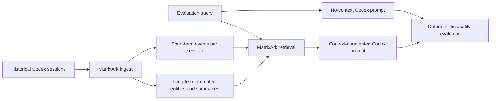

# Codex With MatrixArk Context: Token And Quality A/B

This is a controlled historical-session mimic. It uses deterministic retrieval and scoring so the run is reproducible without network LLM access. Treat it as a benchmark harness and directional evidence, not a final live LLM quality claim.

## Summary

- Historical transcript tokens if replayed wholesale: **275**
- Average MatrixArk context tokens: **125.143**
- Token saving vs full replay: **54.5%**
- Average no-context quality proxy: **0.181**
- Average with-context quality proxy: **0.915**
- Average quality lift: **+0.734**

## How The Comparison Works

## Per Query Results

| Query | No-context quality | With-context quality | Context tokens | Full replay tokens | Saving vs replay | Retrieved refs |
|---|---:|---:|---:|---:|---:|---|
| q1 | 0.045 | 1.0 | 121 | 275 | 56.0% | sum:windows-docker:l1, msg:windows-docker:001, ent:oss-model-setup, sum:codex-hook:l1 |
| q2 | 0.252 | 1.0 | 121 | 275 | 56.0% | msg:linux-macos:001, sum:windows-docker:l1, sum:codex-hook:l1, ent:oss-model-setup |
| q3 | 0.252 | 0.813 | 128 | 275 | 53.5% | msg:opensource-surface:001, sum:codex-hook:l1, msg:codex-hook:001, sum:windows-docker:l1 |
| q4 | 0.045 | 1.0 | 123 | 275 | 55.3% | msg:codex-hook:001, sum:codex-hook:l1, msg:windows-docker:001, sum:windows-docker:l1 |
| q5 | 0.222 | 0.594 | 126 | 275 | 54.2% | msg:opensource-surface:001, ent:control-state, sum:codex-hook:l1, sum:windows-docker:l1 |
| q6 | 0.252 | 1.0 | 127 | 275 | 53.8% | msg:linux-macos:001, ent:oss-model-setup, msg:opensource-surface:001, sum:codex-hook:l1 |
| q7 | 0.2 | 1.0 | 130 | 275 | 52.7% | msg:perf-parity:001, sum:codex-hook:l1, sum:windows-docker:l1, ent:oss-model-setup |

## Short-Term And Long-Term Memory Built From Historical Sessions

| Ref | Memory kind | Session | Token estimate | Text |
|---|---|---|---:|---|
| msg:windows-docker:001 | short_term_event | windows-docker-install | 27 | Windows install should not require WSL runtime. Ship a Docker image and PowerShell installer for Rust TemporalStore, Codex hook setup, and local ports. |
| sum:windows-docker:l1 | long_term_summary | windows-docker-install | 27 | Windows deployment policy: use Docker Desktop with a prepared TemporalStore image; document hook scripts and dependencies; avoid asking users to build inside WSL. |
| msg:linux-macos:001 | short_term_event | linux-macos-install | 27 | Linux builds should be recommended on Ubuntu 22.04 and Ubuntu 26.04. Add scripts for Linux and macOS deploy, following the OpenViking-style OSS model setup. |
| ent:oss-model-setup | long_term_entity | global | 24 | OSS model setup uses tools/install_context_oss_models.sh for Ollama, Qwen, vLLM when available, Transformers, sentence-transformers, and local embedding fallback. |
| msg:opensource-surface:001 | short_term_event | open-source-surface | 33 | First open-source TemporalStore surface should keep Context, Feature, FeatureAggregate, and Control State capabilities only; remove audit, replay, debug-only models, and broad Redis APIs. |
| ent:control-state | long_term_entity | global | 23 | Control State stores fast-changing serving signals: counters, caps, quotas, pacing, eligibility, suppression, and risk-control state. |
| ent:feature-aggregate | long_term_entity | global | 24 | FeatureAggregate lives inside Feature. Feature stores time-keyed observations; FeatureAggregate computes serving-time aggregates over those observations, with immature high-cardinality sketches gated. |
| msg:codex-hook:001 | short_term_event | codex-hook-realtime | 25 | Codex hooks must fire from real UserPromptSubmit events across all old and new conversations. Do not use watcher/log fallback as the serving source. |
| sum:codex-hook:l1 | long_term_summary | codex-hook-realtime | 31 | Hook invariant: global hook registration should ingest real user prompts to both Rust and C++ TemporalStore, preserving session/thread identity and enabling query by all sessions. |
| msg:perf-parity:001 | short_term_event | performance-parity | 36 | For C++ vs Rust performance claims, do not use retired matrixark_record_log bridge artifacts. Use direct SDK or mature proxy paths and require selected refs to be non-empty before latency claims. |

## Interpretation

MatrixArk adds a small context block to the immediate Codex prompt, but avoids replaying the full historical transcript. In this controlled run, context improves fact recall because the answer can recover decisions from older sessions: Windows install policy, Ubuntu build targets, public capability surface, Codex hook invariants, OSS model setup, and performance-comparison rules.

The important token number is not only extra context tokens. It is extra context tokens compared with replaying the entire historical session set. Here the retrieved context is compact enough to save most replay tokens while still lifting the deterministic quality score.

## Next Live Benchmark

Replace deterministic answer templates with an OSS reader such as Qwen through Ollama/vLLM, keep the same query set, run both prompts through the same model and token budget, and judge with exact required facts plus source-ref coverage.
