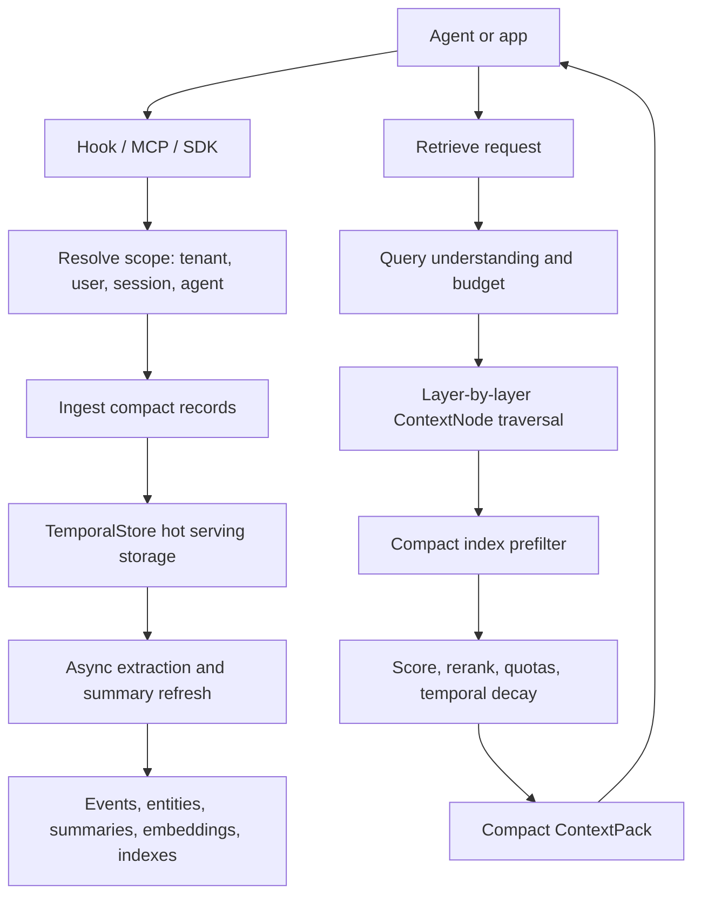
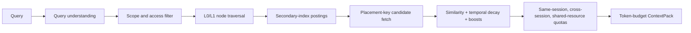

# Context Management On TemporalStore

TemporalStore is the hot serving layer for MatrixArk context management. It
stores time-keyed agent memory, resource chunks, extracted state, summaries,
embeddings, and compact retrieval indexes so agents can recall useful context
without scanning whole transcripts or stuffing every old message into the next
prompt.

This page is the GitHub-friendly entry point for the context system. It links to
the deeper manuals and keeps the first open-source surface focused on the
serving path: context, features, and control-state capabilities.

## What It Provides

- Real-time memory ingestion from agents such as Codex.
- Session, user, tenant, shared-resource, and global context scopes.
- Timestamp-keyed context events for ordered memory.
- Entity/topic/state promotion for cross-session recall.
- Resource and skill ingestion with durable chunk storage.
- L0/L1 summaries that compress older detail into serving-friendly records.
- Embeddings and secondary-index postings for fast candidate selection.
- Compact ContextPack retrieval for LLM prompt assembly.
- Rust TemporalStore deployment on Linux, macOS, and Windows Docker.
- OpenViking/VikingMem-style OSS model setup for local readers and embeddings.

## Mental Model



The key idea is simple: raw conversations and resources are ingested once, then
TemporalStore maintains compact serving records that can be scanned by time,
scope, node, entity, resource, and topic.

## Core Records

| Record | Purpose | Serving Notes |
| --- | --- | --- |
| `ContextNode` | Scope tree: tenant, user, session, conversation, resource, shared, global. | Used for traversal and placement. Children are discovered through parent-child indexes, not by scanning all nodes. |
| `ContextEvent` | Timestamp-keyed memory event. | Ordered by ingestion/event time; multiple events from one message need unique timestamp/ref keys. |
| `ContextSegment` | Optional grouping for chunks of related events. | Keeps hot leaf nodes small and avoids scoring thousands of raw items. |
| `ContextEntity` | Evolving state about people, projects, decisions, owners, topics, and preferences. | Promoted above session level when useful for cross-session recall. |
| `ContextSummary` | L0/L1 summaries for sessions, nodes, and promoted topics. | Stored separately from events; retrieval uses latest serving value. |
| `ContextEmbedding` | Vector for event text, summaries, resources, or entities. | Model metadata is grouped; records should avoid repeating long model strings. |
| `ContextIndex` | Compact secondary-index postings. | Used for prefiltering by type/topic/entity/time bucket before candidate fetch. |
| `ResourceChunk` | Durable chunk of a file, PDF, web page, repo, or other resource. | Large raw files live in object storage; chunks reference stable `raw_uri`. |
| `SkillSection` | Reusable instructions or procedures. | Shared by tenant/global scope and filtered by access before scoring. |
| `ContextPack` | Final compact prompt context. | Contains selected content and lightweight telemetry, not verbose audit/debug state. |

## Ingestion

Ingestion starts from one envelope:

```json
{
  "agent": "codex",
  "event": "UserPromptSubmit",
  "scope": {
    "tenant_id": "tenant_local",
    "user_id": "alice",
    "session_id": "codex-thread-123"
  },
  "message": {
    "role": "user",
    "text": "Remember that Project Aurora has a GPU cap of 45000 dollars."
  }
}
```

The ingestion path:

1. Resolve `tenant_id`, `user_id`, `session_id`, `agent`, and `scope_key`.
2. Ensure the ContextNode path exists.
3. Write compact timestamp-keyed `ContextEvent` records.
4. Update parent-child and secondary-index postings.
5. Queue extraction/summary/embedding work when configured.
6. Return quickly according to the record storage policy.

The default first-release policy is asynchronous for performance. Callers can
override durability for selected records when they need stronger write
acknowledgement.

## Extraction And Promotion

Extraction turns messages and resources into serving memory:

- Facts become `ContextEntity` state.
- Important facts are promoted to user-level or topic-level nodes.
- Session detail remains under the session/conversation node.
- Shared resources live under tenant/shared or global paths, not under a
  session node.
- Parent summaries are generated from child summaries plus selected
  entity/operator state, not by rescanning every raw leaf event.

This keeps cross-session retrieval cheap: the system can first scan user-level
entities, topics, and summaries, then fetch only the relevant session/resource
partitions.

## Retrieval

Normal retrieval should be index and placement driven:



Broad scans are fallback/debug only. The fast path should:

- prefer current session memory;
- include user-level promoted entities/topics;
- apply shared-resource quotas;
- consider cross-session evidence when the query benefits from it;
- rerank with temporal decay, business boosts, same-session boosts, and score
  thresholds;
- dedupe selected refs before token packing.

## Cross-Session Memory

Per-session memory is still valuable because it preserves local task context.
Cross-session recall should not scan every session folder. Instead:

1. Store detailed events under the real session id.
2. Promote durable facts into user-level entities and topics.
3. Maintain latest L0/L1 summaries for sessions and topic nodes.
4. Use secondary indexes for topic/entity/time filters.
5. Fetch selected session/resource partitions only after traversal and
   prefiltering.

That gives both precise session continuity and broader user memory.

## Resources And Skills

Resource files can be local files, PDFs, web pages, repositories, or object
store URIs. Large raw files should live in S3, MatrixObject, or another object
store. TemporalStore keeps hot serving chunks, summaries, embeddings, and
indexes.

Shared resources and skills are scoped like:

```text
tenant:<tenant_id>/shared/resources/...
tenant:<tenant_id>/shared/skills/...
global/resources/...
```

Access control decides visibility before scoring.

## OSS Model Support

For OpenViking/VikingMem-style local model support:

```bash
./tools/install_context_oss_models.sh
source .local/context-oss-models/context_oss_models.env
```

Common profiles:

| Profile | Reader/VLM | Embedding |
| --- | --- | --- |
| `matrixark-cpp-oss-context` | `google/flan-t5-small` | `sentence-transformers/all-MiniLM-L6-v2` |
| `openviking-qwen2_5_vl-local` | `qwen2.5vl:7b` | `nomic-embed-text` |
| `openviking-llava-local` | `llava:7b` | `nomic-embed-text` |
| `openviking-internvl-vllm` | `OpenGVLab/InternVL2_5-8B` | `BAAI/bge-m3` |

Ollama/Qwen setup:

```bash
./tools/install_context_oss_models.sh \
  --install-ollama \
  --pull-ollama \
  --ollama-models "qwen2.5:0.5b qwen2.5:1.5b nomic-embed-text"
```

vLLM setup:

```bash
./tools/install_context_oss_models.sh --install-vllm
```

## Deployment

Use the matching platform manual:

- [Linux build and deploy](linux_deploy.md)
- [macOS build and deploy](macos_deploy.md)
- [Windows Docker installation](windows_docker_install.md)

The recommended local service shape is:

```text
matrixark_rust_metaserver
matrixark_rust_datanode
matrixark_rust_proxy
matrixark_rust_direct_sdk
```

The hook should call SDK/proxy. It should not embed storage.

## Storage And Lifecycle

TemporalStore stores hot serving records and indexes. Cold raw files and
immutable raw ingestion logs can live in object storage or MatrixKV-style cold
metadata stores when configured.

Important lifecycle distinction:

- Cache eviction frees memory only.
- Logical GC marks records eligible for deletion.
- Physical reclaim requires tombstones plus page/block compaction or safe skip.
- Context GC marks raw-event eligibility; the generic TemporalStore storage
  lifecycle reclaims physical pages and blocks for all capabilities.

## First Open-Source Surface

The first open-source surface should stay small and legible:

- Context management.
- Feature observations and aggregates.
- Control State for counters, caps, quotas, pacing, suppression, eligibility,
  and risk-control state.
- Minimal Redis-compatible string/hash commands where implemented.
- No audit/replay/debug records in the serving-hot public surface.

## Learn More

- [Context ingestion, extraction, retrieval manual](context_ingestion_extraction_retrieval_manual.md)
- [Secondary index mechanism](matrixark_context_secondary_index_mechanism.md)
- [Weighted multi-path recall](matrixark_weighted_multi_path_recall.md)
- [Resource and skill parsing pipeline](matrixark_resource_skill_parsing_pipeline.md)
- [Agent policy](matrixark_agent_policy.md)
