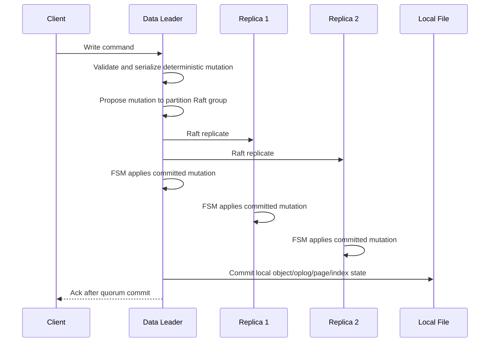

# Data-Node Raft Replication Design

## Goal

Add a standalone TemporalStore data-node replication option that does not depend on shared store for the write path.

The target production mode is:

```text
client write -> current shard leader -> serialize deterministic command/mutation -> Raft propose -> quorum commit -> FSM apply on leader and followers -> client ack
```

Local file remains the node-local persistence layer. Raft is the replication and failover layer. Shared/object storage can still be used later for snapshots, backups, and cold page archive, but it is not required for normal write replication.

This mode must be separate from the existing paths:

- shared-store replay
- `secondary_pull_stream_from_primary`
- local-file single-node mode

## Why This Is Not The Same As Current Replica Replay

Current readonly replicas already use replay:

- `Partition::SetupReplicator()` starts `Replicator` only on readonly partitions.
- `Replicator::ReplayOpLog()` replays primary oplog records through `ObjectManager::ReplayOplog()`.
- `Replicator::ReplayIndexLog()` replays index-log records.
- `RemotePartitionStream` can read primary stream bytes when `secondary_pull_stream_from_primary=true`.

That is catch-up replication. It does not create a quorum commit point before write acknowledgment.

Raft mode must add a commit point before ack:

```text
write is visible/durable only after the Raft group commits the log entry
```

## Data Path

### Strong write mode



Do not use a local-mutate-then-propose path for production. If the leader crashes after local
mutation but before quorum commit, the node can expose or persist state that the Raft group never
accepted. That is why the current code blocks writes in `raft_consensus` unless an explicit
experimental flag is set.

### Apply path

Followers should apply the exact committed `storage::OpLog`:

```text
DataRaftFSM::Apply(index, bytes)
  parse DataRaftLog
  locate local Partition
  append committed oplog to local stream
  ObjectManager::ReplayOplog(local_log_id, local_log_size, oplog)
  update applied index
```

`ObjectManager::ReplayOplog()` already exists and handles:

- sequence checks
- slot dirty marking
- page-log reconstruction
- object delete
- TTL/meta logs
- KV/model apply

## Snapshot Path

Raft log alone is not enough for a new or far-behind node. The partition Raft group needs snapshots.

Snapshot payload:

- partition id
- table name
- partition config
- last applied Raft index
- last applied oplog sequence
- index stream snapshot or serialized index metadata
- page stream data needed by live index addresses
- local oplog range needed after snapshot

Recommended first implementation:

```text
snapshot -> local tar/manifest directory
optional upload -> S3-compatible object store
new node -> install snapshot -> replay remaining Raft log
```

S3 should be used for snapshots, not for every Raft log append. Raft log/WAL should stay on low-latency local disk.

## Read Modes

Raft write replication does not automatically make every read strong.

TemporalStore should expose explicit read modes:

- `leader`: route to current leader; can be strong with leader lease/read-index.
- `linearizable`: leader performs Raft ReadIndex before serving.
- `replica_stale`: any applied replica can serve; fastest, may lag.
- `replica_min_index`: replica can serve only if `applied_index >= required_index`.

For feature/risk serving, `replica_stale` is often acceptable. For strict read-after-write, use `leader` or `linearizable`.

## Code Integration Points

### Existing useful pieces

- `src/partition/partition.h`
  - `Partition::ExecuteCmd()`
  - `Partition::OnExecuteCmdDone()`
  - `Partition::GetInfo()`

- `src/partition/storage/op_logger.*`
  - builds and commits `storage::OpLog`

- `src/partition/storage/object_manager.*`
  - `ObjectManager::ReplayOplog()`

- `src/partition/storage/replicator.*`
  - existing non-Raft replay loop

- `src/metaserver_v2/raft_server.*`
   - metaserver-only Raft wrapper pattern

- `src/metaserver_v2/fsm.*`
   - example Raft FSM implementation

### Added standalone core

- `src/partition/storage/data_raft_replication.h`
- `src/partition/storage/data_raft_replication.cc`

These files provide:

- `DataRaftLogEntry`: partition id, Raft index, local oplog id/size, and `storage::OpLog`
- `DataRaftCommandEntry`: partition id, Raft index, request id, and `BatchExecuteCmdRequest`
- `SerializeDataRaftLog()`
- `ParseDataRaftLog()`
- `SerializeDataRaftCommand()`
- `ParseDataRaftCommand()`
- `DataRaftCommittedLogApplier::Apply()`

The applier parses a committed Raft payload and applies it through `ObjectManager::ReplayOplog()`.
It is intentionally independent from a concrete Raft library, so the same path can be tested
without starting a concrete Raft library and then reused by the future Raft FSM.

The command envelope is the production write payload. It lets the leader propose the original
write batch before local mutation. `Partition::ApplyDataRaftCommand` now executes a committed
`BatchExecuteCmdRequest` from the FSM side. The leader write-only path now captures the original
client batch, proposes it with `DataRaftConsensusBackend::Propose`, waits until the local applied
index reaches the committed index, and returns the response/status produced by that committed FSM
apply. Leader proposal waiting is dispatched onto the server background async pool; committed FSM
apply is handed back to the partition's owning worker thread before mutating object state. Mixed
read/write batches remain rejected until read-index semantics are implemented.

### New code should be isolated

Add or keep the isolated module namespace:

```text
src/partition/raft/
  data_raft_log.proto
  data_raft_connector.h/cc
  data_raft_fsm.h/cc
  data_raft_group.h/cc
  data_raft_snapshot.h/cc
```

The codec/applier currently lives under `src/partition/storage/` because it directly bridges
committed Raft payloads to storage replay. The Raft adapter can live under `src/partition/raft/`
and call this storage applier.

Do not modify the existing `Replicator` semantics. Raft mode should be selected by a flag/config:

```text
--data_replication_mode=shared_store|primary_pull|raft_consensus
```

Initial guard:

```text
if data_replication_mode == raft_consensus:
    only primary/leader accepts writes
    ack only after raft propose + apply result
else:
    keep existing behavior
```

## Minimal Implementation Milestones

### Milestone 1: single-process component test

- Create a fake in-memory partition Raft group.
- Propose serialized `storage::OpLog`.
- Apply through `ObjectManager::ReplayOplog()`.
- Verify STRING/HASH/FEATURE/TEMPORAL_AGGREGATE state matches leader.

Exit criteria:

- repeated apply is idempotent
- missing sequence returns `DataLoss`
- duplicate sequence is skipped

### Milestone 2: local multi-process Raft group

- Start 3 data-node processes on localhost.
- One partition group, 3 replicas.
- Writes go to leader.
- Kill leader.
- New leader serves existing data.

Exit criteria:

- committed writes survive leader death
- stale follower cannot accept writes
- leader-read returns latest committed writes

### Milestone 3: snapshot install

- Force snapshot.
- Start a fresh node with empty local file store.
- Install snapshot.
- Replay remaining Raft log.

Exit criteria:

- new node can serve reads after snapshot + replay
- old local pages are not required from the dead leader

### Milestone 4: AWS test

- 1 metaserver/test node
- 2 or 3 data nodes
- no EFS required for write replication
- optional S3 bucket for snapshots

Exit criteria:

- concurrent write/read QPS measured
- leader failover tested
- replica read lag measured

## Safety Rules

1. Do not ack a strong write before Raft quorum commit.
2. Do not promote a replica that has not applied the committed index selected by the metaserver/raft group.
3. Do not allow write commands on non-leader partitions.
4. Do not delete local pages until the snapshot/index no longer references them.
5. Do not use replica reads as strong reads unless read-index or required-applied-index is checked.

## Product Semantics

Raft mode gives:

- no shared-store dependency for hot writes
- committed-write survival after leader failure
- lower write latency than EFS/S3 append in the hot path
- explicit strong/eventual read modes

Raft mode does not remove the need for:

- snapshots for new/far-behind nodes
- routing metadata from metaserver/proxy/client
- read consistency policy
- backup/archive storage if users want disaster recovery beyond the Raft group
