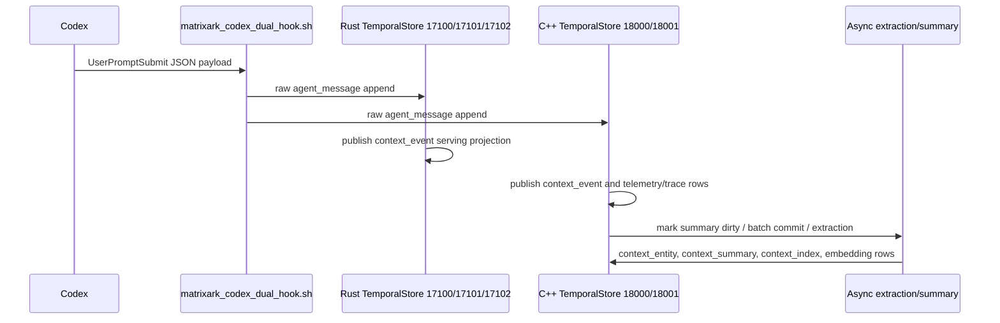

# Recent Codex Hook Ingestion Workflow

Generated at `1784865708137`.

## What This Report Proves

- Rust TemporalStore currently captures real Codex `UserPromptSubmit` rows in raw ingestion and exposes matching serving `context_event` rows.
- C++ TemporalStore currently captures hook traffic, but the newest records are noisier: PostToolUse, hook trace, audit, idempotency, and dirty-summary records are mixed with prompt rows.
- Async extraction/summary is visible on C++ through `context_summary_dirty`, `context_summary`, `context_entity`, `context_index`, and batch commit records in the recent raw window.
- Rust live hook prefix currently shows raw messages and serving context events only; no entity/summary rows were present in the scanned live prefix window.

## Workflow

## Backend Counts

|Backend|Prefix|Raw count|Serving count|Recent raw types|Recent serving types|
|---|---|---|---|---|---|
|Rust TemporalStore|matrixark:codex-hook:rust-live-v2|157|139|{"agent_message": 138, "context_entity": 6, "context_index": 6, "context_segment": 2, "context_summary": 2, "context_summary_dirty": 2}|{"context_event": 138}|
|C++ TemporalStore|matrixark:codex-hook:cpp-live-v2|8704|2306|{"agent_message": 141, "codex_hook_trace": 141, "context_batch_commit": 3, "context_child_ref": 6, "context_embedding": 59, "context_entity": 17, "context_entity_update_audit": 17, "context_extraction_audit": 3, "context_index": 22, "context_node": 9, "context_pack_telemetry": 2, "context_segment": 12, "context_summary": 30, "context_summary_dirty": 24, "matrixark_audit_log": 9, "matrixark_idempotency": 3}|{"codex_hook_trace": 17, "context_batch_commit": 14, "context_child_ref": 33, "context_event": 270, "context_node": 48, "context_pack_telemetry": 10, "context_summary_dirty": 45, "matrixark_audit_log": 18, "matrixark_idempotency": 14, "unknown": 18}|

## Rust TemporalStore Recent Real User Prompts

|Seq|Event|Session|Turn|Hook|Text|
|---|---|---|---|---|---|
|147|UserPromptSubmit|codex:019ea4c9-a88c-71e1-baca-df7ff879e020|rust-live-extraction-fanout-20260724b|UserPromptSubmit:002e3e47b1f27f2a|Rust TemporalStore live extraction fanout should create context segments entities summaries and index rows for Codex hook ingestion parity.|
|137|UserPromptSubmit|codex:019ea4c9-a88c-71e1-baca-df7ff879e020|rust-live-extraction-fanout-20260724|UserPromptSubmit:00e7faeee784eb7f|Rust TemporalStore live extraction fanout should create context segments entities summaries and index rows for Codex hook ingestion parity.|
|136|UserPromptSubmit|codex:019ea4c9-a88c-71e1-baca-df7ff879e020|019f9230-5010-7fb2-9027-82d64ddab9de|UserPromptSubmit:1d15ca138667edb5|WHY NO OTHERS? FIX THIS FOR RUST: Rust live prefix currently shows raw messages and serving context events only; no entity/summary rows appeared in the scanned live prefix window, so Rust async extraction/summary stil...|
|135|UserPromptSubmit|codex:019ea4c9-a88c-71e1-baca-df7ff879e020|019f921b-9c0a-7970-a9d8-3e9439ac4e50|UserPromptSubmit:18942ab29ecb940b|swap the deterministic answer templates with Qwen/Ollama/vLLM calls under the same query set and token budget. INGEST HISTORICAL SESSION DATA FOR ALL SESSIONS FROM CODEX LOGS TO MIMIC GENERATING CONTEXE EVENTS, SEGMEN...|
|134|UserPromptSubmit|codex:019efad7-2f87-77e1-b082-c294fcb5e731|019f921a-3b06-7c71-9aa9-80af9df533b4|UserPromptSubmit:90a4bdd914cc36e5|UPDATE THE SKILLS AS WELL|
|133|UserPromptSubmit|codex:019efad7-2f87-77e1-b082-c294fcb5e731|019f9213-e9e4-7f73-82d9-edf64bdcaecd|UserPromptSubmit:e12fbf33b8981a54|wsl: A localhost proxy configuration was detected but not mirrored into WSL. WSL in NAT mode does not support localhost proxies. VIM - Vi IMproved 8.2 (2019 Dec 12, compiled May 20 2026 21:28:11) Too many "+command", ...|
|132|UserPromptSubmit|codex:019efad7-2f87-77e1-b082-c294fcb5e731|019f9210-da61-7aa0-b711-b39eae2c2061|UserPromptSubmit:edb50c3288272811|OPEN THE VIM CONSOLE FOR ME, MAKE SURE THE RUST MAIN FILE IS OPENED|
|130|UserPromptSubmit|codex:019efad7-2f87-77e1-b082-c294fcb5e731|019f920c-9b6d-7243-9c2d-77d1608024e6|UserPromptSubmit:e433d7996312d9fe|UPDATE SKILL FILES SO THAT IN THE FUTURE, WE CAN OPEN VIM CONSOLE CORRECTLY WITHOUT ITERATIONS: At line:1 char:83 + ... ute -- bash -lc cd /opt/github-services/TemporalStore && vim -N ... + ~~ The token '&&' is n...|

## Rust TemporalStore Context Events

|Seq|Event|Session|Text|
|---|---|---|---|
|138|UserPromptSubmit|codex:019ea4c9-a88c-71e1-baca-df7ff879e020|user: Rust TemporalStore live extraction fanout should create context segments entities summaries and index rows for Codex hook ingestion parity.|
|137|UserPromptSubmit|codex:019ea4c9-a88c-71e1-baca-df7ff879e020|user: Rust TemporalStore live extraction fanout should create context segments entities summaries and index rows for Codex hook ingestion parity.|
|136|UserPromptSubmit|codex:019ea4c9-a88c-71e1-baca-df7ff879e020|user: WHY NO OTHERS? FIX THIS FOR RUST: Rust live prefix currently shows raw messages and serving context events only; no entity/summary rows appeared in the scanned live prefix window, so Rust async extraction/summar...|
|135|UserPromptSubmit|codex:019ea4c9-a88c-71e1-baca-df7ff879e020|user: swap the deterministic answer templates with Qwen/Ollama/vLLM calls under the same query set and token budget. INGEST HISTORICAL SESSION DATA FOR ALL SESSIONS FROM CODEX LOGS TO MIMIC GENERATING CONTEXE EVENTS, ...|
|134|UserPromptSubmit|codex:019efad7-2f87-77e1-b082-c294fcb5e731|user: UPDATE THE SKILLS AS WELL|
|133|UserPromptSubmit|codex:019efad7-2f87-77e1-b082-c294fcb5e731|user: wsl: A localhost proxy configuration was detected but not mirrored into WSL. WSL in NAT mode does not support localhost proxies. VIM - Vi IMproved 8.2 (2019 Dec 12, compiled May 20 2026 21:28:11) Too many "+comm...|
|132|UserPromptSubmit|codex:019efad7-2f87-77e1-b082-c294fcb5e731|user: OPEN THE VIM CONSOLE FOR ME, MAKE SURE THE RUST MAIN FILE IS OPENED|
|131|Stop|codex:019efad7-2f87-77e1-b082-c294fcb5e731|user: UPDATE SKILL FILES SO THAT IN THE FUTURE, WE CAN OPEN VIM CONSOLE CORRECTLY WITHOUT ITERATIONS: \nAt line:1 char:83\r\n+ ... ute -- bash -lc cd /opt/github-services/TemporalStore && vim -N ...\r\n+ ~~\r\nTh...|

## Rust TemporalStore Entities And Summaries

|Seq|Type|Session|Text|
|---|---|---|---|
|153|context_entity|codex:019ea4c9-a88c-71e1-baca-df7ff879e020|context_management: Rust TemporalStore live extraction fanout should create context segments entities summaries and index rows for Codex hook ingestion parity.|
|151|context_entity|codex:019ea4c9-a88c-71e1-baca-df7ff879e020|codex_hook: Rust TemporalStore live extraction fanout should create context segments entities summaries and index rows for Codex hook ingestion parity.|
|149|context_entity|codex:019ea4c9-a88c-71e1-baca-df7ff879e020|rust_temporalstore: Rust TemporalStore live extraction fanout should create context segments entities summaries and index rows for Codex hook ingestion parity.|
|143|context_entity|codex:019ea4c9-a88c-71e1-baca-df7ff879e020|context_management: Rust TemporalStore live extraction fanout should create context segments entities summaries and index rows for Codex hook ingestion parity.|
|141|context_entity|codex:019ea4c9-a88c-71e1-baca-df7ff879e020|codex_hook: Rust TemporalStore live extraction fanout should create context segments entities summaries and index rows for Codex hook ingestion parity.|
|139|context_entity|codex:019ea4c9-a88c-71e1-baca-df7ff879e020|rust_temporalstore: Rust TemporalStore live extraction fanout should create context segments entities summaries and index rows for Codex hook ingestion parity.|
|156|context_summary|codex:019ea4c9-a88c-71e1-baca-df7ff879e020|Latest Codex user prompt: Rust TemporalStore live extraction fanout should create context segments entities summaries and index rows for Codex hook ingestion parity.|
|155|context_summary_dirty|codex:019ea4c9-a88c-71e1-baca-df7ff879e020||
|146|context_summary|codex:019ea4c9-a88c-71e1-baca-df7ff879e020|Latest Codex user prompt: Rust TemporalStore live extraction fanout should create context segments entities summaries and index rows for Codex hook ingestion parity.|
|145|context_summary_dirty|codex:019ea4c9-a88c-71e1-baca-df7ff879e020||

## C++ TemporalStore Recent Real User Prompts

|Seq|Event|Session|Turn|Hook|Text|
|---|---|---|---|---|---|
|8646|UserPromptSubmit|codex:019efad7-2f87-77e1-b082-c294fcb5e731||UserPromptSubmit:1784865600139|OPENVIKING VS hy-memory|
|8390|UserPromptSubmit|codex:019ea4c9-a88c-71e1-baca-df7ff879e020||UserPromptSubmit:1784864071184|WHY NO OTHERS? FIX THIS FOR RUST: Rust live prefix currently shows raw messages and serving context events only; no entity/summary rows appeared in the scanned live prefix window, so Rust async extraction/summary stil...|

## C++ TemporalStore Context Events

|Seq|Event|Session|Text|
|---|---|---|---|
|2305|PostToolUse|codex:019ea4c9-a88c-71e1-baca-df7ff879e020|tool: {"cwd": "C:\\Users\\example\\Documents\\Codex\\2026-06-07\\use-cases-of-temporolstore-for-llm", "hook_event_name": "PostToolUse", "model": "gpt-5.5", "permission_mode": "default", "session_id": "019ea4c9-a88c-...|
|2293|Stop|codex:019efad7-2f87-77e1-b082-c294fcb5e731|assistant: {"cwd": "C:\\Users\\example\\Documents\\Codex\\2026-06-24\\ll", "hook_event_name": "Stop", "last_assistant_message": "**Short version:** OpenViking is a broader **context database / memory filesystem**; H...|
|2292|PostToolUse|codex:019ea4c9-a88c-71e1-baca-df7ff879e020|tool: {"cwd": "C:\\Users\\example\\Documents\\Codex\\2026-06-07\\use-cases-of-temporolstore-for-llm", "hook_event_name": "PostToolUse", "model": "gpt-5.5", "permission_mode": "default", "session_id": "019ea4c9-a88c-...|
|2291|PostToolUse|codex:019ea4c9-a88c-71e1-baca-df7ff879e020|tool: {"cwd": "C:\\Users\\example\\Documents\\Codex\\2026-06-07\\use-cases-of-temporolstore-for-llm", "hook_event_name": "PostToolUse", "model": "gpt-5.5", "permission_mode": "default", "session_id": "019ea4c9-a88c-...|
|2288|UserPromptSubmit|codex:019efad7-2f87-77e1-b082-c294fcb5e731|user: OPENVIKING VS hy-memory|
|2286|PostToolUse|codex:019efb19-68bf-7d83-903e-10e8b8060256|tool: {"cwd": "C:\\Users\\example\\Documents\\Codex\\2026-06-24\\wr", "hook_event_name": "PostToolUse", "model": "gpt-5.5", "permission_mode": "default", "session_id": "019efb19-68bf-7d83-903e-10e8b8060256", "tool_i...|
|2285|PostToolUse|codex:019efb19-68bf-7d83-903e-10e8b8060256|tool: {"cwd": "C:\\Users\\example\\Documents\\Codex\\2026-06-24\\wr", "hook_event_name": "PostToolUse", "model": "gpt-5.5", "permission_mode": "default", "session_id": "019efb19-68bf-7d83-903e-10e8b8060256", "tool_i...|
|2284|PostToolUse|codex:019efb19-68bf-7d83-903e-10e8b8060256|tool: {"cwd": "C:\\Users\\example\\Documents\\Codex\\2026-06-24\\wr", "hook_event_name": "PostToolUse", "model": "gpt-5.5", "permission_mode": "default", "session_id": "019efb19-68bf-7d83-903e-10e8b8060256", "tool_i...|

## C++ TemporalStore Entities And Summaries

|Seq|Type|Session|Text|
|---|---|---|---|
|8664|context_entity_update_audit||preference|
|8663|context_entity|codex:019efad7-2f87-77e1-b082-c294fcb5e731|preference|
|8526|context_entity_update_audit||correction|
|8525|context_entity|codex:019efb19-68bf-7d83-903e-10e8b8060256|correction|
|8523|context_entity_update_audit||current_plan|
|8522|context_entity|codex:019efb19-68bf-7d83-903e-10e8b8060256|current_plan|
|8520|context_entity_update_audit||job_status|
|8519|context_entity|codex:019efb19-68bf-7d83-903e-10e8b8060256|job_status|
|8698|context_summary_dirty|||
|8696|context_summary||tenant:tenant_codex / user:local_user / session:codex:019efb19-68bf-7d83-903e-10e8b8060256 :: location location: objects\") job_status job_status: short --branch"}, "tool_name": "Bash", "tool_response": "## main curren...|
|8695|context_summary_dirty|||
|8693|context_summary||Context node tenant:tenant_codex / user:local_user. Rich overview: assistant: -- {"type:agent-turn-complete,thread-id:019efad7-2f87-77e1-b082-c294fcb5e731,turn-id:019f9210-da61-7aa0-b711-b39eae2c2061,cwd:C:\\Users\\Dee...|
|8691|context_summary||tenant:tenant_codex / user:local_user :: assistant: -- {"type:agent-turn-complete,thread-id:019efad7-2f87-77e1-b082-c294fcb5e731,turn-id:019f9210-da61-7aa0-b711-b39eae2c2061,cwd:C:\\Users\\example\\Documents\\Codex\\...|
|8690|context_summary_dirty|||
|8688|context_summary||Context node tenant:tenant_codex. Rich overview: tenant:tenant_codex / user:local_user :: user: TODAY WE ONLY SUPPORT CODEX HOOK, LEAVE TODOS FOR CLAUDE CODE AND OTHER AGENT tool: {"cwd": "C:\\Users\\example\\Documen...|
|8686|context_summary||tenant:tenant_codex :: tenant:tenant_codex / user:local_user :: user: TODAY WE ONLY SUPPORT CODEX HOOK, LEAVE TODOS FOR CLAUDE CODE AND OTHER AGENT tool: {"cwd": "C:\\Users\\example\\Documents\\Codex\\2026-06-07\\use...|

## Timeline Interpretation

1. Hook firing is proven when a recent `agent_message` has `codex_api_event=UserPromptSubmit`, `hook_type=before_llm`, `synthetic=false`, and a Codex session/thread id.
2. Raw event ingestion is proven by the `raw_ingestion` append sequence and write path metadata.
3. Serving context-event publication is proven when the same prompt appears as `context_event` in the serving prefix.
4. Async extraction is proven only when entity/summary/index rows appear after the raw prompt or when dirty-summary markers are drained by a worker.
5. In this run, Rust proves steps 1-3. C++ proves steps 1-4 in aggregate, but still mixes audit/trace records into the hot prefix and should be cleaned further.
