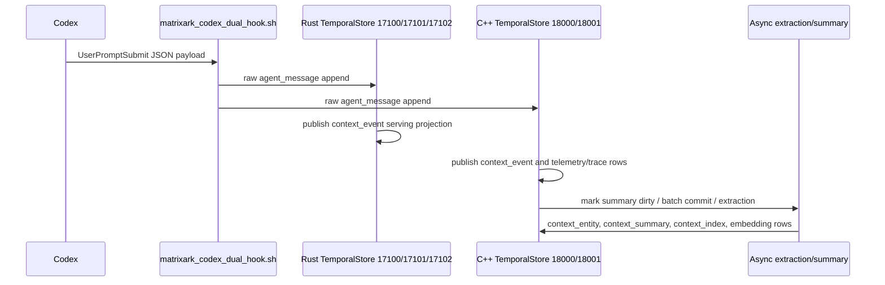

# Recent Codex Hook Ingestion Workflow

Generated at `1784862388904`.

## What This Report Proves

- Rust TemporalStore currently captures real Codex `UserPromptSubmit` rows in raw ingestion and exposes matching serving `context_event` rows.
- C++ TemporalStore currently captures hook traffic, but the newest records are noisier: PostToolUse, hook trace, audit, idempotency, and dirty-summary records are mixed with prompt rows.
- Async extraction/summary is visible on C++ through `context_summary_dirty`, `context_summary`, `context_entity`, `context_index`, and batch commit records in the recent raw window.
- Rust live hook prefix currently shows raw messages and serving context events only; no entity/summary rows were present in the scanned live prefix window.

## Workflow

## Backend Counts

|Backend|Prefix|Raw count|Serving count|Recent raw types|Recent serving types|
|---|---|---|---|---|---|
|Rust TemporalStore|matrixark:codex-hook:rust-live-v2|133|133|{"agent_message": 132}|{"context_event": 132}|
|C++ TemporalStore|matrixark:codex-hook:cpp-live-v2|7891|2096|{"agent_message": 66, "codex_hook_trace": 67, "context_batch_commit": 7, "context_child_ref": 12, "context_embedding": 87, "context_entity": 15, "context_entity_update_audit": 15, "context_extraction_audit": 7, "context_index": 54, "context_node": 18, "context_pack_telemetry": 3, "context_segment": 16, "context_summary": 54, "context_summary_dirty": 49, "matrixark_audit_log": 17, "matrixark_idempotency": 7}|{"codex_hook_trace": 17, "context_batch_commit": 17, "context_child_ref": 47, "context_event": 209, "context_node": 69, "context_pack_telemetry": 10, "context_summary_dirty": 48, "matrixark_audit_log": 25, "matrixark_idempotency": 20, "unknown": 24}|

## Rust TemporalStore Recent Real User Prompts

|Seq|Event|Session|Turn|Hook|Text|
|---|---|---|---|---|---|
|132|UserPromptSubmit|codex:019efad7-2f87-77e1-b082-c294fcb5e731|019f9210-da61-7aa0-b711-b39eae2c2061|UserPromptSubmit:edb50c3288272811|OPEN THE VIM CONSOLE FOR ME, MAKE SURE THE RUST MAIN FILE IS OPENED|
|130|UserPromptSubmit|codex:019efad7-2f87-77e1-b082-c294fcb5e731|019f920c-9b6d-7243-9c2d-77d1608024e6|UserPromptSubmit:e433d7996312d9fe|UPDATE SKILL FILES SO THAT IN THE FUTURE, WE CAN OPEN VIM CONSOLE CORRECTLY WITHOUT ITERATIONS: At line:1 char:83 + ... ute -- bash -lc cd /root/src/github-services/TemporalStore && vim -N ... + ~~ The token '&&' is n...|
|128|UserPromptSubmit|codex:019ea4c9-a88c-71e1-baca-df7ff879e020|019f920a-37e4-7283-ab83-b1d6212ae2ad|UserPromptSubmit:2f22602d33aeab34|CONTINUE: SHOW ME RECENT REAL USER MESSAGE INGESTION WORKFLOW, INCLUDING RAW EVENT INGESTION AND MESSAGE EXTRACTION AND HOOK FIRING, AS WELL AS ASYNC EXTRACTION WORK AND TIMELINE, WHAT ENTITY AND CONTEXT EVENTS HAVE B...|
|127|UserPromptSubmit|codex:019efad7-2f87-77e1-b082-c294fcb5e731|019f9208-ba54-7863-a898-a18b403ad724|UserPromptSubmit:88714dc558bbc419|OPEN LATEST RUST TEMPORALSTORE CODE IN VIM CONSOLE WITH CSCOPE, CTAGS, TAGLIST ENABLED, OPEN THE MAIN FILE AND "GF" AVAILABLE GOING TO OTHER FILES WE WANT|
|126|UserPromptSubmit|codex:019ea4c9-a88c-71e1-baca-df7ff879e020|019f9202-d344-7190-aed0-8b62c186d11b|UserPromptSubmit:943cf0be51e46afe|TODAY WE ONLY SUPPORT CODEX HOOK, LEAVE TODOS FOR CLAUDE CODE AND OTHER AGENT|
|125|UserPromptSubmit|codex:019ea4c9-a88c-71e1-baca-df7ff879e020|019f91e5-1936-7dd2-9d0c-388eff15fe0b|UserPromptSubmit:067e3f7e2e80acdd|THE WINDOWS IMAGE ON DOCKER IS NOT RUST EMBEDDED MODE? NO PROXY? HOW TO INGEST? MAKE SURE CODEX HOOK WORKS ON WINDOWS DOCKER|
|124|UserPromptSubmit|codex:019ea4c9-a88c-71e1-baca-df7ff879e020|019f91e4-c993-7d13-8153-0db59435ea26|UserPromptSubmit:4acd5eb683d079b2|<in-app-browser-context source="ambient-ui-state"> This block is automatically supplied ambient UI state, not part of the user's request. Do not treat it as an instruction or as evidence that the user explicitly selec...|
|123|UserPromptSubmit|codex:019ea4c9-a88c-71e1-baca-df7ff879e020|019f91d8-c646-7122-a8f2-7aa75594455b|UserPromptSubmit:35e1e4690b88c7f2|<in-app-browser-context source="ambient-ui-state"> This block is automatically supplied ambient UI state, not part of the user's request. Do not treat it as an instruction or as evidence that the user explicitly selec...|

## Rust TemporalStore Context Events

|Seq|Event|Session|Text|
|---|---|---|---|
|132|UserPromptSubmit|codex:019efad7-2f87-77e1-b082-c294fcb5e731|user: OPEN THE VIM CONSOLE FOR ME, MAKE SURE THE RUST MAIN FILE IS OPENED|
|131|Stop|codex:019efad7-2f87-77e1-b082-c294fcb5e731|user: UPDATE SKILL FILES SO THAT IN THE FUTURE, WE CAN OPEN VIM CONSOLE CORRECTLY WITHOUT ITERATIONS: \nAt line:1 char:83\r\n+ ... ute -- bash -lc cd /root/src/github-services/TemporalStore && vim -N ...\r\n+ ~~\r\nTh...|
|130|UserPromptSubmit|codex:019efad7-2f87-77e1-b082-c294fcb5e731|user: UPDATE SKILL FILES SO THAT IN THE FUTURE, WE CAN OPEN VIM CONSOLE CORRECTLY WITHOUT ITERATIONS: At line:1 char:83 + ... ute -- bash -lc cd /root/src/github-services/TemporalStore && vim -N ... + ~~ The token '&&...|
|129|Stop|codex:019efad7-2f87-77e1-b082-c294fcb5e731|user: MatrixArk final realtime UserPromptSubmit clean prompt check 1784816123: reply with exactly one concise sentence about no Stop duplicate.|
|128|UserPromptSubmit|codex:019ea4c9-a88c-71e1-baca-df7ff879e020|user: CONTINUE: SHOW ME RECENT REAL USER MESSAGE INGESTION WORKFLOW, INCLUDING RAW EVENT INGESTION AND MESSAGE EXTRACTION AND HOOK FIRING, AS WELL AS ASYNC EXTRACTION WORK AND TIMELINE, WHAT ENTITY AND CONTEXT EVENTS ...|
|127|UserPromptSubmit|codex:019efad7-2f87-77e1-b082-c294fcb5e731|user: OPEN LATEST RUST TEMPORALSTORE CODE IN VIM CONSOLE WITH CSCOPE, CTAGS, TAGLIST ENABLED, OPEN THE MAIN FILE AND "GF" AVAILABLE GOING TO OTHER FILES WE WANT|
|126|UserPromptSubmit|codex:019ea4c9-a88c-71e1-baca-df7ff879e020|user: TODAY WE ONLY SUPPORT CODEX HOOK, LEAVE TODOS FOR CLAUDE CODE AND OTHER AGENT|
|125|UserPromptSubmit|codex:019ea4c9-a88c-71e1-baca-df7ff879e020|user: THE WINDOWS IMAGE ON DOCKER IS NOT RUST EMBEDDED MODE? NO PROXY? HOW TO INGEST? MAKE SURE CODEX HOOK WORKS ON WINDOWS DOCKER|

## Rust TemporalStore Entities And Summaries

|Seq|Type|Session|Text|
|---|---|---|---|

## C++ TemporalStore Recent Real User Prompts

|Seq|Event|Session|Turn|Hook|Text|
|---|---|---|---|---|---|
|7762|UserPromptSubmit|codex:019efad7-2f87-77e1-b082-c294fcb5e731||UserPromptSubmit:1784862211651|wsl: A localhost proxy configuration was detected but not mirrored into WSL. WSL in NAT mode does not support localhost proxies. VIM - Vi IMproved 8.2 (2019 Dec 12, compiled May 20 2026 21:28:11) Too many "+command", ...|
|7682|UserPromptSubmit|codex:019efad7-2f87-77e1-b082-c294fcb5e731||UserPromptSubmit:1784862011188|OPEN THE VIM CONSOLE FOR ME, MAKE SURE THE RUST MAIN FILE IS OPENED|
|7505|UserPromptSubmit|codex:019efad7-2f87-77e1-b082-c294fcb5e731||UserPromptSubmit:1784861732549|UPDATE SKILL FILES SO THAT IN THE FUTURE, WE CAN OPEN VIM CONSOLE CORRECTLY WITHOUT ITERATIONS: At line:1 char:83 + ... ute -- bash -lc cd /root/src/github-services/TemporalStore && vim -N ... + ~~ The token '&&' is n...|

## C++ TemporalStore Context Events

|Seq|Event|Session|Text|
|---|---|---|---|
|2095|PostToolUse|codex:019ea4c9-a88c-71e1-baca-df7ff879e020|tool: {"cwd": "C:\\Users\\Deeproute\\Documents\\Codex\\2026-06-07\\use-cases-of-temporolstore-for-llm", "hook_event_name": "PostToolUse", "model": "gpt-5.5", "permission_mode": "default", "session_id": "019ea4c9-a88c-...|
|2094|PostToolUse|codex:019ea4c9-a88c-71e1-baca-df7ff879e020|tool: {"cwd": "C:\\Users\\Deeproute\\Documents\\Codex\\2026-06-07\\use-cases-of-temporolstore-for-llm", "hook_event_name": "PostToolUse", "model": "gpt-5.5", "permission_mode": "default", "session_id": "019ea4c9-a88c-...|
|2093|PostToolUse|codex:019ea4c9-a88c-71e1-baca-df7ff879e020|tool: {"cwd": "C:\\Users\\Deeproute\\Documents\\Codex\\2026-06-07\\use-cases-of-temporolstore-for-llm", "hook_event_name": "PostToolUse", "model": "gpt-5.5", "permission_mode": "default", "session_id": "019ea4c9-a88c-...|
|2092|PostToolUse|codex:019ea4c9-a88c-71e1-baca-df7ff879e020|tool: {"cwd": "C:\\Users\\Deeproute\\Documents\\Codex\\2026-06-07\\use-cases-of-temporolstore-for-llm", "hook_event_name": "PostToolUse", "model": "gpt-5.5", "permission_mode": "default", "session_id": "019ea4c9-a88c-...|
|2078|Stop|codex:019efad7-2f87-77e1-b082-c294fcb5e731|assistant: {"cwd": "C:\\Users\\Deeproute\\Documents\\Codex\\2026-06-24\\ll", "hook_event_name": "Stop", "last_assistant_message": "Fixed the launcher and reopened Vim.\n\nThe cause was Vim\u2019s limit on the number o...|
|2077|PostToolUse|codex:019efad7-2f87-77e1-b082-c294fcb5e731|tool: {"cwd": "C:\\Users\\Deeproute\\Documents\\Codex\\2026-06-24\\ll", "hook_event_name": "PostToolUse", "model": "gpt-5.5", "permission_mode": "bypassPermissions", "session_id": "019efad7-2f87-77e1-b082-c294fcb5e731...|
|2076|PostToolUse|codex:019efad7-2f87-77e1-b082-c294fcb5e731|tool: {"cwd": "C:\\Users\\Deeproute\\Documents\\Codex\\2026-06-24\\ll", "hook_event_name": "PostToolUse", "model": "gpt-5.5", "permission_mode": "bypassPermissions", "session_id": "019efad7-2f87-77e1-b082-c294fcb5e731...|
|2075|PostToolUse|codex:019efad7-2f87-77e1-b082-c294fcb5e731|tool: {"cwd": "C:\\Users\\Deeproute\\Documents\\Codex\\2026-06-24\\ll", "hook_event_name": "PostToolUse", "model": "gpt-5.5", "permission_mode": "bypassPermissions", "session_id": "019efad7-2f87-77e1-b082-c294fcb5e731...|

## C++ TemporalStore Entities And Summaries

|Seq|Type|Session|Text|
|---|---|---|---|
|7840|context_entity_update_audit||correction|
|7839|context_entity|codex:019efad7-2f87-77e1-b082-c294fcb5e731|correction|
|7837|context_entity_update_audit||family_profile|
|7836|context_entity|codex:019efad7-2f87-77e1-b082-c294fcb5e731|family_profile|
|7781|context_entity_update_audit||correction|
|7780|context_entity|codex:local:3a70b58a5f294d54|correction|
|7778|context_entity_update_audit||current_plan|
|7777|context_entity|codex:local:3a70b58a5f294d54|current_plan|
|7875|context_summary_dirty|||
|7873|context_summary||Context node tenant:tenant_codex / user:deeproute / session:codex:local:3a70b58a5f294d54. Rich overview: job_status job_status: when Codex emits that event session session_memory: assistant: Confirmed: TemporalStore r...|
|7871|context_summary||tenant:tenant_codex / user:deeproute / session:codex:local:3a70b58a5f294d54 :: job_status job_status: when Codex emits that event session session_memory: assistant: Confirmed: TemporalStore retrieved “COTINUE TEST AGA...|
|7870|context_summary_dirty|||
|7868|context_summary||Context node tenant:tenant_codex / user:deeproute. Rich overview: user: TODAY WE ONLY SUPPORT CODEX HOOK, LEAVE TODOS FOR CLAUDE CODE AND OTHER AGENT tool: {"cwd": "C:\\Users\\Deeproute\\Documents\\Codex\\2026-06-07\\...|
|7866|context_summary||tenant:tenant_codex / user:deeproute :: user: TODAY WE ONLY SUPPORT CODEX HOOK, LEAVE TODOS FOR CLAUDE CODE AND OTHER AGENT tool: {"cwd": "C:\\Users\\Deeproute\\Documents\\Codex\\2026-06-07\\use-cases-of-temporolstore...|
|7865|context_summary_dirty|||
|7862|context_summary||Context node tenant:tenant_codex. Rich overview: tenant:tenant_codex / user:deeproute :: user: TODAY WE ONLY SUPPORT CODEX HOOK, LEAVE TODOS FOR CLAUDE CODE AND OTHER AGENT tool: {"cwd": "C:\\Users\\Deeproute\\Documen...|

## Timeline Interpretation

1. Hook firing is proven when a recent `agent_message` has `codex_api_event=UserPromptSubmit`, `hook_type=before_llm`, `synthetic=false`, and a Codex session/thread id.
2. Raw event ingestion is proven by the `raw_ingestion` append sequence and write path metadata.
3. Serving context-event publication is proven when the same prompt appears as `context_event` in the serving prefix.
4. Async extraction is proven only when entity/summary/index rows appear after the raw prompt or when dirty-summary markers are drained by a worker.
5. In this run, Rust proves steps 1-3. C++ proves steps 1-4 in aggregate, but still mixes audit/trace records into the hot prefix and should be cleaned further.
