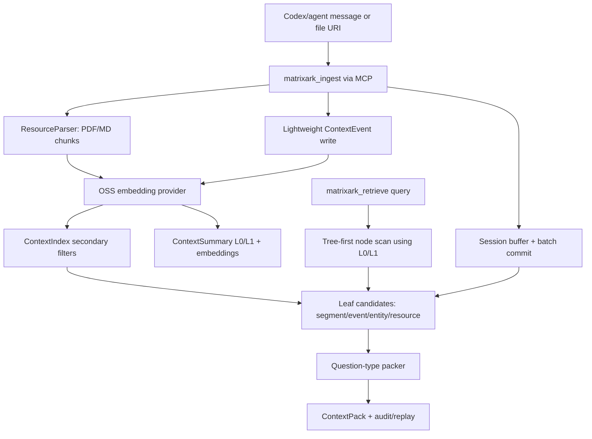

# MatrixArk Message + Resource Debug Trace

This debug run ingests LOCOMO-style multi-turn conversation messages and several PDF/Markdown resources, then retrieves one ContextPack. It is meant for inspecting exactly what MatrixArk writes and reads during ingestion, extraction, chunking, summary generation, embedding storage, tree traversal, secondary-index filtering, packing, audit, and replay.

## Pipeline Diagram



## Re-run

```bash
MATRIXARK_EMBEDDING_PROVIDER=deterministic python3 tools/run_matrixark_message_pdf_debug_trace.py --output-dir docs/debug/matrixark_message_resource_trace
```

## Configuration

- Event log: `<repo>\docs\debug\matrixark_e2e_recent_codex_2pdf_compact_20260704\matrixark_message_resource_debug_trace.jsonl`
- Embedding model: `matrixark-local-token-hash-v1`
- Embedding execution mode: `deterministic-token-hash`
- Query: `What is the current Project Aurora GPU approval, owner, budget cap, deadline, and runbook blocker?`
- Summary refresh: background interval `1000` ms, limit `64` dirty nodes per tick
- Node L1 policy: generate when child summaries, >=3 source events, or >=180 estimated source tokens
- Embedding note: This run completed with the local deterministic embedding backend. The local sentence-transformers OSS probe timed out before this trace was generated, so the data-flow artifact is complete but not an OSS-embedding proof.

## Data Model Field Guide

|model|purpose|important_fields|
|---|---|---|
|ContextNode|Filesystem-like topology. Messages/resources attach to a leaf node, parents are used for traversal.|node, parent, name, compact path|
|ContextEvent|Replayable extracted fact or raw conversational event.|event, node, type, entity, source, text|
|ContextSegment|Batch/session topic segment when a logical window is committed.|segment, node, source events, summary, time range|
|ContextEntity|Evolving state for current preference/status/owner/budget/deadline.|entity, node, type, name, operator, state, source|
|ResourceManifest|Logical imported file/resource version. Raw bytes stay outside TemporalStore.|resource, type, version, content digest, compact scope|
|ResourceChunk|Cited serving chunk from PDF/MD/etc. The manifest owns full raw paths; chunks show compact source labels.|chunk, resource, source, kind, tokens, text|
|ContextSummary|L0/L1 node/resource summary used for preview and tree traversal.|summary, type, node, source count, text|
|ContextEmbedding|Vector stored separately for summaries, chunks, events, entities, and resources.|type, ref, dim, preview|
|ContextIndex|Bounded secondary filters before similarity scoring.|model, index, time, node, ref count, sample|
|ContextPackAudit|Optional observability record. Default report shows compact pack, not full audit payloads.|pack id, grouped refs, token summary, warnings|

## Record Counts

|record_type|count|
|---|---|
|context_batch_commit|1|
|context_child_ref|6|
|context_debug_record|2|
|context_embedding|69|
|context_entity|9|
|context_entity_update_audit|5|
|context_event|14|
|context_extraction_audit|1|
|context_index|84|
|context_node|7|
|context_recall_reinforcement|3|
|context_segment|3|
|context_summary|41|
|context_summary_dirty|69|
|matrixark_audit_log|14|
|matrixark_idempotency|12|
|matrixark_metric|2|
|resource_chunk|2|
|resource_import_task|6|
|resource_manifest|2|
|resource_registry|2|
|session_buffer_event|10|

## Input Messages

|role|content|
|---|---|
|user|Alice from finance approved the GPU purchase request for Project Aurora after reviewing the Q3 budget.|
|assistant|Recorded: Project Aurora GPU purchase is approved by Alice in finance, pending procurement owner assignment.|
|user|Bob will own procurement, and the budget cap is 42000 dollars for the initial GPU batch.|
|assistant|I will track Bob as procurement owner and the 42000 dollar cap for the initial batch.|
|user|The deadline is July 15, 2026, and the runbook says finance approval must be attached before vendor selection.|
|assistant|The active deadline is July 15, 2026. Vendor selection requires the finance approval attachment.|
|user|Correction: Alice raised the cap to 45000 dollars after the backup GPU quote came in.|
|assistant|Updated: the current Project Aurora GPU budget cap is 45000 dollars.|

## Resources

|rid|type|title|source|lines|
|---|---|---|---|---|
|r1|pdf|Project Aurora GPU Approval Packet|<repo>\docs\debug\matrixark_e2e_recent_codex_2pdf_compact_20260704\fixtures\aurora_gpu_approval_packet.pdf|5|
|r2|pdf|GPU Procurement Runbook|<repo>\docs\debug\matrixark_e2e_recent_codex_2pdf_compact_20260704\fixtures\aurora_gpu_runbook.pdf|4|

## Resource Import Tasks

|status|type|source|chunks|facts|entities|
|---|---|---|---|---|---|
|queued|pdf|<repo>\docs\debug\matrixark_e2e_recent_codex_2pdf_compact_20260704\fixtures\aurora_gpu_approval_packet.pdf||||
|running|pdf|<repo>\docs\debug\matrixark_e2e_recent_codex_2pdf_compact_20260704\fixtures\aurora_gpu_approval_packet.pdf||||
|completed|pdf|<repo>\docs\debug\matrixark_e2e_recent_codex_2pdf_compact_20260704\fixtures\aurora_gpu_approval_packet.pdf|1|2|2|
|queued|pdf|<repo>\docs\debug\matrixark_e2e_recent_codex_2pdf_compact_20260704\fixtures\aurora_gpu_runbook.pdf||||
|running|pdf|<repo>\docs\debug\matrixark_e2e_recent_codex_2pdf_compact_20260704\fixtures\aurora_gpu_runbook.pdf||||
|completed|pdf|<repo>\docs\debug\matrixark_e2e_recent_codex_2pdf_compact_20260704\fixtures\aurora_gpu_runbook.pdf|1|2|2|

## Resource Chunks

|chunk|resource|source|kind|tokens|text|
|---|---|---|---|---|---|
|252983731941246106|7529073535243352042|page=1|pdf_page|51|Project Aurora GPU Approval Packet Decision: Alice approved the Project Aurora GPU purchase after finance review. Own...|
|4996044706456527137|4051654065808865899|page=1|pdf_page|43|GPU Procurement Runbook Procedure: Attach finance approval before vendor selection. Procedure: Compare primary and ba...|

## Extracted Events

|event|node|type|entity|source|text|
|---|---|---|---|---|---|
|390515146070215547|2100209595829882121||||user: Alice from finance approved the GPU purchase request for Project Aurora after reviewing the Q3 budget.|
|1557402973722976893|2100209595829882121||||assistant: Recorded: Project Aurora GPU purchase is approved by Alice in finance, pending procurement owner assignment.|
|1537019087039074216|2100209595829882121||||user: Bob will own procurement, and the budget cap is 42000 dollars for the initial GPU batch.|
|8281355690372387016|2100209595829882121||||assistant: I will track Bob as procurement owner and the 42000 dollar cap for the initial batch.|
|8394769407351691099|2100209595829882121||||user: The deadline is July 15, 2026, and the runbook says finance approval must be attached before vendor selection.|
|199706346490473758|2100209595829882121||||assistant: The active deadline is July 15, 2026. Vendor selection requires the finance approval attachment.|
|4785019507418970771|2100209595829882121||||user: Correction: Alice raised the cap to 45000 dollars after the backup GPU quote came in.|
|5575279812667982889|2100209595829882121||||assistant: Updated: the current Project Aurora GPU budget cap is 45000 dollars.|
|5560117811447811670|1737304210274426578|resource_decision||page=1|resource_decision: Alice approved the Project Aurora GPU purchase after finance review|
|7961743726253113316|1737304210274426578|resource_owner||page=1|resource_owner: Bob owns procurement and vendor coordination|
|8406585495907365101|1737304210274426578||||tool: Import PDF resource for MatrixArk parsing: Project Aurora GPU Approval Packet|
|4203705342578598515|1737304210274426578|resource_troubleshooting_step||page=1|resource_troubleshooting_step: Procedure: Attach finance approval before vendor selection|
|1110371357745234587|1737304210274426578|resource_approval||page=1|resource_approval: before vendor selection|
|1902485603234667889|1737304210274426578||||tool: Import PDF resource for MatrixArk parsing: GPU Procurement Runbook|

## Extracted Entities

|entity|node|type|name|op|state|source|
|---|---|---|---|---|---|---|
|1488030737650625042|2100209595829882121|current_plan|current_plan|LLM_MERGE|track Bob as procurement owner and the 42000 dollar cap for the initial batch||
|5205088207995267081|2100209595829882121|approval_state|the GPU purchase request for Project Aurora after reviewing the Q3 budget|LLM_MERGE|the GPU purchase request for Project Aurora after reviewing the Q3 budget||
|5708414255151575681|2100209595829882121|approval_state|by Alice in finance, pending procurement owner assignment|LLM_MERGE|by Alice in finance, pending procurement owner assignment||
|8967060400784335657|2100209595829882121|approval_state|must be attached before vendor selection|LLM_MERGE|must be attached before vendor selection||
|1722827731307680407|2100209595829882121|approval_state|attachment|LLM_MERGE|attachment||
|6247907100159583553|1737304210274426578|resource_decision|decision:Alice approved the Project Aurora GPU purchase after finance review|LATEST|resource_decision: Alice approved the Project Aurora GPU purchase after finance review. Source: Project Aurora GPU Ap...|page=1|
|9084589347207474833|1737304210274426578|resource_owner|owner:Bob owns procurement and vendor coordination|LATEST|resource_owner: Bob owns procurement and vendor coordination. Source: Project Aurora GPU Approval Packet Decision: Al...|page=1|
|5206464065100464610|1737304210274426578|resource_troubleshooting|troubleshooting:Procedure: Attach finance approval before vendor selection|LATEST|resource_troubleshooting_step: Procedure: Attach finance approval before vendor selection. Source: GPU Procurement Ru...|page=1|
|6041746208301469057|1737304210274426578|resource_approval|approval:before vendor selection|LATEST|resource_approval: before vendor selection. Source: GPU Procurement Runbook Procedure: Attach finance approval before...|page=1|

## Summaries

|type|summary|node|sources|text|
|---|---|---|---|---|
|session_l0|8695652974415713980|2100209595829882121|0|user: Alice from finance approved the GPU purchase request for Project Aurora after reviewing the Q3 budget. user: Al...|
|batch_l0|3229605441134634939|2100209595829882121|8|user: Alice from finance approved the GPU purchase request for Project Aurora after reviewing the Q3 budget. assistan...|
|resource_l0|5044606450940775875|1737304210274426578|1|resource: <repo>\docs\debug\matrixark_e2e_recent_cod...|
|session_l0|8695652974415713980|1737304210274426578|0|user: Alice from finance approved the GPU purchase request for Project Aurora after reviewing the Q3 budget. user: Al...|
|resource_l0|3282433690769415239|1737304210274426578|1|resource: <repo>\docs\debug\matrixark_e2e_recent_cod...|
|node_l0|1886266633781634111|3084181658660614334|0|tenant:tenant_codex / user:local-user / session:debug-message-pdf-session :: user: Alice from finance approved the GPU...|
|node_l1|1616491761191208179|3084181658660614334|0|Context node tenant:tenant_codex / user:local-user / session:debug-message-pdf-session. Rich overview: user: Alice fro...|
|node_l0|7072998724969009401|2100209595829882121|8|tenant:tenant_codex / user:local-user / session:debug-message-pdf-session / conversation:project_aurora :: user: Alice...|
|node_l1|3186282447509310879|2100209595829882121|8|Context node tenant:tenant_codex / user:local-user / session:debug-message-pdf-session / conversation:project_aurora. ...|
|node_l0|4626625830169563149|3263141514618168867|0|tenant:tenant_codex :: user: Alice from finance approved the GPU purchase request for Project Aurora after reviewing ...|
|node_l1|1916101716449258884|3263141514618168867|0|Context node tenant:tenant_codex. Rich overview: user: Alice from finance approved the GPU purchase request for Proje...|
|node_l0|5451123137701072075|623184698193930698|0|tenant:tenant_codex / user:local-user :: user: Alice from finance approved the GPU purchase request for Project Aurora...|
|node_l1|7794448877417626891|623184698193930698|0|Context node tenant:tenant_codex / user:local-user. Rich overview: user: Alice from finance approved the GPU purchase ...|
|node_l0|2423087115552912795|1257764480205296887|0|tenant:tenant_codex / user:local-user / resources :: user: Alice from finance approved the GPU purchase request for Pr...|
|node_l1|8165358132187641623|1257764480205296887|0|Context node tenant:tenant_codex / user:local-user / resources. Rich overview: user: Alice from finance approved the G...|
|node_l0|4443347079005396521|5984959491336829337|0|tenant:tenant_codex / user:local-user / resources / project_aurora :: user: Alice from finance approved the GPU purcha...|
|node_l1|7129763152424808338|5984959491336829337|0|Context node tenant:tenant_codex / user:local-user / resources / project_aurora. Rich overview: user: Alice from finan...|
|node_l0|9161093819732845678|1737304210274426578|6|tenant:tenant_codex / user:local-user / resources / project_aurora / gpu_procurement :: Project Aurora GPU Approval Pa...|
|node_l1|1076018507551928025|1737304210274426578|6|Context node tenant:tenant_codex / user:local-user / resources / project_aurora / gpu_procurement. Rich overview: Proj...|

## Node L0/L1 Generation Policy

|node|types|l1|reason|tokens|events|child_summaries|
|---|---|---|---|---|---|---|

## Embeddings

|model|embedding_count|
|---|---|
|matrixark-local-token-hash-v1|46|

|type|ref|dim|preview|
|---|---|---|---|
|session_l0|summary:8695652974415713980|32|[0.0, 0.0, 0.04994, -0.19975, 0.3995, 0.0, -0.24969, 0.04994]|
|event_text|event:390515146070215547|32|[0.0, 0.0, 0.0, -0.2, 0.4, 0.0, -0.2, 0.0]|
|event_text|event:1557402973722976893|32|[0.0, 0.0, 0.26726, 0.0, 0.26726, 0.0, -0.26726, 0.26726]|
|event_text|event:1537019087039074216|32|[0.0, 0.0, -0.2582, -0.2582, 0.2582, 0.2582, 0.0, 0.0]|
|event_text|event:8281355690372387016|32|[0.0, 0.0, -0.22942, 0.22942, 0.0, 0.22942, 0.0, 0.0]|
|event_text|event:8394769407351691099|32|[0.0, -0.22942, -0.22942, -0.22942, 0.22942, 0.0, -0.45883, -0.22942]|
|event_text|event:199706346490473758|32|[0.24254, 0.0, 0.0, 0.0, 0.0, 0.0, -0.24254, 0.0]|
|event_text|event:4785019507418970771|32|[0.0, 0.0, 0.0, -0.44721, 0.22361, 0.22361, 0.22361, 0.0]|
|event_text|event:5575279812667982889|32|[0.0, 0.0, 0.0, 0.0, 0.31623, 0.31623, 0.0, -0.31623]|
|entity_state|entity:1488030737650625042|32|[0.0, 0.0, -0.24254, 0.0, 0.0, 0.24254, 0.0, 0.0]|
|entity_state|entity:5205088207995267081|32|[0.0, 0.24254, 0.0, -0.24254, 0.24254, 0.0, 0.0, 0.0]|
|entity_state|entity:5708414255151575681|32|[0.0, 0.33333, 0.33333, 0.0, 0.0, 0.0, 0.0, 0.33333]|
|entity_state|entity:8967060400784335657|32|[0.0, 0.0, 0.0, -0.44721, 0.0, 0.44721, -0.44721, 0.0]|
|entity_state|entity:1722827731307680407|32|[0.70711, 0.70711, 0.0, 0.0, 0.0, 0.0, 0.0, 0.0]|
|segment_text|segment:2704430496910278940|32|[0.0, -0.07538, -0.07538, -0.30151, 0.15076, 0.0, -0.30151, 0.0]|
|segment_text|segment:3708475525076359226|32|[0.0, 0.0, 0.0, -0.3849, 0.0, 0.19245, 0.19245, 0.19245]|
|segment_text|segment:2330412898750113116|32|[0.0, 0.0, -0.22361, 0.0, 0.22361, 0.22361, 0.0, 0.0]|
|batch_l0|summary:3229605441134634939|32|[0.05083, -0.05083, -0.10167, -0.1525, 0.35583, 0.20333, -0.20333, 0.0]|
|resource_l0|summary:5044606450940775875|32|[0.0, -0.08944, -0.08944, -0.44721, 0.26833, 0.17888, -0.08944, 0.08944]|
|resource_chunk|resource_chunk:252983731941246106|32|[0.0, -0.0767, -0.0767, -0.46018, 0.23009, 0.0767, -0.0767, 0.15339]|
|event_text|event:5560117811447811670|32|[0.0, 0.0, -0.08704, -0.43519, 0.26112, 0.0, -0.34815, 0.08704]|
|entity_state|entity:6247907100159583553|32|[0.0, -0.07762, -0.07762, -0.38808, 0.31046, 0.0, -0.23284, 0.07762]|
|event_text|event:7961743726253113316|32|[0.0, 0.1, -0.2, -0.6, 0.2, 0.0, -0.3, 0.1]|
|entity_state|entity:9084589347207474833|32|[0.0, 0.08671, -0.26013, -0.69369, 0.17342, 0.0, -0.26013, 0.08671]|
|event_text|event:8406585495907365101|32|[0.0, 0.0, 0.0, -0.5, 0.25, 0.0, -0.25, 0.0]|
|resource_l0|summary:3282433690769415239|32|[0.08737, -0.08737, -0.26211, -0.52422, -0.17474, 0.43685, 0.08737, 0.0]|
|resource_chunk|resource_chunk:4996044706456527137|32|[0.07293, -0.07293, -0.2188, -0.58346, -0.29173, 0.36466, 0.07293, 0.07293]|
|event_text|event:4203705342578598515|32|[0.09091, 0.0, -0.27273, -0.54546, -0.36364, 0.36364, -0.09091, 0.0]|
|entity_state|entity:5206464065100464610|32|[0.08333, -0.08333, -0.16667, -0.5, -0.33333, 0.33333, 0.0, 0.0]|
|event_text|event:1110371357745234587|32|[0.09667, 0.0, -0.29002, -0.58004, -0.29002, 0.3867, -0.09667, 0.0]|
|entity_state|entity:6041746208301469057|32|[0.08392, -0.08392, -0.25175, -0.58743, -0.25175, 0.41959, 0.0, 0.0]|
|event_text|event:1902485603234667889|32|[0.0, 0.0, 0.0, -0.57735, 0.0, 0.0, -0.28868, 0.0]|
|node_l0|summary:1886266633781634111|32|[0.0, 0.0, 0.0, -0.14434, 0.57735, 0.0, -0.14434, 0.0]|
|node_l1|summary:1616491761191208179|32|[0.0336, -0.0336, -0.06719, -0.23517, 0.40315, 0.16798, -0.20157, 0.0]|
|node_l0|summary:7072998724969009401|32|[0.0, 0.0, 0.0, -0.28571, 0.42857, 0.14286, -0.14286, 0.0]|
|node_l1|summary:3186282447509310879|32|[0.0, -0.03975, -0.11924, -0.23848, 0.35772, 0.23848, -0.15899, -0.07949]|
|node_l0|summary:4626625830169563149|32|[0.0, 0.0, 0.0, -0.21953, 0.43906, -0.10976, -0.21953, 0.0]|
|node_l1|summary:1916101716449258884|32|[0.0, -0.02704, -0.02704, -0.16222, 0.35148, 0.05407, -0.27037, 0.02704]|
|node_l0|summary:5451123137701072075|32|[0.0, 0.0, 0.0, -0.2325, 0.46499, 0.0, -0.2325, 0.0]|
|node_l1|summary:7794448877417626891|32|[0.0, -0.02736, -0.02736, -0.16415, 0.38302, 0.02736, -0.27359, 0.02736]|
|node_l0|summary:2423087115552912795|32|[0.0, -0.11868, 0.0, -0.23736, 0.47471, 0.0, -0.23736, 0.0]|
|node_l1|summary:8165358132187641623|32|[0.0, -0.07809, -0.11713, -0.39043, 0.2733, 0.15617, -0.15617, 0.03904]|
|node_l0|summary:4443347079005396521|32|[0.0, -0.125, 0.0, -0.125, 0.5, 0.125, -0.25, 0.0]|
|node_l1|summary:7129763152424808338|32|[0.0, -0.03913, -0.07827, -0.39133, 0.27393, 0.19567, -0.15653, 0.03913]|
|node_l0|summary:9161093819732845678|32|[0.0, 0.0, 0.0, -0.343, 0.5145, 0.1715, 0.1715, 0.0]|
|node_l1|summary:1076018507551928025|32|[0.03931, -0.03931, -0.19657, -0.58971, 0.11794, 0.15726, -0.2752, 0.07863]|

## Secondary Index Postings

|model|index|time|node|refs|sample|
|---|---|---|---|---|---|
|context_batch_commit|classification:batch_memory|1783113360000|2100209595829882121|1|[5748013813980329926]|
|context_batch_commit|entity_type:approval_state|1783113360000|2100209595829882121|1|[5748013813980329926]|
|context_batch_commit|entity_type:current_plan|1783113360000|2100209595829882121|1|[5748013813980329926]|
|context_batch_commit|event_type:correction|1783113360000|2100209595829882121|1|[5748013813980329926]|
|context_batch_commit|segment_topic:approval_budget|1783113360000|2100209595829882121|1|[5748013813980329926]|
|context_batch_commit|segment_topic:correction|1783113360000|2100209595829882121|1|[5748013813980329926]|
|context_batch_commit|source_type:message|1783113360000|2100209595829882121|1|[5748013813980329926]|
|context_batch_commit|status:observed|1783113360000|2100209595829882121|1|[5748013813980329926]|
|context_event|event_type:confirmation|1783113360000|2100209595829882121|2|[1557402973722976893, 390515146070215547]|
|context_event|event_type:correction|1783113360000|2100209595829882121|2|[4785019507418970771, 5575279812667982889]|
|context_event|event_type:dialogue_batch|1783113360000|2100209595829882121|2|[199706346490473758, 8394769407351691099]|
|context_event|event_type:dialogue_batch|1783113360000|1737304210274426578|2|[1902485603234667889, 8406585495907365101]|
|context_event|event_type:plan_update|1783113360000|2100209595829882121|2|[1537019087039074216, 8281355690372387016]|
|context_event|source_type:message|1783113360000|2100209595829882121|8|[1537019087039074216, 1557402973722976893, 199706346490473758]|
|context_event|source_type:resource|1783113360000|1737304210274426578|2|[1902485603234667889, 8406585495907365101]|
|context_event|status:observed|1783113360000|2100209595829882121|8|[1537019087039074216, 1557402973722976893, 199706346490473758]|
|context_event|status:observed|1783113360000|1737304210274426578|2|[1902485603234667889, 8406585495907365101]|
|context_summary|resource_type:pdf|1783113360000|1737304210274426578|2|[3282433690769415239, 5044606450940775875]|
|context_summary|source_type:resource|1783113360000|1737304210274426578|2|[3282433690769415239, 5044606450940775875]|
|resource_chunk|keyword:approval|1783113360000|1737304210274426578|2|[252983731941246106, 7529073535243352042]|
|resource_chunk|keyword:attach|1783113360000|1737304210274426578|2|[4051654065808865899, 4996044706456527137]|
|resource_chunk|keyword:aurora|1783113360000|1737304210274426578|2|[252983731941246106, 7529073535243352042]|
|resource_chunk|keyword:decision|1783113360000|1737304210274426578|2|[252983731941246106, 7529073535243352042]|
|resource_chunk|keyword:finance|1783113360000|1737304210274426578|2|[4051654065808865899, 4996044706456527137]|
|resource_chunk|keyword:gpu|1783113360000|1737304210274426578|4|[252983731941246106, 4051654065808865899, 4996044706456527137]|
|resource_chunk|keyword:packet|1783113360000|1737304210274426578|2|[252983731941246106, 7529073535243352042]|
|resource_chunk|keyword:procedure|1783113360000|1737304210274426578|2|[4051654065808865899, 4996044706456527137]|
|resource_chunk|keyword:procurement|1783113360000|1737304210274426578|2|[4051654065808865899, 4996044706456527137]|
|resource_chunk|keyword:project|1783113360000|1737304210274426578|2|[252983731941246106, 7529073535243352042]|
|resource_chunk|keyword:runbook|1783113360000|1737304210274426578|2|[4051654065808865899, 4996044706456527137]|
|resource_chunk|resource_type:pdf|1783113360000|1737304210274426578|4|[252983731941246106, 4051654065808865899, 4996044706456527137]|
|resource_chunk|source_type:resource|1783113360000|1737304210274426578|4|[252983731941246106, 4051654065808865899, 4996044706456527137]|
|resource_chunk|unit_kind:pdf_page|1783113360000|1737304210274426578|4|[252983731941246106, 4051654065808865899, 4996044706456527137]|
|resource_fact|entity_type:resource_approval|1783113360000|1737304210274426578|3|[1036509710481650017, 1110371357745234587, 4996044706456527137]|
|resource_fact|entity_type:resource_decision|1783113360000|1737304210274426578|3|[252983731941246106, 5560117811447811670, 8585682261562719907]|
|resource_fact|entity_type:resource_fact|1783113360000|1737304210274426578|8|[1036509710481650017, 1110371357745234587, 252983731941246106]|
|resource_fact|entity_type:resource_owner|1783113360000|1737304210274426578|3|[252983731941246106, 7961743726253113316, 8585682261562719907]|
|resource_fact|entity_type:resource_troubleshooting|1783113360000|1737304210274426578|3|[1036509710481650017, 4203705342578598515, 4996044706456527137]|
|resource_fact|event_type:resource_approval|1783113360000|1737304210274426578|3|[1036509710481650017, 1110371357745234587, 4996044706456527137]|
|resource_fact|event_type:resource_decision|1783113360000|1737304210274426578|3|[252983731941246106, 5560117811447811670, 8585682261562719907]|
|resource_fact|event_type:resource_owner|1783113360000|1737304210274426578|3|[252983731941246106, 7961743726253113316, 8585682261562719907]|
|resource_fact|event_type:resource_troubleshooting_step|1783113360000|1737304210274426578|3|[1036509710481650017, 4203705342578598515, 4996044706456527137]|
|resource_fact|keyword:approval|1783113360000|1737304210274426578|4|[252983731941246106, 5560117811447811670, 7961743726253113316]|
|resource_fact|keyword:aurora|1783113360000|1737304210274426578|4|[252983731941246106, 5560117811447811670, 7961743726253113316]|
|resource_fact|keyword:gpu|1783113360000|1737304210274426578|8|[1036509710481650017, 1110371357745234587, 252983731941246106]|
|resource_fact|keyword:procedure|1783113360000|1737304210274426578|4|[1036509710481650017, 1110371357745234587, 4203705342578598515]|
|resource_fact|keyword:procurement|1783113360000|1737304210274426578|4|[1036509710481650017, 1110371357745234587, 4203705342578598515]|
|resource_fact|keyword:project|1783113360000|1737304210274426578|4|[252983731941246106, 5560117811447811670, 7961743726253113316]|
|resource_fact|keyword:runbook|1783113360000|1737304210274426578|4|[1036509710481650017, 1110371357745234587, 4203705342578598515]|
|resource_fact|resource_type:pdf|1783113360000|1737304210274426578|8|[1036509710481650017, 1110371357745234587, 252983731941246106]|
|resource_fact|source_type:resource_fact|1783113360000|1737304210274426578|8|[1036509710481650017, 1110371357745234587, 252983731941246106]|
|resource_fact|unit_kind:pdf_page|1783113360000|1737304210274426578|8|[1036509710481650017, 1110371357745234587, 252983731941246106]|

## Retrieval Scan

Retrieval uses the same scope as ingestion. The intended order is: understand the query, apply scope and secondary-index filters, scan ContextNode L0/L1 summary embeddings to choose folders, fetch leaf candidates, then score segments/events/entities/resource chunks and pack the final ContextPack under the token budget. If a summary is missing, MatrixArk can still fall back to recent events/entities/chunks.

```json
{
  "context_pack": {
    "context_pack_id": "3950118627389790960",
    "counts": {
      "refs": {
        "compression": 0,
        "entity": 4,
        "event": 2,
        "resource_chunk": 2,
        "resource_entity_fact": 0,
        "resource_fact": 1,
        "segment": 1,
        "skill_section": 0,
        "summary": 0
      }
    },
    "groups": [
      {
        "items": [
          {
            "entity": "the GPU purchase request for Project Aurora after reviewing the Q3 budget",
            "entity_type": "approval_state",
            "text": "approval_state: the GPU purchase request for Project Aurora after reviewing the Q3 budget = the GPU purchase request for Project Aurora after reviewing the Q3 budget",
            "tokens": 25
          },
          {
            "entity": "must be attached before vendor selection",
            "entity_type": "approval_state",
            "text": "approval_state: must be attached before vendor selection = must be attached before vendor selection",
            "tokens": 13
          },
          {
            "entity": "by Alice in finance, pending procurement owner assignment",
            "entity_type": "approval_state",
            "text": "approval_state: by Alice in finance, pending procurement owner assignment = by Alice in finance, pending procurement owner assignment",
            "tokens": 17
          },
          {
            "entity": "attachment",
            "entity_type": "approval_state",
            "text": "approval_state: attachment = attachment",
            "tokens": 3
          }
        ],
        "n": 4,
        "type": "entity"
      },
      {
        "class": "resource_fact",
        "items": [
          {
            "text": "Project Aurora GPU Approval Packet\nDecision: Alice approved the Project Aurora GPU purchase after finance review.\nOwner: Bob owns procurement and vendor coordination.\nBudget: Current approved cap is 45000 dollars.\nDeadline: Purchase order must be ready by July 15, 2026.\nRisk: Vendor selection is blocked if finance approval is not attached.",
            "tokens": 51
          }
        ],
        "n": 1,
        "type": "event"
      },
      {
        "items": [
          {
            "resource_type": "pdf",
            "source": "<repo>\\docs\\debug\\matrixark_e2e_recent_codex_2pdf_compact_20260704\\fixtures\\aurora_gpu_approval_packet.pdf#page=1",
            "text": "resource page=1: Project Aurora GPU Approval Packet\nDecision: Alice approved the Project Aurora GPU purchase after finance review.\nOwner: Bob owns procurement and vendor coordination.\nBudget: Current approved cap is 45000 dollars.\nDeadline: Purchase order must be ready by July 15, 2026.\nRisk: Vendor selection is blocked if finance approval is not attached.",
            "tokens": 54,
            "unit_kind": "pdf_page",
            "version": "d9847f56b13efbdd",
            "version_state": "current"
          },
          {
            "resource_type": "pdf",
            "source": "<repo>\\docs\\debug\\matrixark_e2e_recent_codex_2pdf_compact_20260704\\fixtures\\aurora_gpu_runbook.pdf#page=1",
            "text": "resource page=1: GPU Procurement Runbook\nProcedure: Attach finance approval before vendor selection.\nProcedure: Compare primary and backup GPU quotes before purchase order creation.\nTroubleshooting: If approval attachment is missing, notify Alice and stop vendor selection.\nAudit: Store final vendor selection evidence with the purchase order.",
            "tokens": 46,
            "unit_kind": "pdf_page",
            "version": "c950b972df2d7e46",
            "version_state": "current"
          }
        ],
        "n": 2,
        "type": "resource_chunk"
      },
      {
        "items": [
          {
            "text": "0: Alice from finance approved the GPU purchase request for Project Aurora after reviewing the Q3 budget. 1: Recorded: Project Aurora GPU purchase is approved by Alice in finance, pending procurement owner assignment. 2: Bob will own procurement, and the budget cap is 42000 dollars for the initial GPU batch. 4: The deadline is July 15, 2026, and the runbook says finance approval must be attached before vendor sele...",
            "tokens": 69
          }
        ],
        "n": 1,
        "type": "segment"
      },
      {
        "items": [
          {
            "text": "user: Alice from finance approved the GPU purchase request for Project Aurora after reviewing the Q3 budget.",
            "tokens": 17
          },
          {
            "text": "assistant: Recorded: Project Aurora GPU purchase is approved by Alice in finance, pending procurement owner assignment.",
            "tokens": 16
          }
        ],
        "n": 2,
        "type": "event"
      }
    ],
    "tokens": {
      "remote": 311,
      "remote_budget": 9872,
      "total": 311
    }
  },
  "context_pack_id": "3950118627389790960",
  "quality_warnings": [],
  "query": "What is the current Project Aurora GPU approval, owner, budget cap, deadline, and runbook blocker?",
  "used_context_tokens": 311
}
```

## ContextPack

```json
{
  "context_pack_id": "3950118627389790960",
  "counts": {
    "refs": {
      "compression": 0,
      "entity": 4,
      "event": 2,
      "resource_chunk": 2,
      "resource_entity_fact": 0,
      "resource_fact": 1,
      "segment": 1,
      "skill_section": 0,
      "summary": 0
    }
  },
  "groups": [
    {
      "items": [
        {
          "entity": "the GPU purchase request for Project Aurora after reviewing the Q3 budget",
          "entity_type": "approval_state",
          "text": "approval_state: the GPU purchase request for Project Aurora after reviewing the Q3 budget = the GPU purchase request for Project Aurora after reviewing the Q3 budget",
          "tokens": 25
        },
        {
          "entity": "must be attached before vendor selection",
          "entity_type": "approval_state",
          "text": "approval_state: must be attached before vendor selection = must be attached before vendor selection",
          "tokens": 13
        },
        {
          "entity": "by Alice in finance, pending procurement owner assignment",
          "entity_type": "approval_state",
          "text": "approval_state: by Alice in finance, pending procurement owner assignment = by Alice in finance, pending procurement owner assignment",
          "tokens": 17
        },
        {
          "entity": "attachment",
          "entity_type": "approval_state",
          "text": "approval_state: attachment = attachment",
          "tokens": 3
        }
      ],
      "n": 4,
      "type": "entity"
    },
    {
      "class": "resource_fact",
      "items": [
        {
          "text": "Project Aurora GPU Approval Packet\nDecision: Alice approved the Project Aurora GPU purchase after finance review.\nOwner: Bob owns procurement and vendor coordination.\nBudget: Current approved cap is 45000 dollars.\nDeadline: Purchase order must be ready by July 15, 2026.\nRisk: Vendor selection is blocked if finance approval is not attached.",
          "tokens": 51
        }
      ],
      "n": 1,
      "type": "event"
    },
    {
      "items": [
        {
          "resource_type": "pdf",
          "source": "<repo>\\docs\\debug\\matrixark_e2e_recent_codex_2pdf_compact_20260704\\fixtures\\aurora_gpu_approval_packet.pdf#page=1",
          "text": "resource page=1: Project Aurora GPU Approval Packet\nDecision: Alice approved the Project Aurora GPU purchase after finance review.\nOwner: Bob owns procurement and vendor coordination.\nBudget: Current approved cap is 45000 dollars.\nDeadline: Purchase order must be ready by July 15, 2026.\nRisk: Vendor selection is blocked if finance approval is not attached.",
          "tokens": 54,
          "unit_kind": "pdf_page",
          "version": "d9847f56b13efbdd",
          "version_state": "current"
        },
        {
          "resource_type": "pdf",
          "source": "<repo>\\docs\\debug\\matrixark_e2e_recent_codex_2pdf_compact_20260704\\fixtures\\aurora_gpu_runbook.pdf#page=1",
          "text": "resource page=1: GPU Procurement Runbook\nProcedure: Attach finance approval before vendor selection.\nProcedure: Compare primary and backup GPU quotes before purchase order creation.\nTroubleshooting: If approval attachment is missing, notify Alice and stop vendor selection.\nAudit: Store final vendor selection evidence with the purchase order.",
          "tokens": 46,
          "unit_kind": "pdf_page",
          "version": "c950b972df2d7e46",
          "version_state": "current"
        }
      ],
      "n": 2,
      "type": "resource_chunk"
    },
    {
      "items": [
        {
          "text": "0: Alice from finance approved the GPU purchase request for Project Aurora after reviewing the Q3 budget. 1: Recorded: Project Aurora GPU purchase is approved by Alice in finance, pending procurement owner assignment. 2: Bob will own procurement, and the budget cap is 42000 dollars for the initial GPU batch. 4: The deadline is July 15, 2026, and the runbook says finance approval must be attached before vendor sele...",
          "tokens": 69
        }
      ],
      "n": 1,
      "type": "segment"
    },
    {
      "items": [
        {
          "text": "user: Alice from finance approved the GPU purchase request for Project Aurora after reviewing the Q3 budget.",
          "tokens": 17
        },
        {
          "text": "assistant: Recorded: Project Aurora GPU purchase is approved by Alice in finance, pending procurement owner assignment.",
          "tokens": 16
        }
      ],
      "n": 2,
      "type": "event"
    }
  ],
  "tokens": {
    "remote": 311,
    "remote_budget": 9872,
    "total": 311
  }
}
```

## Replay

```json
{
  "context_pack_id": "3950118627389790960"
}
```
