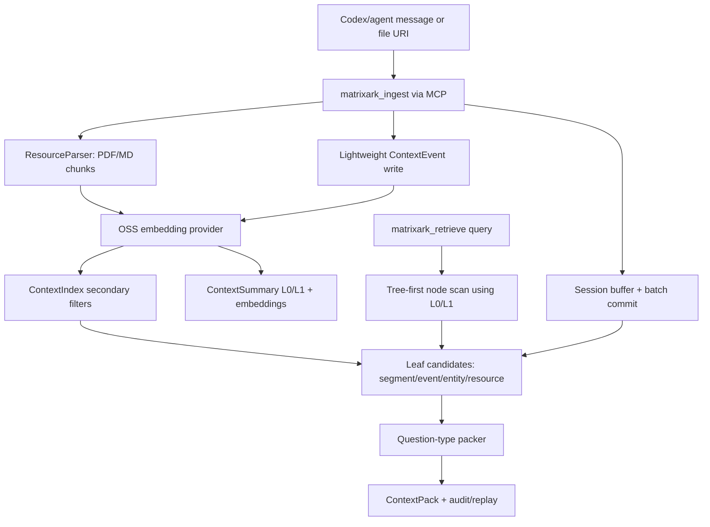

# MatrixArk Message + Resource Debug Trace

This debug run ingests LOCOMO-style multi-turn conversation messages and several PDF/Markdown resources, then retrieves one ContextPack. It is meant for inspecting exactly what MatrixArk writes and reads during ingestion, extraction, chunking, summary generation, embedding storage, tree traversal, secondary-index filtering, packing, audit, and replay.

## Pipeline Diagram



## Re-run

```bash
MATRIXARK_EMBEDDING_PROVIDER=deterministic python3 tools/run_matrixark_message_pdf_debug_trace.py --output-dir docs/debug/matrixark_message_resource_trace
```

## Configuration

- Event log: `/root/src/github-services/TemporalStore/docs/debug/matrixark_message_resource_trace/matrixark_message_resource_debug_trace.jsonl`
- Embedding model: `matrixark-local-token-hash-v1`
- Embedding execution mode: `deterministic-token-hash`
- Query: `What is the current Project Aurora GPU approval, owner, budget cap, deadline, and runbook blocker?`
- Summary refresh: background interval `1000` ms, limit `64` dirty nodes per tick
- Node L1 policy: generate when child summaries, >=3 source events, or >=180 estimated source tokens
- Embedding note: This run completed with the local deterministic embedding backend. The local sentence-transformers OSS probe timed out before this trace was generated, so the data-flow artifact is complete but not an OSS-embedding proof.

## Data Model Field Guide

|model|purpose|important_fields|
|---|---|---|
|ContextNode|Filesystem-like topology. Messages/resources attach to a leaf node, parents are used for traversal.|node_hash, parent_hash, node_name, node_path, depth, scope_key|
|ContextEvent|Replayable extracted fact or raw conversational event.|event_id_hash, node_hash, source_ref, summary_text, event_type, entity_type, timestamp|
|ContextSegment|Batch/session topic segment when a logical window is committed.|segment_hash, node_hash, source_event_ids, summary_text, topic, time_range|
|ContextEntity|Evolving state for current preference/status/owner/budget/deadline.|entity_hash, entity_type, entity_name, state, source_ref, valid_from, stale_blockers|
|ResourceManifest|Logical imported file/resource version. Raw bytes stay outside TemporalStore.|resource_hash, raw_uri, resource_type, resource_version, content_hash, scope_key|
|ResourceChunk|Cited serving chunk from PDF/MD/etc.|chunk_hash, raw_uri, source_ref, text, token_estimate, unit_kind, page_number, heading_slug|
|ContextSummary|L0/L1 node/resource summary used for preview and tree traversal.|summary_hash, summary_type, node_hash, summary_text, source_event_ids, source_chunk_hashes|
|ContextEmbedding|Vector stored separately for summaries, chunks, events, entities, and resources.|embedding_type, ref_type, ref_hash, model, dim, vector|
|ContextIndex|Bounded secondary filters before similarity scoring.|index_name, index_value, ref_type, ref_hash, node_hash, chunk_hash|
|ContextPackAudit|Explains selected/dropped refs, scores, token costs, warnings, and replay path.|context_pack_id, selected_refs, dropped_refs, used_context_tokens, quality_warnings|

## Record Counts

|record_type|count|
|---|---|
|context_batch_commit|1|
|context_child_ref|6|
|context_debug_record|49|
|context_embedding|111|
|context_entity|31|
|context_entity_update_audit|5|
|context_event|39|
|context_extraction_audit|1|
|context_index|377|
|context_node|7|
|context_pack_audit|1|
|context_segment|3|
|context_summary|33|
|context_summary_dirty|86|
|context_summary_refresh_audit|7|
|matrixark_audit_log|18|
|matrixark_metric|5|
|resource_chunk|5|
|resource_import_task|15|
|resource_manifest|5|
|resource_registry|5|
|session_buffer_event|13|

## Input Messages

|role|content|
|---|---|
|user|Alice from finance approved the GPU purchase request for Project Aurora after reviewing the Q3 budget.|
|assistant|Recorded: Project Aurora GPU purchase is approved by Alice in finance, pending procurement owner assignment.|
|user|Bob will own procurement, and the budget cap is 42000 dollars for the initial GPU batch.|
|assistant|I will track Bob as procurement owner and the 42000 dollar cap for the initial batch.|
|user|The deadline is July 15, 2026, and the runbook says finance approval must be attached before vendor selection.|
|assistant|The active deadline is July 15, 2026. Vendor selection requires the finance approval attachment.|
|user|Correction: Alice raised the cap to 45000 dollars after the backup GPU quote came in.|
|assistant|Updated: the current Project Aurora GPU budget cap is 45000 dollars.|

## Resources

|raw_uri|title|line_count|
|---|---|---|
|/root/src/github-services/TemporalStore/docs/debug/matrixark_message_resource_trace/fixtures/aurora_gpu_approval_pack...|Project Aurora GPU Approval Packet|5|
|/root/src/github-services/TemporalStore/docs/debug/matrixark_message_resource_trace/fixtures/aurora_gpu_runbook.pdf|GPU Procurement Runbook|4|
|/root/src/github-services/TemporalStore/docs/debug/matrixark_message_resource_trace/fixtures/aurora_budget_update.pdf|Budget Update Memo|4|
|/root/src/github-services/TemporalStore/docs/debug/matrixark_message_resource_trace/fixtures/aurora_gpu_policy.md|Project Aurora GPU Policy|6|
|/root/src/github-services/TemporalStore/docs/debug/matrixark_message_resource_trace/fixtures/aurora_gpu_troubleshooti...|Project Aurora GPU Troubleshooting|4|

## Resource Import Tasks

|status|raw_uri|resource_type|chunk_count|resource_fact_count|resource_entity_count|metrics|
|---|---|---|---|---|---|---|
|queued|/root/src/github-services/TemporalStore/docs/debug/matrixark_message_resource_trace/fixtures/aurora_gpu_approval_pack...|pdf|||||
|running|/root/src/github-services/TemporalStore/docs/debug/matrixark_message_resource_trace/fixtures/aurora_gpu_approval_pack...|pdf|||||
|completed|/root/src/github-services/TemporalStore/docs/debug/matrixark_message_resource_trace/fixtures/aurora_gpu_approval_pack...|pdf|1|7|7|{"chunk_count": 1, "cloud_bucket": "", "cloud_key": "", "dedupe_count": 0, "duration_ms": 87.912, "embedding_count": ...|
|queued|/root/src/github-services/TemporalStore/docs/debug/matrixark_message_resource_trace/fixtures/aurora_gpu_runbook.pdf|pdf|||||
|running|/root/src/github-services/TemporalStore/docs/debug/matrixark_message_resource_trace/fixtures/aurora_gpu_runbook.pdf|pdf|||||
|completed|/root/src/github-services/TemporalStore/docs/debug/matrixark_message_resource_trace/fixtures/aurora_gpu_runbook.pdf|pdf|1|3|3|{"chunk_count": 1, "cloud_bucket": "", "cloud_key": "", "dedupe_count": 0, "duration_ms": 6.948, "embedding_count": 8...|
|queued|/root/src/github-services/TemporalStore/docs/debug/matrixark_message_resource_trace/fixtures/aurora_budget_update.pdf|pdf|||||
|running|/root/src/github-services/TemporalStore/docs/debug/matrixark_message_resource_trace/fixtures/aurora_budget_update.pdf|pdf|||||
|completed|/root/src/github-services/TemporalStore/docs/debug/matrixark_message_resource_trace/fixtures/aurora_budget_update.pdf|pdf|1|5|5|{"chunk_count": 1, "cloud_bucket": "", "cloud_key": "", "dedupe_count": 0, "duration_ms": 6.616, "embedding_count": 1...|
|queued|/root/src/github-services/TemporalStore/docs/debug/matrixark_message_resource_trace/fixtures/aurora_gpu_policy.md|md|||||
|running|/root/src/github-services/TemporalStore/docs/debug/matrixark_message_resource_trace/fixtures/aurora_gpu_policy.md|md|||||
|completed|/root/src/github-services/TemporalStore/docs/debug/matrixark_message_resource_trace/fixtures/aurora_gpu_policy.md|md|1|7|7|{"chunk_count": 1, "cloud_bucket": "", "cloud_key": "", "dedupe_count": 0, "duration_ms": 5.543, "embedding_count": 1...|
|queued|/root/src/github-services/TemporalStore/docs/debug/matrixark_message_resource_trace/fixtures/aurora_gpu_troubleshooti...|md|||||
|running|/root/src/github-services/TemporalStore/docs/debug/matrixark_message_resource_trace/fixtures/aurora_gpu_troubleshooti...|md|||||
|completed|/root/src/github-services/TemporalStore/docs/debug/matrixark_message_resource_trace/fixtures/aurora_gpu_troubleshooti...|md|1|4|4|{"chunk_count": 1, "cloud_bucket": "", "cloud_key": "", "dedupe_count": 0, "duration_ms": 3.746, "embedding_count": 1...|

## Resource Chunks

|chunk_hash|raw_uri|source_ref|token_estimate|metadata.unit_kind|metadata.content_hash|text|
|---|---|---|---|---|---|---|
|4418781127472015957|/root/src/github-services/TemporalStore/docs/debug/matrixark_message_resource_trace/fixtures/aurora_gpu_approval_pack...|/root/src/github-services/TemporalStore/docs/debug/matrixark_message_resource_trace/fixtures/aurora_gpu_approval_pack...|51|pdf_page|49199ad5bd94964c|Project Aurora GPU Approval Packet Decision: Alice approved the Project Aurora GPU purchase after finance review. Own...|
|2366525915882116980|/root/src/github-services/TemporalStore/docs/debug/matrixark_message_resource_trace/fixtures/aurora_gpu_runbook.pdf|/root/src/github-services/TemporalStore/docs/debug/matrixark_message_resource_trace/fixtures/aurora_gpu_runbook.pdf#p...|43|pdf_page|7aaae94b56b51807|GPU Procurement Runbook Procedure: Attach finance approval before vendor selection. Procedure: Compare primary and ba...|
|6897463796356321934|/root/src/github-services/TemporalStore/docs/debug/matrixark_message_resource_trace/fixtures/aurora_budget_update.pdf|/root/src/github-services/TemporalStore/docs/debug/matrixark_message_resource_trace/fixtures/aurora_budget_update.pdf...|48|pdf_page|87731a0bb7829d5c|Budget Update Memo Update: The backup GPU quote increased the cap from 42000 dollars to 45000 dollars. Current state:...|
|3940522193127723947|/root/src/github-services/TemporalStore/docs/debug/matrixark_message_resource_trace/fixtures/aurora_gpu_policy.md|/root/src/github-services/TemporalStore/docs/debug/matrixark_message_resource_trace/fixtures/aurora_gpu_policy.md#hea...|47|markdown_section|08cc296494df3867|# Project Aurora GPU Policy Decision: Alice from finance approved the GPU purchase. Owner: Bob owns procurement and v...|
|9062890092492685604|/root/src/github-services/TemporalStore/docs/debug/matrixark_message_resource_trace/fixtures/aurora_gpu_troubleshooti...|/root/src/github-services/TemporalStore/docs/debug/matrixark_message_resource_trace/fixtures/aurora_gpu_troubleshooti...|39|markdown_section|5d8de2f72f13fbb0|# Troubleshooting If vendor selection fails, first verify the finance approval attachment. If the backup quote is use...|

## Extracted Events

|event_id_hash|node_path|internal_extraction.event_type|internal_extraction.entity_type|summary_text|source_ref|
|---|---|---|---|---|---|
|3680358472214133616||||user: Alice from finance approved the GPU purchase request for Project Aurora after reviewing the Q3 budget.||
|2222846978005642488||||assistant: Recorded: Project Aurora GPU purchase is approved by Alice in finance, pending procurement owner assignment.||
|817662366993730525||||user: Bob will own procurement, and the budget cap is 42000 dollars for the initial GPU batch.||
|1555009680425027092||||assistant: I will track Bob as procurement owner and the 42000 dollar cap for the initial batch.||
|1743427827954223012||||user: The deadline is July 15, 2026, and the runbook says finance approval must be attached before vendor selection.||
|7045055022067974278||||assistant: The active deadline is July 15, 2026. Vendor selection requires the finance approval attachment.||
|4017468100979576068||||user: Correction: Alice raised the cap to 45000 dollars after the backup GPU quote came in.||
|850727975256145366||||assistant: Updated: the current Project Aurora GPU budget cap is 45000 dollars.||
|3099022769321969417||||resource_decision: Alice approved the Project Aurora GPU purchase after finance review|/root/src/github-services/TemporalStore/docs/debug/matrixark_message_resource_trace/fixtures/aurora_gpu_approval_pack...|
|2545294082772329203||||resource_owner: Bob owns procurement and vendor coordination|/root/src/github-services/TemporalStore/docs/debug/matrixark_message_resource_trace/fixtures/aurora_gpu_approval_pack...|
|5105176503765859905||||resource_cost: Current approved cap is 45000 dollars|/root/src/github-services/TemporalStore/docs/debug/matrixark_message_resource_trace/fixtures/aurora_gpu_approval_pack...|
|1284491766207212107||||resource_deadline: Purchase order must be ready by July 15, 2026|/root/src/github-services/TemporalStore/docs/debug/matrixark_message_resource_trace/fixtures/aurora_gpu_approval_pack...|
|6873945044330384682||||resource_policy: be ready by July 15, 2026|/root/src/github-services/TemporalStore/docs/debug/matrixark_message_resource_trace/fixtures/aurora_gpu_approval_pack...|
|1400600991763049791||||resource_approval: Packet|/root/src/github-services/TemporalStore/docs/debug/matrixark_message_resource_trace/fixtures/aurora_gpu_approval_pack...|
|3705294793213905754||||resource_risk: Vendor selection is blocked if finance approval is not attached|/root/src/github-services/TemporalStore/docs/debug/matrixark_message_resource_trace/fixtures/aurora_gpu_approval_pack...|
|5654756010519791030||||tool: Import PDF resource for MatrixArk parsing: Project Aurora GPU Approval Packet||
|3738510915562235548||||resource_troubleshooting_step: Procedure: Attach finance approval before vendor selection|/root/src/github-services/TemporalStore/docs/debug/matrixark_message_resource_trace/fixtures/aurora_gpu_runbook.pdf#p...|
|3500512499410010384||||resource_approval: before vendor selection|/root/src/github-services/TemporalStore/docs/debug/matrixark_message_resource_trace/fixtures/aurora_gpu_runbook.pdf#p...|
|5853820214834385870||||resource_procedure: Attach finance approval before vendor selection|/root/src/github-services/TemporalStore/docs/debug/matrixark_message_resource_trace/fixtures/aurora_gpu_runbook.pdf#p...|
|5597740533584615733||||tool: Import PDF resource for MatrixArk parsing: GPU Procurement Runbook||
|1867230627180458883||||resource_cost: Update Memo|/root/src/github-services/TemporalStore/docs/debug/matrixark_message_resource_trace/fixtures/aurora_budget_update.pdf...|
|8527016089933923295||||resource_policy: not be used for current-state answers|/root/src/github-services/TemporalStore/docs/debug/matrixark_message_resource_trace/fixtures/aurora_budget_update.pdf...|
|1753182679162406059||||resource_approval: r: Alice confirmed the updated cap|/root/src/github-services/TemporalStore/docs/debug/matrixark_message_resource_trace/fixtures/aurora_budget_update.pdf...|
|2307859885012344902||||resource_risk: 42000 dollars is historical and should not be used for current-state answers|/root/src/github-services/TemporalStore/docs/debug/matrixark_message_resource_trace/fixtures/aurora_budget_update.pdf...|
|4299602754758533188||||resource_procedure: ed the updated cap|/root/src/github-services/TemporalStore/docs/debug/matrixark_message_resource_trace/fixtures/aurora_budget_update.pdf...|
|213976219643900850||||tool: Import PDF resource for MatrixArk parsing: Budget Update Memo||
|2312897152796500630||||resource_decision: Alice from finance approved the GPU purchase|/root/src/github-services/TemporalStore/docs/debug/matrixark_message_resource_trace/fixtures/aurora_gpu_policy.md#hea...|
|1125103782394382777||||resource_owner: Bob owns procurement and vendor coordination|/root/src/github-services/TemporalStore/docs/debug/matrixark_message_resource_trace/fixtures/aurora_gpu_policy.md#hea...|
|2898441213061803062||||resource_cost: The current cap is 45000 dollars|/root/src/github-services/TemporalStore/docs/debug/matrixark_message_resource_trace/fixtures/aurora_gpu_policy.md#hea...|
|9181802928853541024||||resource_deadline: The purchase order must be ready by July 15, 2026|/root/src/github-services/TemporalStore/docs/debug/matrixark_message_resource_trace/fixtures/aurora_gpu_policy.md#hea...|
|8571381764593228331||||resource_policy: Decision: Alice from finance approved the GPU purchase|/root/src/github-services/TemporalStore/docs/debug/matrixark_message_resource_trace/fixtures/aurora_gpu_policy.md#hea...|
|4011494514020799277||||resource_approval: the GPU purchase|/root/src/github-services/TemporalStore/docs/debug/matrixark_message_resource_trace/fixtures/aurora_gpu_policy.md#hea...|
|1389497734384339325||||resource_risk: Vendor selection must stop if finance approval is missing|/root/src/github-services/TemporalStore/docs/debug/matrixark_message_resource_trace/fixtures/aurora_gpu_policy.md#hea...|
|1212042360257752752||||tool: Import Markdown resource for MatrixArk parsing: Project Aurora GPU Policy||
|1746055786593003872||||resource_owner: missing, assign Bob before creating a purchase order|/root/src/github-services/TemporalStore/docs/debug/matrixark_message_resource_trace/fixtures/aurora_gpu_troubleshooti...|
|1191324747560101318||||resource_troubleshooting_step: ing|/root/src/github-services/TemporalStore/docs/debug/matrixark_message_resource_trace/fixtures/aurora_gpu_troubleshooti...|
|2456843109174874821||||resource_approval: attachment|/root/src/github-services/TemporalStore/docs/debug/matrixark_message_resource_trace/fixtures/aurora_gpu_troubleshooti...|
|5490355620102687733||||resource_procedure: the finance approval attachment|/root/src/github-services/TemporalStore/docs/debug/matrixark_message_resource_trace/fixtures/aurora_gpu_troubleshooti...|
|629699173686351169||||tool: Import Markdown resource for MatrixArk parsing: Project Aurora GPU Troubleshooting||

## Extracted Entities

|entity_hash|node_path|entity_type|entity_name|operator|state|source_ref|
|---|---|---|---|---|---|---|
|1488030737650625042||current_plan|current_plan|LLM_MERGE|track Bob as procurement owner and the 42000 dollar cap for the initial batch||
|5205088207995267081||approval_state|the GPU purchase request for Project Aurora after reviewing the Q3 budget|LLM_MERGE|the GPU purchase request for Project Aurora after reviewing the Q3 budget||
|5708414255151575681||approval_state|by Alice in finance, pending procurement owner assignment|LLM_MERGE|by Alice in finance, pending procurement owner assignment||
|8967060400784335657||approval_state|must be attached before vendor selection|LLM_MERGE|must be attached before vendor selection||
|1722827731307680407||approval_state|attachment|LLM_MERGE|attachment||
|786957115407340818||resource_decision|decision:/root/src/github-services/TemporalStore/docs/debug/matrixark_message_resource_tr:Alice approved the Project ...|LATEST|resource_decision: Alice approved the Project Aurora GPU purchase after finance review. Source: Project Aurora GPU Ap...|/root/src/github-services/TemporalStore/docs/debug/matrixark_message_resource_trace/fixtures/aurora_gpu_approval_pack...|
|8021397336712786974||resource_owner|owner:/root/src/github-services/TemporalStore/docs/debug/matrixark_message_resource_tr:Bob owns procurement and vendo...|LATEST|resource_owner: Bob owns procurement and vendor coordination. Source: Project Aurora GPU Approval Packet Decision: Al...|/root/src/github-services/TemporalStore/docs/debug/matrixark_message_resource_trace/fixtures/aurora_gpu_approval_pack...|
|6846917022556191841||resource_cost|cost:/root/src/github-services/TemporalStore/docs/debug/matrixark_message_resource_tr:Current approved cap is 45000 d...|LATEST|resource_cost: Current approved cap is 45000 dollars. Source: Project Aurora GPU Approval Packet Decision: Alice appr...|/root/src/github-services/TemporalStore/docs/debug/matrixark_message_resource_trace/fixtures/aurora_gpu_approval_pack...|
|332706507544913773||resource_deadline|deadline:/root/src/github-services/TemporalStore/docs/debug/matrixark_message_resource_tr:Purchase order must be read...|LATEST|resource_deadline: Purchase order must be ready by July 15, 2026. Source: Project Aurora GPU Approval Packet Decision...|/root/src/github-services/TemporalStore/docs/debug/matrixark_message_resource_trace/fixtures/aurora_gpu_approval_pack...|
|7691857620508400519||resource_policy|policy:/root/src/github-services/TemporalStore/docs/debug/matrixark_message_resource_tr:be ready by July 15, 2026|LATEST|resource_policy: be ready by July 15, 2026. Source: Project Aurora GPU Approval Packet Decision: Alice approved the P...|/root/src/github-services/TemporalStore/docs/debug/matrixark_message_resource_trace/fixtures/aurora_gpu_approval_pack...|
|5734834108424821547||resource_approval|approval:/root/src/github-services/TemporalStore/docs/debug/matrixark_message_resource_tr:Packet|LATEST|resource_approval: Packet. Source: Project Aurora GPU Approval Packet Decision: Alice approved the Project Aurora GPU...|/root/src/github-services/TemporalStore/docs/debug/matrixark_message_resource_trace/fixtures/aurora_gpu_approval_pack...|
|3681193860540582228||resource_risk|risk:/root/src/github-services/TemporalStore/docs/debug/matrixark_message_resource_tr:Vendor selection is blocked if ...|LATEST|resource_risk: Vendor selection is blocked if finance approval is not attached. Source: Project Aurora GPU Approval P...|/root/src/github-services/TemporalStore/docs/debug/matrixark_message_resource_trace/fixtures/aurora_gpu_approval_pack...|
|2512649410389002367||resource_troubleshooting|troubleshooting:/root/src/github-services/TemporalStore/docs/debug/matrixark_message_resource_tr:Procedure: Attach fi...|LATEST|resource_troubleshooting_step: Procedure: Attach finance approval before vendor selection. Source: GPU Procurement Ru...|/root/src/github-services/TemporalStore/docs/debug/matrixark_message_resource_trace/fixtures/aurora_gpu_runbook.pdf#p...|
|3446279725772254762||resource_approval|approval:/root/src/github-services/TemporalStore/docs/debug/matrixark_message_resource_tr:before vendor selection|LATEST|resource_approval: before vendor selection. Source: GPU Procurement Runbook Procedure: Attach finance approval before...|/root/src/github-services/TemporalStore/docs/debug/matrixark_message_resource_trace/fixtures/aurora_gpu_runbook.pdf#p...|
|4498763483140346875||resource_procedure|procedure:/root/src/github-services/TemporalStore/docs/debug/matrixark_message_resource_tr:Attach finance approval be...|LATEST|resource_procedure: Attach finance approval before vendor selection. Source: GPU Procurement Runbook Procedure: Attac...|/root/src/github-services/TemporalStore/docs/debug/matrixark_message_resource_trace/fixtures/aurora_gpu_runbook.pdf#p...|
|7091862246613828923||resource_cost|cost:/root/src/github-services/TemporalStore/docs/debug/matrixark_message_resource_tr:Update Memo|LATEST|resource_cost: Update Memo. Source: Budget Update Memo Update: The backup GPU quote increased the cap from 42000 doll...|/root/src/github-services/TemporalStore/docs/debug/matrixark_message_resource_trace/fixtures/aurora_budget_update.pdf...|
|9192194601650663443||resource_policy|policy:/root/src/github-services/TemporalStore/docs/debug/matrixark_message_resource_tr:not be used for current-state...|LATEST|resource_policy: not be used for current-state answers. Source: Budget Update Memo Update: The backup GPU quote incre...|/root/src/github-services/TemporalStore/docs/debug/matrixark_message_resource_trace/fixtures/aurora_budget_update.pdf...|
|4162387875305440817||resource_approval|approval:/root/src/github-services/TemporalStore/docs/debug/matrixark_message_resource_tr:r: Alice confirmed the upda...|LATEST|resource_approval: r: Alice confirmed the updated cap. Source: Budget Update Memo Update: The backup GPU quote increa...|/root/src/github-services/TemporalStore/docs/debug/matrixark_message_resource_trace/fixtures/aurora_budget_update.pdf...|
|9159433939993899167||resource_risk|risk:/root/src/github-services/TemporalStore/docs/debug/matrixark_message_resource_tr:42000 dollars is historical and...|LATEST|resource_risk: 42000 dollars is historical and should not be used for current-state answers. Source: Budget Update Me...|/root/src/github-services/TemporalStore/docs/debug/matrixark_message_resource_trace/fixtures/aurora_budget_update.pdf...|
|3229343125285924193||resource_procedure|procedure:/root/src/github-services/TemporalStore/docs/debug/matrixark_message_resource_tr:ed the updated cap|LATEST|resource_procedure: ed the updated cap. Source: Budget Update Memo Update: The backup GPU quote increased the cap fro...|/root/src/github-services/TemporalStore/docs/debug/matrixark_message_resource_trace/fixtures/aurora_budget_update.pdf...|
|8155224278018612603||resource_decision|decision:Project Aurora GPU Policy:Alice from finance approved the GPU purchase|LATEST|resource_decision: Alice from finance approved the GPU purchase. Source: # Project Aurora GPU Policy Decision: Alice ...|/root/src/github-services/TemporalStore/docs/debug/matrixark_message_resource_trace/fixtures/aurora_gpu_policy.md#hea...|
|2599613715978458484||resource_owner|owner:Project Aurora GPU Policy:Bob owns procurement and vendor coordination|LATEST|resource_owner: Bob owns procurement and vendor coordination. Source: # Project Aurora GPU Policy Decision: Alice fro...|/root/src/github-services/TemporalStore/docs/debug/matrixark_message_resource_trace/fixtures/aurora_gpu_policy.md#hea...|
|7595744087520501114||resource_cost|cost:Project Aurora GPU Policy:The current cap is 45000 dollars|LATEST|resource_cost: The current cap is 45000 dollars. Source: # Project Aurora GPU Policy Decision: Alice from finance app...|/root/src/github-services/TemporalStore/docs/debug/matrixark_message_resource_trace/fixtures/aurora_gpu_policy.md#hea...|
|766117570688515982||resource_deadline|deadline:Project Aurora GPU Policy:The purchase order must be ready by July 15, 2026|LATEST|resource_deadline: The purchase order must be ready by July 15, 2026. Source: # Project Aurora GPU Policy Decision: A...|/root/src/github-services/TemporalStore/docs/debug/matrixark_message_resource_trace/fixtures/aurora_gpu_policy.md#hea...|
|3036499234095687803||resource_policy|policy:Project Aurora GPU Policy:Decision: Alice from finance approved the GPU purchase|LATEST|resource_policy: Decision: Alice from finance approved the GPU purchase. Source: # Project Aurora GPU Policy Decision...|/root/src/github-services/TemporalStore/docs/debug/matrixark_message_resource_trace/fixtures/aurora_gpu_policy.md#hea...|
|3337745580132946892||resource_approval|approval:Project Aurora GPU Policy:the GPU purchase|LATEST|resource_approval: the GPU purchase. Source: # Project Aurora GPU Policy Decision: Alice from finance approved the GP...|/root/src/github-services/TemporalStore/docs/debug/matrixark_message_resource_trace/fixtures/aurora_gpu_policy.md#hea...|
|1888419120349658147||resource_risk|risk:Project Aurora GPU Policy:Vendor selection must stop if finance approval is missing|LATEST|resource_risk: Vendor selection must stop if finance approval is missing. Source: # Project Aurora GPU Policy Decisio...|/root/src/github-services/TemporalStore/docs/debug/matrixark_message_resource_trace/fixtures/aurora_gpu_policy.md#hea...|
|3868382368249208523||resource_owner|owner:Troubleshooting:missing, assign Bob before creating a purchase order|LATEST|resource_owner: missing, assign Bob before creating a purchase order. Source: # Troubleshooting If vendor selection f...|/root/src/github-services/TemporalStore/docs/debug/matrixark_message_resource_trace/fixtures/aurora_gpu_troubleshooti...|
|5115347200010598359||resource_troubleshooting|troubleshooting:Troubleshooting:ing|LATEST|resource_troubleshooting_step: ing. Source: # Troubleshooting If vendor selection fails, first verify the finance app...|/root/src/github-services/TemporalStore/docs/debug/matrixark_message_resource_trace/fixtures/aurora_gpu_troubleshooti...|
|1595147935229124402||resource_approval|approval:Troubleshooting:attachment|LATEST|resource_approval: attachment. Source: # Troubleshooting If vendor selection fails, first verify the finance approval...|/root/src/github-services/TemporalStore/docs/debug/matrixark_message_resource_trace/fixtures/aurora_gpu_troubleshooti...|
|1457310833904834131||resource_procedure|procedure:Troubleshooting:the finance approval attachment|LATEST|resource_procedure: the finance approval attachment. Source: # Troubleshooting If vendor selection fails, first verif...|/root/src/github-services/TemporalStore/docs/debug/matrixark_message_resource_trace/fixtures/aurora_gpu_troubleshooti...|

## Summaries

|summary_type|summary_hash|node_path|summary_generation_policy.reason|summary_text|source_chunk_hashes|
|---|---|---|---|---|---|
|session_l0|8695652974415713980|["tenant:tenant_codex", "user:deeproute", "session:debug-message-pdf-session", "conversation:project_aurora"]||user: Alice from finance approved the GPU purchase request for Project Aurora after reviewing the Q3 budget.||
|session_l0|8695652974415713980|["tenant:tenant_codex", "user:deeproute", "session:debug-message-pdf-session", "conversation:project_aurora"]||user: Alice from finance approved the GPU purchase request for Project Aurora after reviewing the Q3 budget. user: Al...||
|session_l0|8695652974415713980|["tenant:tenant_codex", "user:deeproute", "session:debug-message-pdf-session", "conversation:project_aurora"]||user: Alice from finance approved the GPU purchase request for Project Aurora after reviewing the Q3 budget. user: Al...||
|session_l0|8695652974415713980|["tenant:tenant_codex", "user:deeproute", "session:debug-message-pdf-session", "conversation:project_aurora"]||user: Alice from finance approved the GPU purchase request for Project Aurora after reviewing the Q3 budget. user: Al...||
|session_l0|8695652974415713980|["tenant:tenant_codex", "user:deeproute", "session:debug-message-pdf-session", "conversation:project_aurora"]||user: Alice from finance approved the GPU purchase request for Project Aurora after reviewing the Q3 budget. user: Al...||
|session_l0|8695652974415713980|["tenant:tenant_codex", "user:deeproute", "session:debug-message-pdf-session", "conversation:project_aurora"]||user: Alice from finance approved the GPU purchase request for Project Aurora after reviewing the Q3 budget. user: Al...||
|session_l0|8695652974415713980|["tenant:tenant_codex", "user:deeproute", "session:debug-message-pdf-session", "conversation:project_aurora"]||user: Alice from finance approved the GPU purchase request for Project Aurora after reviewing the Q3 budget. user: Al...||
|session_l0|8695652974415713980|["tenant:tenant_codex", "user:deeproute", "session:debug-message-pdf-session", "conversation:project_aurora"]||user: Alice from finance approved the GPU purchase request for Project Aurora after reviewing the Q3 budget. user: Al...||
|batch_l0|7428201198570349056|["tenant:tenant_codex", "user:deeproute", "session:debug-message-pdf-session", "conversation:project_aurora"]||user: Alice from finance approved the GPU purchase request for Project Aurora after reviewing the Q3 budget. assistan...||
|resource_l0|3697446240083310318|["tenant:tenant_codex", "user:deeproute", "resources", "project_aurora", "gpu_procurement"]||resource: /root/src/github-services/TemporalStore/docs/debug/matrixark_message_resource_trace/fixtures/aurora_gpu_app...|[4418781127472015957]|
|session_l0|8695652974415713980|["tenant:tenant_codex", "user:deeproute", "resources", "project_aurora", "gpu_procurement"]||user: Alice from finance approved the GPU purchase request for Project Aurora after reviewing the Q3 budget. user: Al...||
|resource_l0|5278154404213014285|["tenant:tenant_codex", "user:deeproute", "resources", "project_aurora", "gpu_procurement"]||resource: /root/src/github-services/TemporalStore/docs/debug/matrixark_message_resource_trace/fixtures/aurora_gpu_run...|[2366525915882116980]|
|session_l0|8695652974415713980|["tenant:tenant_codex", "user:deeproute", "resources", "project_aurora", "gpu_procurement"]||user: Alice from finance approved the GPU purchase request for Project Aurora after reviewing the Q3 budget. user: Al...||
|resource_l0|5775688576834625562|["tenant:tenant_codex", "user:deeproute", "resources", "project_aurora", "gpu_procurement"]||resource: /root/src/github-services/TemporalStore/docs/debug/matrixark_message_resource_trace/fixtures/aurora_budget_...|[6897463796356321934]|
|session_l0|8695652974415713980|["tenant:tenant_codex", "user:deeproute", "resources", "project_aurora", "gpu_procurement"]||user: Alice from finance approved the GPU purchase request for Project Aurora after reviewing the Q3 budget. user: Al...||
|resource_l0|8800846723674775025|["tenant:tenant_codex", "user:deeproute", "resources", "project_aurora", "gpu_procurement"]||resource: /root/src/github-services/TemporalStore/docs/debug/matrixark_message_resource_trace/fixtures/aurora_gpu_pol...|[3940522193127723947]|
|session_l0|8695652974415713980|["tenant:tenant_codex", "user:deeproute", "resources", "project_aurora", "gpu_procurement"]||user: Alice from finance approved the GPU purchase request for Project Aurora after reviewing the Q3 budget. user: Al...||
|resource_l0|4827577603426588433|["tenant:tenant_codex", "user:deeproute", "resources", "project_aurora", "gpu_procurement"]||resource: /root/src/github-services/TemporalStore/docs/debug/matrixark_message_resource_trace/fixtures/aurora_gpu_tro...|[9062890092492685604]|
|session_l0|8695652974415713980|["tenant:tenant_codex", "user:deeproute", "resources", "project_aurora", "gpu_procurement"]||user: Alice from finance approved the GPU purchase request for Project Aurora after reviewing the Q3 budget. user: Al...||
|node_l0||["tenant:tenant_codex", "user:deeproute", "session:debug-message-pdf-session"]|has_child_summaries|tenant:tenant_codex / user:deeproute / session:debug-message-pdf-session :: user: Alice from finance approved the GPU...||
|node_l1||["tenant:tenant_codex", "user:deeproute", "session:debug-message-pdf-session"]|has_child_summaries|Context node tenant:tenant_codex / user:deeproute / session:debug-message-pdf-session. Rich overview: user: Alice fro...||
|node_l0||["tenant:tenant_codex", "user:deeproute", "session:debug-message-pdf-session", "conversation:project_aurora"]|event_count_threshold|tenant:tenant_codex / user:deeproute / session:debug-message-pdf-session / conversation:project_aurora :: user: Alice...||
|node_l1||["tenant:tenant_codex", "user:deeproute", "session:debug-message-pdf-session", "conversation:project_aurora"]|event_count_threshold|Context node tenant:tenant_codex / user:deeproute / session:debug-message-pdf-session / conversation:project_aurora. ...||
|node_l0||["tenant:tenant_codex"]|has_child_summaries|tenant:tenant_codex :: user: Alice from finance approved the GPU purchase request for Project Aurora after reviewing ...||
|node_l1||["tenant:tenant_codex"]|has_child_summaries|Context node tenant:tenant_codex. Rich overview: user: Alice from finance approved the GPU purchase request for Proje...||
|node_l0||["tenant:tenant_codex", "user:deeproute"]|has_child_summaries|tenant:tenant_codex / user:deeproute :: user: Alice from finance approved the GPU purchase request for Project Aurora...||
|node_l1||["tenant:tenant_codex", "user:deeproute"]|has_child_summaries|Context node tenant:tenant_codex / user:deeproute. Rich overview: user: Alice from finance approved the GPU purchase ...||
|node_l0||["tenant:tenant_codex", "user:deeproute", "resources"]|has_child_summaries|tenant:tenant_codex / user:deeproute / resources :: resource: /root/src/github-services/TemporalStore/docs/debug/matr...||
|node_l1||["tenant:tenant_codex", "user:deeproute", "resources"]|has_child_summaries|Context node tenant:tenant_codex / user:deeproute / resources. Rich overview: resource: /root/src/github-services/Tem...||
|node_l0||["tenant:tenant_codex", "user:deeproute", "resources", "project_aurora"]|has_child_summaries|tenant:tenant_codex / user:deeproute / resources / project_aurora :: resource: /root/src/github-services/TemporalStor...||
|node_l1||["tenant:tenant_codex", "user:deeproute", "resources", "project_aurora"]|has_child_summaries|Context node tenant:tenant_codex / user:deeproute / resources / project_aurora. Rich overview: resource: /root/src/gi...||
|node_l0||["tenant:tenant_codex", "user:deeproute", "resources", "project_aurora", "gpu_procurement"]|event_count_threshold|tenant:tenant_codex / user:deeproute / resources / project_aurora / gpu_procurement :: # Project Aurora GPU Policy De...||
|node_l1||["tenant:tenant_codex", "user:deeproute", "resources", "project_aurora", "gpu_procurement"]|event_count_threshold|Context node tenant:tenant_codex / user:deeproute / resources / project_aurora / gpu_procurement. Rich overview: # Pr...||

## Node L0/L1 Generation Policy

|node_path|generated_summary_types|l1_policy.generate_l1|l1_policy.reason|l1_policy.token_estimate|source_event_count|source_summary_count|
|---|---|---|---|---|---|---|
|["tenant:tenant_codex", "user:deeproute", "session:debug-message-pdf-session"]|["node_l0", "node_l1"]|True|has_child_summaries|304|0|2|
|["tenant:tenant_codex", "user:deeproute", "session:debug-message-pdf-session", "conversation:project_aurora"]|["node_l0", "node_l1"]|True|event_count_threshold|205|8|0|
|["tenant:tenant_codex"]|["node_l0", "node_l1"]|True|has_child_summaries|534|0|4|
|["tenant:tenant_codex", "user:deeproute"]|["node_l0", "node_l1"]|True|has_child_summaries|534|0|4|
|["tenant:tenant_codex", "user:deeproute", "resources"]|["node_l0", "node_l1"]|True|has_child_summaries|231|0|2|
|["tenant:tenant_codex", "user:deeproute", "resources", "project_aurora"]|["node_l0", "node_l1"]|True|has_child_summaries|231|0|2|
|["tenant:tenant_codex", "user:deeproute", "resources", "project_aurora", "gpu_procurement"]|["node_l0", "node_l1"]|True|event_count_threshold|447|8|0|

## Embeddings

|embedding_type|ref_type|ref_hash|model|dim|preview|
|---|---|---|---|---|---|
|session_l0|summary|8695652974415713980|matrixark-local-token-hash-v1|32|[0.0, 0.0, 0.0, -0.2, 0.4, 0.0, -0.2, 0.0]|
|event_text|event|3680358472214133616|matrixark-local-token-hash-v1|32|[0.0, 0.0, 0.0, -0.2, 0.4, 0.0, -0.2, 0.0]|
|session_l0|summary|8695652974415713980|matrixark-local-token-hash-v1|32|[0.0, 0.0, 0.05903, -0.17708, 0.4132, 0.0, -0.23611, 0.05903]|
|event_text|event|2222846978005642488|matrixark-local-token-hash-v1|32|[0.0, 0.0, 0.26726, 0.0, 0.26726, 0.0, -0.26726, 0.26726]|
|session_l0|summary|8695652974415713980|matrixark-local-token-hash-v1|32|[0.0, 0.0, 0.04994, -0.19975, 0.3995, 0.0, -0.24969, 0.04994]|
|event_text|event|817662366993730525|matrixark-local-token-hash-v1|32|[0.0, 0.0, -0.2582, -0.2582, 0.2582, 0.2582, 0.0, 0.0]|
|session_l0|summary|8695652974415713980|matrixark-local-token-hash-v1|32|[0.0, 0.0, 0.04994, -0.19975, 0.3995, 0.0, -0.24969, 0.04994]|
|event_text|event|1555009680425027092|matrixark-local-token-hash-v1|32|[0.0, 0.0, -0.22942, 0.22942, 0.0, 0.22942, 0.0, 0.0]|
|session_l0|summary|8695652974415713980|matrixark-local-token-hash-v1|32|[0.0, 0.0, 0.04994, -0.19975, 0.3995, 0.0, -0.24969, 0.04994]|
|event_text|event|1743427827954223012|matrixark-local-token-hash-v1|32|[0.0, -0.22942, -0.22942, -0.22942, 0.22942, 0.0, -0.45883, -0.22942]|
|session_l0|summary|8695652974415713980|matrixark-local-token-hash-v1|32|[0.0, 0.0, 0.04994, -0.19975, 0.3995, 0.0, -0.24969, 0.04994]|
|event_text|event|7045055022067974278|matrixark-local-token-hash-v1|32|[0.24254, 0.0, 0.0, 0.0, 0.0, 0.0, -0.24254, 0.0]|
|session_l0|summary|8695652974415713980|matrixark-local-token-hash-v1|32|[0.0, 0.0, 0.04994, -0.19975, 0.3995, 0.0, -0.24969, 0.04994]|
|event_text|event|4017468100979576068|matrixark-local-token-hash-v1|32|[0.0, 0.0, 0.0, -0.44721, 0.22361, 0.22361, 0.22361, 0.0]|
|session_l0|summary|8695652974415713980|matrixark-local-token-hash-v1|32|[0.0, 0.0, 0.04994, -0.19975, 0.3995, 0.0, -0.24969, 0.04994]|
|event_text|event|850727975256145366|matrixark-local-token-hash-v1|32|[0.0, 0.0, 0.0, 0.0, 0.31623, 0.31623, 0.0, -0.31623]|
|entity_state|entity|1488030737650625042|matrixark-local-token-hash-v1|32|[0.0, 0.0, -0.24254, 0.0, 0.0, 0.24254, 0.0, 0.0]|
|entity_state|entity|5205088207995267081|matrixark-local-token-hash-v1|32|[0.0, 0.24254, 0.0, -0.24254, 0.24254, 0.0, 0.0, 0.0]|
|entity_state|entity|5708414255151575681|matrixark-local-token-hash-v1|32|[0.0, 0.33333, 0.33333, 0.0, 0.0, 0.0, 0.0, 0.33333]|
|entity_state|entity|8967060400784335657|matrixark-local-token-hash-v1|32|[0.0, 0.0, 0.0, -0.44721, 0.0, 0.44721, -0.44721, 0.0]|
|entity_state|entity|1722827731307680407|matrixark-local-token-hash-v1|32|[0.70711, 0.70711, 0.0, 0.0, 0.0, 0.0, 0.0, 0.0]|
|segment_text|segment|7831789053784561083|matrixark-local-token-hash-v1|32|[0.0, -0.07538, -0.07538, -0.30151, 0.15076, 0.0, -0.30151, 0.0]|
|segment_text|segment|5951156045779428610|matrixark-local-token-hash-v1|32|[0.0, 0.0, 0.0, -0.3849, 0.0, 0.19245, 0.19245, 0.19245]|
|segment_text|segment|7901072581213929047|matrixark-local-token-hash-v1|32|[0.0, 0.0, -0.22361, 0.0, 0.22361, 0.22361, 0.0, 0.0]|
|batch_l0|summary|7428201198570349056|matrixark-local-token-hash-v1|32|[0.05083, -0.05083, -0.10167, -0.1525, 0.35583, 0.20333, -0.20333, 0.0]|
|resource_l0|summary|3697446240083310318|matrixark-local-token-hash-v1|32|[0.09054, -0.09054, -0.09054, -0.54321, 0.27161, 0.18107, -0.09054, 0.09054]|
|resource_chunk|resource_chunk|4418781127472015957|matrixark-local-token-hash-v1|32|[0.07647, -0.07647, -0.07647, -0.5353, 0.22942, 0.07647, -0.07647, 0.15294]|
|event_text|event|3099022769321969417|matrixark-local-token-hash-v1|32|[0.0, 0.0, -0.08704, -0.43519, 0.26112, 0.0, -0.34815, 0.08704]|
|entity_state|entity|786957115407340818|matrixark-local-token-hash-v1|32|[0.07603, -0.07603, -0.07603, -0.38014, 0.30411, 0.07603, -0.15206, 0.07603]|
|event_text|event|2545294082772329203|matrixark-local-token-hash-v1|32|[0.0, 0.1, -0.2, -0.6, 0.2, 0.0, -0.3, 0.1]|
|entity_state|entity|8021397336712786974|matrixark-local-token-hash-v1|32|[0.08304, 0.08304, -0.24914, -0.66436, 0.16609, 0.08304, -0.16609, 0.08304]|
|event_text|event|5105176503765859905|matrixark-local-token-hash-v1|32|[0.0, 0.0, -0.1, -0.4, 0.2, 0.1, -0.4, 0.1]|
|entity_state|entity|6846917022556191841|matrixark-local-token-hash-v1|32|[0.08276, -0.08276, -0.08276, -0.33104, 0.16552, 0.33104, -0.33104, 0.08276]|
|event_text|event|1284491766207212107|matrixark-local-token-hash-v1|32|[0.0, -0.09492, -0.09492, -0.37966, 0.18983, -0.09492, -0.47458, 0.18983]|
|entity_state|entity|332706507544913773|matrixark-local-token-hash-v1|32|[0.07715, -0.23145, -0.07715, -0.30861, 0.1543, -0.07715, -0.46291, 0.23145]|
|event_text|event|6873945044330384682|matrixark-local-token-hash-v1|32|[0.0, 0.0, -0.19803, -0.39606, 0.19803, -0.09902, -0.49507, 0.19803]|
|entity_state|entity|7691857620508400519|matrixark-local-token-hash-v1|32|[0.08804, -0.08804, -0.17609, -0.35218, 0.17609, 0.0, -0.52827, 0.26414]|
|event_text|event|1400600991763049791|matrixark-local-token-hash-v1|32|[0.0, 0.0, -0.10976, -0.43906, 0.21953, 0.0, -0.32929, 0.10976]|
|entity_state|entity|5734834108424821547|matrixark-local-token-hash-v1|32|[0.09713, -0.09713, -0.09713, -0.38851, 0.19426, 0.19426, -0.19426, 0.09713]|
|event_text|event|3705294793213905754|matrixark-local-token-hash-v1|32|[0.0, 0.0, -0.09206, -0.46029, 0.18412, 0.0, -0.27617, 0.09206]|
|entity_state|entity|3681193860540582228|matrixark-local-token-hash-v1|32|[0.08839, -0.08839, -0.08839, -0.44194, 0.17678, 0.08839, -0.17678, 0.0]|
|session_l0|summary|8695652974415713980|matrixark-local-token-hash-v1|32|[0.0, 0.0, 0.04994, -0.19975, 0.3995, 0.0, -0.24969, 0.04994]|
|event_text|event|5654756010519791030|matrixark-local-token-hash-v1|32|[0.0, 0.0, 0.0, -0.5, 0.25, 0.0, -0.25, 0.0]|
|resource_l0|summary|5278154404213014285|matrixark-local-token-hash-v1|32|[0.1715, -0.08575, -0.25725, -0.60025, -0.1715, 0.42875, 0.08575, 0.0]|
|resource_chunk|resource_chunk|2366525915882116980|matrixark-local-token-hash-v1|32|[0.14178, -0.07089, -0.21266, -0.63799, -0.28355, 0.35444, 0.07089, 0.07089]|
|event_text|event|3738510915562235548|matrixark-local-token-hash-v1|32|[0.09091, 0.0, -0.27273, -0.54546, -0.36364, 0.36364, -0.09091, 0.0]|
|entity_state|entity|2512649410389002367|matrixark-local-token-hash-v1|32|[0.15162, -0.07581, -0.15162, -0.45486, -0.30324, 0.37905, 0.07581, 0.0]|
|event_text|event|3500512499410010384|matrixark-local-token-hash-v1|32|[0.09667, 0.0, -0.29002, -0.58004, -0.29002, 0.3867, -0.09667, 0.0]|
|entity_state|entity|3446279725772254762|matrixark-local-token-hash-v1|32|[0.15617, -0.07809, -0.23426, -0.54661, -0.23426, 0.46852, 0.07809, 0.0]|
|event_text|event|5853820214834385870|matrixark-local-token-hash-v1|32|[0.09366, 0.0, -0.28098, -0.56195, -0.28098, 0.37463, -0.09366, 0.0]|
|entity_state|entity|4498763483140346875|matrixark-local-token-hash-v1|32|[0.23643, -0.07881, -0.23643, -0.47287, -0.31524, 0.39405, 0.07881, 0.0]|
|session_l0|summary|8695652974415713980|matrixark-local-token-hash-v1|32|[0.0, 0.0, 0.04994, -0.19975, 0.3995, 0.0, -0.24969, 0.04994]|
|event_text|event|5597740533584615733|matrixark-local-token-hash-v1|32|[0.0, 0.0, 0.0, -0.57735, 0.0, 0.0, -0.28868, 0.0]|
|resource_l0|summary|5775688576834625562|matrixark-local-token-hash-v1|32|[0.0, -0.26833, -0.08944, -0.35777, 0.08944, 0.26833, 0.17888, -0.17888]|
|resource_chunk|resource_chunk|6897463796356321934|matrixark-local-token-hash-v1|32|[0.0, -0.20412, -0.06804, -0.40825, 0.0, 0.20412, 0.13608, -0.06804]|
|event_text|event|1867230627180458883|matrixark-local-token-hash-v1|32|[-0.09853, -0.19707, -0.09853, -0.19707, 0.0, 0.19707, 0.0, -0.19707]|
|entity_state|entity|7091862246613828923|matrixark-local-token-hash-v1|32|[0.0, -0.25, -0.08333, -0.16667, 0.0, 0.25, 0.08333, -0.16667]|
|event_text|event|8527016089933923295|matrixark-local-token-hash-v1|32|[-0.09285, -0.18569, -0.18569, -0.18569, 0.0, 0.09285, -0.09285, -0.27854]|
|entity_state|entity|9192194601650663443|matrixark-local-token-hash-v1|32|[0.0, -0.23791, -0.15861, -0.15861, 0.0, 0.0, -0.07931, -0.23791]|
|event_text|event|1753182679162406059|matrixark-local-token-hash-v1|32|[-0.08874, -0.17747, -0.08874, -0.17747, 0.0, 0.17747, 0.0, -0.26621]|
|entity_state|entity|4162387875305440817|matrixark-local-token-hash-v1|32|[0.0, -0.21707, -0.07236, -0.14472, 0.0, 0.14472, 0.07236, -0.28943]|
|event_text|event|2307859885012344902|matrixark-local-token-hash-v1|32|[-0.08392, -0.25175, -0.16784, -0.16784, 0.0, 0.08392, -0.08392, -0.25175]|
|entity_state|entity|9159433939993899167|matrixark-local-token-hash-v1|32|[0.0, -0.36662, -0.21997, -0.14665, 0.0, 0.0, -0.07332, -0.14665]|
|event_text|event|4299602754758533188|matrixark-local-token-hash-v1|32|[-0.09245, -0.1849, -0.09245, -0.1849, 0.0, 0.27735, 0.0, -0.27735]|
|entity_state|entity|3229343125285924193|matrixark-local-token-hash-v1|32|[0.0, -0.22875, -0.07625, -0.1525, -0.07625, 0.38125, 0.07625, -0.305]|
|session_l0|summary|8695652974415713980|matrixark-local-token-hash-v1|32|[0.0, 0.0, 0.04994, -0.19975, 0.3995, 0.0, -0.24969, 0.04994]|
|event_text|event|213976219643900850|matrixark-local-token-hash-v1|32|[0.0, 0.0, 0.0, -0.35355, 0.0, 0.0, -0.35355, 0.0]|
|resource_l0|summary|8800846723674775025|matrixark-local-token-hash-v1|32|[0.1005, -0.1005, 0.1005, -0.50252, 0.30151, 0.30151, 0.0, 0.1005]|
|resource_chunk|resource_chunk|3940522193127723947|matrixark-local-token-hash-v1|32|[0.0, 0.0, 0.27154, -0.61096, 0.33942, 0.13577, 0.0, 0.13577]|
|event_text|event|2312897152796500630|matrixark-local-token-hash-v1|32|[0.0, -0.10154, 0.0, -0.50767, 0.10154, 0.10154, -0.3046, 0.10154]|
|entity_state|entity|8155224278018612603|matrixark-local-token-hash-v1|32|[0.0, -0.15713, 0.07857, -0.54997, 0.15713, 0.07857, -0.2357, 0.07857]|
|event_text|event|1125103782394382777|matrixark-local-token-hash-v1|32|[0.0, 0.0, -0.1118, -0.67082, 0.1118, 0.1118, -0.22361, 0.1118]|
|entity_state|entity|2599613715978458484|matrixark-local-token-hash-v1|32|[0.0, 0.0, -0.08575, -0.77174, 0.1715, 0.08575, -0.1715, 0.08575]|
|event_text|event|2898441213061803062|matrixark-local-token-hash-v1|32|[0.0, -0.11323, 0.0, -0.45291, 0.11323, 0.22645, -0.22645, 0.11323]|
|entity_state|entity|7595744087520501114|matrixark-local-token-hash-v1|32|[0.0, -0.17213, 0.17213, -0.43033, 0.17213, 0.2582, -0.17213, 0.08607]|
|event_text|event|9181802928853541024|matrixark-local-token-hash-v1|32|[0.0, -0.20203, 0.0, -0.40406, 0.10101, 0.0, -0.40406, 0.20203]|
|entity_state|entity|766117570688515982|matrixark-local-token-hash-v1|32|[0.0, -0.29569, 0.07392, -0.36961, 0.14784, -0.07392, -0.44353, 0.22177]|
|event_text|event|8571381764593228331|matrixark-local-token-hash-v1|32|[0.0, -0.10541, -0.10541, -0.52705, 0.10541, 0.10541, -0.21082, 0.10541]|
|entity_state|entity|3036499234095687803|matrixark-local-token-hash-v1|32|[0.0, -0.16784, 0.0, -0.58743, 0.16784, 0.08392, -0.16784, 0.08392]|
|event_text|event|4011494514020799277|matrixark-local-token-hash-v1|32|[0.0, -0.10976, 0.0, -0.54882, 0.10976, 0.10976, -0.21953, 0.10976]|
|entity_state|entity|3337745580132946892|matrixark-local-token-hash-v1|32|[0.0, -0.16725, 0.08362, -0.58537, 0.16725, 0.08362, -0.16725, 0.08362]|
|event_text|event|1389497734384339325|matrixark-local-token-hash-v1|32|[0.0, -0.20739, 0.0, -0.51848, 0.10369, 0.20739, -0.20739, 0.10369]|
|entity_state|entity|1888419120349658147|matrixark-local-token-hash-v1|32|[0.0, -0.33333, 0.08333, -0.58333, 0.16667, 0.25, -0.16667, 0.08333]|
|session_l0|summary|8695652974415713980|matrixark-local-token-hash-v1|32|[0.0, 0.0, 0.04994, -0.19975, 0.3995, 0.0, -0.24969, 0.04994]|
|event_text|event|1212042360257752752|matrixark-local-token-hash-v1|32|[0.0, 0.0, 0.33333, -0.33333, 0.33333, 0.0, -0.33333, 0.0]|
|resource_l0|summary|4827577603426588433|matrixark-local-token-hash-v1|32|[0.21567, 0.10783, -0.10783, -0.21567, 0.21567, 0.43133, 0.21567, -0.10783]|
|resource_chunk|resource_chunk|9062890092492685604|matrixark-local-token-hash-v1|32|[0.17087, 0.08544, -0.17087, -0.34174, 0.0, 0.34174, 0.17087, -0.08544]|
|event_text|event|1746055786593003872|matrixark-local-token-hash-v1|32|[0.11471, 0.22942, -0.11471, -0.34412, 0.11471, 0.22942, 0.0, -0.11471]|
|entity_state|entity|3868382368249208523|matrixark-local-token-hash-v1|32|[0.08909, 0.17817, -0.08909, -0.35635, 0.08909, 0.17817, 0.0, -0.08909]|
|event_text|event|1191324747560101318|matrixark-local-token-hash-v1|32|[0.14286, 0.14286, -0.14286, -0.28571, 0.14286, 0.28571, 0.0, -0.14286]|
|entity_state|entity|5115347200010598359|matrixark-local-token-hash-v1|32|[0.127, 0.0, -0.127, -0.254, 0.127, 0.254, 0.0, -0.127]|
|event_text|event|2456843109174874821|matrixark-local-token-hash-v1|32|[0.26968, 0.13484, -0.13484, -0.26968, 0.13484, 0.26968, 0.0, -0.13484]|
|entity_state|entity|1595147935229124402|matrixark-local-token-hash-v1|32|[0.34874, 0.0, -0.11625, -0.2325, 0.11625, 0.2325, 0.0, -0.11625]|
|event_text|event|5490355620102687733|matrixark-local-token-hash-v1|32|[0.23905, 0.11952, -0.11952, -0.23905, 0.11952, 0.23905, 0.0, -0.11952]|
|entity_state|entity|1457310833904834131|matrixark-local-token-hash-v1|32|[0.29417, 0.0, -0.09806, -0.19612, 0.0, 0.19612, 0.0, -0.09806]|
|session_l0|summary|8695652974415713980|matrixark-local-token-hash-v1|32|[0.0, 0.0, 0.04994, -0.19975, 0.3995, 0.0, -0.24969, 0.04994]|
|event_text|event|629699173686351169|matrixark-local-token-hash-v1|32|[0.0, 0.0, 0.0, -0.33333, 0.33333, 0.0, -0.33333, 0.0]|
|node_l0|node|3084181658660614334|matrixark-local-token-hash-v1|32|[0.0, 0.0, 0.0, -0.25198, 0.50395, 0.0, -0.12599, 0.0]|
|node_l1|node|3084181658660614334|matrixark-local-token-hash-v1|32|[0.0, -0.02757, -0.02757, -0.16539, 0.38592, 0.02757, -0.27566, 0.02757]|
|node_l0|node|2100209595829882121|matrixark-local-token-hash-v1|32|[0.0, 0.0, 0.0, -0.28571, 0.42857, 0.14286, -0.14286, 0.0]|
|node_l1|node|2100209595829882121|matrixark-local-token-hash-v1|32|[0.0, -0.03975, -0.11924, -0.23848, 0.35772, 0.23848, -0.15899, -0.07949]|
|node_l0|node|3263141514618168867|matrixark-local-token-hash-v1|32|[0.0, 0.0, 0.0, -0.21953, 0.43906, -0.10976, -0.21953, 0.0]|
|node_l1|node|3263141514618168867|matrixark-local-token-hash-v1|32|[0.0, -0.02704, -0.02704, -0.16222, 0.35148, 0.05407, -0.27037, 0.02704]|
|node_l0|node|623184698193930698|matrixark-local-token-hash-v1|32|[0.0, 0.0, 0.0, -0.2325, 0.46499, 0.0, -0.2325, 0.0]|
|node_l1|node|623184698193930698|matrixark-local-token-hash-v1|32|[0.0, -0.02736, -0.02736, -0.16415, 0.38302, 0.02736, -0.27359, 0.02736]|
|node_l0|node|1257764480205296887|matrixark-local-token-hash-v1|32|[0.2357, 0.0, 0.0, 0.0, 0.2357, 0.47141, 0.2357, 0.0]|
|node_l1|node|1257764480205296887|matrixark-local-token-hash-v1|32|[0.03807, 0.0, -0.03807, -0.22842, 0.41876, 0.11421, -0.15228, -0.03807]|
|node_l0|node|5984959491336829337|matrixark-local-token-hash-v1|32|[0.2357, 0.0, 0.0, 0.0, 0.2357, 0.47141, 0.2357, -0.2357]|
|node_l1|node|5984959491336829337|matrixark-local-token-hash-v1|32|[0.03764, 0.0, -0.03764, -0.22581, 0.41399, 0.18818, -0.15054, -0.03764]|
|node_l0|node|1737304210274426578|matrixark-local-token-hash-v1|32|[0.0, 0.0, 0.0, -0.56695, 0.37796, 0.18898, 0.18898, 0.0]|
|node_l1|node|1737304210274426578|matrixark-local-token-hash-v1|32|[0.07918, -0.07918, 0.0, -0.51467, 0.19795, 0.23754, -0.15836, 0.0]|

## Secondary Indexes

|index_name|ref_type|ref_hash|chunk_hash|node_path|
|---|---|---|---|---|
|event_type:confirmation|event|3680358472214133616|||
|classification:new_event|event|3680358472214133616|||
|status:observed|event|3680358472214133616|||
|source_type:message|event|3680358472214133616|||
|event_type:confirmation|event|2222846978005642488|||
|classification:new_event|event|2222846978005642488|||
|status:observed|event|2222846978005642488|||
|source_type:message|event|2222846978005642488|||
|event_type:plan_update|event|817662366993730525|||
|classification:new_event|event|817662366993730525|||
|status:observed|event|817662366993730525|||
|source_type:message|event|817662366993730525|||
|event_type:plan_update|event|1555009680425027092|||
|classification:new_event|event|1555009680425027092|||
|status:observed|event|1555009680425027092|||
|source_type:message|event|1555009680425027092|||
|event_type:dialogue_batch|event|1743427827954223012|||
|classification:new_event|event|1743427827954223012|||
|status:observed|event|1743427827954223012|||
|source_type:message|event|1743427827954223012|||
|event_type:dialogue_batch|event|7045055022067974278|||
|classification:new_event|event|7045055022067974278|||
|status:observed|event|7045055022067974278|||
|source_type:message|event|7045055022067974278|||
|event_type:correction|event|4017468100979576068|||
|classification:new_event|event|4017468100979576068|||
|status:observed|event|4017468100979576068|||
|source_type:message|event|4017468100979576068|||
|event_type:correction|event|850727975256145366|||
|classification:new_event|event|850727975256145366|||
|status:observed|event|850727975256145366|||
|source_type:message|event|850727975256145366|||
|event_type:correction|||||
|classification:batch_memory|||||
|status:observed|||||
|source_type:message|||||
|entity_type:current_plan|||||
|entity_type:approval_state|||||
|segment_topic:approval_budget|||||
|segment_topic:correction|||||
|source_type:resource|||||
|resource_type:pdf|||||
|source_type:resource|resource_chunk|4418781127472015957|4418781127472015957||
|resource_type:pdf|resource_chunk|4418781127472015957|4418781127472015957||
|unit_kind:pdf_page|resource_chunk|4418781127472015957|4418781127472015957||
|keyword:project|resource_chunk|4418781127472015957|4418781127472015957||
|keyword:aurora|resource_chunk|4418781127472015957|4418781127472015957||
|keyword:gpu|resource_chunk|4418781127472015957|4418781127472015957||
|keyword:approval|resource_chunk|4418781127472015957|4418781127472015957||
|keyword:packet|resource_chunk|4418781127472015957|4418781127472015957||
|keyword:decision|resource_chunk|4418781127472015957|4418781127472015957||
|source_type:resource_fact|resource_fact|3099022769321969417|4418781127472015957||
|resource_type:pdf|resource_fact|3099022769321969417|4418781127472015957||
|unit_kind:pdf_page|resource_fact|3099022769321969417|4418781127472015957||
|entity_type:resource_decision|resource_fact|3099022769321969417|4418781127472015957||
|entity_type:resource_fact|resource_fact|3099022769321969417|4418781127472015957||
|event_type:resource_decision|resource_fact|3099022769321969417|4418781127472015957||
|keyword:project|resource_fact|3099022769321969417|4418781127472015957||
|keyword:aurora|resource_fact|3099022769321969417|4418781127472015957||
|keyword:gpu|resource_fact|3099022769321969417|4418781127472015957||
|keyword:approval|resource_fact|3099022769321969417|4418781127472015957||
|source_type:resource_fact|resource_fact|2545294082772329203|4418781127472015957||
|resource_type:pdf|resource_fact|2545294082772329203|4418781127472015957||
|unit_kind:pdf_page|resource_fact|2545294082772329203|4418781127472015957||
|entity_type:resource_owner|resource_fact|2545294082772329203|4418781127472015957||
|entity_type:resource_fact|resource_fact|2545294082772329203|4418781127472015957||
|event_type:resource_owner|resource_fact|2545294082772329203|4418781127472015957||
|keyword:project|resource_fact|2545294082772329203|4418781127472015957||
|keyword:aurora|resource_fact|2545294082772329203|4418781127472015957||
|keyword:gpu|resource_fact|2545294082772329203|4418781127472015957||
|keyword:approval|resource_fact|2545294082772329203|4418781127472015957||
|source_type:resource_fact|resource_fact|5105176503765859905|4418781127472015957||
|resource_type:pdf|resource_fact|5105176503765859905|4418781127472015957||
|unit_kind:pdf_page|resource_fact|5105176503765859905|4418781127472015957||
|entity_type:resource_cost|resource_fact|5105176503765859905|4418781127472015957||
|entity_type:resource_fact|resource_fact|5105176503765859905|4418781127472015957||
|event_type:resource_cost|resource_fact|5105176503765859905|4418781127472015957||
|keyword:project|resource_fact|5105176503765859905|4418781127472015957||
|keyword:aurora|resource_fact|5105176503765859905|4418781127472015957||
|keyword:gpu|resource_fact|5105176503765859905|4418781127472015957||
|keyword:approval|resource_fact|5105176503765859905|4418781127472015957||
|source_type:resource_fact|resource_fact|1284491766207212107|4418781127472015957||
|resource_type:pdf|resource_fact|1284491766207212107|4418781127472015957||
|unit_kind:pdf_page|resource_fact|1284491766207212107|4418781127472015957||
|entity_type:resource_deadline|resource_fact|1284491766207212107|4418781127472015957||
|entity_type:resource_fact|resource_fact|1284491766207212107|4418781127472015957||
|event_type:resource_deadline|resource_fact|1284491766207212107|4418781127472015957||
|keyword:project|resource_fact|1284491766207212107|4418781127472015957||
|keyword:aurora|resource_fact|1284491766207212107|4418781127472015957||
|keyword:gpu|resource_fact|1284491766207212107|4418781127472015957||
|keyword:approval|resource_fact|1284491766207212107|4418781127472015957||
|source_type:resource_fact|resource_fact|6873945044330384682|4418781127472015957||
|resource_type:pdf|resource_fact|6873945044330384682|4418781127472015957||
|unit_kind:pdf_page|resource_fact|6873945044330384682|4418781127472015957||
|entity_type:resource_policy|resource_fact|6873945044330384682|4418781127472015957||
|entity_type:resource_fact|resource_fact|6873945044330384682|4418781127472015957||
|event_type:resource_policy|resource_fact|6873945044330384682|4418781127472015957||
|keyword:project|resource_fact|6873945044330384682|4418781127472015957||
|keyword:aurora|resource_fact|6873945044330384682|4418781127472015957||
|keyword:gpu|resource_fact|6873945044330384682|4418781127472015957||
|keyword:approval|resource_fact|6873945044330384682|4418781127472015957||
|source_type:resource_fact|resource_fact|1400600991763049791|4418781127472015957||
|resource_type:pdf|resource_fact|1400600991763049791|4418781127472015957||
|unit_kind:pdf_page|resource_fact|1400600991763049791|4418781127472015957||
|entity_type:resource_approval|resource_fact|1400600991763049791|4418781127472015957||
|entity_type:resource_fact|resource_fact|1400600991763049791|4418781127472015957||
|event_type:resource_approval|resource_fact|1400600991763049791|4418781127472015957||
|keyword:project|resource_fact|1400600991763049791|4418781127472015957||
|keyword:aurora|resource_fact|1400600991763049791|4418781127472015957||
|keyword:gpu|resource_fact|1400600991763049791|4418781127472015957||
|keyword:approval|resource_fact|1400600991763049791|4418781127472015957||
|source_type:resource_fact|resource_fact|3705294793213905754|4418781127472015957||
|resource_type:pdf|resource_fact|3705294793213905754|4418781127472015957||
|unit_kind:pdf_page|resource_fact|3705294793213905754|4418781127472015957||
|entity_type:resource_risk|resource_fact|3705294793213905754|4418781127472015957||
|entity_type:resource_fact|resource_fact|3705294793213905754|4418781127472015957||
|event_type:resource_risk|resource_fact|3705294793213905754|4418781127472015957||
|keyword:project|resource_fact|3705294793213905754|4418781127472015957||
|keyword:aurora|resource_fact|3705294793213905754|4418781127472015957||
|keyword:gpu|resource_fact|3705294793213905754|4418781127472015957||

## Retrieval Scan

Retrieval uses the same scope as ingestion. The intended order is: understand the query, apply scope and secondary-index filters, scan ContextNode L0/L1 summary embeddings to choose folders, fetch leaf candidates, then score segments/events/entities/resource chunks and pack the final ContextPack under the token budget. If a summary is missing, MatrixArk can still fall back to recent events/entities/chunks.

```json
{
  "context_pack_id": "856552991670186440",
  "dropped_refs": {
    "deadline": 0,
    "deadline_exceeded": false,
    "deadline_reason": "",
    "duplicate": 21,
    "estimated_tokens": {
      "deadline": 0,
      "duplicate": 983,
      "low_score": 0,
      "max_selected_refs": 0,
      "over_budget": 0,
      "raw_l2": 0,
      "stale": 0,
      "summary": 0
    },
    "low_score": 0,
    "max_selected_refs": 0,
    "over_budget": 0,
    "raw_l2": 0,
    "reason_descriptions": {
      "deadline": "candidate was not packed because the hard retrieval deadline was reached",
      "duplicate": "candidate duplicated local context or an already selected ref",
      "low_score": "candidate score was below the minimum packing threshold",
      "max_selected_refs": "candidate was relevant but dropped because max_selected_refs was reached",
      "over_budget": "candidate was relevant but exceeded the remaining remote context token budget",
      "raw_l2": "raw L2 content was dropped because a smaller cited chunk or summary was enough",
      "stale": "candidate was stale or superseded for the query policy",
      "summary": "summary text was dropped in favor of denser raw/evidence refs"
    },
    "refs": [
      {
        "access_decision": "allowed_by_scope",
        "citation": "/root/src/github-services/TemporalStore/docs/debug/matrixark_message_resource_trace/fixtures/aurora_gpu_policy.md#heading=project-aurora-gpu-policy",
        "context_class": "resource_fact",
        "drop_reason": "duplicate",
        "matched_index_terms": [
          "classification:new_event",
          "event_type:confirmation",
          "event_type:correction",
          "event_type:dialogue_batch",
          "event_type:plan_update",
          "heading_slug:project-aurora-gpu-policy",
          "heading_slug:troubleshooting",
          "keyword:alice",
          "keyword:approval",
          "keyword:attach",
          "keyword:aurora",
          "keyword:backup",
          "keyword:budget",
          "keyword:decision",
          "keyword:fails",
          "keyword:finance",
          "keyword:first",
          "keyword:gpu",
          "keyword:memo",
          "keyword:packet",
          "keyword:policy",
          "keyword:procedure",
          "keyword:procurement",
          "keyword:project",
          "keyword:quote",
          "keyword:runbook",
          "keyword:selection",
          "keyword:troubleshooting",
          "keyword:update",
          "keyword:vendor",
          "keyword:verify",
          "resource_type:md",
          "resource_type:pdf",
          "source_type:message",
          "source_type:resource",
          "status:observed",
          "unit_kind:markdown_section",
          "unit_kind:pdf_page"
        ],
        "node_hash": 1737304210274426578,
        "node_path": [],
        "origin_score": 0.839382,
        "packing_score": 1.0,
        "raw_uri": "",
        "reason": "duplicate",
        "ref_hash": 2898441213061803062,
        "ref_type": "event",
        "resource_type": "",
        "resource_version": "",
        "score": 0.829537,
        "selection_reason": "selected by tree path, secondary indexes, and resource fact/event hybrid score",
        "source_ref": "/root/src/github-services/TemporalStore/docs/debug/matrixark_message_resource_trace/fixtures/aurora_gpu_policy.md#heading=project-aurora-gpu-policy",
        "stale_or_superseded": false,
        "token_cost": 47,
        "token_estimate": 47,
        "version_state": "current"
      },
      {
        "access_decision": "allowed_by_scope",
        "citation": "/root/src/github-services/TemporalStore/docs/debug/matrixark_message_resource_trace/fixtures/aurora_gpu_policy.md#heading=project-aurora-gpu-policy",
        "context_class": "resource_fact",
        "drop_reason": "duplicate",
        "matched_index_terms": [
          "classification:new_event",
          "event_type:confirmation",
          "event_type:correction",
          "event_type:dialogue_batch",
          "event_type:plan_update",
          "heading_slug:project-aurora-gpu-policy",
          "heading_slug:troubleshooting",
          "keyword:alice",
          "keyword:approval",
          "keyword:attach",
          "keyword:aurora",
          "keyword:backup",
          "keyword:budget",
          "keyword:decision",
          "keyword:fails",
          "keyword:finance",
          "keyword:first",
          "keyword:gpu",
          "keyword:memo",
          "keyword:packet",
          "keyword:policy",
          "keyword:procedure",
          "keyword:procurement",
          "keyword:project",
          "keyword:quote",
          "keyword:runbook",
          "keyword:selection",
          "keyword:troubleshooting",
          "keyword:update",
          "keyword:vendor",
          "keyword:verify",
          "resource_type:md",
          "resource_type:pdf",
          "source_type:message",
          "source_type:resource",
          "status:observed",
          "unit_kind:markdown_section",
          "unit_kind:pdf_page"
        ],
        "node_hash": 1737304210274426578,
        "node_path": [],
        "origin_score": 0.827455,
        "packing_score": 1.0,
        "raw_uri": "",
        "reason": "duplicate",
        "ref_hash": 8571381764593228331,
        "ref_type": "event",
        "resource_type": "",
        "resource_version": "",
        "score": 0.820591,
        "selection_reason": "selected by tree path, secondary indexes, and resource fact/event hybrid score",
        "source_ref": "/root/src/github-services/TemporalStore/docs/debug/matrixark_message_resource_trace/fixtures/aurora_gpu_policy.md#heading=project-aurora-gpu-policy",
        "stale_or_superseded": false,
        "token_cost": 47,
        "token_estimate": 47,
        "version_state": "current"
      },
      {
        "access_decision": "allowed_by_scope",
        "citation": "/root/src/github-services/TemporalStore/docs/debug/matrixark_message_resource_trace/fixtures/aurora_gpu_policy.md#heading=project-aurora-gpu-policy",
        "context_class": "resource_fact",
        "drop_reason": "duplicate",
        "matched_index_terms": [
          "classification:new_event",
          "event_type:confirmation",
          "event_type:correction",
          "event_type:dialogue_batch",
          "event_type:plan_update",
          "heading_slug:project-aurora-gpu-policy",
          "heading_slug:troubleshooting",
          "keyword:alice",
          "keyword:approval",
          "keyword:attach",
          "keyword:aurora",
          "keyword:backup",
          "keyword:budget",
          "keyword:decision",
          "keyword:fails",
          "keyword:finance",
          "keyword:first",
          "keyword:gpu",
          "keyword:memo",
          "keyword:packet",
          "keyword:policy",
          "keyword:procedure",
          "keyword:procurement",
          "keyword:project",
          "keyword:quote",
          "keyword:runbook",
          "keyword:selection",
          "keyword:troubleshooting",
          "keyword:update",
          "keyword:vendor",
          "keyword:verify",
          "resource_type:md",
          "resource_type:pdf",
          "source_type:message",
          "source_type:resource",
          "status:observed",
          "unit_kind:markdown_section",
          "unit_kind:pdf_page"
        ],
        "node_hash": 1737304210274426578,
        "node_path": [],
        "origin_score": 0.82484,
        "packing_score": 1.0,
        "raw_uri": "",
        "reason": "duplicate",
        "ref_hash": 1389497734384339325,
        "ref_type": "event",
        "resource_type": "",
        "resource_version": "",
        "score": 0.81863,
        "selection_reason": "selected by tree path, secondary indexes, and resource fact/event hybrid score",
        "source_ref": "/root/src/github-services/TemporalStore/docs/debug/matrixark_message_resource_trace/fixtures/aurora_gpu_policy.md#heading=project-aurora-gpu-policy",
        "stale_or_superseded": false,
        "token_cost": 47,
        "token_estimate": 47,
        "version_state": "current"
      },
      {
        "access_decision": "allowed_by_scope",
        "citation": "/root/src/github-services/TemporalStore/docs/debug/matrixark_message_resource_trace/fixtures/aurora_gpu_policy.md#heading=project-aurora-gpu-policy",
        "context_class": "resource_fact",
        "drop_reason": "duplicate",
        "matched_index_terms": [
          "classification:new_event",
          "event_type:confirmation",
          "event_type:correction",
          "event_type:dialogue_batch",
          "event_type:plan_update",
          "heading_slug:project-aurora-gpu-policy",
          "heading_slug:troubleshooting",
          "keyword:alice",
          "keyword:approval",
          "keyword:attach",
          "keyword:aurora",
          "keyword:backup",
          "keyword:budget",
          "keyword:decision",
          "keyword:fails",
          "keyword:finance",
          "keyword:first",
          "keyword:gpu",
          "keyword:memo",
          "keyword:packet",
          "keyword:policy",
          "keyword:procedure",
          "keyword:procurement",
          "keyword:project",
          "keyword:quote",
          "keyword:runbook",
          "keyword:selection",
          "keyword:troubleshooting",
          "keyword:update",
          "keyword:vendor",
          "keyword:verify",
          "resource_type:md",
          "resource_type:pdf",
          "source_type:message",
          "source_type:resource",
          "status:observed",
          "unit_kind:markdown_section",
          "unit_kind:pdf_page"
        ],
        "node_hash": 1737304210274426578,
        "node_path": [],
        "origin_score": 0.821545,
        "packing_score": 1.0,
        "raw_uri": "",
        "reason": "duplicate",
        "ref_hash": 2312897152796500630,
        "ref_type": "event",
        "resource_type": "",
        "resource_version": "",
        "score": 0.816159,
        "selection_reason": "selected by tree path, secondary indexes, and resource fact/event hybrid score",
        "source_ref": "/root/src/github-services/TemporalStore/docs/debug/matrixark_message_resource_trace/fixtures/aurora_gpu_policy.md#heading=project-aurora-gpu-policy",
        "stale_or_superseded": false,
        "token_cost": 47,
        "token_estimate": 47,
        "version_state": "current"
      },
      {
        "access_decision": "allowed_by_scope",
        "citation": "/root/src/github-services/TemporalStore/docs/debug/matrixark_message_resource_trace/fixtures/aurora_gpu_approval_packet.pdf#page=1",
        "context_class": "resource_fact",
        "drop_reason": "duplicate",
        "matched_index_terms": [
          "classification:new_event",
          "event_type:confirmation",
          "event_type:correction",
          "event_type:dialogue_batch",
          "event_type:plan_update",
          "heading_slug:project-aurora-gpu-policy",
          "heading_slug:troubleshooting",
          "keyword:alice",
          "keyword:approval",
          "keyword:attach",
          "keyword:aurora",
          "keyword:backup",
          "keyword:budget",
          "keyword:decision",
          "keyword:fails",
          "keyword:finance",
          "keyword:first",
          "keyword:gpu",
          "keyword:memo",
          "keyword:packet",
          "keyword:policy",
          "keyword:procedure",
          "keyword:procurement",
          "keyword:project",
          "keyword:quote",
          "keyword:runbook",
          "keyword:selection",
          "keyword:troubleshooting",
          "keyword:update",
          "keyword:vendor",
          "keyword:verify",
          "resource_type:md",
          "resource_type:pdf",
          "source_type:message",
          "source_type:resource",
          "status:observed",
          "unit_kind:markdown_section",
          "unit_kind:pdf_page"
        ],
        "node_hash": 1737304210274426578,
        "node_path": [],
        "origin_score": 0.814264,
        "packing_score": 1.0,
        "raw_uri": "",
        "reason": "duplicate",
        "ref_hash": 3099022769321969417,
        "ref_type": "event",
        "resource_type": "",
        "resource_version": "",
        "score": 0.810698,
        "selection_reason": "selected by tree path, secondary indexes, and resource fact/event hybrid score",
        "source_ref": "/root/src/github-services/TemporalStore/docs/debug/matrixark_message_resource_trace/fixtures/aurora_gpu_approval_packet.pdf#page=1",
        "stale_or_superseded": false,
        "token_cost": 51,
        "token_estimate": 51,
        "version_state": "current"
      },
      {
        "access_decision": "allowed_by_scope",
        "citation": "/root/src/github-services/TemporalStore/docs/debug/matrixark_message_resource_trace/fixtures/aurora_gpu_policy.md#heading=project-aurora-gpu-policy",
        "context_class": "resource_fact",
        "drop_reason": "duplicate",
        "matched_index_terms": [
          "classification:new_event",
          "event_type:confirmation",
          "event_type:correction",
          "event_type:dialogue_batch",
          "event_type:plan_update",
          "heading_slug:project-aurora-gpu-policy",
          "heading_slug:troubleshooting",
          "keyword:alice",
          "keyword:approval",
          "keyword:attach",
          "keyword:aurora",
          "keyword:backup",
          "keyword:budget",
          "keyword:decision",
          "keyword:fails",
          "keyword:finance",
          "keyword:first",
          "keyword:gpu",
          "keyword:memo",
          "keyword:packet",
          "keyword:policy",
          "keyword:procedure",
          "keyword:procurement",
          "keyword:project",
          "keyword:quote",
          "keyword:runbook",
          "keyword:selection",
          "keyword:troubleshooting",
          "keyword:update",
          "keyword:vendor",
          "keyword:verify",
          "resource_type:md",
          "resource_type:pdf",
          "source_type:message",
          "source_type:resource",
          "status:observed",
          "unit_kind:markdown_section",
          "unit_kind:pdf_page"
        ],
        "node_hash": 1737304210274426578,
        "node_path": [],
        "origin_score": 0.811627,
        "packing_score": 1.0,
        "raw_uri": "",
        "reason": "duplicate",
        "ref_hash": 1125103782394382777,
        "ref_type": "event",
        "resource_type": "",
        "resource_version": "",
        "score": 0.80872,
        "selection_reason": "selected by tree path, secondary indexes, and resource fact/event hybrid score",
        "source_ref": "/root/src/github-services/TemporalStore/docs/debug/matrixark_message_resource_trace/fixtures/aurora_gpu_policy.md#heading=project-aurora-gpu-policy",
        "stale_or_superseded": false,
        "token_cost": 47,
        "token_estimate": 47,
        "version_state": "current"
      },
      {
        "access_decision": "allowed_by_scope",
        "citation": "/root/src/github-services/TemporalStore/docs/debug/matrixark_message_resource_trace/fixtures/aurora_gpu_approval_packet.pdf#page=1",
        "context_class": "resource_fact",
        "drop_reason": "duplicate",
        "matched_index_terms": [
          "classification:new_event",
          "event_type:confirmation",
          "event_type:correction",
          "event_type:dialogue_batch",
          "event_type:plan_update",
          "heading_slug:project-aurora-gpu-policy",
          "heading_slug:troubleshooting",
          "keyword:alice",
          "keyword:approval",
          "keyword:attach",
          "keyword:aurora",
          "keyword:backup",
          "keyword:budget",
          "keyword:decision",
          "keyword:fails",
          "keyword:finance",
          "keyword:first",
          "keyword:gpu",
          "keyword:memo",
          "keyword:packet",
          "keyword:policy",
          "keyword:procedure",
          "keyword:procurement",
          "keyword:project",
          "keyword:quote",
          "keyword:runbook",
          "keyword:selection",
          "keyword:troubleshooting",
          "keyword:update",
          "keyword:vendor",
          "keyword:verify",
          "resource_type:md",
          "resource_type:pdf",
          "source_type:message",
          "source_type:resource",
          "status:observed",
          "unit_kind:markdown_section",
          "unit_kind:pdf_page"
        ],
        "node_hash": 1737304210274426578,
        "node_path": [],
        "origin_score": 0.809458,
        "packing_score": 1.0,
        "raw_uri": "",
        "reason": "duplicate",
        "ref_hash": 5105176503765859905,
        "ref_type": "event",
        "resource_type": "",
        "resource_version": "",
        "score": 0.807094,
        "selection_reason": "selected by tree path, secondary indexes, and resource fact/event hybrid score",
        "source_ref": "/root/src/github-services/TemporalStore/docs/debug/matrixark_message_resource_trace/fixtures/aurora_gpu_approval_packet.pdf#page=1",
        "stale_or_superseded": false,
        "token_cost": 51,
        "token_estimate": 51,
        "version_state": "current"
      },
      {
        "access_decision": "allowed_by_scope",
        "citation": "/root/src/github-services/TemporalStore/docs/debug/matrixark_message_resource_trace/fixtures/aurora_gpu_policy.md#heading=project-aurora-gpu-policy",
        "context_class": "resource_fact",
        "drop_reason": "duplicate",
        "matched_index_terms": [
          "classification:new_event",
          "event_type:confirmation",
          "event_type:correction",
          "event_type:dialogue_batch",
          "event_type:plan_update",
          "heading_slug:project-aurora-gpu-policy",
          "heading_slug:troubleshooting",
          "keyword:alice",
          "keyword:approval",
          "keyword:attach",
          "keyword:aurora",
          "keyword:backup",
          "keyword:budget",
          "keyword:decision",
          "keyword:fails",
          "keyword:finance",
          "keyword:first",
          "keyword:gpu",
          "keyword:memo",
          "keyword:packet",
          "keyword:policy",
          "keyword:procedure",
          "keyword:procurement",
          "keyword:project",
          "keyword:quote",
          "keyword:runbook",
          "keyword:selection",
          "keyword:troubleshooting",
          "keyword:update",
          "keyword:vendor",
          "keyword:verify",
          "resource_type:md",
          "resource_type:pdf",
          "source_type:message",
          "source_type:resource",
          "status:observed",
          "unit_kind:markdown_section",
          "unit_kind:pdf_page"
        ],
        "node_hash": 1737304210274426578,
        "node_path": [],
        "origin_score": 0.797639,
        "packing_score": 1.0,
        "raw_uri": "",
        "reason": "duplicate",
        "ref_hash": 9181802928853541024,
        "ref_type": "event",
        "resource_type": "",
        "resource_version": "",
        "score": 0.798229,
        "selection_reason": "selected by tree path, secondary indexes, and resource fact/event hybrid score",
        "source_ref": "/root/src/github-services/TemporalStore/docs/debug/matrixark_message_resource_trace/fixtures/aurora_gpu_policy.md#heading=project-aurora-gpu-policy",
        "stale_or_superseded": false,
        "token_cost": 47,
        "token_estimate": 47,
        "version_state": "current"
      },
      {
        "access_decision": "allowed_by_scope",
        "citation": "/root/src/github-services/TemporalStore/docs/debug/matrixark_message_resource_trace/fixtures/aurora_gpu_approval_packet.pdf#page=1",
        "context_class": "resource_fact",
        "drop_reason": "duplicate",
        "matched_index_terms": [
          "classification:new_event",
          "event_type:confirmation",
          "event_type:correction",
          "event_type:dialogue_batch",
          "event_type:plan_update",
          "heading_slug:project-aurora-gpu-policy",
          "heading_slug:troubleshooting",
          "keyword:alice",
          "keyword:approval",
          "keyword:attach",
          "keyword:aurora",
          "keyword:backup",
          "keyword:budget",
          "keyword:decision",
          "keyword:fails",
          "keyword:finance",
          "keyword:first",
          "keyword:gpu",
          "keyword:memo",
          "keyword:packet",
          "keyword:policy",
          "keyword:procedure",
          "keyword:procurement",
          "keyword:project",
          "keyword:quote",
          "keyword:runbook",
          "keyword:selection",
          "keyword:troubleshooting",
          "keyword:update",
          "keyword:vendor",
          "keyword:verify",
          "resource_type:md",
          "resource_type:pdf",
          "source_type:message",
          "source_type:resource",
          "status:observed",
          "unit_kind:markdown_section",
          "unit_kind:pdf_page"
        ],
        "node_hash": 1737304210274426578,
        "node_path": [],
        "origin_score": 0.794204,
        "packing_score": 1.0,
        "raw_uri": "",
        "reason": "duplicate",
        "ref_hash": 2545294082772329203,
        "ref_type": "event",
        "resource_type": "",
        "resource_version": "",
        "score": 0.795653,
        "selection_reason": "selected by tree path, secondary indexes, and resource fact/event hybrid score",
        "source_ref": "/root/src/github-services/TemporalStore/docs/debug/matrixark_message_resource_trace/fixtures/aurora_gpu_approval_packet.pdf#page=1",
        "stale_or_superseded": false,
        "token_cost": 51,
        "token_estimate": 51,
        "version_state": "current"
      },
      {
        "access_decision": "allowed_by_scope",
        "citation": "/root/src/github-services/TemporalStore/docs/debug/matrixark_message_resource_trace/fixtures/aurora_gpu_approval_packet.pdf#page=1",
        "context_class": "resource_fact",
        "drop_reason": "duplicate",
        "matched_index_terms": [
          "classification:new_event",
          "event_type:confirmation",
          "event_type:correction",
          "event_type:dialogue_batch",
          "event_type:plan_update",
          "heading_slug:project-aurora-gpu-policy",
          "heading_slug:troubleshooting",
          "keyword:alice",
          "keyword:approval",
          "keyword:attach",
          "keyword:aurora",
          "keyword:backup",
          "keyword:budget",
          "keyword:decision",
          "keyword:fails",
          "keyword:finance",
          "keyword:first",
          "keyword:gpu",
          "keyword:memo",
          "keyword:packet",
          "keyword:policy",
          "keyword:procedure",
          "keyword:procurement",
          "keyword:project",
          "keyword:quote",
          "keyword:runbook",
          "keyword:selection",
          "keyword:troubleshooting",
          "keyword:update",
          "keyword:vendor",
          "keyword:verify",
          "resource_type:md",
          "resource_type:pdf",
          "source_type:message",
          "source_type:resource",
          "status:observed",
          "unit_kind:markdown_section",
          "unit_kind:pdf_page"
        ],
        "node_hash": 1737304210274426578,
        "node_path": [],
        "origin_score": 0.789109,
        "packing_score": 1.0,
        "raw_uri": "",
        "reason": "duplicate",
        "ref_hash": 3705294793213905754,
        "ref_type": "event",
        "resource_type": "",
        "resource_version": "",
        "score": 0.791832,
        "selection_reason": "selected by tree path, secondary indexes, and resource fact/event hybrid score",
        "source_ref": "/root/src/github-services/TemporalStore/docs/debug/matrixark_message_resource_trace/fixtures/aurora_gpu_approval_packet.pdf#page=1",
        "stale_or_superseded": false,
        "token_cost": 51,
        "token_estimate": 51,
        "version_state": "current"
      },
      {
        "access_decision": "allowed_by_scope",
        "citation": "/root/src/github-services/TemporalStore/docs/debug/matrixark_message_resource_trace/fixtures/aurora_gpu_approval_packet.pdf#page=1",
        "context_class": "resource_fact",
        "drop_reason": "duplicate",
        "matched_index_terms": [
          "classification:new_event",
          "event_type:confirmation",
          "event_type:correction",
          "event_type:dialogue_batch",
          "event_type:plan_update",
          "heading_slug:project-aurora-gpu-policy",
          "heading_slug:troubleshooting",
          "keyword:alice",
          "keyword:approval",
          "keyword:attach",
          "keyword:aurora",
          "keyword:backup",
          "keyword:budget",
          "keyword:decision",
          "keyword:fails",
          "keyword:finance",
          "keyword:first",
          "keyword:gpu",
          "keyword:memo",
          "keyword:packet",
          "keyword:policy",
          "keyword:procedure",
          "keyword:procurement",
          "keyword:project",
          "keyword:quote",
          "keyword:runbook",
          "keyword:selection",
          "keyword:troubleshooting",
          "keyword:update",
          "keyword:vendor",
          "keyword:verify",
          "resource_type:md",
          "resource_type:pdf",
          "source_type:message",
          "source_type:resource",
          "status:observed",
          "unit_kind:markdown_section",
          "unit_kind:pdf_page"
        ],
        "node_hash": 1737304210274426578,
        "node_path": [],
        "origin_score": 0.785149,
        "packing_score": 1.0,
        "raw_uri": "",
        "reason": "duplicate",
        "ref_hash": 6873945044330384682,
        "ref_type": "event",
        "resource_type": "",
        "resource_version": "",
        "score": 0.788862,
        "selection_reason": "selected by tree path, secondary indexes, and resource fact/event hybrid score",
        "source_ref": "/root/src/github-services/TemporalStore/docs/debug/matrixark_message_resource_trace/fixtures/aurora_gpu_approval_packet.pdf#page=1",
        "stale_or_superseded": false,
        "token_cost": 51,
        "token_estimate": 51,
        "version_state": "current"
      },
      {
        "access_decision": "allowed_by_scope",
        "citation": "/root/src/github-services/TemporalStore/docs/debug/matrixark_message_resource_trace/fixtures/aurora_gpu_approval_packet.pdf#page=1",
        "context_class": "resource_fact",
        "drop_reason": "duplicate",
        "matched_index_terms": [
          "classification:new_event",
          "event_type:confirmation",
          "event_type:correction",
          "event_type:dialogue_batch",
          "event_type:plan_update",
          "heading_slug:project-aurora-gpu-policy",
          "heading_slug:troubleshooting",
          "keyword:alice",
          "keyword:approval",
          "keyword:attach",
          "keyword:aurora",
          "keyword:backup",
          "keyword:budget",
          "keyword:decision",
          "keyword:fails",
          "keyword:finance",
          "keyword:first",
          "keyword:gpu",
          "keyword:memo",
          "keyword:packet",
          "keyword:policy",
          "keyword:procedure",
          "keyword:procurement",
          "keyword:project",
          "keyword:quote",
          "keyword:runbook",
          "keyword:selection",
          "keyword:troubleshooting",
          "keyword:update",
          "keyword:vendor",
          "keyword:verify",
          "resource_type:md",
          "resource_type:pdf",
          "source_type:message",
          "source_type:resource",
          "status:observed",
          "unit_kind:markdown_section",
          "unit_kind:pdf_page"
        ],
        "node_hash": 1737304210274426578,
        "node_path": [],
        "origin_score": 0.779209,
        "packing_score": 1.0,
        "raw_uri": "",
        "reason": "duplicate",
        "ref_hash": 1284491766207212107,
        "ref_type": "event",
        "resource_type": "",
        "resource_version": "",
        "score": 0.784407,
        "selection_reason": "selected by tree path, secondary indexes, and resource fact/event hybrid score",
        "source_ref": "/root/src/github-services/TemporalStore/docs/debug/matrixark_message_resource_trace/fixtures/aurora_gpu_approval_packet.pdf#page=1",
        "stale_or_superseded": false,
        "token_cost": 51,
        "token_estimate": 51,
        "version_state": "current"
      },
      {
        "access_decision": "allowed_by_scope",
        "citation": "/root/src/github-services/TemporalStore/docs/debug/matrixark_message_resource_trace/fixtures/aurora_budget_update.pdf#page=1",
        "context_class": "resource_fact",
        "drop_reason": "duplicate",
        "matched_index_terms": [
          "classification:new_event",
          "event_type:confirmation",
          "event_type:correction",
          "event_type:dialogue_batch",
          "event_type:plan_update",
          "heading_slug:project-aurora-gpu-policy",
          "heading_slug:troubleshooting",
          "keyword:alice",
          "keyword:approval",
          "keyword:attach",
          "keyword:aurora",
          "keyword:backup",
          "keyword:budget",
          "keyword:decision",
          "keyword:fails",
          "keyword:finance",
          "keyword:first",
          "keyword:gpu",
          "keyword:memo",
          "keyword:packet",
          "keyword:policy",
          "keyword:procedure",
          "keyword:procurement",
          "keyword:project",
          "keyword:quote",
          "keyword:runbook",
          "keyword:selection",
          "keyword:troubleshooting",
          "keyword:update",
          "keyword:vendor",
          "keyword:verify",
          "resource_type:md",
          "resource_type:pdf",
          "source_type:message",
          "source_type:resource",
          "status:observed",
          "unit_kind:markdown_section",
          "unit_kind:pdf_page"
        ],
        "node_hash": 1737304210274426578,
        "node_path": [],
        "origin_score": 0.661533,
        "packing_score": 0.99615,
        "raw_uri": "",
        "reason": "duplicate",
        "ref_hash": 4299602754758533188,
        "ref_type": "event",
        "resource_type": "",
        "resource_version": "",
        "score": 0.69615,
        "selection_reason": "selected by tree path, secondary indexes, and resource fact/event hybrid score",
        "source_ref": "/root/src/github-services/TemporalStore/docs/debug/matrixark_message_resource_trace/fixtures/aurora_budget_update.pdf#page=1",
        "stale_or_superseded": false,
        "token_cost": 48,
        "token_estimate": 48,
        "version_state": "current"
      },
      {
        "access_decision": "allowed_by_scope",
        "citation": "/root/src/github-services/TemporalStore/docs/debug/matrixark_message_resource_trace/fixtures/aurora_gpu_troubleshooting.md#heading=troubleshooting",
        "context_class": "resource_fact",
        "drop_reason": "duplicate",
        "matched_index_terms": [
          "classification:new_event",
          "event_type:confirmation",
          "event_type:correction",
          "event_type:dialogue_batch",
          "event_type:plan_update",
          "heading_slug:project-aurora-gpu-policy",
          "heading_slug:troubleshooting",
          "keyword:alice",
          "keyword:approval",
          "keyword:attach",
          "keyword:aurora",
          "keyword:backup",
          "keyword:budget",
          "keyword:decision",
          "keyword:fails",
          "keyword:finance",
          "keyword:first",
          "keyword:gpu",
          "keyword:memo",
          "keyword:packet",
          "keyword:policy",
          "keyword:procedure",
          "keyword:procurement",
          "keyword:project",
          "keyword:quote",
          "keyword:runbook",
          "keyword:selection",
          "keyword:troubleshooting",
          "keyword:update",
          "keyword:vendor",
          "keyword:verify",
          "resource_type:md",
          "resource_type:pdf",
          "source_type:message",
          "source_type:resource",
          "status:observed",
          "unit_kind:markdown_section",
          "unit_kind:pdf_page"
        ],
        "node_hash": 1737304210274426578,
        "node_path": [],
        "origin_score": 0.657891,
        "packing_score": 0.993418,
        "raw_uri": "",
        "reason": "duplicate",
        "ref_hash": 1746055786593003872,
        "ref_type": "event",
        "resource_type": "",
        "resource_version": "",
        "score": 0.693418,
        "selection_reason": "selected by tree path, secondary indexes, and resource fact/event hybrid score",
        "source_ref": "/root/src/github-services/TemporalStore/docs/debug/matrixark_message_resource_trace/fixtures/aurora_gpu_troubleshooting.md#heading=troubleshooting",
        "stale_or_superseded": false,
        "token_cost": 39,
        "token_estimate": 39,
        "version_state": "current"
      },
      {
        "access_decision": "allowed_by_scope",
        "citation": "/root/src/github-services/TemporalStore/docs/debug/matrixark_message_resource_trace/fixtures/aurora_gpu_troubleshooting.md#heading=troubleshooting",
        "context_class": "resource_fact",
        "drop_reason": "duplicate",
        "matched_index_terms": [
          "classification:new_event",
          "event_type:confirmation",
          "event_type:correction",
          "event_type:dialogue_batch",
          "event_type:plan_update",
          "heading_slug:project-aurora-gpu-policy",
          "heading_slug:troubleshooting",
          "keyword:alice",
          "keyword:approval",
          "keyword:attach",
          "keyword:aurora",
          "keyword:backup",
          "keyword:budget",
          "keyword:decision",
          "keyword:fails",
          "keyword:finance",
          "keyword:first",
          "keyword:gpu",
          "keyword:memo",
          "keyword:packet",
          "keyword:policy",
          "keyword:procedure",
          "keyword:procurement",
          "keyword:project",
          "keyword:quote",
          "keyword:runbook",
          "keyword:selection",
          "keyword:troubleshooting",
          "keyword:update",
          "keyword:vendor",
          "keyword:verify",
          "resource_type:md",
          "resource_type:pdf",
          "source_type:message",
          "source_type:resource",
          "status:observed",
          "unit_kind:markdown_section",
          "unit_kind:pdf_page"
        ],
        "node_hash": 1737304210274426578,
        "node_path": [],
        "origin_score": 0.655752,
        "packing_score": 0.991814,
        "raw_uri": "",
        "reason": "duplicate",
        "ref_hash": 5490355620102687733,
        "ref_type": "event",
        "resource_type": "",
        "resource_version": "",
        "score": 0.691814,
        "selection_reason": "selected by tree path, secondary indexes, and resource fact/event hybrid score",
        "source_ref": "/root/src/github-services/TemporalStore/docs/debug/matrixark_message_resource_trace/fixtures/aurora_gpu_troubleshooting.md#heading=troubleshooting",
        "stale_or_superseded": false,
        "token_cost": 39,
        "token_estimate": 39,
        "version_state": "current"
      },
      {
        "access_decision": "allowed_by_scope",
        "citation": "/root/src/github-services/TemporalStore/docs/debug/matrixark_message_resource_trace/fixtures/aurora_gpu_troubleshooting.md#heading=troubleshooting",
        "context_class": "resource_fact",
        "drop_reason": "duplicate",
        "matched_index_terms": [
          "classification:new_event",
          "event_type:confirmation",
          "event_type:correction",
          "event_type:dialogue_batch",
          "event_type:plan_update",
          "heading_slug:project-aurora-gpu-policy",
          "heading_slug:troubleshooting",
          "keyword:alice",
          "keyword:approval",
          "keyword:attach",
          "keyword:aurora",
          "keyword:backup",
          "keyword:budget",
          "keyword:decision",
          "keyword:fails",
          "keyword:finance",
          "keyword:first",
          "keyword:gpu",
          "keyword:memo",
          "keyword:packet",
          "keyword:policy",
          "keyword:procedure",
          "keyword:procurement",
          "keyword:project",
          "keyword:quote",
          "keyword:runbook",
          "keyword:selection",
          "keyword:troubleshooting",
          "keyword:update",
          "keyword:vendor",
          "keyword:verify",
          "resource_type:md",
          "resource_type:pdf",
          "source_type:message",
          "source_type:resource",
          "status:observed",
          "unit_kind:markdown_section",
          "unit_kind:pdf_page"
        ],
        "node_hash": 1737304210274426578,
        "node_path": [],
        "origin_score": 0.655099,
        "packing_score": 0.991324,
        "raw_uri": "",
        "reason": "duplicate",
        "ref_hash": 1191324747560101318,
        "ref_type": "event",
        "resource_type": "",
        "resource_version": "",
        "score": 0.691324,
        "selection_reason": "selected by tree path, secondary indexes, and resource fact/event hybrid score",
        "source_ref": "/root/src/github-services/TemporalStore/docs/debug/matrixark_message_resource_trace/fixtures/aurora_gpu_troubleshooting.md#heading=troubleshooting",
        "stale_or_superseded": false,
        "token_cost": 39,
        "token_estimate": 39,
        "version_state": "current"
      },
      {
        "access_decision": "allowed_by_scope",
        "citation": "/root/src/github-services/TemporalStore/docs/debug/matrixark_message_resource_trace/fixtures/aurora_budget_update.pdf#page=1",
        "context_class": "resource_fact",
        "drop_reason": "duplicate",
        "matched_index_terms": [
          "classification:new_event",
          "event_type:confirmation",
          "event_type:correction",
          "event_type:dialogue_batch",
          "event_type:plan_update",
          "heading_slug:project-aurora-gpu-policy",
          "heading_slug:troubleshooting",
          "keyword:alice",
          "keyword:approval",
          "keyword:attach",
          "keyword:aurora",
          "keyword:backup",
          "keyword:budget",
          "keyword:decision",
          "keyword:fails",
          "keyword:finance",
          "keyword:first",
          "keyword:gpu",
          "keyword:memo",
          "keyword:packet",
          "keyword:policy",
          "keyword:procedure",
          "keyword:procurement",
          "keyword:project",
          "keyword:quote",
          "keyword:runbook",
          "keyword:selection",
          "keyword:troubleshooting",
          "keyword:update",
          "keyword:vendor",
          "keyword:verify",
          "resource_type:md",
          "resource_type:pdf",
          "source_type:message",
          "source_type:resource",
          "status:observed",
          "unit_kind:markdown_section",
          "unit_kind:pdf_page"
        ],
        "node_hash": 1737304210274426578,
        "node_path": [],
        "origin_score": 0.654967,
        "packing_score": 0.991225,
        "raw_uri": "",
        "reason": "duplicate",
        "ref_hash": 8527016089933923295,
        "ref_type": "event",
        "resource_type": "",
        "resource_version": "",
        "score": 0.691225,
        "selection_reason": "selected by tree path, secondary indexes, and resource fact/event hybrid score",
        "source_ref": "/root/src/github-services/TemporalStore/docs/debug/matrixark_message_resource_trace/fixtures/aurora_budget_update.pdf#page=1",
        "stale_or_superseded": false,
        "token_cost": 48,
        "token_estimate": 48,
        "version_state": "current"
      },
      {
        "access_decision": "allowed_by_scope",
        "citation": "/root/src/github-services/TemporalStore/docs/debug/matrixark_message_resource_trace/fixtures/aurora_budget_update.pdf#page=1",
        "context_class": "resource_fact",
        "drop_reason": "duplicate",
        "matched_index_terms": [
          "classification:new_event",
          "event_type:confirmation",
          "event_type:correction",
          "event_type:dialogue_batch",
          "event_type:plan_update",
          "heading_slug:project-aurora-gpu-policy",
          "heading_slug:troubleshooting",
          "keyword:alice",
          "keyword:approval",
          "keyword:attach",
          "keyword:aurora",
          "keyword:backup",
          "keyword:budget",
          "keyword:decision",
          "keyword:fails",
          "keyword:finance",
          "keyword:first",
          "keyword:gpu",
          "keyword:memo",
          "keyword:packet",
          "keyword:policy",
          "keyword:procedure",
          "keyword:procurement",
          "keyword:project",
          "keyword:quote",
          "keyword:runbook",
          "keyword:selection",
          "keyword:troubleshooting",
          "keyword:update",
          "keyword:vendor",
          "keyword:verify",
          "resource_type:md",
          "resource_type:pdf",
          "source_type:message",
          "source_type:resource",
          "status:observed",
          "unit_kind:markdown_section",
          "unit_kind:pdf_page"
        ],
        "node_hash": 1737304210274426578,
        "node_path": [],
        "origin_score": 0.65047,
        "packing_score": 0.987853,
        "raw_uri": "",
        "reason": "duplicate",
        "ref_hash": 2307859885012344902,
        "ref_type": "event",
        "resource_type": "",
        "resource_version": "",
        "score": 0.687853,
        "selection_reason": "selected by tree path, secondary indexes, and resource fact/event hybrid score",
        "source_ref": "/root/src/github-services/TemporalStore/docs/debug/matrixark_message_resource_trace/fixtures/aurora_budget_update.pdf#page=1",
        "stale_or_superseded": false,
        "token_cost": 48,
        "token_estimate": 48,
        "version_state": "current"
      },
      {
        "access_decision": "allowed_by_scope",
        "citation": "/root/src/github-services/TemporalStore/docs/debug/matrixark_message_resource_trace/fixtures/aurora_budget_update.pdf#page=1",
        "context_class": "resource_fact",
        "drop_reason": "duplicate",
        "matched_index_terms": [
          "classification:new_event",
          "event_type:confirmation",
          "event_type:correction",
          "event_type:dialogue_batch",
          "event_type:plan_update",
          "heading_slug:project-aurora-gpu-policy",
          "heading_slug:troubleshooting",
          "keyword:alice",
          "keyword:approval",
          "keyword:attach",
          "keyword:aurora",
          "keyword:backup",
          "keyword:budget",
          "keyword:decision",
          "keyword:fails",
          "keyword:finance",
          "keyword:first",
          "keyword:gpu",
          "keyword:memo",
          "keyword:packet",
          "keyword:policy",
          "keyword:procedure",
          "keyword:procurement",
          "keyword:project",
          "keyword:quote",
          "keyword:runbook",
          "keyword:selection",
          "keyword:troubleshooting",
          "keyword:update",
          "keyword:vendor",
          "keyword:verify",
          "resource_type:md",
          "resource_type:pdf",
          "source_type:message",
          "source_type:resource",
          "status:observed",
          "unit_kind:markdown_section",
          "unit_kind:pdf_page"
        ],
        "node_hash": 1737304210274426578,
        "node_path": [],
        "origin_score": 0.646875,
        "packing_score": 0.985156,
        "raw_uri": "",
        "reason": "duplicate",
        "ref_hash": 1867230627180458883,
        "ref_type": "event",
        "resource_type": "",
        "resource_version": "",
        "score": 0.685156,
        "selection_reason": "selected by tree path, secondary indexes, and resource fact/event hybrid score",
        "source_ref": "/root/src/github-services/TemporalStore/docs/debug/matrixark_message_resource_trace/fixtures/aurora_budget_update.pdf#page=1",
        "stale_or_superseded": false,
        "token_cost": 48,
        "token_estimate": 48,
        "version_state": "current"
      },
      {
        "access_decision": "allowed_by_scope",
        "citation": "/root/src/github-services/TemporalStore/docs/debug/matrixark_message_resource_trace/fixtures/aurora_gpu_runbook.pdf#page=1",
        "context_class": "resource_fact",
        "drop_reason": "duplicate",
        "matched_index_terms": [
          "classification:new_event",
          "event_type:confirmation",
          "event_type:correction",
          "event_type:dialogue_batch",
          "event_type:plan_update",
          "heading_slug:project-aurora-gpu-policy",
          "heading_slug:troubleshooting",
          "keyword:alice",
          "keyword:approval",
          "keyword:attach",
          "keyword:aurora",
          "keyword:backup",
          "keyword:budget",
          "keyword:decision",
          "keyword:fails",
          "keyword:finance",
          "keyword:first",
          "keyword:gpu",
          "keyword:memo",
          "keyword:packet",
          "keyword:policy",
          "keyword:procedure",
          "keyword:procurement",
          "keyword:project",
          "keyword:quote",
          "keyword:runbook",
          "keyword:selection",
          "keyword:troubleshooting",
          "keyword:update",
          "keyword:vendor",
          "keyword:verify",
          "resource_type:md",
          "resource_type:pdf",
          "source_type:message",
          "source_type:resource",
          "status:observed",
          "unit_kind:markdown_section",
          "unit_kind:pdf_page"
        ],
        "node_hash": 1737304210274426578,
        "node_path": [],
        "origin_score": 0.6131,
        "packing_score": 0.959825,
        "raw_uri": "",
        "reason": "duplicate",
        "ref_hash": 5853820214834385870,
        "ref_type": "event",
        "resource_type": "",
        "resource_version": "",
        "score": 0.659825,
        "selection_reason": "selected by tree path, secondary indexes, and resource fact/event hybrid score",
        "source_ref": "/root/src/github-services/TemporalStore/docs/debug/matrixark_message_resource_trace/fixtures/aurora_gpu_runbook.pdf#page=1",
        "stale_or_superseded": false,
        "token_cost": 43,
        "token_estimate": 43,
        "version_state": "current"
      },
      {
        "access_decision": "allowed_by_scope",
        "citation": "/root/src/github-services/TemporalStore/docs/debug/matrixark_message_resource_trace/fixtures/aurora_gpu_runbook.pdf#page=1",
        "context_class": "resource_fact",
        "drop_reason": "duplicate",
        "matched_index_terms": [
          "classification:new_event",
          "event_type:confirmation",
          "event_type:correction",
          "event_type:dialogue_batch",
          "event_type:plan_update",
          "heading_slug:project-aurora-gpu-policy",
          "heading_slug:troubleshooting",
          "keyword:alice",
          "keyword:approval",
          "keyword:attach",
          "keyword:aurora",
          "keyword:backup",
          "keyword:budget",
          "keyword:decision",
          "keyword:fails",
          "keyword:finance",
          "keyword:first",
          "keyword:gpu",
          "keyword:memo",
          "keyword:packet",
          "keyword:policy",
          "keyword:procedure",
          "keyword:procurement",
          "keyword:project",
          "keyword:quote",
          "keyword:runbook",
          "keyword:selection",
          "keyword:troubleshooting",
          "keyword:update",
          "keyword:vendor",
          "keyword:verify",
          "resource_type:md",
          "resource_type:pdf",
          "source_type:message",
          "source_type:resource",
          "status:observed",
          "unit_kind:markdown_section",
          "unit_kind:pdf_page"
        ],
        "node_hash": 1737304210274426578,
        "node_path": [],
        "origin_score": 0.602601,
        "packing_score": 0.951951,
        "raw_uri": "",
        "reason": "duplicate",
        "ref_hash": 3738510915562235548,
        "ref_type": "event",
        "resource_type": "",
        "resource_version": "",
        "score": 0.651951,
        "selection_reason": "selected by tree path, secondary indexes, and resource fact/event hybrid score",
        "source_ref": "/root/src/github-services/TemporalStore/docs/debug/matrixark_message_resource_trace/fixtures/aurora_gpu_runbook.pdf#page=1",
        "stale_or_superseded": false,
        "token_cost": 43,
        "token_estimate": 43,
        "version_state": "current"
      }
    ],
    "stale": 0,
    "summary": 0
  },
  "quality_warnings": [],
  "query": "What is the current Project Aurora GPU approval, owner, budget cap, deadline, and runbook blocker?",
  "recall_policy": {
    "auxiliary_path": "keyword graph inside selected tree after secondary-index prefilter",
    "auxiliary_quota": 6,
    "backend_retrieval_pushdown": {
      "backend": "local",
      "dropped_by_scope": 0,
      "dropped_by_type": 216,
      "execution_mode": "adapter_prefilter",
      "native_pushdown": false,
      "record_types": [
        "context_compression_event",
        "context_embedding",
        "context_entity",
        "context_event",
        "context_index",
        "context_segment",
        "context_summary",
        "resource_chunk",
        "resource_manifest",
        "skill_registry_update",
        "skill_section"
      ],
      "returned_records": 604,
      "scanned_records": 820,
      "secondary_index_groups_supplied": 1,
      "selected_node_hashes_supplied": 0
    },
    "hard_deadline": {
      "deadline_ms": 120000,
      "elapsed_ms": 37.946,
      "fallback_reason": "",
      "partial_context_pack": false
    },
    "primary_path": "tree-first hybrid dense semantic + sparse lexical after secondary-index prefilter",
    "secondary_index_filter": {
      "applied_before_embedding_scoring": true,
      "dropped_candidate_count": 29,
      "effective_mode": "all_groups",
      "enabled": true,
      "fanout_cap_applied_before_embedding_scoring": true,
      "matched_candidate_count": 49,
      "mode": "ANY group for multi-intent raw query, otherwise AND across groups; OR within each group",
      "required_groups": [
        [
          "classification:confirmation",
          "classification:resource_fact",
          "entity_type:approval_state",
          "entity_type:confirmation",
          "entity_type:resource_fact",
          "event_type:confirmation",
          "event_type:resource_approval_fact",
          "segment_topic:approval_budget",
          "source_type:resource",
          "source_type:resource_fact"
        ]
      ]
    },
    "stage_latency_budgets": {
      "enabled": true,
      "over_budget_stages": [],
      "source": "deadline_derived",
      "stages": {
        "audit": {
          "budget_ms": 6000,
          "elapsed_ms": 1.384,
          "over_budget": false
        },
        "candidate_fetch": {
          "budget_ms": 24000,
          "elapsed_ms": 21.801,
          "over_budget": false
        },
        "node_traversal": {
          "budget_ms": 18000,
          "elapsed_ms": 2.834,
          "over_budget": false
        },
        "pack": {
          "budget_ms": 18000,
          "elapsed_ms": 3.159,
          "over_budget": false
        },
        "query_understanding": {
          "budget_ms": 18000,
          "elapsed_ms": 3.263,
          "over_budget": false
        },
        "rerank_score": {
          "budget_ms": 36000,
          "elapsed_ms": 6.821,
          "over_budget": false
        }
      }
    },
    "storage_options": {},
    "time_decay": {
      "freshness_tolerance_ms": 86400000,
      "half_life_ms": 604800000
    },
    "tree_traversal": {
      "candidate_records_after_tree": 604,
      "children_scoring_policy": "score_all_children_up_to_hard_cap_then_split_node_layers",
      "enabled": true,
      "fallback_reason": "",
      "fallback_to_flat": false,
      "hard_max_children_scored_per_parent": 100000,
      "leaf_record_fetch_policy": "events/entities/resources/skills/compressions scanned only inside selected L0/L1 folders",
      "max_candidates_per_node": 256,
      "max_children_scored_per_parent": 100000,
      "max_selected_refs": 256,
      "records_dropped_by_node_fanout": 0,
      "records_dropped_by_tree": 0,
      "selected_leaf_count": 2,
      "selected_node_count": 7,
      "selected_path_count": 7,
      "summary_embeddings": [
        "node_l0",
        "node_l1"
      ],
      "top_k_per_layer": 8
    },
    "weights": {
      "business": 0.1,
      "time": 0.15
    }
  },
  "selected_refs": [
    {
      "business_score": 0.95,
      "context_class": "entity",
      "embedding_score": 0.470871,
      "entity_name": "the GPU purchase request for Project Aurora after reviewing the Q3 budget",
      "entity_type": "approval_state",
      "final_score": 0.801195,
      "keyword_score": 5,
      "matched_index_terms": [
        "entity_type:approval_state"
      ],
      "metadata": {},
      "node_hash": 2100209595829882121,
      "node_path": [],
      "node_score": 0.84208,
      "origin_score": 0.741594,
      "packing_policy": "current_state",
      "packing_score": 1.0,
      "ranking_formula": "Sfinal=(1-wtime-wbusi)*Sorigin+wtime*Stime+wbusi*Sbusi",
      "recall_path": "primary_hybrid",
      "ref_hash": 5205088207995267081,
      "ref_type": "entity",
      "scope": {},
      "score": 0.801195,
      "selection_reason": "selected by tree path, secondary indexes, and entity state score",
      "source_chunk_hash": null,
      "source_ref": "",
      "sparse_score": 0.35714285714285715,
      "text": "approval_state: the GPU purchase request for Project Aurora after reviewing the Q3 budget = the GPU purchase request for Project Aurora after reviewing the Q3 budget",
      "time_score": 1.0,
      "token_estimate": 25,
      "updated_at_ms": 1782522156445
    },
    {
      "business_score": 0.9,
      "context_class": "resource_fact",
      "embedding_score": 0.578419,
      "event_type": "resource_approval",
      "final_score": 0.859294,
      "keyword_score": 12,
      "matched_index_terms": [
        "classification:new_event",
        "event_type:confirmation",
        "event_type:correction",
        "event_type:dialogue_batch",
        "event_type:plan_update",
        "heading_slug:project-aurora-gpu-policy",
        "heading_slug:troubleshooting",
        "keyword:alice",
        "keyword:approval",
        "keyword:attach",
        "keyword:aurora",
        "keyword:backup",
        "keyword:budget",
        "keyword:decision",
        "keyword:fails",
        "keyword:finance",
        "keyword:first",
        "keyword:gpu",
        "keyword:memo",
        "keyword:packet",
        "keyword:policy",
        "keyword:procedure",
        "keyword:procurement",
        "keyword:project",
        "keyword:quote",
        "keyword:runbook",
        "keyword:selection",
        "keyword:troubleshooting",
        "keyword:update",
        "keyword:vendor",
        "keyword:verify",
        "resource_type:md",
        "resource_type:pdf",
        "source_type:message",
        "source_type:resource",
        "status:observed",
        "unit_kind:markdown_section",
        "unit_kind:pdf_page"
      ],
      "metadata": {},
      "node_hash": 1737304210274426578,
      "node_path": [],
      "node_score": 0.833223,
      "origin_score": 0.825726,
      "packing_policy": "current_state",
      "packing_score": 1.0,
      "ranking_formula": "Sfinal=(1-wtime-wbusi)*Sorigin+wtime*Stime+wbusi*Sbusi",
      "recall_path": "primary_hybrid",
      "ref_hash": 4011494514020799277,
      "ref_type": "event",
      "scope": {
        "scope_key": "t=2466697514329931826|u=7836037686236352053|s=7498925135890267938|"
      },
      "score": 0.859294,
      "selection_reason": "selected by tree path, secondary indexes, and resource fact/event hybrid score",
      "source_chunk_hash": 3940522193127723947,
      "source_ref": "/root/src/github-services/TemporalStore/docs/debug/matrixark_message_resource_trace/fixtures/aurora_gpu_policy.md#heading=project-aurora-gpu-policy",
      "sparse_score": 0.8571428571428571,
      "text": "# Project Aurora GPU Policy\nDecision: Alice from finance approved the GPU purchase.\nOwner: Bob owns procurement and vendor coordination.\nBudget: The current cap is 45000 dollars.\nDeadline: The purchase order must be ready by July 15, 2026.\nBlocker: Vendor selection must stop if finance approval is missing.",
      "time_score": 1.0,
      "token_estimate": 47,
      "updated_at_ms": 1782522156643
    },
    {
      "business_score": 0.9,
      "context_class": "resource_fact",
      "embedding_score": 0.639306,
      "event_type": "resource_approval",
      "final_score": 0.853102,
      "keyword_score": 11,
      "matched_index_terms": [
        "classification:new_event",
        "event_type:confirmation",
        "event_type:correction",
        "event_type:dialogue_batch",
        "event_type:plan_update",
        "heading_slug:project-aurora-gpu-policy",
        "heading_slug:troubleshooting",
        "keyword:alice",
        "keyword:approval",
        "keyword:attach",
        "keyword:aurora",
        "keyword:backup",
        "keyword:budget",
        "keyword:decision",
        "keyword:fails",
        "keyword:finance",
        "keyword:first",
        "keyword:gpu",
        "keyword:memo",
        "keyword:packet",
        "keyword:policy",
        "keyword:procedure",
        "keyword:procurement",
        "keyword:project",
        "keyword:quote",
        "keyword:runbook",
        "keyword:selection",
        "keyword:troubleshooting",
        "keyword:update",
        "keyword:vendor",
        "keyword:verify",
        "resource_type:md",
        "resource_type:pdf",
        "source_type:message",
        "source_type:resource",
        "status:observed",
        "unit_kind:markdown_section",
        "unit_kind:pdf_page"
      ],
      "metadata": {},
      "node_hash": 1737304210274426578,
      "node_path": [],
      "node_score": 0.833223,
      "origin_score": 0.81747,
      "packing_policy": "current_state",
      "packing_score": 1.0,
      "ranking_formula": "Sfinal=(1-wtime-wbusi)*Sorigin+wtime*Stime+wbusi*Sbusi",
      "recall_path": "primary_hybrid",
      "ref_hash": 1400600991763049791,
      "ref_type": "event",
      "scope": {
        "scope_key": "t=2466697514329931826|u=7836037686236352053|s=7498925135890267938|"
      },
      "score": 0.853102,
      "selection_reason": "selected by tree path, secondary indexes, and resource fact/event hybrid score",
      "source_chunk_hash": 4418781127472015957,
      "source_ref": "/root/src/github-services/TemporalStore/docs/debug/matrixark_message_resource_trace/fixtures/aurora_gpu_approval_packet.pdf#page=1",
      "sparse_score": 0.7857142857142857,
      "text": "Project Aurora GPU Approval Packet\nDecision: Alice approved the Project Aurora GPU purchase after finance review.\nOwner: Bob owns procurement and vendor coordination.\nBudget: Current approved cap is 45000 dollars.\nDeadline: Purchase order must be ready by July 15, 2026.\nRisk: Vendor selection is blocked if finance approval is not attached.",
      "time_score": 1.0,
      "token_estimate": 51,
      "updated_at_ms": 1782522156498
    },
    {
      "access_decision": "allowed_by_registry_scope_before_scoring",
      "access_scope": {
        "account_hash": 0,
        "account_id": "acct_local",
        "scope_key": "t=2466697514329931826|u=7836037686236352053|s=7498925135890267938|",
        "session_hash": 7498925135890267938,
        "session_id": "debug-message-pdf-session",
        "team": "",
        "tenant_hash": 2466697514329931826,
        "tenant_id": "tenant_codex",
        "user_hash": 7836037686236352053,
        "user_id": "deeproute"
      },
      "business_score": 0.5,
      "citation": "/root/src/github-services/TemporalStore/docs/debug/matrixark_message_resource_trace/fixtures/aurora_gpu_approval_packet.pdf#page=1",
      "context_class": "resource_chunk",
      "deployment_scope": "local",
      "embedding_score": 0.615075,
      "event_type": "pdf",
      "final_score": 0.868105,
      "keyword_score": 11,
      "matched_index_terms": [
        "keyword:approval",
        "keyword:aurora",
        "keyword:decision",
        "keyword:gpu",
        "keyword:packet",
        "keyword:project",
        "resource_type:md",
        "resource_type:pdf",
        "source_type:resource",
        "unit_kind:pdf_page"
      ],
      "metadata": {
        "citation": "/root/src/github-services/TemporalStore/docs/debug/matrixark_message_resource_trace/fixtures/aurora_gpu_approval_packet.pdf#page=1",
        "content_hash": "49199ad5bd94964c",
        "page": 1,
        "raw_bytes_stored": false,
        "raw_storage_policy": "raw_uri_only",
        "resource_type": "pdf",
        "resource_version": "9474e2f79497ec4e",
        "unit_kind": "pdf_page"
      },
      "node_hash": 1737304210274426578,
      "node_path": [],
      "node_score": 0.833223,
      "origin_score": 0.890807,
      "packing_policy": "current_state",
      "packing_score": 0.968105,
      "ranking_formula": "Sfinal=(1-wtime-wbusi)*Sorigin+wtime*Stime+wbusi*Sbusi",
      "raw_uri": "/root/src/github-services/TemporalStore/docs/debug/matrixark_message_resource_trace/fixtures/aurora_gpu_approval_packet.pdf",
      "recall_path": "primary_resource_skill",
      "ref_hash": 4418781127472015957,
      "ref_type": "resource_chunk",
      "resource_type": "pdf",
      "resource_version": "9474e2f79497ec4e",
      "scope": {},
      "score": 0.868105,
      "selection_reason": "selected by tree path, secondary indexes, and resource/skill hybrid score",
      "source_ref": "/root/src/github-services/TemporalStore/docs/debug/matrixark_message_resource_trace/fixtures/aurora_gpu_approval_packet.pdf#page=1",
      "sparse_score": 0.7857142857142857,
      "stale_or_superseded": false,
      "supersedes_chunk_hash": null,
      "text": "resource /root/src/github-services/TemporalStore/docs/debug/matrixark_message_resource_trace/fixtures/aurora_gpu_approval_packet.pdf /root/src/github-services/TemporalStore/docs/debug/matrixark_message_resource_trace/fixtures/aurora_gpu_approval_packet.pdf#page=1: Project Aurora GPU Approval Packet\nDecision: Alice approved the Project Aurora GPU purchase after finance review.\nOwner: Bob owns procurement and vendor coordination.\nBudget: Current approved cap is 45000 dollars.\nDeadline: Purchase order must be ready by July 15, 2026.\nRisk: Vendor selection is blocked if finance approval is not attached.",
      "time_score": 1.0,
      "token_estimate": 76,
      "updated_at_ms": 1782522156498,
      "version_state": "current"
    },
    {
      "business_score": 0.95,
      "context_class": "entity",
      "embedding_score": 0.24807,
      "entity_name": "must be attached before vendor selection",
      "entity_type": "approval_state",
      "final_score": 0.661492,
      "keyword_score": 0,
      "matched_index_terms": [
        "entity_type:approval_state"
      ],
      "metadata": {},
      "node_hash": 2100209595829882121,
      "node_path": [],
      "node_score": 0.84208,
      "origin_score": 0.555323,
      "packing_policy": "current_state",
      "packing_score": 0.961492,
      "ranking_formula": "Sfinal=(1-wtime-wbusi)*Sorigin+wtime*Stime+wbusi*Sbusi",
      "recall_path": "primary_hybrid",
      "ref_hash": 8967060400784335657,
      "ref_type": "entity",
      "scope": {},
      "score": 0.661492,
      "selection_reason": "selected by tree path, secondary indexes, and entity state score",
      "source_chunk_hash": null,
      "source_ref": "",
      "sparse_score": 0.0,
      "text": "approval_state: must be attached before vendor selection = must be attached before vendor selection",
      "time_score": 1.0,
      "token_estimate": 13,
      "updated_at_ms": 1782522156445
    },
    {
      "access_decision": "allowed_by_registry_scope_before_scoring",
      "access_scope": {
        "account_hash": 0,
        "account_id": "acct_local",
        "scope_key": "t=2466697514329931826|u=7836037686236352053|s=7498925135890267938|",
        "session_hash": 7498925135890267938,
        "session_id": "debug-message-pdf-session",
        "team": "",
        "tenant_hash": 2466697514329931826,
        "tenant_id": "tenant_codex",
        "user_hash": 7836037686236352053,
        "user_id": "deeproute"
      },
      "business_score": 0.5,
      "citation": "/root/src/github-services/TemporalStore/docs/debug/matrixark_message_resource_trace/fixtures/aurora_gpu_policy.md#heading=project-aurora-gpu-policy",
      "context_class": "resource_chunk",
      "deployment_scope": "local",
      "embedding_score": 0.489521,
      "event_type": "md",
      "final_score": 0.860959,
      "keyword_score": 12,
      "matched_index_terms": [
        "heading_slug:project-aurora-gpu-policy",
        "keyword:alice",
        "keyword:aurora",
        "keyword:decision",
        "keyword:gpu",
        "keyword:policy",
        "keyword:project",
        "resource_type:md",
        "resource_type:pdf",
        "source_type:resource",
        "unit_kind:markdown_section"
      ],
      "metadata": {
        "citation": "/root/src/github-services/TemporalStore/docs/debug/matrixark_message_resource_trace/fixtures/aurora_gpu_policy.md#heading=project-aurora-gpu-policy",
        "content_hash": "08cc296494df3867",
        "heading": "Project Aurora GPU Policy",
        "heading_path": [
          "Project Aurora GPU Policy"
        ],
        "heading_slug": "project-aurora-gpu-policy",
        "raw_bytes_stored": false,
        "raw_storage_policy": "raw_uri_only",
        "resource_type": "md",
        "resource_version": "28dda3a3247ad72b",
        "unit_kind": "markdown_section"
      },
      "node_hash": 1737304210274426578,
      "node_path": [],
      "node_score": 0.833223,
      "origin_score": 0.8812789999999999,
      "packing_policy": "current_state",
      "packing_score": 0.960959,
      "ranking_formula": "Sfinal=(1-wtime-wbusi)*Sorigin+wtime*Stime+wbusi*Sbusi",
      "raw_uri": "/root/src/github-services/TemporalStore/docs/debug/matrixark_message_resource_trace/fixtures/aurora_gpu_policy.md",
      "recall_path": "primary_resource_skill",
      "ref_hash": 3940522193127723947,
      "ref_type": "resource_chunk",
      "resource_type": "md",
      "resource_version": "28dda3a3247ad72b",
      "scope": {},
      "score": 0.860959,
      "selection_reason": "selected by tree path, secondary indexes, and resource/skill hybrid score",
      "source_ref": "/root/src/github-services/TemporalStore/docs/debug/matrixark_message_resource_trace/fixtures/aurora_gpu_policy.md#heading=project-aurora-gpu-policy",
      "sparse_score": 0.8571428571428571,
      "stale_or_superseded": false,
      "supersedes_chunk_hash": null,
      "text": "resource /root/src/github-services/TemporalStore/docs/debug/matrixark_message_resource_trace/fixtures/aurora_gpu_policy.md /root/src/github-services/TemporalStore/docs/debug/matrixark_message_resource_trace/fixtures/aurora_gpu_policy.md#heading=project-aurora-gpu-policy: # Project Aurora GPU Policy\nDecision: Alice from finance approved the GPU purchase.\nOwner: Bob owns procurement and vendor coordination.\nBudget: The current cap is 45000 dollars.\nDeadline: The purchase order must be ready by July 15, 2026.\nBlocker: Vendor selection must stop if finance approval is missing.",
      "time_score": 1.0,
      "token_estimate": 75,
      "updated_at_ms": 1782522156643,
      "version_state": "current"
    },
    {
      "business_score": 0.95,
      "context_class": "entity",
      "embedding_score": 0.0,
      "entity_name": "by Alice in finance, pending procurement owner assignment",
      "entity_type": "approval_state",
      "final_score": 0.629078,
      "keyword_score": 1,
      "matched_index_terms": [
        "entity_type:approval_state"
      ],
      "metadata": {},
      "node_hash": 2100209595829882121,
      "node_path": [],
      "node_score": 0.84208,
      "origin_score": 0.512104,
      "packing_policy": "current_state",
      "packing_score": 0.929078,
      "ranking_formula": "Sfinal=(1-wtime-wbusi)*Sorigin+wtime*Stime+wbusi*Sbusi",
      "recall_path": "primary_hybrid",
      "ref_hash": 5708414255151575681,
      "ref_type": "entity",
      "scope": {},
      "score": 0.629078,
      "selection_reason": "selected by tree path, secondary indexes, and entity state score",
      "source_chunk_hash": null,
      "source_ref": "",
      "sparse_score": 0.07142857142857142,
      "text": "approval_state: by Alice in finance, pending procurement owner assignment = by Alice in finance, pending procurement owner assignment",
      "time_score": 1.0,
      "token_estimate": 17,
      "updated_at_ms": 1782522156445
    },
    {
      "business_score": 0.9,
      "context_class": "resource_fact",
      "embedding_score": 0.418384,
      "event_type": "resource_approval",
      "final_score": 0.732538,
      "keyword_score": 7,
      "matched_index_terms": [
        "classification:new_event",
        "event_type:confirmation",
        "event_type:correction",
        "event_type:dialogue_batch",
        "event_type:plan_update",
        "heading_slug:project-aurora-gpu-policy",
        "heading_slug:troubleshooting",
        "keyword:alice",
        "keyword:approval",
        "keyword:attach",
        "keyword:aurora",
        "keyword:backup",
        "keyword:budget",
        "keyword:decision",
        "keyword:fails",
        "keyword:finance",
        "keyword:first",
        "keyword:gpu",
        "keyword:memo",
        "keyword:packet",
        "keyword:policy",
        "keyword:procedure",
        "keyword:procurement",
        "keyword:project",
        "keyword:quote",
        "keyword:runbook",
        "keyword:selection",
        "keyword:troubleshooting",
        "keyword:update",
        "keyword:vendor",
        "keyword:verify",
        "resource_type:md",
        "resource_type:pdf",
        "source_type:message",
        "source_type:resource",
        "status:observed",
        "unit_kind:markdown_section",
        "unit_kind:pdf_page"
      ],
      "metadata": {},
      "node_hash": 1737304210274426578,
      "node_path": [],
      "node_score": 0.833223,
      "origin_score": 0.656717,
      "packing_policy": "current_state",
      "packing_score": 0.912538,
      "ranking_formula": "Sfinal=(1-wtime-wbusi)*Sorigin+wtime*Stime+wbusi*Sbusi",
      "recall_path": "primary_hybrid",
      "ref_hash": 1753182679162406059,
      "ref_type": "event",
      "scope": {
        "scope_key": "t=2466697514329931826|u=7836037686236352053|s=7498925135890267938|"
      },
      "score": 0.732538,
      "selection_reason": "selected by tree path, secondary indexes, and resource fact/event hybrid score",
      "source_chunk_hash": 6897463796356321934,
      "source_ref": "/root/src/github-services/TemporalStore/docs/debug/matrixark_message_resource_trace/fixtures/aurora_budget_update.pdf#page=1",
      "sparse_score": 0.5,
      "text": "Budget Update Memo\nUpdate: The backup GPU quote increased the cap from 42000 dollars to 45000 dollars.\nCurrent state: 45000 dollars is the valid active budget cap.\nStale blocker: 42000 dollars is historical and should not be used for current-state answers.\nApprover: Alice confirmed the updated cap.",
      "time_score": 1.0,
      "token_estimate": 48,
      "updated_at_ms": 1782522156621
    },
    {
      "business_score": 0.9,
      "context_class": "resource_fact",
      "embedding_score": 0.598366,
      "event_type": "resource_approval",
      "final_score": 0.732159,
      "keyword_score": 5,
      "matched_index_terms": [
        "classification:new_event",
        "event_type:confirmation",
        "event_type:correction",
        "event_type:dialogue_batch",
        "event_type:plan_update",
        "heading_slug:project-aurora-gpu-policy",
        "heading_slug:troubleshooting",
        "keyword:alice",
        "keyword:approval",
        "keyword:attach",
        "keyword:aurora",
        "keyword:backup",
        "keyword:budget",
        "keyword:decision",
        "keyword:fails",
        "keyword:finance",
        "keyword:first",
        "keyword:gpu",
        "keyword:memo",
        "keyword:packet",
        "keyword:policy",
        "keyword:procedure",
        "keyword:procurement",
        "keyword:project",
        "keyword:quote",
        "keyword:runbook",
        "keyword:selection",
        "keyword:troubleshooting",
        "keyword:update",
        "keyword:vendor",
        "keyword:verify",
        "resource_type:md",
        "resource_type:pdf",
        "source_type:message",
        "source_type:resource",
        "status:observed",
        "unit_kind:markdown_section",
        "unit_kind:pdf_page"
      ],
      "metadata": {},
      "node_hash": 1737304210274426578,
      "node_path": [],
      "node_score": 0.833223,
      "origin_score": 0.656212,
      "packing_policy": "current_state",
      "packing_score": 0.912159,
      "ranking_formula": "Sfinal=(1-wtime-wbusi)*Sorigin+wtime*Stime+wbusi*Sbusi",
      "recall_path": "primary_hybrid",
      "ref_hash": 2456843109174874821,
      "ref_type": "event",
      "scope": {
        "scope_key": "t=2466697514329931826|u=7836037686236352053|s=7498925135890267938|"
      },
      "score": 0.732159,
      "selection_reason": "selected by tree path, secondary indexes, and resource fact/event hybrid score",
      "source_chunk_hash": 9062890092492685604,
      "source_ref": "/root/src/github-services/TemporalStore/docs/debug/matrixark_message_resource_trace/fixtures/aurora_gpu_troubleshooting.md#heading=troubleshooting",
      "sparse_score": 0.35714285714285715,
      "text": "# Troubleshooting\nIf vendor selection fails, first verify the finance approval attachment.\nIf the backup quote is used, keep the 45000 dollar cap and cite Alice's approval.\nIf procurement owner is missing, assign Bob before creating a purchase order.",
      "time_score": 1.0,
      "token_estimate": 39,
      "updated_at_ms": 1782522156665
    },
    {
      "business_score": 0.95,
      "context_class": "entity",
      "embedding_score": 0.0,
      "entity_name": "attachment",
      "entity_type": "approval_state",
      "final_score": 0.610328,
      "keyword_score": 0,
      "matched_index_terms": [
        "entity_type:approval_state"
      ],
      "metadata": {},
      "node_hash": 2100209595829882121,
      "node_path": [],
      "node_score": 0.84208,
      "origin_score": 0.487104,
      "packing_policy": "current_state",
      "packing_score": 0.910328,
      "ranking_formula": "Sfinal=(1-wtime-wbusi)*Sorigin+wtime*Stime+wbusi*Sbusi",
      "recall_path": "primary_hybrid",
      "ref_hash": 1722827731307680407,
      "ref_type": "entity",
      "scope": {},
      "score": 0.610328,
      "selection_reason": "selected by tree path, secondary indexes, and entity state score",
      "source_chunk_hash": null,
      "source_ref": "",
      "sparse_score": 0.0,
      "text": "approval_state: attachment = attachment",
      "time_score": 1.0,
      "token_estimate": 3,
      "updated_at_ms": 1782522156445
    },
    {
      "business_score": 0.9,
      "context_class": "resource_fact",
      "embedding_score": 0.455812,
      "event_type": "resource_approval",
      "final_score": 0.702757,
      "keyword_score": 5,
      "matched_index_terms": [
        "classification:new_event",
        "event_type:confirmation",
        "event_type:correction",
        "event_type:dialogue_batch",
        "event_type:plan_update",
        "heading_slug:project-aurora-gpu-policy",
        "heading_slug:troubleshooting",
        "keyword:alice",
        "keyword:approval",
        "keyword:attach",
        "keyword:aurora",
        "keyword:backup",
        "keyword:budget",
        "keyword:decision",
        "keyword:fails",
        "keyword:finance",
        "keyword:first",
        "keyword:gpu",
        "keyword:memo",
        "keyword:packet",
        "keyword:policy",
        "keyword:procedure",
        "keyword:procurement",
        "keyword:project",
        "keyword:quote",
        "keyword:runbook",
        "keyword:selection",
        "keyword:troubleshooting",
        "keyword:update",
        "keyword:vendor",
        "keyword:verify",
        "resource_type:md",
        "resource_type:pdf",
        "source_type:message",
        "source_type:resource",
        "status:observed",
        "unit_kind:markdown_section",
        "unit_kind:pdf_page"
      ],
      "metadata": {},
      "node_hash": 1737304210274426578,
      "node_path": [],
      "node_score": 0.833223,
      "origin_score": 0.617009,
      "packing_policy": "current_state",
      "packing_score": 0.882757,
      "ranking_formula": "Sfinal=(1-wtime-wbusi)*Sorigin+wtime*Stime+wbusi*Sbusi",
      "recall_path": "primary_hybrid",
      "ref_hash": 3500512499410010384,
      "ref_type": "event",
      "scope": {
        "scope_key": "t=2466697514329931826|u=7836037686236352053|s=7498925135890267938|"
      },
      "score": 0.702757,
      "selection_reason": "selected by tree path, secondary indexes, and resource fact/event hybrid score",
      "source_chunk_hash": 2366525915882116980,
      "source_ref": "/root/src/github-services/TemporalStore/docs/debug/matrixark_message_resource_trace/fixtures/aurora_gpu_runbook.pdf#page=1",
      "sparse_score": 0.35714285714285715,
      "text": "GPU Procurement Runbook\nProcedure: Attach finance approval before vendor selection.\nProcedure: Compare primary and backup GPU quotes before purchase order creation.\nTroubleshooting: If approval attachment is missing, notify Alice and stop vendor selection.\nAudit: Store final vendor selection evidence with the purchase order.",
      "time_score": 1.0,
      "token_estimate": 43,
      "updated_at_ms": 1782522156600
    },
    {
      "business_score": 0.95,
      "coordinate_tuples": [
        [
          0,
          2
        ],
        [
          4,
          5
        ],
        [
          7,
          7
        ]
      ],
      "embedding_score": 0.480839,
      "final_score": 0.864313,
      "keyword_score": 11,
      "matched_index_terms": [
        "segment_topic:approval_budget"
      ],
      "node_hash": 2100209595829882121,
      "node_path": [],
      "node_score": 0.84208,
      "non_contiguous": true,
      "origin_score": 0.8257513000000001,
      "packing_policy": "current_state",
      "packing_score": 0.864313,
      "ranking_formula": "Sfinal=(1-wtime-wbusi)*Sorigin+wtime*Stime+wbusi*Sbusi",
      "recall_path": "primary_hybrid",
      "ref_hash": 7831789053784561083,
      "ref_type": "segment",
      "saliency_score": 0.966667,
      "scope": {},
      "score": 0.864313,
      "selection_reason": "selected by tree path, secondary indexes, segment saliency, and segment hybrid score",
      "sparse_score": 0.7857142857142857,
      "text": "0: Alice from finance approved the GPU purchase request for Project Aurora after reviewing the Q3 budget. 1: Recorded: Project Aurora GPU purchase is approved by Alice in finance, pending procurement owner assignment. 2: Bob will own procurement, and the budget cap is 42000 dollars for the initial GPU batch. 4: The deadline is July 15, 2026, and the runbook says finance approval must be attached before vendor sele...",
      "time_score": 1.0,
      "token_estimate": 69,
      "topic": "approval_budget",
      "updated_at_ms": 1782522156445
    },
    {
      "access_decision": "allowed_by_registry_scope_before_scoring",
      "access_scope": {
        "account_hash": 0,
        "account_id": "acct_local",
        "scope_key": "t=2466697514329931826|u=7836037686236352053|s=7498925135890267938|",
        "session_hash": 7498925135890267938,
        "session_id": "debug-message-pdf-session",
        "team": "",
        "tenant_hash": 2466697514329931826,
        "tenant_id": "tenant_codex",
        "user_hash": 7836037686236352053,
        "user_id": "deeproute"
      },
      "business_score": 0.5,
      "citation": "/root/src/github-services/TemporalStore/docs/debug/matrixark_message_resource_trace/fixtures/aurora_budget_update.pdf#page=1",
      "context_class": "resource_chunk",
      "deployment_scope": "local",
      "embedding_score": 0.415168,
      "event_type": "pdf",
      "final_score": 0.751874,
      "keyword_score": 7,
      "matched_index_terms": [
        "keyword:backup",
        "keyword:budget",
        "keyword:gpu",
        "keyword:memo",
        "keyword:quote",
        "keyword:update",
        "resource_type:md",
        "resource_type:pdf",
        "source_type:resource",
        "unit_kind:pdf_page"
      ],
      "metadata": {
        "citation": "/root/src/github-services/TemporalStore/docs/debug/matrixark_message_resource_trace/fixtures/aurora_budget_update.pdf#page=1",
        "content_hash": "87731a0bb7829d5c",
        "page": 1,
        "raw_bytes_stored": false,
        "raw_storage_policy": "raw_uri_only",
        "resource_type": "pdf",
        "resource_version": "66325de6fe92330d",
        "unit_kind": "pdf_page"
      },
      "node_hash": 1737304210274426578,
      "node_path": [],
      "node_score": 0.833223,
      "origin_score": 0.7358319999999999,
      "packing_policy": "current_state",
      "packing_score": 0.851874,
      "ranking_formula": "Sfinal=(1-wtime-wbusi)*Sorigin+wtime*Stime+wbusi*Sbusi",
      "raw_uri": "/root/src/github-services/TemporalStore/docs/debug/matrixark_message_resource_trace/fixtures/aurora_budget_update.pdf",
      "recall_path": "primary_resource_skill",
      "ref_hash": 6897463796356321934,
      "ref_type": "resource_chunk",
      "resource_type": "pdf",
      "resource_version": "66325de6fe92330d",
      "scope": {},
      "score": 0.751874,
      "selection_reason": "selected by tree path, secondary indexes, and resource/skill hybrid score",
      "source_ref": "/root/src/github-services/TemporalStore/docs/debug/matrixark_message_resource_trace/fixtures/aurora_budget_update.pdf#page=1",
      "sparse_score": 0.5,
      "stale_or_superseded": false,
      "supersedes_chunk_hash": null,
      "text": "resource /root/src/github-services/TemporalStore/docs/debug/matrixark_message_resource_trace/fixtures/aurora_budget_update.pdf /root/src/github-services/TemporalStore/docs/debug/matrixark_message_resource_trace/fixtures/aurora_budget_update.pdf#page=1: Budget Update Memo\nUpdate: The backup GPU quote increased the cap from 42000 dollars to 45000 dollars.\nCurrent state: 45000 dollars is the valid active budget cap.\nStale blocker: 42000 dollars is historical and should not be used for current-state answers.\nApprover: Alice confirmed the updated cap.",
      "time_score": 1.0,
      "token_estimate": 73,
      "updated_at_ms": 1782522156621,
      "version_state": "current"
    },
    {
      "access_decision": "allowed_by_registry_scope_before_scoring",
      "access_scope": {
        "account_hash": 0,
        "account_id": "acct_local",
        "scope_key": "t=2466697514329931826|u=7836037686236352053|s=7498925135890267938|",
        "session_hash": 7498925135890267938,
        "session_id": "debug-message-pdf-session",
        "team": "",
        "tenant_hash": 2466697514329931826,
        "tenant_id": "tenant_codex",
        "user_hash": 7836037686236352053,
        "user_id": "deeproute"
      },
      "business_score": 0.5,
      "citation": "/root/src/github-services/TemporalStore/docs/debug/matrixark_message_resource_trace/fixtures/aurora_gpu_troubleshooting.md#heading=troubleshooting",
      "context_class": "resource_chunk",
      "deployment_scope": "local",
      "embedding_score": 0.521303,
      "event_type": "md",
      "final_score": 0.736264,
      "keyword_score": 5,
      "matched_index_terms": [
        "heading_slug:troubleshooting",
        "keyword:fails",
        "keyword:first",
        "keyword:selection",
        "keyword:troubleshooting",
        "keyword:vendor",
        "keyword:verify",
        "resource_type:md",
        "resource_type:pdf",
        "source_type:resource",
        "unit_kind:markdown_section"
      ],
      "metadata": {
        "citation": "/root/src/github-services/TemporalStore/docs/debug/matrixark_message_resource_trace/fixtures/aurora_gpu_troubleshooting.md#heading=troubleshooting",
        "content_hash": "5d8de2f72f13fbb0",
        "heading": "Troubleshooting",
        "heading_path": [
          "Troubleshooting"
        ],
        "heading_slug": "troubleshooting",
        "raw_bytes_stored": false,
        "raw_storage_policy": "raw_uri_only",
        "resource_type": "md",
        "resource_version": "5a8505f954b6cdd5",
        "unit_kind": "markdown_section"
      },
      "node_hash": 1737304210274426578,
      "node_path": [],
      "node_score": 0.833223,
      "origin_score": 0.715019,
      "packing_policy": "current_state",
      "packing_score": 0.836264,
      "ranking_formula": "Sfinal=(1-wtime-wbusi)*Sorigin+wtime*Stime+wbusi*Sbusi",
      "raw_uri": "/root/src/github-services/TemporalStore/docs/debug/matrixark_message_resource_trace/fixtures/aurora_gpu_troubleshooting.md",
      "recall_path": "primary_resource_skill",
      "ref_hash": 9062890092492685604,
      "ref_type": "resource_chunk",
      "resource_type": "md",
      "resource_version": "5a8505f954b6cdd5",
      "scope": {},
      "score": 0.736264,
      "selection_reason": "selected by tree path, secondary indexes, and resource/skill hybrid score",
      "source_ref": "/root/src/github-services/TemporalStore/docs/debug/matrixark_message_resource_trace/fixtures/aurora_gpu_troubleshooting.md#heading=troubleshooting",
      "sparse_score": 0.35714285714285715,
      "stale_or_superseded": false,
      "supersedes_chunk_hash": null,
      "text": "resource /root/src/github-services/TemporalStore/docs/debug/matrixark_message_resource_trace/fixtures/aurora_gpu_troubleshooting.md /root/src/github-services/TemporalStore/docs/debug/matrixark_message_resource_trace/fixtures/aurora_gpu_troubleshooting.md#heading=troubleshooting: # Troubleshooting\nIf vendor selection fails, first verify the finance approval attachment.\nIf the backup quote is used, keep the 45000 dollar cap and cite Alice's approval.\nIf procurement owner is missing, assign Bob before creating a purchase order.",
      "time_score": 1.0,
      "token_estimate": 64,
      "updated_at_ms": 1782522156665,
      "version_state": "current"
    },
    {
      "access_decision": "allowed_by_registry_scope_before_scoring",
      "access_scope": {
        "account_hash": 0,
        "account_id": "acct_local",
        "scope_key": "t=2466697514329931826|u=7836037686236352053|s=7498925135890267938|",
        "session_hash": 7498925135890267938,
        "session_id": "debug-message-pdf-session",
        "team": "",
        "tenant_hash": 2466697514329931826,
        "tenant_id": "tenant_codex",
        "user_hash": 7836037686236352053,
        "user_id": "deeproute"
      },
      "business_score": 0.5,
      "citation": "/root/src/github-services/TemporalStore/docs/debug/matrixark_message_resource_trace/fixtures/aurora_gpu_runbook.pdf#page=1",
      "context_class": "resource_chunk",
      "deployment_scope": "local",
      "embedding_score": 0.393216,
      "event_type": "pdf",
      "final_score": 0.709847,
      "keyword_score": 5,
      "matched_index_terms": [
        "keyword:attach",
        "keyword:finance",
        "keyword:gpu",
        "keyword:procedure",
        "keyword:procurement",
        "keyword:runbook",
        "resource_type:md",
        "resource_type:pdf",
        "source_type:resource",
        "unit_kind:pdf_page"
      ],
      "metadata": {
        "citation": "/root/src/github-services/TemporalStore/docs/debug/matrixark_message_resource_trace/fixtures/aurora_gpu_runbook.pdf#page=1",
        "content_hash": "7aaae94b56b51807",
        "page": 1,
        "raw_bytes_stored": false,
        "raw_storage_policy": "raw_uri_only",
        "resource_type": "pdf",
        "resource_version": "6e9acf28b621f418",
        "unit_kind": "pdf_page"
      },
      "node_hash": 1737304210274426578,
      "node_path": [],
      "node_score": 0.833223,
      "origin_score": 0.679796,
      "packing_policy": "current_state",
      "packing_score": 0.809847,
      "ranking_formula": "Sfinal=(1-wtime-wbusi)*Sorigin+wtime*Stime+wbusi*Sbusi",
      "raw_uri": "/root/src/github-services/TemporalStore/docs/debug/matrixark_message_resource_trace/fixtures/aurora_gpu_runbook.pdf",
      "recall_path": "primary_resource_skill",
      "ref_hash": 2366525915882116980,
      "ref_type": "resource_chunk",
      "resource_type": "pdf",
      "resource_version": "6e9acf28b621f418",
      "scope": {},
      "score": 0.709847,
      "selection_reason": "selected by tree path, secondary indexes, and resource/skill hybrid score",
      "source_ref": "/root/src/github-services/TemporalStore/docs/debug/matrixark_message_resource_trace/fixtures/aurora_gpu_runbook.pdf#page=1",
      "sparse_score": 0.35714285714285715,
      "stale_or_superseded": false,
      "supersedes_chunk_hash": null,
      "text": "resource /root/src/github-services/TemporalStore/docs/debug/matrixark_message_resource_trace/fixtures/aurora_gpu_runbook.pdf /root/src/github-services/TemporalStore/docs/debug/matrixark_message_resource_trace/fixtures/aurora_gpu_runbook.pdf#page=1: GPU Procurement Runbook\nProcedure: Attach finance approval before vendor selection.\nProcedure: Compare primary and backup GPU quotes before purchase order creation.\nTroubleshooting: If approval attachment is missing, notify Alice and stop vendor selection.\nAudit: Store final vendor selection evidence with the purchase order.",
      "time_score": 1.0,
      "token_estimate": 68,
      "updated_at_ms": 1782522156600,
      "version_state": "current"
    },
    {
      "business_score": 0.5,
      "context_class": "event",
      "embedding_score": 0.613941,
      "event_type": "NEW_EVENT",
      "final_score": 0.733204,
      "keyword_score": 7,
      "matched_index_terms": [
        "classification:batch_memory",
        "classification:new_event",
        "entity_type:approval_state",
        "entity_type:current_plan",
        "event_type:confirmation",
        "event_type:correction",
        "event_type:dialogue_batch",
        "event_type:plan_update",
        "heading_slug:project-aurora-gpu-policy",
        "heading_slug:troubleshooting",
        "keyword:alice",
        "keyword:approval",
        "keyword:attach",
        "keyword:aurora",
        "keyword:backup",
        "keyword:budget",
        "keyword:decision",
        "keyword:fails",
        "keyword:finance",
        "keyword:first",
        "keyword:gpu",
        "keyword:memo",
        "keyword:packet",
        "keyword:policy",
        "keyword:procedure",
        "keyword:procurement",
        "keyword:project",
        "keyword:quote",
        "keyword:runbook",
        "keyword:selection",
        "keyword:troubleshooting",
        "keyword:update",
        "keyword:vendor",
        "keyword:verify",
        "resource_type:md",
        "resource_type:pdf",
        "segment_topic:approval_budget",
        "segment_topic:correction",
        "source_type:message",
        "source_type:resource",
        "status:observed",
        "unit_kind:markdown_section",
        "unit_kind:pdf_page"
      ],
      "metadata": {},
      "node_hash": 2100209595829882121,
      "node_path": [],
      "node_score": 0.84208,
      "origin_score": 0.710938,
      "packing_policy": "current_state",
      "packing_score": 0.733204,
      "ranking_formula": "Sfinal=(1-wtime-wbusi)*Sorigin+wtime*Stime+wbusi*Sbusi",
      "recall_path": "primary_hybrid",
      "ref_hash": 850727975256145366,
      "ref_type": "event",
      "scope": {
        "scope_key": "t=2466697514329931826|u=7836037686236352053|s=7498925135890267938|"
      },
      "score": 0.733204,
      "selection_reason": "selected by tree path, secondary indexes, and event hybrid score",
      "source_chunk_hash": null,
      "source_ref": "",
      "sparse_score": 0.5,
      "text": "assistant: Updated: the current Project Aurora GPU budget cap is 45000 dollars.",
      "time_score": 1.0,
      "token_estimate": 12,
      "updated_at_ms": 1782522156760
    },
    {
      "business_score": 0.5,
      "context_class": "event",
      "embedding_score": 0.572656,
      "event_type": "NEW_EVENT",
      "final_score": 0.687188,
      "keyword_score": 5,
      "matched_index_terms": [
        "classification:batch_memory",
        "classification:new_event",
        "entity_type:approval_state",
        "entity_type:current_plan",
        "event_type:confirmation",
        "event_type:correction",
        "event_type:dialogue_batch",
        "event_type:plan_update",
        "heading_slug:project-aurora-gpu-policy",
        "heading_slug:troubleshooting",
        "keyword:alice",
        "keyword:approval",
        "keyword:attach",
        "keyword:aurora",
        "keyword:backup",
        "keyword:budget",
        "keyword:decision",
        "keyword:fails",
        "keyword:finance",
        "keyword:first",
        "keyword:gpu",
        "keyword:memo",
        "keyword:packet",
        "keyword:policy",
        "keyword:procedure",
        "keyword:procurement",
        "keyword:project",
        "keyword:quote",
        "keyword:runbook",
        "keyword:selection",
        "keyword:troubleshooting",
        "keyword:update",
        "keyword:vendor",
        "keyword:verify",
        "resource_type:md",
        "resource_type:pdf",
        "segment_topic:approval_budget",
        "segment_topic:correction",
        "source_type:message",
        "source_type:resource",
        "status:observed",
        "unit_kind:markdown_section",
        "unit_kind:pdf_page"
      ],
      "metadata": {},
      "node_hash": 2100209595829882121,
      "node_path": [],
      "node_score": 0.84208,
      "origin_score": 0.649584,
      "packing_policy": "current_state",
      "packing_score": 0.687188,
      "ranking_formula": "Sfinal=(1-wtime-wbusi)*Sorigin+wtime*Stime+wbusi*Sbusi",
      "recall_path": "primary_hybrid",
      "ref_hash": 1743427827954223012,
      "ref_type": "event",
      "scope": {
        "scope_key": "t=2466697514329931826|u=7836037686236352053|s=7498925135890267938|"
      },
      "score": 0.687188,
      "selection_reason": "selected by tree path, secondary indexes, and event hybrid score",
      "source_chunk_hash": null,
      "source_ref": "",
      "sparse_score": 0.35714285714285715,
      "text": "user: The deadline is July 15, 2026, and the runbook says finance approval must be attached before vendor selection.",
      "time_score": 1.0,
      "token_estimate": 19,
      "updated_at_ms": 1782522156761
    },
    {
      "business_score": 0.5,
      "context_class": "event",
      "embedding_score": 0.50128,
      "event_type": "NEW_EVENT",
      "final_score": 0.672467,
      "keyword_score": 5,
      "matched_index_terms": [
        "classification:batch_memory",
        "classification:new_event",
        "entity_type:approval_state",
        "entity_type:current_plan",
        "event_type:confirmation",
        "event_type:correction",
        "event_type:dialogue_batch",
        "event_type:plan_update",
        "heading_slug:project-aurora-gpu-policy",
        "heading_slug:troubleshooting",
        "keyword:alice",
        "keyword:approval",
        "keyword:attach",
        "keyword:aurora",
        "keyword:backup",
        "keyword:budget",
        "keyword:decision",
        "keyword:fails",
        "keyword:finance",
        "keyword:first",
        "keyword:gpu",
        "keyword:memo",
        "keyword:packet",
        "keyword:policy",
        "keyword:procedure",
        "keyword:procurement",
        "keyword:project",
        "keyword:quote",
        "keyword:runbook",
        "keyword:selection",
        "keyword:troubleshooting",
        "keyword:update",
        "keyword:vendor",
        "keyword:verify",
        "resource_type:md",
        "resource_type:pdf",
        "segment_topic:approval_budget",
        "segment_topic:correction",
        "source_type:message",
        "source_type:resource",
        "status:observed",
        "unit_kind:markdown_section",
        "unit_kind:pdf_page"
      ],
      "metadata": {},
      "node_hash": 2100209595829882121,
      "node_path": [],
      "node_score": 0.84208,
      "origin_score": 0.629956,
      "packing_policy": "current_state",
      "packing_score": 0.672467,
      "ranking_formula": "Sfinal=(1-wtime-wbusi)*Sorigin+wtime*Stime+wbusi*Sbusi",
      "recall_path": "primary_hybrid",
      "ref_hash": 817662366993730525,
      "ref_type": "event",
      "scope": {
        "scope_key": "t=2466697514329931826|u=7836037686236352053|s=7498925135890267938|"
      },
      "score": 0.672467,
      "selection_reason": "selected by tree path, secondary indexes, and event hybrid score",
      "source_chunk_hash": null,
      "source_ref": "",
      "sparse_score": 0.35714285714285715,
      "text": "user: Bob will own procurement, and the budget cap is 42000 dollars for the initial GPU batch.",
      "time_score": 1.0,
      "token_estimate": 17,
      "updated_at_ms": 1782522156761
    },
    {
      "business_score": 0.5,
      "context_class": "event",
      "embedding_score": 0.49923,
      "event_type": "NEW_EVENT",
      "final_score": 0.672044,
      "keyword_score": 5,
      "matched_index_terms": [
        "classification:batch_memory",
        "classification:new_event",
        "entity_type:approval_state",
        "entity_type:current_plan",
        "event_type:confirmation",
        "event_type:correction",
        "event_type:dialogue_batch",
        "event_type:plan_update",
        "heading_slug:project-aurora-gpu-policy",
        "heading_slug:troubleshooting",
        "keyword:alice",
        "keyword:approval",
        "keyword:attach",
        "keyword:aurora",
        "keyword:backup",
        "keyword:budget",
        "keyword:decision",
        "keyword:fails",
        "keyword:finance",
        "keyword:first",
        "keyword:gpu",
        "keyword:memo",
        "keyword:packet",
        "keyword:policy",
        "keyword:procedure",
        "keyword:procurement",
        "keyword:project",
        "keyword:quote",
        "keyword:runbook",
        "keyword:selection",
        "keyword:troubleshooting",
        "keyword:update",
        "keyword:vendor",
        "keyword:verify",
        "resource_type:md",
        "resource_type:pdf",
        "segment_topic:approval_budget",
        "segment_topic:correction",
        "source_type:message",
        "source_type:resource",
        "status:observed",
        "unit_kind:markdown_section",
        "unit_kind:pdf_page"
      ],
      "metadata": {},
      "node_hash": 2100209595829882121,
      "node_path": [],
      "node_score": 0.84208,
      "origin_score": 0.629392,
      "packing_policy": "current_state",
      "packing_score": 0.672044,
      "ranking_formula": "Sfinal=(1-wtime-wbusi)*Sorigin+wtime*Stime+wbusi*Sbusi",
      "recall_path": "primary_hybrid",
      "ref_hash": 3680358472214133616,
      "ref_type": "event",
      "scope": {
        "scope_key": "t=2466697514329931826|u=7836037686236352053|s=7498925135890267938|"
      },
      "score": 0.672044,
      "selection_reason": "selected by tree path, secondary indexes, and event hybrid score",
      "source_chunk_hash": null,
      "source_ref": "",
      "sparse_score": 0.35714285714285715,
      "text": "user: Alice from finance approved the GPU purchase request for Project Aurora after reviewing the Q3 budget.",
      "time_score": 1.0,
      "token_estimate": 17,
      "updated_at_ms": 1782522156761
    },
    {
      "business_score": 0.5,
      "context_class": "event",
      "embedding_score": 0.416025,
      "event_type": "NEW_EVENT",
      "final_score": 0.635801,
      "keyword_score": 4,
      "matched_index_terms": [
        "classification:new_event",
        "event_type:confirmation",
        "event_type:correction",
        "event_type:dialogue_batch",
        "event_type:plan_update",
        "heading_slug:project-aurora-gpu-policy",
        "heading_slug:troubleshooting",
        "keyword:alice",
        "keyword:approval",
        "keyword:attach",
        "keyword:aurora",
        "keyword:backup",
        "keyword:budget",
        "keyword:decision",
        "keyword:fails",
        "keyword:finance",
        "keyword:first",
        "keyword:gpu",
        "keyword:memo",
        "keyword:packet",
        "keyword:policy",
        "keyword:procedure",
        "keyword:procurement",
        "keyword:project",
        "keyword:quote",
        "keyword:runbook",
        "keyword:selection",
        "keyword:troubleshooting",
        "keyword:update",
        "keyword:vendor",
        "keyword:verify",
        "resource_type:md",
        "resource_type:pdf",
        "source_type:message",
        "source_type:resource",
        "status:observed",
        "unit_kind:markdown_section",
        "unit_kind:pdf_page"
      ],
      "metadata": {},
      "node_hash": 1737304210274426578,
      "node_path": [],
      "node_score": 0.833223,
      "origin_score": 0.581068,
      "packing_policy": "current_state",
      "packing_score": 0.635801,
      "ranking_formula": "Sfinal=(1-wtime-wbusi)*Sorigin+wtime*Stime+wbusi*Sbusi",
      "recall_path": "primary_hybrid",
      "ref_hash": 5654756010519791030,
      "ref_type": "event",
      "scope": {
        "scope_key": "t=2466697514329931826|u=7836037686236352053|s=7498925135890267938|"
      },
      "score": 0.635801,
      "selection_reason": "selected by tree path, secondary indexes, and event hybrid score",
      "source_chunk_hash": null,
      "source_ref": "",
      "sparse_score": 0.2857142857142857,
      "text": "tool: Import PDF resource for MatrixArk parsing: Project Aurora GPU Approval Packet",
      "time_score": 1.0,
      "token_estimate": 12,
      "updated_at_ms": 1782522156759
    },
    {
      "business_score": 0.5,
      "context_class": "event",
      "embedding_score": 0.496139,
      "event_type": "NEW_EVENT",
      "final_score": 0.633907,
      "keyword_score": 3,
      "matched_index_terms": [
        "classification:batch_memory",
        "classification:new_event",
        "entity_type:approval_state",
        "entity_type:current_plan",
        "event_type:confirmation",
        "event_type:correction",
        "event_type:dialogue_batch",
        "event_type:plan_update",
        "heading_slug:project-aurora-gpu-policy",
        "heading_slug:troubleshooting",
        "keyword:alice",
        "keyword:approval",
        "keyword:attach",
        "keyword:aurora",
        "keyword:backup",
        "keyword:budget",
        "keyword:decision",
        "keyword:fails",
        "keyword:finance",
        "keyword:first",
        "keyword:gpu",
        "keyword:memo",
        "keyword:packet",
        "keyword:policy",
        "keyword:procedure",
        "keyword:procurement",
        "keyword:project",
        "keyword:quote",
        "keyword:runbook",
        "keyword:selection",
        "keyword:troubleshooting",
        "keyword:update",
        "keyword:vendor",
        "keyword:verify",
        "resource_type:md",
        "resource_type:pdf",
        "segment_topic:approval_budget",
        "segment_topic:correction",
        "source_type:message",
        "source_type:resource",
        "status:observed",
        "unit_kind:markdown_section",
        "unit_kind:pdf_page"
      ],
      "metadata": {},
      "node_hash": 2100209595829882121,
      "node_path": [],
      "node_score": 0.84208,
      "origin_score": 0.578542,
      "packing_policy": "current_state",
      "packing_score": 0.633907,
      "ranking_formula": "Sfinal=(1-wtime-wbusi)*Sorigin+wtime*Stime+wbusi*Sbusi",
      "recall_path": "primary_hybrid",
      "ref_hash": 4017468100979576068,
      "ref_type": "event",
      "scope": {
        "scope_key": "t=2466697514329931826|u=7836037686236352053|s=7498925135890267938|"
      },
      "score": 0.633907,
      "selection_reason": "selected by tree path, secondary indexes, and event hybrid score",
      "source_chunk_hash": null,
      "source_ref": "",
      "sparse_score": 0.21428571428571427,
      "text": "user: Correction: Alice raised the cap to 45000 dollars after the backup GPU quote came in.",
      "time_score": 1.0,
      "token_estimate": 16,
      "updated_at_ms": 1782522156760
    },
    {
      "business_score": 0.5,
      "context_class": "event",
      "embedding_score": 0.403604,
      "event_type": "NEW_EVENT",
      "final_score": 0.614821,
      "keyword_score": 3,
      "matched_index_terms": [
        "classification:batch_memory",
        "classification:new_event",
        "entity_type:approval_state",
        "entity_type:current_plan",
        "event_type:confirmation",
        "event_type:correction",
        "event_type:dialogue_batch",
        "event_type:plan_update",
        "heading_slug:project-aurora-gpu-policy",
        "heading_slug:troubleshooting",
        "keyword:alice",
        "keyword:approval",
        "keyword:attach",
        "keyword:aurora",
        "keyword:backup",
        "keyword:budget",
        "keyword:decision",
        "keyword:fails",
        "keyword:finance",
        "keyword:first",
        "keyword:gpu",
        "keyword:memo",
        "keyword:packet",
        "keyword:policy",
        "keyword:procedure",
        "keyword:procurement",
        "keyword:project",
        "keyword:quote",
        "keyword:runbook",
        "keyword:selection",
        "keyword:troubleshooting",
        "keyword:update",
        "keyword:vendor",
        "keyword:verify",
        "resource_type:md",
        "resource_type:pdf",
        "segment_topic:approval_budget",
        "segment_topic:correction",
        "source_type:message",
        "source_type:resource",
        "status:observed",
        "unit_kind:markdown_section",
        "unit_kind:pdf_page"
      ],
      "metadata": {},
      "node_hash": 2100209595829882121,
      "node_path": [],
      "node_score": 0.84208,
      "origin_score": 0.553095,
      "packing_policy": "current_state",
      "packing_score": 0.614821,
      "ranking_formula": "Sfinal=(1-wtime-wbusi)*Sorigin+wtime*Stime+wbusi*Sbusi",
      "recall_path": "primary_hybrid",
      "ref_hash": 7045055022067974278,
      "ref_type": "event",
      "scope": {
        "scope_key": "t=2466697514329931826|u=7836037686236352053|s=7498925135890267938|"
      },
      "score": 0.614821,
      "selection_reason": "selected by tree path, secondary indexes, and event hybrid score",
      "source_chunk_hash": null,
      "source_ref": "",
      "sparse_score": 0.21428571428571427,
      "text": "assistant: The active deadline is July 15, 2026. Vendor selection requires the finance approval attachment.",
      "time_score": 1.0,
      "token_estimate": 15,
      "updated_at_ms": 1782522156760
    },
    {
      "business_score": 0.5,
      "context_class": "event",
      "embedding_score": 0.27735,
      "event_type": "NEW_EVENT",
      "final_score": 0.588449,
      "keyword_score": 3,
      "matched_index_terms": [
        "classification:new_event",
        "event_type:confirmation",
        "event_type:correction",
        "event_type:dialogue_batch",
        "event_type:plan_update",
        "heading_slug:project-aurora-gpu-policy",
        "heading_slug:troubleshooting",
        "keyword:alice",
        "keyword:approval",
        "keyword:attach",
        "keyword:aurora",
        "keyword:backup",
        "keyword:budget",
        "keyword:decision",
        "keyword:fails",
        "keyword:finance",
        "keyword:first",
        "keyword:gpu",
        "keyword:memo",
        "keyword:packet",
        "keyword:policy",
        "keyword:procedure",
        "keyword:procurement",
        "keyword:project",
        "keyword:quote",
        "keyword:runbook",
        "keyword:selection",
        "keyword:troubleshooting",
        "keyword:update",
        "keyword:vendor",
        "keyword:verify",
        "resource_type:md",
        "resource_type:pdf",
        "source_type:message",
        "source_type:resource",
        "status:observed",
        "unit_kind:markdown_section",
        "unit_kind:pdf_page"
      ],
      "metadata": {},
      "node_hash": 1737304210274426578,
      "node_path": [],
      "node_score": 0.833223,
      "origin_score": 0.517932,
      "packing_policy": "current_state",
      "packing_score": 0.588449,
      "ranking_formula": "Sfinal=(1-wtime-wbusi)*Sorigin+wtime*Stime+wbusi*Sbusi",
      "recall_path": "primary_hybrid",
      "ref_hash": 629699173686351169,
      "ref_type": "event",
      "scope": {
        "scope_key": "t=2466697514329931826|u=7836037686236352053|s=7498925135890267938|"
      },
      "score": 0.588449,
      "selection_reason": "selected by tree path, secondary indexes, and event hybrid score",
      "source_chunk_hash": null,
      "source_ref": "",
      "sparse_score": 0.21428571428571427,
      "text": "tool: Import Markdown resource for MatrixArk parsing: Project Aurora GPU Troubleshooting",
      "time_score": 1.0,
      "token_estimate": 11,
      "updated_at_ms": 1782522156757
    },
    {
      "business_score": 0.5,
      "context_class": "event",
      "embedding_score": 0.1849,
      "event_type": "NEW_EVENT",
      "final_score": 0.569382,
      "keyword_score": 3,
      "matched_index_terms": [
        "classification:new_event",
        "event_type:confirmation",
        "event_type:correction",
        "event_type:dialogue_batch",
        "event_type:plan_update",
        "heading_slug:project-aurora-gpu-policy",
        "heading_slug:troubleshooting",
        "keyword:alice",
        "keyword:approval",
        "keyword:attach",
        "keyword:aurora",
        "keyword:backup",
        "keyword:budget",
        "keyword:decision",
        "keyword:fails",
        "keyword:finance",
        "keyword:first",
        "keyword:gpu",
        "keyword:memo",
        "keyword:packet",
        "keyword:policy",
        "keyword:procedure",
        "keyword:procurement",
        "keyword:project",
        "keyword:quote",
        "keyword:runbook",
        "keyword:selection",
        "keyword:troubleshooting",
        "keyword:update",
        "keyword:vendor",
        "keyword:verify",
        "resource_type:md",
        "resource_type:pdf",
        "source_type:message",
        "source_type:resource",
        "status:observed",
        "unit_kind:markdown_section",
        "unit_kind:pdf_page"
      ],
      "metadata": {},
      "node_hash": 1737304210274426578,
      "node_path": [],
      "node_score": 0.833223,
      "origin_score": 0.492509,
      "packing_policy": "current_state",
      "packing_score": 0.569382,
      "ranking_formula": "Sfinal=(1-wtime-wbusi)*Sorigin+wtime*Stime+wbusi*Sbusi",
      "recall_path": "primary_hybrid",
      "ref_hash": 1212042360257752752,
      "ref_type": "event",
      "scope": {
        "scope_key": "t=2466697514329931826|u=7836037686236352053|s=7498925135890267938|"
      },
      "score": 0.569382,
      "selection_reason": "selected by tree path, secondary indexes, and event hybrid score",
      "source_chunk_hash": null,
      "source_ref": "",
      "sparse_score": 0.21428571428571427,
      "text": "tool: Import Markdown resource for MatrixArk parsing: Project Aurora GPU Policy",
      "time_score": 1.0,
      "token_estimate": 11,
      "updated_at_ms": 1782522156757
    },
    {
      "business_score": 0.5,
      "context_class": "event",
      "embedding_score": 0.074125,
      "event_type": "NEW_EVENT",
      "final_score": 0.565616,
      "keyword_score": 4,
      "matched_index_terms": [
        "classification:batch_memory",
        "classification:new_event",
        "entity_type:approval_state",
        "entity_type:current_plan",
        "event_type:confirmation",
        "event_type:correction",
        "event_type:dialogue_batch",
        "event_type:plan_update",
        "heading_slug:project-aurora-gpu-policy",
        "heading_slug:troubleshooting",
        "keyword:alice",
        "keyword:approval",
        "keyword:attach",
        "keyword:aurora",
        "keyword:backup",
        "keyword:budget",
        "keyword:decision",
        "keyword:fails",
        "keyword:finance",
        "keyword:first",
        "keyword:gpu",
        "keyword:memo",
        "keyword:packet",
        "keyword:policy",
        "keyword:procedure",
        "keyword:procurement",
        "keyword:project",
        "keyword:quote",
        "keyword:runbook",
        "keyword:selection",
        "keyword:troubleshooting",
        "keyword:update",
        "keyword:vendor",
        "keyword:verify",
        "resource_type:md",
        "resource_type:pdf",
        "segment_topic:approval_budget",
        "segment_topic:correction",
        "source_type:message",
        "source_type:resource",
        "status:observed",
        "unit_kind:markdown_section",
        "unit_kind:pdf_page"
      ],
      "metadata": {},
      "node_hash": 2100209595829882121,
      "node_path": [],
      "node_score": 0.84208,
      "origin_score": 0.487488,
      "packing_policy": "current_state",
      "packing_score": 0.565616,
      "ranking_formula": "Sfinal=(1-wtime-wbusi)*Sorigin+wtime*Stime+wbusi*Sbusi",
      "recall_path": "primary_hybrid",
      "ref_hash": 2222846978005642488,
      "ref_type": "event",
      "scope": {
        "scope_key": "t=2466697514329931826|u=7836037686236352053|s=7498925135890267938|"
      },
      "score": 0.565616,
      "selection_reason": "selected by tree path, secondary indexes, and event hybrid score",
      "source_chunk_hash": null,
      "source_ref": "",
      "sparse_score": 0.2857142857142857,
      "text": "assistant: Recorded: Project Aurora GPU purchase is approved by Alice in finance, pending procurement owner assignment.",
      "time_score": 1.0,
      "token_estimate": 16,
      "updated_at_ms": 1782522156761
    },
    {
      "business_score": 0.5,
      "context_class": "event",
      "embedding_score": 0.063629,
      "event_type": "NEW_EVENT",
      "final_score": 0.563451,
      "keyword_score": 4,
      "matched_index_terms": [
        "classification:batch_memory",
        "classification:new_event",
        "entity_type:approval_state",
        "entity_type:current_plan",
        "event_type:confirmation",
        "event_type:correction",
        "event_type:dialogue_batch",
        "event_type:plan_update",
        "heading_slug:project-aurora-gpu-policy",
        "heading_slug:troubleshooting",
        "keyword:alice",
        "keyword:approval",
        "keyword:attach",
        "keyword:aurora",
        "keyword:backup",
        "keyword:budget",
        "keyword:decision",
        "keyword:fails",
        "keyword:finance",
        "keyword:first",
        "keyword:gpu",
        "keyword:memo",
        "keyword:packet",
        "keyword:policy",
        "keyword:procedure",
        "keyword:procurement",
        "keyword:project",
        "keyword:quote",
        "keyword:runbook",
        "keyword:selection",
        "keyword:troubleshooting",
        "keyword:update",
        "keyword:vendor",
        "keyword:verify",
        "resource_type:md",
        "resource_type:pdf",
        "segment_topic:approval_budget",
        "segment_topic:correction",
        "source_type:message",
        "source_type:resource",
        "status:observed",
        "unit_kind:markdown_section",
        "unit_kind:pdf_page"
      ],
      "metadata": {},
      "node_hash": 2100209595829882121,
      "node_path": [],
      "node_score": 0.84208,
      "origin_score": 0.484602,
      "packing_policy": "current_state",
      "packing_score": 0.563451,
      "ranking_formula": "Sfinal=(1-wtime-wbusi)*Sorigin+wtime*Stime+wbusi*Sbusi",
      "recall_path": "primary_hybrid",
      "ref_hash": 1555009680425027092,
      "ref_type": "event",
      "scope": {
        "scope_key": "t=2466697514329931826|u=7836037686236352053|s=7498925135890267938|"
      },
      "score": 0.563451,
      "selection_reason": "selected by tree path, secondary indexes, and event hybrid score",
      "source_chunk_hash": null,
      "source_ref": "",
      "sparse_score": 0.2857142857142857,
      "text": "assistant: I will track Bob as procurement owner and the 42000 dollar cap for the initial batch.",
      "time_score": 1.0,
      "token_estimate": 17,
      "updated_at_ms": 1782522156761
    },
    {
      "business_score": 0.5,
      "context_class": "event",
      "embedding_score": 0.160128,
      "event_type": "NEW_EVENT",
      "final_score": 0.545522,
      "keyword_score": 2,
      "matched_index_terms": [
        "classification:new_event",
        "event_type:confirmation",
        "event_type:correction",
        "event_type:dialogue_batch",
        "event_type:plan_update",
        "heading_slug:project-aurora-gpu-policy",
        "heading_slug:troubleshooting",
        "keyword:alice",
        "keyword:approval",
        "keyword:attach",
        "keyword:aurora",
        "keyword:backup",
        "keyword:budget",
        "keyword:decision",
        "keyword:fails",
        "keyword:finance",
        "keyword:first",
        "keyword:gpu",
        "keyword:memo",
        "keyword:packet",
        "keyword:policy",
        "keyword:procedure",
        "keyword:procurement",
        "keyword:project",
        "keyword:quote",
        "keyword:runbook",
        "keyword:selection",
        "keyword:troubleshooting",
        "keyword:update",
        "keyword:vendor",
        "keyword:verify",
        "resource_type:md",
        "resource_type:pdf",
        "source_type:message",
        "source_type:resource",
        "status:observed",
        "unit_kind:markdown_section",
        "unit_kind:pdf_page"
      ],
      "metadata": {},
      "node_hash": 1737304210274426578,
      "node_path": [],
      "node_score": 0.833223,
      "origin_score": 0.460696,
      "packing_policy": "current_state",
      "packing_score": 0.545522,
      "ranking_formula": "Sfinal=(1-wtime-wbusi)*Sorigin+wtime*Stime+wbusi*Sbusi",
      "recall_path": "primary_hybrid",
      "ref_hash": 5597740533584615733,
      "ref_type": "event",
      "scope": {
        "scope_key": "t=2466697514329931826|u=7836037686236352053|s=7498925135890267938|"
      },
      "score": 0.545522,
      "selection_reason": "selected by tree path, secondary indexes, and event hybrid score",
      "source_chunk_hash": null,
      "source_ref": "",
      "sparse_score": 0.14285714285714285,
      "text": "tool: Import PDF resource for MatrixArk parsing: GPU Procurement Runbook",
      "time_score": 1.0,
      "token_estimate": 10,
      "updated_at_ms": 1782522156759
    },
    {
      "business_score": 0.5,
      "context_class": "event",
      "embedding_score": 0.098058,
      "event_type": "NEW_EVENT",
      "final_score": 0.51397,
      "keyword_score": 1,
      "matched_index_terms": [
        "classification:new_event",
        "event_type:confirmation",
        "event_type:correction",
        "event_type:dialogue_batch",
        "event_type:plan_update",
        "heading_slug:project-aurora-gpu-policy",
        "heading_slug:troubleshooting",
        "keyword:alice",
        "keyword:approval",
        "keyword:attach",
        "keyword:aurora",
        "keyword:backup",
        "keyword:budget",
        "keyword:decision",
        "keyword:fails",
        "keyword:finance",
        "keyword:first",
        "keyword:gpu",
        "keyword:memo",
        "keyword:packet",
        "keyword:policy",
        "keyword:procedure",
        "keyword:procurement",
        "keyword:project",
        "keyword:quote",
        "keyword:runbook",
        "keyword:selection",
        "keyword:troubleshooting",
        "keyword:update",
        "keyword:vendor",
        "keyword:verify",
        "resource_type:md",
        "resource_type:pdf",
        "source_type:message",
        "source_type:resource",
        "status:observed",
        "unit_kind:markdown_section",
        "unit_kind:pdf_page"
      ],
      "metadata": {},
      "node_hash": 1737304210274426578,
      "node_path": [],
      "node_score": 0.833223,
      "origin_score": 0.418627,
      "packing_policy": "current_state",
      "packing_score": 0.51397,
      "ranking_formula": "Sfinal=(1-wtime-wbusi)*Sorigin+wtime*Stime+wbusi*Sbusi",
      "recall_path": "primary_hybrid",
      "ref_hash": 213976219643900850,
      "ref_type": "event",
      "scope": {
        "scope_key": "t=2466697514329931826|u=7836037686236352053|s=7498925135890267938|"
      },
      "score": 0.51397,
      "selection_reason": "selected by tree path, secondary indexes, and event hybrid score",
      "source_chunk_hash": null,
      "source_ref": "",
      "sparse_score": 0.07142857142857142,
      "text": "tool: Import PDF resource for MatrixArk parsing: Budget Update Memo",
      "time_score": 1.0,
      "token_estimate": 10,
      "updated_at_ms": 1782522156758
    }
  ],
  "used_context_tokens": 894
}
```

## ContextPack

```json
{
  "access": {
    "account_id": "acct_local",
    "agent_name": "codex",
    "api_key_id": "dev",
    "mode": "dev",
    "role": "dev_admin",
    "scope_key": "t=2466697514329931826|u=7836037686236352053|s=7498925135890267938|",
    "session_hash": 7498925135890267938,
    "session_id": "debug-message-pdf-session",
    "tenant_hash": 2466697514329931826,
    "tenant_id": "tenant_codex",
    "user_hash": 7836037686236352053,
    "user_id": "deeproute"
  },
  "auxiliary_candidate_count": 42,
  "context_assembly_policy": {
    "access_scope_before_scoring": true,
    "resource_selection": "resource_facts_entities_and_chunks_are_ranked_separately",
    "skill_selection": "skill_section_only"
  },
  "context_pack_id": "856552991670186440",
  "context_sources_order": [
    "local_context",
    "matrixark_remote_context"
  ],
  "dropped_refs": {
    "deadline": 0,
    "deadline_exceeded": false,
    "deadline_reason": "",
    "duplicate": 21,
    "estimated_tokens": {
      "deadline": 0,
      "duplicate": 983,
      "low_score": 0,
      "max_selected_refs": 0,
      "over_budget": 0,
      "raw_l2": 0,
      "stale": 0,
      "summary": 0
    },
    "low_score": 0,
    "max_selected_refs": 0,
    "over_budget": 0,
    "raw_l2": 0,
    "reason_descriptions": {
      "deadline": "candidate was not packed because the hard retrieval deadline was reached",
      "duplicate": "candidate duplicated local context or an already selected ref",
      "low_score": "candidate score was below the minimum packing threshold",
      "max_selected_refs": "candidate was relevant but dropped because max_selected_refs was reached",
      "over_budget": "candidate was relevant but exceeded the remaining remote context token budget",
      "raw_l2": "raw L2 content was dropped because a smaller cited chunk or summary was enough",
      "stale": "candidate was stale or superseded for the query policy",
      "summary": "summary text was dropped in favor of denser raw/evidence refs"
    },
    "refs": [
      {
        "access_decision": "allowed_by_scope",
        "citation": "/root/src/github-services/TemporalStore/docs/debug/matrixark_message_resource_trace/fixtures/aurora_gpu_policy.md#heading=project-aurora-gpu-policy",
        "context_class": "resource_fact",
        "drop_reason": "duplicate",
        "matched_index_terms": [
          "classification:new_event",
          "event_type:confirmation",
          "event_type:correction",
          "event_type:dialogue_batch",
          "event_type:plan_update",
          "heading_slug:project-aurora-gpu-policy",
          "heading_slug:troubleshooting",
          "keyword:alice",
          "keyword:approval",
          "keyword:attach",
          "keyword:aurora",
          "keyword:backup",
          "keyword:budget",
          "keyword:decision",
          "keyword:fails",
          "keyword:finance",
          "keyword:first",
          "keyword:gpu",
          "keyword:memo",
          "keyword:packet",
          "keyword:policy",
          "keyword:procedure",
          "keyword:procurement",
          "keyword:project",
          "keyword:quote",
          "keyword:runbook",
          "keyword:selection",
          "keyword:troubleshooting",
          "keyword:update",
          "keyword:vendor",
          "keyword:verify",
          "resource_type:md",
          "resource_type:pdf",
          "source_type:message",
          "source_type:resource",
          "status:observed",
          "unit_kind:markdown_section",
          "unit_kind:pdf_page"
        ],
        "node_hash": 1737304210274426578,
        "node_path": [],
        "origin_score": 0.839382,
        "packing_score": 1.0,
        "raw_uri": "",
        "reason": "duplicate",
        "ref_hash": 2898441213061803062,
        "ref_type": "event",
        "resource_type": "",
        "resource_version": "",
        "score": 0.829537,
        "selection_reason": "selected by tree path, secondary indexes, and resource fact/event hybrid score",
        "source_ref": "/root/src/github-services/TemporalStore/docs/debug/matrixark_message_resource_trace/fixtures/aurora_gpu_policy.md#heading=project-aurora-gpu-policy",
        "stale_or_superseded": false,
        "token_cost": 47,
        "token_estimate": 47,
        "version_state": "current"
      },
      {
        "access_decision": "allowed_by_scope",
        "citation": "/root/src/github-services/TemporalStore/docs/debug/matrixark_message_resource_trace/fixtures/aurora_gpu_policy.md#heading=project-aurora-gpu-policy",
        "context_class": "resource_fact",
        "drop_reason": "duplicate",
        "matched_index_terms": [
          "classification:new_event",
          "event_type:confirmation",
          "event_type:correction",
          "event_type:dialogue_batch",
          "event_type:plan_update",
          "heading_slug:project-aurora-gpu-policy",
          "heading_slug:troubleshooting",
          "keyword:alice",
          "keyword:approval",
          "keyword:attach",
          "keyword:aurora",
          "keyword:backup",
          "keyword:budget",
          "keyword:decision",
          "keyword:fails",
          "keyword:finance",
          "keyword:first",
          "keyword:gpu",
          "keyword:memo",
          "keyword:packet",
          "keyword:policy",
          "keyword:procedure",
          "keyword:procurement",
          "keyword:project",
          "keyword:quote",
          "keyword:runbook",
          "keyword:selection",
          "keyword:troubleshooting",
          "keyword:update",
          "keyword:vendor",
          "keyword:verify",
          "resource_type:md",
          "resource_type:pdf",
          "source_type:message",
          "source_type:resource",
          "status:observed",
          "unit_kind:markdown_section",
          "unit_kind:pdf_page"
        ],
        "node_hash": 1737304210274426578,
        "node_path": [],
        "origin_score": 0.827455,
        "packing_score": 1.0,
        "raw_uri": "",
        "reason": "duplicate",
        "ref_hash": 8571381764593228331,
        "ref_type": "event",
        "resource_type": "",
        "resource_version": "",
        "score": 0.820591,
        "selection_reason": "selected by tree path, secondary indexes, and resource fact/event hybrid score",
        "source_ref": "/root/src/github-services/TemporalStore/docs/debug/matrixark_message_resource_trace/fixtures/aurora_gpu_policy.md#heading=project-aurora-gpu-policy",
        "stale_or_superseded": false,
        "token_cost": 47,
        "token_estimate": 47,
        "version_state": "current"
      },
      {
        "access_decision": "allowed_by_scope",
        "citation": "/root/src/github-services/TemporalStore/docs/debug/matrixark_message_resource_trace/fixtures/aurora_gpu_policy.md#heading=project-aurora-gpu-policy",
        "context_class": "resource_fact",
        "drop_reason": "duplicate",
        "matched_index_terms": [
          "classification:new_event",
          "event_type:confirmation",
          "event_type:correction",
          "event_type:dialogue_batch",
          "event_type:plan_update",
          "heading_slug:project-aurora-gpu-policy",
          "heading_slug:troubleshooting",
          "keyword:alice",
          "keyword:approval",
          "keyword:attach",
          "keyword:aurora",
          "keyword:backup",
          "keyword:budget",
          "keyword:decision",
          "keyword:fails",
          "keyword:finance",
          "keyword:first",
          "keyword:gpu",
          "keyword:memo",
          "keyword:packet",
          "keyword:policy",
          "keyword:procedure",
          "keyword:procurement",
          "keyword:project",
          "keyword:quote",
          "keyword:runbook",
          "keyword:selection",
          "keyword:troubleshooting",
          "keyword:update",
          "keyword:vendor",
          "keyword:verify",
          "resource_type:md",
          "resource_type:pdf",
          "source_type:message",
          "source_type:resource",
          "status:observed",
          "unit_kind:markdown_section",
          "unit_kind:pdf_page"
        ],
        "node_hash": 1737304210274426578,
        "node_path": [],
        "origin_score": 0.82484,
        "packing_score": 1.0,
        "raw_uri": "",
        "reason": "duplicate",
        "ref_hash": 1389497734384339325,
        "ref_type": "event",
        "resource_type": "",
        "resource_version": "",
        "score": 0.81863,
        "selection_reason": "selected by tree path, secondary indexes, and resource fact/event hybrid score",
        "source_ref": "/root/src/github-services/TemporalStore/docs/debug/matrixark_message_resource_trace/fixtures/aurora_gpu_policy.md#heading=project-aurora-gpu-policy",
        "stale_or_superseded": false,
        "token_cost": 47,
        "token_estimate": 47,
        "version_state": "current"
      },
      {
        "access_decision": "allowed_by_scope",
        "citation": "/root/src/github-services/TemporalStore/docs/debug/matrixark_message_resource_trace/fixtures/aurora_gpu_policy.md#heading=project-aurora-gpu-policy",
        "context_class": "resource_fact",
        "drop_reason": "duplicate",
        "matched_index_terms": [
          "classification:new_event",
          "event_type:confirmation",
          "event_type:correction",
          "event_type:dialogue_batch",
          "event_type:plan_update",
          "heading_slug:project-aurora-gpu-policy",
          "heading_slug:troubleshooting",
          "keyword:alice",
          "keyword:approval",
          "keyword:attach",
          "keyword:aurora",
          "keyword:backup",
          "keyword:budget",
          "keyword:decision",
          "keyword:fails",
          "keyword:finance",
          "keyword:first",
          "keyword:gpu",
          "keyword:memo",
          "keyword:packet",
          "keyword:policy",
          "keyword:procedure",
          "keyword:procurement",
          "keyword:project",
          "keyword:quote",
          "keyword:runbook",
          "keyword:selection",
          "keyword:troubleshooting",
          "keyword:update",
          "keyword:vendor",
          "keyword:verify",
          "resource_type:md",
          "resource_type:pdf",
          "source_type:message",
          "source_type:resource",
          "status:observed",
          "unit_kind:markdown_section",
          "unit_kind:pdf_page"
        ],
        "node_hash": 1737304210274426578,
        "node_path": [],
        "origin_score": 0.821545,
        "packing_score": 1.0,
        "raw_uri": "",
        "reason": "duplicate",
        "ref_hash": 2312897152796500630,
        "ref_type": "event",
        "resource_type": "",
        "resource_version": "",
        "score": 0.816159,
        "selection_reason": "selected by tree path, secondary indexes, and resource fact/event hybrid score",
        "source_ref": "/root/src/github-services/TemporalStore/docs/debug/matrixark_message_resource_trace/fixtures/aurora_gpu_policy.md#heading=project-aurora-gpu-policy",
        "stale_or_superseded": false,
        "token_cost": 47,
        "token_estimate": 47,
        "version_state": "current"
      },
      {
        "access_decision": "allowed_by_scope",
        "citation": "/root/src/github-services/TemporalStore/docs/debug/matrixark_message_resource_trace/fixtures/aurora_gpu_approval_packet.pdf#page=1",
        "context_class": "resource_fact",
        "drop_reason": "duplicate",
        "matched_index_terms": [
          "classification:new_event",
          "event_type:confirmation",
          "event_type:correction",
          "event_type:dialogue_batch",
          "event_type:plan_update",
          "heading_slug:project-aurora-gpu-policy",
          "heading_slug:troubleshooting",
          "keyword:alice",
          "keyword:approval",
          "keyword:attach",
          "keyword:aurora",
          "keyword:backup",
          "keyword:budget",
          "keyword:decision",
          "keyword:fails",
          "keyword:finance",
          "keyword:first",
          "keyword:gpu",
          "keyword:memo",
          "keyword:packet",
          "keyword:policy",
          "keyword:procedure",
          "keyword:procurement",
          "keyword:project",
          "keyword:quote",
          "keyword:runbook",
          "keyword:selection",
          "keyword:troubleshooting",
          "keyword:update",
          "keyword:vendor",
          "keyword:verify",
          "resource_type:md",
          "resource_type:pdf",
          "source_type:message",
          "source_type:resource",
          "status:observed",
          "unit_kind:markdown_section",
          "unit_kind:pdf_page"
        ],
        "node_hash": 1737304210274426578,
        "node_path": [],
        "origin_score": 0.814264,
        "packing_score": 1.0,
        "raw_uri": "",
        "reason": "duplicate",
        "ref_hash": 3099022769321969417,
        "ref_type": "event",
        "resource_type": "",
        "resource_version": "",
        "score": 0.810698,
        "selection_reason": "selected by tree path, secondary indexes, and resource fact/event hybrid score",
        "source_ref": "/root/src/github-services/TemporalStore/docs/debug/matrixark_message_resource_trace/fixtures/aurora_gpu_approval_packet.pdf#page=1",
        "stale_or_superseded": false,
        "token_cost": 51,
        "token_estimate": 51,
        "version_state": "current"
      },
      {
        "access_decision": "allowed_by_scope",
        "citation": "/root/src/github-services/TemporalStore/docs/debug/matrixark_message_resource_trace/fixtures/aurora_gpu_policy.md#heading=project-aurora-gpu-policy",
        "context_class": "resource_fact",
        "drop_reason": "duplicate",
        "matched_index_terms": [
          "classification:new_event",
          "event_type:confirmation",
          "event_type:correction",
          "event_type:dialogue_batch",
          "event_type:plan_update",
          "heading_slug:project-aurora-gpu-policy",
          "heading_slug:troubleshooting",
          "keyword:alice",
          "keyword:approval",
          "keyword:attach",
          "keyword:aurora",
          "keyword:backup",
          "keyword:budget",
          "keyword:decision",
          "keyword:fails",
          "keyword:finance",
          "keyword:first",
          "keyword:gpu",
          "keyword:memo",
          "keyword:packet",
          "keyword:policy",
          "keyword:procedure",
          "keyword:procurement",
          "keyword:project",
          "keyword:quote",
          "keyword:runbook",
          "keyword:selection",
          "keyword:troubleshooting",
          "keyword:update",
          "keyword:vendor",
          "keyword:verify",
          "resource_type:md",
          "resource_type:pdf",
          "source_type:message",
          "source_type:resource",
          "status:observed",
          "unit_kind:markdown_section",
          "unit_kind:pdf_page"
        ],
        "node_hash": 1737304210274426578,
        "node_path": [],
        "origin_score": 0.811627,
        "packing_score": 1.0,
        "raw_uri": "",
        "reason": "duplicate",
        "ref_hash": 1125103782394382777,
        "ref_type": "event",
        "resource_type": "",
        "resource_version": "",
        "score": 0.80872,
        "selection_reason": "selected by tree path, secondary indexes, and resource fact/event hybrid score",
        "source_ref": "/root/src/github-services/TemporalStore/docs/debug/matrixark_message_resource_trace/fixtures/aurora_gpu_policy.md#heading=project-aurora-gpu-policy",
        "stale_or_superseded": false,
        "token_cost": 47,
        "token_estimate": 47,
        "version_state": "current"
      },
      {
        "access_decision": "allowed_by_scope",
        "citation": "/root/src/github-services/TemporalStore/docs/debug/matrixark_message_resource_trace/fixtures/aurora_gpu_approval_packet.pdf#page=1",
        "context_class": "resource_fact",
        "drop_reason": "duplicate",
        "matched_index_terms": [
          "classification:new_event",
          "event_type:confirmation",
          "event_type:correction",
          "event_type:dialogue_batch",
          "event_type:plan_update",
          "heading_slug:project-aurora-gpu-policy",
          "heading_slug:troubleshooting",
          "keyword:alice",
          "keyword:approval",
          "keyword:attach",
          "keyword:aurora",
          "keyword:backup",
          "keyword:budget",
          "keyword:decision",
          "keyword:fails",
          "keyword:finance",
          "keyword:first",
          "keyword:gpu",
          "keyword:memo",
          "keyword:packet",
          "keyword:policy",
          "keyword:procedure",
          "keyword:procurement",
          "keyword:project",
          "keyword:quote",
          "keyword:runbook",
          "keyword:selection",
          "keyword:troubleshooting",
          "keyword:update",
          "keyword:vendor",
          "keyword:verify",
          "resource_type:md",
          "resource_type:pdf",
          "source_type:message",
          "source_type:resource",
          "status:observed",
          "unit_kind:markdown_section",
          "unit_kind:pdf_page"
        ],
        "node_hash": 1737304210274426578,
        "node_path": [],
        "origin_score": 0.809458,
        "packing_score": 1.0,
        "raw_uri": "",
        "reason": "duplicate",
        "ref_hash": 5105176503765859905,
        "ref_type": "event",
        "resource_type": "",
        "resource_version": "",
        "score": 0.807094,
        "selection_reason": "selected by tree path, secondary indexes, and resource fact/event hybrid score",
        "source_ref": "/root/src/github-services/TemporalStore/docs/debug/matrixark_message_resource_trace/fixtures/aurora_gpu_approval_packet.pdf#page=1",
        "stale_or_superseded": false,
        "token_cost": 51,
        "token_estimate": 51,
        "version_state": "current"
      },
      {
        "access_decision": "allowed_by_scope",
        "citation": "/root/src/github-services/TemporalStore/docs/debug/matrixark_message_resource_trace/fixtures/aurora_gpu_policy.md#heading=project-aurora-gpu-policy",
        "context_class": "resource_fact",
        "drop_reason": "duplicate",
        "matched_index_terms": [
          "classification:new_event",
          "event_type:confirmation",
          "event_type:correction",
          "event_type:dialogue_batch",
          "event_type:plan_update",
          "heading_slug:project-aurora-gpu-policy",
          "heading_slug:troubleshooting",
          "keyword:alice",
          "keyword:approval",
          "keyword:attach",
          "keyword:aurora",
          "keyword:backup",
          "keyword:budget",
          "keyword:decision",
          "keyword:fails",
          "keyword:finance",
          "keyword:first",
          "keyword:gpu",
          "keyword:memo",
          "keyword:packet",
          "keyword:policy",
          "keyword:procedure",
          "keyword:procurement",
          "keyword:project",
          "keyword:quote",
          "keyword:runbook",
          "keyword:selection",
          "keyword:troubleshooting",
          "keyword:update",
          "keyword:vendor",
          "keyword:verify",
          "resource_type:md",
          "resource_type:pdf",
          "source_type:message",
          "source_type:resource",
          "status:observed",
          "unit_kind:markdown_section",
          "unit_kind:pdf_page"
        ],
        "node_hash": 1737304210274426578,
        "node_path": [],
        "origin_score": 0.797639,
        "packing_score": 1.0,
        "raw_uri": "",
        "reason": "duplicate",
        "ref_hash": 9181802928853541024,
        "ref_type": "event",
        "resource_type": "",
        "resource_version": "",
        "score": 0.798229,
        
```

## Replay

```json
{
  "access": {
    "account_id": "acct_local",
    "agent_name": "codex",
    "api_key_id": "dev",
    "mode": "dev",
    "role": "dev_admin",
    "scope_key": "t=2466697514329931826|u=7836037686236352053|s=7498925135890267938|",
    "session_hash": 7498925135890267938,
    "session_id": "debug-message-pdf-session",
    "tenant_hash": 2466697514329931826,
    "tenant_id": "tenant_codex",
    "user_hash": 7836037686236352053,
    "user_id": "deeproute"
  },
  "context_pack_id": "856552991670186440",
  "events": [
    {
      "account_id": "acct_local",
      "action": "backend.ready",
      "api_key_id": "dev",
      "audit_id_hash": 1526257390505934152,
      "created_at_ms": 1782522156422,
      "details": {
        "attempts": null,
        "backend": "local"
      },
      "record_type": "matrixark_audit_log",
      "role": "dev_admin",
      "scope_key": "t=2466697514329931826|u=7836037686236352053|s=7498925135890267938|",
      "session_hash": 7498925135890267938,
      "session_id": "debug-message-pdf-session",
      "status": "ok",
      "tenant_hash": 2466697514329931826,
      "tenant_id": "tenant_codex",
      "user_hash": 7836037686236352053,
      "user_id": "deeproute"
    },
    {
      "created_at_ms": 1782522156422,
      "depth": 1,
      "node_hash": 3263141514618168867,
      "node_name": "tenant:tenant_codex",
      "node_path": [
        "tenant:tenant_codex"
      ],
      "parent_hash": 0,
      "record_type": "context_node",
      "scope": {
        "_explicit_scope_keys": [
          "account_id",
          "agent_name",
          "session_id",
          "tenant_id",
          "user_id"
        ],
        "account_id": "acct_local",
        "agent_name": "codex",
        "scope_key": "t=2466697514329931826|u=7836037686236352053|s=7498925135890267938|",
        "session_hash": 7498925135890267938,
        "session_id": "debug-message-pdf-session",
        "tenant_hash": 2466697514329931826,
        "tenant_id": "tenant_codex",
        "user_hash": 7836037686236352053,
        "user_id": "deeproute"
      },
      "status": "active",
      "updated_at_ms": 1782522156422
    },
    {
      "created_at_ms": 1782522156422,
      "depth": 2,
      "node_hash": 623184698193930698,
      "node_name": "user:deeproute",
      "node_path": [
        "tenant:tenant_codex",
        "user:deeproute"
      ],
      "parent_hash": 3263141514618168867,
      "record_type": "context_node",
      "scope": {
        "_explicit_scope_keys": [
          "account_id",
          "agent_name",
          "session_id",
          "tenant_id",
          "user_id"
        ],
        "account_id": "acct_local",
        "agent_name": "codex",
        "scope_key": "t=2466697514329931826|u=7836037686236352053|s=7498925135890267938|",
        "session_hash": 7498925135890267938,
        "session_id": "debug-message-pdf-session",
        "tenant_hash": 2466697514329931826,
        "tenant_id": "tenant_codex",
        "user_hash": 7836037686236352053,
        "user_id": "deeproute"
      },
      "status": "active",
      "updated_at_ms": 1782522156422
    },
    {
      "child_hash": 623184698193930698,
      "child_name": "user:deeproute",
      "child_path": [
        "tenant:tenant_codex",
        "user:deeproute"
      ],
      "child_ref_hash": 30283733866140312,
      "created_at_ms": 1782522156422,
      "depth": 2,
      "parent_hash": 3263141514618168867,
      "parent_path": [
        "tenant:tenant_codex"
      ],
      "record_type": "context_child_ref",
      "scope": {
        "_explicit_scope_keys": [
          "account_id",
          "agent_name",
          "session_id",
          "tenant_id",
          "user_id"
        ],
        "account_id": "acct_local",
        "agent_name": "codex",
        "scope_key": "t=2466697514329931826|u=7836037686236352053|s=7498925135890267938|",
        "session_hash": 7498925135890267938,
        "session_id": "debug-message-pdf-session",
        "tenant_hash": 2466697514329931826,
        "tenant_id": "tenant_codex",
        "user_hash": 7836037686236352053,
        "user_id": "deeproute"
      },
      "status": "active",
      "updated_at_ms": 1782522156422
    },
    {
      "created_at_ms": 1782522156422,
      "depth": 3,
      "node_hash": 3084181658660614334,
      "node_name": "session:debug-message-pdf-session",
      "node_path": [
        "tenant:tenant_codex",
        "user:deeproute",
        "session:debug-message-pdf-session"
      ],
      "parent_hash": 623184698193930698,
      "record_type": "context_node",
      "scope": {
        "_explicit_scope_keys": [
          "account_id",
          "agent_name",
          "session_id",
          "tenant_id",
          "user_id"
        ],
        "account_id": "acct_local",
        "agent_name": "codex",
        "scope_key": "t=2466697514329931826|u=7836037686236352053|s=7498925135890267938|",
        "session_hash": 7498925135890267938,
        "session_id": "debug-message-pdf-session",
        "tenant_hash": 2466697514329931826,
        "tenant_id": "tenant_codex",
        "user_hash": 7836037686236352053,
        "user_id": "deeproute"
      },
      "status": "active",
      "updated_at_ms": 1782522156422
    },
    {
      "child_hash": 3084181658660614334,
      "child_name": "session:debug-message-pdf-session",
      "child_path": [
        "tenant:tenant_codex",
        "user:deeproute",
        "session:debug-message-pdf-session"
      ],
      "child_ref_hash": 3331542308452180010,
      "created_at_ms": 1782522156422,
      "depth": 3,
      "parent_hash": 623184698193930698,
      "parent_path": [
        "tenant:tenant_codex",
        "user:deeproute"
      ],
      "record_type": "context_child_ref",
      "scope": {
        "_explicit_scope_keys": [
          "account_id",
          "agent_name",
          "session_id",
          "tenant_id",
          "user_id"
        ],
        "account_id": "acct_local",
        "agent_name": "codex",
        "scope_key": "t=2466697514329931826|u=7836037686236352053|s=7498925135890267938|",
        "session_hash": 7498925135890267938,
        "session_id": "debug-message-pdf-session",
        "tenant_hash": 2466697514329931826,
        "tenant_id": "tenant_codex",
        "user_hash": 7836037686236352053,
        "user_id": "deeproute"
      },
      "status": "active",
      "updated_at_ms": 1782522156422
    },
    {
      "created_at_ms": 1782522156422,
      "depth": 4,
      "node_hash": 2100209595829882121,
      "node_name": "conversation:project_aurora",
      "node_path": [
        "tenant:tenant_codex",
        "user:deeproute",
        "session:debug-message-pdf-session",
        "conversation:project_aurora"
      ],
      "parent_hash": 3084181658660614334,
      "record_type": "context_node",
      "scope": {
        "_explicit_scope_keys": [
          "account_id",
          "agent_name",
          "session_id",
          "tenant_id",
          "user_id"
        ],
        "account_id": "acct_local",
        "agent_name": "codex",
        "scope_key": "t=2466697514329931826|u=7836037686236352053|s=7498925135890267938|",
        "session_hash": 7498925135890267938,
        "session_id": "debug-message-pdf-session",
        "tenant_hash": 2466697514329931826,
        "tenant_id": "tenant_codex",
        "user_hash": 7836037686236352053,
        "user_id": "deeproute"
      },
      "status": "active",
      "updated_at_ms": 1782522156422
    },
    {
      "child_hash": 2100209595829882121,
      "child_name": "conversation:project_aurora",
      "child_path": [
        "tenant:tenant_codex",
        "user:deeproute",
        "session:debug-message-pdf-session",
        "conversation:project_aurora"
      ],
      "child_ref_hash": 472388797698908023,
      "created_at_ms": 1782522156422,
      "depth": 4,
      "parent_hash": 3084181658660614334,
      "parent_path": [
        "tenant:tenant_codex",
        "user:deeproute",
        "session:debug-message-pdf-session"
      ],
      "record_type": "context_child_ref",
      "scope": {
        "_explicit_scope_keys": [
          "account_id",
          "agent_name",
          "session_id",
          "tenant_id",
          "user_id"
        ],
        "account_id": "acct_local",
        "agent_name": "codex",
        "scope_key": "t=2466697514329931826|u=7836037686236352053|s=7498925135890267938|",
        "session_hash": 7498925135890267938,
        "session_id": "debug-message-pdf-session",
        "tenant_hash": 2466697514329931826,
        "tenant_id": "tenant_codex",
        "user_hash": 7836037686236352053,
        "user_id": "deeproute"
      },
      "status": "active",
      "updated_at_ms": 1782522156422
    },
    {
      "context_node_key": [
        "deeproute",
        "debug-message-pdf-session",
        "",
        ""
      ],
      "node_hash": 2100209595829882121,
      "node_path": [
        "tenant:tenant_codex",
        "user:deeproute",
        "session:debug-message-pdf-session",
        "conversation:project_aurora"
      ],
      "record_type": "context_summary",
      "scope": {
        "_explicit_scope_keys": [
          "account_id",
          "agent_name",
          "session_id",
          "tenant_id",
          "user_id"
        ],
        "account_id": "acct_local",
        "agent_name": "codex",
        "scope_key": "t=2466697514329931826|u=7836037686236352053|s=7498925135890267938|",
        "session_hash": 7498925135890267938,
        "session_id": "debug-message-pdf-session",
        "tenant_hash": 2466697514329931826,
        "tenant_id": "tenant_codex",
        "user_hash": 7836037686236352053,
        "user_id": "deeproute"
      },
      "source_event_hash": 3680358472214133616,
      "summary_hash": 8695652974415713980,
      "summary_text": "user: Alice from finance approved the GPU purchase request for Project Aurora after reviewing the Q3 budget.",
      "summary_type": "session_l0",
      "updated_at_ms": 1782522156422
    },
    {
      "dim": 32,
      "embedding_type": "session_l0",
      "model": "matrixark-local-token-hash-v1",
      "node_hash": 2100209595829882121,
      "node_id": 2100209595829882121,
      "node_path": [
        "tenant:tenant_codex",
        "user:deeproute",
        "session:debug-message-pdf-session",
        "conversation:project_aurora"
      ],
      "record_type": "context_embedding",
      "ref_hash": 8695652974415713980,
      "ref_type": "summary",
      "scope_key": "t=2466697514329931826|u=7836037686236352053|s=7498925135890267938|",
      "updated_at_ms": 1782522156422,
      "vector": [
        0.0,
        0.0,
        0.0,
        -0.2,
        0.4,
        0.0,
        -0.2,
        0.0,
        0.0,
        0.0,
        -0.4,
        0.2,
        0.0,
        0.2,
        0.0,
        0.0,
        0.4,
        0.0,
        0.0,
        -0.2,
        0.0,
        -0.2,
        0.0,
        0.0,
        0.2,
        -0.4,
        0.0,
        -0.2,
        0.0,
        0.0,
        0.0,
        0.2
      ]
    },
    {
      "dim": 32,
      "embedding_type": "event_text",
      "model": "matrixark-local-token-hash-v1",
      "node_hash": 2100209595829882121,
      "node_id": 2100209595829882121,
      "node_path": [
        "tenant:tenant_codex",
        "user:deeproute",
        "session:debug-message-pdf-session",
        "conversation:project_aurora"
      ],
      "record_type": "context_embedding",
      "ref_hash": 3680358472214133616,
      "ref_type": "event",
      "scope_key": "t=2466697514329931826|u=7836037686236352053|s=7498925135890267938|",
      "updated_at_ms": 1782522156422,
      "vector": [
        0.0,
        0.0,
        0.0,
        -0.2,
        0.4,
        0.0,
        -0.2,
        0.0,
        0.0,
        0.0,
        -0.4,
        0.2,
        0.0,
        0.2,
        0.0,
        0.0,
        0.4,
        0.0,
        0.0,
        -0.2,
        0.0,
        -0.2,
        0.0,
        0.0,
        0.2,
        -0.4,
        0.0,
        
```
