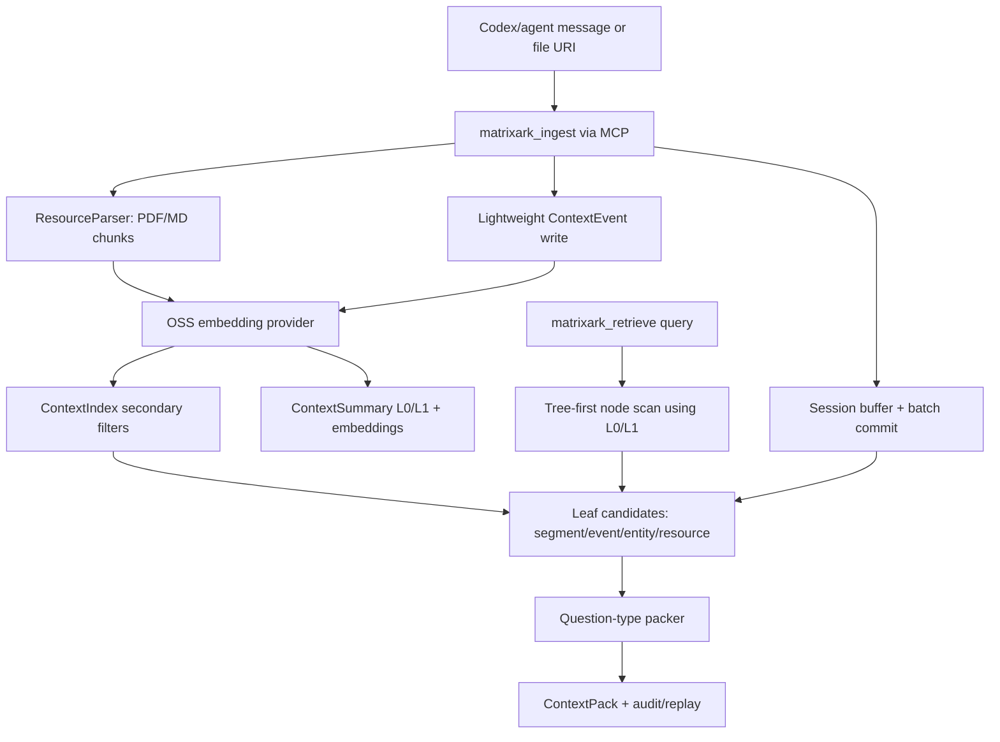

# MatrixArk Message + Resource Debug Trace

This debug run ingests LOCOMO-style multi-turn conversation messages and several PDF/Markdown resources, then retrieves one ContextPack. It is meant for inspecting exactly what MatrixArk writes and reads during ingestion, extraction, chunking, summary generation, embedding storage, tree traversal, secondary-index filtering, packing, audit, and replay.

## Pipeline Diagram



## Re-run

```bash
MATRIXARK_EMBEDDING_PROVIDER=oss MATRIXARK_EMBEDDING_MODEL=sentence-transformers/all-MiniLM-L6-v2 MATRIXARK_REQUIRE_OSS_EMBEDDINGS=1 python3 tools/run_matrixark_message_pdf_debug_trace.py --output-dir docs/debug/matrixark_message_resource_trace
```

## Configuration

- Event log: `<workspace>\Codex\2026-06-10\pull-rust-temporalstore-code-from-matrixarkai\work\TemporalStore\docs\debug\matrixark_message_resource_trace_oss_20260628_final\matrixark_message_resource_debug_trace.jsonl`
- Embedding model: `sentence-transformers/all-MiniLM-L6-v2`
- Embedding execution mode: `oss_embedding_model`
- Query: `What is the current Project Aurora GPU approval, owner, budget cap, deadline, and runbook blocker?`
- Summary refresh: background interval `1000` ms, limit `64` dirty nodes per tick
- Node L1 policy: generate when child summaries, >=3 source events, or >=180 estimated source tokens
- Embedding note: OSS embedding provider completed for this run.

## Data Model Field Guide

|model|purpose|important_fields|
|---|---|---|
|ContextNode|Filesystem-like topology. Messages/resources attach to a leaf node, parents are used for traversal.|node_hash, parent_hash, node_name, node_path, depth, scope_key|
|ContextEvent|Replayable extracted fact or raw conversational event.|event_id_hash, node_hash, source_ref, summary_text, event_type, entity_type, timestamp|
|ContextSegment|Batch/session topic segment when a logical window is committed.|segment_hash, node_hash, source_event_ids, summary_text, topic, time_range|
|ContextEntity|Evolving state for current preference/status/owner/budget/deadline.|entity_hash, entity_type, entity_name, state, source_ref, valid_from, stale_blockers|
|ResourceManifest|Logical imported file/resource version. Raw bytes stay outside TemporalStore.|resource_hash, raw_uri, resource_type, resource_version, content_hash, scope_key|
|ResourceChunk|Cited serving chunk from PDF/MD/etc.|chunk_hash, raw_uri, source_ref, text, token_estimate, unit_kind, page_number, heading_slug|
|ContextSummary|L0/L1 node/resource summary used for preview and tree traversal.|summary_hash, summary_type, node_hash, summary_text, source_event_ids, source_chunk_hashes|
|ContextEmbedding|Vector stored separately for summaries, chunks, events, entities, and resources.|embedding_type, ref_type, ref_hash, model, dim, vector|
|ContextIndex|Bounded secondary filters before similarity scoring.|index_name, index_value, ref_type, ref_hash, node_hash, chunk_hash|
|ContextPackAudit|Explains selected/dropped refs, scores, token costs, warnings, and replay path.|context_pack_id, selected_refs, dropped_refs, used_context_tokens, quality_warnings|

## Record Counts

|record_type|count|
|---|---|
|context_batch_commit|1|
|context_child_ref|6|
|context_debug_record|49|
|context_embedding|147|
|context_entity|31|
|context_entity_update_audit|5|
|context_event|39|
|context_extraction_audit|1|
|context_index|377|
|context_node|7|
|context_pack_audit|1|
|context_pack_telemetry|1|
|context_recall_reinforcement|18|
|context_segment|3|
|context_summary|69|
|context_summary_dirty|86|
|context_summary_refresh_audit|25|
|matrixark_audit_log|21|
|matrixark_metric|5|
|resource_chunk|5|
|resource_import_task|15|
|resource_manifest|5|
|resource_registry|5|
|session_buffer_event|13|

## Input Messages

|role|content|
|---|---|
|user|Alice from finance approved the GPU purchase request for Project Aurora after reviewing the Q3 budget.|
|assistant|Recorded: Project Aurora GPU purchase is approved by Alice in finance, pending procurement owner assignment.|
|user|Bob will own procurement, and the budget cap is 42000 dollars for the initial GPU batch.|
|assistant|I will track Bob as procurement owner and the 42000 dollar cap for the initial batch.|
|user|The deadline is July 15, 2026, and the runbook says finance approval must be attached before vendor selection.|
|assistant|The active deadline is July 15, 2026. Vendor selection requires the finance approval attachment.|
|user|Correction: Alice raised the cap to 45000 dollars after the backup GPU quote came in.|
|assistant|Updated: the current Project Aurora GPU budget cap is 45000 dollars.|

## Resources

|raw_uri|title|line_count|
|---|---|---|
|<workspace>\Codex\2026-06-10\pull-rust-temporalstore-code-from-matrixarkai\work\TemporalStore\docs\d...|Project Aurora GPU Approval Packet|5|
|<workspace>\Codex\2026-06-10\pull-rust-temporalstore-code-from-matrixarkai\work\TemporalStore\docs\d...|GPU Procurement Runbook|4|
|<workspace>\Codex\2026-06-10\pull-rust-temporalstore-code-from-matrixarkai\work\TemporalStore\docs\d...|Budget Update Memo|4|
|<workspace>\Codex\2026-06-10\pull-rust-temporalstore-code-from-matrixarkai\work\TemporalStore\docs\d...|Project Aurora GPU Policy|6|
|<workspace>\Codex\2026-06-10\pull-rust-temporalstore-code-from-matrixarkai\work\TemporalStore\docs\d...|Project Aurora GPU Troubleshooting|4|

## Resource Import Tasks

|status|raw_uri|resource_type|chunk_count|resource_fact_count|resource_entity_count|metrics|
|---|---|---|---|---|---|---|
|queued|<workspace>\Codex\2026-06-10\pull-rust-temporalstore-code-from-matrixarkai\work\TemporalStore\docs\d...|pdf|||||
|running|<workspace>\Codex\2026-06-10\pull-rust-temporalstore-code-from-matrixarkai\work\TemporalStore\docs\d...|pdf|||||
|completed|<workspace>\Codex\2026-06-10\pull-rust-temporalstore-code-from-matrixarkai\work\TemporalStore\docs\d...|pdf|1|7|7|{"chunk_count": 1, "cloud_bucket": "", "cloud_key": "", "dedupe_count": 0, "duration_ms": 570.235, "embedding_count":...|
|queued|<workspace>\Codex\2026-06-10\pull-rust-temporalstore-code-from-matrixarkai\work\TemporalStore\docs\d...|pdf|||||
|running|<workspace>\Codex\2026-06-10\pull-rust-temporalstore-code-from-matrixarkai\work\TemporalStore\docs\d...|pdf|||||
|completed|<workspace>\Codex\2026-06-10\pull-rust-temporalstore-code-from-matrixarkai\work\TemporalStore\docs\d...|pdf|1|3|3|{"chunk_count": 1, "cloud_bucket": "", "cloud_key": "", "dedupe_count": 0, "duration_ms": 285.585, "embedding_count":...|
|queued|<workspace>\Codex\2026-06-10\pull-rust-temporalstore-code-from-matrixarkai\work\TemporalStore\docs\d...|pdf|||||
|running|<workspace>\Codex\2026-06-10\pull-rust-temporalstore-code-from-matrixarkai\work\TemporalStore\docs\d...|pdf|||||
|completed|<workspace>\Codex\2026-06-10\pull-rust-temporalstore-code-from-matrixarkai\work\TemporalStore\docs\d...|pdf|1|5|5|{"chunk_count": 1, "cloud_bucket": "", "cloud_key": "", "dedupe_count": 0, "duration_ms": 511.115, "embedding_count":...|
|queued|<workspace>\Codex\2026-06-10\pull-rust-temporalstore-code-from-matrixarkai\work\TemporalStore\docs\d...|md|||||
|running|<workspace>\Codex\2026-06-10\pull-rust-temporalstore-code-from-matrixarkai\work\TemporalStore\docs\d...|md|||||
|completed|<workspace>\Codex\2026-06-10\pull-rust-temporalstore-code-from-matrixarkai\work\TemporalStore\docs\d...|md|1|7|7|{"chunk_count": 1, "cloud_bucket": "", "cloud_key": "", "dedupe_count": 0, "duration_ms": 410.167, "embedding_count":...|
|queued|<workspace>\Codex\2026-06-10\pull-rust-temporalstore-code-from-matrixarkai\work\TemporalStore\docs\d...|md|||||
|running|<workspace>\Codex\2026-06-10\pull-rust-temporalstore-code-from-matrixarkai\work\TemporalStore\docs\d...|md|||||
|completed|<workspace>\Codex\2026-06-10\pull-rust-temporalstore-code-from-matrixarkai\work\TemporalStore\docs\d...|md|1|4|4|{"chunk_count": 1, "cloud_bucket": "", "cloud_key": "", "dedupe_count": 0, "duration_ms": 288.481, "embedding_count":...|

## Resource Chunks

|chunk_hash|raw_uri|source_ref|token_estimate|metadata.unit_kind|metadata.content_hash|text|
|---|---|---|---|---|---|---|
|3750474927497957967|<workspace>\Codex\2026-06-10\pull-rust-temporalstore-code-from-matrixarkai\work\TemporalStore\docs\d...|<workspace>\Codex\2026-06-10\pull-rust-temporalstore-code-from-matrixarkai\work\TemporalStore\docs\d...|51|pdf_page|49199ad5bd94964c|Project Aurora GPU Approval Packet Decision: Alice approved the Project Aurora GPU purchase after finance review. Own...|
|6301162950114605128|<workspace>\Codex\2026-06-10\pull-rust-temporalstore-code-from-matrixarkai\work\TemporalStore\docs\d...|<workspace>\Codex\2026-06-10\pull-rust-temporalstore-code-from-matrixarkai\work\TemporalStore\docs\d...|43|pdf_page|7aaae94b56b51807|GPU Procurement Runbook Procedure: Attach finance approval before vendor selection. Procedure: Compare primary and ba...|
|6163736819091212152|<workspace>\Codex\2026-06-10\pull-rust-temporalstore-code-from-matrixarkai\work\TemporalStore\docs\d...|<workspace>\Codex\2026-06-10\pull-rust-temporalstore-code-from-matrixarkai\work\TemporalStore\docs\d...|48|pdf_page|87731a0bb7829d5c|Budget Update Memo Update: The backup GPU quote increased the cap from 42000 dollars to 45000 dollars. Current state:...|
|4282638256385582682|<workspace>\Codex\2026-06-10\pull-rust-temporalstore-code-from-matrixarkai\work\TemporalStore\docs\d...|<workspace>\Codex\2026-06-10\pull-rust-temporalstore-code-from-matrixarkai\work\TemporalStore\docs\d...|47|markdown_section|08cc296494df3867|# Project Aurora GPU Policy Decision: Alice from finance approved the GPU purchase. Owner: Bob owns procurement and v...|
|7984327653702107605|<workspace>\Codex\2026-06-10\pull-rust-temporalstore-code-from-matrixarkai\work\TemporalStore\docs\d...|<workspace>\Codex\2026-06-10\pull-rust-temporalstore-code-from-matrixarkai\work\TemporalStore\docs\d...|39|markdown_section|5d8de2f72f13fbb0|# Troubleshooting If vendor selection fails, first verify the finance approval attachment. If the backup quote is use...|

## Extracted Events

|event_id_hash|node_path|internal_extraction.event_type|internal_extraction.entity_type|summary_text|source_ref|
|---|---|---|---|---|---|
|6624134197907518971||||user: Alice from finance approved the GPU purchase request for Project Aurora after reviewing the Q3 budget.||
|2397630992851088578||||assistant: Recorded: Project Aurora GPU purchase is approved by Alice in finance, pending procurement owner assignment.||
|8087907905173962021||||user: Bob will own procurement, and the budget cap is 42000 dollars for the initial GPU batch.||
|795167470756563997||||assistant: I will track Bob as procurement owner and the 42000 dollar cap for the initial batch.||
|8857715139672698412||||user: The deadline is July 15, 2026, and the runbook says finance approval must be attached before vendor selection.||
|8834770380780120646||||assistant: The active deadline is July 15, 2026. Vendor selection requires the finance approval attachment.||
|8302553526848360430||||user: Correction: Alice raised the cap to 45000 dollars after the backup GPU quote came in.||
|563907202553087797||||assistant: Updated: the current Project Aurora GPU budget cap is 45000 dollars.||
|6777842484043795488||||resource_decision: Alice approved the Project Aurora GPU purchase after finance review|<workspace>\Codex\2026-06-10\pull-rust-temporalstore-code-from-matrixarkai\work\TemporalStore\docs\d...|
|2851569980115057861||||resource_owner: Bob owns procurement and vendor coordination|<workspace>\Codex\2026-06-10\pull-rust-temporalstore-code-from-matrixarkai\work\TemporalStore\docs\d...|
|8868504277450003874||||resource_cost: Current approved cap is 45000 dollars|<workspace>\Codex\2026-06-10\pull-rust-temporalstore-code-from-matrixarkai\work\TemporalStore\docs\d...|
|2805366902134763703||||resource_deadline: Purchase order must be ready by July 15, 2026|<workspace>\Codex\2026-06-10\pull-rust-temporalstore-code-from-matrixarkai\work\TemporalStore\docs\d...|
|9126288920168708725||||resource_policy: be ready by July 15, 2026|<workspace>\Codex\2026-06-10\pull-rust-temporalstore-code-from-matrixarkai\work\TemporalStore\docs\d...|
|6126907253617751783||||resource_approval: Packet|<workspace>\Codex\2026-06-10\pull-rust-temporalstore-code-from-matrixarkai\work\TemporalStore\docs\d...|
|8379901460722616416||||resource_risk: Vendor selection is blocked if finance approval is not attached|<workspace>\Codex\2026-06-10\pull-rust-temporalstore-code-from-matrixarkai\work\TemporalStore\docs\d...|
|1223074302848556039||||tool: Import PDF resource for MatrixArk parsing: Project Aurora GPU Approval Packet||
|8491964783980545514||||resource_troubleshooting_step: Procedure: Attach finance approval before vendor selection|<workspace>\Codex\2026-06-10\pull-rust-temporalstore-code-from-matrixarkai\work\TemporalStore\docs\d...|
|1869664875747613230||||resource_approval: before vendor selection|<workspace>\Codex\2026-06-10\pull-rust-temporalstore-code-from-matrixarkai\work\TemporalStore\docs\d...|
|4113952420644695874||||resource_procedure: Attach finance approval before vendor selection|<workspace>\Codex\2026-06-10\pull-rust-temporalstore-code-from-matrixarkai\work\TemporalStore\docs\d...|
|6348236857717333149||||tool: Import PDF resource for MatrixArk parsing: GPU Procurement Runbook||
|5300838132172955992||||resource_cost: Update Memo|<workspace>\Codex\2026-06-10\pull-rust-temporalstore-code-from-matrixarkai\work\TemporalStore\docs\d...|
|943575872141984970||||resource_policy: not be used for current-state answers|<workspace>\Codex\2026-06-10\pull-rust-temporalstore-code-from-matrixarkai\work\TemporalStore\docs\d...|
|4339776539578185279||||resource_approval: r: Alice confirmed the updated cap|<workspace>\Codex\2026-06-10\pull-rust-temporalstore-code-from-matrixarkai\work\TemporalStore\docs\d...|
|8256455490456818829||||resource_risk: 42000 dollars is historical and should not be used for current-state answers|<workspace>\Codex\2026-06-10\pull-rust-temporalstore-code-from-matrixarkai\work\TemporalStore\docs\d...|
|5609674049059368910||||resource_procedure: ed the updated cap|<workspace>\Codex\2026-06-10\pull-rust-temporalstore-code-from-matrixarkai\work\TemporalStore\docs\d...|
|7807306534490412577||||tool: Import PDF resource for MatrixArk parsing: Budget Update Memo||
|6646553404659991554||||resource_decision: Alice from finance approved the GPU purchase|<workspace>\Codex\2026-06-10\pull-rust-temporalstore-code-from-matrixarkai\work\TemporalStore\docs\d...|
|888219254457740353||||resource_owner: Bob owns procurement and vendor coordination|<workspace>\Codex\2026-06-10\pull-rust-temporalstore-code-from-matrixarkai\work\TemporalStore\docs\d...|
|7574275614791456210||||resource_cost: The current cap is 45000 dollars|<workspace>\Codex\2026-06-10\pull-rust-temporalstore-code-from-matrixarkai\work\TemporalStore\docs\d...|
|5347224513344327521||||resource_deadline: The purchase order must be ready by July 15, 2026|<workspace>\Codex\2026-06-10\pull-rust-temporalstore-code-from-matrixarkai\work\TemporalStore\docs\d...|
|5147935230019537673||||resource_policy: Decision: Alice from finance approved the GPU purchase|<workspace>\Codex\2026-06-10\pull-rust-temporalstore-code-from-matrixarkai\work\TemporalStore\docs\d...|
|4917084085215386630||||resource_approval: the GPU purchase|<workspace>\Codex\2026-06-10\pull-rust-temporalstore-code-from-matrixarkai\work\TemporalStore\docs\d...|
|8075343161373804078||||resource_risk: Vendor selection must stop if finance approval is missing|<workspace>\Codex\2026-06-10\pull-rust-temporalstore-code-from-matrixarkai\work\TemporalStore\docs\d...|
|7493566275012183912||||tool: Import Markdown resource for MatrixArk parsing: Project Aurora GPU Policy||
|4790451760624608033||||resource_owner: missing, assign Bob before creating a purchase order|<workspace>\Codex\2026-06-10\pull-rust-temporalstore-code-from-matrixarkai\work\TemporalStore\docs\d...|
|2969439737818155172||||resource_troubleshooting_step: ing|<workspace>\Codex\2026-06-10\pull-rust-temporalstore-code-from-matrixarkai\work\TemporalStore\docs\d...|
|5113149353029032617||||resource_approval: attachment|<workspace>\Codex\2026-06-10\pull-rust-temporalstore-code-from-matrixarkai\work\TemporalStore\docs\d...|
|899353241953556654||||resource_procedure: the finance approval attachment|<workspace>\Codex\2026-06-10\pull-rust-temporalstore-code-from-matrixarkai\work\TemporalStore\docs\d...|
|597910544463915411||||tool: Import Markdown resource for MatrixArk parsing: Project Aurora GPU Troubleshooting||

## Extracted Entities

|entity_hash|node_path|entity_type|entity_name|operator|state|source_ref|
|---|---|---|---|---|---|---|
|1488030737650625042||current_plan|current_plan|LLM_MERGE|track Bob as procurement owner and the 42000 dollar cap for the initial batch||
|5205088207995267081||approval_state|the GPU purchase request for Project Aurora after reviewing the Q3 budget|LLM_MERGE|the GPU purchase request for Project Aurora after reviewing the Q3 budget||
|5708414255151575681||approval_state|by Alice in finance, pending procurement owner assignment|LLM_MERGE|by Alice in finance, pending procurement owner assignment||
|8967060400784335657||approval_state|must be attached before vendor selection|LLM_MERGE|must be attached before vendor selection||
|1722827731307680407||approval_state|attachment|LLM_MERGE|attachment||
|3068246658486096319||resource_decision|decision:<workspace>\Codex\2026-06-10\pull-rust-temporalstore-code-from-:Alice approved the Project ...|LATEST|resource_decision: Alice approved the Project Aurora GPU purchase after finance review. Source: Project Aurora GPU Ap...|<workspace>\Codex\2026-06-10\pull-rust-temporalstore-code-from-matrixarkai\work\TemporalStore\docs\d...|
|4941739850541248980||resource_owner|owner:<workspace>\Codex\2026-06-10\pull-rust-temporalstore-code-from-:Bob owns procurement and vendo...|LATEST|resource_owner: Bob owns procurement and vendor coordination. Source: Project Aurora GPU Approval Packet Decision: Al...|<workspace>\Codex\2026-06-10\pull-rust-temporalstore-code-from-matrixarkai\work\TemporalStore\docs\d...|
|3271993776460714999||resource_cost|cost:<workspace>\Codex\2026-06-10\pull-rust-temporalstore-code-from-:Current approved cap is 45000 d...|LATEST|resource_cost: Current approved cap is 45000 dollars. Source: Project Aurora GPU Approval Packet Decision: Alice appr...|<workspace>\Codex\2026-06-10\pull-rust-temporalstore-code-from-matrixarkai\work\TemporalStore\docs\d...|
|2084188055938458822||resource_deadline|deadline:<workspace>\Codex\2026-06-10\pull-rust-temporalstore-code-from-:Purchase order must be read...|LATEST|resource_deadline: Purchase order must be ready by July 15, 2026. Source: Project Aurora GPU Approval Packet Decision...|<workspace>\Codex\2026-06-10\pull-rust-temporalstore-code-from-matrixarkai\work\TemporalStore\docs\d...|
|757728581620685626||resource_policy|policy:<workspace>\Codex\2026-06-10\pull-rust-temporalstore-code-from-:be ready by July 15, 2026|LATEST|resource_policy: be ready by July 15, 2026. Source: Project Aurora GPU Approval Packet Decision: Alice approved the P...|<workspace>\Codex\2026-06-10\pull-rust-temporalstore-code-from-matrixarkai\work\TemporalStore\docs\d...|
|7360235789622462288||resource_approval|approval:<workspace>\Codex\2026-06-10\pull-rust-temporalstore-code-from-:Packet|LATEST|resource_approval: Packet. Source: Project Aurora GPU Approval Packet Decision: Alice approved the Project Aurora GPU...|<workspace>\Codex\2026-06-10\pull-rust-temporalstore-code-from-matrixarkai\work\TemporalStore\docs\d...|
|5625682257466382736||resource_risk|risk:<workspace>\Codex\2026-06-10\pull-rust-temporalstore-code-from-:Vendor selection is blocked if ...|LATEST|resource_risk: Vendor selection is blocked if finance approval is not attached. Source: Project Aurora GPU Approval P...|<workspace>\Codex\2026-06-10\pull-rust-temporalstore-code-from-matrixarkai\work\TemporalStore\docs\d...|
|7335292191008545134||resource_troubleshooting|troubleshooting:<workspace>\Codex\2026-06-10\pull-rust-temporalstore-code-from-:Procedure: Attach fi...|LATEST|resource_troubleshooting_step: Procedure: Attach finance approval before vendor selection. Source: GPU Procurement Ru...|<workspace>\Codex\2026-06-10\pull-rust-temporalstore-code-from-matrixarkai\work\TemporalStore\docs\d...|
|5749492756472815569||resource_approval|approval:<workspace>\Codex\2026-06-10\pull-rust-temporalstore-code-from-:before vendor selection|LATEST|resource_approval: before vendor selection. Source: GPU Procurement Runbook Procedure: Attach finance approval before...|<workspace>\Codex\2026-06-10\pull-rust-temporalstore-code-from-matrixarkai\work\TemporalStore\docs\d...|
|4371870130263697717||resource_procedure|procedure:<workspace>\Codex\2026-06-10\pull-rust-temporalstore-code-from-:Attach finance approval be...|LATEST|resource_procedure: Attach finance approval before vendor selection. Source: GPU Procurement Runbook Procedure: Attac...|<workspace>\Codex\2026-06-10\pull-rust-temporalstore-code-from-matrixarkai\work\TemporalStore\docs\d...|
|3570688520692967835||resource_cost|cost:<workspace>\Codex\2026-06-10\pull-rust-temporalstore-code-from-:Update Memo|LATEST|resource_cost: Update Memo. Source: Budget Update Memo Update: The backup GPU quote increased the cap from 42000 doll...|<workspace>\Codex\2026-06-10\pull-rust-temporalstore-code-from-matrixarkai\work\TemporalStore\docs\d...|
|1475629264707668433||resource_policy|policy:<workspace>\Codex\2026-06-10\pull-rust-temporalstore-code-from-:not be used for current-state...|LATEST|resource_policy: not be used for current-state answers. Source: Budget Update Memo Update: The backup GPU quote incre...|<workspace>\Codex\2026-06-10\pull-rust-temporalstore-code-from-matrixarkai\work\TemporalStore\docs\d...|
|1819713890940081580||resource_approval|approval:<workspace>\Codex\2026-06-10\pull-rust-temporalstore-code-from-:r: Alice confirmed the upda...|LATEST|resource_approval: r: Alice confirmed the updated cap. Source: Budget Update Memo Update: The backup GPU quote increa...|<workspace>\Codex\2026-06-10\pull-rust-temporalstore-code-from-matrixarkai\work\TemporalStore\docs\d...|
|9203286277593589047||resource_risk|risk:<workspace>\Codex\2026-06-10\pull-rust-temporalstore-code-from-:42000 dollars is historical and...|LATEST|resource_risk: 42000 dollars is historical and should not be used for current-state answers. Source: Budget Update Me...|<workspace>\Codex\2026-06-10\pull-rust-temporalstore-code-from-matrixarkai\work\TemporalStore\docs\d...|
|3796840776690925669||resource_procedure|procedure:<workspace>\Codex\2026-06-10\pull-rust-temporalstore-code-from-:ed the updated cap|LATEST|resource_procedure: ed the updated cap. Source: Budget Update Memo Update: The backup GPU quote increased the cap fro...|<workspace>\Codex\2026-06-10\pull-rust-temporalstore-code-from-matrixarkai\work\TemporalStore\docs\d...|
|1790632716293740327||resource_decision|decision:Project Aurora GPU Policy:Alice from finance approved the GPU purchase|LATEST|resource_decision: Alice from finance approved the GPU purchase. Source: # Project Aurora GPU Policy Decision: Alice ...|<workspace>\Codex\2026-06-10\pull-rust-temporalstore-code-from-matrixarkai\work\TemporalStore\docs\d...|
|6499229581658240168||resource_owner|owner:Project Aurora GPU Policy:Bob owns procurement and vendor coordination|LATEST|resource_owner: Bob owns procurement and vendor coordination. Source: # Project Aurora GPU Policy Decision: Alice fro...|<workspace>\Codex\2026-06-10\pull-rust-temporalstore-code-from-matrixarkai\work\TemporalStore\docs\d...|
|3678389917035337176||resource_cost|cost:Project Aurora GPU Policy:The current cap is 45000 dollars|LATEST|resource_cost: The current cap is 45000 dollars. Source: # Project Aurora GPU Policy Decision: Alice from finance app...|<workspace>\Codex\2026-06-10\pull-rust-temporalstore-code-from-matrixarkai\work\TemporalStore\docs\d...|
|5594237035078441302||resource_deadline|deadline:Project Aurora GPU Policy:The purchase order must be ready by July 15, 2026|LATEST|resource_deadline: The purchase order must be ready by July 15, 2026. Source: # Project Aurora GPU Policy Decision: A...|<workspace>\Codex\2026-06-10\pull-rust-temporalstore-code-from-matrixarkai\work\TemporalStore\docs\d...|
|2601958072599404984||resource_policy|policy:Project Aurora GPU Policy:Decision: Alice from finance approved the GPU purchase|LATEST|resource_policy: Decision: Alice from finance approved the GPU purchase. Source: # Project Aurora GPU Policy Decision...|<workspace>\Codex\2026-06-10\pull-rust-temporalstore-code-from-matrixarkai\work\TemporalStore\docs\d...|
|6356636754220848834||resource_approval|approval:Project Aurora GPU Policy:the GPU purchase|LATEST|resource_approval: the GPU purchase. Source: # Project Aurora GPU Policy Decision: Alice from finance approved the GP...|<workspace>\Codex\2026-06-10\pull-rust-temporalstore-code-from-matrixarkai\work\TemporalStore\docs\d...|
|1513792870765019410||resource_risk|risk:Project Aurora GPU Policy:Vendor selection must stop if finance approval is missing|LATEST|resource_risk: Vendor selection must stop if finance approval is missing. Source: # Project Aurora GPU Policy Decisio...|<workspace>\Codex\2026-06-10\pull-rust-temporalstore-code-from-matrixarkai\work\TemporalStore\docs\d...|
|3575076914436296206||resource_owner|owner:Troubleshooting:missing, assign Bob before creating a purchase order|LATEST|resource_owner: missing, assign Bob before creating a purchase order. Source: # Troubleshooting If vendor selection f...|<workspace>\Codex\2026-06-10\pull-rust-temporalstore-code-from-matrixarkai\work\TemporalStore\docs\d...|
|7511407509864819253||resource_troubleshooting|troubleshooting:Troubleshooting:ing|LATEST|resource_troubleshooting_step: ing. Source: # Troubleshooting If vendor selection fails, first verify the finance app...|<workspace>\Codex\2026-06-10\pull-rust-temporalstore-code-from-matrixarkai\work\TemporalStore\docs\d...|
|1522391842502911337||resource_approval|approval:Troubleshooting:attachment|LATEST|resource_approval: attachment. Source: # Troubleshooting If vendor selection fails, first verify the finance approval...|<workspace>\Codex\2026-06-10\pull-rust-temporalstore-code-from-matrixarkai\work\TemporalStore\docs\d...|
|5797362848733353677||resource_procedure|procedure:Troubleshooting:the finance approval attachment|LATEST|resource_procedure: the finance approval attachment. Source: # Troubleshooting If vendor selection fails, first verif...|<workspace>\Codex\2026-06-10\pull-rust-temporalstore-code-from-matrixarkai\work\TemporalStore\docs\d...|

## Summaries

|summary_type|summary_hash|node_path|summary_generation_policy.reason|summary_text|source_chunk_hashes|
|---|---|---|---|---|---|
|session_l0|8695652974415713980|["tenant:tenant_codex", "user:deeproute", "session:debug-message-pdf-session", "conversation:project_aurora"]||user: Alice from finance approved the GPU purchase request for Project Aurora after reviewing the Q3 budget.||
|session_l0|8695652974415713980|["tenant:tenant_codex", "user:deeproute", "session:debug-message-pdf-session", "conversation:project_aurora"]||user: Alice from finance approved the GPU purchase request for Project Aurora after reviewing the Q3 budget. user: Al...||
|session_l0|8695652974415713980|["tenant:tenant_codex", "user:deeproute", "session:debug-message-pdf-session", "conversation:project_aurora"]||user: Alice from finance approved the GPU purchase request for Project Aurora after reviewing the Q3 budget. user: Al...||
|session_l0|8695652974415713980|["tenant:tenant_codex", "user:deeproute", "session:debug-message-pdf-session", "conversation:project_aurora"]||user: Alice from finance approved the GPU purchase request for Project Aurora after reviewing the Q3 budget. user: Al...||
|session_l0|8695652974415713980|["tenant:tenant_codex", "user:deeproute", "session:debug-message-pdf-session", "conversation:project_aurora"]||user: Alice from finance approved the GPU purchase request for Project Aurora after reviewing the Q3 budget. user: Al...||
|session_l0|8695652974415713980|["tenant:tenant_codex", "user:deeproute", "session:debug-message-pdf-session", "conversation:project_aurora"]||user: Alice from finance approved the GPU purchase request for Project Aurora after reviewing the Q3 budget. user: Al...||
|node_l0||["tenant:tenant_codex"]|has_child_summaries|tenant:tenant_codex :: user: Alice from finance approved the GPU purchase request for Project Aurora after reviewing ...||
|session_l0|8695652974415713980|["tenant:tenant_codex", "user:deeproute", "session:debug-message-pdf-session", "conversation:project_aurora"]||user: Alice from finance approved the GPU purchase request for Project Aurora after reviewing the Q3 budget. user: Al...||
|node_l1||["tenant:tenant_codex"]|has_child_summaries|Context node tenant:tenant_codex. Rich overview: user: Alice from finance approved the GPU purchase request for Proje...||
|node_l0||["tenant:tenant_codex", "user:deeproute"]|has_child_summaries|tenant:tenant_codex / user:deeproute :: user: Alice from finance approved the GPU purchase request for Project Aurora...||
|node_l1||["tenant:tenant_codex", "user:deeproute"]|has_child_summaries|Context node tenant:tenant_codex / user:deeproute. Rich overview: user: Alice from finance approved the GPU purchase ...||
|session_l0|8695652974415713980|["tenant:tenant_codex", "user:deeproute", "session:debug-message-pdf-session", "conversation:project_aurora"]||user: Alice from finance approved the GPU purchase request for Project Aurora after reviewing the Q3 budget. user: Al...||
|node_l0||["tenant:tenant_codex", "user:deeproute", "session:debug-message-pdf-session"]|has_child_summaries|tenant:tenant_codex / user:deeproute / session:debug-message-pdf-session :: user: Alice from finance approved the GPU...||
|node_l1||["tenant:tenant_codex", "user:deeproute", "session:debug-message-pdf-session"]|has_child_summaries|Context node tenant:tenant_codex / user:deeproute / session:debug-message-pdf-session. Rich overview: user: Alice fro...||
|node_l0||["tenant:tenant_codex", "user:deeproute", "session:debug-message-pdf-session", "conversation:project_aurora"]|event_count_threshold|tenant:tenant_codex / user:deeproute / session:debug-message-pdf-session / conversation:project_aurora :: user: Alice...||
|node_l1||["tenant:tenant_codex", "user:deeproute", "session:debug-message-pdf-session", "conversation:project_aurora"]|event_count_threshold|Context node tenant:tenant_codex / user:deeproute / session:debug-message-pdf-session / conversation:project_aurora. ...||
|batch_l0|8702327639111135591|["tenant:tenant_codex", "user:deeproute", "session:debug-message-pdf-session", "conversation:project_aurora"]||user: Alice from finance approved the GPU purchase request for Project Aurora after reviewing the Q3 budget. assistan...||
|resource_l0|3827738995311746422|["tenant:tenant_codex", "user:deeproute", "resources", "project_aurora", "gpu_procurement"]||resource: <workspace>\Codex\2026-06-10\pull-rust-temporalstore-code-from-matrixarkai\work\TemporalSt...|[3750474927497957967]|
|session_l0|8695652974415713980|["tenant:tenant_codex", "user:deeproute", "resources", "project_aurora", "gpu_procurement"]||user: Alice from finance approved the GPU purchase request for Project Aurora after reviewing the Q3 budget. user: Al...||
|resource_l0|2921352368275358123|["tenant:tenant_codex", "user:deeproute", "resources", "project_aurora", "gpu_procurement"]||resource: <workspace>\Codex\2026-06-10\pull-rust-temporalstore-code-from-matrixarkai\work\TemporalSt...|[6301162950114605128]|
|node_l0||["tenant:tenant_codex", "user:deeproute", "session:debug-message-pdf-session"]|has_child_summaries|tenant:tenant_codex / user:deeproute / session:debug-message-pdf-session :: user: Alice from finance approved the GPU...||
|node_l1||["tenant:tenant_codex", "user:deeproute", "session:debug-message-pdf-session"]|has_child_summaries|Context node tenant:tenant_codex / user:deeproute / session:debug-message-pdf-session. Rich overview: user: Alice fro...||
|node_l0||["tenant:tenant_codex", "user:deeproute", "session:debug-message-pdf-session", "conversation:project_aurora"]|event_count_threshold|tenant:tenant_codex / user:deeproute / session:debug-message-pdf-session / conversation:project_aurora :: user: Alice...||
|node_l1||["tenant:tenant_codex", "user:deeproute", "session:debug-message-pdf-session", "conversation:project_aurora"]|event_count_threshold|Context node tenant:tenant_codex / user:deeproute / session:debug-message-pdf-session / conversation:project_aurora. ...||
|node_l0||["tenant:tenant_codex"]|has_child_summaries|tenant:tenant_codex :: user: Alice from finance approved the GPU purchase request for Project Aurora after reviewing ...||
|node_l1||["tenant:tenant_codex"]|has_child_summaries|Context node tenant:tenant_codex. Rich overview: user: Alice from finance approved the GPU purchase request for Proje...||
|session_l0|8695652974415713980|["tenant:tenant_codex", "user:deeproute", "resources", "project_aurora", "gpu_procurement"]||user: Alice from finance approved the GPU purchase request for Project Aurora after reviewing the Q3 budget. user: Al...||
|node_l0||["tenant:tenant_codex", "user:deeproute"]|has_child_summaries|tenant:tenant_codex / user:deeproute :: user: Alice from finance approved the GPU purchase request for Project Aurora...||
|node_l1||["tenant:tenant_codex", "user:deeproute"]|has_child_summaries|Context node tenant:tenant_codex / user:deeproute. Rich overview: user: Alice from finance approved the GPU purchase ...||
|node_l0||["tenant:tenant_codex", "user:deeproute", "resources"]|has_child_summaries|tenant:tenant_codex / user:deeproute / resources :: user: Alice from finance approved the GPU purchase request for Pr...||
|node_l1||["tenant:tenant_codex", "user:deeproute", "resources"]|has_child_summaries|Context node tenant:tenant_codex / user:deeproute / resources. Rich overview: user: Alice from finance approved the G...||
|resource_l0|275814558557117773|["tenant:tenant_codex", "user:deeproute", "resources", "project_aurora", "gpu_procurement"]||resource: <workspace>\Codex\2026-06-10\pull-rust-temporalstore-code-from-matrixarkai\work\TemporalSt...|[6163736819091212152]|
|node_l0||["tenant:tenant_codex", "user:deeproute", "resources", "project_aurora"]|has_child_summaries|tenant:tenant_codex / user:deeproute / resources / project_aurora :: user: Alice from finance approved the GPU purcha...||
|node_l1||["tenant:tenant_codex", "user:deeproute", "resources", "project_aurora"]|has_child_summaries|Context node tenant:tenant_codex / user:deeproute / resources / project_aurora. Rich overview: user: Alice from finan...||
|node_l0||["tenant:tenant_codex", "user:deeproute", "resources", "project_aurora", "gpu_procurement"]|event_count_threshold|tenant:tenant_codex / user:deeproute / resources / project_aurora / gpu_procurement :: Project Aurora GPU Approval Pa...||
|node_l1||["tenant:tenant_codex", "user:deeproute", "resources", "project_aurora", "gpu_procurement"]|event_count_threshold|Context node tenant:tenant_codex / user:deeproute / resources / project_aurora / gpu_procurement. Rich overview: Proj...||
|session_l0|8695652974415713980|["tenant:tenant_codex", "user:deeproute", "resources", "project_aurora", "gpu_procurement"]||user: Alice from finance approved the GPU purchase request for Project Aurora after reviewing the Q3 budget. user: Al...||
|resource_l0|4343814698335980889|["tenant:tenant_codex", "user:deeproute", "resources", "project_aurora", "gpu_procurement"]||resource: <workspace>\Codex\2026-06-10\pull-rust-temporalstore-code-from-matrixarkai\work\TemporalSt...|[4282638256385582682]|
|session_l0|8695652974415713980|["tenant:tenant_codex", "user:deeproute", "resources", "project_aurora", "gpu_procurement"]||user: Alice from finance approved the GPU purchase request for Project Aurora after reviewing the Q3 budget. user: Al...||
|resource_l0|5732956182573060322|["tenant:tenant_codex", "user:deeproute", "resources", "project_aurora", "gpu_procurement"]||resource: <workspace>\Codex\2026-06-10\pull-rust-temporalstore-code-from-matrixarkai\work\TemporalSt...|[7984327653702107605]|
|node_l0||["tenant:tenant_codex", "user:deeproute", "session:debug-message-pdf-session"]|has_child_summaries|tenant:tenant_codex / user:deeproute / session:debug-message-pdf-session :: user: Alice from finance approved the GPU...||
|node_l1||["tenant:tenant_codex", "user:deeproute", "session:debug-message-pdf-session"]|has_child_summaries|Context node tenant:tenant_codex / user:deeproute / session:debug-message-pdf-session. Rich overview: user: Alice fro...||
|node_l0||["tenant:tenant_codex", "user:deeproute", "session:debug-message-pdf-session", "conversation:project_aurora"]|event_count_threshold|tenant:tenant_codex / user:deeproute / session:debug-message-pdf-session / conversation:project_aurora :: user: Alice...||
|node_l1||["tenant:tenant_codex", "user:deeproute", "session:debug-message-pdf-session", "conversation:project_aurora"]|event_count_threshold|Context node tenant:tenant_codex / user:deeproute / session:debug-message-pdf-session / conversation:project_aurora. ...||
|node_l0||["tenant:tenant_codex"]|has_child_summaries|tenant:tenant_codex :: tenant:tenant_codex / user:deeproute / resources :: user: Alice from finance approved the GPU ...||
|session_l0|8695652974415713980|["tenant:tenant_codex", "user:deeproute", "resources", "project_aurora", "gpu_procurement"]||user: Alice from finance approved the GPU purchase request for Project Aurora after reviewing the Q3 budget. user: Al...||
|node_l1||["tenant:tenant_codex"]|has_child_summaries|Context node tenant:tenant_codex. Rich overview: tenant:tenant_codex / user:deeproute / resources :: user: Alice from...||
|node_l0||["tenant:tenant_codex", "user:deeproute", "session:debug-message-pdf-session"]|has_child_summaries|tenant:tenant_codex / user:deeproute / session:debug-message-pdf-session :: user: Alice from finance approved the GPU...||
|node_l0||["tenant:tenant_codex", "user:deeproute"]|has_child_summaries|tenant:tenant_codex / user:deeproute :: tenant:tenant_codex / user:deeproute / resources :: user: Alice from finance ...||
|node_l1||["tenant:tenant_codex", "user:deeproute", "session:debug-message-pdf-session"]|has_child_summaries|Context node tenant:tenant_codex / user:deeproute / session:debug-message-pdf-session. Rich overview: user: Alice fro...||
|node_l0||["tenant:tenant_codex", "user:deeproute", "session:debug-message-pdf-session", "conversation:project_aurora"]|event_count_threshold|tenant:tenant_codex / user:deeproute / session:debug-message-pdf-session / conversation:project_aurora :: user: Alice...||
|node_l1||["tenant:tenant_codex", "user:deeproute", "session:debug-message-pdf-session", "conversation:project_aurora"]|event_count_threshold|Context node tenant:tenant_codex / user:deeproute / session:debug-message-pdf-session / conversation:project_aurora. ...||
|node_l0||["tenant:tenant_codex"]|has_child_summaries|tenant:tenant_codex :: tenant:tenant_codex / user:deeproute / resources / project_aurora / gpu_procurement :: Project...||
|node_l1||["tenant:tenant_codex", "user:deeproute"]|has_child_summaries|Context node tenant:tenant_codex / user:deeproute. Rich overview: tenant:tenant_codex / user:deeproute / resources ::...||
|node_l1||["tenant:tenant_codex"]|has_child_summaries|Context node tenant:tenant_codex. Rich overview: tenant:tenant_codex / user:deeproute / resources / project_aurora / ...||
|node_l0||["tenant:tenant_codex", "user:deeproute", "resources"]|has_child_summaries|tenant:tenant_codex / user:deeproute / resources :: tenant:tenant_codex / user:deeproute / resources / project_aurora...||
|node_l0||["tenant:tenant_codex", "user:deeproute"]|has_child_summaries|tenant:tenant_codex / user:deeproute :: tenant:tenant_codex / user:deeproute / resources / project_aurora / gpu_procu...||
|node_l1||["tenant:tenant_codex", "user:deeproute", "resources"]|has_child_summaries|Context node tenant:tenant_codex / user:deeproute / resources. Rich overview: tenant:tenant_codex / user:deeproute / ...||
|node_l1||["tenant:tenant_codex", "user:deeproute"]|has_child_summaries|Context node tenant:tenant_codex / user:deeproute. Rich overview: tenant:tenant_codex / user:deeproute / resources / ...||
|node_l0||["tenant:tenant_codex", "user:deeproute", "resources", "project_aurora"]|has_child_summaries|tenant:tenant_codex / user:deeproute / resources / project_aurora :: tenant:tenant_codex / user:deeproute / resources...||
|node_l0||["tenant:tenant_codex", "user:deeproute", "resources"]|has_child_summaries|tenant:tenant_codex / user:deeproute / resources :: tenant:tenant_codex / user:deeproute / resources / project_aurora...||
|node_l1||["tenant:tenant_codex", "user:deeproute", "resources"]|has_child_summaries|Context node tenant:tenant_codex / user:deeproute / resources. Rich overview: tenant:tenant_codex / user:deeproute / ...||
|node_l0||["tenant:tenant_codex", "user:deeproute", "resources", "project_aurora"]|has_child_summaries|tenant:tenant_codex / user:deeproute / resources / project_aurora :: tenant:tenant_codex / user:deeproute / resources...||
|node_l1||["tenant:tenant_codex", "user:deeproute", "resources", "project_aurora"]|has_child_summaries|Context node tenant:tenant_codex / user:deeproute / resources / project_aurora. Rich overview: tenant:tenant_codex / ...||
|node_l1||["tenant:tenant_codex", "user:deeproute", "resources", "project_aurora"]|has_child_summaries|Context node tenant:tenant_codex / user:deeproute / resources / project_aurora. Rich overview: tenant:tenant_codex / ...||
|node_l0||["tenant:tenant_codex", "user:deeproute", "resources", "project_aurora", "gpu_procurement"]|event_count_threshold|tenant:tenant_codex / user:deeproute / resources / project_aurora / gpu_procurement :: # Project Aurora GPU Policy De...||
|node_l0||["tenant:tenant_codex", "user:deeproute", "resources", "project_aurora", "gpu_procurement"]|event_count_threshold|tenant:tenant_codex / user:deeproute / resources / project_aurora / gpu_procurement :: # Project Aurora GPU Policy De...||
|node_l1||["tenant:tenant_codex", "user:deeproute", "resources", "project_aurora", "gpu_procurement"]|event_count_threshold|Context node tenant:tenant_codex / user:deeproute / resources / project_aurora / gpu_procurement. Rich overview: # Pr...||
|node_l1||["tenant:tenant_codex", "user:deeproute", "resources", "project_aurora", "gpu_procurement"]|event_count_threshold|Context node tenant:tenant_codex / user:deeproute / resources / project_aurora / gpu_procurement. Rich overview: # Pr...||

## Node L0/L1 Generation Policy

|node_path|generated_summary_types|l1_policy.generate_l1|l1_policy.reason|l1_policy.token_estimate|source_event_count|source_summary_count|
|---|---|---|---|---|---|---|
|["tenant:tenant_codex"]|["node_l0", "node_l1"]|True|has_child_summaries|128|0|1|
|["tenant:tenant_codex", "user:deeproute"]|["node_l0", "node_l1"]|True|has_child_summaries|128|0|1|
|["tenant:tenant_codex", "user:deeproute", "session:debug-message-pdf-session"]|["node_l0", "node_l1"]|True|has_child_summaries|128|0|1|
|["tenant:tenant_codex", "user:deeproute", "session:debug-message-pdf-session", "conversation:project_aurora"]|["node_l0", "node_l1"]|True|event_count_threshold|162|6|0|
|["tenant:tenant_codex", "user:deeproute", "session:debug-message-pdf-session"]|["node_l0", "node_l1"]|True|has_child_summaries|605|0|4|
|["tenant:tenant_codex", "user:deeproute", "session:debug-message-pdf-session", "conversation:project_aurora"]|["node_l0", "node_l1"]|True|event_count_threshold|205|8|0|
|["tenant:tenant_codex"]|["node_l0", "node_l1"]|True|has_child_summaries|1127|0|8|
|["tenant:tenant_codex", "user:deeproute"]|["node_l0", "node_l1"]|True|has_child_summaries|1127|0|8|
|["tenant:tenant_codex", "user:deeproute", "resources"]|["node_l0", "node_l1"]|True|has_child_summaries|269|0|2|
|["tenant:tenant_codex", "user:deeproute", "resources", "project_aurora"]|["node_l0", "node_l1"]|True|has_child_summaries|269|0|2|
|["tenant:tenant_codex", "user:deeproute", "resources", "project_aurora", "gpu_procurement"]|["node_l0", "node_l1"]|True|event_count_threshold|620|8|0|
|["tenant:tenant_codex", "user:deeproute", "session:debug-message-pdf-session"]|["node_l0", "node_l1"]|True|has_child_summaries|648|0|4|
|["tenant:tenant_codex", "user:deeproute", "session:debug-message-pdf-session", "conversation:project_aurora"]|["node_l0", "node_l1"]|True|event_count_threshold|205|8|0|
|["tenant:tenant_codex"]|["node_l0", "node_l1"]|True|has_child_summaries|1320|0|8|
|["tenant:tenant_codex", "user:deeproute", "session:debug-message-pdf-session"]|["node_l0", "node_l1"]|True|has_child_summaries|648|0|4|
|["tenant:tenant_codex", "user:deeproute", "session:debug-message-pdf-session", "conversation:project_aurora"]|["node_l0", "node_l1"]|True|event_count_threshold|205|8|0|
|["tenant:tenant_codex", "user:deeproute"]|["node_l0", "node_l1"]|True|has_child_summaries|1320|0|8|
|["tenant:tenant_codex"]|["node_l0", "node_l1"]|True|has_child_summaries|1309|0|8|
|["tenant:tenant_codex", "user:deeproute", "resources"]|["node_l0", "node_l1"]|True|has_child_summaries|964|0|6|
|["tenant:tenant_codex", "user:deeproute"]|["node_l0", "node_l1"]|True|has_child_summaries|1309|0|8|
|["tenant:tenant_codex", "user:deeproute", "resources"]|["node_l0", "node_l1"]|True|has_child_summaries|964|0|6|
|["tenant:tenant_codex", "user:deeproute", "resources", "project_aurora"]|["node_l0", "node_l1"]|True|has_child_summaries|609|0|4|
|["tenant:tenant_codex", "user:deeproute", "resources", "project_aurora"]|["node_l0", "node_l1"]|True|has_child_summaries|609|0|4|
|["tenant:tenant_codex", "user:deeproute", "resources", "project_aurora", "gpu_procurement"]|["node_l0", "node_l1"]|True|event_count_threshold|559|8|0|
|["tenant:tenant_codex", "user:deeproute", "resources", "project_aurora", "gpu_procurement"]|["node_l0", "node_l1"]|True|event_count_threshold|447|8|0|

## Embeddings

|embedding_type|ref_type|ref_hash|model|dim|preview|
|---|---|---|---|---|---|
|session_l0|summary|8695652974415713980|sentence-transformers/all-MiniLM-L6-v2|384|[-0.06583, 0.05333, -0.08249, 0.00391, 0.00982, -0.04544, 0.0217, -0.01442]|
|event_text|event|6624134197907518971|sentence-transformers/all-MiniLM-L6-v2|384|[-0.06583, 0.05333, -0.08249, 0.00391, 0.00982, -0.04544, 0.0217, -0.01442]|
|session_l0|summary|8695652974415713980|sentence-transformers/all-MiniLM-L6-v2|384|[-0.04593, 0.04271, -0.08145, -0.01775, 0.01528, -0.02375, 0.09475, -0.05553]|
|event_text|event|2397630992851088578|sentence-transformers/all-MiniLM-L6-v2|384|[-0.08721, 0.03399, -0.05092, -0.02474, -0.00879, -0.02737, 0.03055, -0.02905]|
|session_l0|summary|8695652974415713980|sentence-transformers/all-MiniLM-L6-v2|384|[-0.03834, 0.04618, -0.07893, -0.01675, 0.01878, -0.02189, 0.11466, -0.05318]|
|event_text|event|8087907905173962021|sentence-transformers/all-MiniLM-L6-v2|384|[-0.0368, 0.02498, -0.08463, -0.03566, -0.04071, -0.0768, -0.01145, 0.0469]|
|session_l0|summary|8695652974415713980|sentence-transformers/all-MiniLM-L6-v2|384|[-0.03834, 0.04618, -0.07893, -0.01675, 0.01878, -0.02189, 0.11466, -0.05318]|
|event_text|event|795167470756563997|sentence-transformers/all-MiniLM-L6-v2|384|[-0.07377, 0.01424, -0.07089, -0.05668, -0.00904, 0.01199, 0.07512, 0.01362]|
|session_l0|summary|8695652974415713980|sentence-transformers/all-MiniLM-L6-v2|384|[-0.03834, 0.04618, -0.07893, -0.01675, 0.01878, -0.02189, 0.11466, -0.05318]|
|event_text|event|8857715139672698412|sentence-transformers/all-MiniLM-L6-v2|384|[-0.01451, -0.0308, -0.01544, 0.03789, 0.02808, 0.00573, -0.13338, 0.00732]|
|session_l0|summary|8695652974415713980|sentence-transformers/all-MiniLM-L6-v2|384|[-0.03834, 0.04618, -0.07893, -0.01675, 0.01878, -0.02189, 0.11466, -0.05318]|
|event_text|event|8834770380780120646|sentence-transformers/all-MiniLM-L6-v2|384|[-0.05602, -0.02657, 0.00209, 0.04914, 0.00819, -0.00172, -0.08936, 0.01499]|
|session_l0|summary|8695652974415713980|sentence-transformers/all-MiniLM-L6-v2|384|[-0.03834, 0.04618, -0.07893, -0.01675, 0.01878, -0.02189, 0.11466, -0.05318]|
|event_text|event|8302553526848360430|sentence-transformers/all-MiniLM-L6-v2|384|[-0.02628, 0.04384, -0.04132, 0.01246, 0.02427, -0.05951, 0.05387, 0.06887]|
|node_l0|node|3263141514618168867|sentence-transformers/all-MiniLM-L6-v2|384|[0.01542, 0.06665, -0.1223, 0.00291, -0.00648, -0.02131, 0.07953, -0.04825]|
|node_l1|node|3263141514618168867|sentence-transformers/all-MiniLM-L6-v2|384|[0.03568, 0.04192, -0.05912, 0.05213, 0.08783, 0.02963, 0.02205, -0.05314]|
|node_l0|node|623184698193930698|sentence-transformers/all-MiniLM-L6-v2|384|[0.00398, 0.02068, -0.09903, -0.01115, -0.02242, -0.05236, 0.02222, 0.00223]|
|session_l0|summary|8695652974415713980|sentence-transformers/all-MiniLM-L6-v2|384|[-0.03834, 0.04618, -0.07893, -0.01675, 0.01878, -0.02189, 0.11466, -0.05318]|
|event_text|event|563907202553087797|sentence-transformers/all-MiniLM-L6-v2|384|[-0.04222, 0.01134, -0.03773, 0.024, 0.01161, -0.07143, 0.00236, -0.01235]|
|node_l1|node|623184698193930698|sentence-transformers/all-MiniLM-L6-v2|384|[0.01651, 0.01425, -0.02911, 0.055, 0.06352, -0.00021, 0.00412, -0.01433]|
|node_l0|node|3084181658660614334|sentence-transformers/all-MiniLM-L6-v2|384|[0.0303, 0.01489, -0.10062, 0.00121, -0.00618, -0.06481, 0.00734, -0.00723]|
|node_l1|node|3084181658660614334|sentence-transformers/all-MiniLM-L6-v2|384|[0.03008, 0.03043, -0.0353, 0.04517, 0.08366, -0.02902, 0.00953, 0.00018]|
|node_l0|node|2100209595829882121|sentence-transformers/all-MiniLM-L6-v2|384|[0.01541, 0.01475, -0.10288, 0.00247, -0.00289, -0.06799, 0.00417, -0.02259]|
|node_l1|node|2100209595829882121|sentence-transformers/all-MiniLM-L6-v2|384|[0.00046, 0.03149, -0.07152, 0.05254, 0.03781, -0.05386, -0.02644, 0.02134]|
|entity_state|entity|1488030737650625042|sentence-transformers/all-MiniLM-L6-v2|384|[-0.0417, 0.04396, -0.03716, -0.06289, -0.01629, 0.01388, 0.01196, 0.04205]|
|entity_state|entity|5205088207995267081|sentence-transformers/all-MiniLM-L6-v2|384|[-0.06877, 0.05161, -0.03066, 0.01558, 0.0336, -0.03792, 0.01291, -0.05526]|
|entity_state|entity|5708414255151575681|sentence-transformers/all-MiniLM-L6-v2|384|[-0.05325, 0.05107, -0.02989, 0.00186, -0.02954, -0.02497, 0.09637, -0.07403]|
|entity_state|entity|8967060400784335657|sentence-transformers/all-MiniLM-L6-v2|384|[-0.03172, 0.00775, 0.02895, -0.00579, 0.05885, -0.0163, 0.01125, -0.02088]|
|entity_state|entity|1722827731307680407|sentence-transformers/all-MiniLM-L6-v2|384|[-0.01391, 0.04366, 0.03255, 0.0395, 0.06304, -0.04384, 0.03699, -0.00203]|
|segment_text|segment|7701565019694875297|sentence-transformers/all-MiniLM-L6-v2|384|[-0.03864, 0.0403, -0.07899, -0.00687, 0.00667, -0.04096, -0.00228, -0.02131]|
|segment_text|segment|3487614227460380874|sentence-transformers/all-MiniLM-L6-v2|384|[-0.03947, 0.05552, -0.03233, 0.01786, 0.03844, -0.03412, 0.03652, 0.05903]|
|segment_text|segment|691869304114277638|sentence-transformers/all-MiniLM-L6-v2|384|[-0.05619, 0.01958, -0.10548, -0.08259, 0.01201, -0.00642, 0.09168, -0.00262]|
|batch_l0|summary|8702327639111135591|sentence-transformers/all-MiniLM-L6-v2|384|[-0.00313, 0.04224, -0.06387, -0.0066, -0.02652, -0.04476, -0.00785, -0.00399]|
|resource_l0|summary|3827738995311746422|sentence-transformers/all-MiniLM-L6-v2|384|[-0.01613, 0.04992, -0.07345, -0.01679, -0.00188, -0.07411, -0.04025, -0.03586]|
|resource_chunk|resource_chunk|3750474927497957967|sentence-transformers/all-MiniLM-L6-v2|384|[-0.05519, 0.03988, -0.06907, 0.00072, 0.01702, -0.05486, -0.01068, -0.02457]|
|event_text|event|6777842484043795488|sentence-transformers/all-MiniLM-L6-v2|384|[-0.02658, 0.028, -0.05605, -0.0152, 0.02809, -0.06332, 0.0513, -0.03183]|
|entity_state|entity|3068246658486096319|sentence-transformers/all-MiniLM-L6-v2|384|[-0.03686, 0.04558, -0.04986, 0.00451, 0.05046, -0.05901, 0.05479, 0.00084]|
|event_text|event|2851569980115057861|sentence-transformers/all-MiniLM-L6-v2|384|[-0.05079, 0.0144, -0.05609, -0.04497, 0.00799, -0.06859, 0.05928, -0.05355]|
|entity_state|entity|4941739850541248980|sentence-transformers/all-MiniLM-L6-v2|384|[-0.07453, 0.04225, -0.04871, -0.03431, 0.00858, -0.04818, 0.05432, -0.02911]|
|event_text|event|8868504277450003874|sentence-transformers/all-MiniLM-L6-v2|384|[-0.01798, 0.01492, -0.041, 0.0021, 0.04255, -0.05995, 0.04235, -0.00474]|
|entity_state|entity|3271993776460714999|sentence-transformers/all-MiniLM-L6-v2|384|[-0.04271, 0.01769, -0.02935, 0.02179, 0.05053, -0.04752, 0.00632, 0.03851]|
|event_text|event|2805366902134763703|sentence-transformers/all-MiniLM-L6-v2|384|[-0.04214, -0.00427, -0.0195, -0.00371, 0.01166, -0.04446, -0.02041, -0.04177]|
|entity_state|entity|2084188055938458822|sentence-transformers/all-MiniLM-L6-v2|384|[-0.0769, 0.0009, 0.00019, 0.00717, 0.01613, -0.04412, -0.07635, -0.00512]|
|event_text|event|9126288920168708725|sentence-transformers/all-MiniLM-L6-v2|384|[-0.04297, -0.00289, -0.03244, -0.00864, 0.02712, -0.0412, 0.00581, -0.05413]|
|entity_state|entity|757728581620685626|sentence-transformers/all-MiniLM-L6-v2|384|[-0.07238, 0.016, -0.0105, -0.00598, 0.04666, -0.03362, -0.03432, -0.03866]|
|event_text|event|6126907253617751783|sentence-transformers/all-MiniLM-L6-v2|384|[-0.04523, 0.02731, -0.03643, -0.02154, 0.02914, -0.07083, 0.04703, -0.03504]|
|entity_state|entity|7360235789622462288|sentence-transformers/all-MiniLM-L6-v2|384|[-0.07078, 0.04218, -0.02005, -0.01702, 0.05286, -0.057, 0.03531, -0.01494]|
|event_text|event|8379901460722616416|sentence-transformers/all-MiniLM-L6-v2|384|[-0.02114, 0.02295, -0.05399, -0.0074, 0.0564, -0.0455, 0.01901, -0.05581]|
|entity_state|entity|5625682257466382736|sentence-transformers/all-MiniLM-L6-v2|384|[-0.06983, 0.01759, -0.0534, 0.02231, 0.07249, -0.03163, -0.00482, -0.00773]|
|session_l0|summary|8695652974415713980|sentence-transformers/all-MiniLM-L6-v2|384|[-0.03834, 0.04618, -0.07893, -0.01675, 0.01878, -0.02189, 0.11466, -0.05318]|
|event_text|event|1223074302848556039|sentence-transformers/all-MiniLM-L6-v2|384|[-0.08427, -0.02947, -0.14217, -0.00046, 0.02201, -0.06187, -0.04581, -0.02762]|
|resource_l0|summary|2921352368275358123|sentence-transformers/all-MiniLM-L6-v2|384|[-0.0132, 0.03377, -0.05123, 0.01299, 0.00954, -0.01549, -0.09171, -0.03902]|
|resource_chunk|resource_chunk|6301162950114605128|sentence-transformers/all-MiniLM-L6-v2|384|[-0.04836, 0.02068, -0.06785, 0.02611, 0.05788, -0.02022, -0.089, -0.01547]|
|node_l0|node|3084181658660614334|sentence-transformers/all-MiniLM-L6-v2|384|[0.0303, 0.01489, -0.10062, 0.00121, -0.00618, -0.06481, 0.00734, -0.00723]|
|node_l1|node|3084181658660614334|sentence-transformers/all-MiniLM-L6-v2|384|[0.00664, 0.01198, -0.05787, 0.03452, 0.04138, -0.07403, 0.03903, -0.03726]|
|node_l0|node|2100209595829882121|sentence-transformers/all-MiniLM-L6-v2|384|[0.01541, 0.01475, -0.10288, 0.00247, -0.00289, -0.06799, 0.00417, -0.02259]|
|event_text|event|8491964783980545514|sentence-transformers/all-MiniLM-L6-v2|384|[-0.01728, 0.03485, -0.03382, 0.01275, 0.0634, -0.01638, -0.06018, -0.00139]|
|entity_state|entity|7335292191008545134|sentence-transformers/all-MiniLM-L6-v2|384|[-0.04326, 0.01081, 0.00119, 0.03215, 0.05901, -0.0215, -0.09281, 0.01085]|
|event_text|event|1869664875747613230|sentence-transformers/all-MiniLM-L6-v2|384|[-0.01744, 0.04388, -0.02801, 0.00305, 0.07188, -0.01228, -0.0334, -0.00926]|
|entity_state|entity|5749492756472815569|sentence-transformers/all-MiniLM-L6-v2|384|[-0.05459, 0.04171, 0.01818, 0.02747, 0.08005, -0.00847, -0.05181, -0.00047]|
|event_text|event|4113952420644695874|sentence-transformers/all-MiniLM-L6-v2|384|[-0.00856, 0.04609, -0.0521, 0.01414, 0.05888, -0.00802, -0.03382, 2e-05]|
|entity_state|entity|4371870130263697717|sentence-transformers/all-MiniLM-L6-v2|384|[-0.04404, 0.04661, -0.0252, 0.02307, 0.04217, -0.01002, -0.0594, 0.04124]|
|node_l1|node|2100209595829882121|sentence-transformers/all-MiniLM-L6-v2|384|[-0.00214, 0.03449, -0.07523, 0.05844, 0.03817, -0.0547, -0.01671, 0.02538]|
|node_l0|node|3263141514618168867|sentence-transformers/all-MiniLM-L6-v2|384|[0.01542, 0.06665, -0.1223, 0.00291, -0.00648, -0.02131, 0.07953, -0.04825]|
|session_l0|summary|8695652974415713980|sentence-transformers/all-MiniLM-L6-v2|384|[-0.03834, 0.04618, -0.07893, -0.01675, 0.01878, -0.02189, 0.11466, -0.05318]|
|event_text|event|6348236857717333149|sentence-transformers/all-MiniLM-L6-v2|384|[-0.07587, -0.04336, -0.18017, -0.02411, -0.02652, -0.0572, -0.09131, 0.0159]|
|node_l1|node|3263141514618168867|sentence-transformers/all-MiniLM-L6-v2|384|[0.00121, -0.00251, -0.06726, 0.03721, 0.03396, -0.07556, 0.02105, -0.01851]|
|node_l0|node|623184698193930698|sentence-transformers/all-MiniLM-L6-v2|384|[0.00398, 0.02068, -0.09903, -0.01115, -0.02242, -0.05236, 0.02222, 0.00223]|
|node_l1|node|623184698193930698|sentence-transformers/all-MiniLM-L6-v2|384|[-0.00045, -0.00325, -0.06733, 0.0446, 0.03057, -0.08192, 0.01545, -0.01293]|
|node_l0|node|1257764480205296887|sentence-transformers/all-MiniLM-L6-v2|384|[0.01006, 0.01812, -0.10134, 0.00318, -0.00677, -0.04801, 0.02048, -0.0229]|
|resource_l0|summary|275814558557117773|sentence-transformers/all-MiniLM-L6-v2|384|[-0.06397, 0.02543, -0.08842, 0.03141, 0.02652, -0.08572, -0.06087, -0.01025]|
|resource_chunk|resource_chunk|6163736819091212152|sentence-transformers/all-MiniLM-L6-v2|384|[-0.09859, 0.03127, -0.10585, 0.04315, 0.05861, -0.04364, -0.05816, 0.01409]|
|node_l1|node|1257764480205296887|sentence-transformers/all-MiniLM-L6-v2|384|[-0.03227, 0.02954, -0.06282, 0.05381, 0.06714, -0.04181, -0.03842, -0.02175]|
|node_l0|node|5984959491336829337|sentence-transformers/all-MiniLM-L6-v2|384|[0.00734, 0.01218, -0.10377, 0.00121, 0.00275, -0.06158, 0.01326, -0.02546]|
|node_l1|node|5984959491336829337|sentence-transformers/all-MiniLM-L6-v2|384|[-0.01955, 0.03226, -0.07101, 0.04607, 0.06659, -0.04221, -0.03443, -0.03503]|
|node_l0|node|1737304210274426578|sentence-transformers/all-MiniLM-L6-v2|384|[-0.01363, 0.02748, -0.09108, -0.02309, -0.02305, -0.07517, 0.02163, -0.03258]|
|node_l1|node|1737304210274426578|sentence-transformers/all-MiniLM-L6-v2|384|[-0.00559, 0.0006, -0.04581, -0.00136, 0.00617, -0.06084, -0.02732, -0.0505]|
|event_text|event|5300838132172955992|sentence-transformers/all-MiniLM-L6-v2|384|[-0.07917, 0.01603, -0.06672, 0.03099, 0.06149, -0.05417, -0.00283, 0.01979]|
|entity_state|entity|3570688520692967835|sentence-transformers/all-MiniLM-L6-v2|384|[-0.08858, 0.01554, -0.03497, 0.05541, 0.05345, -0.03771, -0.03122, 0.04714]|
|event_text|event|943575872141984970|sentence-transformers/all-MiniLM-L6-v2|384|[-0.07204, 0.03841, -0.04702, 0.03672, 0.08223, -0.03183, 0.02111, -0.01388]|
|entity_state|entity|1475629264707668433|sentence-transformers/all-MiniLM-L6-v2|384|[-0.10679, 0.03901, -0.00132, 0.05451, 0.07758, -0.00532, -0.02347, 0.01324]|
|event_text|event|4339776539578185279|sentence-transformers/all-MiniLM-L6-v2|384|[-0.06507, 0.0304, -0.05222, 0.02609, 0.09559, -0.05786, 0.03174, -0.00079]|
|entity_state|entity|1819713890940081580|sentence-transformers/all-MiniLM-L6-v2|384|[-0.09906, 0.02498, 0.00309, 0.04623, 0.10704, -0.04868, -0.00214, 0.00346]|
|event_text|event|8256455490456818829|sentence-transformers/all-MiniLM-L6-v2|384|[-0.06472, 0.04525, -0.05351, 0.01484, 0.07454, -0.04899, 0.01364, 0.02488]|
|entity_state|entity|9203286277593589047|sentence-transformers/all-MiniLM-L6-v2|384|[-0.11688, 0.02978, -0.04458, 0.02824, 0.06066, -0.01124, -0.05303, 0.06587]|
|event_text|event|5609674049059368910|sentence-transformers/all-MiniLM-L6-v2|384|[-0.06007, 0.03557, -0.0614, 0.02203, 0.0574, -0.06769, 0.00713, 0.03198]|
|entity_state|entity|3796840776690925669|sentence-transformers/all-MiniLM-L6-v2|384|[-0.08098, 0.03473, -0.029, 0.04316, 0.04961, -0.06341, -0.02812, 0.05425]|
|session_l0|summary|8695652974415713980|sentence-transformers/all-MiniLM-L6-v2|384|[-0.03834, 0.04618, -0.07893, -0.01675, 0.01878, -0.02189, 0.11466, -0.05318]|
|event_text|event|7807306534490412577|sentence-transformers/all-MiniLM-L6-v2|384|[-0.07143, -0.03485, -0.18807, 0.04469, -0.01063, -0.00341, -0.07333, -0.01251]|
|resource_l0|summary|4343814698335980889|sentence-transformers/all-MiniLM-L6-v2|384|[-0.03246, 0.04857, -0.05744, -0.00494, -0.00904, -0.06344, -0.06367, -0.03692]|
|resource_chunk|resource_chunk|4282638256385582682|sentence-transformers/all-MiniLM-L6-v2|384|[-0.04781, 0.04042, -0.0585, 0.00742, 0.03591, -0.05051, -0.01031, -0.02028]|
|event_text|event|6646553404659991554|sentence-transformers/all-MiniLM-L6-v2|384|[-0.03579, 0.03161, -0.06233, -0.00293, 0.02988, -0.05493, 0.03141, -0.02037]|
|entity_state|entity|1790632716293740327|sentence-transformers/all-MiniLM-L6-v2|384|[-0.03573, 0.05856, -0.0569, -0.02588, 0.04924, -0.05772, 0.07624, -0.02376]|
|event_text|event|888219254457740353|sentence-transformers/all-MiniLM-L6-v2|384|[-0.04637, 0.0216, -0.06526, -0.03568, 0.00378, -0.05746, 0.04825, -0.0505]|
|entity_state|entity|6499229581658240168|sentence-transformers/all-MiniLM-L6-v2|384|[-0.05002, 0.02472, -0.06377, -0.04997, 0.01074, -0.05398, 0.07294, -0.05443]|
|event_text|event|7574275614791456210|sentence-transformers/all-MiniLM-L6-v2|384|[-0.0196, 0.02171, -0.0464, 0.01245, 0.03625, -0.05597, 0.03187, -0.00377]|
|entity_state|entity|3678389917035337176|sentence-transformers/all-MiniLM-L6-v2|384|[-0.01822, 0.03528, -0.0345, 0.00021, 0.05566, -0.05739, 0.05981, -0.00651]|
|event_text|event|5347224513344327521|sentence-transformers/all-MiniLM-L6-v2|384|[-0.04641, -0.00155, -0.02753, 0.00816, 0.01047, -0.03809, -0.03402, -0.03544]|
|entity_state|entity|5594237035078441302|sentence-transformers/all-MiniLM-L6-v2|384|[-0.06349, -0.01112, -0.00664, -0.00695, 0.01664, -0.04107, -0.05174, -0.04426]|
|event_text|event|5147935230019537673|sentence-transformers/all-MiniLM-L6-v2|384|[-0.0275, 0.03801, -0.0618, -0.0104, 0.02969, -0.04404, 0.03502, -0.02441]|
|entity_state|entity|2601958072599404984|sentence-transformers/all-MiniLM-L6-v2|384|[-0.03622, 0.05594, -0.04334, -0.03231, 0.05181, -0.03313, 0.0692, -0.03676]|
|event_text|event|4917084085215386630|sentence-transformers/all-MiniLM-L6-v2|384|[-0.04763, 0.02766, -0.04185, -0.00212, 0.02967, -0.05528, 0.01832, -0.0348]|
|entity_state|entity|6356636754220848834|sentence-transformers/all-MiniLM-L6-v2|384|[-0.04848, 0.03664, -0.03074, -0.01798, 0.04135, -0.05077, 0.0359, -0.03553]|
|event_text|event|8075343161373804078|sentence-transformers/all-MiniLM-L6-v2|384|[-0.01473, 0.02844, -0.03988, 0.00764, 0.06846, -0.03048, 0.00028, -0.05745]|
|entity_state|entity|1513792870765019410|sentence-transformers/all-MiniLM-L6-v2|384|[-0.02405, 0.04858, -0.03122, -0.00482, 0.08972, -0.02464, 0.03527, -0.04601]|
|session_l0|summary|8695652974415713980|sentence-transformers/all-MiniLM-L6-v2|384|[-0.03834, 0.04618, -0.07893, -0.01675, 0.01878, -0.02189, 0.11466, -0.05318]|
|event_text|event|7493566275012183912|sentence-transformers/all-MiniLM-L6-v2|384|[-0.06921, -0.00423, -0.10358, 0.03347, 0.0366, -0.02003, -0.04145, -0.01754]|
|resource_l0|summary|5732956182573060322|sentence-transformers/all-MiniLM-L6-v2|384|[-0.04256, 0.05491, -0.06, -0.01152, -0.03945, -0.00188, -0.03745, -0.03544]|
|resource_chunk|resource_chunk|7984327653702107605|sentence-transformers/all-MiniLM-L6-v2|384|[-0.08151, 0.04636, -0.0439, 0.04956, 0.05242, -0.00671, -0.03041, 0.01774]|
|node_l0|node|3084181658660614334|sentence-transformers/all-MiniLM-L6-v2|384|[0.0303, 0.01489, -0.10062, 0.00121, -0.00618, -0.06481, 0.00734, -0.00723]|
|event_text|event|4790451760624608033|sentence-transformers/all-MiniLM-L6-v2|384|[-0.03673, 0.04676, -0.01707, -0.0003, -0.01006, 0.01668, 0.03276, -0.01699]|
|entity_state|entity|3575076914436296206|sentence-transformers/all-MiniLM-L6-v2|384|[-0.05521, 0.03322, 0.00295, 0.00573, -0.01072, 0.00153, 0.03384, -0.0255]|
|event_text|event|2969439737818155172|sentence-transformers/all-MiniLM-L6-v2|384|[-0.05568, 0.05727, 0.00112, -0.00702, 0.02645, 0.00996, 0.0054, -0.00614]|
|entity_state|entity|7511407509864819253|sentence-transformers/all-MiniLM-L6-v2|384|[-0.06161, 0.04774, 0.00338, 0.00854, 0.0338, 0.00261, 0.04656, -0.00639]|
|event_text|event|5113149353029032617|sentence-transformers/all-MiniLM-L6-v2|384|[-0.04154, 0.05711, 0.01569, 0.00696, 0.07005, -0.00241, 0.01936, -0.0077]|
|entity_state|entity|1522391842502911337|sentence-transformers/all-MiniLM-L6-v2|384|[-0.04809, 0.05717, 0.01467, 0.01011, 0.09103, -0.01216, 0.0337, -0.00071]|
|event_text|event|899353241953556654|sentence-transformers/all-MiniLM-L6-v2|384|[-0.03533, 0.06659, -0.02914, 0.01284, 0.04821, 0.00021, 0.0181, 0.01805]|
|entity_state|entity|5797362848733353677|sentence-transformers/all-MiniLM-L6-v2|384|[-0.03868, 0.07314, -0.03689, 0.02085, 0.05223, -0.0117, 0.0246, 0.03965]|
|node_l1|node|3084181658660614334|sentence-transformers/all-MiniLM-L6-v2|384|[-0.0006, 0.02892, -0.09781, 0.02075, 0.01384, -0.04758, -0.01533, -0.02156]|
|node_l0|node|2100209595829882121|sentence-transformers/all-MiniLM-L6-v2|384|[0.01541, 0.01475, -0.10288, 0.00247, -0.00289, -0.06799, 0.00417, -0.02259]|

## Secondary Indexes

|index_name|ref_type|ref_hash|chunk_hash|node_path|
|---|---|---|---|---|
|event_type:confirmation|event|6624134197907518971|||
|classification:new_event|event|6624134197907518971|||
|status:observed|event|6624134197907518971|||
|source_type:message|event|6624134197907518971|||
|event_type:confirmation|event|2397630992851088578|||
|classification:new_event|event|2397630992851088578|||
|status:observed|event|2397630992851088578|||
|source_type:message|event|2397630992851088578|||
|event_type:plan_update|event|8087907905173962021|||
|classification:new_event|event|8087907905173962021|||
|status:observed|event|8087907905173962021|||
|source_type:message|event|8087907905173962021|||
|event_type:plan_update|event|795167470756563997|||
|classification:new_event|event|795167470756563997|||
|status:observed|event|795167470756563997|||
|source_type:message|event|795167470756563997|||
|event_type:dialogue_batch|event|8857715139672698412|||
|classification:new_event|event|8857715139672698412|||
|status:observed|event|8857715139672698412|||
|source_type:message|event|8857715139672698412|||
|event_type:dialogue_batch|event|8834770380780120646|||
|classification:new_event|event|8834770380780120646|||
|status:observed|event|8834770380780120646|||
|source_type:message|event|8834770380780120646|||
|event_type:correction|event|8302553526848360430|||
|classification:new_event|event|8302553526848360430|||
|status:observed|event|8302553526848360430|||
|source_type:message|event|8302553526848360430|||
|event_type:correction|event|563907202553087797|||
|classification:new_event|event|563907202553087797|||
|status:observed|event|563907202553087797|||
|source_type:message|event|563907202553087797|||
|event_type:correction|||||
|classification:batch_memory|||||
|status:observed|||||
|source_type:message|||||
|entity_type:current_plan|||||
|entity_type:approval_state|||||
|segment_topic:approval_budget|||||
|segment_topic:correction|||||
|source_type:resource|||||
|resource_type:pdf|||||
|source_type:resource|resource_chunk|3750474927497957967|3750474927497957967||
|resource_type:pdf|resource_chunk|3750474927497957967|3750474927497957967||
|unit_kind:pdf_page|resource_chunk|3750474927497957967|3750474927497957967||
|keyword:project|resource_chunk|3750474927497957967|3750474927497957967||
|keyword:aurora|resource_chunk|3750474927497957967|3750474927497957967||
|keyword:gpu|resource_chunk|3750474927497957967|3750474927497957967||
|keyword:approval|resource_chunk|3750474927497957967|3750474927497957967||
|keyword:packet|resource_chunk|3750474927497957967|3750474927497957967||
|keyword:decision|resource_chunk|3750474927497957967|3750474927497957967||
|source_type:resource_fact|resource_fact|6777842484043795488|3750474927497957967||
|resource_type:pdf|resource_fact|6777842484043795488|3750474927497957967||
|unit_kind:pdf_page|resource_fact|6777842484043795488|3750474927497957967||
|entity_type:resource_decision|resource_fact|6777842484043795488|3750474927497957967||
|entity_type:resource_fact|resource_fact|6777842484043795488|3750474927497957967||
|event_type:resource_decision|resource_fact|6777842484043795488|3750474927497957967||
|keyword:project|resource_fact|6777842484043795488|3750474927497957967||
|keyword:aurora|resource_fact|6777842484043795488|3750474927497957967||
|keyword:gpu|resource_fact|6777842484043795488|3750474927497957967||
|keyword:approval|resource_fact|6777842484043795488|3750474927497957967||
|source_type:resource_fact|resource_fact|2851569980115057861|3750474927497957967||
|resource_type:pdf|resource_fact|2851569980115057861|3750474927497957967||
|unit_kind:pdf_page|resource_fact|2851569980115057861|3750474927497957967||
|entity_type:resource_owner|resource_fact|2851569980115057861|3750474927497957967||
|entity_type:resource_fact|resource_fact|2851569980115057861|3750474927497957967||
|event_type:resource_owner|resource_fact|2851569980115057861|3750474927497957967||
|keyword:project|resource_fact|2851569980115057861|3750474927497957967||
|keyword:aurora|resource_fact|2851569980115057861|3750474927497957967||
|keyword:gpu|resource_fact|2851569980115057861|3750474927497957967||
|keyword:approval|resource_fact|2851569980115057861|3750474927497957967||
|source_type:resource_fact|resource_fact|8868504277450003874|3750474927497957967||
|resource_type:pdf|resource_fact|8868504277450003874|3750474927497957967||
|unit_kind:pdf_page|resource_fact|8868504277450003874|3750474927497957967||
|entity_type:resource_cost|resource_fact|8868504277450003874|3750474927497957967||
|entity_type:resource_fact|resource_fact|8868504277450003874|3750474927497957967||
|event_type:resource_cost|resource_fact|8868504277450003874|3750474927497957967||
|keyword:project|resource_fact|8868504277450003874|3750474927497957967||
|keyword:aurora|resource_fact|8868504277450003874|3750474927497957967||
|keyword:gpu|resource_fact|8868504277450003874|3750474927497957967||
|keyword:approval|resource_fact|8868504277450003874|3750474927497957967||
|source_type:resource_fact|resource_fact|2805366902134763703|3750474927497957967||
|resource_type:pdf|resource_fact|2805366902134763703|3750474927497957967||
|unit_kind:pdf_page|resource_fact|2805366902134763703|3750474927497957967||
|entity_type:resource_deadline|resource_fact|2805366902134763703|3750474927497957967||
|entity_type:resource_fact|resource_fact|2805366902134763703|3750474927497957967||
|event_type:resource_deadline|resource_fact|2805366902134763703|3750474927497957967||
|keyword:project|resource_fact|2805366902134763703|3750474927497957967||
|keyword:aurora|resource_fact|2805366902134763703|3750474927497957967||
|keyword:gpu|resource_fact|2805366902134763703|3750474927497957967||
|keyword:approval|resource_fact|2805366902134763703|3750474927497957967||
|source_type:resource_fact|resource_fact|9126288920168708725|3750474927497957967||
|resource_type:pdf|resource_fact|9126288920168708725|3750474927497957967||
|unit_kind:pdf_page|resource_fact|9126288920168708725|3750474927497957967||
|entity_type:resource_policy|resource_fact|9126288920168708725|3750474927497957967||
|entity_type:resource_fact|resource_fact|9126288920168708725|3750474927497957967||
|event_type:resource_policy|resource_fact|9126288920168708725|3750474927497957967||
|keyword:project|resource_fact|9126288920168708725|3750474927497957967||
|keyword:aurora|resource_fact|9126288920168708725|3750474927497957967||
|keyword:gpu|resource_fact|9126288920168708725|3750474927497957967||
|keyword:approval|resource_fact|9126288920168708725|3750474927497957967||
|source_type:resource_fact|resource_fact|6126907253617751783|3750474927497957967||
|resource_type:pdf|resource_fact|6126907253617751783|3750474927497957967||
|unit_kind:pdf_page|resource_fact|6126907253617751783|3750474927497957967||
|entity_type:resource_approval|resource_fact|6126907253617751783|3750474927497957967||
|entity_type:resource_fact|resource_fact|6126907253617751783|3750474927497957967||
|event_type:resource_approval|resource_fact|6126907253617751783|3750474927497957967||
|keyword:project|resource_fact|6126907253617751783|3750474927497957967||
|keyword:aurora|resource_fact|6126907253617751783|3750474927497957967||
|keyword:gpu|resource_fact|6126907253617751783|3750474927497957967||
|keyword:approval|resource_fact|6126907253617751783|3750474927497957967||
|source_type:resource_fact|resource_fact|8379901460722616416|3750474927497957967||
|resource_type:pdf|resource_fact|8379901460722616416|3750474927497957967||
|unit_kind:pdf_page|resource_fact|8379901460722616416|3750474927497957967||
|entity_type:resource_risk|resource_fact|8379901460722616416|3750474927497957967||
|entity_type:resource_fact|resource_fact|8379901460722616416|3750474927497957967||
|event_type:resource_risk|resource_fact|8379901460722616416|3750474927497957967||
|keyword:project|resource_fact|8379901460722616416|3750474927497957967||
|keyword:aurora|resource_fact|8379901460722616416|3750474927497957967||
|keyword:gpu|resource_fact|8379901460722616416|3750474927497957967||

## Retrieval Scan

Retrieval uses the same scope as ingestion. The intended order is: understand the query, apply scope and secondary-index filters, scan ContextNode L0/L1 summary embeddings to choose folders, fetch leaf candidates, then score segments/events/entities/resource chunks and pack the final ContextPack under the token budget. If a summary is missing, MatrixArk can still fall back to recent events/entities/chunks.

```json
{
  "context_pack_id": "3904402342010206158",
  "dropped_refs": {
    "deadline": 0,
    "deadline_exceeded": false,
    "deadline_reason": "",
    "duplicate": 21,
    "estimated_tokens": {
      "deadline": 0,
      "duplicate": 983,
      "low_score": 0,
      "max_selected_refs": 0,
      "over_budget": 0,
      "raw_l2": 0,
      "stale": 0,
      "summary": 0
    },
    "low_score": 0,
    "max_selected_refs": 0,
    "over_budget": 0,
    "raw_l2": 0,
    "reason_descriptions": {
      "deadline": "candidate was not packed because the hard retrieval deadline was reached",
      "duplicate": "candidate duplicated local context or an already selected ref",
      "low_score": "candidate score was below the minimum packing threshold",
      "max_selected_refs": "candidate was relevant but dropped because max_selected_refs was reached",
      "over_budget": "candidate was relevant but exceeded the remaining remote context token budget",
      "raw_l2": "raw L2 content was dropped because a smaller cited chunk or summary was enough",
      "stale": "candidate was stale or superseded for the query policy",
      "summary": "summary text was dropped in favor of denser raw/evidence refs"
    },
    "refs": [
      {
        "access_decision": "allowed_by_scope",
        "citation": "C:\\Users\\LocalUser\\Documents\\Codex\\2026-06-10\\pull-rust-temporalstore-code-from-matrixarkai\\work\\TemporalStore\\docs\\debug\\matrixark_message_resource_trace_oss_20260628_final\\fixtures\\aurora_gpu_policy.md#heading=project-aurora-gpu-policy",
        "context_class": "resource_fact",
        "drop_reason": "duplicate",
        "matched_index_terms": [
          "classification:new_event",
          "event_type:confirmation",
          "event_type:correction",
          "event_type:dialogue_batch",
          "event_type:plan_update",
          "heading_slug:project-aurora-gpu-policy",
          "heading_slug:troubleshooting",
          "keyword:alice",
          "keyword:approval",
          "keyword:attach",
          "keyword:aurora",
          "keyword:backup",
          "keyword:budget",
          "keyword:decision",
          "keyword:fails",
          "keyword:finance",
          "keyword:first",
          "keyword:gpu",
          "keyword:memo",
          "keyword:packet",
          "keyword:policy",
          "keyword:procedure",
          "keyword:procurement",
          "keyword:project",
          "keyword:quote",
          "keyword:runbook",
          "keyword:selection",
          "keyword:troubleshooting",
          "keyword:update",
          "keyword:vendor",
          "keyword:verify",
          "resource_type:md",
          "resource_type:pdf",
          "source_type:message",
          "source_type:resource",
          "status:observed",
          "unit_kind:markdown_section",
          "unit_kind:pdf_page"
        ],
        "node_hash": 1737304210274426578,
        "node_path": [],
        "origin_score": 0.874502,
        "packing_score": 1.0,
        "raw_uri": "",
        "reason": "duplicate",
        "ref_hash": 5347224513344327521,
        "ref_type": "event",
        "resource_type": "",
        "resource_version": "",
        "score": 0.855877,
        "selection_reason": "selected by tree path, secondary indexes, and resource fact/event hybrid score",
        "source_ref": "C:\\Users\\LocalUser\\Documents\\Codex\\2026-06-10\\pull-rust-temporalstore-code-from-matrixarkai\\work\\TemporalStore\\docs\\debug\\matrixark_message_resource_trace_oss_20260628_final\\fixtures\\aurora_gpu_policy.md#heading=project-aurora-gpu-policy",
        "stale_or_superseded": false,
        "token_cost": 47,
        "token_estimate": 47,
        "version_state": "current"
      },
      {
        "access_decision": "allowed_by_scope",
        "citation": "C:\\Users\\LocalUser\\Documents\\Codex\\2026-06-10\\pull-rust-temporalstore-code-from-matrixarkai\\work\\TemporalStore\\docs\\debug\\matrixark_message_resource_trace_oss_20260628_final\\fixtures\\aurora_gpu_policy.md#heading=project-aurora-gpu-policy",
        "context_class": "resource_fact",
        "drop_reason": "duplicate",
        "matched_index_terms": [
          "classification:new_event",
          "event_type:confirmation",
          "event_type:correction",
          "event_type:dialogue_batch",
          "event_type:plan_update",
          "heading_slug:project-aurora-gpu-policy",
          "heading_slug:troubleshooting",
          "keyword:alice",
          "keyword:approval",
          "keyword:attach",
          "keyword:aurora",
          "keyword:backup",
          "keyword:budget",
          "keyword:decision",
          "keyword:fails",
          "keyword:finance",
          "keyword:first",
          "keyword:gpu",
          "keyword:memo",
          "keyword:packet",
          "keyword:policy",
          "keyword:procedure",
          "keyword:procurement",
          "keyword:project",
          "keyword:quote",
          "keyword:runbook",
          "keyword:selection",
          "keyword:troubleshooting",
          "keyword:update",
          "keyword:vendor",
          "keyword:verify",
          "resource_type:md",
          "resource_type:pdf",
          "source_type:message",
          "source_type:resource",
          "status:observed",
          "unit_kind:markdown_section",
          "unit_kind:pdf_page"
        ],
        "node_hash": 1737304210274426578,
        "node_path": [],
        "origin_score": 0.872771,
        "packing_score": 1.0,
        "raw_uri": "",
        "reason": "duplicate",
        "ref_hash": 6646553404659991554,
        "ref_type": "event",
        "resource_type": "",
        "resource_version": "",
        "score": 0.854578,
        "selection_reason": "selected by tree path, secondary indexes, and resource fact/event hybrid score",
        "source_ref": "C:\\Users\\LocalUser\\Documents\\Codex\\2026-06-10\\pull-rust-temporalstore-code-from-matrixarkai\\work\\TemporalStore\\docs\\debug\\matrixark_message_resource_trace_oss_20260628_final\\fixtures\\aurora_gpu_policy.md#heading=project-aurora-gpu-policy",
        "stale_or_superseded": false,
        "token_cost": 47,
        "token_estimate": 47,
        "version_state": "current"
      },
      {
        "access_decision": "allowed_by_scope",
        "citation": "C:\\Users\\LocalUser\\Documents\\Codex\\2026-06-10\\pull-rust-temporalstore-code-from-matrixarkai\\work\\TemporalStore\\docs\\debug\\matrixark_message_resource_trace_oss_20260628_final\\fixtures\\aurora_gpu_policy.md#heading=project-aurora-gpu-policy",
        "context_class": "resource_fact",
        "drop_reason": "duplicate",
        "matched_index_terms": [
          "classification:new_event",
          "event_type:confirmation",
          "event_type:correction",
          "event_type:dialogue_batch",
          "event_type:plan_update",
          "heading_slug:project-aurora-gpu-policy",
          "heading_slug:troubleshooting",
          "keyword:alice",
          "keyword:approval",
          "keyword:attach",
          "keyword:aurora",
          "keyword:backup",
          "keyword:budget",
          "keyword:decision",
          "keyword:fails",
          "keyword:finance",
          "keyword:first",
          "keyword:gpu",
          "keyword:memo",
          "keyword:packet",
          "keyword:policy",
          "keyword:procedure",
          "keyword:procurement",
          "keyword:project",
          "keyword:quote",
          "keyword:runbook",
          "keyword:selection",
          "keyword:troubleshooting",
          "keyword:update",
          "keyword:vendor",
          "keyword:verify",
          "resource_type:md",
          "resource_type:pdf",
          "source_type:message",
          "source_type:resource",
          "status:observed",
          "unit_kind:markdown_section",
          "unit_kind:pdf_page"
        ],
        "node_hash": 1737304210274426578,
        "node_path": [],
        "origin_score": 0.871403,
        "packing_score": 1.0,
        "raw_uri": "",
        "reason": "duplicate",
        "ref_hash": 7574275614791456210,
        "ref_type": "event",
        "resource_type": "",
        "resource_version": "",
        "score": 0.853552,
        "selection_reason": "selected by tree path, secondary indexes, and resource fact/event hybrid score",
        "source_ref": "C:\\Users\\LocalUser\\Documents\\Codex\\2026-06-10\\pull-rust-temporalstore-code-from-matrixarkai\\work\\TemporalStore\\docs\\debug\\matrixark_message_resource_trace_oss_20260628_final\\fixtures\\aurora_gpu_policy.md#heading=project-aurora-gpu-policy",
        "stale_or_superseded": false,
        "token_cost": 47,
        "token_estimate": 47,
        "version_state": "current"
      },
      {
        "access_decision": "allowed_by_scope",
        "citation": "C:\\Users\\LocalUser\\Documents\\Codex\\2026-06-10\\pull-rust-temporalstore-code-from-matrixarkai\\work\\TemporalStore\\docs\\debug\\matrixark_message_resource_trace_oss_20260628_final\\fixtures\\aurora_gpu_policy.md#heading=project-aurora-gpu-policy",
        "context_class": "resource_fact",
        "drop_reason": "duplicate",
        "matched_index_terms": [
          "classification:new_event",
          "event_type:confirmation",
          "event_type:correction",
          "event_type:dialogue_batch",
          "event_type:plan_update",
          "heading_slug:project-aurora-gpu-policy",
          "heading_slug:troubleshooting",
          "keyword:alice",
          "keyword:approval",
          "keyword:attach",
          "keyword:aurora",
          "keyword:backup",
          "keyword:budget",
          "keyword:decision",
          "keyword:fails",
          "keyword:finance",
          "keyword:first",
          "keyword:gpu",
          "keyword:memo",
          "keyword:packet",
          "keyword:policy",
          "keyword:procedure",
          "keyword:procurement",
          "keyword:project",
          "keyword:quote",
          "keyword:runbook",
          "keyword:selection",
          "keyword:troubleshooting",
          "keyword:update",
          "keyword:vendor",
          "keyword:verify",
          "resource_type:md",
          "resource_type:pdf",
          "source_type:message",
          "source_type:resource",
          "status:observed",
          "unit_kind:markdown_section",
          "unit_kind:pdf_page"
        ],
        "node_hash": 1737304210274426578,
        "node_path": [],
        "origin_score": 0.871344,
        "packing_score": 1.0,
        "raw_uri": "",
        "reason": "duplicate",
        "ref_hash": 5147935230019537673,
        "ref_type": "event",
        "resource_type": "",
        "resource_version": "",
        "score": 0.853508,
        "selection_reason": "selected by tree path, secondary indexes, and resource fact/event hybrid score",
        "source_ref": "C:\\Users\\LocalUser\\Documents\\Codex\\2026-06-10\\pull-rust-temporalstore-code-from-matrixarkai\\work\\TemporalStore\\docs\\debug\\matrixark_message_resource_trace_oss_20260628_final\\fixtures\\aurora_gpu_policy.md#heading=project-aurora-gpu-policy",
        "stale_or_superseded": false,
        "token_cost": 47,
        "token_estimate": 47,
        "version_state": "current"
      },
      {
        "access_decision": "allowed_by_scope",
        "citation": "C:\\Users\\LocalUser\\Documents\\Codex\\2026-06-10\\pull-rust-temporalstore-code-from-matrixarkai\\work\\TemporalStore\\docs\\debug\\matrixark_message_resource_trace_oss_20260628_final\\fixtures\\aurora_gpu_policy.md#heading=project-aurora-gpu-policy",
        "context_class": "resource_fact",
        "drop_reason": "duplicate",
        "matched_index_terms": [
          "classification:new_event",
          "event_type:confirmation",
          "event_type:correction",
          "event_type:dialogue_batch",
          "event_type:plan_update",
          "heading_slug:project-aurora-gpu-policy",
          "heading_slug:troubleshooting",
          "keyword:alice",
          "keyword:approval",
          "keyword:attach",
          "keyword:aurora",
          "keyword:backup",
          "keyword:budget",
          "keyword:decision",
          "keyword:fails",
          "keyword:finance",
          "keyword:first",
          "keyword:gpu",
          "keyword:memo",
          "keyword:packet",
          "keyword:policy",
          "keyword:procedure",
          "keyword:procurement",
          "keyword:project",
          "keyword:quote",
          "keyword:runbook",
          "keyword:selection",
          "keyword:troubleshooting",
          "keyword:update",
          "keyword:vendor",
          "keyword:verify",
          "resource_type:md",
          "resource_type:pdf",
          "source_type:message",
          "source_type:resource",
          "status:observed",
          "unit_kind:markdown_section",
          "unit_kind:pdf_page"
        ],
        "node_hash": 1737304210274426578,
        "node_path": [],
        "origin_score": 0.860048,
        "packing_score": 1.0,
        "raw_uri": "",
        "reason": "duplicate",
        "ref_hash": 8075343161373804078,
        "ref_type": "event",
        "resource_type": "",
        "resource_version": "",
        "score": 0.845036,
        "selection_reason": "selected by tree path, secondary indexes, and resource fact/event hybrid score",
        "source_ref": "C:\\Users\\LocalUser\\Documents\\Codex\\2026-06-10\\pull-rust-temporalstore-code-from-matrixarkai\\work\\TemporalStore\\docs\\debug\\matrixark_message_resource_trace_oss_20260628_final\\fixtures\\aurora_gpu_policy.md#heading=project-aurora-gpu-policy",
        "stale_or_superseded": false,
        "token_cost": 47,
        "token_estimate": 47,
        "version_state": "current"
      },
      {
        "access_decision": "allowed_by_scope",
        "citation": "C:\\Users\\LocalUser\\Documents\\Codex\\2026-06-10\\pull-rust-temporalstore-code-from-matrixarkai\\work\\TemporalStore\\docs\\debug\\matrixark_message_resource_trace_oss_20260628_final\\fixtures\\aurora_gpu_policy.md#heading=project-aurora-gpu-policy",
        "context_class": "resource_fact",
        "drop_reason": "duplicate",
        "matched_index_terms": [
          "classification:new_event",
          "event_type:confirmation",
          "event_type:correction",
          "event_type:dialogue_batch",
          "event_type:plan_update",
          "heading_slug:project-aurora-gpu-policy",
          "heading_slug:troubleshooting",
          "keyword:alice",
          "keyword:approval",
          "keyword:attach",
          "keyword:aurora",
          "keyword:backup",
          "keyword:budget",
          "keyword:decision",
          "keyword:fails",
          "keyword:finance",
          "keyword:first",
          "keyword:gpu",
          "keyword:memo",
          "keyword:packet",
          "keyword:policy",
          "keyword:procedure",
          "keyword:procurement",
          "keyword:project",
          "keyword:quote",
          "keyword:runbook",
          "keyword:selection",
          "keyword:troubleshooting",
          "keyword:update",
          "keyword:vendor",
          "keyword:verify",
          "resource_type:md",
          "resource_type:pdf",
          "source_type:message",
          "source_type:resource",
          "status:observed",
          "unit_kind:markdown_section",
          "unit_kind:pdf_page"
        ],
        "node_hash": 1737304210274426578,
        "node_path": [],
        "origin_score": 0.857091,
        "packing_score": 1.0,
        "raw_uri": "",
        "reason": "duplicate",
        "ref_hash": 888219254457740353,
        "ref_type": "event",
        "resource_type": "",
        "resource_version": "",
        "score": 0.842818,
        "selection_reason": "selected by tree path, secondary indexes, and resource fact/event hybrid score",
        "source_ref": "C:\\Users\\LocalUser\\Documents\\Codex\\2026-06-10\\pull-rust-temporalstore-code-from-matrixarkai\\work\\TemporalStore\\docs\\debug\\matrixark_message_resource_trace_oss_20260628_final\\fixtures\\aurora_gpu_policy.md#heading=project-aurora-gpu-policy",
        "stale_or_superseded": false,
        "token_cost": 47,
        "token_estimate": 47,
        "version_state": "current"
      },
      {
        "access_decision": "allowed_by_scope",
        "citation": "C:\\Users\\LocalUser\\Documents\\Codex\\2026-06-10\\pull-rust-temporalstore-code-from-matrixarkai\\work\\TemporalStore\\docs\\debug\\matrixark_message_resource_trace_oss_20260628_final\\fixtures\\aurora_gpu_approval_packet.pdf#page=1",
        "context_class": "resource_fact",
        "drop_reason": "duplicate",
        "matched_index_terms": [
          "classification:new_event",
          "event_type:confirmation",
          "event_type:correction",
          "event_type:dialogue_batch",
          "event_type:plan_update",
          "heading_slug:project-aurora-gpu-policy",
          "heading_slug:troubleshooting",
          "keyword:alice",
          "keyword:approval",
          "keyword:attach",
          "keyword:aurora",
          "keyword:backup",
          "keyword:budget",
          "keyword:decision",
          "keyword:fails",
          "keyword:finance",
          "keyword:first",
          "keyword:gpu",
          "keyword:memo",
          "keyword:packet",
          "keyword:policy",
          "keyword:procedure",
          "keyword:procurement",
          "keyword:project",
          "keyword:quote",
          "keyword:runbook",
          "keyword:selection",
          "keyword:troubleshooting",
          "keyword:update",
          "keyword:vendor",
          "keyword:verify",
          "resource_type:md",
          "resource_type:pdf",
          "source_type:message",
          "source_type:resource",
          "status:observed",
          "unit_kind:markdown_section",
          "unit_kind:pdf_page"
        ],
        "node_hash": 1737304210274426578,
        "node_path": [],
        "origin_score": 0.858588,
        "packing_score": 1.0,
        "raw_uri": "",
        "reason": "duplicate",
        "ref_hash": 9126288920168708725,
        "ref_type": "event",
        "resource_type": "",
        "resource_version": "",
        "score": 0.843941,
        "selection_reason": "selected by tree path, secondary indexes, and resource fact/event hybrid score",
        "source_ref": "C:\\Users\\LocalUser\\Documents\\Codex\\2026-06-10\\pull-rust-temporalstore-code-from-matrixarkai\\work\\TemporalStore\\docs\\debug\\matrixark_message_resource_trace_oss_20260628_final\\fixtures\\aurora_gpu_approval_packet.pdf#page=1",
        "stale_or_superseded": false,
        "token_cost": 51,
        "token_estimate": 51,
        "version_state": "current"
      },
      {
        "access_decision": "allowed_by_scope",
        "citation": "C:\\Users\\LocalUser\\Documents\\Codex\\2026-06-10\\pull-rust-temporalstore-code-from-matrixarkai\\work\\TemporalStore\\docs\\debug\\matrixark_message_resource_trace_oss_20260628_final\\fixtures\\aurora_gpu_approval_packet.pdf#page=1",
        "context_class": "resource_fact",
        "drop_reason": "duplicate",
        "matched_index_terms": [
          "classification:new_event",
          "event_type:confirmation",
          "event_type:correction",
          "event_type:dialogue_batch",
          "event_type:plan_update",
          "heading_slug:project-aurora-gpu-policy",
          "heading_slug:troubleshooting",
          "keyword:alice",
          "keyword:approval",
          "keyword:attach",
          "keyword:aurora",
          "keyword:backup",
          "keyword:budget",
          "keyword:decision",
          "keyword:fails",
          "keyword:finance",
          "keyword:first",
          "keyword:gpu",
          "keyword:memo",
          "keyword:packet",
          "keyword:policy",
          "keyword:procedure",
          "keyword:procurement",
          "keyword:project",
          "keyword:quote",
          "keyword:runbook",
          "keyword:selection",
          "keyword:troubleshooting",
          "keyword:update",
          "keyword:vendor",
          "keyword:verify",
          "resource_type:md",
          "resource_type:pdf",
          "source_type:message",
          "source_type:resource",
          "status:observed",
          "unit_kind:markdown_section",
          "unit_kind:pdf_page"
        ],
        "node_hash": 1737304210274426578,
        "node_path": [],
        "origin_score": 0.849871,
        "packing_score": 1.0,
        "raw_uri": "",
        "reason": "duplicate",
        "ref_hash": 8868504277450003874,
        "ref_type": "event",
        "resource_type": "",
        "resource_version": "",
        "score": 0.837403,
        "selection_reason": "selected by tree path, secondary indexes, and resource fact/event hybrid score",
        "source_ref": "C:\\Users\\LocalUser\\Documents\\Codex\\2026-06-10\\pull-rust-temporalstore-code-from-matrixarkai\\work\\TemporalStore\\docs\\debug\\matrixark_message_resource_trace_oss_20260628_final\\fixtures\\aurora_gpu_approval_packet.pdf#page=1",
        "stale_or_superseded": false,
        "token_cost": 51,
        "token_estimate": 51,
        "version_state": "current"
      },
      {
        "access_decision": "allowed_by_scope",
        "citation": "C:\\Users\\LocalUser\\Documents\\Codex\\2026-06-10\\pull-rust-temporalstore-code-from-matrixarkai\\work\\TemporalStore\\docs\\debug\\matrixark_message_resource_trace_oss_20260628_final\\fixtures\\aurora_gpu_approval_packet.pdf#page=1",
        "context_class": "resource_fact",
        "drop_reason": "duplicate",
        "matched_index_terms": [
          "classification:new_event",
          "event_type:confirmation",
          "event_type:correction",
          "event_type:dialogue_batch",
          "event_type:plan_update",
          "heading_slug:project-aurora-gpu-policy",
          "heading_slug:troubleshooting",
          "keyword:alice",
          "keyword:approval",
          "keyword:attach",
          "keyword:aurora",
          "keyword:backup",
          "keyword:budget",
          "keyword:decision",
          "keyword:fails",
          "keyword:finance",
          "keyword:first",
          "keyword:gpu",
          "keyword:memo",
          "keyword:packet",
          "keyword:policy",
          "keyword:procedure",
          "keyword:procurement",
          "keyword:project",
          "keyword:quote",
          "keyword:runbook",
          "keyword:selection",
          "keyword:troubleshooting",
          "keyword:update",
          "keyword:vendor",
          "keyword:verify",
          "resource_type:md",
          "resource_type:pdf",
          "source_type:message",
          "source_type:resource",
          "status:observed",
          "unit_kind:markdown_section",
          "unit_kind:pdf_page"
        ],
        "node_hash": 1737304210274426578,
        "node_path": [],
        "origin_score": 0.847833,
        "packing_score": 1.0,
        "raw_uri": "",
        "reason": "duplicate",
        "ref_hash": 6777842484043795488,
        "ref_type": "event",
        "resource_type": "",
        "resource_version": "",
        "score": 0.835875,
        "selection_reason": "selected by tree path, secondary indexes, and resource fact/event hybrid score",
        "source_ref": "C:\\Users\\LocalUser\\Documents\\Codex\\2026-06-10\\pull-rust-temporalstore-code-from-matrixarkai\\work\\TemporalStore\\docs\\debug\\matrixark_message_resource_trace_oss_20260628_final\\fixtures\\aurora_gpu_approval_packet.pdf#page=1",
        "stale_or_superseded": false,
        "token_cost": 51,
        "token_estimate": 51,
        "version_state": "current"
      },
      {
        "access_decision": "allowed_by_scope",
        "citation": "C:\\Users\\LocalUser\\Documents\\Codex\\2026-06-10\\pull-rust-temporalstore-code-from-matrixarkai\\work\\TemporalStore\\docs\\debug\\matrixark_message_resource_trace_oss_20260628_final\\fixtures\\aurora_gpu_approval_packet.pdf#page=1",
        "context_class": "resource_fact",
        "drop_reason": "duplicate",
        "matched_index_terms": [
          "classification:new_event",
          "event_type:confirmation",
          "event_type:correction",
          "event_type:dialogue_batch",
          "event_type:plan_update",
          "heading_slug:project-aurora-gpu-policy",
          "heading_slug:troubleshooting",
          "keyword:alice",
          "keyword:approval",
          "keyword:attach",
          "keyword:aurora",
          "keyword:backup",
          "keyword:budget",
          "keyword:decision",
          "keyword:fails",
          "keyword:finance",
          "keyword:first",
          "keyword:gpu",
          "keyword:memo",
          "keyword:packet",
          "keyword:policy",
          "keyword:procedure",
          "keyword:procurement",
          "keyword:project",
          "keyword:quote",
          "keyword:runbook",
          "keyword:selection",
          "keyword:troubleshooting",
          "keyword:update",
          "keyword:vendor",
          "keyword:verify",
          "resource_type:md",
          "resource_type:pdf",
          "source_type:message",
          "source_type:resource",
          "status:observed",
          "unit_kind:markdown_section",
          "unit_kind:pdf_page"
        ],
        "node_hash": 1737304210274426578,
        "node_path": [],
        "origin_score": 0.847556,
        "packing_score": 1.0,
        "raw_uri": "",
        "reason": "duplicate",
        "ref_hash": 2805366902134763703,
        "ref_type": "event",
        "resource_type": "",
        "resource_version": "",
        "score": 0.835667,
        "selection_reason": "selected by tree path, secondary indexes, and resource fact/event hybrid score",
        "source_ref": "C:\\Users\\LocalUser\\Documents\\Codex\\2026-06-10\\pull-rust-temporalstore-code-from-matrixarkai\\work\\TemporalStore\\docs\\debug\\matrixark_message_resource_trace_oss_20260628_final\\fixtures\\aurora_gpu_approval_packet.pdf#page=1",
        "stale_or_superseded": false,
        "token_cost": 51,
        "token_estimate": 51,
        "version_state": "current"
      },
      {
        "access_decision": "allowed_by_scope",
        "citation": "C:\\Users\\LocalUser\\Documents\\Codex\\2026-06-10\\pull-rust-temporalstore-code-from-matrixarkai\\work\\TemporalStore\\docs\\debug\\matrixark_message_resource_trace_oss_20260628_final\\fixtures\\aurora_gpu_approval_packet.pdf#page=1",
        "context_class": "resource_fact",
        "drop_reason": "duplicate",
        "matched_index_terms": [
          "classification:new_event",
          "event_type:confirmation",
          "event_type:correction",
          "event_type:dialogue_batch",
          "event_type:plan_update",
          "heading_slug:project-aurora-gpu-policy",
          "heading_slug:troubleshooting",
          "keyword:alice",
          "keyword:approval",
          "keyword:attach",
          "keyword:aurora",
          "keyword:backup",
          "keyword:budget",
          "keyword:decision",
          "keyword:fails",
          "keyword:finance",
          "keyword:first",
          "keyword:gpu",
          "keyword:memo",
          "keyword:packet",
          "keyword:policy",
          "keyword:procedure",
          "keyword:procurement",
          "keyword:project",
          "keyword:quote",
          "keyword:runbook",
          "keyword:selection",
          "keyword:troubleshooting",
          "keyword:update",
          "keyword:vendor",
          "keyword:verify",
          "resource_type:md",
          "resource_type:pdf",
          "source_type:message",
          "source_type:resource",
          "status:observed",
          "unit_kind:markdown_section",
          "unit_kind:pdf_page"
        ],
        "node_hash": 1737304210274426578,
        "node_path": [],
        "origin_score": 0.832098,
        "packing_score": 1.0,
        "raw_uri": "",
        "reason": "duplicate",
        "ref_hash": 8379901460722616416,
        "ref_type": "event",
        "resource_type": "",
        "resource_version": "",
        "score": 0.824074,
        "selection_reason": "selected by tree path, secondary indexes, and resource fact/event hybrid score",
        "source_ref": "C:\\Users\\LocalUser\\Documents\\Codex\\2026-06-10\\pull-rust-temporalstore-code-from-matrixarkai\\work\\TemporalStore\\docs\\debug\\matrixark_message_resource_trace_oss_20260628_final\\fixtures\\aurora_gpu_approval_packet.pdf#page=1",
        "stale_or_superseded": false,
        "token_cost": 51,
        "token_estimate": 51,
        "version_state": "current"
      },
      {
        "access_decision": "allowed_by_scope",
        "citation": "C:\\Users\\LocalUser\\Documents\\Codex\\2026-06-10\\pull-rust-temporalstore-code-from-matrixarkai\\work\\TemporalStore\\docs\\debug\\matrixark_message_resource_trace_oss_20260628_final\\fixtures\\aurora_gpu_approval_packet.pdf#page=1",
        "context_class": "resource_fact",
        "drop_reason": "duplicate",
        "matched_index_terms": [
          "classification:new_event",
          "event_type:confirmation",
          "event_type:correction",
          "event_type:dialogue_batch",
          "event_type:plan_update",
          "heading_slug:project-aurora-gpu-policy",
          "heading_slug:troubleshooting",
          "keyword:alice",
          "keyword:approval",
          "keyword:attach",
          "keyword:aurora",
          "keyword:backup",
          "keyword:budget",
          "keyword:decision",
          "keyword:fails",
          "keyword:finance",
          "keyword:first",
          "keyword:gpu",
          "keyword:memo",
          "keyword:packet",
          "keyword:policy",
          "keyword:procedure",
          "keyword:procurement",
          "keyword:project",
          "keyword:quote",
          "keyword:runbook",
          "keyword:selection",
          "keyword:troubleshooting",
          "keyword:update",
          "keyword:vendor",
          "keyword:verify",
          "resource_type:md",
          "resource_type:pdf",
          "source_type:message",
          "source_type:resource",
          "status:observed",
          "unit_kind:markdown_section",
          "unit_kind:pdf_page"
        ],
        "node_hash": 1737304210274426578,
        "node_path": [],
        "origin_score": 0.830402,
        "packing_score": 1.0,
        "raw_uri": "",
        "reason": "duplicate",
        "ref_hash": 2851569980115057861,
        "ref_type": "event",
        "resource_type": "",
        "resource_version": "",
        "score": 0.822802,
        "selection_reason": "selected by tree path, secondary indexes, and resource fact/event hybrid score",
        "source_ref": "C:\\Users\\LocalUser\\Documents\\Codex\\2026-06-10\\pull-rust-temporalstore-code-from-matrixarkai\\work\\TemporalStore\\docs\\debug\\matrixark_message_resource_trace_oss_20260628_final\\fixtures\\aurora_gpu_approval_packet.pdf#page=1",
        "stale_or_superseded": false,
        "token_cost": 51,
        "token_estimate": 51,
        "version_state": "current"
      },
      {
        "access_decision": "allowed_by_scope",
        "citation": "C:\\Users\\LocalUser\\Documents\\Codex\\2026-06-10\\pull-rust-temporalstore-code-from-matrixarkai\\work\\TemporalStore\\docs\\debug\\matrixark_message_resource_trace_oss_20260628_final\\fixtures\\aurora_budget_update.pdf#page=1",
        "context_class": "resource_fact",
        "drop_reason": "duplicate",
        "matched_index_terms": [
          "classification:new_event",
          "event_type:confirmation",
          "event_type:correction",
          "event_type:dialogue_batch",
          "event_type:plan_update",
          "heading_slug:project-aurora-gpu-policy",
          "heading_slug:troubleshooting",
          "keyword:alice",
          "keyword:approval",
          "keyword:attach",
          "keyword:aurora",
          "keyword:backup",
          "keyword:budget",
          "keyword:decision",
          "keyword:fails",
          "keyword:finance",
          "keyword:first",
          "keyword:gpu",
          "keyword:memo",
          "keyword:packet",
          "keyword:policy",
          "keyword:procedure",
          "keyword:procurement",
          "keyword:project",
          "keyword:quote",
          "keyword:runbook",
          "keyword:selection",
          "keyword:troubleshooting",
          "keyword:update",
          "keyword:vendor",
          "keyword:verify",
          "resource_type:md",
          "resource_type:pdf",
          "source_type:message",
          "source_type:resource",
          "status:observed",
          "unit_kind:markdown_section",
          "unit_kind:pdf_page"
        ],
        "node_hash": 1737304210274426578,
        "node_path": [],
        "origin_score": 0.685262,
        "packing_score": 1.0,
        "raw_uri": "",
        "reason": "duplicate",
        "ref_hash": 5300838132172955992,
        "ref_type": "event",
        "resource_type": "",
        "resource_version": "",
        "score": 0.713947,
        "selection_reason": "selected by tree path, secondary indexes, and resource fact/event hybrid score",
        "source_ref": "C:\\Users\\LocalUser\\Documents\\Codex\\2026-06-10\\pull-rust-temporalstore-code-from-matrixarkai\\work\\TemporalStore\\docs\\debug\\matrixark_message_resource_trace_oss_20260628_final\\fixtures\\aurora_budget_update.pdf#page=1",
        "stale_or_superseded": false,
        "token_cost": 48,
        "token_estimate": 48,
        "version_state": "current"
      },
      {
        "access_decision": "allowed_by_scope",
        "citation": "C:\\Users\\LocalUser\\Documents\\Codex\\2026-06-10\\pull-rust-temporalstore-code-from-matrixarkai\\work\\TemporalStore\\docs\\debug\\matrixark_message_resource_trace_oss_20260628_final\\fixtures\\aurora_budget_update.pdf#page=1",
        "context_class": "resource_fact",
        "drop_reason": "duplicate",
        "matched_index_terms": [
          "classification:new_event",
          "event_type:confirmation",
          "event_type:correction",
          "event_type:dialogue_batch",
          "event_type:plan_update",
          "heading_slug:project-aurora-gpu-policy",
          "heading_slug:troubleshooting",
          "keyword:alice",
          "keyword:approval",
          "keyword:attach",
          "keyword:aurora",
          "keyword:backup",
          "keyword:budget",
          "keyword:decision",
          "keyword:fails",
          "keyword:finance",
          "keyword:first",
          "keyword:gpu",
          "keyword:memo",
          "keyword:packet",
          "keyword:policy",
          "keyword:procedure",
          "keyword:procurement",
          "keyword:project",
          "keyword:quote",
          "keyword:runbook",
          "keyword:selection",
          "keyword:troubleshooting",
          "keyword:update",
          "keyword:vendor",
          "keyword:verify",
          "resource_type:md",
          "resource_type:pdf",
          "source_type:message",
          "source_type:resource",
          "status:observed",
          "unit_kind:markdown_section",
          "unit_kind:pdf_page"
        ],
        "node_hash": 1737304210274426578,
        "node_path": [],
        "origin_score": 0.682351,
        "packing_score": 1.0,
        "raw_uri": "",
        "reason": "duplicate",
        "ref_hash": 5609674049059368910,
        "ref_type": "event",
        "resource_type": "",
        "resource_version": "",
        "score": 0.711763,
        "selection_reason": "selected by tree path, secondary indexes, and resource fact/event hybrid score",
        "source_ref": "C:\\Users\\LocalUser\\Documents\\Codex\\2026-06-10\\pull-rust-temporalstore-code-from-matrixarkai\\work\\TemporalStore\\docs\\debug\\matrixark_message_resource_trace_oss_20260628_final\\fixtures\\aurora_budget_update.pdf#page=1",
        "stale_or_superseded": false,
        "token_cost": 48,
        "token_estimate": 48,
        "version_state": "current"
      },
      {
        "access_decision": "allowed_by_scope",
        "citation": "C:\\Users\\LocalUser\\Documents\\Codex\\2026-06-10\\pull-rust-temporalstore-code-from-matrixarkai\\work\\TemporalStore\\docs\\debug\\matrixark_message_resource_trace_oss_20260628_final\\fixtures\\aurora_budget_update.pdf#page=1",
        "context_class": "resource_fact",
        "drop_reason": "duplicate",
        "matched_index_terms": [
          "classification:new_event",
          "event_type:confirmation",
          "event_type:correction",
          "event_type:dialogue_batch",
          "event_type:plan_update",
          "heading_slug:project-aurora-gpu-policy",
          "heading_slug:troubleshooting",
          "keyword:alice",
          "keyword:approval",
          "keyword:attach",
          "keyword:aurora",
          "keyword:backup",
          "keyword:budget",
          "keyword:decision",
          "keyword:fails",
          "keyword:finance",
          "keyword:first",
          "keyword:gpu",
          "keyword:memo",
          "keyword:packet",
          "keyword:policy",
          "keyword:procedure",
          "keyword:procurement",
          "keyword:project",
          "keyword:quote",
          "keyword:runbook",
          "keyword:selection",
          "keyword:troubleshooting",
          "keyword:update",
          "keyword:vendor",
          "keyword:verify",
          "resource_type:md",
          "resource_type:pdf",
          "source_type:message",
          "source_type:resource",
          "status:observed",
          "unit_kind:markdown_section",
          "unit_kind:pdf_page"
        ],
        "node_hash": 1737304210274426578,
        "node_path": [],
        "origin_score": 0.681397,
        "packing_score": 1.0,
        "raw_uri": "",
        "reason": "duplicate",
        "ref_hash": 943575872141984970,
        "ref_type": "event",
        "resource_type": "",
        "resource_version": "",
        "score": 0.711048,
        "selection_reason": "selected by tree path, secondary indexes, and resource fact/event hybrid score",
        "source_ref": "C:\\Users\\LocalUser\\Documents\\Codex\\2026-06-10\\pull-rust-temporalstore-code-from-matrixarkai\\work\\TemporalStore\\docs\\debug\\matrixark_message_resource_trace_oss_20260628_final\\fixtures\\aurora_budget_update.pdf#page=1",
        "stale_or_superseded": false,
        "token_cost": 48,
        "token_estimate": 48,
        "version_state": "current"
      },
      {
        "access_decision": "allowed_by_scope",
        "citation": "C:\\Users\\LocalUser\\Documents\\Codex\\2026-06-10\\pull-rust-temporalstore-code-from-matrixarkai\\work\\TemporalStore\\docs\\debug\\matrixark_message_resource_trace_oss_20260628_final\\fixtures\\aurora_budget_update.pdf#page=1",
        "context_class": "resource_fact",
        "drop_reason": "duplicate",
        "matched_index_terms": [
          "classification:new_event",
          "event_type:confirmation",
          "event_type:correction",
          "event_type:dialogue_batch",
          "event_type:plan_update",
          "heading_slug:project-aurora-gpu-policy",
          "heading_slug:troubleshooting",
          "keyword:alice",
          "keyword:approval",
          "keyword:attach",
          "keyword:aurora",
          "keyword:backup",
          "keyword:budget",
          "keyword:decision",
          "keyword:fails",
          "keyword:finance",
          "keyword:first",
          "keyword:gpu",
          "keyword:memo",
          "keyword:packet",
          "keyword:policy",
          "keyword:procedure",
          "keyword:procurement",
          "keyword:project",
          "keyword:quote",
          "keyword:runbook",
          "keyword:selection",
          "keyword:troubleshooting",
          "keyword:update",
          "keyword:vendor",
          "keyword:verify",
          "resource_type:md",
          "resource_type:pdf",
          "source_type:message",
          "source_type:resource",
          "status:observed",
          "unit_kind:markdown_section",
          "unit_kind:pdf_page"
        ],
        "node_hash": 1737304210274426578,
        "node_path": [],
        "origin_score": 0.675849,
        "packing_score": 1.0,
        "raw_uri": "",
        "reason": "duplicate",
        "ref_hash": 8256455490456818829,
        "ref_type": "event",
        "resource_type": "",
        "resource_version": "",
        "score": 0.706887,
        "selection_reason": "selected by tree path, secondary indexes, and resource fact/event hybrid score",
        "source_ref": "C:\\Users\\LocalUser\\Documents\\Codex\\2026-06-10\\pull-rust-temporalstore-code-from-matrixarkai\\work\\TemporalStore\\docs\\debug\\matrixark_message_resource_trace_oss_20260628_final\\fixtures\\aurora_budget_update.pdf#page=1",
        "stale_or_superseded": false,
        "token_cost": 48,
        "token_estimate": 48,
        "version_state": "current"
      },
      {
        "access_decision": "allowed_by_scope",
        "citation": "C:\\Users\\LocalUser\\Documents\\Codex\\2026-06-10\\pull-rust-temporalstore-code-from-matrixarkai\\work\\TemporalStore\\docs\\debug\\matrixark_message_resource_trace_oss_20260628_final\\fixtures\\aurora_gpu_runbook.pdf#page=1",
        "context_class": "resource_fact",
        "drop_reason": "duplicate",
        "matched_index_terms": [
          "classification:new_event",
          "event_type:confirmation",
          "event_type:correction",
          "event_type:dialogue_batch",
          "event_type:plan_update",
          "heading_slug:project-aurora-gpu-policy",
          "heading_slug:troubleshooting",
          "keyword:alice",
          "keyword:approval",
          "keyword:attach",
          "keyword:aurora",
          "keyword:backup",
          "keyword:budget",
          "keyword:decision",
          "keyword:fails",
          "keyword:finance",
          "keyword:first",
          "keyword:gpu",
          "keyword:memo",
          "keyword:packet",
          "keyword:policy",
          "keyword:procedure",
          "keyword:procurement",
          "keyword:project",
          "keyword:quote",
          "keyword:runbook",
          "keyword:selection",
          "keyword:troubleshooting",
          "keyword:update",
          "keyword:vendor",
          "keyword:verify",
          "resource_type:md",
          "resource_type:pdf",
          "source_type:message",
          "source_type:resource",
          "status:observed",
          "unit_kind:markdown_section",
          "unit_kind:pdf_page"
        ],
        "node_hash": 1737304210274426578,
        "node_path": [],
        "origin_score": 0.614323,
        "packing_score": 0.540742,
        "raw_uri": "",
        "reason": "duplicate",
        "ref_hash": 4113952420644695874,
        "ref_type": "event",
        "resource_type": "",
        "resource_version": "",
        "score": 0.660742,
        "selection_reason": "selected by tree path, secondary indexes, and resource fact/event hybrid score",
        "source_ref": "C:\\Users\\LocalUser\\Documents\\Codex\\2026-06-10\\pull-rust-temporalstore-code-from-matrixarkai\\work\\TemporalStore\\docs\\debug\\matrixark_message_resource_trace_oss_20260628_final\\fixtures\\aurora_gpu_runbook.pdf#page=1",
        "stale_or_superseded": false,
        "token_cost": 43,
        "token_estimate": 43,
        "version_state": "current"
      },
      {
        "access_decision": "allowed_by_scope",
        "citation": "C:\\Users\\LocalUser\\Documents\\Codex\\2026-06-10\\pull-rust-temporalstore-code-from-matrixarkai\\work\\TemporalStore\\docs\\debug\\matrixark_message_resource_trace_oss_20260628_final\\fixtures\\aurora_gpu_runbook.pdf#page=1",
        "context_class": "resource_fact",
        "drop_reason": "duplicate",
        "matched_index_terms": [
          "classification:new_event",
          "event_type:confirmation",
          "event_type:correction",
          "event_type:dialogue_batch",
          "event_type:plan_update",
          "heading_slug:project-aurora-gpu-policy",
          "heading_slug:troubleshooting",
          "keyword:alice",
          "keyword:approval",
          "keyword:attach",
          "keyword:aurora",
          "keyword:backup",
          "keyword:budget",
          "keyword:decision",
          "keyword:fails",
          "keyword:finance",
          "keyword:first",
          "keyword:gpu",
          "keyword:memo",
          "keyword:packet",
          "keyword:policy",
          "keyword:procedure",
          "keyword:procurement",
          "keyword:project",
          "keyword:quote",
          "keyword:runbook",
          "keyword:selection",
          "keyword:troubleshooting",
          "keyword:update",
          "keyword:vendor",
          "keyword:verify",
          "resource_type:md",
          "resource_type:pdf",
          "source_type:message",
          "source_type:resource",
          "status:observed",
          "unit_kind:markdown_section",
          "unit_kind:pdf_page"
        ],
        "node_hash": 1737304210274426578,
        "node_path": [],
        "origin_score": 0.613445,
        "packing_score": 0.540084,
        "raw_uri": "",
        "reason": "duplicate",
        "ref_hash": 8491964783980545514,
        "ref_type": "event",
        "resource_type": "",
        "resource_version": "",
        "score": 0.660084,
        "selection_reason": "selected by tree path, secondary indexes, and resource fact/event hybrid score",
        "source_ref": "C:\\Users\\LocalUser\\Documents\\Codex\\2026-06-10\\pull-rust-temporalstore-code-from-matrixarkai\\work\\TemporalStore\\docs\\debug\\matrixark_message_resource_trace_oss_20260628_final\\fixtures\\aurora_gpu_runbook.pdf#page=1",
        "stale_or_superseded": false,
        "token_cost": 43,
        "token_estimate": 43,
        "version_state": "current"
      },
      {
        "access_decision": "allowed_by_scope",
        "citation": "C:\\Users\\LocalUser\\Documents\\Codex\\2026-06-10\\pull-rust-temporalstore-code-from-matrixarkai\\work\\TemporalStore\\docs\\debug\\matrixark_message_resource_trace_oss_20260628_final\\fixtures\\aurora_gpu_troubleshooting.md#heading=troubleshooting",
        "context_class": "resource_fact",
        "drop_reason": "duplicate",
        "matched_index_terms": [
          "classification:new_event",
          "event_type:confirmation",
          "event_type:correction",
          "event_type:dialogue_batch",
          "event_type:plan_update",
          "heading_slug:project-aurora-gpu-policy",
          "heading_slug:troubleshooting",
          "keyword:alice",
          "keyword:approval",
          "keyword:attach",
          "keyword:aurora",
          "keyword:backup",
          "keyword:budget",
          "keyword:decision",
          "keyword:fails",
          "keyword:finance",
          "keyword:first",
          "keyword:gpu",
          "keyword:memo",
          "keyword:packet",
          "keyword:policy",
          "keyword:procedure",
          "keyword:procurement",
          "keyword:project",
          "keyword:quote",
          "keyword:runbook",
          "keyword:selection",
          "keyword:troubleshooting",
          "keyword:update",
          "keyword:vendor",
          "keyword:verify",
          "resource_type:md",
          "resource_type:pdf",
          "source_type:message",
          "source_type:resource",
          "status:observed",
          "unit_kind:markdown_section",
          "unit_kind:pdf_page"
        ],
        "node_hash": 1737304210274426578,
        "node_path": [],
        "origin_score": 0.590196,
        "packing_score": 0.942647,
        "raw_uri": "",
        "reason": "duplicate",
        "ref_hash": 899353241953556654,
        "ref_type": "event",
        "resource_type": "",
        "resource_version": "",
        "score": 0.642647,
        "selection_reason": "selected by tree path, secondary indexes, and resource fact/event hybrid score",
        "source_ref": "C:\\Users\\LocalUser\\Documents\\Codex\\2026-06-10\\pull-rust-temporalstore-code-from-matrixarkai\\work\\TemporalStore\\docs\\debug\\matrixark_message_resource_trace_oss_20260628_final\\fixtures\\aurora_gpu_troubleshooting.md#heading=troubleshooting",
        "stale_or_superseded": false,
        "token_cost": 39,
        "token_estimate": 39,
        "version_state": "current"
      },
      {
        "access_decision": "allowed_by_scope",
        "citation": "C:\\Users\\LocalUser\\Documents\\Codex\\2026-06-10\\pull-rust-temporalstore-code-from-matrixarkai\\work\\TemporalStore\\docs\\debug\\matrixark_message_resource_trace_oss_20260628_final\\fixtures\\aurora_gpu_troubleshooting.md#heading=troubleshooting",
        "context_class": "resource_fact",
        "drop_reason": "duplicate",
        "matched_index_terms": [
          "classification:new_event",
          "event_type:confirmation",
          "event_type:correction",
          "event_type:dialogue_batch",
          "event_type:plan_update",
          "heading_slug:project-aurora-gpu-policy",
          "heading_slug:troubleshooting",
          "keyword:alice",
          "keyword:approval",
          "keyword:attach",
          "keyword:aurora",
          "keyword:backup",
          "keyword:budget",
          "keyword:decision",
          "keyword:fails",
          "keyword:finance",
          "keyword:first",
          "keyword:gpu",
          "keyword:memo",
          "keyword:packet",
          "keyword:policy",
          "keyword:procedure",
          "keyword:procurement",
          "keyword:project",
          "keyword:quote",
          "keyword:runbook",
          "keyword:selection",
          "keyword:troubleshooting",
          "keyword:update",
          "keyword:vendor",
          "keyword:verify",
          "resource_type:md",
          "resource_type:pdf",
          "source_type:message",
          "source_type:resource",
          "status:observed",
          "unit_kind:markdown_section",
          "unit_kind:pdf_page"
        ],
        "node_hash": 1737304210274426578,
        "node_path": [],
        "origin_score": 0.581776,
        "packing_score": 0.936332,
        "raw_uri": "",
        "reason": "duplicate",
        "ref_hash": 2969439737818155172,
        "ref_type": "event",
        "resource_type": "",
        "resource_version": "",
        "score": 0.636332,
        "selection_reason": "selected by tree path, secondary indexes, and resource fact/event hybrid score",
        "source_ref": "C:\\Users\\LocalUser\\Documents\\Codex\\2026-06-10\\pull-rust-temporalstore-code-from-matrixarkai\\work\\TemporalStore\\docs\\debug\\matrixark_message_resource_trace_oss_20260628_final\\fixtures\\aurora_gpu_troubleshooting.md#heading=troubleshooting",
        "stale_or_superseded": false,
        "token_cost": 39,
        "token_estimate": 39,
        "version_state": "current"
      },
      {
        "access_decision": "allowed_by_scope",
        "citation": "C:\\Users\\LocalUser\\Documents\\Codex\\2026-06-10\\pull-rust-temporalstore-code-from-matrixarkai\\work\\TemporalStore\\docs\\debug\\matrixark_message_resource_trace_oss_20260628_final\\fixtures\\aurora_gpu_troubleshooting.md#heading=troubleshooting",
        "context_class": "resource_fact",
        "drop_reason": "duplicate",
        "matched_index_terms": [
          "classification:new_event",
          "event_type:confirmation",
          "event_type:correction",
          "event_type:dialogue_batch",
          "event_type:plan_update",
          "heading_slug:project-aurora-gpu-policy",
          "heading_slug:troubleshooting",
          "keyword:alice",
          "keyword:approval",
          "keyword:attach",
          "keyword:aurora",
          "keyword:backup",
          "keyword:budget",
          "keyword:decision",
          "keyword:fails",
          "keyword:finance",
          "keyword:first",
          "keyword:gpu",
          "keyword:memo",
          "keyword:packet",
          "keyword:policy",
          "keyword:procedure",
          "keyword:procurement",
          "keyword:project",
          "keyword:quote",
          "keyword:runbook",
          "keyword:selection",
          "keyword:troubleshooting",
          "keyword:update",
          "keyword:vendor",
          "keyword:verify",
          "resource_type:md",
          "resource_type:pdf",
          "source_type:message",
          "source_type:resource",
          "status:observed",
          "unit_kind:markdown_section",
          "unit_kind:pdf_page"
        ],
        "node_hash": 1737304210274426578,
        "node_path": [],
        "origin_score": 0.568161,
        "packing_score": 0.926121,
        "raw_uri": "",
        "reason": "duplicate",
        "ref_hash": 4790451760624608033,
        "ref_type": "event",
        "resource_type": "",
        "resource_version": "",
        "score": 0.626121,
        "selection_reason": "selected by tree path, secondary indexes, and resource fact/event hybrid score",
        "source_ref": "C:\\Users\\LocalUser\\Documents\\Codex\\2026-06-10\\pull-rust-temporalstore-code-from-matrixarkai\\work\\TemporalStore\\docs\\debug\\matrixark_message_resource_trace_oss_20260628_final\\fixtures\\aurora_gpu_troubleshooting.md#heading=troubleshooting",
        "stale_or_superseded": false,
        "token_cost": 39,
        "token_estimate": 39,
        "version_state": "current"
      }
    ],
    "stale": 0,
    "summary": 0
  },
  "quality_warnings": [],
  "query": "What is the current Project Aurora GPU approval, owner, budget cap, deadline, and runbook blocker?",
  "recall_policy": {
    "auxiliary_path": "keyword graph inside selected tree after secondary-index prefilter",
    "auxiliary_quota": 6,
    "backend_retrieval_pushdown": {
      "backend": "local",
      "dropped_by_scope": 0,
      "dropped_by_type": 237,
      "execution_mode": "adapter_prefilter",
      "native_pushdown": false,
      "record_types": [
        "context_compression_event",
        "context_embedding",
        "context_entity",
        "context_event",
        "context_index",
        "context_segment",
        "context_summary",
        "resource_chunk",
        "resource_manifest",
        "skill_registry_update",
        "skill_section"
      ],
      "returned_records": 676,
      "scanned_records": 913,
      "secondary_index_groups_supplied": 1,
      "selected_node_hashes_supplied": 0
    },
    "hard_deadline": {
      "deadline_ms": 120000,
      "elapsed_ms": 326.651,
      "fallback_reason": "",
      "partial_context_pack": false
    },
    "primary_path": "tree-first hybrid dense semantic + sparse lexical after secondary-index prefilter",
    "query_plan": {
      "execution_order": [
        "query_understanding",
        "scope_filter",
        "secondary_index_prefilter",
        "l0_l1_node_traversal",
        "leaf_candidate_fetch",
        "embedding_similarity_time_decay_business_score",
        "budget_pack_contextpack"
      ],
      "query_type": "current_state",
      "secondary_filter_groups": [
        [
          "classification:confirmation",
          "classification:resource_fact",
          "entity_type:approval_state",
          "entity_type:confirmation",
          "entity_type:resource_fact",
          "event_type:confirmation",
          "event_type:resource_approval_fact",
          "segment_topic:approval_budget",
          "source_type:resource",
          "source_type:resource_fact"
        ]
      ],
      "secondary_filter_mode": "all_groups",
      "secondary_filters": {
        "classification": [
          "confirmation",
          "resource_fact"
        ],
        "entity_type": [
          "approval_state",
          "confirmation",
          "resource_fact"
        ],
        "event_type": [
          "confirmation",
          "resource_approval_fact"
        ],
        "segment_topic": [
          "approval_budget"
        ],
        "source_type": [
          "resource",
          "resource_fact"
        ]
      },
      "secondary_index_prefilter": {
        "applied_before_l0_l1_traversal": true,
        "fallback_when_no_index_matches": true,
        "matched_node_count": 2,
        "strategy": "ContextIndex node hints boost L0/L1 traversal; leaf candidates still verify filters before embedding scoring"
      },
      "temporal_window": {
        "mode": "latest",
        "reference_time_ms": 1782689967347,
        "valid_as_of": "now"
      }
    },
    "recall_reinforcement": {
      "protect_ms": 2592000000,
      "protected_until_ms": 1785281967667,
      "reinforced_event_count": 18
    },
    "rerank": {
      "enabled": true,
      "fallback": "weighted_recall",
      "heavy_rerank_enabled": false,
      "input_candidate_count": 91,
      "max_candidates": 256,
      "mode": "question_type_token_efficiency",
      "question_type": "current_state",
      "reranked_candidate_count": 91,
      "signals": [
        "weighted_recall_score",
        "question_type_ref_boost",
        "token_efficiency",
        "multi_hop_node_diversity"
      ],
      "stage": "packing_rerank"
    },
    "secondary_index_filter": {
      "applied_before_embedding_scoring": true,
      "dropped_candidate_count": 29,
      "effective_mode": "all_groups",
      "enabled": true,
      "fanout_cap_applied_before_embedding_scoring": true,
      "matched_candidate_count": 49,
      "mode": "ANY group for multi-intent raw query, otherwise AND across groups; OR within each group",
      "required_groups": [
        [
          "classification:confirmation",
          "classification:resource_fact",
          "entity_type:approval_state",
          "entity_type:confirmation",
          "entity_type:resource_fact",
          "event_type:confirmation",
          "event_type:resource_approval_fact",
          "segment_topic:approval_budget",
          "source_type:resource",
          "source_type:resource_fact"
        ]
      ]
    },
    "stage_latency_budgets": {
      "enabled": true,
      "over_budget_stages": [],
      "source": "deadline_derived",
      "stages": {
        "audit": {
          "budget_ms": 6000,
          "elapsed_ms": 2.737,
          "over_budget": false
        },
        "candidate_fetch": {
          "budget_ms": 24000,
          "elapsed_ms": 67.718,
          "over_budget": false
        },
        "node_traversal": {
          "budget_ms": 18000,
          "elapsed_ms": 12.474,
          "over_budget": false
        },
        "pack": {
          "budget_ms": 18000,
          "elapsed_ms": 8.916,
          "over_budget": false
        },
        "query_understanding": {
          "budget_ms": 18000,
          "elapsed_ms": 22.675,
          "over_budget": false
        },
        "rerank_score": {
          "budget_ms": 36000,
          "elapsed_ms": 214.745,
          "over_budget": false
        }
      }
    },
    "storage_options": {},
    "time_decay": {
      "freshness_tolerance_ms": 86400000,
      "half_life_ms": 604800000
    },
    "time_weighted_recall": {
      "avg_selected_time_score": 1.0,
      "enabled": true,
      "formula": "Sfinal=(1-wtime-wbusi)*Sorigin+wtime*Stime+wbusi*Sbusi",
      "freshness_tolerance_ms": 86400000,
      "half_life_ms": 604800000,
      "max_selected_age_ms": 3744,
      "min_selected_time_score": 1.0,
      "older_selected_ref_count": 0,
      "recent_selected_ref_count": 28,
      "role": "ranking_prior_not_temporal_compression",
      "score_field": "time_score",
      "selected_ref_count": 28
    },
    "tree_traversal": {
      "candidate_records_after_tree": 676,
      "children_scoring_policy": "score_all_children_up_to_hard_cap_then_split_node_layers",
      "cold_events_represented_by_compression": false,
      "enabled": true,
      "fallback_reason": "",
      "fallback_to_flat": false,
      "hard_max_children_scored_per_parent": 100000,
      "leaf_record_fetch_policy": "events/entities/resources/skills/compressions scanned only inside selected L0/L1 folders",
      "max_candidates_per_node": 256,
      "max_children_scored_per_parent": 100000,
      "max_raw_events_per_node": 256,
      "max_selected_refs": 256,
      "raw_events_dropped_by_time_window": 0,
      "records_dropped_by_node_fanout": 0,
      "records_dropped_by_tree": 0,
      "selected_leaf_count": 2,
      "selected_node_count": 7,
      "selected_path_count": 7,
      "summary_embeddings": [
        "node_l0",
        "node_l1"
      ],
      "top_k_per_layer": 8
    },
    "weights": {
      "business": 0.1,
      "time": 0.15
    }
  },
  "selected_refs": [
    {
      "business_score": 0.95,
      "context_class": "entity",
      "embedding_score": 0.38378,
      "entity_name": "by Alice in finance, pending procurement owner assignment",
      "entity_type": "approval_state",
      "final_score": 0.709021,
      "keyword_score": 1,
      "matched_index_terms": [
        "entity_type:approval_state"
      ],
      "metadata": {},
      "node_hash": 2100209595829882121,
      "node_path": [],
      "node_score": 0.863106,
      "origin_score": 0.618695,
      "packing_policy": "current_state",
      "packing_score": 1.0,
      "ranking_formula": "Sfinal=(1-wtime-wbusi)*Sorigin+wtime*Stime+wbusi*Sbusi",
      "recall_path": "primary_hybrid",
      "ref_hash": 5708414255151575681,
      "ref_type": "entity",
      "scope": {},
      "score": 0.709021,
      "selection_reason": "selected by tree path, secondary indexes, and entity state score",
      "source_chunk_hash": null,
      "source_ref": "",
      "sparse_score": 0.07142857142857142,
      "text": "approval_state: by Alice in finance, pending procurement owner assignment = by Alice in finance, pending procurement owner assignment",
      "time_score": 1.0,
      "token_estimate": 17,
      "updated_at_ms": 1782689963603
    },
    {
      "business_score": 0.95,
      "context_class": "entity",
      "embedding_score": 0.686965,
      "entity_name": "the GPU purchase request for Project Aurora after reviewing the Q3 budget",
      "entity_type": "approval_state",
      "final_score": 0.846553,
      "keyword_score": 5,
      "matched_index_terms": [
        "entity_type:approval_state"
      ],
      "metadata": {},
      "node_hash": 2100209595829882121,
      "node_path": [],
      "node_score": 0.863106,
      "origin_score": 0.802071,
      "packing_policy": "current_state",
      "packing_score": 1.0,
      "ranking_formula": "Sfinal=(1-wtime-wbusi)*Sorigin+wtime*Stime+wbusi*Sbusi",
      "recall_path": "primary_hybrid",
      "ref_hash": 5205088207995267081,
      "ref_type": "entity",
      "scope": {},
      "score": 0.846553,
      "selection_reason": "selected by tree path, secondary indexes, and entity state score",
      "source_chunk_hash": null,
      "source_ref": "",
      "sparse_score": 0.35714285714285715,
      "text": "approval_state: the GPU purchase request for Project Aurora after reviewing the Q3 budget = the GPU purchase request for Project Aurora after reviewing the Q3 budget",
      "time_score": 1.0,
      "token_estimate": 25,
      "updated_at_ms": 1782689963603
    },
    {
      "business_score": 0.9,
      "context_class": "resource_fact",
      "embedding_score": 0.787932,
      "event_type": "resource_approval",
      "final_score": 0.905064,
      "keyword_score": 12,
      "matched_index_terms": [
        "classification:new_event",
        "event_type:confirmation",
        "event_type:correction",
        "event_type:dialogue_batch",
        "event_type:plan_update",
        "heading_slug:project-aurora-gpu-policy",
        "heading_slug:troubleshooting",
        "keyword:alice",
        "keyword:approval",
        "keyword:attach",
        "keyword:aurora",
        "keyword:backup",
        "keyword:budget",
        "keyword:decision",
        "keyword:fails",
        "keyword:finance",
        "keyword:first",
        "keyword:gpu",
        "keyword:memo",
        "keyword:packet",
        "keyword:policy",
        "keyword:procedure",
        "keyword:procurement",
        "keyword:project",
        "keyword:quote",
        "keyword:runbook",
        "keyword:selection",
        "keyword:troubleshooting",
        "keyword:update",
        "keyword:vendor",
        "keyword:verify",
        "resource_type:md",
        "resource_type:pdf",
        "source_type:message",
        "source_type:resource",
        "status:observed",
        "unit_kind:markdown_section",
        "unit_kind:pdf_page"
      ],
      "metadata": {},
      "node_hash": 1737304210274426578,
      "node_path": [],
      "node_score": 0.90141,
      "origin_score": 0.886752,
      "packing_policy": "current_state",
      "packing_score": 1.0,
      "ranking_formula": "Sfinal=(1-wtime-wbusi)*Sorigin+wtime*Stime+wbusi*Sbusi",
      "recall_path": "primary_hybrid",
      "ref_hash": 4917084085215386630,
      "ref_type": "event",
      "scope": {
        "scope_key": "t=2466697514329931826|u=7836037686236352053|s=7498925135890267938|"
      },
      "score": 0.905064,
      "selection_reason": "selected by tree path, secondary indexes, and resource fact/event hybrid score",
      "source_chunk_hash": 4282638256385582682,
      "source_ref": "C:\\Users\\LocalUser\\Documents\\Codex\\2026-06-10\\pull-rust-temporalstore-code-from-matrixarkai\\work\\TemporalStore\\docs\\debug\\matrixark_message_resource_trace_oss_20260628_final\\fixtures\\aurora_gpu_policy.md#heading=project-aurora-gpu-policy",
      "sparse_score": 0.8571428571428571,
      "text": "# Project Aurora GPU Policy\nDecision: Alice from finance approved the GPU purchase.\nOwner: Bob owns procurement and vendor coordination.\nBudget: The current cap is 45000 dollars.\nDeadline: The purchase order must be ready by July 15, 2026.\nBlocker: Vendor selection must stop if finance approval is missing.",
      "time_score": 1.0,
      "token_estimate": 47,
      "updated_at_ms": 1782689965721
    },
    {
      "business_score": 0.9,
      "context_class": "resource_fact",
      "embedding_score": 0.771013,
      "event_type": "resource_approval",
      "final_score": 0.882824,
      "keyword_score": 11,
      "matched_index_terms": [
        "classification:new_event",
        "event_type:confirmation",
        "event_type:correction",
        "event_type:dialogue_batch",
        "event_type:plan_update",
        "heading_slug:project-aurora-gpu-policy",
        "heading_slug:troubleshooting",
        "keyword:alice",
        "keyword:approval",
        "keyword:attach",
        "keyword:aurora",
        "keyword:backup",
        "keyword:budget",
        "keyword:decision",
        "keyword:fails",
        "keyword:finance",
        "keyword:first",
        "keyword:gpu",
        "keyword:memo",
        "keyword:packet",
        "keyword:policy",
        "keyword:procedure",
        "keyword:procurement",
        "keyword:project",
        "keyword:quote",
        "keyword:runbook",
        "keyword:selection",
        "keyword:troubleshooting",
        "keyword:update",
        "keyword:vendor",
        "keyword:verify",
        "resource_type:md",
        "resource_type:pdf",
        "source_type:message",
        "source_type:resource",
        "status:observed",
        "unit_kind:markdown_section",
        "unit_kind:pdf_page"
      ],
      "metadata": {},
      "node_hash": 1737304210274426578,
      "node_path": [],
      "node_score": 0.90141,
      "origin_score": 0.857099,
      "packing_policy": "current_state",
      "packing_score": 1.0,
      "ranking_formula": "Sfinal=(1-wtime-wbusi)*Sorigin+wtime*Stime+wbusi*Sbusi",
      "recall_path": "primary_hybrid",
      "ref_hash": 6126907253617751783,
      "ref_type": "event",
      "scope": {
        "scope_key": "t=2466697514329931826|u=7836037686236352053|s=7498925135890267938|"
      },
      "score": 0.882824,
      "selection_reason": "selected by tree path, secondary indexes, and resource fact/event hybrid score",
      "source_chunk_hash": 3750474927497957967,
      "source_ref": "C:\\Users\\LocalUser\\Documents\\Codex\\2026-06-10\\pull-rust-temporalstore-code-from-matrixarkai\\work\\TemporalStore\\docs\\debug\\matrixark_message_resource_trace_oss_20260628_final\\fixtures\\aurora_gpu_approval_packet.pdf#page=1",
      "sparse_score": 0.7857142857142857,
      "text": "Project Aurora GPU Approval Packet\nDecision: Alice approved the Project Aurora GPU purchase after finance review.\nOwner: Bob owns procurement and vendor coordination.\nBudget: Current approved cap is 45000 dollars.\nDeadline: Purchase order must be ready by July 15, 2026.\nRisk: Vendor selection is blocked if finance approval is not attached.",
      "time_score": 1.0,
      "token_estimate": 51,
      "updated_at_ms": 1782689963978
    },
    {
      "access_decision": "allowed_by_registry_scope_before_scoring",
      "access_scope": {
        "account_hash": 0,
        "account_id": "acct_local",
        "scope_key": "t=2466697514329931826|u=7836037686236352053|s=7498925135890267938|",
        "session_hash": 7498925135890267938,
        "session_id": "debug-message-pdf-session",
        "team": "",
        "tenant_hash": 2466697514329931826,
        "tenant_id": "tenant_codex",
        "user_hash": 7836037686236352053,
        "user_id": "deeproute"
      },
      "business_score": 0.5,
      "citation": "C:\\Users\\LocalUser\\Documents\\Codex\\2026-06-10\\pull-rust-temporalstore-code-from-matrixarkai\\work\\TemporalStore\\docs\\debug\\matrixark_message_resource_trace_oss_20260628_final\\fixtures\\aurora_gpu_policy.md#heading=project-aurora-gpu-policy",
      "context_class": "resource_chunk",
      "deployment_scope": "local",
      "embedding_score": 0.64833,
      "event_type": "md",
      "final_score": 0.896271,
      "keyword_score": 12,
      "matched_index_terms": [
        "heading_slug:project-aurora-gpu-policy",
        "keyword:alice",
        "keyword:aurora",
        "keyword:decision",
        "keyword:gpu",
        "keyword:policy",
        "keyword:project",
        "resource_type:md",
        "resource_type:pdf",
        "source_type:resource",
        "unit_kind:markdown_section"
      ],
      "metadata": {
        "citation": "C:\\Users\\LocalUser\\Documents\\Codex\\2026-06-10\\pull-rust-temporalstore-code-from-matrixarkai\\work\\TemporalStore\\docs\\debug\\matrixark_message_resource_trace_oss_20260628_final\\fixtures\\aurora_gpu_policy.md#heading=project-aurora-gpu-policy",
        "content_hash": "08cc296494df3867",
        "heading": "Project Aurora GPU Policy",
        "heading_path": [
          "Project Aurora GPU Policy"
        ],
        "heading_slug": "project-aurora-gpu-policy",
        "raw_bytes_stored": false,
        "raw_storage_policy": "raw_uri_only",
        "resource_type": "md",
        "resource_version": "0dc670688b9acf02",
        "unit_kind": "markdown_section"
      },
      "node_hash": 1737304210274426578,
      "node_path": [],
      "node_score": 0.90141,
      "origin_score": 0.928361,
      "packing_policy": "current_state",
      "packing_score": 0.996271,
      "ranking_formula": "Sfinal=(1-wtime-wbusi)*Sorigin+wtime*Stime+wbusi*Sbusi",
      "raw_uri": "C:\\Users\\LocalUser\\Documents\\Codex\\2026-06-10\\pull-rust-temporalstore-code-from-matrixarkai\\work\\TemporalStore\\docs\\debug\\matrixark_message_resource_trace_oss_20260628_final\\fixtures\\aurora_gpu_policy.md",
      "recall_path": "primary_resource_skill",
      "ref_hash": 4282638256385582682,
      "ref_type": "resource_chunk",
      "resource_type": "md",
      "resource_version": "0dc670688b9acf02",
      "scope": {},
      "score": 0.896271,
      "selection_reason": "selected by tree path, secondary indexes, and resource/skill hybrid score",
      "source_ref": "C:\\Users\\LocalUser\\Documents\\Codex\\2026-06-10\\pull-rust-temporalstore-code-from-matrixarkai\\work\\TemporalStore\\docs\\debug\\matrixark_message_resource_trace_oss_20260628_final\\fixtures\\aurora_gpu_policy.md#heading=project-aurora-gpu-policy",
      "sparse_score": 0.8571428571428571,
      "stale_or_superseded": false,
      "supersedes_chunk_hash": null,
      "text": "resource C:\\Users\\LocalUser\\Documents\\Codex\\2026-06-10\\pull-rust-temporalstore-code-from-matrixarkai\\work\\TemporalStore\\docs\\debug\\matrixark_message_resource_trace_oss_20260628_final\\fixtures\\aurora_gpu_policy.md C:\\Users\\LocalUser\\Documents\\Codex\\2026-06-10\\pull-rust-temporalstore-code-from-matrixarkai\\work\\TemporalStore\\docs\\debug\\matrixark_message_resource_trace_oss_20260628_final\\fixtures\\aurora_gpu_policy.md#heading=project-aurora-gpu-policy: # Project Aurora GPU Policy\nDecision: Alice from finance approved the GPU purchase.\nOwner: Bob owns procurement and vendor coordination.\nBudget: The current cap is 45000 dollars.\nDeadline: The purchase order must be ready by July 15, 2026.\nBlocker: Vendor selection must stop if finance approval is missing.",
      "time_score": 1.0,
      "token_estimate": 97,
      "updated_at_ms": 1782689965721,
      "version_state": "current"
    },
    {
      "access_decision": "allowed_by_registry_scope_before_scoring",
      "access_scope": {
        "account_hash": 0,
        "account_id": "acct_local",
        "scope_key": "t=2466697514329931826|u=7836037686236352053|s=7498925135890267938|",
        "session_hash": 7498925135890267938,
        "session_id": "debug-message-pdf-session",
        "team": "",
        "tenant_hash": 2466697514329931826,
        "tenant_id": "tenant_codex",
        "user_hash": 7836037686236352053,
        "user_id": "deeproute"
      },
      "business_score": 0.5,
      "citation": "C:\\Users\\LocalUser\\Documents\\Codex\\2026-06-10\\pull-rust-temporalstore-code-from-matrixarkai\\work\\TemporalStore\\docs\\debug\\matrixark_message_resource_trace_oss_20260628_final\\fixtures\\aurora_gpu_approval_packet.pdf#page=1",
      "context_class": "resource_chunk",
      "deployment_scope": "local",
      "embedding_score": 0.650842,
      "event_type": "pdf",
      "final_score": 0.878039,
      "keyword_score": 11,
      "matched_index_terms": [
        "keyword:approval",
        "keyword:aurora",
        "keyword:decision",
        "keyword:gpu",
        "keyword:packet",
        "keyword:project",
        "resource_type:md",
        "resource_type:pdf",
        "source_type:resource",
        "unit_kind:pdf_page"
      ],
      "metadata": {
        "citation": "C:\\Users\\LocalUser\\Documents\\Codex\\2026-06-10\\pull-rust-temporalstore-code-from-matrixarkai\\work\\TemporalStore\\docs\\debug\\matrixark_message_resource_trace_oss_20260628_final\\fixtures\\aurora_gpu_approval_packet.pdf#page=1",
        "content_hash": "49199ad5bd94964c",
        "page": 1,
        "raw_bytes_stored": false,
        "raw_storage_policy": "raw_uri_only",
        "resource_type": "pdf",
        "resource_version": "0cc16c33eaed1d0a",
        "unit_kind": "pdf_page"
      },
      "node_hash": 1737304210274426578,
      "node_path": [],
      "node_score": 0.90141,
      "origin_score": 0.904052,
      "packing_policy": "current_state",
      "packing_score": 0.978039,
      "ranking_formula": "Sfinal=(1-wtime-wbusi)*Sorigin+wtime*Stime+wbusi*Sbusi",
      "raw_uri": "C:\\Users\\LocalUser\\Documents\\Codex\\2026-06-10\\pull-rust-temporalstore-code-from-matrixarkai\\work\\TemporalStore\\docs\\debug\\matrixark_message_resource_trace_oss_20260628_final\\fixtures\\aurora_gpu_approval_packet.pdf",
      "recall_path": "primary_resource_skill",
      "ref_hash": 3750474927497957967,
      "ref_type": "resource_chunk",
      "resource_type": "pdf",
      "resource_version": "0cc16c33eaed1d0a",
      "scope": {},
      "score": 0.878039,
      "selection_reason": "selected by tree path, secondary indexes, and resource/skill hybrid score",
      "source_ref": "C:\\Users\\LocalUser\\Documents\\Codex\\2026-06-10\\pull-rust-temporalstore-code-from-matrixarkai\\work\\TemporalStore\\docs\\debug\\matrixark_message_resource_trace_oss_20260628_final\\fixtures\\aurora_gpu_approval_packet.pdf#page=1",
      "sparse_score": 0.7857142857142857,
      "stale_or_superseded": false,
      "supersedes_chunk_hash": null,
      "text": "resource C:\\Users\\LocalUser\\Documents\\Codex\\2026-06-10\\pull-rust-temporalstore-code-from-matrixarkai\\work\\TemporalStore\\docs\\debug\\matrixark_message_resource_trace_oss_20260628_final\\fixtures\\aurora_gpu_approval_packet.pdf C:\\Users\\LocalUser\\Documents\\Codex\\2026-06-10\\pull-rust-temporalstore-code-from-matrixarkai\\work\\TemporalStore\\docs\\debug\\matrixark_message_resource_trace_oss_20260628_final\\fixtures\\aurora_gpu_approval_packet.pdf#page=1: Project Aurora GPU Approval Packet\nDecision: Alice approved the Project Aurora GPU purchase after finance review.\nOwner: Bob owns procurement and vendor coordination.\nBudget: Current approved cap is 45000 dollars.\nDeadline: Purchase order must be ready by July 15, 2026.\nRisk: Vendor selection is blocked if finance approval is not attached.",
      "time_score": 1.0,
      "token_estimate": 98,
      "updated_at_ms": 1782689963978,
      "version_state": "current"
    },
    {
      "business_score": 0.95,
      "context_class": "entity",
      "embedding_score": 0.220208,
      "entity_name": "attachment",
      "entity_type": "approval_state",
      "final_score": 0.656534,
      "keyword_score": 0,
      "matched_index_terms": [
        "entity_type:approval_state"
      ],
      "metadata": {},
      "node_hash": 2100209595829882121,
      "node_path": [],
      "node_score": 0.863106,
      "origin_score": 0.548712,
      "packing_policy": "current_state",
      "packing_score": 0.956534,
      "ranking_formula": "Sfinal=(1-wtime-wbusi)*Sorigin+wtime*Stime+wbusi*Sbusi",
      "recall_path": "primary_hybrid",
      "ref_hash": 1722827731307680407,
      "ref_type": "entity",
      "scope": {},
      "score": 0.656534,
      "selection_reason": "selected by tree path, secondary indexes, and entity state score",
      "source_chunk_hash": null,
      "source_ref": "",
      "sparse_score": 0.0,
      "text": "approval_state: attachment = attachment",
      "time_score": 1.0,
      "token_estimate": 3,
      "updated_at_ms": 1782689963603
    },
    {
      "business_score": 0.95,
      "context_class": "entity",
      "embedding_score": 0.196498,
      "entity_name": "must be attached before vendor selection",
      "entity_type": "approval_state",
      "final_score": 0.651644,
      "keyword_score": 0,
      "matched_index_terms": [
        "entity_type:approval_state"
      ],
      "metadata": {},
      "node_hash": 2100209595829882121,
      "node_path": [],
      "node_score": 0.863106,
      "origin_score": 0.542192,
      "packing_policy": "current_state",
      "packing_score": 0.951644,
      "ranking_formula": "Sfinal=(1-wtime-wbusi)*Sorigin+wtime*Stime+wbusi*Sbusi",
      "recall_path": "primary_hybrid",
      "ref_hash": 8967060400784335657,
      "ref_type": "entity",
      "scope": {},
      "score": 0.651644,
      "selection_reason": "selected by tree path, secondary indexes, and entity state score",
      "source_chunk_hash": null,
      "source_ref": "",
      "sparse_score": 0.0,
      "text": "approval_state: must be attached before vendor selection = must be attached before vendor selection",
      "time_score": 1.0,
      "token_estimate": 13,
      "updated_at_ms": 1782689963603
    },
    {
      "business_score": 0.9,
      "context_class": "resource_fact",
      "embedding_score": 0.587399,
      "event_type": "resource_approval",
      "final_score": 0.769954,
      "keyword_score": 7,
      "matched_index_terms": [
        "classification:new_event",
        "event_type:confirmation",
        "event_type:correction",
        "event_type:dialogue_batch",
        "event_type:plan_update",
        "heading_slug:project-aurora-gpu-policy",
        "heading_slug:troubleshooting",
        "keyword:alice",
        "keyword:approval",
        "keyword:attach",
        "keyword:aurora",
        "keyword:backup",
        "keyword:budget",
        "keyword:decision",
        "keyword:fails",
        "keyword:finance",
        "keyword:first",
        "keyword:gpu",
        "keyword:memo",
        "keyword:packet",
        "keyword:policy",
        "keyword:procedure",
        "keyword:procurement",
        "keyword:project",
        "keyword:quote",
        "keyword:runbook",
        "keyword:selection",
        "keyword:troubleshooting",
        "keyword:update",
        "keyword:vendor",
        "keyword:verify",
        "resource_type:md",
        "resource_type:pdf",
        "source_type:message",
        "source_type:resource",
        "status:observed",
        "unit_kind:markdown_section",
        "unit_kind:pdf_page"
      ],
      "metadata": {},
      "node_hash": 1737304210274426578,
      "node_path": [],
      "node_score": 0.90141,
      "origin_score": 0.706605,
      "packing_policy": "current_state",
      "packing_score": 0.949954,
      "ranking_formula": "Sfinal=(1-wtime-wbusi)*Sorigin+wtime*Stime+wbusi*Sbusi",
      "recall_path": "primary_hybrid",
      "ref_hash": 4339776539578185279,
      "ref_type": "event",
      "scope": {
        "scope_key": "t=2466697514329931826|u=7836037686236352053|s=7498925135890267938|"
      },
      "score": 0.769954,
      "selection_reason": "selected by tree path, secondary indexes, and resource fact/event hybrid score",
      "source_chunk_hash": 6163736819091212152,
      "source_ref": "C:\\Users\\LocalUser\\Documents\\Codex\\2026-06-10\\pull-rust-temporalstore-code-from-matrixarkai\\work\\TemporalStore\\docs\\debug\\matrixark_message_resource_trace_oss_20260628_final\\fixtures\\aurora_budget_update.pdf#page=1",
      "sparse_score": 0.5,
      "text": "Budget Update Memo\nUpdate: The backup GPU quote increased the cap from 42000 dollars to 45000 dollars.\nCurrent state: 45000 dollars is the valid active budget cap.\nStale blocker: 42000 dollars is historical and should not be used for current-state answers.\nApprover: Alice confirmed the updated cap.",
      "time_score": 1.0,
      "token_estimate": 48,
      "updated_at_ms": 1782689965087
    },
    {
      "business_score": 0.95,
      "coordinate_tuples": [
        [
          0,
          2
        ],
        [
          4,
          5
        ],
        [
          7,
          7
        ]
      ],
      "embedding_score": 0.761786,
      "final_score": 0.908363,
      "keyword_score": 11,
      "matched_index_terms": [
        "segment_topic:approval_budget"
      ],
      "node_hash": 2100209595829882121,
      "node_path": [],
      "node_score": 0.863106,
      "non_contiguous": true,
      "origin_score": 0.88448455,
      "packing_policy": "current_state",
      "packing_score": 0.908363,
      "ranking_formula": "Sfinal=(1-wtime-wbusi)*Sorigin+wtime*Stime+wbusi*Sbusi",
      "recall_path": "primary_hybrid",
      "ref_hash": 7701565019694875297,
      "ref_type": "segment",
      "saliency_score": 0.966667,
      "scope": {},
      "score": 0.908363,
      "selection_reason": "selected by tree path, secondary indexes, segment saliency, and segment hybrid score",
      "sparse_score": 0.7857142857142857,
      "text": "0: Alice from finance approved the GPU purchase request for Project Aurora after reviewing the Q3 budget. 1: Recorded: Project Aurora GPU purchase is approved by Alice in finance, pending procurement owner assignment. 2: Bob will own procurement, and the budget cap is 42000 dollars for the initial GPU batch. 4: The deadline is July 15, 2026, and the runbook says finance approval must be attached before vendor sele...",
      "time_score": 1.0,
      "token_estimate": 69,
      "topic": "approval_budget",
      "updated_at_ms": 1782689963603
    },
    {
      "business_score": 0.9,
      "context_class": "resource_fact",
      "embedding_score": 0.493906,
      "event_type": "resource_approval",
      "final_score": 0.713171,
      "keyword_score": 5,
      "matched_index_terms": [
        "classification:new_event",
        "event_type:confirmation",
        "event_type:correction",
        "event_type:dialogue_batch",
        "event_type:plan_update",
        "heading_slug:project-aurora-gpu-policy",
        "heading_slug:troubleshooting",
        "keyword:alice",
        "keyword:approval",
        "keyword:attach",
        "keyword:aurora",
        "keyword:backup",
        "keyword:budget",
        "keyword:decision",
        "keyword:fails",
        "keyword:finance",
        "keyword:first",
        "keyword:gpu",
        "keyword:memo",
        "keyword:packet",
        "keyword:policy",
        "keyword:procedure",
        "keyword:procurement",
        "keyword:project",
        "keyword:quote",
        "keyword:runbook",
        "keyword:selection",
        "keyword:troubleshooting",
        "keyword:update",
        "keyword:vendor",
        "keyword:verify",
        "resource_type:md",
        "resource_type:pdf",
        "source_type:message",
        "source_type:resource",
        "status:observed",
        "unit_kind:markdown_section",
        "unit_kind:pdf_page"
      ],
      "metadata": {},
      "node_hash": 1737304210274426578,
      "node_path": [],
      "node_score": 0.90141,
      "origin_score": 0.630895,
      "packing_policy": "current_state",
      "packing_score": 0.893171,
      "ranking_formula": "Sfinal=(1-wtime-wbusi)*Sorigin+wtime*Stime+wbusi*Sbusi",
      "recall_path": "primary_hybrid",
      "ref_hash": 1869664875747613230,
      "ref_type": "event",
      "scope": {
        "scope_key": "t=2466697514329931826|u=7836037686236352053|s=7498925135890267938|"
      },
      "score": 0.713171,
      "selection_reason": "selected by tree path, secondary indexes, and resource fact/event hybrid score",
      "source_chunk_hash": 6301162950114605128,
      "source_ref": "C:\\Users\\LocalUser\\Documents\\Codex\\2026-06-10\\pull-rust-temporalstore-code-from-matrixarkai\\work\\TemporalStore\\docs\\debug\\matrixark_message_resource_trace_oss_20260628_final\\fixtures\\aurora_gpu_runbook.pdf#page=1",
      "sparse_score": 0.35714285714285715,
      "text": "GPU Procurement Runbook\nProcedure: Attach finance approval before vendor selection.\nProcedure: Compare primary and backup GPU quotes before purchase order creation.\nTroubleshooting: If approval attachment is missing, notify Alice and stop vendor selection.\nAudit: Store final vendor selection evidence with the purchase order.",
      "time_score": 1.0,
      "token_estimate": 43,
      "updated_at_ms": 1782689964648
    },
    {
      "access_decision": "allowed_by_registry_scope_before_scoring",
      "access_scope": {
        "account_hash": 0,
        "account_id": "acct_local",
        "scope_key": "t=2466697514329931826|u=7836037686236352053|s=7498925135890267938|",
        "session_hash": 7498925135890267938,
        "session_id": "debug-message-pdf-session",
        "team": "",
        "tenant_hash": 2466697514329931826,
        "tenant_id": "tenant_codex",
        "user_hash": 7836037686236352053,
        "user_id": "deeproute"
      },
      "business_score": 0.5,
      "citation": "C:\\Users\\LocalUser\\Documents\\Codex\\2026-06-10\\pull-rust-temporalstore-code-from-matrixarkai\\work\\TemporalStore\\docs\\debug\\matrixark_message_resource_trace_oss_20260628_final\\fixtures\\aurora_budget_update.pdf#page=1",
      "context_class": "resource_chunk",
      "deployment_scope": "local",
      "embedding_score": 0.509445,
      "event_type": "pdf",
      "final_score": 0.773876,
      "keyword_score": 7,
      "matched_index_terms": [
        "keyword:backup",
        "keyword:budget",
        "keyword:gpu",
        "keyword:memo",
        "keyword:quote",
        "keyword:update",
        "resource_type:md",
        "resource_type:pdf",
        "source_type:resource",
        "unit_kind:pdf_page"
      ],
      "metadata": {
        "citation": "C:\\Users\\LocalUser\\Documents\\Codex\\2026-06-10\\pull-rust-temporalstore-code-from-matrixarkai\\work\\TemporalStore\\docs\\debug\\matrixark_message_resource_trace_oss_20260628_final\\fixtures\\aurora_budget_update.pdf#page=1",
        "content_hash": "87731a0bb7829d5c",
        "page": 1,
        "raw_bytes_stored": false,
        "raw_storage_policy": "raw_uri_only",
        "resource_type": "pdf",
        "resource_version": "61e8f1c964bc62e9",
        "unit_kind": "pdf_page"
      },
      "node_hash": 1737304210274426578,
      "node_path": [],
      "node_score": 0.90141,
      "origin_score": 0.765168,
      "packing_policy": "current_state",
      "packing_score": 0.873876,
      "ranking_formula": "Sfinal=(1-wtime-wbusi)*Sorigin+wtime*Stime+wbusi*Sbusi",
      "raw_uri": "C:\\Users\\LocalUser\\Documents\\Codex\\2026-06-10\\pull-rust-temporalstore-code-from-matrixarkai\\work\\TemporalStore\\docs\\debug\\matrixark_message_resource_trace_oss_20260628_final\\fixtures\\aurora_budget_update.pdf",
      "recall_path": "primary_resource_skill",
      "ref_hash": 6163736819091212152,
      "ref_type": "resource_chunk",
      "resource_type": "pdf",
      "resource_version": "61e8f1c964bc62e9",
      "scope": {},
      "score": 0.773876,
      "selection_reason": "selected by tree path, secondary indexes, and resource/skill hybrid score",
      "source_ref": "C:\\Users\\LocalUser\\Documents\\Codex\\2026-06-10\\pull-rust-temporalstore-code-from-matrixarkai\\work\\TemporalStore\\docs\\debug\\matrixark_message_resource_trace_oss_20260628_final\\fixtures\\aurora_budget_update.pdf#page=1",
      "sparse_score": 0.5,
      "stale_or_superseded": false,
      "supersedes_chunk_hash": null,
      "text": "resource C:\\Users\\LocalUser\\Documents\\Codex\\2026-06-10\\pull-rust-temporalstore-code-from-matrixarkai\\work\\TemporalStore\\docs\\debug\\matrixark_message_resource_trace_oss_20260628_final\\fixtures\\aurora_budget_update.pdf C:\\Users\\LocalUser\\Documents\\Codex\\2026-06-10\\pull-rust-temporalstore-code-from-matrixarkai\\work\\TemporalStore\\docs\\debug\\matrixark_message_resource_trace_oss_20260628_final\\fixtures\\aurora_budget_update.pdf#page=1: Budget Update Memo\nUpdate: The backup GPU quote increased the cap from 42000 dollars to 45000 dollars.\nCurrent state: 45000 dollars is the valid active budget cap.\nStale blocker: 42000 dollars is historical and should not be used for current-state answers.\nApprover: Alice confirmed the updated cap.",
      "time_score": 1.0,
      "token_estimate": 95,
      "updated_at_ms": 1782689965087,
      "version_state": "current"
    },
    {
      "business_score": 0.9,
      "context_class": "resource_fact",
      "embedding_score": 0.351111,
      "event_type": "resource_approval",
      "final_score": 0.683719,
      "keyword_score": 5,
      "matched_index_terms": [
        "classification:new_event",
        "event_type:confirmation",
        "event_type:correction",
        "event_type:dialogue_batch",
        "event_type:plan_update",
        "heading_slug:project-aurora-gpu-policy",
        "heading_slug:troubleshooting",
        "keyword:alice",
        "keyword:approval",
        "keyword:attach",
        "keyword:aurora",
        "keyword:backup",
        "keyword:budget",
        "keyword:decision",
        "keyword:fails",
        "keyword:finance",
        "keyword:first",
        "keyword:gpu",
        "keyword:memo",
        "keyword:packet",
        "keyword:policy",
        "keyword:procedure",
        "keyword:procurement",
        "keyword:project",
        "keyword:quote",
        "keyword:runbook",
        "keyword:selection",
        "keyword:troubleshooting",
        "keyword:update",
        "keyword:vendor",
        "keyword:verify",
        "resource_type:md",
        "resource_type:pdf",
        "source_type:message",
        "source_type:resource",
        "status:observed",
        "unit_kind:markdown_section",
        "unit_kind:pdf_page"
      ],
      "metadata": {},
      "node_hash": 1737304210274426578,
      "node_path": [],
      "node_score": 0.90141,
      "origin_score": 0.591626,
      "packing_policy": "current_state",
      "packing_score": 0.863719,
      "ranking_formula": "Sfinal=(1-wtime-wbusi)*Sorigin+wtime*Stime+wbusi*Sbusi",
      "recall_path": "primary_hybrid",
      "ref_hash": 5113149353029032617,
      "ref_type": "event",
      "scope": {
        "scope_key": "t=2466697514329931826|u=7836037686236352053|s=7498925135890267938|"
      },
      "score": 0.683719,
      "selection_reason": "selected by tree path, secondary indexes, and resource fact/event hybrid score",
      "source_chunk_hash": 7984327653702107605,
      "source_ref": "C:\\Users\\LocalUser\\Documents\\Codex\\2026-06-10\\pull-rust-temporalstore-code-from-matrixarkai\\work\\TemporalStore\\docs\\debug\\matrixark_message_resource_trace_oss_20260628_final\\fixtures\\aurora_gpu_troubleshooting.md#heading=troubleshooting",
      "sparse_score": 0.35714285714285715,
      "text": "# Troubleshooting\nIf vendor selection fails, first verify the finance approval attachment.\nIf the backup quote is used, keep the 45000 dollar cap and cite Alice's approval.\nIf procurement owner is missing, assign Bob before creating a purchase order.",
      "time_score": 1.0,
      "token_estimate": 39,
      "updated_at_ms": 1782689966250
    },
    {
      "access_decision": "allowed_by_registry_scope_before_scoring",
      "access_scope": {
        "account_hash": 0,
        "account_id": "acct_local",
        "scope_key": "t=2466697514329931826|u=7836037686236352053|s=7498925135890267938|",
        "session_hash": 7498925135890267938,
        "session_id": "debug-message-pdf-session",
        "team": "",
        "tenant_hash": 2466697514329931826,
        "tenant_id": "tenant_codex",
        "user_hash": 7836037686236352053,
        "user_id": "deeproute"
      },
      "business_score": 0.5,
      "citation": "C:\\Users\\LocalUser\\Documents\\Codex\\2026-06-10\\pull-rust-temporalstore-code-from-matrixarkai\\work\\TemporalStore\\docs\\debug\\matrixark_message_resource_trace_oss_20260628_final\\fixtures\\aurora_gpu_runbook.pdf#page=1",
      "context_class": "resource_chunk",
      "deployment_scope": "local",
      "embedding_score": 0.494582,
      "event_type": "pdf",
      "final_score": 0.733311,
      "keyword_score": 5,
      "matched_index_terms": [
        "keyword:attach",
        "keyword:finance",
        "keyword:gpu",
        "keyword:procedure",
        "keyword:procurement",
        "keyword:runbook",
        "resource_type:md",
        "resource_type:pdf",
        "source_type:resource",
        "unit_kind:pdf_page"
      ],
      "metadata": {
        "citation": "C:\\Users\\LocalUser\\Documents\\Codex\\2026-06-10\\pull-rust-temporalstore-code-from-matrixarkai\\work\\TemporalStore\\docs\\debug\\matrixark_message_resource_trace_oss_20260628_final\\fixtures\\aurora_gpu_runbook.pdf#page=1",
        "content_hash": "7aaae94b56b51807",
        "page": 1,
        "raw_bytes_stored": false,
        "raw_storage_policy": "raw_uri_only",
        "resource_type": "pdf",
        "resource_version": "8977cf0fe9d33f7d",
        "unit_kind": "pdf_page"
      },
      "node_hash": 1737304210274426578,
      "node_path": [],
      "node_score": 0.90141,
      "origin_score": 0.711081,
      "packing_policy": "current_state",
      "packing_score": 0.833311,
      "ranking_formula": "Sfinal=(1-wtime-wbusi)*Sorigin+wtime*Stime+wbusi*Sbusi",
      "raw_uri": "C:\\Users\\LocalUser\\Documents\\Codex\\2026-06-10\\pull-rust-temporalstore-code-from-matrixarkai\\work\\TemporalStore\\docs\\debug\\matrixark_message_resource_trace_oss_20260628_final\\fixtures\\aurora_gpu_runbook.pdf",
      "recall_path": "primary_resource_skill",
      "ref_hash": 6301162950114605128,
      "ref_type": "resource_chunk",
      "resource_type": "pdf",
      "resource_version": "8977cf0fe9d33f7d",
      "scope": {},
      "score": 0.733311,
      "selection_reason": "selected by tree path, secondary indexes, and resource/skill hybrid score",
      "source_ref": "C:\\Users\\LocalUser\\Documents\\Codex\\2026-06-10\\pull-rust-temporalstore-code-from-matrixarkai\\work\\TemporalStore\\docs\\debug\\matrixark_message_resource_trace_oss_20260628_final\\fixtures\\aurora_gpu_runbook.pdf#page=1",
      "sparse_score": 0.35714285714285715,
      "stale_or_superseded": false,
      "supersedes_chunk_hash": null,
      "text": "resource C:\\Users\\LocalUser\\Documents\\Codex\\2026-06-10\\pull-rust-temporalstore-code-from-matrixarkai\\work\\TemporalStore\\docs\\debug\\matrixark_message_resource_trace_oss_20260628_final\\fixtures\\aurora_gpu_runbook.pdf C:\\Users\\LocalUser\\Documents\\Codex\\2026-06-10\\pull-rust-temporalstore-code-from-matrixarkai\\work\\TemporalStore\\docs\\debug\\matrixark_message_resource_trace_oss_20260628_final\\fixtures\\aurora_gpu_runbook.pdf#page=1: GPU Procurement Runbook\nProcedure: Attach finance approval before vendor selection.\nProcedure: Compare primary and backup GPU quotes before purchase order creation.\nTroubleshooting: If approval attachment is missing, notify Alice and stop vendor selection.\nAudit: Store final vendor selection evidence with the purchase order.",
      "time_score": 1.0,
      "token_estimate": 90,
      "updated_at_ms": 1782689964648,
      "version_state": "current"
    },
    {
      "access_decision": "allowed_by_registry_scope_before_scoring",
      "access_scope": {
        "account_hash": 0,
        "account_id": "acct_local",
        "scope_key": "t=2466697514329931826|u=7836037686236352053|s=7498925135890267938|",
        "session_hash": 7498925135890267938,
        "session_id": "debug-message-pdf-session",
        "team": "",
        "tenant_hash": 2466697514329931826,
        "tenant_id": "tenant_codex",
        "user_hash": 7836037686236352053,
        "user_id": "deeproute"
      },
      "business_score": 0.5,
      "citation": "C:\\Users\\LocalUser\\Documents\\Codex\\2026-06-10\\pull-rust-temporalstore-code-from-matrixarkai\\work\\TemporalStore\\docs\\debug\\matrixark_message_resource_trace_oss_20260628_final\\fixtures\\aurora_gpu_troubleshooting.md#heading=troubleshooting",
      "context_class": "resource_chunk",
      "deployment_scope": "local",
      "embedding_score": 0.401375,
      "event_type": "md",
      "final_score": 0.714087,
      "keyword_score": 5,
      "matched_index_terms": [
        "heading_slug:troubleshooting",
        "keyword:fails",
        "keyword:first",
        "keyword:selection",
        "keyword:troubleshooting",
        "keyword:vendor",
        "keyword:verify",
        "resource_type:md",
        "resource_type:pdf",
        "source_type:resource",
        "unit_kind:markdown_section"
      ],
      "metadata": {
        "citation": "C:\\Users\\LocalUser\\Documents\\Codex\\2026-06-10\\pull-rust-temporalstore-code-from-matrixarkai\\work\\TemporalStore\\docs\\debug\\matrixark_message_resource_trace_oss_20260628_final\\fixtures\\aurora_gpu_troubleshooting.md#heading=troubleshooting",
        "content_hash": "5d8de2f72f13fbb0",
        "heading": "Troubleshooting",
        "heading_path": [
          "Troubleshooting"
        ],
        "heading_slug": "troubleshooting",
        "raw_bytes_stored": false,
        "raw_storage_policy": "raw_uri_only",
        "resource_type": "md",
        "resource_version": "dcef00ef223fef47",
        "unit_kind": "markdown_section"
      },
      "node_hash": 1737304210274426578,
      "node_path": [],
      "node_score": 0.90141,
      "origin_score": 0.685449,
      "packing_policy": "current_state",
      "packing_score": 0.814087,
      "ranking_formula": "Sfinal=(1-wtime-wbusi)*Sorigin+wtime*Stime+wbusi*Sbusi",
      "raw_uri": "C:\\Users\\LocalUser\\Documents\\Codex\\2026-06-10\\pull-rust-temporalstore-code-from-matrixarkai\\work\\TemporalStore\\docs\\debug\\matrixark_message_resource_trace_oss_20260628_final\\fixtures\\aurora_gpu_troubleshooting.md",
      "recall_path": "primary_resource_skill",
      "ref_hash": 7984327653702107605,
      "ref_type": "resource_chunk",
      "resource_type": "md",
      "resource_version": "dcef00ef223fef47",
      "scope": {},
      "score": 0.714087,
      "selection_reason": "selected by tree path, secondary indexes, and resource/skill hybrid score",
      "source_ref": "C:\\Users\\LocalUser\\Documents\\Codex\\2026-06-10\\pull-rust-temporalstore-code-from-matrixarkai\\work\\TemporalStore\\docs\\debug\\matrixark_message_resource_trace_oss_20260628_final\\fixtures\\aurora_gpu_troubleshooting.md#heading=troubleshooting",
      "sparse_score": 0.35714285714285715,
      "stale_or_superseded": false,
      "supersedes_chunk_hash": null,
      "text": "resource C:\\Users\\LocalUser\\Documents\\Codex\\2026-06-10\\pull-rust-temporalstore-code-from-matrixarkai\\work\\TemporalStore\\docs\\debug\\matrixark_message_resource_trace_oss_20260628_final\\fixtures\\aurora_gpu_troubleshooting.md C:\\Users\\LocalUser\\Documents\\Codex\\2026-06-10\\pull-rust-temporalstore-code-from-matrixarkai\\work\\TemporalStore\\docs\\debug\\matrixark_message_resource_trace_oss_20260628_final\\fixtures\\aurora_gpu_troubleshooting.md#heading=troubleshooting: # Troubleshooting\nIf vendor selection fails, first verify the finance approval attachment.\nIf the backup quote is used, keep the 45000 dollar cap and cite Alice's approval.\nIf procurement owner is missing, assign Bob before creating a purchase order.",
      "time_score": 1.0,
      "token_estimate": 86,
      "updated_at_ms": 1782689966250,
      "version_state": "current"
    },
    {
      "business_score": 0.5,
      "context_class": "event",
      "embedding_score": 0.74074,
      "event_type": "NEW_EVENT",
      "final_score": 0.760144,
      "keyword_score": 7,
      "matched_index_terms": [
        "classification:batch_memory",
        "classification:new_event",
        "entity_type:approval_state",
        "entity_type:current_plan",
        "event_type:confirmation",
        "event_type:correction",
        "event_type:dialogue_batch",
        "event_type:plan_update",
        "heading_slug:project-aurora-gpu-policy",
        "heading_slug:troubleshooting",
        "keyword:alice",
        "keyword:approval",
        "keyword:attach",
        "keyword:aurora",
        "keyword:backup",
        "keyword:budget",
        "keyword:decision",
        "keyword:fails",
        "keyword:finance",
        "keyword:first",
        "keyword:gpu",
        "keyword:memo",
        "keyword:packet",
        "keyword:policy",
        "keyword:procedure",
        "keyword:procurement",
        "keyword:project",
        "keyword:quote",
        "keyword:runbook",
        "keyword:selection",
        "keyword:troubleshooting",
        "keyword:update",
        "keyword:vendor",
        "keyword:verify",
        "resource_type:md",
        "resource_type:pdf",
        "segment_topic:approval_budget",
        "segment_topic:correction",
        "source_type:message",
        "source_type:resource",
        "status:observed",
        "unit_kind:markdown_section",
        "unit_kind:pdf_page"
      ],
      "metadata": {},
      "node_hash": 2100209595829882121,
      "node_path": [],
      "node_score": 0.863106,
      "origin_score": 0.746859,
      "packing_policy": "current_state",
      "packing_score": 0.760144,
      "ranking_formula": "Sfinal=(1-wtime-wbusi)*Sorigin+wtime*Stime+wbusi*Sbusi",
      "recall_path": "primary_hybrid",
      "ref_hash": 563907202553087797,
      "ref_type": "event",
      "scope": {
        "scope_key": "t=2466697514329931826|u=7836037686236352053|s=7498925135890267938|"
      },
      "score": 0.760144,
      "selection_reason": "selected by tree path, secondary indexes, and event hybrid score",
      "source_chunk_hash": null,
      "source_ref": "",
      "sparse_score": 0.5,
      "text": "assistant: Updated: the current Project Aurora GPU budget cap is 45000 dollars.",
      "time_score": 1.0,
      "token_estimate": 12,
      "updated_at_ms": 1782689967455
    },
    {
      "business_score": 0.5,
      "context_class": "event",
      "embedding_score": 0.664224,
      "event_type": "NEW_EVENT",
      "final_score": 0.706863,
      "keyword_score": 5,
      "matched_index_terms": [
        "classification:batch_memory",
        "classification:new_event",
        "entity_type:approval_state",
        "entity_type:current_plan",
        "event_type:confirmation",
        "event_type:correction",
        "event_type:dialogue_batch",
        "event_type:plan_update",
        "heading_slug:project-aurora-gpu-policy",
        "heading_slug:troubleshooting",
        "keyword:alice",
        "keyword:approval",
        "keyword:attach",
        "keyword:aurora",
        "keyword:backup",
        "keyword:budget",
        "keyword:decision",
        "keyword:fails",
        "keyword:finance",
        "keyword:first",
        "keyword:gpu",
        "keyword:memo",
        "keyword:packet",
        "keyword:policy",
        "keyword:procedure",
        "keyword:procurement",
        "keyword:project",
        "keyword:quote",
        "keyword:runbook",
        "keyword:selection",
        "keyword:troubleshooting",
        "keyword:update",
        "keyword:vendor",
        "keyword:verify",
        "resource_type:md",
        "resource_type:pdf",
        "segment_topic:approval_budget",
        "segment_topic:correction",
        "source_type:message",
        "source_type:resource",
        "status:observed",
        "unit_kind:markdown_section",
        "unit_kind:pdf_page"
      ],
      "metadata": {},
      "node_hash": 2100209595829882121,
      "node_path": [],
      "node_score": 0.863106,
      "origin_score": 0.675817,
      "packing_policy": "current_state",
      "packing_score": 0.706863,
      "ranking_formula": "Sfinal=(1-wtime-wbusi)*Sorigin+wtime*Stime+wbusi*Sbusi",
      "recall_path": "primary_hybrid",
      "ref_hash": 6624134197907518971,
      "ref_type": "event",
      "scope": {
        "scope_key": "t=2466697514329931826|u=7836037686236352053|s=7498925135890267938|"
      },
      "score": 0.706863,
      "selection_reason": "selected by tree path, secondary indexes, and event hybrid score",
      "source_chunk_hash": null,
      "source_ref": "",
      "sparse_score": 0.35714285714285715,
      "text": "user: Alice from finance approved the GPU purchase request for Project Aurora after reviewing the Q3 budget.",
      "time_score": 1.0,
      "token_estimate": 17,
      "updated_at_ms": 1782689967457
    },
    {
      "business_score": 0.5,
      "context_class": "event",
      "embedding_score": 0.693463,
      "event_type": "NEW_EVENT",
      "final_score": 0.694144,
      "keyword_score": 4,
      "matched_index_terms": [
        "classification:batch_memory",
        "classification:new_event",
        "entity_type:approval_state",
        "entity_type:current_plan",
        "event_type:confirmation",
        "event_type:correction",
        "event_type:dialogue_batch",
        "event_type:plan_update",
        "heading_slug:project-aurora-gpu-policy",
        "heading_slug:troubleshooting",
        "keyword:alice",
        "keyword:approval",
        "keyword:attach",
        "keyword:aurora",
        "keyword:backup",
        "keyword:budget",
        "keyword:decision",
        "keyword:fails",
        "keyword:finance",
        "keyword:first",
        "keyword:gpu",
        "keyword:memo",
        "keyword:packet",
        "keyword:policy",
        "keyword:procedure",
        "keyword:procurement",
        "keyword:project",
        "keyword:quote",
        "keyword:runbook",
        "keyword:selection",
        "keyword:troubleshooting",
        "keyword:update",
        "keyword:vendor",
        "keyword:verify",
        "resource_type:md",
        "resource_type:pdf",
        "segment_topic:approval_budget",
        "segment_topic:correction",
        "source_type:message",
        "source_type:resource",
        "status:observed",
        "unit_kind:markdown_section",
        "unit_kind:pdf_page"
      ],
      "metadata": {},
      "node_hash": 2100209595829882121,
      "node_path": [],
      "node_score": 0.863106,
      "origin_score": 0.658858,
      "packing_policy": "current_state",
      "packing_score": 0.694144,
      "ranking_formula": "Sfinal=(1-wtime-wbusi)*Sorigin+wtime*Stime+wbusi*Sbusi",
      "recall_path": "primary_hybrid",
      "ref_hash": 2397630992851088578,
      "ref_type": "event",
      "scope": {
        "scope_key": "t=2466697514329931826|u=7836037686236352053|s=7498925135890267938|"
      },
      "score": 0.694144,
      "selection_reason": "selected by tree path, secondary indexes, and event hybrid score",
      "source_chunk_hash": null,
      "source_ref": "",
      "sparse_score": 0.2857142857142857,
      "text": "assistant: Recorded: Project Aurora GPU purchase is approved by Alice in finance, pending procurement owner assignment.",
      "time_score": 1.0,
      "token_estimate": 16,
      "updated_at_ms": 1782689967457
    },
    {
      "business_score": 0.5,
      "context_class": "event",
      "embedding_score": 0.533027,
      "event_type": "NEW_EVENT",
      "final_score": 0.679804,
      "keyword_score": 5,
      "matched_index_terms": [
        "classification:batch_memory",
        "classification:new_event",
        "entity_type:approval_state",
        "entity_type:current_plan",
        "event_type:confirmation",
        "event_type:correction",
        "event_type:dialogue_batch",
        "event_type:plan_update",
        "heading_slug:project-aurora-gpu-policy",
        "heading_slug:troubleshooting",
        "keyword:alice",
        "keyword:approval",
        "keyword:attach",
        "keyword:aurora",
        "keyword:backup",
        "keyword:budget",
        "keyword:decision",
        "keyword:fails",
        "keyword:finance",
        "keyword:first",
        "keyword:gpu",
        "keyword:memo",
        "keyword:packet",
        "keyword:policy",
        "keyword:procedure",
        "keyword:procurement",
        "keyword:project",
        "keyword:quote",
        "keyword:runbook",
        "keyword:selection",
        "keyword:troubleshooting",
        "keyword:update",
        "keyword:vendor",
        "keyword:verify",
        "resource_type:md",
        "resource_type:pdf",
        "segment_topic:approval_budget",
        "segment_topic:correction",
        "source_type:message",
        "source_type:resource",
        "status:observed",
        "unit_kind:markdown_section",
        "unit_kind:pdf_page"
      ],
      "metadata": {},
      "node_hash": 2100209595829882121,
      "node_path": [],
      "node_score": 0.863106,
      "origin_score": 0.639738,
      "packing_policy": "current_state",
      "packing_score": 0.679804,
      "ranking_formula": "Sfinal=(1-wtime-wbusi)*Sorigin+wtime*Stime+wbusi*Sbusi",
      "recall_path": "primary_hybrid",
      "ref_hash": 8087907905173962021,
      "ref_type": "event",
      "scope": {
        "scope_key": "t=2466697514329931826|u=7836037686236352053|s=7498925135890267938|"
      },
      "score": 0.679804,
      "selection_reason": "selected by tree path, secondary indexes, and event hybrid score",
      "source_chunk_hash": null,
      "source_ref": "",
      "sparse_score": 0.35714285714285715,
      "text": "user: Bob will own procurement, and the budget cap is 42000 dollars for the initial GPU batch.",
      "time_score": 1.0,
      "token_estimate": 17,
      "updated_at_ms": 1782689967455
    },
    {
      "business_score": 0.5,
      "context_class": "event",
      "embedding_score": 0.469809,
      "event_type": "NEW_EVENT",
      "final_score": 0.666765,
      "keyword_score": 5,
      "matched_index_terms": [
        "classification:batch_memory",
        "classification:new_event",
        "entity_type:approval_state",
        "entity_type:current_plan",
        "event_type:confirmation",
        "event_type:correction",
        "event_type:dialogue_batch",
        "event_type:plan_update",
        "heading_slug:project-aurora-gpu-policy",
        "heading_slug:troubleshooting",
        "keyword:alice",
        "keyword:approval",
        "keyword:attach",
        "keyword:aurora",
        "keyword:backup",
        "keyword:budget",
        "keyword:decision",
        "keyword:fails",
        "keyword:finance",
        "keyword:first",
        "keyword:gpu",
        "keyword:memo",
        "keyword:packet",
        "keyword:policy",
        "keyword:procedure",
        "keyword:procurement",
        "keyword:project",
        "keyword:quote",
        "keyword:runbook",
        "keyword:selection",
        "keyword:troubleshooting",
        "keyword:update",
        "keyword:vendor",
        "keyword:verify",
        "resource_type:md",
        "resource_type:pdf",
        "segment_topic:approval_budget",
        "segment_topic:correction",
        "source_type:message",
        "source_type:resource",
        "status:observed",
        "unit_kind:markdown_section",
        "unit_kind:pdf_page"
      ],
      "metadata": {},
      "node_hash": 2100209595829882121,
      "node_path": [],
      "node_score": 0.863106,
      "origin_score": 0.622353,
      "packing_policy": "current_state",
      "packing_score": 0.666765,
      "ranking_formula": "Sfinal=(1-wtime-wbusi)*Sorigin+wtime*Stime+wbusi*Sbusi",
      "recall_path": "primary_hybrid",
      "ref_hash": 8857715139672698412,
      "ref_type": "event",
      "scope": {
        "scope_key": "t=2466697514329931826|u=7836037686236352053|s=7498925135890267938|"
      },
      "score": 0.666765,
      "selection_reason": "selected by tree path, secondary indexes, and event hybrid score",
      "source_chunk_hash": null,
      "source_ref": "",
      "sparse_score": 0.35714285714285715,
      "text": "user: The deadline is July 15, 2026, and the runbook says finance approval must be attached before vendor selection.",
      "time_score": 1.0,
      "token_estimate": 19,
      "updated_at_ms": 1782689967455
    },
    {
      "business_score": 0.5,
      "context_class": "event",
      "embedding_score": 0.44238,
      "event_type": "NEW_EVENT",
      "final_score": 0.643794,
      "keyword_score": 4,
      "matched_index_terms": [
        "classification:new_event",
        "event_type:confirmation",
        "event_type:correction",
        "event_type:dialogue_batch",
        "event_type:plan_update",
        "heading_slug:project-aurora-gpu-policy",
        "heading_slug:troubleshooting",
        "keyword:alice",
        "keyword:approval",
        "keyword:attach",
        "keyword:aurora",
        "keyword:backup",
        "keyword:budget",
        "keyword:decision",
        "keyword:fails",
        "keyword:finance",
        "keyword:first",
        "keyword:gpu",
        "keyword:memo",
        "keyword:packet",
        "keyword:policy",
        "keyword:procedure",
        "keyword:procurement",
        "keyword:project",
        "keyword:quote",
        "keyword:runbook",
        "keyword:selection",
        "keyword:troubleshooting",
        "keyword:update",
        "keyword:vendor",
        "keyword:verify",
        "resource_type:md",
        "resource_type:pdf",
        "source_type:message",
        "source_type:resource",
        "status:observed",
        "unit_kind:markdown_section",
        "unit_kind:pdf_page"
      ],
      "metadata": {},
      "node_hash": 1737304210274426578,
      "node_path": [],
      "node_score": 0.90141,
      "origin_score": 0.591725,
      "packing_policy": "current_state",
      "packing_score": 0.643794,
      "ranking_formula": "Sfinal=(1-wtime-wbusi)*Sorigin+wtime*Stime+wbusi*Sbusi",
      "recall_path": "primary_hybrid",
      "ref_hash": 1223074302848556039,
      "ref_type": "event",
      "scope": {
        "scope_key": "t=2466697514329931826|u=7836037686236352053|s=7498925135890267938|"
      },
      "score": 0.643794,
      "selection_reason": "selected by tree path, secondary indexes, and event hybrid score",
      "source_chunk_hash": null,
      "source_ref": "",
      "sparse_score": 0.2857142857142857,
      "text": "tool: Import PDF resource for MatrixArk parsing: Project Aurora GPU Approval Packet",
      "time_score": 1.0,
      "token_estimate": 12,
      "updated_at_ms": 1782689967453
    },
    {
      "business_score": 0.5,
      "context_class": "event",
      "embedding_score": 0.438469,
      "event_type": "NEW_EVENT",
      "final_score": 0.6228,
      "keyword_score": 3,
      "matched_index_terms": [
        "classification:batch_memory",
        "classification:new_event",
        "entity_type:approval_state",
        "entity_type:current_plan",
        "event_type:confirmation",
        "event_type:correction",
        "event_type:dialogue_batch",
        "event_type:plan_update",
        "heading_slug:project-aurora-gpu-policy",
        "heading_slug:troubleshooting",
        "keyword:alice",
        "keyword:approval",
        "keyword:attach",
        "keyword:aurora",
        "keyword:backup",
        "keyword:budget",
        "keyword:decision",
        "keyword:fails",
        "keyword:finance",
        "keyword:first",
        "keyword:gpu",
        "keyword:memo",
        "keyword:packet",
        "keyword:policy",
        "keyword:procedure",
        "keyword:procurement",
        "keyword:project",
        "keyword:quote",
        "keyword:runbook",
        "keyword:selection",
        "keyword:troubleshooting",
        "keyword:update",
        "keyword:vendor",
        "keyword:verify",
        "resource_type:md",
        "resource_type:pdf",
        "segment_topic:approval_budget",
        "segment_topic:correction",
        "source_type:message",
        "source_type:resource",
        "status:observed",
        "unit_kind:markdown_section",
        "unit_kind:pdf_page"
      ],
      "metadata": {},
      "node_hash": 2100209595829882121,
      "node_path": [],
      "node_score": 0.863106,
      "origin_score": 0.563734,
      "packing_policy": "current_state",
      "packing_score": 0.6228,
      "ranking_formula": "Sfinal=(1-wtime-wbusi)*Sorigin+wtime*Stime+wbusi*Sbusi",
      "recall_path": "primary_hybrid",
      "ref_hash": 8834770380780120646,
      "ref_type": "event",
      "scope": {
        "scope_key": "t=2466697514329931826|u=7836037686236352053|s=7498925135890267938|"
      },
      "score": 0.6228,
      "selection_reason": "selected by tree path, secondary indexes, and event hybrid score",
      "source_chunk_hash": null,
      "source_ref": "",
      "sparse_score": 0.21428571428571427,
      "text": "assistant: The active deadline is July 15, 2026. Vendor selection requires the finance approval attachment.",
      "time_score": 1.0,
      "token_estimate": 15,
      "updated_at_ms": 1782689967455
    },
    {
      "business_score": 0.5,
      "context_class": "event",
      "embedding_score": 0.332478,
      "event_type": "NEW_EVENT",
      "final_score": 0.61969,
      "keyword_score": 4,
      "matched_index_terms": [
        "classification:batch_memory",
        "classification:new_event",
        "entity_type:approval_state",
        "entity_type:current_plan",
        "event_type:confirmation",
        "event_type:correction",
        "event_type:dialogue_batch",
        "event_type:plan_update",
        "heading_slug:project-aurora-gpu-policy",
        "heading_slug:troubleshooting",
        "keyword:alice",
        "keyword:approval",
        "keyword:attach",
        "keyword:aurora",
        "keyword:backup",
        "keyword:budget",
        "keyword:decision",
        "keyword:fails",
        "keyword:finance",
        "keyword:first",
        "keyword:gpu",
        "keyword:memo",
        "keyword:packet",
        "keyword:policy",
        "keyword:procedure",
        "keyword:procurement",
        "keyword:project",
        "keyword:quote",
        "keyword:runbook",
        "keyword:selection",
        "keyword:troubleshooting",
        "keyword:update",
        "keyword:vendor",
        "keyword:verify",
        "resource_type:md",
        "resource_type:pdf",
        "segment_topic:approval_budget",
        "segment_topic:correction",
        "source_type:message",
        "source_type:resource",
        "status:observed",
        "unit_kind:markdown_section",
        "unit_kind:pdf_page"
      ],
      "metadata": {},
      "node_hash": 2100209595829882121,
      "node_path": [],
      "node_score": 0.863106,
      "origin_score": 0.559587,
      "packing_policy": "current_state",
      "packing_score": 0.61969,
      "ranking_formula": "Sfinal=(1-wtime-wbusi)*Sorigin+wtime*Stime+wbusi*Sbusi",
      "recall_path": "primary_hybrid",
      "ref_hash": 795167470756563997,
      "ref_type": "event",
      "scope": {
        "scope_key": "t=2466697514329931826|u=7836037686236352053|s=7498925135890267938|"
      },
      "score": 0.61969,
      "selection_reason": "selected by tree path, secondary indexes, and event hybrid score",
      "source_chunk_hash": null,
      "source_ref": "",
      "sparse_score": 0.2857142857142857,
      "text": "assistant: I will track Bob as procurement owner and the 42000 dollar cap for the initial batch.",
      "time_score": 1.0,
      "token_estimate": 17,
      "updated_at_ms": 1782689967455
    },
    {
      "business_score": 0.5,
      "context_class": "event",
      "embedding_score": 0.412614,
      "event_type": "NEW_EVENT",
      "final_score": 0.617468,
      "keyword_score": 3,
      "matched_index_terms": [
        "classification:batch_memory",
        "classification:new_event",
        "entity_type:approval_state",
        "entity_type:current_plan",
        "event_type:confirmation",
        "event_type:correction",
        "event_type:dialogue_batch",
        "event_type:plan_update",
        "heading_slug:project-aurora-gpu-policy",
        "heading_slug:troubleshooting",
        "keyword:alice",
        "keyword:approval",
        "keyword:attach",
        "keyword:aurora",
        "keyword:backup",
        "keyword:budget",
        "keyword:decision",
        "keyword:fails",
        "keyword:finance",
        "keyword:first",
        "keyword:gpu",
        "keyword:memo",
        "keyword:packet",
        "keyword:policy",
        "keyword:procedure",
        "keyword:procurement",
        "keyword:project",
        "keyword:quote",
        "keyword:runbook",
        "keyword:selection",
        "keyword:troubleshooting",
        "keyword:update",
        "keyword:vendor",
        "keyword:verify",
        "resource_type:md",
        "resource_type:pdf",
        "segment_topic:approval_budget",
        "segment_topic:correction",
        "source_type:message",
        "source_type:resource",
        "status:observed",
        "unit_kind:markdown_section",
        "unit_kind:pdf_page"
      ],
      "metadata": {},
      "node_hash": 2100209595829882121,
      "node_path": [],
      "node_score": 0.863106,
      "origin_score": 0.556624,
      "packing_policy": "current_state",
      "packing_score": 0.617468,
      "ranking_formula": "Sfinal=(1-wtime-wbusi)*Sorigin+wtime*Stime+wbusi*Sbusi",
      "recall_path": "primary_hybrid",
      "ref_hash": 8302553526848360430,
      "ref_type": "event",
      "scope": {
        "scope_key": "t=2466697514329931826|u=7836037686236352053|s=7498925135890267938|"
      },
      "score": 0.617468,
      "selection_reason": "selected by tree path, secondary indexes, and event hybrid score",
      "source_chunk_hash": null,
      "source_ref": "",
      "sparse_score": 0.21428571428571427,
      "text": "user: Correction: Alice raised the cap to 45000 dollars after the backup GPU quote came in.",
      "time_score": 1.0,
      "token_estimate": 16,
      "updated_at_ms": 1782689967455
    },
    {
      "business_score": 0.5,
      "context_class": "event",
      "embedding_score": 0.395709,
      "event_type": "NEW_EVENT",
      "final_score": 0.615418,
      "keyword_score": 3,
      "matched_index_terms": [
        "classification:new_event",
        "event_type:confirmation",
        "event_type:correction",
        "event_type:dialogue_batch",
        "event_type:plan_update",
        "heading_slug:project-aurora-gpu-policy",
        "heading_slug:troubleshooting",
        "keyword:alice",
        "keyword:approval",
        "keyword:attach",
        "keyword:aurora",
        "keyword:backup",
        "keyword:budget",
        "keyword:decision",
        "keyword:fails",
        "keyword:finance",
        "keyword:first",
        "keyword:gpu",
        "keyword:memo",
        "keyword:packet",
        "keyword:policy",
        "keyword:procedure",
        "keyword:procurement",
        "keyword:project",
        "keyword:quote",
        "keyword:runbook",
        "keyword:selection",
        "keyword:troubleshooting",
        "keyword:update",
        "keyword:vendor",
        "keyword:verify",
        "resource_type:md",
        "resource_type:pdf",
        "source_type:message",
        "source_type:resource",
        "status:observed",
        "unit_kind:markdown_section",
        "unit_kind:pdf_page"
      ],
      "metadata": {},
      "node_hash": 1737304210274426578,
      "node_path": [],
      "node_score": 0.90141,
      "origin_score": 0.55389,
      "packing_policy": "current_state",
      "packing_score": 0.615418,
      "ranking_formula": "Sfinal=(1-wtime-wbusi)*Sorigin+wtime*Stime+wbusi*Sbusi",
      "recall_path": "primary_hybrid",
      "ref_hash": 7493566275012183912,
      "ref_type": "event",
      "scope": {
        "scope_key": "t=2466697514329931826|u=7836037686236352053|s=7498925135890267938|"
      },
      "score": 0.615418,
      "selection_reason": "selected by tree path, secondary indexes, and event hybrid score",
      "source_chunk_hash": null,
      "source_ref": "",
      "sparse_score": 0.21428571428571427,
      "text": "tool: Import Markdown resource for MatrixArk parsing: Project Aurora GPU Policy",
      "time_score": 1.0,
      "token_estimate": 11,
      "updated_at_ms": 1782689967448
    },
    {
      "business_score": 0.5,
      "context_class": "event",
      "embedding_score": 0.381213,
      "event_type": "NEW_EVENT",
      "final_score": 0.612428,
      "keyword_score": 3,
      "matched_index_terms": [
        "classification:new_event",
        "event_type:confirmation",
        "event_type:correction",
        "event_type:dialogue_batch",
        "event_type:plan_update",
        "heading_slug:project-aurora-gpu-policy",
        "heading_slug:troubleshooting",
        "keyword:alice",
        "keyword:approval",
        "keyword:attach",
        "keyword:aurora",
        "keyword:backup",
        "keyword:budget",
        "keyword:decision",
        "keyword:fails",
        "keyword:finance",
        "keyword:first",
        "keyword:gpu",
        "keyword:memo",
        "keyword:packet",
        "keyword:policy",
        "keyword:procedure",
        "keyword:procurement",
        "keyword:project",
        "keyword:quote",
        "keyword:runbook",
        "keyword:selection",
        "keyword:troubleshooting",
        "keyword:update",
        "keyword:vendor",
        "keyword:verify",
        "resource_type:md",
        "resource_type:pdf",
        "source_type:message",
        "source_type:resource",
        "status:observed",
        "unit_kind:markdown_section",
        "unit_kind:pdf_page"
      ],
      "metadata": {},
      "node_hash": 1737304210274426578,
      "node_path": [],
      "node_score": 0.90141,
      "origin_score": 0.549904,
      "packing_policy": "current_state",
      "packing_score": 0.612428,
      "ranking_formula": "Sfinal=(1-wtime-wbusi)*Sorigin+wtime*Stime+wbusi*Sbusi",
      "recall_path": "primary_hybrid",
      "ref_hash": 597910544463915411,
      "ref_type": "event",
      "scope": {
        "scope_key": "t=2466697514329931826|u=7836037686236352053|s=7498925135890267938|"
      },
      "score": 0.612428,
      "selection_reason": "selected by tree path, secondary indexes, and event hybrid score",
      "source_chunk_hash": null,
      "source_ref": "",
      "sparse_score": 0.21428571428571427,
      "text": "tool: Import Markdown resource for MatrixArk parsing: Project Aurora GPU Troubleshooting",
      "time_score": 1.0,
      "token_estimate": 11,
      "updated_at_ms": 1782689967447
    },
    {
      "business_score": 0.5,
      "context_class": "event",
      "embedding_score": 0.312865,
      "event_type": "NEW_EVENT",
      "final_score": 0.579581,
      "keyword_score": 2,
      "matched_index_terms": [
        "classification:new_event",
        "event_type:confirmation",
        "event_type:correction",
        "event_type:dialogue_batch",
        "event_type:plan_update",
        "heading_slug:project-aurora-gpu-policy",
        "heading_slug:troubleshooting",
        "keyword:alice",
        "keyword:approval",
        "keyword:attach",
        "keyword:aurora",
        "keyword:backup",
        "keyword:budget",
        "keyword:decision",
        "keyword:fails",
        "keyword:finance",
        "keyword:first",
        "keyword:gpu",
        "keyword:memo",
        "keyword:packet",
        "keyword:policy",
        "keyword:procedure",
        "keyword:procurement",
        "keyword:project",
        "keyword:quote",
        "keyword:runbook",
        "keyword:selection",
        "keyword:troubleshooting",
        "keyword:update",
        "keyword:vendor",
        "keyword:verify",
        "resource_type:md",
        "resource_type:pdf",
        "source_type:message",
        "source_type:resource",
        "status:observed",
        "unit_kind:markdown_section",
        "unit_kind:pdf_page"
      ],
      "metadata": {},
      "node_hash": 1737304210274426578,
      "node_path": [],
      "node_score": 0.90141,
      "origin_score": 0.506108,
      "packing_policy": "current_state",
      "packing_score": 0.579581,
      "ranking_formula": "Sfinal=(1-wtime-wbusi)*Sorigin+wtime*Stime+wbusi*Sbusi",
      "recall_path": "primary_hybrid",
      "ref_hash": 6348236857717333149,
      "ref_type": "event",
      "scope": {
        "scope_key": "t=2466697514329931826|u=7836037686236352053|s=7498925135890267938|"
      },
      "score": 0.579581,
      "selection_reason": "selected by tree path, secondary indexes, and event hybrid score",
      "source_chunk_hash": null,
      "source_ref": "",
      "sparse_score": 0.14285714285714285,
      "text": "tool: Import PDF resource for MatrixArk parsing: GPU Procurement Runbook",
      "time_score": 1.0,
      "token_estimate": 10,
      "updated_at_ms": 1782689967452
    },
    {
      "business_score": 0.5,
      "context_class": "event",
      "embedding_score": 0.275909,
      "event_type": "NEW_EVENT",
      "final_score": 0.553209,
      "keyword_score": 1,
      "matched_index_terms": [
        "classification:new_event",
        "event_type:confirmation",
        "event_type:correction",
        "event_type:dialogue_batch",
        "event_type:plan_update",
        "heading_slug:project-aurora-gpu-policy",
        "heading_slug:troubleshooting",
        "keyword:alice",
        "keyword:approval",
        "keyword:attach",
        "keyword:aurora",
        "keyword:backup",
        "keyword:budget",
        "keyword:decision",
        "keyword:fails",
        "keyword:finance",
        "keyword:first",
        "keyword:gpu",
        "keyword:memo",
        "keyword:packet",
        "keyword:policy",
        "keyword:procedure",
        "keyword:procurement",
        "keyword:project",
        "keyword:quote",
        "keyword:runbook",
        "keyword:selection",
        "keyword:troubleshooting",
        "keyword:update",
        "keyword:vendor",
        "keyword:verify",
        "resource_type:md",
        "resource_type:pdf",
        "source_type:message",
        "source_type:resource",
        "status:observed",
        "unit_kind:markdown_section",
        "unit_kind:pdf_page"
      ],
      "metadata": {},
      "node_hash": 1737304210274426578,
      "node_path": [],
      "node_score": 0.90141,
      "origin_score": 0.470945,
      "packing_policy": "current_state",
      "packing_score": 0.553209,
      "ranking_formula": "Sfinal=(1-wtime-wbusi)*Sorigin+wtime*Stime+wbusi*Sbusi",
      "recall_path": "primary_hybrid",
      "ref_hash": 7807306534490412577,
      "ref_type": "event",
      "scope": {
        "scope_key": "t=2466697514329931826|u=7836037686236352053|s=7498925135890267938|"
      },
      "score": 0.553209,
      "selection_reason": "selected by tree path, secondary indexes, and event hybrid score",
      "source_chunk_hash": null,
      "source_ref": "",
      "sparse_score": 0.07142857142857142,
      "text": "tool: Import PDF resource for MatrixArk parsing: Budget Update Memo",
      "time_score": 1.0,
      "token_estimate": 10,
      "updated_at_ms": 1782689967451
    }
  ],
  "used_context_tokens": 1004
}
```

## ContextPack

```json
{
  "access": {
    "account_id": "acct_local",
    "agent_name": "codex",
    "api_key_id": "dev",
    "mode": "dev",
    "role": "dev_admin",
    "scope_key": "t=2466697514329931826|u=7836037686236352053|s=7498925135890267938|",
    "session_hash": 7498925135890267938,
    "session_id": "debug-message-pdf-session",
    "tenant_hash": 2466697514329931826,
    "tenant_id": "tenant_codex",
    "user_hash": 7836037686236352053,
    "user_id": "deeproute"
  },
  "auxiliary_candidate_count": 42,
  "budget_source": "agent_provided_max_context_tokens",
  "context_assembly_policy": {
    "access_scope_before_scoring": true,
    "recall_reinforcement": "selected event refs and compression source ids receive protection markers before raw-event pruning",
    "resource_selection": "resource_facts_entities_and_chunks_are_ranked_separately",
    "skill_selection": "skill_section_only"
  },
  "context_pack_id": "3904402342010206158",
  "context_sources_order": [
    "local_context",
    "matrixark_remote_context"
  ],
  "dropped_refs": {
    "deadline": 0,
    "deadline_exceeded": false,
    "deadline_reason": "",
    "duplicate": 21,
    "estimated_tokens": {
      "deadline": 0,
      "duplicate": 983,
      "low_score": 0,
      "max_selected_refs": 0,
      "over_budget": 0,
      "raw_l2": 0,
      "stale": 0,
      "summary": 0
    },
    "low_score": 0,
    "max_selected_refs": 0,
    "over_budget": 0,
    "raw_l2": 0,
    "reason_descriptions": {
      "deadline": "candidate was not packed because the hard retrieval deadline was reached",
      "duplicate": "candidate duplicated local context or an already selected ref",
      "low_score": "candidate score was below the minimum packing threshold",
      "max_selected_refs": "candidate was relevant but dropped because max_selected_refs was reached",
      "over_budget": "candidate was relevant but exceeded the remaining remote context token budget",
      "raw_l2": "raw L2 content was dropped because a smaller cited chunk or summary was enough",
      "stale": "candidate was stale or superseded for the query policy",
      "summary": "summary text was dropped in favor of denser raw/evidence refs"
    },
    "refs": [
      {
        "access_decision": "allowed_by_scope",
        "citation": "C:\\Users\\LocalUser\\Documents\\Codex\\2026-06-10\\pull-rust-temporalstore-code-from-matrixarkai\\work\\TemporalStore\\docs\\debug\\matrixark_message_resource_trace_oss_20260628_final\\fixtures\\aurora_gpu_policy.md#heading=project-aurora-gpu-policy",
        "context_class": "resource_fact",
        "drop_reason": "duplicate",
        "matched_index_terms": [
          "classification:new_event",
          "event_type:confirmation",
          "event_type:correction",
          "event_type:dialogue_batch",
          "event_type:plan_update",
          "heading_slug:project-aurora-gpu-policy",
          "heading_slug:troubleshooting",
          "keyword:alice",
          "keyword:approval",
          "keyword:attach",
          "keyword:aurora",
          "keyword:backup",
          "keyword:budget",
          "keyword:decision",
          "keyword:fails",
          "keyword:finance",
          "keyword:first",
          "keyword:gpu",
          "keyword:memo",
          "keyword:packet",
          "keyword:policy",
          "keyword:procedure",
          "keyword:procurement",
          "keyword:project",
          "keyword:quote",
          "keyword:runbook",
          "keyword:selection",
          "keyword:troubleshooting",
          "keyword:update",
          "keyword:vendor",
          "keyword:verify",
          "resource_type:md",
          "resource_type:pdf",
          "source_type:message",
          "source_type:resource",
          "status:observed",
          "unit_kind:markdown_section",
          "unit_kind:pdf_page"
        ],
        "node_hash": 1737304210274426578,
        "node_path": [],
        "origin_score": 0.874502,
        "packing_score": 1.0,
        "raw_uri": "",
        "reason": "duplicate",
        "ref_hash": 5347224513344327521,
        "ref_type": "event",
        "resource_type": "",
        "resource_version": "",
        "score": 0.855877,
        "selection_reason": "selected by tree path, secondary indexes, and resource fact/event hybrid score",
        "source_ref": "C:\\Users\\LocalUser\\Documents\\Codex\\2026-06-10\\pull-rust-temporalstore-code-from-matrixarkai\\work\\TemporalStore\\docs\\debug\\matrixark_message_resource_trace_oss_20260628_final\\fixtures\\aurora_gpu_policy.md#heading=project-aurora-gpu-policy",
        "stale_or_superseded": false,
        "token_cost": 47,
        "token_estimate": 47,
        "version_state": "current"
      },
      {
        "access_decision": "allowed_by_scope",
        "citation": "C:\\Users\\LocalUser\\Documents\\Codex\\2026-06-10\\pull-rust-temporalstore-code-from-matrixarkai\\work\\TemporalStore\\docs\\debug\\matrixark_message_resource_trace_oss_20260628_final\\fixtures\\aurora_gpu_policy.md#heading=project-aurora-gpu-policy",
        "context_class": "resource_fact",
        "drop_reason": "duplicate",
        "matched_index_terms": [
          "classification:new_event",
          "event_type:confirmation",
          "event_type:correction",
          "event_type:dialogue_batch",
          "event_type:plan_update",
          "heading_slug:project-aurora-gpu-policy",
          "heading_slug:troubleshooting",
          "keyword:alice",
          "keyword:approval",
          "keyword:attach",
          "keyword:aurora",
          "keyword:backup",
          "keyword:budget",
          "keyword:decision",
          "keyword:fails",
          "keyword:finance",
          "keyword:first",
          "keyword:gpu",
          "keyword:memo",
          "keyword:packet",
          "keyword:policy",
          "keyword:procedure",
          "keyword:procurement",
          "keyword:project",
          "keyword:quote",
          "keyword:runbook",
          "keyword:selection",
          "keyword:troubleshooting",
          "keyword:update",
          "keyword:vendor",
          "keyword:verify",
          "resource_type:md",
          "resource_type:pdf",
          "source_type:message",
          "source_type:resource",
          "status:observed",
          "unit_kind:markdown_section",
          "unit_kind:pdf_page"
        ],
        "node_hash": 1737304210274426578,
        "node_path": [],
        "origin_score": 0.872771,
        "packing_score": 1.0,
        "raw_uri": "",
        "reason": "duplicate",
        "ref_hash": 6646553404659991554,
        "ref_type": "event",
        "resource_type": "",
        "resource_version": "",
        "score": 0.854578,
        "selection_reason": "selected by tree path, secondary indexes, and resource fact/event hybrid score",
        "source_ref": "C:\\Users\\LocalUser\\Documents\\Codex\\2026-06-10\\pull-rust-temporalstore-code-from-matrixarkai\\work\\TemporalStore\\docs\\debug\\matrixark_message_resource_trace_oss_20260628_final\\fixtures\\aurora_gpu_policy.md#heading=project-aurora-gpu-policy",
        "stale_or_superseded": false,
        "token_cost": 47,
        "token_estimate": 47,
        "version_state": "current"
      },
      {
        "access_decision": "allowed_by_scope",
        "citation": "C:\\Users\\LocalUser\\Documents\\Codex\\2026-06-10\\pull-rust-temporalstore-code-from-matrixarkai\\work\\TemporalStore\\docs\\debug\\matrixark_message_resource_trace_oss_20260628_final\\fixtures\\aurora_gpu_policy.md#heading=project-aurora-gpu-policy",
        "context_class": "resource_fact",
        "drop_reason": "duplicate",
        "matched_index_terms": [
          "classification:new_event",
          "event_type:confirmation",
          "event_type:correction",
          "event_type:dialogue_batch",
          "event_type:plan_update",
          "heading_slug:project-aurora-gpu-policy",
          "heading_slug:troubleshooting",
          "keyword:alice",
          "keyword:approval",
          "keyword:attach",
          "keyword:aurora",
          "keyword:backup",
          "keyword:budget",
          "keyword:decision",
          "keyword:fails",
          "keyword:finance",
          "keyword:first",
          "keyword:gpu",
          "keyword:memo",
          "keyword:packet",
          "keyword:policy",
          "keyword:procedure",
          "keyword:procurement",
          "keyword:project",
          "keyword:quote",
          "keyword:runbook",
          "keyword:selection",
          "keyword:troubleshooting",
          "keyword:update",
          "keyword:vendor",
          "keyword:verify",
          "resource_type:md",
          "resource_type:pdf",
          "source_type:message",
          "source_type:resource",
          "status:observed",
          "unit_kind:markdown_section",
          "unit_kind:pdf_page"
        ],
        "node_hash": 1737304210274426578,
        "node_path": [],
        "origin_score": 0.871403,
        "packing_score": 1.0,
        "raw_uri": "",
        "reason": "duplicate",
        "ref_hash": 7574275614791456210,
        "ref_type": "event",
        "resource_type": "",
        "resource_version": "",
        "score": 0.853552,
        "selection_reason": "selected by tree path, secondary indexes, and resource fact/event hybrid score",
        "source_ref": "C:\\Users\\LocalUser\\Documents\\Codex\\2026-06-10\\pull-rust-temporalstore-code-from-matrixarkai\\work\\TemporalStore\\docs\\debug\\matrixark_message_resource_trace_oss_20260628_final\\fixtures\\aurora_gpu_policy.md#heading=project-aurora-gpu-policy",
        "stale_or_superseded": false,
        "token_cost": 47,
        "token_estimate": 47,
        "version_state": "current"
      },
      {
        "access_decision": "allowed_by_scope",
        "citation": "C:\\Users\\LocalUser\\Documents\\Codex\\2026-06-10\\pull-rust-temporalstore-code-from-matrixarkai\\work\\TemporalStore\\docs\\debug\\matrixark_message_resource_trace_oss_20260628_final\\fixtures\\aurora_gpu_policy.md#heading=project-aurora-gpu-policy",
        "context_class": "resource_fact",
        "drop_reason": "duplicate",
        "matched_index_terms": [
          "classification:new_event",
          "event_type:confirmation",
          "event_type:correction",
          "event_type:dialogue_batch",
          "event_type:plan_update",
          "heading_slug:project-aurora-gpu-policy",
          "heading_slug:troubleshooting",
          "keyword:alice",
          "keyword:approval",
          "keyword:attach",
          "keyword:aurora",
          "keyword:backup",
          "keyword:budget",
          "keyword:decision",
          "keyword:fails",
          "keyword:finance",
          "keyword:first",
          "keyword:gpu",
          "keyword:memo",
          "keyword:packet",
          "keyword:policy",
          "keyword:procedure",
          "keyword:procurement",
          "keyword:project",
          "keyword:quote",
          "keyword:runbook",
          "keyword:selection",
          "keyword:troubleshooting",
          "keyword:update",
          "keyword:vendor",
          "keyword:verify",
          "resource_type:md",
          "resource_type:pdf",
          "source_type:message",
          "source_type:resource",
          "status:observed",
          "unit_kind:markdown_section",
          "unit_kind:pdf_page"
        ],
        "node_hash": 1737304210274426578,
        "node_path": [],
        "origin_score": 0.871344,
        "packing_score": 1.0,
        "raw_uri": "",
        "reason": "duplicate",
        "ref_hash": 5147935230019537673,
        "ref_type": "event",
        "resource_type": "",
        "resource_version": "",
        "score": 0.853508,
        "selection_reason": "selected by tree path, secondary indexes, and resource fact/event hybrid score",
        "source_ref": "C:\\Users\\LocalUser\\Documents\\Codex\\2026-06-10\\pull-rust-temporalstore-code-from-matrixarkai\\work\\TemporalStore\\docs\\debug\\matrixark_message_resource_trace_oss_20260628_final\\fixtures\\aurora_gpu_policy.md#heading=project-aurora-gpu-policy",
        "stale_or_superseded": false,
        "token_cost": 47,
        "token_estimate": 47,
        "version_state": "current"
      },
      {
        "access_decision": "allowed_by_scope",
        "citation": "C:\\Users\\LocalUser\\Documents\\Codex\\2026-06-10\\pull-rust-temporalstore-code-from-matrixarkai\\work\\TemporalStore\\docs\\debug\\matrixark_message_resource_trace_oss_20260628_final\\fixtures\\aurora_gpu_policy.md#heading=project-aurora-gpu-policy",
        "context_class": "resource_fact",
        "drop_reason": "duplicate",
        "matched_index_terms": [
          "classification:new_event",
          "event_type:confirmation",
          "event_type:correction",
          "event_type:dialogue_batch",
          "event_type:plan_update",
          "heading_slug:project-aurora-gpu-policy",
          "heading_slug:troubleshooting",
          "keyword:alice",
          "keyword:approval",
          "keyword:attach",
          "keyword:aurora",
          "keyword:backup",
          "keyword:budget",
          "keyword:decision",
          "keyword:fails",
          "keyword:finance",
          "keyword:first",
          "keyword:gpu",
          "keyword:memo",
          "keyword:packet",
          "keyword:policy",
          "keyword:procedure",
          "keyword:procurement",
          "keyword:project",
          "keyword:quote",
          "keyword:runbook",
          "keyword:selection",
          "keyword:troubleshooting",
          "keyword:update",
          "keyword:vendor",
          "keyword:verify",
          "resource_type:md",
          "resource_type:pdf",
          "source_type:message",
          "source_type:resource",
          "status:observed",
          "unit_kind:markdown_section",
          "unit_kind:pdf_page"
        ],
        "node_hash": 1737304210274426578,
        "node_path": [],
        "origin_score": 0.860048,
        "packing_score": 1.0,
        "raw_uri": "",
        "reason": "duplicate",
        "ref_hash": 8075343161373804078,
        "ref_type": "event",
        "resource_type": "",
        "resource_version": "",
        "score": 0.845036,
        "selection_reason": "selected by tree path, secondary indexes, and resource fact/event hybrid score",
        "source_ref": "C:\\Users\\LocalUser\\Documents\\Codex\\2026-06-10\\pull-rust-temporalstore-code-from-matrixarkai\\work\\TemporalStore\\docs\\debug\\matrixark_message_resource_trace_oss_20260628_final\\fixtures\\aurora_gpu_policy.md#heading=project-aurora-gpu-policy",
        "stale_or_superseded": false,
        "token_cost": 47,
        "token_estimate": 47,
        "version_state": "current"
      },
      {
        "access_decision": "allowed_by_scope",
        "citation": "C:\\Users\\LocalUser\\Documents\\Codex\\2026-06-10\\pull-rust-temporalstore-code-from-matrixarkai\\work\\TemporalStore\\docs\\debug\\matrixark_message_resource_trace_oss_20260628_final\\fixtures\\aurora_gpu_policy.md#heading=project-aurora-gpu-policy",
        "context_class": "resource_fact",
        "drop_reason": "duplicate",
        "matched_index_terms": [
          "classification:new_event",
          "event_type:confirmation",
          "event_type:correction",
          "event_type:dialogue_batch",
          "event_type:plan_update",
          "heading_slug:project-aurora-gpu-policy",
          "heading_slug:troubleshooting",
          "keyword:alice",
          "keyword:approval",
          "keyword:attach",
          "keyword:aurora",
          "keyword:backup",
          "keyword:budget",
          "keyword:decision",
          "keyword:fails",
          "keyword:finance",
          "keyword:first",
          "keyword:gpu",
          "keyword:memo",
          "keyword:packet",
          "keyword:policy",
          "keyword:procedure",
          "keyword:procurement",
          "keyword:project",
          "keyword:quote",
          "keyword:runbook",
          "keyword:selection",
          "keyword:troubleshooting",
          "keyword:update",
          "keyword:vendor",
          "keyword:verify",
          "resource_type:md",
          "resource_type:pdf",
          "source_type:message",
          "source_type:resource",
          "status:observed",
          "unit_kind:markdown_section",
          "unit_kind:pdf_page"
        ],
        "node_hash": 1737304210274426578,
        "node_path": [],
        "origin_score": 0.857091,
        "packing_score": 1.0,
        "raw_uri": "",
        "reason": "duplicate",
        "ref_hash": 888219254457740353,
        "ref_type": "event",
        "resource_type": "",
        "resource_version": "",
        "score": 0.842818,
        "selection_reason": "selected by tree path, secondary indexes, and resource fact/event hybrid score",
        "source_ref": "C:\\Users\\LocalUser\\Documents\\Codex\\2026-06-10\\pull-rust-temporalstore-code-from-matrixarkai\\work\\TemporalStore\\docs\\debug\\matrixark_message_resource_trace_oss_20260628_final\\fixtures\\aurora_gpu_policy.md#heading=project-aurora-gpu-policy",
        "stale_or_superseded": false,
        "token_cost": 47,
        "token_estimate": 47,
        "version_state": "current"
      },
      {
        "access_decision": "allowed_by_scope",
        "citation": "C:\\Users\\LocalUser\\Documents\\Codex\\2026-06-10\\pull-rust-temporalstore-code-from-matrixarkai\\work\\TemporalStore\\docs\\debug\\matrixark_message_resource_trace_oss_20260628_final\\fixtures\\aurora_gpu_approval_packet.pdf#page=1",
        "context_class": "resource_fact",
        "drop_reason": "duplicate",
        "matched_index_terms": [
          "classification:new_event",
          "event_type:confirmation",
          "event_type:correction",
          "event_type:dialogue_batch",
          "event_type:plan_update",
          "heading_slug:project-aurora-gpu-policy",
          "heading_slug:troubleshooting",
          "keyword:alice",
          "keyword:approval",
          "keyword:attach",
          "keyword:aurora",
          "keyword:backup",
          "keyword:budget",
          "keyword:decision",
          "keyword:fails",
          "keyword:finance",
          "keyword:first",
          "keyword:gpu",
          "keyword:memo",
          "keyword:packet",
          "keyword:policy",
          "keyword:procedure",
          "keyword:procurement",
          "keyword:project",
          "keyword:quote",
          "keyword:runbook",
          "keyword:selection",
          "keyword:troubleshooting",
          "keyword:update",
          "keyword:vendor",
          "keyword:verify",
          "resource_type:md",
          "resource_type:pdf",
          "source_type:message",
          "source_type:resource",
          "status:observed",
          "unit_kind:markdown_section",
          "unit_kind:pdf_page"
        ],
        "node_hash": 1737304210274426578,
        "node_path": [],
        "origin_score": 0.858588,
        "packing_score": 1.0,
        "raw_uri": "",
        "reason": "duplicate",
        "ref_hash": 9126288920168708725,
        "ref_type": "event",
        "resource_type": "",
        "resource_version": "",
        "score": 0.843941,
        "selection_reason": "selected by tree path, secondary indexes, and resource fact/event hybrid score",
        "source_ref": "C:\\Users\\LocalUser\\Documents\\Codex\\2026-06-10\\pull-rust-temporalstore-code-from-matrixarkai\\work\\TemporalStore\\docs\\debug\\matrixark_message_resource_trace_oss_20260628_final\\fixtures\\aurora_gpu_approval_packet.pdf#page=1",
        "stale_or_superseded": false,
        "token_cost": 51,
        "token_estimate": 51,
        "version_state": "current"
      },
      {
        "access_decision": "allowed_by_scope",
        "citation": "C:\\Users\\LocalUser\\Documents\\Codex\\2026-06-10\\pull-rust-temporalstore-code-from-matrixarkai\\work\\TemporalStore\\docs\\debug\\matrixark_message_reso
```

## Replay

```json
{
  "access": {
    "account_id": "acct_local",
    "agent_name": "codex",
    "api_key_id": "dev",
    "mode": "dev",
    "role": "dev_admin",
    "scope_key": "t=2466697514329931826|u=7836037686236352053|s=7498925135890267938|",
    "session_hash": 7498925135890267938,
    "session_id": "debug-message-pdf-session",
    "tenant_hash": 2466697514329931826,
    "tenant_id": "tenant_codex",
    "user_hash": 7836037686236352053,
    "user_id": "deeproute"
  },
  "context_pack_id": "3904402342010206158",
  "events": [
    {
      "account_id": "acct_local",
      "action": "backend.ready",
      "api_key_id": "dev",
      "audit_id_hash": 2996672344297519223,
      "created_at_ms": 1782689951267,
      "details": {
        "attempts": null,
        "backend": "local"
      },
      "record_type": "matrixark_audit_log",
      "role": "dev_admin",
      "scope_key": "t=2466697514329931826|u=7836037686236352053|s=7498925135890267938|",
      "session_hash": 7498925135890267938,
      "session_id": "debug-message-pdf-session",
      "status": "ok",
      "tenant_hash": 2466697514329931826,
      "tenant_id": "tenant_codex",
      "user_hash": 7836037686236352053,
      "user_id": "deeproute"
    },
    {
      "created_at_ms": 1782689951267,
      "depth": 1,
      "node_hash": 3263141514618168867,
      "node_name": "tenant:tenant_codex",
      "node_path": [
        "tenant:tenant_codex"
      ],
      "parent_hash": 0,
      "record_type": "context_node",
      "scope": {
        "_explicit_scope_keys": [
          "account_id",
          "agent_name",
          "session_id",
          "tenant_id",
          "user_id"
        ],
        "account_id": "acct_local",
        "agent_name": "codex",
        "scope_key": "t=2466697514329931826|u=7836037686236352053|s=7498925135890267938|",
        "session_hash": 7498925135890267938,
        "session_id": "debug-message-pdf-session",
        "tenant_hash": 2466697514329931826,
        "tenant_id": "tenant_codex",
        "user_hash": 7836037686236352053,
        "user_id": "deeproute"
      },
      "status": "active",
      "updated_at_ms": 1782689951267
    },
    {
      "created_at_ms": 1782689951267,
      "depth": 2,
      "node_hash": 623184698193930698,
      "node_name": "user:deeproute",
      "node_path": [
        "tenant:tenant_codex",
        "user:deeproute"
      ],
      "parent_hash": 3263141514618168867,
      "record_type": "context_node",
      "scope": {
        "_explicit_scope_keys": [
          "account_id",
          "agent_name",
          "session_id",
          "tenant_id",
          "user_id"
        ],
        "account_id": "acct_local",
        "agent_name": "codex",
        "scope_key": "t=2466697514329931826|u=7836037686236352053|s=7498925135890267938|",
        "session_hash": 7498925135890267938,
        "session_id": "debug-message-pdf-session",
        "tenant_hash": 2466697514329931826,
        "tenant_id": "tenant_codex",
        "user_hash": 7836037686236352053,
        "user_id": "deeproute"
      },
      "status": "active",
      "updated_at_ms": 1782689951267
    },
    {
      "child_hash": 623184698193930698,
      "child_name": "user:deeproute",
      "child_path": [
        "tenant:tenant_codex",
        "user:deeproute"
      ],
      "child_ref_hash": 30283733866140312,
      "created_at_ms": 1782689951267,
      "depth": 2,
      "parent_hash": 3263141514618168867,
      "parent_path": [
        "tenant:tenant_codex"
      ],
      "record_type": "context_child_ref",
      "scope": {
        "_explicit_scope_keys": [
          "account_id",
          "agent_name",
          "session_id",
          "tenant_id",
          "user_id"
        ],
        "account_id": "acct_local",
        "agent_name": "codex",
        "scope_key": "t=2466697514329931826|u=7836037686236352053|s=7498925135890267938|",
        "session_hash": 7498925135890267938,
        "session_id": "debug-message-pdf-session",
        "tenant_hash": 2466697514329931826,
        "tenant_id": "tenant_codex",
        "user_hash": 7836037686236352053,
        "user_id": "deeproute"
      },
      "status": "active",
      "updated_at_ms": 1782689951267
    },
    {
      "created_at_ms": 1782689951267,
      "depth": 3,
      "node_hash": 3084181658660614334,
      "node_name": "session:debug-message-pdf-session",
      "node_path": [
        "tenant:tenant_codex",
        "user:deeproute",
        "session:debug-message-pdf-session"
      ],
      "parent_hash": 623184698193930698,
      "record_type": "context_node",
      "scope": {
        "_explicit_scope_keys": [
          "account_id",
          "agent_name",
          "session_id",
          "tenant_id",
          "user_id"
        ],
        "account_id": "acct_local",
        "agent_name": "codex",
        "scope_key": "t=2466697514329931826|u=7836037686236352053|s=7498925135890267938|",
        "session_hash": 7498925135890267938,
        "session_id": "debug-message-pdf-session",
        "tenant_hash": 2466697514329931826,
        "tenant_id": "tenant_codex",
        "user_hash": 7836037686236352053,
        "user_id": "deeproute"
      },
      "status": "active",
      "updated_at_ms": 1782689951267
    },
    {
      "child_hash": 3084181658660614334,
      "child_name": "session:debug-message-pdf-session",
      "child_path": [
        "tenant:tenant_codex",
        "user:deeproute",
        "session:debug-message-pdf-session"
      ],
      "child_ref_hash": 3331542308452180010,
      "created_at_ms": 1782689951267,
      "depth": 3,
      "parent_hash": 623184698193930698,
      "parent_path": [
        "tenant:tenant_codex",
        "user:deeproute"
      ],
      "record_type": "context_child_ref",
      "scope": {
        "_explicit_scope_keys": [
          "account_id",
          "agent_name",
          "session_id",
          "tenant_id",
          "user_id"
        ],
        "account_id": "acct_local",
        "agent_name": "codex",
        "scope_key": "t=2466697514329931826|u=7836037686236352053|s=7498925135890267938|",
        "session_hash": 7498925135890267938,
        "session_id": "debug-message-pdf-session",
        "tenant_hash": 2466697514329931826,
        "tenant_id": "tenant_codex",
        "user_hash": 7836037686236352053,
        "user_id": "deeproute"
      },
      "status": "active",
      "updated_at_ms": 1782689951267
    },
    {
      "created_at_ms": 1782689951267,
      "depth": 4,
      "node_hash": 2100209595829882121,
      "node_name": "conversation:project_aurora",
      "node_path": [
        "tenant:tenant_codex",
        "user:deeproute",
        "session:debug-message-pdf-session",
        "conversation:project_aurora"
      ],
      "parent_hash": 3084181658660614334,
      "record_type": "context_node",
      "scope": {
        "_explicit_scope_keys": [
          "account_id",
          "agent_name",
          "session_id",
          "tenant_id",
          "user_id"
        ],
        "account_id": "acct_local",
        "agent_name": "codex",
        "scope_key": "t=2466697514329931826|u=7836037686236352053|s=7498925135890267938|",
        "session_hash": 7498925135890267938,
        "session_id": "debug-message-pdf-session",
        "tenant_hash": 2466697514329931826,
        "tenant_id": "tenant_codex",
        "user_hash": 7836037686236352053,
        "user_id": "deeproute"
      },
      "status": "active",
      "updated_at_ms": 1782689951267
    },
    {
      "child_hash": 2100209595829882121,
      "child_name": "conversation:project_aurora",
      "child_path": [
        "tenant:tenant_codex",
        "user:deeproute",
        "session:debug-message-pdf-session",
        "conversation:project_aurora"
      ],
      "child_ref_hash": 472388797698908023,
      "created_at_ms": 1782689951267,
      "depth": 4,
      "parent_hash": 3084181658660614334,
      "parent_path": [
        "tenant:tenant_codex",
        "user:deeproute",
        "session:debug-message-pdf-session"
      ],
      "record_type": "context_child_ref",
      "scope": {
        "_explicit_scope_keys": [
          "account_id",
          "agent_name",
          "session_id",
          "tenant_id",
          "user_id"
        ],
        "account_id": "acct_local",
        "agent_name": "codex",
        "scope_key": "t=2466697514329931826|u=7836037686236352053|s=7498925135890267938|",
        "session_hash": 7498925135890267938,
        "session_id": "debug-message-pdf-session",
        "tenant_hash": 2466697514329931826,
        "tenant_id": "tenant_codex",
        "user_hash": 7836037686236352053,
        "user_id": "deeproute"
      },
      "status": "active",
      "updated_at_ms": 1782689951267
    },
    {
      "context_node_key": [
        "deeproute",
        "debug-message-pdf-session",
        "",
        ""
      ],
      "node_hash": 2100209595829882121,
      "node_path": [
        "tenant:tenant_codex",
        "user:deeproute",
        "session:debug-message-pdf-session",
        "conversation:project_aurora"
      ],
      "record_type": "context_summary",
      "scope": {
        "_explicit_scope_keys": [
          "account_id",
          "agent_name",
          "session_id",
          "tenant_id",
          "user_id"
        ],
        "account_id": "acct_local",
        "agent_name": "codex",
        "scope_key": "t=2466697514329931826|u=7836037686236352053|s=7498925135890267938|",
        "session_hash": 7498925135890267938,
        "session_id": "debug-message-pdf-session",
        "tenant_hash": 2466697514329931826,
        "tenant_id": "tenant_codex",
        "user_hash": 7836037686236352053,
        "user_id": "deeproute"
      },
      "source_event_hash": 6624134197907518971,
      "summary_hash": 8695652974415713980,
      "summary_text": "user: Alice from finance approved the GPU purchase request for Project Aurora after reviewing the Q3 budget.",
      "summary_type": "session_l0",
      "updated_at_ms": 1782689951267
    },
    {
      "dim": 384,
      "embedding_type": "session_l0",
      "model": "sentence-transformers/all-MiniLM-L6-v2",
      "node_hash": 2100209595829882121,
      "node_id": 2100209595829882121,
      "node_path": [
        "tenant:tenant_codex",
        "user:deeproute",
        "session:debug-message-pdf-session",
        "conversation:project_aurora"
      ],
      "record_type": "context_embedding",
      "ref_hash": 8695652974415713980,
      "ref_type": "summary",
      "scope_key": "t=2466697514329931826|u=7836037686236352053|s=7498925135890267938|",
      "updated_at_ms": 1782689951267,
      "vector": [
        -0.065829,
        0.053334,
        -0.082494,
        0.003908,
        0.009824,
        -0.045438,
        0.021696,
        -0.014419,
        -0.025245,
        0.016062,
        -0.053336,
        0.024035,
        0.006692,
        -0.032401,
        -0.021488,
        0.045279,
        0.065747,
        -0.107601,
        -0.015945,
        0.000879,
        -0.058327,
        -0.030317,
        0.031627,
        0.017014,
        0.094429,
        0.046763,
        0.020851,
        0.029113,
        -0.017984,
        0.032007,
        -0.002239,
        0.059057,
        0.091157,
        -0.016836,
        0.055318,
        -0.010771,
        -0.034598,
        -0.082431,
        -0.027852,
        0.021293,
        -0.055152,
        -0.071832,
        -0.064663,
        0.003264,
        0.018379,
        0.035573,
        0.002345,
        -0.061868,
        0.054027,
        -0.012449,
        -0.028439,
        -0.036646,
        -0.039608,
        -0.070205,
        -0.052756,
        0.02281,
        0.034898,
        -0.065746,
        -0.010295,
        -0.008743,
        -0.008549,
        -0.0663,
        -0.005426,
        0.070758,
        0.016345,
        -0.030372,
        -0.032521,
        -0.070425,
        -0.01977,
        -0.071417,
        0.055604,
        0.019111,
        -0.082316,
        -0.103476,
        0.008419,
        0.068
```
