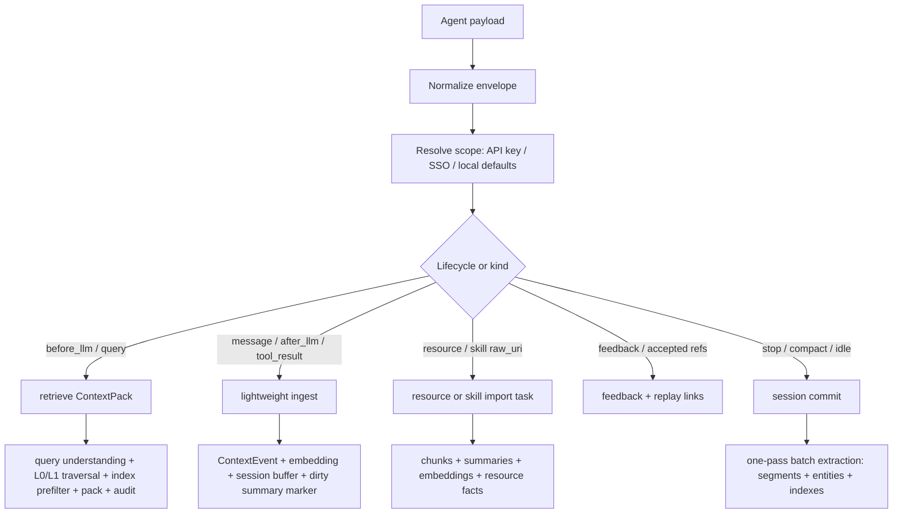
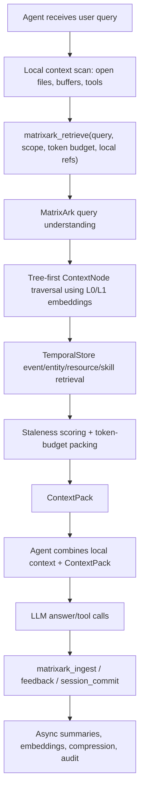

# MatrixArk Agent Integrations

Date: 2026-06-24

## Goal

MatrixArk should integrate with Codex, Claude Desktop, Cursor, and vertical AI
agent products through one stable context boundary:

```text
Agent local context
-> MatrixArk MCP or HTTP API
-> TemporalStore-backed context retrieval / ingestion / feedback
-> ContextPack returned to the agent
-> agent combines ContextPack with local files, buffers, tools, and prompt
```

MatrixArk does not replace the agent's local context engine.  It adds durable,
time-aware, cross-session, cross-device, team-governed context that local prompt
assembly usually does not have.

## Universal Agent Contract

Every MatrixArk agent installation should teach the agent this one rule:

```text
Before answering code/design/context questions:
  call matrixark_retrieve(query, scope, local_context, local_context_tokens, max_context_tokens)

After answering or after useful tool output:
  call matrixark_ingest(messages, scope, local_context_refs, reply_to_context_pack_id)

At task boundaries:
  call matrixark_session_commit(scope)
```

The agent should send what it can see, not MatrixArk internals:

| Field | Agent should send when available | MatrixArk decides |
|---|---|---|
| `query` | Raw user request or workflow task. | Query type, temporal window, secondary-index filters, and retrieval policy. |
| `messages` | User message, assistant answer, tool result, compacted summary. | Whether to write online `ContextEvent`, append session buffer, run extraction, or commit. |
| `scope` | `account_id`, `tenant_id`, `user_id`, `session_id` if the agent knows them. | Final identity from API key, SSO/local defaults, role/scope enforcement, and audit. |
| `local_context` | Visible open files, selected text, tool outputs, terminal summaries, current URL, local refs. | Deduping, remaining remote token budget, and selected `local_context_refs`. |
| `local_context_tokens` | Estimated visible local-context token count. | `remote_budget = max_context_tokens - local_context_tokens - safety_margin`. |
| `max_context_tokens` | Remaining budget for local plus remote context when known. | Token-budget packing and partial ContextPack fallback. |
| `raw_uri` / file refs | Local file URI, S3/object URI, repo path, `SKILL.md`, resource type. | Upload/import decision, parser dispatch, chunking, embeddings, extraction, and versioning. |
| lifecycle event | `before_llm`, `after_llm`, `tool_result`, `feedback`, `stop`, `compact`, `idle`. | Ingest, retrieve, feedback, resource import, or session commit route. |

Do not send hidden/internal prompt context. Only send visible user/workspace
context, explicit local summaries, selected refs, and tool outputs that the
agent is allowed to expose.

## Integration Modes

### 1. MCP Tool Integration

Best for Codex, Claude Desktop, Cursor, and other MCP-capable agents.

The agent explicitly calls:

```text
matrixark_retrieve
matrixark_ingest
matrixark_feedback
matrixark_session_commit
matrixark_replay
```

This is the safest default because the agent can decide when remote context is
useful and how much token budget to allocate.

### 2. Hook Integration

Best for enterprise agent platforms and local tools that expose lifecycle hooks.

Typical hook points:

```text
Before LLM:
  ingest current user message
  retrieve ContextPack

After LLM:
  ingest assistant answer, tool result, accepted refs, rejected refs

On Stop / task finished:
  commit pending same-session buffer

On PostCompact:
  ingest compacted summary
  commit pending same-session buffer

Idle timeout:
  background commit
```

Hooks are useful when the customer wants automatic capture.  MCP is better when
the agent wants explicit control.

### 3. HTTP API Integration

Best for SaaS agents, enterprise gateways, and vertical Cursor-like products.

The public API shape remains simple:

```json
{
  "messages": [{"role": "user", "content": "Alice approved the GPU request."}],
  "scope": {
    "account_id": "acct_acme",
    "tenant_id": "tenant_prod",
    "user_id": "user_123",
    "session_id": "thread_456"
  },
  "metadata": {"source": "cursor", "task_type": "code_review"}
}
```

The caller does not need to know MatrixArk internal data models.  MatrixArk owns
extraction into `ContextNode`, `ContextEvent`, `ContextEntity`,
`ContextSummary`, `ContextIndex`, `ResourceChunk`, and `ContextPackAudit`.

Resource/skill retrieval uses a strict serving boundary:

```text
Resources = cited chunks + summaries + embeddings + indexes
Resource facts = normal events/entities with source_chunk refs
Skills = separate SkillManifest/SkillSection retrieval path
Audit/replay = MatrixArk-specific observability layer
```

That means resources provide cited evidence, resource facts join the normal
event/entity memory graph, skills provide operational instructions, and audit
explains selected/dropped refs without becoming the primary memory lane.

## MatrixArk Workflow From Agent Payloads

MatrixArk routes each payload by intent and available fields:



Retrieval pipeline:

```text
raw query
-> infer question type and optional secondary-index filters
-> enforce account/tenant/user/session access
-> subtract visible local_context from token budget
-> traverse ContextNode L0/L1 summary embeddings
-> fetch leaf ContextEvent, ContextEntity, ContextSegment, ResourceChunk, SkillSection
-> score with similarity, time decay, business/importance hints, and stale blockers
-> pack answer-dense refs under token budget
-> write ContextPackAudit for replay/debug
```

Extraction pipeline:

```text
single message
-> write lightweight ContextEvent
-> append session buffer
-> mark node summary dirty
-> return quickly

same-session threshold / stop / compact / idle / manual commit
-> one-pass batch extraction
-> create ContextSegment records for coherent topics
-> update ContextEntity state and stale blockers
-> write ContextIndex records
-> refresh summaries and embeddings asynchronously
```

## Client Setup

Generate config snippets:

```bash
cd <repo>
python3 tools/matrixark_agent_config.py --client all
python3 tools/matrixark_agent_config.py --client policy
```

### Codex Desktop

Add to `%USERPROFILE%\.codex\config.toml`:

```toml
[mcp_servers.matrixark]
command = 'wsl.exe'
args = [ '--cd', '<repo>', '-e', 'bash', '-lc', 'exec tools/matrixark_mcp_server.sh' ]
startup_timeout_sec = 120
```

Codex can then call MatrixArk MCP tools.  MCP calls are explicit; they do not
fire for every message unless Codex is instructed or a hook is configured.

### Claude Desktop

Add to Claude Desktop's MCP config file:

```json
{
  "mcpServers": {
    "matrixark": {
      "args": [
        "--cd",
        "<repo>",
        "-e",
        "bash",
        "-lc",
        "exec tools/matrixark_mcp_server.sh"
      ],
      "command": "wsl.exe",
      "env": {
        "MATRIXARK_LOCAL_MODE": "cluster",
        "MATRIXARK_MCP_BACKEND": "temporalstore-direct"
      }
    }
  }
}
```

Claude should use `matrixark_retrieve` before answering when prior durable memory
or shared resources may matter, and `matrixark_ingest` or
`matrixark_feedback` after the answer when a new durable fact, correction,
commitment, or accepted/rejected reference should be remembered.

### Claude Code / Claude CLI-Style Agents

Claude Code-style agents should use the same MatrixArk MCP stdio server when
their local installation supports MCP.  The exact config location can differ by
Claude product/version, so generate the server block and paste it into the MCP
server registry used by that installation:

```bash
python3 tools/matrixark_agent_config.py --client claude-code
```

Claude should treat MatrixArk as remote durable context, not as a replacement
for local file reading.  Recommended usage:

```text
before analysis:
  call matrixark_retrieve with raw user query, user/session scope, and token budget

during answer:
  combine MatrixArk ContextPack with local files and tool output

after answer:
  call matrixark_feedback when the user confirms/corrects/accepts refs
  call matrixark_ingest for durable tool outcomes or decisions
```

### Cursor

Use the same MCP server shape:

```json
{
  "mcpServers": {
    "matrixark": {
      "command": "wsl.exe",
      "args": [
        "--cd",
        "<repo>",
        "-e",
        "bash",
        "-lc",
        "exec tools/matrixark_mcp_server.sh"
      ],
      "env": {
        "MATRIXARK_LOCAL_MODE": "cluster",
        "MATRIXARK_MCP_BACKEND": "temporalstore-direct"
      }
    }
  }
}
```

Cursor should keep using its local codebase context.  MatrixArk should be called
for durable context such as historical decisions, team runbooks, project memory,
prior debugging outcomes, approvals, resource chunks, and skills.

Suggested Cursor policy text can be placed in project instructions:

```text
Use MatrixArk MCP for durable context. Before answering questions that may depend
on prior decisions, resources, team memory, user preferences, or historical
debugging attempts, call matrixark_retrieve. Keep using Cursor local code context
for current files. Pass visible open files, selected text, tool outputs,
local_context_tokens, max_context_tokens, and session_id when available. After a
final answer, tool result, accepted ref, rejected ref, decision, correction, or
user confirmation, call matrixark_ingest or matrixark_feedback. On task
completion, call matrixark_session_commit.
```

Cursor should pass a stable scope when possible:

```json
{
  "account_id": "acct_customer",
  "tenant_id": "tenant_workspace",
  "user_id": "cursor_user_123",
  "session_id": "cursor_workspace_thread_456",
  "source": "cursor"
}
```

### Generic HTTP Agent

For agents that cannot use MCP, expose the same operations over HTTP.  The
request body should stay close to the MCP tool schema:

```http
POST /v1/context/retrieve
Content-Type: application/json
Authorization: Bearer mk_live_...

{
  "query": "What did we decide about GPU budget approvals?",
  "scope": {
    "account_id": "acct_acme",
    "tenant_id": "tenant_prod",
    "user_id": "user_123",
    "session_id": "thread_456"
  },
  "max_context_tokens": 2048,
  "local_context": [
    {"ref": "open-buffer:infra/budget.md", "text": "short local summary"}
  ]
}
```

```http
POST /v1/context/ingest
Content-Type: application/json
Authorization: Bearer mk_live_...

{
  "messages": [
    {"role": "assistant", "content": "The GPU request is approved under capex."}
  ],
  "scope": {
    "account_id": "acct_acme",
    "tenant_id": "tenant_prod",
    "user_id": "user_123",
    "session_id": "thread_456"
  },
  "metadata": {"source": "vertical_agent", "event": "after_llm"}
}
```

### Vertical Agents

Vertical agents can integrate through MCP or HTTP.  They should send:

```text
required:
  messages or raw query
  account_id or tenant_id
  user_id or session_id

strongly recommended:
  session_id
  source
  task_type
  max_context_tokens
  local_context refs or summary
  accepted_refs / rejected_refs after final answer
```

If a session id is missing, MatrixArk can fall back to user scope, but
confirmation detection and same-session batch extraction are much better when
`session_id` is present.

## What Each Agent Sends

```text
Codex:
  MCP explicit tool calls, or hook payloads such as UserPromptSubmit, Stop,
  PostCompact, and PostToolUse. MatrixArk wrapper normalizes raw hook payloads.

Claude Desktop / Claude Code:
  MCP explicit tool calls. Claude keeps local context and calls MatrixArk when
  durable memory, resources, or prior decisions matter.

Cursor:
  MCP explicit tool calls from chat/agent workflows. Cursor keeps local code
  context and sends MatrixArk raw query plus optional local refs/summaries.

Vertical AI harness:
  MCP or HTTP. Best integration can also send lifecycle hooks before LLM,
  after LLM, tool-result, feedback, idle-timeout, and session-commit events.
```

## Agent Policy File

Use this local policy doc as project/agent instruction material:

```text
docs/matrixark_agent_policy.md
```

It describes exactly when to call `matrixark_retrieve`, `matrixark_ingest`,
`matrixark_feedback`, and `matrixark_session_commit`.

For automatic lifecycle capture across popular agents, use:

```text
docs/matrixark_popular_agent_hooks.md
tools/matrixark_agent_hook.py
```

## Runtime Flow



## Context Combination Policy

Agents should not blindly append MatrixArk context on top of unchanged local
context forever.  They should budget both:

```text
local_context_tokens
remote_context_tokens
max_prompt_tokens
```

Recommended policy:

```text
code-local question:
  local files first
  MatrixArk only for prior decisions, team memory, resources, skills

cross-session question:
  MatrixArk first
  local files only if current code state matters

Default MatrixArk cross-session policy:
  always consider same-user cross-session context when session_scope=prefer
  require normal similarity/weighted score threshold before packing
  use about 12% of remote MatrixArk budget for ordinary queries
  use about 15% for broad/evidence queries
  use about 20% for current/latest/multi-hop/date queries as a maximum cap, not a quota
  cap default fanout to 3 sessions and 24 candidates
  reserve the remaining budget for same-session continuity, shared resources, and relevant skills

current-state question:
  ContextEntity + fresh ContextEvent first
  stale blockers included only as warnings/evidence

resource/runbook question:
  selected ResourceChunk + citation
  do not inject full raw files by default
```

This is how MatrixArk lowers token usage: it returns a dense, replayable
ContextPack instead of forcing the agent to stuff every old thread, file, or
resource into the prompt.

## Access And Isolation

Every integration must carry scope:

```text
account_id
tenant_id
user_id and/or session_id
optional team/project/source labels
```

MatrixArk API keys enforce:

```text
scopes/roles
account and tenant isolation
allowed users and sessions
audit logs
key rotation and revocation
optional SSO mapping
```

Claude, Cursor, Codex, and vertical agents should never share one global key for
all users in production.  Use tenant-scoped or service-scoped keys and pass the
actual end-user/session scope on every request.

## What Is Automatic Today

```text
MCP:
  tools are available to the agent, but calls are explicit

Codex hook:
  can auto-ingest user messages / tool results / stop events when configured

MatrixArk:
  extracts internal event/entity/segment/index data
  writes TemporalStore records
  refreshes summaries asynchronously
  returns ContextPacks
```

## What Remains Product Backlog

```text
Claude and Cursor first-party hook packages
Cursor project-level config templates
Claude Desktop installer helper
HTTP gateway parity with MCP tools
per-agent default retrieval policies
automatic local-context token budget negotiation
enterprise SSO provisioning
```
