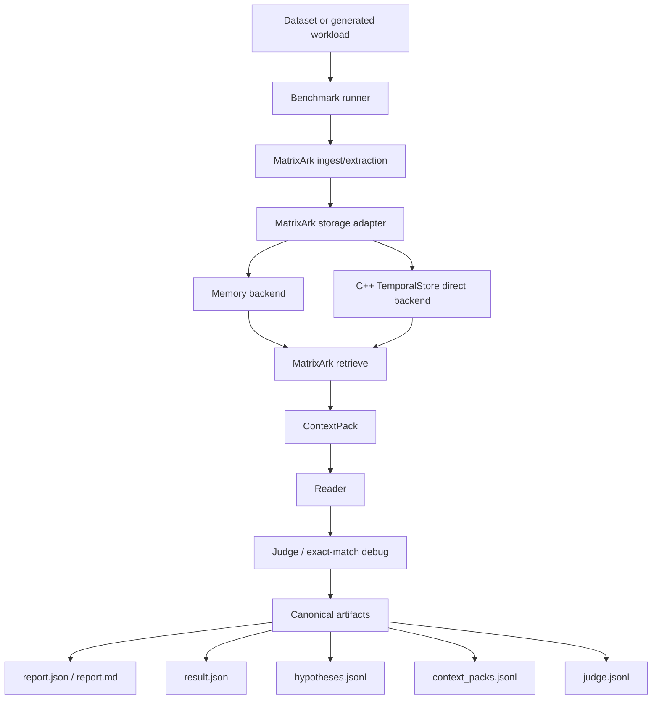
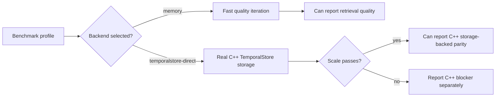
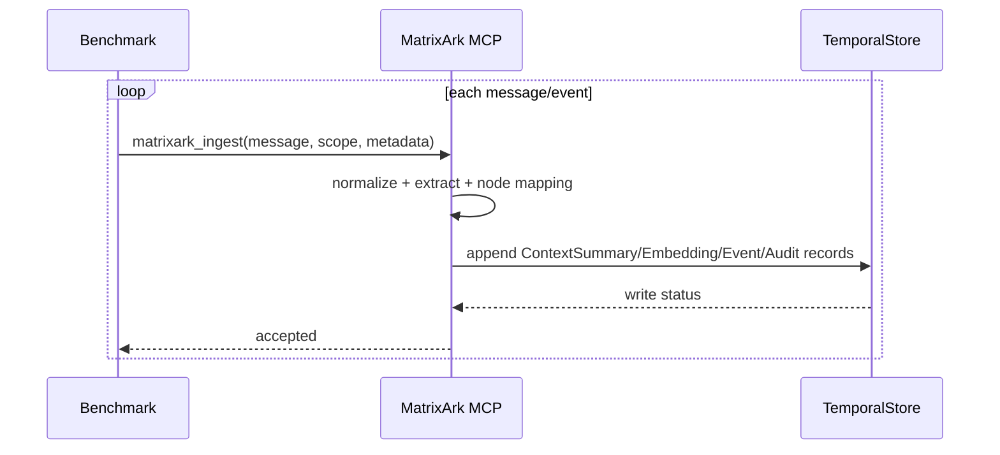
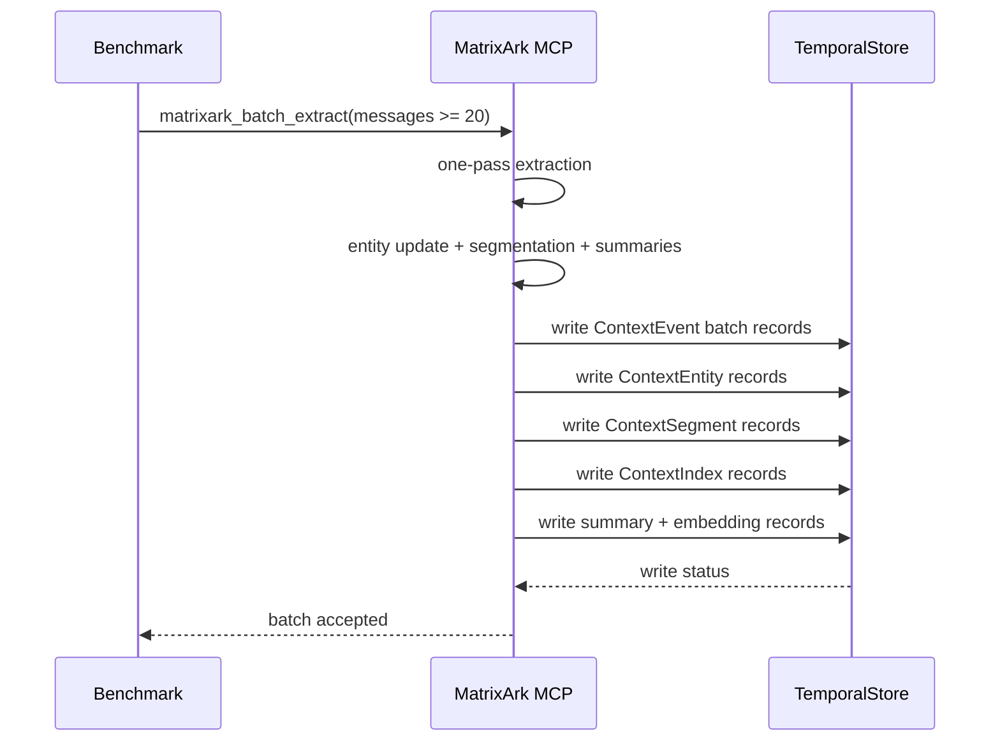
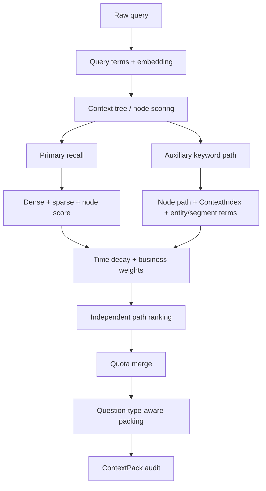
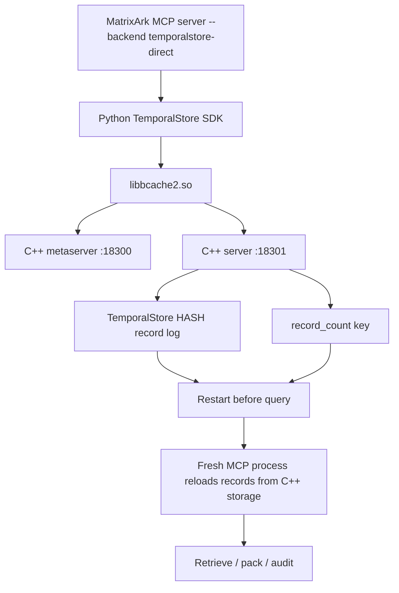
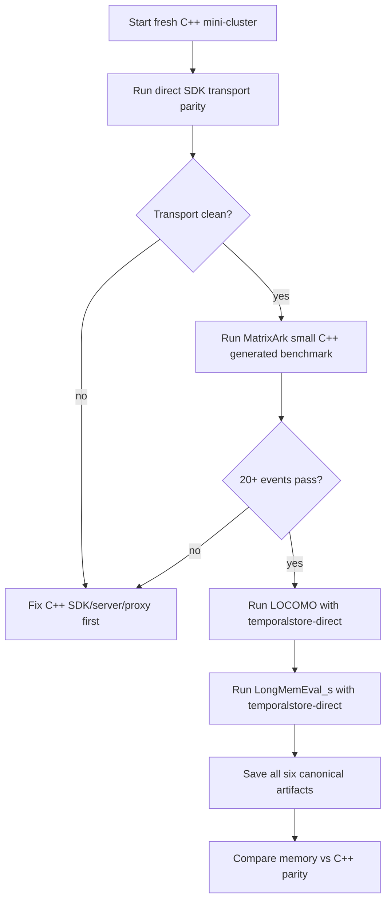

# MatrixArk Benchmarking Workflow

This document shows how MatrixArk benchmark runs should flow for LOCOMO,
LongMemEval, generated scale tests, and C++ TemporalStore parity.

## Current Truth

- Full LOCOMO and LongMemEval benchmark runs must use C++ TemporalStore storage
  every time. Memory-backed full reports are debug artifacts only and must not be
  used for parity claims.
- LOCOMO and LongMemEval reports in `C:\root\matrixark_benchmarks\artifacts`
  are accepted as full benchmark artifacts only when the report explicitly says
  `temporalstore_backend: temporalstore-direct` or `temporalstore_backend: cpp`.
- C++ TemporalStore direct is proven for generated MatrixArk batch and
  one-by-one pipelines on a fresh local C++ deployment.
- A stale listener on `18000/18001` can still make the direct SDK time out. Use a
  fresh deployment and metaserver endpoint for benchmark runs.
- Full LOCOMO/LongMemEval C++ parity is claimable only for runs that pass the
  C++ full-dataset artifact guard.

## Full Dataset Rule

Use `tools/run_matrixark_full_dataset_cpp_benchmark.py` for full LOCOMO and
LongMemEval runs. It is intentionally fail-closed:

- it sets MatrixArk environment defaults to `temporalstore-direct`;
- it requires all six canonical artifacts;
- it rejects reports that use `memory` or omit backend metadata;
- it rejects undersized runs so smoke tests cannot be mislabeled as full runs.
- benchmark ingestion should use logical session batches through
  `matrixark_batch_extract`, not one message at a time, unless the purpose is
  API write-path debugging.

## C++ Record-Log Write Path

MatrixArk's C++ direct adapter now uses a compact sharded append log for new
prefixes:

```text
HSET <storage_prefix>:records:<zero_padded_shard> <zero_padded_offset> <record_json>
SET  <storage_prefix>:record_count <count>
```

This replaces the older write-amplifying path:

```text
HSET <storage_prefix>:records <record_id> <record_json>
SET  <storage_prefix>:record_index <entire_growing_json_array>
```

Why this matters:

- full benchmarks write many ContextEvent, ContextEntity, ContextSummary,
  ContextIndex, ContextSegment, and embedding records;
- rewriting a growing JSON index on every append turns ingestion into an
  avoidable large-string update workload;
- `record_count` stays tiny and lets `read_all()` reconstruct the ordered log by
  reading bounded shard fields instead of one huge hash object;
- old `record_index` prefixes remain readable and appendable through the legacy
  fallback path.

The current default shard size is 256 MatrixArk records per TemporalStore hash
object. This keeps each hset object small enough for repeated benchmark writes
while preserving deterministic replay order.

## Fresh C++ Deployment

Use a fresh local deployment for C++-backed pipeline and benchmark validation:

```bash
BUILD_TYPE=Release \
OUT_DIR=/mnt/c/Users/Deeproute/Documents/Codex/2026-06-07/what-s-the-topology-for-all/temporalstore-service-fix/output-ubuntu22/release \
DEPLOY_DIR=/tmp/matrixark-cpp-fix-18300 \
CLUSTER_NAME=matrixarkfix18300 \
NAMESPACE_NAME=deploy_ns \
TABLE_NAME=deploy_table \
MS_PORT=18300 \
MS_RAFT_PORT=18310 \
MS_SNAPSHOT_PORT=18320 \
SERVER_PORT=18301 \
./tools/deploy_local_ubuntu22.sh start
```

The deploy helper cleanup path is hardened so no-match or killed process
cleanup does not abort startup under `set -euo pipefail`.

Example validation for an existing LOCOMO C++ report:

```bash
python3 tools/run_matrixark_full_dataset_cpp_benchmark.py \
  --dataset locomo \
  --artifact-dir /mnt/c/root/matrixark_benchmarks/artifacts/cpp_direct_20260621_sync \
  --artifact-prefix locomo_cpp_direct_full_20260621 \
  --validate-only
```

Example rejection for a memory-backed full report:

```bash
python3 tools/run_matrixark_full_dataset_cpp_benchmark.py \
  --dataset locomo \
  --artifact-dir /mnt/c/root/matrixark_benchmarks/artifacts \
  --artifact-prefix locomo10_full_reader_precision_20260621 \
  --validate-only
```

Expected result:

```text
full locomo benchmark artifact is not C++ TemporalStore-backed
```

Example wrapper form for a future full benchmark command:

```bash
python3 tools/run_matrixark_full_dataset_cpp_benchmark.py \
  --dataset longmemeval_s \
  --artifact-dir /mnt/c/root/matrixark_benchmarks/artifacts/longmemeval_cpp_YYYYMMDD \
  --artifact-prefix longmemeval_s_cpp_full_YYYYMMDD \
  --metaserver 127.0.0.1:18000 \
  --namespace deploy_ns \
  --table deploy_table \
  --temporalstore-lib output-ubuntu22/release/sdk/lib/libbcache2.so \
  -- python3 path/to/full_benchmark_runner.py ...
```

The wrapped command receives:

- `MATRIXARK_MCP_BACKEND=temporalstore-direct`
- `MATRIXARK_FULL_DATASET_REQUIRE_CPP=1`
- `MATRIXARK_TEMPORALSTORE_BACKEND=temporalstore-direct`
- `MATRIXARK_TEMPORALSTORE_METASERVER`
- `MATRIXARK_TEMPORALSTORE_NAMESPACE`
- `MATRIXARK_TEMPORALSTORE_TABLE`
- `MATRIXARK_TEMPORALSTORE_PREFIX`
- `MATRIXARK_INGEST_MODE=batch`
- `MATRIXARK_BATCH_SIZE=20`

## End-To-End Benchmark Flow



## Storage Backend Decision



Use memory backend only for fast retrieval/reader iteration, smoke tests, and
debugging. Use `temporalstore-direct` for every full LOCOMO/LongMemEval run.

## Fresh C++ Dataset Results On June 21, 2026

The following runs were executed against live C++ TemporalStore through the
Python direct SDK adapter. Both used batch ingestion, `batch_size=20`,
`storage_log_mode=sharded_compact_count_log`, and wrote all six canonical
artifacts.

### LOCOMO Full

Command:

```bash
python3 tools/run_matrixark_dataset_benchmark.py \
  --dataset locomo \
  --data-path /mnt/c/root/matrixark_benchmarks/data/locomo10.json \
  --artifact-dir /mnt/c/root/matrixark_benchmarks/artifacts/cpp_dataset_20260621_full \
  --artifact-prefix locomo_cpp_temporalstore_full_20260621_rerun \
  --metaserver 127.0.0.1:19000 \
  --storage-prefix matrixark:dataset:locomo:full:20260621rerun \
  --max-context-tokens 1200 \
  --max-message-chars 1600 \
  --request-timeout-ms 60000 \
  --io-timeout-ms 60000 \
  --batch-size 20
```

Result:

- Dataset: LOCOMO, `locomo10.json`
- Questions: 1,986
- Sessions: 272
- Turns ingested: 5,882
- C++ backend: `temporalstore-direct`, metaserver `127.0.0.1:19000`
- Ingestion throughput: 43.07 turns/sec
- Retrieval latency: avg 200.56 ms, p50 201.71 ms, p95 258.86 ms
- Context recall: 100.00%
- Evidence-session recall: 44.76%
- Deterministic debug final judge score: 15.81%
- Compression hidden answer count: 0

Artifacts:

```text
/mnt/c/root/matrixark_benchmarks/artifacts/cpp_dataset_20260621_full/locomo_cpp_temporalstore_full_20260621_rerun.result.json
/mnt/c/root/matrixark_benchmarks/artifacts/cpp_dataset_20260621_full/locomo_cpp_temporalstore_full_20260621_rerun.report.json
/mnt/c/root/matrixark_benchmarks/artifacts/cpp_dataset_20260621_full/locomo_cpp_temporalstore_full_20260621_rerun.report.md
/mnt/c/root/matrixark_benchmarks/artifacts/cpp_dataset_20260621_full/locomo_cpp_temporalstore_full_20260621_rerun.hypotheses.jsonl
/mnt/c/root/matrixark_benchmarks/artifacts/cpp_dataset_20260621_full/locomo_cpp_temporalstore_full_20260621_rerun.context_packs.jsonl
/mnt/c/root/matrixark_benchmarks/artifacts/cpp_dataset_20260621_full/locomo_cpp_temporalstore_full_20260621_rerun.judge.jsonl
```

### LongMemEval-Style Full, Local HeLa-Mem Copy

This is a full run over the locally available HeLa-Mem LongMemEval-style copy.
It is C++ TemporalStore-backed, but it should not be labeled official
LongMemEval_s parity because the official cleaned LongMemEval_s file is much
larger and remains a separate benchmark target.

Command:

```bash
python3 tools/run_matrixark_dataset_benchmark.py \
  --dataset longmemeval_s \
  --data-path /mnt/c/root/matrixark_benchmarks/data/longmemeval_s_helamem.json \
  --artifact-dir /mnt/c/root/matrixark_benchmarks/artifacts/cpp_dataset_20260621_full \
  --artifact-prefix longmemeval_helamem_cpp_temporalstore_full_20260621 \
  --metaserver 127.0.0.1:18900 \
  --storage-prefix matrixark:dataset:lmehelamem:full:20260621b \
  --max-context-tokens 1200 \
  --max-message-chars 800 \
  --request-timeout-ms 60000 \
  --io-timeout-ms 60000 \
  --batch-size 20
```

Result:

- Dataset: LongMemEval-style HeLa-Mem copy, `longmemeval_s_helamem.json`
- Questions: 500
- Sessions: 948
- Turns ingested: 10,960
- C++ backend: `temporalstore-direct`, metaserver `127.0.0.1:18900`
- Ingestion throughput: 10.20 turns/sec
- Retrieval latency: avg 281.62 ms, p50 241.06 ms, p95 525.35 ms
- Context recall: 100.00%
- Evidence-session recall: 100.00%
- Deterministic debug final judge score: 38.60%
- Compression hidden answer count: 0

Artifacts:

```text
/mnt/c/root/matrixark_benchmarks/artifacts/cpp_dataset_20260621_full/longmemeval_helamem_cpp_temporalstore_full_20260621.result.json
/mnt/c/root/matrixark_benchmarks/artifacts/cpp_dataset_20260621_full/longmemeval_helamem_cpp_temporalstore_full_20260621.report.json
/mnt/c/root/matrixark_benchmarks/artifacts/cpp_dataset_20260621_full/longmemeval_helamem_cpp_temporalstore_full_20260621.report.md
/mnt/c/root/matrixark_benchmarks/artifacts/cpp_dataset_20260621_full/longmemeval_helamem_cpp_temporalstore_full_20260621.hypotheses.jsonl
/mnt/c/root/matrixark_benchmarks/artifacts/cpp_dataset_20260621_full/longmemeval_helamem_cpp_temporalstore_full_20260621.context_packs.jsonl
/mnt/c/root/matrixark_benchmarks/artifacts/cpp_dataset_20260621_full/longmemeval_helamem_cpp_temporalstore_full_20260621.judge.jsonl
```

Operational note: after the full HeLa-Mem run, the 18900 C++ deployment became
unhealthy under BRPC/bvar saturation and refused a later health connection.
Treat full LongMemEval-style runs as one benchmark per fresh C++ deployment
until the native service write/log pressure is further reduced.

## Ingestion Modes

### One-By-One Ingest

The generated storage benchmark uses `matrixark_ingest` one message at a time.



This is useful for API ingestion realism and write-path diagnostics, but it
writes many small MatrixArk records per message. Do not use one-by-one ingest
for VikingMem-style full benchmark parity unless the benchmark explicitly wants
to measure streaming API overhead.

### One-Pass Batch Extraction

The VikingMem-style path uses `matrixark_batch_extract` over a logical session
batch, typically 20+ messages.



This is the preferred path for long-memory benchmark ingestion because it is
closer to VikingMem's logical session extraction model.

Generated benchmark command:

```bash
python3 tools/run_matrixark_context_storage_benchmark.py \
  --backend temporalstore-direct \
  --ingest-mode batch \
  --batch-size 20 \
  --events 120 \
  --queries 30 \
  --restart-before-query
```

Use `--ingest-mode one-by-one` only when validating the API write path.

## Retrieval Flow



Each selected ref should expose:

- `origin_score`
- `time_score`
- `business_score`
- `final_score`
- `recall_path`
- dropped refs and reasons where available

## C++ TemporalStore Direct Flow



`--restart-before-query` is important. It proves retrieval reloads from C++
TemporalStore storage instead of using only process memory.

## Current Measured Results

### Guard Validation

`tools/test_matrixark_full_dataset_cpp_guard.py` validates both paths:

- C++ full report with `temporalstore_backend: temporalstore-direct` passes.
- Memory full report with `temporalstore_backend: memory` fails.

The existing LOCOMO C++ artifact also passes:

- artifact prefix: `locomo_cpp_direct_full_20260621`
- backend: `cpp`
- questions: `1986`

The newer memory-backed LOCOMO artifact is rejected:

- artifact prefix: `locomo10_full_reader_precision_20260621`
- backend: `memory`

### Batch Ingestion Validation

Generated local batch benchmark:

```bash
python3 tools/run_matrixark_context_storage_benchmark.py \
  --backend local \
  --ingest-mode batch \
  --batch-size 20 \
  --events 120 \
  --queries 30 \
  --restart-before-query
```

Result:

- status: passed
- ingest mode: `batch`
- batches: `6`
- messages ingested: `120`
- hit rate: `100%`
- retrieve avg: `20.775 ms`

Existing one-pass extraction test also passed locally:

- messages: `21`
- events written: `21`
- entities written: `6`
- segments written: `3`
- indexes written: `7`
- retrieval refs returned: `8`

### Stale C++ Health Note

On the stale `18000/18001` listener, fresh generated C++ direct smoke runs hit:

```text
Internal: Request server failed[E1008]Reached timeout=20000ms @127.0.0.1:18001
```

This includes the new batch benchmark path:

```bash
python3 tools/run_matrixark_context_storage_benchmark.py \
  --backend temporalstore-direct \
  --ingest-mode batch \
  --batch-size 20 \
  --events 40 \
  --queries 10 \
  --restart-before-query
```

The direct SDK HASH stress test also times out on the same endpoint:

```bash
PYTHONPATH=sdk/python \
TEMPORALSTORE_LIB=output-ubuntu22/release/sdk/lib/libbcache2.so \
python3 sdk/python/examples/direct_sdk_stress.py \
  --metaserver 127.0.0.1:18000 \
  --namespace deploy_ns \
  --table deploy_table \
  --prefix compact-direct-smoke \
  --hash-ops 5 \
  --feature-keys 0 \
  --request-timeout-ms 20000 \
  --io-timeout-ms 20000
```

Observed result:

```text
Internal: Request server failed[E1008]Reached timeout=20000ms @127.0.0.1:18001
```

Treat this as a stale deployment health failure, not a MatrixArk fallback path.
Full dataset benchmarks should use a fresh C++ deployment and should remain
blocked if that deployment cannot pass direct SDK HASH stress first.

### Fresh C++ Direct Validation

Fresh local deployment:

- metaserver: `127.0.0.1:18300`
- server: `127.0.0.1:18301`
- namespace/table: `deploy_ns/deploy_table`

Direct SDK stress:

- status: passed
- hash ops: `100`
- hash overwrite checks: `100`
- feature points written/read: `8/8`
- elapsed: `2277.236 ms`

C++ MatrixArk batch benchmark:

| Messages | Queries | Batches | Hit Rate | Ingest Avg | Retrieve Avg | Storage Log |
|---:|---:|---:|---:|---:|---:|---|
| 120 | 30 | 6 | 100% | 989.423 ms | 70.307 ms | compact_count_log |
| 400 | 80 | 20 | 100% | 701.415 ms | 102.642 ms | compact_count_log |

C++ MatrixArk one-by-one benchmark:

| Events | Queries | Status | Hit Rate | Ingest Avg | Retrieve Avg | Storage Log |
|---:|---:|---|---:|---:|---:|---|
| 60 | 15 | passed | 100% | 153.419 ms | 91.689 ms | compact_count_log |
| 120 | 30 | passed | 100% | 121.755 ms | 77.800 ms | compact_count_log |

### Memory Backend, Generated Scale

`120 events / 30 queries`, one-by-one ingest:

- status: passed
- hit rate: `100%`
- ingest avg: `12.455 ms`, p50 `10.760 ms`, p95 `20.711 ms`
- retrieve avg: `29.219 ms`, p50 `19.427 ms`, p95 `28.837 ms`

### C++ TemporalStore Direct, Generated Scale

Historical one-by-one ingest on the stale `18000/18001` deployment:

| Events | Queries | Status | Hit Rate | Ingest Avg | Retrieve Avg |
|---:|---:|---|---:|---:|---:|
| 5 | 3 | passed | 100% | 244.040 ms | 200.512 ms |
| 10 | 5 | passed | 100% | 176.213 ms | 172.829 ms |
| 20 | 5 | passed | 100% | 121.879 ms | 113.191 ms |
| 60 | 15 | failed | n/a | n/a | n/a |

Failure signature:

```text
Internal: Request server failed[E1008]Reached timeout=5000ms @127.0.0.1:18001
```

Server logs also showed repeated:

```text
Switch new blob rescheduled outside coroutine context
```

### C++ TemporalStore Direct, Batch Extraction

`matrixark_batch_extract` with 21 messages:

- status: passed
- events written: `21`
- entities written: `6`
- segments written: `3`
- indexes written: `7`
- retrieval refs returned: `8`

## LOCOMO / LongMemEval Status

### LOCOMO Latest Full Report

Report:
`C:\root\matrixark_benchmarks\artifacts\locomo10_full_reader_precision_20260621.report.json`

- backend: `memory`
- conversations: `10`
- turns ingested: `9363`
- questions: `1986`
- context recall: `98.94%`
- evidence session recall: `98.59%`
- evidence turn recall: `56.96%`
- final judge score: `48.74%`
- retrieval p50: `460 ms`
- retrieval p95: `662 ms`
- ingestion throughput: `27.56 turns/sec`

This is not C++ TemporalStore parity.

### LongMemEval-Style HeLa-Mem Report

Report:
`C:\root\matrixark_benchmarks\artifacts\longmemeval_s_helamem_scale_answer_dense_reader_20260620.report.json`

- dataset: HeLa-Mem copy of LongMemEval_s, not official parity
- turns ingested: `10960`
- questions: `500`
- context recall: `99.60%`
- evidence session recall: `99.40%`
- evidence turn recall: `82.05%`
- final judge score: `63.40%`
- retrieval p50: `73 ms`
- retrieval p95: `133 ms`
- ingestion throughput: `58.99 turns/sec`

This is not official LongMemEval_s paper parity and is not proven C++-backed.

## Required C++ Parity Gate



## Next Work

1. Run full LOCOMO against the fresh C++ deployment with
   `temporalstore-direct`, `compact_count_log`, and batch extraction.
2. Run full LongMemEval_s against the fresh C++ deployment once the dataset
   source is selected and available locally.
3. Keep using `matrixark_batch_extract` for benchmark ingestion when using
   logical session batches.
4. Wire the external full LOCOMO/LongMemEval runner through
   `tools/run_matrixark_full_dataset_cpp_benchmark.py`.
5. Make the benchmark report writer include backend, C++ endpoint, storage
   prefix, restart-before-query, and write
   mode in every LOCOMO/LongMemEval report.
