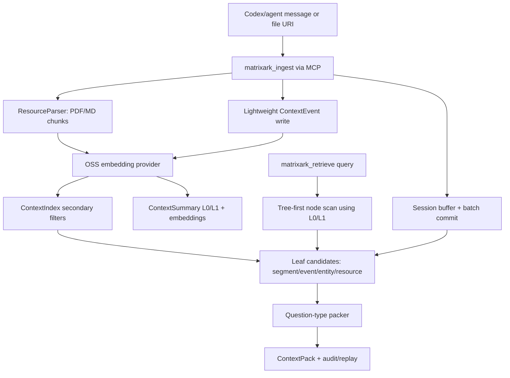

# MatrixArk Message + Resource Debug Trace

This debug run ingests LOCOMO-style multi-turn conversation messages and several PDF/Markdown resources, then retrieves one ContextPack. It is meant for inspecting exactly what MatrixArk writes and reads during ingestion, extraction, chunking, summary generation, embedding storage, tree traversal, secondary-index filtering, packing, audit, and replay.

## Pipeline Diagram



## Re-run

```bash
MATRIXARK_EMBEDDING_PROVIDER=deterministic python3 tools/run_matrixark_message_pdf_debug_trace.py --output-dir docs/debug/matrixark_message_resource_trace
```

## Configuration

- Event log: `C:\Users\Deeproute\Documents\Codex\2026-06-10\pull-rust-temporalstore-code-from-matrixarkai\work\TemporalStore\docs\debug\matrixark_codex_cpp_100_message_trace\matrixark_message_resource_debug_trace.jsonl`
- Embedding model: `matrixark-local-token-hash-v1`
- Embedding execution mode: `deterministic-token-hash`
- Query: `What is the current Project Aurora GPU approval, owner, budget cap, deadline, and runbook blocker?`
- Summary refresh: background interval `1000` ms, limit `64` dirty nodes per tick
- Node L1 policy: generate when child summaries, >=3 source events, or >=180 estimated source tokens
- Embedding note: This run completed with the local deterministic embedding backend. The local sentence-transformers OSS probe timed out before this trace was generated, so the data-flow artifact is complete but not an OSS-embedding proof.

## Data Model Field Guide

|model|purpose|important_fields|
|---|---|---|
|ContextNode|Filesystem-like topology. Messages/resources attach to a leaf node, parents are used for traversal.|node_hash, parent_hash, node_name, node_path, depth, scope_key|
|ContextEvent|Replayable extracted fact or raw conversational event.|event_id_hash, node_hash, source_chunk_hash, resource_hash, source_locator, summary_text, event_type, entity_type, ti...|
|ContextSegment|Batch/session topic segment when a logical window is committed.|segment_hash, node_hash, source_event_ids, summary_text, topic, time_range|
|ContextEntity|Evolving state for current preference/status/owner/budget/deadline.|entity_hash, entity_type, entity_name, state, source_chunk_hash, resource_hash, source_locator, valid_from, stale_blo...|
|ResourceManifest|Logical imported file/resource version. Raw bytes stay outside TemporalStore.|resource_hash, raw_uri, resource_type, resource_version, content_hash, scope_key|
|ResourceChunk|Cited serving chunk from PDF/MD/etc. Full raw_uri lives on ResourceManifest; chunks carry resource_hash plus source_l...|chunk_hash, resource_hash, source_locator, text, token_estimate, unit_kind, page_number, heading_slug|
|ContextSummary|L0/L1 node/resource summary used for preview and tree traversal.|summary_hash, summary_type, node_hash, summary_text, source_event_ids, source_chunk_hashes|
|ContextEmbedding|Vector stored separately for summaries, chunks, events, entities, and resources.|embedding_type, ref_type, ref_hash, model, dim, vector|
|ContextIndex|Bounded secondary filters before similarity scoring.|index_name, index_value, ref_type, ref_hash, node_hash, chunk_hash|
|ContextPackAudit|Explains selected/dropped refs, scores, token costs, warnings, and replay path.|context_pack_id, selected_refs, dropped_refs, used_context_tokens, quality_warnings|

## Record Counts

|record_type|count|
|---|---|
|context_batch_commit|1|
|context_child_ref|6|
|context_debug_record|33|
|context_embedding|87|
|context_entity|15|
|context_entity_update_audit|5|
|context_event|23|
|context_extraction_audit|1|
|context_index|204|
|context_node|7|
|context_pack_audit|1|
|context_pack_telemetry|1|
|context_recall_reinforcement|18|
|context_segment|3|
|context_summary|41|
|context_summary_dirty|86|
|context_summary_refresh_audit|11|
|matrixark_audit_log|19|
|matrixark_metric|5|
|resource_chunk|5|
|resource_import_task|15|
|resource_manifest|5|
|resource_registry|5|
|session_buffer_event|13|

## Input Messages

|role|content|
|---|---|
|user|Alice from finance approved the GPU purchase request for Project Aurora after reviewing the Q3 budget.|
|assistant|Recorded: Project Aurora GPU purchase is approved by Alice in finance, pending procurement owner assignment.|
|user|Bob will own procurement, and the budget cap is 42000 dollars for the initial GPU batch.|
|assistant|I will track Bob as procurement owner and the 42000 dollar cap for the initial batch.|
|user|The deadline is July 15, 2026, and the runbook says finance approval must be attached before vendor selection.|
|assistant|The active deadline is July 15, 2026. Vendor selection requires the finance approval attachment.|
|user|Correction: Alice raised the cap to 45000 dollars after the backup GPU quote came in.|
|assistant|Updated: the current Project Aurora GPU budget cap is 45000 dollars.|

## Resources

|raw_uri|title|line_count|
|---|---|---|
|C:\Users\Deeproute\Documents\Codex\2026-06-10\pull-rust-temporalstore-code-from-matrixarkai\work\TemporalStore\docs\d...|Project Aurora GPU Approval Packet|5|
|C:\Users\Deeproute\Documents\Codex\2026-06-10\pull-rust-temporalstore-code-from-matrixarkai\work\TemporalStore\docs\d...|GPU Procurement Runbook|4|
|C:\Users\Deeproute\Documents\Codex\2026-06-10\pull-rust-temporalstore-code-from-matrixarkai\work\TemporalStore\docs\d...|Budget Update Memo|4|
|C:\Users\Deeproute\Documents\Codex\2026-06-10\pull-rust-temporalstore-code-from-matrixarkai\work\TemporalStore\docs\d...|Project Aurora GPU Policy|6|
|C:\Users\Deeproute\Documents\Codex\2026-06-10\pull-rust-temporalstore-code-from-matrixarkai\work\TemporalStore\docs\d...|Project Aurora GPU Troubleshooting|4|

## Resource Import Tasks

|status|raw_uri|resource_type|chunk_count|resource_fact_count|resource_entity_count|metrics|
|---|---|---|---|---|---|---|
|queued|C:\Users\Deeproute\Documents\Codex\2026-06-10\pull-rust-temporalstore-code-from-matrixarkai\work\TemporalStore\docs\d...|pdf|||||
|running|C:\Users\Deeproute\Documents\Codex\2026-06-10\pull-rust-temporalstore-code-from-matrixarkai\work\TemporalStore\docs\d...|pdf|||||
|completed|C:\Users\Deeproute\Documents\Codex\2026-06-10\pull-rust-temporalstore-code-from-matrixarkai\work\TemporalStore\docs\d...|pdf|1|2|2|{"chunk_count": 1, "cloud_bucket": "", "cloud_key": "", "dedupe_count": 0, "duration_ms": 394.16, "embedding_count": ...|
|queued|C:\Users\Deeproute\Documents\Codex\2026-06-10\pull-rust-temporalstore-code-from-matrixarkai\work\TemporalStore\docs\d...|pdf|||||
|running|C:\Users\Deeproute\Documents\Codex\2026-06-10\pull-rust-temporalstore-code-from-matrixarkai\work\TemporalStore\docs\d...|pdf|||||
|completed|C:\Users\Deeproute\Documents\Codex\2026-06-10\pull-rust-temporalstore-code-from-matrixarkai\work\TemporalStore\docs\d...|pdf|1|2|2|{"chunk_count": 1, "cloud_bucket": "", "cloud_key": "", "dedupe_count": 0, "duration_ms": 54.521, "embedding_count": ...|
|queued|C:\Users\Deeproute\Documents\Codex\2026-06-10\pull-rust-temporalstore-code-from-matrixarkai\work\TemporalStore\docs\d...|pdf|||||
|running|C:\Users\Deeproute\Documents\Codex\2026-06-10\pull-rust-temporalstore-code-from-matrixarkai\work\TemporalStore\docs\d...|pdf|||||
|completed|C:\Users\Deeproute\Documents\Codex\2026-06-10\pull-rust-temporalstore-code-from-matrixarkai\work\TemporalStore\docs\d...|pdf|1|2|2|{"chunk_count": 1, "cloud_bucket": "", "cloud_key": "", "dedupe_count": 0, "duration_ms": 51.275, "embedding_count": ...|
|queued|C:\Users\Deeproute\Documents\Codex\2026-06-10\pull-rust-temporalstore-code-from-matrixarkai\work\TemporalStore\docs\d...|md|||||
|running|C:\Users\Deeproute\Documents\Codex\2026-06-10\pull-rust-temporalstore-code-from-matrixarkai\work\TemporalStore\docs\d...|md|||||
|completed|C:\Users\Deeproute\Documents\Codex\2026-06-10\pull-rust-temporalstore-code-from-matrixarkai\work\TemporalStore\docs\d...|md|1|2|2|{"chunk_count": 1, "cloud_bucket": "", "cloud_key": "", "dedupe_count": 0, "duration_ms": 45.014, "embedding_count": ...|
|queued|C:\Users\Deeproute\Documents\Codex\2026-06-10\pull-rust-temporalstore-code-from-matrixarkai\work\TemporalStore\docs\d...|md|||||
|running|C:\Users\Deeproute\Documents\Codex\2026-06-10\pull-rust-temporalstore-code-from-matrixarkai\work\TemporalStore\docs\d...|md|||||
|completed|C:\Users\Deeproute\Documents\Codex\2026-06-10\pull-rust-temporalstore-code-from-matrixarkai\work\TemporalStore\docs\d...|md|1|2|2|{"chunk_count": 1, "cloud_bucket": "", "cloud_key": "", "dedupe_count": 0, "duration_ms": 48.189, "embedding_count": ...|

## Resource Chunks

|chunk_hash|resource_hash|source_locator|token_estimate|metadata.unit_kind|metadata.content_hash|text|
|---|---|---|---|---|---|---|
|4819398059654939441|8584741635287733730|page=1|51|pdf_page|49199ad5bd94964c|Project Aurora GPU Approval Packet Decision: Alice approved the Project Aurora GPU purchase after finance review. Own...|
|456790337710764122|888532192682326692|page=1|43|pdf_page|7aaae94b56b51807|GPU Procurement Runbook Procedure: Attach finance approval before vendor selection. Procedure: Compare primary and ba...|
|2418201568328997923|4492309950785166601|page=1|48|pdf_page|87731a0bb7829d5c|Budget Update Memo Update: The backup GPU quote increased the cap from 42000 dollars to 45000 dollars. Current state:...|
|6051725708133528022|3400855048320878078|heading=project-aurora-gpu-policy|47|markdown_section|08cc296494df3867|# Project Aurora GPU Policy Decision: Alice from finance approved the GPU purchase. Owner: Bob owns procurement and v...|
|3088140979938095262|5124352650846791650|heading=troubleshooting|39|markdown_section|5d8de2f72f13fbb0|# Troubleshooting If vendor selection fails, first verify the finance approval attachment. If the backup quote is use...|

## Extracted Events

|event_id_hash|node_path|internal_extraction.event_type|internal_extraction.entity_type|summary_text|source_chunk_hash|resource_hash|source_locator|
|---|---|---|---|---|---|---|---|
|8135280964260817502||||user: Alice from finance approved the GPU purchase request for Project Aurora after reviewing the Q3 budget.||||
|3497090396958777419||||assistant: Recorded: Project Aurora GPU purchase is approved by Alice in finance, pending procurement owner assignment.||||
|2888418282918082562||||user: Bob will own procurement, and the budget cap is 42000 dollars for the initial GPU batch.||||
|8874551677504413445||||assistant: I will track Bob as procurement owner and the 42000 dollar cap for the initial batch.||||
|6717215592090782382||||user: The deadline is July 15, 2026, and the runbook says finance approval must be attached before vendor selection.||||
|5632673477605542627||||assistant: The active deadline is July 15, 2026. Vendor selection requires the finance approval attachment.||||
|6345269472664278351||||user: Correction: Alice raised the cap to 45000 dollars after the backup GPU quote came in.||||
|4048399091898324876||||assistant: Updated: the current Project Aurora GPU budget cap is 45000 dollars.||||
|2555347658215328804||||resource_decision: Alice approved the Project Aurora GPU purchase after finance review|4819398059654939441|8584741635287733730|page=1|
|4540721316824141478||||resource_owner: Bob owns procurement and vendor coordination|4819398059654939441|8584741635287733730|page=1|
|8465022216181362451||||tool: Import PDF resource for MatrixArk parsing: Project Aurora GPU Approval Packet||||
|3511737526308378556||||resource_troubleshooting_step: Procedure: Attach finance approval before vendor selection|456790337710764122|888532192682326692|page=1|
|4918319429494704554||||resource_approval: before vendor selection|456790337710764122|888532192682326692|page=1|
|1659817715217636730||||tool: Import PDF resource for MatrixArk parsing: GPU Procurement Runbook||||
|8911507370643628805||||resource_cost: Update Memo|2418201568328997923|4492309950785166601|page=1|
|2637030059605313630||||resource_policy: not be used for current-state answers|2418201568328997923|4492309950785166601|page=1|
|7516561286953271649||||tool: Import PDF resource for MatrixArk parsing: Budget Update Memo||||
|208729723586261235||||resource_decision: Alice from finance approved the GPU purchase|6051725708133528022|3400855048320878078|heading=project-aurora-gpu-policy|
|2974006505943548718||||resource_owner: Bob owns procurement and vendor coordination|6051725708133528022|3400855048320878078|heading=project-aurora-gpu-policy|
|4948898869036228010||||tool: Import Markdown resource for MatrixArk parsing: Project Aurora GPU Policy||||
|3660941442548591412||||resource_owner: missing, assign Bob before creating a purchase order|3088140979938095262|5124352650846791650|heading=troubleshooting|
|2993415031816414702||||resource_troubleshooting_step: ing|3088140979938095262|5124352650846791650|heading=troubleshooting|
|8412290406781019209||||tool: Import Markdown resource for MatrixArk parsing: Project Aurora GPU Troubleshooting||||

## Extracted Entities

|entity_hash|node_path|entity_type|entity_name|operator|state|source_chunk_hash|resource_hash|source_locator|
|---|---|---|---|---|---|---|---|---|
|1488030737650625042||current_plan|current_plan|LLM_MERGE|track Bob as procurement owner and the 42000 dollar cap for the initial batch||||
|5205088207995267081||approval_state|the GPU purchase request for Project Aurora after reviewing the Q3 budget|LLM_MERGE|the GPU purchase request for Project Aurora after reviewing the Q3 budget||||
|5708414255151575681||approval_state|by Alice in finance, pending procurement owner assignment|LLM_MERGE|by Alice in finance, pending procurement owner assignment||||
|8967060400784335657||approval_state|must be attached before vendor selection|LLM_MERGE|must be attached before vendor selection||||
|1722827731307680407||approval_state|attachment|LLM_MERGE|attachment||||
|2397680881691085687||resource_decision|decision:Alice approved the Project Aurora GPU purchase after finance review|LATEST|resource_decision: Alice approved the Project Aurora GPU purchase after finance review. Source: Project Aurora GPU Ap...|4819398059654939441|8584741635287733730|page=1|
|8767243533843172983||resource_owner|owner:Bob owns procurement and vendor coordination|LATEST|resource_owner: Bob owns procurement and vendor coordination. Source: Project Aurora GPU Approval Packet Decision: Al...|4819398059654939441|8584741635287733730|page=1|
|740070266483831682||resource_troubleshooting|troubleshooting:Procedure: Attach finance approval before vendor selection|LATEST|resource_troubleshooting_step: Procedure: Attach finance approval before vendor selection. Source: GPU Procurement Ru...|456790337710764122|888532192682326692|page=1|
|7914291714241602812||resource_approval|approval:before vendor selection|LATEST|resource_approval: before vendor selection. Source: GPU Procurement Runbook Procedure: Attach finance approval before...|456790337710764122|888532192682326692|page=1|
|7429634306363123448||resource_cost|cost:Update Memo|LATEST|resource_cost: Update Memo. Source: Budget Update Memo Update: The backup GPU quote increased the cap from 42000 doll...|2418201568328997923|4492309950785166601|page=1|
|3331126048114181129||resource_policy|policy:not be used for current-state answers|LATEST|resource_policy: not be used for current-state answers. Source: Budget Update Memo Update: The backup GPU quote incre...|2418201568328997923|4492309950785166601|page=1|
|3166532788072103647||resource_decision|decision:Alice from finance approved the GPU purchase|LATEST|resource_decision: Alice from finance approved the GPU purchase. Source: # Project Aurora GPU Policy Decision: Alice ...|6051725708133528022|3400855048320878078|heading=project-aurora-gpu-policy|
|8700460158918732602||resource_owner|owner:Bob owns procurement and vendor coordination|LATEST|resource_owner: Bob owns procurement and vendor coordination. Source: # Project Aurora GPU Policy Decision: Alice fro...|6051725708133528022|3400855048320878078|heading=project-aurora-gpu-policy|
|3363991087828924034||resource_owner|owner:missing, assign Bob before creating a purchase order|LATEST|resource_owner: missing, assign Bob before creating a purchase order. Source: # Troubleshooting If vendor selection f...|3088140979938095262|5124352650846791650|heading=troubleshooting|
|3702846657716015588||resource_troubleshooting|troubleshooting:ing|LATEST|resource_troubleshooting_step: ing. Source: # Troubleshooting If vendor selection fails, first verify the finance app...|3088140979938095262|5124352650846791650|heading=troubleshooting|

## Summaries

|summary_type|summary_hash|node_path|summary_generation_policy.reason|summary_text|source_chunk_hashes|
|---|---|---|---|---|---|
|session_l0|8695652974415713980|["tenant:tenant_codex", "user:deeproute", "session:debug-message-pdf-session", "conversation:project_aurora"]||user: Alice from finance approved the GPU purchase request for Project Aurora after reviewing the Q3 budget.||
|session_l0|8695652974415713980|["tenant:tenant_codex", "user:deeproute", "session:debug-message-pdf-session", "conversation:project_aurora"]||user: Alice from finance approved the GPU purchase request for Project Aurora after reviewing the Q3 budget. user: Al...||
|session_l0|8695652974415713980|["tenant:tenant_codex", "user:deeproute", "session:debug-message-pdf-session", "conversation:project_aurora"]||user: Alice from finance approved the GPU purchase request for Project Aurora after reviewing the Q3 budget. user: Al...||
|session_l0|8695652974415713980|["tenant:tenant_codex", "user:deeproute", "session:debug-message-pdf-session", "conversation:project_aurora"]||user: Alice from finance approved the GPU purchase request for Project Aurora after reviewing the Q3 budget. user: Al...||
|session_l0|8695652974415713980|["tenant:tenant_codex", "user:deeproute", "session:debug-message-pdf-session", "conversation:project_aurora"]||user: Alice from finance approved the GPU purchase request for Project Aurora after reviewing the Q3 budget. user: Al...||
|session_l0|8695652974415713980|["tenant:tenant_codex", "user:deeproute", "session:debug-message-pdf-session", "conversation:project_aurora"]||user: Alice from finance approved the GPU purchase request for Project Aurora after reviewing the Q3 budget. user: Al...||
|session_l0|8695652974415713980|["tenant:tenant_codex", "user:deeproute", "session:debug-message-pdf-session", "conversation:project_aurora"]||user: Alice from finance approved the GPU purchase request for Project Aurora after reviewing the Q3 budget. user: Al...||
|session_l0|8695652974415713980|["tenant:tenant_codex", "user:deeproute", "session:debug-message-pdf-session", "conversation:project_aurora"]||user: Alice from finance approved the GPU purchase request for Project Aurora after reviewing the Q3 budget. user: Al...||
|batch_l0|21524118857008535|["tenant:tenant_codex", "user:deeproute", "session:debug-message-pdf-session", "conversation:project_aurora"]||user: Alice from finance approved the GPU purchase request for Project Aurora after reviewing the Q3 budget. assistan...||
|node_l0|4626625830169563149|["tenant:tenant_codex"]|has_child_summaries|tenant:tenant_codex :: user: Alice from finance approved the GPU purchase request for Project Aurora after reviewing ...||
|node_l1|1916101716449258884|["tenant:tenant_codex"]|has_child_summaries|Context node tenant:tenant_codex. Rich overview: user: Alice from finance approved the GPU purchase request for Proje...||
|node_l0|5451123137701072075|["tenant:tenant_codex", "user:deeproute"]|has_child_summaries|tenant:tenant_codex / user:deeproute :: user: Alice from finance approved the GPU purchase request for Project Aurora...||
|resource_l0|5253826341840929662|["tenant:tenant_codex", "user:deeproute", "resources", "project_aurora", "gpu_procurement"]||resource: C:\Users\Deeproute\Documents\Codex\2026-06-10\pull-rust-temporalstore-code-from-matrixarkai\work\TemporalSt...|[4819398059654939441]|
|node_l1|7794448877417626891|["tenant:tenant_codex", "user:deeproute"]|has_child_summaries|Context node tenant:tenant_codex / user:deeproute. Rich overview: user: Alice from finance approved the GPU purchase ...||
|node_l0|1886266633781634111|["tenant:tenant_codex", "user:deeproute", "session:debug-message-pdf-session"]|has_child_summaries|tenant:tenant_codex / user:deeproute / session:debug-message-pdf-session :: user: Alice from finance approved the GPU...||
|node_l1|1616491761191208179|["tenant:tenant_codex", "user:deeproute", "session:debug-message-pdf-session"]|has_child_summaries|Context node tenant:tenant_codex / user:deeproute / session:debug-message-pdf-session. Rich overview: user: Alice fro...||
|node_l0|7072998724969009401|["tenant:tenant_codex", "user:deeproute", "session:debug-message-pdf-session", "conversation:project_aurora"]|event_count_threshold|tenant:tenant_codex / user:deeproute / session:debug-message-pdf-session / conversation:project_aurora :: user: Alice...||
|node_l1|3186282447509310879|["tenant:tenant_codex", "user:deeproute", "session:debug-message-pdf-session", "conversation:project_aurora"]|event_count_threshold|Context node tenant:tenant_codex / user:deeproute / session:debug-message-pdf-session / conversation:project_aurora. ...||
|session_l0|8695652974415713980|["tenant:tenant_codex", "user:deeproute", "resources", "project_aurora", "gpu_procurement"]||user: Alice from finance approved the GPU purchase request for Project Aurora after reviewing the Q3 budget. user: Al...||
|resource_l0|2387919895054058779|["tenant:tenant_codex", "user:deeproute", "resources", "project_aurora", "gpu_procurement"]||resource: C:\Users\Deeproute\Documents\Codex\2026-06-10\pull-rust-temporalstore-code-from-matrixarkai\work\TemporalSt...|[456790337710764122]|
|session_l0|8695652974415713980|["tenant:tenant_codex", "user:deeproute", "resources", "project_aurora", "gpu_procurement"]||user: Alice from finance approved the GPU purchase request for Project Aurora after reviewing the Q3 budget. user: Al...||
|resource_l0|8362868875371206370|["tenant:tenant_codex", "user:deeproute", "resources", "project_aurora", "gpu_procurement"]||resource: C:\Users\Deeproute\Documents\Codex\2026-06-10\pull-rust-temporalstore-code-from-matrixarkai\work\TemporalSt...|[2418201568328997923]|
|session_l0|8695652974415713980|["tenant:tenant_codex", "user:deeproute", "resources", "project_aurora", "gpu_procurement"]||user: Alice from finance approved the GPU purchase request for Project Aurora after reviewing the Q3 budget. user: Al...||
|resource_l0|3162514970771483214|["tenant:tenant_codex", "user:deeproute", "resources", "project_aurora", "gpu_procurement"]||resource: C:\Users\Deeproute\Documents\Codex\2026-06-10\pull-rust-temporalstore-code-from-matrixarkai\work\TemporalSt...|[6051725708133528022]|
|session_l0|8695652974415713980|["tenant:tenant_codex", "user:deeproute", "resources", "project_aurora", "gpu_procurement"]||user: Alice from finance approved the GPU purchase request for Project Aurora after reviewing the Q3 budget. user: Al...||
|resource_l0|6524626718067131693|["tenant:tenant_codex", "user:deeproute", "resources", "project_aurora", "gpu_procurement"]||resource: C:\Users\Deeproute\Documents\Codex\2026-06-10\pull-rust-temporalstore-code-from-matrixarkai\work\TemporalSt...|[3088140979938095262]|
|session_l0|8695652974415713980|["tenant:tenant_codex", "user:deeproute", "resources", "project_aurora", "gpu_procurement"]||user: Alice from finance approved the GPU purchase request for Project Aurora after reviewing the Q3 budget. user: Al...||
|node_l0|1886266633781634111|["tenant:tenant_codex", "user:deeproute", "session:debug-message-pdf-session"]|has_child_summaries|tenant:tenant_codex / user:deeproute / session:debug-message-pdf-session :: user: Alice from finance approved the GPU...||
|node_l1|1616491761191208179|["tenant:tenant_codex", "user:deeproute", "session:debug-message-pdf-session"]|has_child_summaries|Context node tenant:tenant_codex / user:deeproute / session:debug-message-pdf-session. Rich overview: user: Alice fro...||
|node_l0|7072998724969009401|["tenant:tenant_codex", "user:deeproute", "session:debug-message-pdf-session", "conversation:project_aurora"]|event_count_threshold|tenant:tenant_codex / user:deeproute / session:debug-message-pdf-session / conversation:project_aurora :: user: Alice...||
|node_l1|3186282447509310879|["tenant:tenant_codex", "user:deeproute", "session:debug-message-pdf-session", "conversation:project_aurora"]|event_count_threshold|Context node tenant:tenant_codex / user:deeproute / session:debug-message-pdf-session / conversation:project_aurora. ...||
|node_l0|4626625830169563149|["tenant:tenant_codex"]|has_child_summaries|tenant:tenant_codex :: tenant:tenant_codex / user:deeproute :: user: Alice from finance approved the GPU purchase req...||
|node_l1|1916101716449258884|["tenant:tenant_codex"]|has_child_summaries|Context node tenant:tenant_codex. Rich overview: tenant:tenant_codex / user:deeproute :: user: Alice from finance app...||
|node_l0|5451123137701072075|["tenant:tenant_codex", "user:deeproute"]|has_child_summaries|tenant:tenant_codex / user:deeproute :: user: Alice from finance approved the GPU purchase request for Project Aurora...||
|node_l1|7794448877417626891|["tenant:tenant_codex", "user:deeproute"]|has_child_summaries|Context node tenant:tenant_codex / user:deeproute. Rich overview: user: Alice from finance approved the GPU purchase ...||
|node_l0|2423087115552912795|["tenant:tenant_codex", "user:deeproute", "resources"]|has_child_summaries|tenant:tenant_codex / user:deeproute / resources :: resource: C:\Users\Deeproute\Documents\Codex\2026-06-10\pull-rust...||
|node_l1|8165358132187641623|["tenant:tenant_codex", "user:deeproute", "resources"]|has_child_summaries|Context node tenant:tenant_codex / user:deeproute / resources. Rich overview: resource: C:\Users\Deeproute\Documents\...||
|node_l0|4443347079005396521|["tenant:tenant_codex", "user:deeproute", "resources", "project_aurora"]|has_child_summaries|tenant:tenant_codex / user:deeproute / resources / project_aurora :: resource: C:\Users\Deeproute\Documents\Codex\202...||
|node_l1|7129763152424808338|["tenant:tenant_codex", "user:deeproute", "resources", "project_aurora"]|has_child_summaries|Context node tenant:tenant_codex / user:deeproute / resources / project_aurora. Rich overview: resource: C:\Users\Dee...||
|node_l0|9161093819732845678|["tenant:tenant_codex", "user:deeproute", "resources", "project_aurora", "gpu_procurement"]|event_count_threshold|tenant:tenant_codex / user:deeproute / resources / project_aurora / gpu_procurement :: Budget Update Memo Update: The...||
|node_l1|1076018507551928025|["tenant:tenant_codex", "user:deeproute", "resources", "project_aurora", "gpu_procurement"]|event_count_threshold|Context node tenant:tenant_codex / user:deeproute / resources / project_aurora / gpu_procurement. Rich overview: Budg...||

## Node L0/L1 Generation Policy

|node_path|generated_summary_types|l1_policy.generate_l1|l1_policy.reason|l1_policy.token_estimate|source_event_count|source_summary_count|
|---|---|---|---|---|---|---|
|["tenant:tenant_codex"]|["node_l0", "node_l1"]|True|has_child_summaries|304|0|2|
|["tenant:tenant_codex", "user:deeproute"]|["node_l0", "node_l1"]|True|has_child_summaries|304|0|2|
|["tenant:tenant_codex", "user:deeproute", "session:debug-message-pdf-session"]|["node_l0", "node_l1"]|True|has_child_summaries|304|0|2|
|["tenant:tenant_codex", "user:deeproute", "session:debug-message-pdf-session", "conversation:project_aurora"]|["node_l0", "node_l1"]|True|event_count_threshold|205|8|0|
|["tenant:tenant_codex", "user:deeproute", "session:debug-message-pdf-session"]|["node_l0", "node_l1"]|True|has_child_summaries|648|0|4|
|["tenant:tenant_codex", "user:deeproute", "session:debug-message-pdf-session", "conversation:project_aurora"]|["node_l0", "node_l1"]|True|event_count_threshold|205|8|0|
|["tenant:tenant_codex"]|["node_l0", "node_l1"]|True|has_child_summaries|1305|0|8|
|["tenant:tenant_codex", "user:deeproute"]|["node_l0", "node_l1"]|True|has_child_summaries|1253|0|8|
|["tenant:tenant_codex", "user:deeproute", "resources"]|["node_l0", "node_l1"]|True|has_child_summaries|250|0|2|
|["tenant:tenant_codex", "user:deeproute", "resources", "project_aurora"]|["node_l0", "node_l1"]|True|has_child_summaries|250|0|2|
|["tenant:tenant_codex", "user:deeproute", "resources", "project_aurora", "gpu_procurement"]|["node_l0", "node_l1"]|True|event_count_threshold|414|8|0|

## Embeddings

|model|embedding_count|
|---|---|
|matrixark-local-token-hash-v1|67|

|embedding_type|ref_type|ref_hash|dim|preview|
|---|---|---|---|---|
|session_l0|summary|8695652974415713980|32|[0.0, 0.0, 0.04994, -0.19975, 0.3995, 0.0, -0.24969, 0.04994]|
|event_text|event|8135280964260817502|32|[0.0, 0.0, 0.0, -0.2, 0.4, 0.0, -0.2, 0.0]|
|event_text|event|3497090396958777419|32|[0.0, 0.0, 0.26726, 0.0, 0.26726, 0.0, -0.26726, 0.26726]|
|event_text|event|2888418282918082562|32|[0.0, 0.0, -0.2582, -0.2582, 0.2582, 0.2582, 0.0, 0.0]|
|event_text|event|8874551677504413445|32|[0.0, 0.0, -0.22942, 0.22942, 0.0, 0.22942, 0.0, 0.0]|
|event_text|event|6717215592090782382|32|[0.0, -0.22942, -0.22942, -0.22942, 0.22942, 0.0, -0.45883, -0.22942]|
|event_text|event|5632673477605542627|32|[0.24254, 0.0, 0.0, 0.0, 0.0, 0.0, -0.24254, 0.0]|
|event_text|event|6345269472664278351|32|[0.0, 0.0, 0.0, -0.44721, 0.22361, 0.22361, 0.22361, 0.0]|
|event_text|event|4048399091898324876|32|[0.0, 0.0, 0.0, 0.0, 0.31623, 0.31623, 0.0, -0.31623]|
|entity_state|entity|1488030737650625042|32|[0.0, 0.0, -0.24254, 0.0, 0.0, 0.24254, 0.0, 0.0]|
|entity_state|entity|5205088207995267081|32|[0.0, 0.24254, 0.0, -0.24254, 0.24254, 0.0, 0.0, 0.0]|
|entity_state|entity|5708414255151575681|32|[0.0, 0.33333, 0.33333, 0.0, 0.0, 0.0, 0.0, 0.33333]|
|entity_state|entity|8967060400784335657|32|[0.0, 0.0, 0.0, -0.44721, 0.0, 0.44721, -0.44721, 0.0]|
|entity_state|entity|1722827731307680407|32|[0.70711, 0.70711, 0.0, 0.0, 0.0, 0.0, 0.0, 0.0]|
|segment_text|segment|4517584345163647782|32|[0.0, -0.07538, -0.07538, -0.30151, 0.15076, 0.0, -0.30151, 0.0]|
|segment_text|segment|3595142660925501474|32|[0.0, 0.0, 0.0, -0.3849, 0.0, 0.19245, 0.19245, 0.19245]|
|segment_text|segment|6679446472544957279|32|[0.0, 0.0, -0.22361, 0.0, 0.22361, 0.22361, 0.0, 0.0]|
|batch_l0|summary|21524118857008535|32|[0.05083, -0.05083, -0.10167, -0.1525, 0.35583, 0.20333, -0.20333, 0.0]|
|node_l0|summary|4626625830169563149|32|[0.0, 0.0, 0.0, -0.24434, 0.48868, 0.0, -0.24434, 0.0]|
|node_l1|summary|1916101716449258884|32|[0.0, 0.0, 0.02529, -0.17706, 0.43, 0.02529, -0.22765, 0.05059]|
|node_l0|summary|5451123137701072075|32|[0.0, 0.0, 0.0, -0.2325, 0.46499, 0.0, -0.2325, 0.0]|
|resource_l0|summary|5253826341840929662|32|[-0.08248, -0.08248, -0.08248, -0.57735, 0.24744, 0.0, -0.08248, 0.08248]|
|node_l1|summary|7794448877417626891|32|[0.0, -0.02736, -0.02736, -0.16415, 0.38302, 0.02736, -0.27359, 0.02736]|
|node_l0|summary|1886266633781634111|32|[0.0, 0.0, 0.0, -0.25198, 0.50395, 0.0, -0.12599, 0.0]|
|node_l1|summary|1616491761191208179|32|[0.0, -0.02757, -0.02757, -0.16539, 0.38592, 0.02757, -0.27566, 0.02757]|
|node_l0|summary|7072998724969009401|32|[0.0, 0.0, 0.0, -0.28571, 0.42857, 0.14286, -0.14286, 0.0]|
|node_l1|summary|3186282447509310879|32|[0.0, -0.03975, -0.11924, -0.23848, 0.35772, 0.23848, -0.15899, -0.07949]|
|resource_chunk|resource_chunk|4819398059654939441|32|[-0.07001, -0.07001, -0.07001, -0.56011, 0.21004, -0.07001, -0.07001, 0.14003]|
|event_text|event|2555347658215328804|32|[0.0, 0.0, -0.08704, -0.43519, 0.26112, 0.0, -0.34815, 0.08704]|
|entity_state|entity|2397680881691085687|32|[0.0, -0.07762, -0.07762, -0.38808, 0.31046, 0.0, -0.23284, 0.07762]|
|event_text|event|4540721316824141478|32|[0.0, 0.1, -0.2, -0.6, 0.2, 0.0, -0.3, 0.1]|
|entity_state|entity|8767243533843172983|32|[0.0, 0.08671, -0.26013, -0.69369, 0.17342, 0.0, -0.26013, 0.08671]|
|event_text|event|8465022216181362451|32|[0.0, 0.0, 0.0, -0.5, 0.25, 0.0, -0.25, 0.0]|
|resource_l0|summary|2387919895054058779|32|[0.0, -0.08085, -0.24254, -0.64676, -0.16169, 0.24254, 0.08085, 0.0]|
|resource_chunk|resource_chunk|456790337710764122|32|[0.0, -0.06681, -0.20045, -0.66815, -0.26726, 0.20045, 0.06681, 0.06681]|
|event_text|event|3511737526308378556|32|[0.09091, 0.0, -0.27273, -0.54546, -0.36364, 0.36364, -0.09091, 0.0]|
|entity_state|entity|740070266483831682|32|[0.08333, -0.08333, -0.16667, -0.5, -0.33333, 0.33333, 0.0, 0.0]|
|event_text|event|4918319429494704554|32|[0.09667, 0.0, -0.29002, -0.58004, -0.29002, 0.3867, -0.09667, 0.0]|
|entity_state|entity|7914291714241602812|32|[0.08392, -0.08392, -0.25175, -0.58743, -0.25175, 0.41959, 0.0, 0.0]|
|event_text|event|1659817715217636730|32|[0.0, 0.0, 0.0, -0.57735, 0.0, 0.0, -0.28868, 0.0]|
|resource_l0|summary|8362868875371206370|32|[-0.16903, -0.25355, -0.08452, -0.42258, 0.08452, 0.08452, 0.16903, -0.16903]|
|resource_chunk|resource_chunk|2418201568328997923|32|[-0.13047, -0.1957, -0.06523, -0.45663, 0.0, 0.06523, 0.13047, -0.06523]|
|event_text|event|8911507370643628805|32|[-0.09853, -0.19707, -0.09853, -0.19707, 0.0, 0.19707, 0.0, -0.19707]|
|entity_state|entity|7429634306363123448|32|[-0.0898, -0.26941, -0.0898, -0.1796, 0.0, 0.1796, 0.0, -0.1796]|
|event_text|event|2637030059605313630|32|[-0.09285, -0.18569, -0.18569, -0.18569, 0.0, 0.09285, -0.09285, -0.27854]|
|entity_state|entity|3331126048114181129|32|[-0.08085, -0.24254, -0.16169, -0.16169, 0.0, -0.08085, -0.16169, -0.24254]|
|event_text|event|7516561286953271649|32|[0.0, 0.0, 0.0, -0.35355, 0.0, 0.0, -0.35355, 0.0]|
|resource_l0|summary|3162514970771483214|32|[-0.09285, -0.09285, 0.09285, -0.55709, 0.27854, 0.09285, 0.0, 0.09285]|
|resource_chunk|resource_chunk|6051725708133528022|32|[-0.12804, 0.0, 0.25607, -0.64018, 0.32009, 0.0, 0.0, 0.19206]|
|event_text|event|208729723586261235|32|[0.0, -0.10154, 0.0, -0.50767, 0.10154, 0.10154, -0.3046, 0.10154]|
|entity_state|entity|3166532788072103647|32|[0.0, -0.17025, 0.0, -0.51075, 0.08513, 0.08513, -0.25538, 0.08513]|
|event_text|event|2974006505943548718|32|[0.0, 0.0, -0.1118, -0.67082, 0.1118, 0.1118, -0.22361, 0.1118]|
|entity_state|entity|8700460158918732602|32|[0.0, 0.0, -0.18569, -0.74278, 0.09285, 0.09285, -0.18569, 0.09285]|
|event_text|event|4948898869036228010|32|[0.0, 0.0, 0.33333, -0.33333, 0.33333, 0.0, -0.33333, 0.0]|
|resource_l0|summary|6524626718067131693|32|[0.0, 0.10483, -0.10483, -0.31449, 0.20966, 0.20966, 0.20966, -0.10483]|
|resource_chunk|resource_chunk|3088140979938095262|32|[0.0, 0.08392, -0.16784, -0.41959, 0.0, 0.16784, 0.16784, -0.08392]|
|event_text|event|3660941442548591412|32|[0.11471, 0.22942, -0.11471, -0.34412, 0.11471, 0.22942, 0.0, -0.11471]|
|entity_state|entity|3363991087828924034|32|[0.09017, 0.18033, -0.09017, -0.36067, 0.09017, 0.18033, 0.0, -0.09017]|
|event_text|event|2993415031816414702|32|[0.14286, 0.14286, -0.14286, -0.28571, 0.14286, 0.28571, 0.0, -0.14286]|
|entity_state|entity|3702846657716015588|32|[0.13245, 0.0, -0.13245, -0.26491, 0.13245, 0.26491, 0.0, -0.13245]|
|event_text|event|8412290406781019209|32|[0.0, 0.0, 0.0, -0.33333, 0.33333, 0.0, -0.33333, 0.0]|
|node_l0|summary|2423087115552912795|32|[-0.4, -0.2, 0.0, -0.2, 0.2, -0.2, 0.2, 0.0]|
|node_l1|summary|8165358132187641623|32|[-0.03745, 0.0, -0.03745, -0.26215, 0.41195, 0.03745, -0.1498, -0.03745]|
|node_l0|summary|4443347079005396521|32|[-0.20412, -0.20412, 0.0, -0.40825, 0.20412, 0.0, 0.20412, 0.0]|
|node_l1|summary|7129763152424808338|32|[-0.03807, 0.0, -0.03807, -0.26649, 0.41876, 0.11421, -0.11421, 0.0]|
|node_l0|summary|9161093819732845678|32|[0.0, -0.32444, 0.0, -0.32444, 0.16222, 0.32444, 0.32444, 0.0]|
|node_l1|summary|1076018507551928025|32|[-0.04233, -0.21167, 0.0, -0.508, 0.16933, 0.21167, -0.21167, 0.0]|

## Secondary Indexes

|index_name|ref_type|ref_hash|chunk_hash|node_path|
|---|---|---|---|---|
|event_type:confirmation|event|8135280964260817502|||
|status:observed|event|8135280964260817502|||
|source_type:message|event|8135280964260817502|||
|event_type:confirmation|event|3497090396958777419|||
|status:observed|event|3497090396958777419|||
|source_type:message|event|3497090396958777419|||
|event_type:plan_update|event|2888418282918082562|||
|status:observed|event|2888418282918082562|||
|source_type:message|event|2888418282918082562|||
|event_type:plan_update|event|8874551677504413445|||
|status:observed|event|8874551677504413445|||
|source_type:message|event|8874551677504413445|||
|event_type:dialogue_batch|event|6717215592090782382|||
|status:observed|event|6717215592090782382|||
|source_type:message|event|6717215592090782382|||
|event_type:dialogue_batch|event|5632673477605542627|||
|status:observed|event|5632673477605542627|||
|source_type:message|event|5632673477605542627|||
|event_type:correction|event|6345269472664278351|||
|status:observed|event|6345269472664278351|||
|source_type:message|event|6345269472664278351|||
|event_type:correction|event|4048399091898324876|||
|status:observed|event|4048399091898324876|||
|source_type:message|event|4048399091898324876|||
|event_type:correction|||||
|classification:batch_memory|||||
|status:observed|||||
|source_type:message|||||
|entity_type:current_plan|||||
|entity_type:approval_state|||||
|segment_topic:approval_budget|||||
|segment_topic:correction|||||
|source_type:resource|||||
|resource_type:pdf|||||
|source_type:resource|resource_chunk|4819398059654939441|4819398059654939441||
|resource_type:pdf|resource_chunk|4819398059654939441|4819398059654939441||
|unit_kind:pdf_page|resource_chunk|4819398059654939441|4819398059654939441||
|keyword:project|resource_chunk|4819398059654939441|4819398059654939441||
|keyword:aurora|resource_chunk|4819398059654939441|4819398059654939441||
|keyword:gpu|resource_chunk|4819398059654939441|4819398059654939441||
|keyword:approval|resource_chunk|4819398059654939441|4819398059654939441||
|keyword:packet|resource_chunk|4819398059654939441|4819398059654939441||
|keyword:decision|resource_chunk|4819398059654939441|4819398059654939441||
|source_type:resource_fact|resource_fact|2555347658215328804|4819398059654939441||
|resource_type:pdf|resource_fact|2555347658215328804|4819398059654939441||
|unit_kind:pdf_page|resource_fact|2555347658215328804|4819398059654939441||
|entity_type:resource_decision|resource_fact|2555347658215328804|4819398059654939441||
|entity_type:resource_fact|resource_fact|2555347658215328804|4819398059654939441||
|event_type:resource_decision|resource_fact|2555347658215328804|4819398059654939441||
|keyword:project|resource_fact|2555347658215328804|4819398059654939441||
|keyword:aurora|resource_fact|2555347658215328804|4819398059654939441||
|keyword:gpu|resource_fact|2555347658215328804|4819398059654939441||
|keyword:approval|resource_fact|2555347658215328804|4819398059654939441||
|source_type:resource_fact|resource_fact|4540721316824141478|4819398059654939441||
|resource_type:pdf|resource_fact|4540721316824141478|4819398059654939441||
|unit_kind:pdf_page|resource_fact|4540721316824141478|4819398059654939441||
|entity_type:resource_owner|resource_fact|4540721316824141478|4819398059654939441||
|entity_type:resource_fact|resource_fact|4540721316824141478|4819398059654939441||
|event_type:resource_owner|resource_fact|4540721316824141478|4819398059654939441||
|keyword:project|resource_fact|4540721316824141478|4819398059654939441||
|keyword:aurora|resource_fact|4540721316824141478|4819398059654939441||
|keyword:gpu|resource_fact|4540721316824141478|4819398059654939441||
|keyword:approval|resource_fact|4540721316824141478|4819398059654939441||
|event_type:dialogue_batch|event|8465022216181362451|||
|status:observed|event|8465022216181362451|||
|source_type:resource|event|8465022216181362451|||
|source_type:resource|||||
|resource_type:pdf|||||
|source_type:resource|resource_chunk|456790337710764122|456790337710764122||
|resource_type:pdf|resource_chunk|456790337710764122|456790337710764122||
|unit_kind:pdf_page|resource_chunk|456790337710764122|456790337710764122||
|keyword:gpu|resource_chunk|456790337710764122|456790337710764122||
|keyword:procurement|resource_chunk|456790337710764122|456790337710764122||
|keyword:runbook|resource_chunk|456790337710764122|456790337710764122||
|keyword:procedure|resource_chunk|456790337710764122|456790337710764122||
|keyword:attach|resource_chunk|456790337710764122|456790337710764122||
|keyword:finance|resource_chunk|456790337710764122|456790337710764122||
|source_type:resource_fact|resource_fact|3511737526308378556|456790337710764122||
|resource_type:pdf|resource_fact|3511737526308378556|456790337710764122||
|unit_kind:pdf_page|resource_fact|3511737526308378556|456790337710764122||
|entity_type:resource_troubleshooting|resource_fact|3511737526308378556|456790337710764122||
|entity_type:resource_fact|resource_fact|3511737526308378556|456790337710764122||
|event_type:resource_troubleshooting_step|resource_fact|3511737526308378556|456790337710764122||
|keyword:gpu|resource_fact|3511737526308378556|456790337710764122||
|keyword:procurement|resource_fact|3511737526308378556|456790337710764122||
|keyword:runbook|resource_fact|3511737526308378556|456790337710764122||
|keyword:procedure|resource_fact|3511737526308378556|456790337710764122||
|source_type:resource_fact|resource_fact|4918319429494704554|456790337710764122||
|resource_type:pdf|resource_fact|4918319429494704554|456790337710764122||
|unit_kind:pdf_page|resource_fact|4918319429494704554|456790337710764122||
|entity_type:resource_approval|resource_fact|4918319429494704554|456790337710764122||
|entity_type:resource_fact|resource_fact|4918319429494704554|456790337710764122||
|event_type:resource_approval|resource_fact|4918319429494704554|456790337710764122||
|keyword:gpu|resource_fact|4918319429494704554|456790337710764122||
|keyword:procurement|resource_fact|4918319429494704554|456790337710764122||
|keyword:runbook|resource_fact|4918319429494704554|456790337710764122||
|keyword:procedure|resource_fact|4918319429494704554|456790337710764122||
|event_type:dialogue_batch|event|1659817715217636730|||
|status:observed|event|1659817715217636730|||
|source_type:resource|event|1659817715217636730|||
|source_type:resource|||||
|resource_type:pdf|||||
|source_type:resource|resource_chunk|2418201568328997923|2418201568328997923||
|resource_type:pdf|resource_chunk|2418201568328997923|2418201568328997923||
|unit_kind:pdf_page|resource_chunk|2418201568328997923|2418201568328997923||
|keyword:budget|resource_chunk|2418201568328997923|2418201568328997923||
|keyword:update|resource_chunk|2418201568328997923|2418201568328997923||
|keyword:memo|resource_chunk|2418201568328997923|2418201568328997923||
|keyword:backup|resource_chunk|2418201568328997923|2418201568328997923||
|keyword:gpu|resource_chunk|2418201568328997923|2418201568328997923||
|keyword:quote|resource_chunk|2418201568328997923|2418201568328997923||
|source_type:resource_fact|resource_fact|8911507370643628805|2418201568328997923||
|resource_type:pdf|resource_fact|8911507370643628805|2418201568328997923||
|unit_kind:pdf_page|resource_fact|8911507370643628805|2418201568328997923||
|entity_type:resource_cost|resource_fact|8911507370643628805|2418201568328997923||
|entity_type:resource_fact|resource_fact|8911507370643628805|2418201568328997923||
|event_type:resource_cost|resource_fact|8911507370643628805|2418201568328997923||
|keyword:budget|resource_fact|8911507370643628805|2418201568328997923||
|keyword:update|resource_fact|8911507370643628805|2418201568328997923||
|keyword:memo|resource_fact|8911507370643628805|2418201568328997923||

## Retrieval Scan

Retrieval uses the same scope as ingestion. The intended order is: understand the query, apply scope and secondary-index filters, scan ContextNode L0/L1 summary embeddings to choose folders, fetch leaf candidates, then score segments/events/entities/resource chunks and pack the final ContextPack under the token budget. If a summary is missing, MatrixArk can still fall back to recent events/entities/chunks.

```json
{
  "context_pack_id": "4883294797643375728",
  "dropped_refs": {
    "deadline": 0,
    "deadline_exceeded": false,
    "deadline_reason": "",
    "duplicate": 5,
    "estimated_tokens": {
      "deadline": 0,
      "duplicate": 228,
      "low_score": 0,
      "max_selected_refs": 0,
      "over_budget": 0,
      "raw_l2": 0,
      "stale": 0,
      "summary": 0
    },
    "low_score": 0,
    "max_selected_refs": 0,
    "over_budget": 0,
    "raw_l2": 0,
    "reason_descriptions": {
      "deadline": "candidate was not packed because the hard retrieval deadline was reached",
      "duplicate": "candidate duplicated local context or an already selected ref",
      "low_score": "candidate score was below the minimum packing threshold",
      "max_selected_refs": "candidate was relevant but dropped because max_selected_refs was reached",
      "over_budget": "candidate was relevant but exceeded the remaining remote context token budget",
      "raw_l2": "raw L2 content was dropped because a smaller cited chunk or summary was enough",
      "stale": "candidate was stale or superseded for the query policy",
      "summary": "summary text was dropped in favor of denser raw/evidence refs"
    },
    "refs": [
      {
        "access_decision": "allowed_by_scope",
        "citation": "",
        "context_class": "resource_fact",
        "drop_reason": "duplicate",
        "matched_index_terms": [
          "event_type:confirmation",
          "event_type:correction",
          "event_type:dialogue_batch",
          "event_type:plan_update",
          "heading_slug:project-aurora-gpu-policy",
          "heading_slug:troubleshooting",
          "keyword:alice",
          "keyword:approval",
          "keyword:attach",
          "keyword:aurora",
          "keyword:backup",
          "keyword:budget",
          "keyword:decision",
          "keyword:fails",
          "keyword:finance",
          "keyword:first",
          "keyword:gpu",
          "keyword:memo",
          "keyword:packet",
          "keyword:policy",
          "keyword:procedure",
          "keyword:procurement",
          "keyword:project",
          "keyword:quote",
          "keyword:runbook",
          "keyword:selection",
          "keyword:troubleshooting",
          "keyword:update",
          "keyword:vendor",
          "keyword:verify",
          "resource_type:md",
          "resource_type:pdf",
          "source_type:message",
          "source_type:resource",
          "status:observed",
          "unit_kind:markdown_section",
          "unit_kind:pdf_page"
        ],
        "node_hash": 1737304210274426578,
        "node_path": [],
        "origin_score": 0.815167,
        "packing_score": 1.0,
        "raw_uri": "",
        "reason": "duplicate",
        "ref_hash": 2974006505943548718,
        "ref_type": "event",
        "resource_type": "",
        "resource_version": "",
        "score": 0.811375,
        "selection_reason": "selected by tree path, secondary indexes, and resource fact/event hybrid score",
        "source_ref": "",
        "stale_or_superseded": false,
        "token_cost": 47,
        "token_estimate": 47,
        "version_state": "current"
      },
      {
        "access_decision": "allowed_by_scope",
        "citation": "",
        "context_class": "resource_fact",
        "drop_reason": "duplicate",
        "matched_index_terms": [
          "event_type:confirmation",
          "event_type:correction",
          "event_type:dialogue_batch",
          "event_type:plan_update",
          "heading_slug:project-aurora-gpu-policy",
          "heading_slug:troubleshooting",
          "keyword:alice",
          "keyword:approval",
          "keyword:attach",
          "keyword:aurora",
          "keyword:backup",
          "keyword:budget",
          "keyword:decision",
          "keyword:fails",
          "keyword:finance",
          "keyword:first",
          "keyword:gpu",
          "keyword:memo",
          "keyword:packet",
          "keyword:policy",
          "keyword:procedure",
          "keyword:procurement",
          "keyword:project",
          "keyword:quote",
          "keyword:runbook",
          "keyword:selection",
          "keyword:troubleshooting",
          "keyword:update",
          "keyword:vendor",
          "keyword:verify",
          "resource_type:md",
          "resource_type:pdf",
          "source_type:message",
          "source_type:resource",
          "status:observed",
          "unit_kind:markdown_section",
          "unit_kind:pdf_page"
        ],
        "node_hash": 1737304210274426578,
        "node_path": [],
        "origin_score": 0.797744,
        "packing_score": 1.0,
        "raw_uri": "",
        "reason": "duplicate",
        "ref_hash": 4540721316824141478,
        "ref_type": "event",
        "resource_type": "",
        "resource_version": "",
        "score": 0.798308,
        "selection_reason": "selected by tree path, secondary indexes, and resource fact/event hybrid score",
        "source_ref": "",
        "stale_or_superseded": false,
        "token_cost": 51,
        "token_estimate": 51,
        "version_state": "current"
      },
      {
        "access_decision": "allowed_by_scope",
        "citation": "",
        "context_class": "resource_fact",
        "drop_reason": "duplicate",
        "matched_index_terms": [
          "event_type:confirmation",
          "event_type:correction",
          "event_type:dialogue_batch",
          "event_type:plan_update",
          "heading_slug:project-aurora-gpu-policy",
          "heading_slug:troubleshooting",
          "keyword:alice",
          "keyword:approval",
          "keyword:attach",
          "keyword:aurora",
          "keyword:backup",
          "keyword:budget",
          "keyword:decision",
          "keyword:fails",
          "keyword:finance",
          "keyword:first",
          "keyword:gpu",
          "keyword:memo",
          "keyword:packet",
          "keyword:policy",
          "keyword:procedure",
          "keyword:procurement",
          "keyword:project",
          "keyword:quote",
          "keyword:runbook",
          "keyword:selection",
          "keyword:troubleshooting",
          "keyword:update",
          "keyword:vendor",
          "keyword:verify",
          "resource_type:md",
          "resource_type:pdf",
          "source_type:message",
          "source_type:resource",
          "status:observed",
          "unit_kind:markdown_section",
          "unit_kind:pdf_page"
        ],
        "node_hash": 1737304210274426578,
        "node_path": [],
        "origin_score": 0.658639,
        "packing_score": 0.993979,
        "raw_uri": "",
        "reason": "duplicate",
        "ref_hash": 2993415031816414702,
        "ref_type": "event",
        "resource_type": "",
        "resource_version": "",
        "score": 0.693979,
        "selection_reason": "selected by tree path, secondary indexes, and resource fact/event hybrid score",
        "source_ref": "",
        "stale_or_superseded": false,
        "token_cost": 39,
        "token_estimate": 39,
        "version_state": "current"
      },
      {
        "access_decision": "allowed_by_scope",
        "citation": "",
        "context_class": "resource_fact",
        "drop_reason": "duplicate",
        "matched_index_terms": [
          "event_type:confirmation",
          "event_type:correction",
          "event_type:dialogue_batch",
          "event_type:plan_update",
          "heading_slug:project-aurora-gpu-policy",
          "heading_slug:troubleshooting",
          "keyword:alice",
          "keyword:approval",
          "keyword:attach",
          "keyword:aurora",
          "keyword:backup",
          "keyword:budget",
          "keyword:decision",
          "keyword:fails",
          "keyword:finance",
          "keyword:first",
          "keyword:gpu",
          "keyword:memo",
          "keyword:packet",
          "keyword:policy",
          "keyword:procedure",
          "keyword:procurement",
          "keyword:project",
          "keyword:quote",
          "keyword:runbook",
          "keyword:selection",
          "keyword:troubleshooting",
          "keyword:update",
          "keyword:vendor",
          "keyword:verify",
          "resource_type:md",
          "resource_type:pdf",
          "source_type:message",
          "source_type:resource",
          "status:observed",
          "unit_kind:markdown_section",
          "unit_kind:pdf_page"
        ],
        "node_hash": 1737304210274426578,
        "node_path": [],
        "origin_score": 0.650414,
        "packing_score": 0.987811,
        "raw_uri": "",
        "reason": "duplicate",
        "ref_hash": 8911507370643628805,
        "ref_type": "event",
        "resource_type": "",
        "resource_version": "",
        "score": 0.687811,
        "selection_reason": "selected by tree path, secondary indexes, and resource fact/event hybrid score",
        "source_ref": "",
        "stale_or_superseded": false,
        "token_cost": 48,
        "token_estimate": 48,
        "version_state": "current"
      },
      {
        "access_decision": "allowed_by_scope",
        "citation": "",
        "context_class": "resource_fact",
        "drop_reason": "duplicate",
        "matched_index_terms": [
          "event_type:confirmation",
          "event_type:correction",
          "event_type:dialogue_batch",
          "event_type:plan_update",
          "heading_slug:project-aurora-gpu-policy",
          "heading_slug:troubleshooting",
          "keyword:alice",
          "keyword:approval",
          "keyword:attach",
          "keyword:aurora",
          "keyword:backup",
          "keyword:budget",
          "keyword:decision",
          "keyword:fails",
          "keyword:finance",
          "keyword:first",
          "keyword:gpu",
          "keyword:memo",
          "keyword:packet",
          "keyword:policy",
          "keyword:procedure",
          "keyword:procurement",
          "keyword:project",
          "keyword:quote",
          "keyword:runbook",
          "keyword:selection",
          "keyword:troubleshooting",
          "keyword:update",
          "keyword:vendor",
          "keyword:verify",
          "resource_type:md",
          "resource_type:pdf",
          "source_type:message",
          "source_type:resource",
          "status:observed",
          "unit_kind:markdown_section",
          "unit_kind:pdf_page"
        ],
        "node_hash": 1737304210274426578,
        "node_path": [],
        "origin_score": 0.606141,
        "packing_score": 0.534606,
        "raw_uri": "",
        "reason": "duplicate",
        "ref_hash": 3511737526308378556,
        "ref_type": "event",
        "resource_type": "",
        "resource_version": "",
        "score": 0.654606,
        "selection_reason": "selected by tree path, secondary indexes, and resource fact/event hybrid score",
        "source_ref": "",
        "stale_or_superseded": false,
        "token_cost": 43,
        "token_estimate": 43,
        "version_state": "current"
      }
    ],
    "stale": 0,
    "summary": 0
  },
  "quality_warnings": [],
  "query": "What is the current Project Aurora GPU approval, owner, budget cap, deadline, and runbook blocker?",
  "recall_policy": {
    "auxiliary_path": "keyword graph inside selected tree after secondary-index prefilter",
    "auxiliary_quota": 6,
    "backend_retrieval_pushdown": {
      "backend": "local",
      "dropped_by_scope": 0,
      "dropped_by_type": 205,
      "execution_mode": "adapter_prefilter",
      "native_pushdown": false,
      "record_types": [
        "context_compression_event",
        "context_embedding",
        "context_entity",
        "context_event",
        "context_index",
        "context_segment",
        "context_summary",
        "resource_chunk",
        "resource_manifest",
        "skill_registry_update",
        "skill_section"
      ],
      "returned_records": 383,
      "scanned_records": 588,
      "secondary_index_groups_supplied": 1,
      "selected_node_hashes_supplied": 0
    },
    "hard_deadline": {
      "deadline_ms": 120000,
      "elapsed_ms": 81.45,
      "fallback_reason": "",
      "partial_context_pack": false
    },
    "primary_path": "tree-first hybrid dense semantic + sparse lexical after secondary-index prefilter",
    "query_plan": {
      "execution_order": [
        "query_understanding",
        "scope_filter",
        "secondary_index_prefilter",
        "l0_l1_node_traversal",
        "leaf_candidate_fetch",
        "embedding_similarity_time_decay_business_score",
        "budget_pack_contextpack"
      ],
      "query_type": "current_state",
      "secondary_filter_groups": [
        [
          "classification:confirmation",
          "classification:resource_fact",
          "entity_type:approval_state",
          "entity_type:confirmation",
          "entity_type:resource_fact",
          "event_type:confirmation",
          "event_type:resource_approval_fact",
          "segment_topic:approval_budget",
          "source_type:resource",
          "source_type:resource_fact"
        ]
      ],
      "secondary_filter_mode": "all_groups",
      "secondary_filters": {
        "classification": [
          "confirmation",
          "resource_fact"
        ],
        "entity_type": [
          "approval_state",
          "confirmation",
          "resource_fact"
        ],
        "event_type": [
          "confirmation",
          "resource_approval_fact"
        ],
        "segment_topic": [
          "approval_budget"
        ],
        "source_type": [
          "resource",
          "resource_fact"
        ]
      },
      "secondary_index_prefilter": {
        "applied_before_l0_l1_traversal": true,
        "fallback_when_no_index_matches": true,
        "matched_node_count": 2,
        "strategy": "ContextIndex node hints boost L0/L1 traversal; leaf candidates still verify filters before embedding scoring"
      },
      "temporal_window": {
        "mode": "latest",
        "reference_time_ms": 1782692771946,
        "valid_as_of": "now"
      }
    },
    "recall_reinforcement": {
      "protect_ms": 2592000000,
      "protected_until_ms": 1785284772017,
      "reinforced_event_count": 18
    },
    "rerank": {
      "enabled": true,
      "fallback": "weighted_recall",
      "heavy_rerank_enabled": false,
      "input_candidate_count": 59,
      "max_candidates": 256,
      "mode": "question_type_token_efficiency",
      "question_type": "current_state",
      "reranked_candidate_count": 59,
      "signals": [
        "weighted_recall_score",
        "question_type_ref_boost",
        "token_efficiency",
        "multi_hop_node_diversity"
      ],
      "stage": "packing_rerank"
    },
    "secondary_index_filter": {
      "applied_before_embedding_scoring": true,
      "dropped_candidate_count": 13,
      "effective_mode": "all_groups",
      "enabled": true,
      "fanout_cap_applied_before_embedding_scoring": true,
      "matched_candidate_count": 33,
      "mode": "ANY group for multi-intent raw query, otherwise AND across groups; OR within each group",
      "required_groups": [
        [
          "classification:confirmation",
          "classification:resource_fact",
          "entity_type:approval_state",
          "entity_type:confirmation",
          "entity_type:resource_fact",
          "event_type:confirmation",
          "event_type:resource_approval_fact",
          "segment_topic:approval_budget",
          "source_type:resource",
          "source_type:resource_fact"
        ]
      ]
    },
    "stage_latency_budgets": {
      "enabled": true,
      "over_budget_stages": [],
      "source": "deadline_derived",
      "stages": {
        "audit": {
          "budget_ms": 6000,
          "elapsed_ms": 2.916,
          "over_budget": false
        },
        "candidate_fetch": {
          "budget_ms": 24000,
          "elapsed_ms": 46.657,
          "over_budget": false
        },
        "node_traversal": {
          "budget_ms": 18000,
          "elapsed_ms": 6.259,
          "over_budget": false
        },
        "pack": {
          "budget_ms": 18000,
          "elapsed_ms": 8.049,
          "over_budget": false
        },
        "query_understanding": {
          "budget_ms": 18000,
          "elapsed_ms": 9.529,
          "over_budget": false
        },
        "rerank_score": {
          "budget_ms": 36000,
          "elapsed_ms": 10.832,
          "over_budget": false
        }
      }
    },
    "storage_options": {},
    "time_decay": {
      "freshness_tolerance_ms": 86400000,
      "half_life_ms": 604800000
    },
    "time_weighted_recall": {
      "avg_selected_time_score": 1.0,
      "enabled": true,
      "formula": "Sfinal=(1-wtime-wbusi)*Sorigin+wtime*Stime+wbusi*Sbusi",
      "freshness_tolerance_ms": 86400000,
      "half_life_ms": 604800000,
      "max_selected_age_ms": 1360,
      "min_selected_time_score": 1.0,
      "older_selected_ref_count": 0,
      "recent_selected_ref_count": 28,
      "role": "ranking_prior_not_temporal_compression",
      "score_field": "time_score",
      "selected_ref_count": 28
    },
    "tree_traversal": {
      "candidate_records_after_tree": 383,
      "children_scoring_policy": "score_all_children_up_to_hard_cap_then_split_node_layers",
      "cold_events_represented_by_compression": false,
      "enabled": true,
      "fallback_reason": "",
      "fallback_to_flat": false,
      "hard_max_children_scored_per_parent": 100000,
      "leaf_record_fetch_policy": "events/entities/resources/skills/compressions scanned only inside selected L0/L1 folders",
      "max_candidates_per_node": 256,
      "max_children_scored_per_parent": 100000,
      "max_raw_events_per_node": 256,
      "max_selected_refs": 256,
      "raw_events_dropped_by_time_window": 0,
      "records_dropped_by_node_fanout": 0,
      "records_dropped_by_tree": 0,
      "selected_leaf_count": 2,
      "selected_node_count": 7,
      "selected_path_count": 7,
      "summary_embeddings": [
        "node_l0",
        "node_l1"
      ],
      "top_k_per_layer": 8
    },
    "weights": {
      "business": 0.1,
      "time": 0.15
    }
  },
  "selected_refs": [
    {
      "business_score": 0.95,
      "context_class": "entity",
      "embedding_score": 0.470871,
      "entity_name": "the GPU purchase request for Project Aurora after reviewing the Q3 budget",
      "entity_type": "approval_state",
      "final_score": 0.804195,
      "keyword_score": 5,
      "matched_index_terms": [
        "entity_type:approval_state"
      ],
      "metadata": {},
      "node_hash": 2100209595829882121,
      "node_path": [],
      "node_score": 0.92208,
      "origin_score": 0.745594,
      "packing_policy": "current_state",
      "packing_score": 1.0,
      "ranking_formula": "Sfinal=(1-wtime-wbusi)*Sorigin+wtime*Stime+wbusi*Sbusi",
      "recall_path": "primary_hybrid",
      "ref_hash": 5205088207995267081,
      "ref_type": "entity",
      "scope": {},
      "score": 0.804195,
      "selection_reason": "selected by tree path, secondary indexes, and entity state score",
      "source_chunk_hash": null,
      "source_ref": "",
      "sparse_score": 0.35714285714285715,
      "text": "approval_state: the GPU purchase request for Project Aurora after reviewing the Q3 budget = the GPU purchase request for Project Aurora after reviewing the Q3 budget",
      "time_score": 1.0,
      "token_estimate": 25,
      "updated_at_ms": 1782692770586
    },
    {
      "business_score": 0.5,
      "context_class": "resource_fact",
      "embedding_score": 0.563213,
      "event_type": "resource_decision",
      "final_score": 0.818814,
      "keyword_score": 12,
      "matched_index_terms": [
        "event_type:confirmation",
        "event_type:correction",
        "event_type:dialogue_batch",
        "event_type:plan_update",
        "heading_slug:project-aurora-gpu-policy",
        "heading_slug:troubleshooting",
        "keyword:alice",
        "keyword:approval",
        "keyword:attach",
        "keyword:aurora",
        "keyword:backup",
        "keyword:budget",
        "keyword:decision",
        "keyword:fails",
        "keyword:finance",
        "keyword:first",
        "keyword:gpu",
        "keyword:memo",
        "keyword:packet",
        "keyword:policy",
        "keyword:procedure",
        "keyword:procurement",
        "keyword:project",
        "keyword:quote",
        "keyword:runbook",
        "keyword:selection",
        "keyword:troubleshooting",
        "keyword:update",
        "keyword:vendor",
        "keyword:verify",
        "resource_type:md",
        "resource_type:pdf",
        "source_type:message",
        "source_type:resource",
        "status:observed",
        "unit_kind:markdown_section",
        "unit_kind:pdf_page"
      ],
      "metadata": {},
      "node_hash": 1737304210274426578,
      "node_path": [],
      "node_score": 0.904022,
      "origin_score": 0.825085,
      "packing_policy": "current_state",
      "packing_score": 0.998814,
      "ranking_formula": "Sfinal=(1-wtime-wbusi)*Sorigin+wtime*Stime+wbusi*Sbusi",
      "recall_path": "primary_hybrid",
      "ref_hash": 208729723586261235,
      "ref_type": "event",
      "scope": {
        "scope_key": "t=2466697514329931826|u=7836037686236352053|s=7498925135890267938|"
      },
      "score": 0.818814,
      "selection_reason": "selected by tree path, secondary indexes, and resource fact/event hybrid score",
      "source_chunk_hash": 6051725708133528022,
      "source_ref": "",
      "sparse_score": 0.8571428571428571,
      "text": "# Project Aurora GPU Policy\nDecision: Alice from finance approved the GPU purchase.\nOwner: Bob owns procurement and vendor coordination.\nBudget: The current cap is 45000 dollars.\nDeadline: The purchase order must be ready by July 15, 2026.\nBlocker: Vendor selection must stop if finance approval is missing.",
      "time_score": 1.0,
      "token_estimate": 47,
      "updated_at_ms": 1782692771533
    },
    {
      "business_score": 0.5,
      "context_class": "resource_fact",
      "embedding_score": 0.627646,
      "event_type": "resource_decision",
      "final_score": 0.813353,
      "keyword_score": 11,
      "matched_index_terms": [
        "event_type:confirmation",
        "event_type:correction",
        "event_type:dialogue_batch",
        "event_type:plan_update",
        "heading_slug:project-aurora-gpu-policy",
        "heading_slug:troubleshooting",
        "keyword:alice",
        "keyword:approval",
        "keyword:attach",
        "keyword:aurora",
        "keyword:backup",
        "keyword:budget",
        "keyword:decision",
        "keyword:fails",
        "keyword:finance",
        "keyword:first",
        "keyword:gpu",
        "keyword:memo",
        "keyword:packet",
        "keyword:policy",
        "keyword:procedure",
        "keyword:procurement",
        "keyword:project",
        "keyword:quote",
        "keyword:runbook",
        "keyword:selection",
        "keyword:troubleshooting",
        "keyword:update",
        "keyword:vendor",
        "keyword:verify",
        "resource_type:md",
        "resource_type:pdf",
        "source_type:message",
        "source_type:resource",
        "status:observed",
        "unit_kind:markdown_section",
        "unit_kind:pdf_page"
      ],
      "metadata": {},
      "node_hash": 1737304210274426578,
      "node_path": [],
      "node_score": 0.904022,
      "origin_score": 0.817804,
      "packing_policy": "current_state",
      "packing_score": 0.993353,
      "ranking_formula": "Sfinal=(1-wtime-wbusi)*Sorigin+wtime*Stime+wbusi*Sbusi",
      "recall_path": "primary_hybrid",
      "ref_hash": 2555347658215328804,
      "ref_type": "event",
      "scope": {
        "scope_key": "t=2466697514329931826|u=7836037686236352053|s=7498925135890267938|"
      },
      "score": 0.813353,
      "selection_reason": "selected by tree path, secondary indexes, and resource fact/event hybrid score",
      "source_chunk_hash": 4819398059654939441,
      "source_ref": "",
      "sparse_score": 0.7857142857142857,
      "text": "Project Aurora GPU Approval Packet\nDecision: Alice approved the Project Aurora GPU purchase after finance review.\nOwner: Bob owns procurement and vendor coordination.\nBudget: Current approved cap is 45000 dollars.\nDeadline: Purchase order must be ready by July 15, 2026.\nRisk: Vendor selection is blocked if finance approval is not attached.",
      "time_score": 1.0,
      "token_estimate": 51,
      "updated_at_ms": 1782692770818
    },
    {
      "business_score": 0.95,
      "context_class": "entity",
      "embedding_score": 0.24807,
      "entity_name": "must be attached before vendor selection",
      "entity_type": "approval_state",
      "final_score": 0.664492,
      "keyword_score": 0,
      "matched_index_terms": [
        "entity_type:approval_state"
      ],
      "metadata": {},
      "node_hash": 2100209595829882121,
      "node_path": [],
      "node_score": 0.92208,
      "origin_score": 0.559323,
      "packing_policy": "current_state",
      "packing_score": 0.964492,
      "ranking_formula": "Sfinal=(1-wtime-wbusi)*Sorigin+wtime*Stime+wbusi*Sbusi",
      "recall_path": "primary_hybrid",
      "ref_hash": 8967060400784335657,
      "ref_type": "entity",
      "scope": {},
      "score": 0.664492,
      "selection_reason": "selected by tree path, secondary indexes, and entity state score",
      "source_chunk_hash": null,
      "source_ref": "",
      "sparse_score": 0.0,
      "text": "approval_state: must be attached before vendor selection = must be attached before vendor selection",
      "time_score": 1.0,
      "token_estimate": 13,
      "updated_at_ms": 1782692770586
    },
    {
      "access_decision": "allowed_by_registry_scope_before_scoring",
      "access_scope": {
        "account_hash": 0,
        "account_id": "acct_local",
        "scope_key": "t=2466697514329931826|u=7836037686236352053|s=7498925135890267938|",
        "session_hash": 7498925135890267938,
        "session_id": "debug-message-pdf-session",
        "team": "",
        "tenant_hash": 2466697514329931826,
        "tenant_id": "tenant_codex",
        "user_hash": 7836037686236352053,
        "user_id": "deeproute"
      },
      "business_score": 0.5,
      "citation": "C:\\Users\\Deeproute\\Documents\\Codex\\2026-06-10\\pull-rust-temporalstore-code-from-matrixarkai\\work\\TemporalStore\\docs\\debug\\matrixark_codex_cpp_100_message_trace\\fixtures\\aurora_gpu_approval_packet.pdf#page=1",
      "context_class": "resource_chunk",
      "deployment_scope": "local",
      "embedding_score": 0.582551,
      "event_type": "pdf",
      "final_score": 0.864052,
      "keyword_score": 11,
      "matched_index_terms": [
        "keyword:approval",
        "keyword:aurora",
        "keyword:decision",
        "keyword:gpu",
        "keyword:packet",
        "keyword:project",
        "resource_type:md",
        "resource_type:pdf",
        "source_type:resource",
        "unit_kind:pdf_page"
      ],
      "metadata": {
        "content_hash": "49199ad5bd94964c",
        "page": 1,
        "raw_bytes_stored": false,
        "raw_storage_policy": "raw_uri_only",
        "resource_type": "pdf",
        "resource_version": "f25487e76ce0c23e",
        "source_locator": "page=1",
        "unit_kind": "pdf_page"
      },
      "node_hash": 1737304210274426578,
      "node_path": [],
      "node_score": 0.904022,
      "origin_score": 0.8854029999999999,
      "packing_policy": "current_state",
      "packing_score": 0.964052,
      "ranking_formula": "Sfinal=(1-wtime-wbusi)*Sorigin+wtime*Stime+wbusi*Sbusi",
      "recall_path": "primary_resource_skill",
      "ref_hash": 4819398059654939441,
      "ref_type": "resource_chunk",
      "resource_hash": 8584741635287733730,
      "resource_type": "pdf",
      "resource_version": "f25487e76ce0c23e",
      "scope": {},
      "score": 0.864052,
      "selection_reason": "selected by tree path, secondary indexes, and resource/skill hybrid score",
      "source_locator": "page=1",
      "sparse_score": 0.7857142857142857,
      "stale_or_superseded": false,
      "supersedes_chunk_hash": null,
      "text": "resource page=1: Project Aurora GPU Approval Packet\nDecision: Alice approved the Project Aurora GPU purchase after finance review.\nOwner: Bob owns procurement and vendor coordination.\nBudget: Current approved cap is 45000 dollars.\nDeadline: Purchase order must be ready by July 15, 2026.\nRisk: Vendor selection is blocked if finance approval is not attached.",
      "time_score": 1.0,
      "token_estimate": 54,
      "updated_at_ms": 1782692770818,
      "version_state": "current"
    },
    {
      "access_decision": "allowed_by_registry_scope_before_scoring",
      "access_scope": {
        "account_hash": 0,
        "account_id": "acct_local",
        "scope_key": "t=2466697514329931826|u=7836037686236352053|s=7498925135890267938|",
        "session_hash": 7498925135890267938,
        "session_id": "debug-message-pdf-session",
        "team": "",
        "tenant_hash": 2466697514329931826,
        "tenant_id": "tenant_codex",
        "user_hash": 7836037686236352053,
        "user_id": "deeproute"
      },
      "business_score": 0.5,
      "citation": "C:\\Users\\Deeproute\\Documents\\Codex\\2026-06-10\\pull-rust-temporalstore-code-from-matrixarkai\\work\\TemporalStore\\docs\\debug\\matrixark_codex_cpp_100_message_trace\\fixtures\\aurora_gpu_policy.md#heading=project-aurora-gpu-policy",
      "context_class": "resource_chunk",
      "deployment_scope": "local",
      "embedding_score": 0.461643,
      "event_type": "md",
      "final_score": 0.857865,
      "keyword_score": 12,
      "matched_index_terms": [
        "heading_slug:project-aurora-gpu-policy",
        "keyword:alice",
        "keyword:aurora",
        "keyword:decision",
        "keyword:gpu",
        "keyword:policy",
        "keyword:project",
        "resource_type:md",
        "resource_type:pdf",
        "source_type:resource",
        "unit_kind:markdown_section"
      ],
      "metadata": {
        "content_hash": "08cc296494df3867",
        "heading": "Project Aurora GPU Policy",
        "heading_path": [
          "Project Aurora GPU Policy"
        ],
        "heading_slug": "project-aurora-gpu-policy",
        "raw_bytes_stored": false,
        "raw_storage_policy": "raw_uri_only",
        "resource_type": "md",
        "resource_version": "8266806e5130ddb6",
        "source_locator": "heading=project-aurora-gpu-policy",
        "unit_kind": "markdown_section"
      },
      "node_hash": 1737304210274426578,
      "node_path": [],
      "node_score": 0.904022,
      "origin_score": 0.877153,
      "packing_policy": "current_state",
      "packing_score": 0.957865,
      "ranking_formula": "Sfinal=(1-wtime-wbusi)*Sorigin+wtime*Stime+wbusi*Sbusi",
      "recall_path": "primary_resource_skill",
      "ref_hash": 6051725708133528022,
      "ref_type": "resource_chunk",
      "resource_hash": 3400855048320878078,
      "resource_type": "md",
      "resource_version": "8266806e5130ddb6",
      "scope": {},
      "score": 0.857865,
      "selection_reason": "selected by tree path, secondary indexes, and resource/skill hybrid score",
      "source_locator": "heading=project-aurora-gpu-policy",
      "sparse_score": 0.8571428571428571,
      "stale_or_superseded": false,
      "supersedes_chunk_hash": null,
      "text": "resource heading=project-aurora-gpu-policy: # Project Aurora GPU Policy\nDecision: Alice from finance approved the GPU purchase.\nOwner: Bob owns procurement and vendor coordination.\nBudget: The current cap is 45000 dollars.\nDeadline: The purchase order must be ready by July 15, 2026.\nBlocker: Vendor selection must stop if finance approval is missing.",
      "time_score": 1.0,
      "token_estimate": 53,
      "updated_at_ms": 1782692771533,
      "version_state": "current"
    },
    {
      "business_score": 0.95,
      "context_class": "entity",
      "embedding_score": 0.0,
      "entity_name": "by Alice in finance, pending procurement owner assignment",
      "entity_type": "approval_state",
      "final_score": 0.632078,
      "keyword_score": 1,
      "matched_index_terms": [
        "entity_type:approval_state"
      ],
      "metadata": {},
      "node_hash": 2100209595829882121,
      "node_path": [],
      "node_score": 0.92208,
      "origin_score": 0.516104,
      "packing_policy": "current_state",
      "packing_score": 0.932078,
      "ranking_formula": "Sfinal=(1-wtime-wbusi)*Sorigin+wtime*Stime+wbusi*Sbusi",
      "recall_path": "primary_hybrid",
      "ref_hash": 5708414255151575681,
      "ref_type": "entity",
      "scope": {},
      "score": 0.632078,
      "selection_reason": "selected by tree path, secondary indexes, and entity state score",
      "source_chunk_hash": null,
      "source_ref": "",
      "sparse_score": 0.07142857142857142,
      "text": "approval_state: by Alice in finance, pending procurement owner assignment = by Alice in finance, pending procurement owner assignment",
      "time_score": 1.0,
      "token_estimate": 17,
      "updated_at_ms": 1782692770586
    },
    {
      "business_score": 0.95,
      "context_class": "entity",
      "embedding_score": 0.0,
      "entity_name": "attachment",
      "entity_type": "approval_state",
      "final_score": 0.613328,
      "keyword_score": 0,
      "matched_index_terms": [
        "entity_type:approval_state"
      ],
      "metadata": {},
      "node_hash": 2100209595829882121,
      "node_path": [],
      "node_score": 0.92208,
      "origin_score": 0.491104,
      "packing_policy": "current_state",
      "packing_score": 0.913328,
      "ranking_formula": "Sfinal=(1-wtime-wbusi)*Sorigin+wtime*Stime+wbusi*Sbusi",
      "recall_path": "primary_hybrid",
      "ref_hash": 1722827731307680407,
      "ref_type": "entity",
      "scope": {},
      "score": 0.613328,
      "selection_reason": "selected by tree path, secondary indexes, and entity state score",
      "source_chunk_hash": null,
      "source_ref": "",
      "sparse_score": 0.0,
      "text": "approval_state: attachment = attachment",
      "time_score": 1.0,
      "token_estimate": 3,
      "updated_at_ms": 1782692770586
    },
    {
      "business_score": 0.9,
      "context_class": "resource_fact",
      "embedding_score": 0.455812,
      "event_type": "resource_approval",
      "final_score": 0.705412,
      "keyword_score": 5,
      "matched_index_terms": [
        "event_type:confirmation",
        "event_type:correction",
        "event_type:dialogue_batch",
        "event_type:plan_update",
        "heading_slug:project-aurora-gpu-policy",
        "heading_slug:troubleshooting",
        "keyword:alice",
        "keyword:approval",
        "keyword:attach",
        "keyword:aurora",
        "keyword:backup",
        "keyword:budget",
        "keyword:decision",
        "keyword:fails",
        "keyword:finance",
        "keyword:first",
        "keyword:gpu",
        "keyword:memo",
        "keyword:packet",
        "keyword:policy",
        "keyword:procedure",
        "keyword:procurement",
        "keyword:project",
        "keyword:quote",
        "keyword:runbook",
        "keyword:selection",
        "keyword:troubleshooting",
        "keyword:update",
        "keyword:vendor",
        "keyword:verify",
        "resource_type:md",
        "resource_type:pdf",
        "source_type:message",
        "source_type:resource",
        "status:observed",
        "unit_kind:markdown_section",
        "unit_kind:pdf_page"
      ],
      "metadata": {},
      "node_hash": 1737304210274426578,
      "node_path": [],
      "node_score": 0.904022,
      "origin_score": 0.620549,
      "packing_policy": "current_state",
      "packing_score": 0.885412,
      "ranking_formula": "Sfinal=(1-wtime-wbusi)*Sorigin+wtime*Stime+wbusi*Sbusi",
      "recall_path": "primary_hybrid",
      "ref_hash": 4918319429494704554,
      "ref_type": "event",
      "scope": {
        "scope_key": "t=2466697514329931826|u=7836037686236352053|s=7498925135890267938|"
      },
      "score": 0.705412,
      "selection_reason": "selected by tree path, secondary indexes, and resource fact/event hybrid score",
      "source_chunk_hash": 456790337710764122,
      "source_ref": "",
      "sparse_score": 0.35714285714285715,
      "text": "GPU Procurement Runbook\nProcedure: Attach finance approval before vendor selection.\nProcedure: Compare primary and backup GPU quotes before purchase order creation.\nTroubleshooting: If approval attachment is missing, notify Alice and stop vendor selection.\nAudit: Store final vendor selection evidence with the purchase order.",
      "time_score": 1.0,
      "token_estimate": 43,
      "updated_at_ms": 1782692771282
    },
    {
      "business_score": 0.5,
      "context_class": "resource_fact",
      "embedding_score": 0.604471,
      "event_type": "resource_owner",
      "final_score": 0.696073,
      "keyword_score": 5,
      "matched_index_terms": [
        "event_type:confirmation",
        "event_type:correction",
        "event_type:dialogue_batch",
        "event_type:plan_update",
        "heading_slug:project-aurora-gpu-policy",
        "heading_slug:troubleshooting",
        "keyword:alice",
        "keyword:approval",
        "keyword:attach",
        "keyword:aurora",
        "keyword:backup",
        "keyword:budget",
        "keyword:decision",
        "keyword:fails",
        "keyword:finance",
        "keyword:first",
        "keyword:gpu",
        "keyword:memo",
        "keyword:packet",
        "keyword:policy",
        "keyword:procedure",
        "keyword:procurement",
        "keyword:project",
        "keyword:quote",
        "keyword:runbook",
        "keyword:selection",
        "keyword:troubleshooting",
        "keyword:update",
        "keyword:vendor",
        "keyword:verify",
        "resource_type:md",
        "resource_type:pdf",
        "source_type:message",
        "source_type:resource",
        "status:observed",
        "unit_kind:markdown_section",
        "unit_kind:pdf_page"
      ],
      "metadata": {},
      "node_hash": 1737304210274426578,
      "node_path": [],
      "node_score": 0.904022,
      "origin_score": 0.661431,
      "packing_policy": "current_state",
      "packing_score": 0.876073,
      "ranking_formula": "Sfinal=(1-wtime-wbusi)*Sorigin+wtime*Stime+wbusi*Sbusi",
      "recall_path": "primary_hybrid",
      "ref_hash": 3660941442548591412,
      "ref_type": "event",
      "scope": {
        "scope_key": "t=2466697514329931826|u=7836037686236352053|s=7498925135890267938|"
      },
      "score": 0.696073,
      "selection_reason": "selected by tree path, secondary indexes, and resource fact/event hybrid score",
      "source_chunk_hash": 3088140979938095262,
      "source_ref": "",
      "sparse_score": 0.35714285714285715,
      "text": "# Troubleshooting\nIf vendor selection fails, first verify the finance approval attachment.\nIf the backup quote is used, keep the 45000 dollar cap and cite Alice's approval.\nIf procurement owner is missing, assign Bob before creating a purchase order.",
      "time_score": 1.0,
      "token_estimate": 39,
      "updated_at_ms": 1782692771657
    },
    {
      "business_score": 0.5,
      "context_class": "resource_fact",
      "embedding_score": 0.412021,
      "event_type": "resource_policy",
      "final_score": 0.69388,
      "keyword_score": 7,
      "matched_index_terms": [
        "event_type:confirmation",
        "event_type:correction",
        "event_type:dialogue_batch",
        "event_type:plan_update",
        "heading_slug:project-aurora-gpu-policy",
        "heading_slug:troubleshooting",
        "keyword:alice",
        "keyword:approval",
        "keyword:attach",
        "keyword:aurora",
        "keyword:backup",
        "keyword:budget",
        "keyword:decision",
        "keyword:fails",
        "keyword:finance",
        "keyword:first",
        "keyword:gpu",
        "keyword:memo",
        "keyword:packet",
        "keyword:policy",
        "keyword:procedure",
        "keyword:procurement",
        "keyword:project",
        "keyword:quote",
        "keyword:runbook",
        "keyword:selection",
        "keyword:troubleshooting",
        "keyword:update",
        "keyword:vendor",
        "keyword:verify",
        "resource_type:md",
        "resource_type:pdf",
        "source_type:message",
        "source_type:resource",
        "status:observed",
        "unit_kind:markdown_section",
        "unit_kind:pdf_page"
      ],
      "metadata": {},
      "node_hash": 1737304210274426578,
      "node_path": [],
      "node_score": 0.904022,
      "origin_score": 0.658507,
      "packing_policy": "current_state",
      "packing_score": 0.87388,
      "ranking_formula": "Sfinal=(1-wtime-wbusi)*Sorigin+wtime*Stime+wbusi*Sbusi",
      "recall_path": "primary_hybrid",
      "ref_hash": 2637030059605313630,
      "ref_type": "event",
      "scope": {
        "scope_key": "t=2466697514329931826|u=7836037686236352053|s=7498925135890267938|"
      },
      "score": 0.69388,
      "selection_reason": "selected by tree path, secondary indexes, and resource fact/event hybrid score",
      "source_chunk_hash": 2418201568328997923,
      "source_ref": "",
      "sparse_score": 0.5,
      "text": "Budget Update Memo\nUpdate: The backup GPU quote increased the cap from 42000 dollars to 45000 dollars.\nCurrent state: 45000 dollars is the valid active budget cap.\nStale blocker: 42000 dollars is historical and should not be used for current-state answers.\nApprover: Alice confirmed the updated cap.",
      "time_score": 1.0,
      "token_estimate": 48,
      "updated_at_ms": 1782692771413
    },
    {
      "business_score": 0.95,
      "coordinate_tuples": [
        [
          0,
          2
        ],
        [
          4,
          5
        ],
        [
          7,
          7
        ]
      ],
      "embedding_score": 0.480839,
      "final_score": 0.866563,
      "keyword_score": 11,
      "matched_index_terms": [
        "segment_topic:approval_budget"
      ],
      "node_hash": 2100209595829882121,
      "node_path": [],
      "node_score": 0.92208,
      "non_contiguous": true,
      "origin_score": 0.8287513,
      "packing_policy": "current_state",
      "packing_score": 0.866563,
      "ranking_formula": "Sfinal=(1-wtime-wbusi)*Sorigin+wtime*Stime+wbusi*Sbusi",
      "recall_path": "primary_hybrid",
      "ref_hash": 4517584345163647782,
      "ref_type": "segment",
      "saliency_score": 0.966667,
      "scope": {},
      "score": 0.866563,
      "selection_reason": "selected by tree path, secondary indexes, segment saliency, and segment hybrid score",
      "sparse_score": 0.7857142857142857,
      "text": "0: Alice from finance approved the GPU purchase request for Project Aurora after reviewing the Q3 budget. 1: Recorded: Project Aurora GPU purchase is approved by Alice in finance, pending procurement owner assignment. 2: Bob will own procurement, and the budget cap is 42000 dollars for the initial GPU batch. 4: The deadline is July 15, 2026, and the runbook says finance approval must be attached before vendor sele...",
      "time_score": 1.0,
      "token_estimate": 69,
      "topic": "approval_budget",
      "updated_at_ms": 1782692770586
    },
    {
      "access_decision": "allowed_by_registry_scope_before_scoring",
      "access_scope": {
        "account_hash": 0,
        "account_id": "acct_local",
        "scope_key": "t=2466697514329931826|u=7836037686236352053|s=7498925135890267938|",
        "session_hash": 7498925135890267938,
        "session_id": "debug-message-pdf-session",
        "team": "",
        "tenant_hash": 2466697514329931826,
        "tenant_id": "tenant_codex",
        "user_hash": 7836037686236352053,
        "user_id": "deeproute"
      },
      "business_score": 0.5,
      "citation": "C:\\Users\\Deeproute\\Documents\\Codex\\2026-06-10\\pull-rust-temporalstore-code-from-matrixarkai\\work\\TemporalStore\\docs\\debug\\matrixark_codex_cpp_100_message_trace\\fixtures\\aurora_budget_update.pdf#page=1",
      "context_class": "resource_chunk",
      "deployment_scope": "local",
      "embedding_score": 0.361846,
      "event_type": "pdf",
      "final_score": 0.743532,
      "keyword_score": 7,
      "matched_index_terms": [
        "keyword:backup",
        "keyword:budget",
        "keyword:gpu",
        "keyword:memo",
        "keyword:quote",
        "keyword:update",
        "resource_type:md",
        "resource_type:pdf",
        "source_type:resource",
        "unit_kind:pdf_page"
      ],
      "metadata": {
        "content_hash": "87731a0bb7829d5c",
        "page": 1,
        "raw_bytes_stored": false,
        "raw_storage_policy": "raw_uri_only",
        "resource_type": "pdf",
        "resource_version": "398862dbd283a8b0",
        "source_locator": "page=1",
        "unit_kind": "pdf_page"
      },
      "node_hash": 1737304210274426578,
      "node_path": [],
      "node_score": 0.904022,
      "origin_score": 0.7247089999999999,
      "packing_policy": "current_state",
      "packing_score": 0.843532,
      "ranking_formula": "Sfinal=(1-wtime-wbusi)*Sorigin+wtime*Stime+wbusi*Sbusi",
      "recall_path": "primary_resource_skill",
      "ref_hash": 2418201568328997923,
      "ref_type": "resource_chunk",
      "resource_hash": 4492309950785166601,
      "resource_type": "pdf",
      "resource_version": "398862dbd283a8b0",
      "scope": {},
      "score": 0.743532,
      "selection_reason": "selected by tree path, secondary indexes, and resource/skill hybrid score",
      "source_locator": "page=1",
      "sparse_score": 0.5,
      "stale_or_superseded": false,
      "supersedes_chunk_hash": null,
      "text": "resource page=1: Budget Update Memo\nUpdate: The backup GPU quote increased the cap from 42000 dollars to 45000 dollars.\nCurrent state: 45000 dollars is the valid active budget cap.\nStale blocker: 42000 dollars is historical and should not be used for current-state answers.\nApprover: Alice confirmed the updated cap.",
      "time_score": 1.0,
      "token_estimate": 51,
      "updated_at_ms": 1782692771413,
      "version_state": "current"
    },
    {
      "access_decision": "allowed_by_registry_scope_before_scoring",
      "access_scope": {
        "account_hash": 0,
        "account_id": "acct_local",
        "scope_key": "t=2466697514329931826|u=7836037686236352053|s=7498925135890267938|",
        "session_hash": 7498925135890267938,
        "session_id": "debug-message-pdf-session",
        "team": "",
        "tenant_hash": 2466697514329931826,
        "tenant_id": "tenant_codex",
        "user_hash": 7836037686236352053,
        "user_id": "deeproute"
      },
      "business_score": 0.5,
      "citation": "C:\\Users\\Deeproute\\Documents\\Codex\\2026-06-10\\pull-rust-temporalstore-code-from-matrixarkai\\work\\TemporalStore\\docs\\debug\\matrixark_codex_cpp_100_message_trace\\fixtures\\aurora_gpu_troubleshooting.md#heading=troubleshooting",
      "context_class": "resource_chunk",
      "deployment_scope": "local",
      "embedding_score": 0.465494,
      "event_type": "md",
      "final_score": 0.727409,
      "keyword_score": 5,
      "matched_index_terms": [
        "heading_slug:troubleshooting",
        "keyword:fails",
        "keyword:first",
        "keyword:selection",
        "keyword:troubleshooting",
        "keyword:vendor",
        "keyword:verify",
        "resource_type:md",
        "resource_type:pdf",
        "source_type:resource",
        "unit_kind:markdown_section"
      ],
      "metadata": {
        "content_hash": "5d8de2f72f13fbb0",
        "heading": "Troubleshooting",
        "heading_path": [
          "Troubleshooting"
        ],
        "heading_slug": "troubleshooting",
        "raw_bytes_stored": false,
        "raw_storage_policy": "raw_uri_only",
        "resource_type": "md",
        "resource_version": "f449cb7ec0af6348",
        "source_locator": "heading=troubleshooting",
        "unit_kind": "markdown_section"
      },
      "node_hash": 1737304210274426578,
      "node_path": [],
      "node_score": 0.904022,
      "origin_score": 0.703212,
      "packing_policy": "current_state",
      "packing_score": 0.827409,
      "ranking_formula": "Sfinal=(1-wtime-wbusi)*Sorigin+wtime*Stime+wbusi*Sbusi",
      "recall_path": "primary_resource_skill",
      "ref_hash": 3088140979938095262,
      "ref_type": "resource_chunk",
      "resource_hash": 5124352650846791650,
      "resource_type": "md",
      "resource_version": "f449cb7ec0af6348",
      "scope": {},
      "score": 0.727409,
      "selection_reason": "selected by tree path, secondary indexes, and resource/skill hybrid score",
      "source_locator": "heading=troubleshooting",
      "sparse_score": 0.35714285714285715,
      "stale_or_superseded": false,
      "supersedes_chunk_hash": null,
      "text": "resource heading=troubleshooting: # Troubleshooting\nIf vendor selection fails, first verify the finance approval attachment.\nIf the backup quote is used, keep the 45000 dollar cap and cite Alice's approval.\nIf procurement owner is missing, assign Bob before creating a purchase order.",
      "time_score": 1.0,
      "token_estimate": 42,
      "updated_at_ms": 1782692771657,
      "version_state": "current"
    },
    {
      "access_decision": "allowed_by_registry_scope_before_scoring",
      "access_scope": {
        "account_hash": 0,
        "account_id": "acct_local",
        "scope_key": "t=2466697514329931826|u=7836037686236352053|s=7498925135890267938|",
        "session_hash": 7498925135890267938,
        "session_id": "debug-message-pdf-session",
        "team": "",
        "tenant_hash": 2466697514329931826,
        "tenant_id": "tenant_codex",
        "user_hash": 7836037686236352053,
        "user_id": "deeproute"
      },
      "business_score": 0.5,
      "citation": "C:\\Users\\Deeproute\\Documents\\Codex\\2026-06-10\\pull-rust-temporalstore-code-from-matrixarkai\\work\\TemporalStore\\docs\\debug\\matrixark_codex_cpp_100_message_trace\\fixtures\\aurora_gpu_runbook.pdf#page=1",
      "context_class": "resource_chunk",
      "deployment_scope": "local",
      "embedding_score": 0.352093,
      "event_type": "pdf",
      "final_score": 0.70402,
      "keyword_score": 5,
      "matched_index_terms": [
        "keyword:attach",
        "keyword:finance",
        "keyword:gpu",
        "keyword:procedure",
        "keyword:procurement",
        "keyword:runbook",
        "resource_type:md",
        "resource_type:pdf",
        "source_type:resource",
        "unit_kind:pdf_page"
      ],
      "metadata": {
        "content_hash": "7aaae94b56b51807",
        "page": 1,
        "raw_bytes_stored": false,
        "raw_storage_policy": "raw_uri_only",
        "resource_type": "pdf",
        "resource_version": "74d8ace75050f0c9",
        "source_locator": "page=1",
        "unit_kind": "pdf_page"
      },
      "node_hash": 1737304210274426578,
      "node_path": [],
      "node_score": 0.904022,
      "origin_score": 0.6720269999999999,
      "packing_policy": "current_state",
      "packing_score": 0.80402,
      "ranking_formula": "Sfinal=(1-wtime-wbusi)*Sorigin+wtime*Stime+wbusi*Sbusi",
      "recall_path": "primary_resource_skill",
      "ref_hash": 456790337710764122,
      "ref_type": "resource_chunk",
      "resource_hash": 888532192682326692,
      "resource_type": "pdf",
      "resource_version": "74d8ace75050f0c9",
      "scope": {},
      "score": 0.70402,
      "selection_reason": "selected by tree path, secondary indexes, and resource/skill hybrid score",
      "source_locator": "page=1",
      "sparse_score": 0.35714285714285715,
      "stale_or_superseded": false,
      "supersedes_chunk_hash": null,
      "text": "resource page=1: GPU Procurement Runbook\nProcedure: Attach finance approval before vendor selection.\nProcedure: Compare primary and backup GPU quotes before purchase order creation.\nTroubleshooting: If approval attachment is missing, notify Alice and stop vendor selection.\nAudit: Store final vendor selection evidence with the purchase order.",
      "time_score": 1.0,
      "token_estimate": 46,
      "updated_at_ms": 1782692771282,
      "version_state": "current"
    },
    {
      "business_score": 0.5,
      "context_class": "event",
      "embedding_score": 0.613941,
      "event_type": "",
      "final_score": 0.736204,
      "keyword_score": 7,
      "matched_index_terms": [
        "classification:batch_memory",
        "entity_type:approval_state",
        "entity_type:current_plan",
        "event_type:confirmation",
        "event_type:correction",
        "event_type:dialogue_batch",
        "event_type:plan_update",
        "heading_slug:project-aurora-gpu-policy",
        "heading_slug:troubleshooting",
        "keyword:alice",
        "keyword:approval",
        "keyword:attach",
        "keyword:aurora",
        "keyword:backup",
        "keyword:budget",
        "keyword:decision",
        "keyword:fails",
        "keyword:finance",
        "keyword:first",
        "keyword:gpu",
        "keyword:memo",
        "keyword:packet",
        "keyword:policy",
        "keyword:procedure",
        "keyword:procurement",
        "keyword:project",
        "keyword:quote",
        "keyword:runbook",
        "keyword:selection",
        "keyword:troubleshooting",
        "keyword:update",
        "keyword:vendor",
        "keyword:verify",
        "resource_type:md",
        "resource_type:pdf",
        "segment_topic:approval_budget",
        "segment_topic:correction",
        "source_type:message",
        "source_type:resource",
        "status:observed",
        "unit_kind:markdown_section",
        "unit_kind:pdf_page"
      ],
      "metadata": {},
      "node_hash": 2100209595829882121,
      "node_path": [],
      "node_score": 0.92208,
      "origin_score": 0.714938,
      "packing_policy": "current_state",
      "packing_score": 0.736204,
      "ranking_formula": "Sfinal=(1-wtime-wbusi)*Sorigin+wtime*Stime+wbusi*Sbusi",
      "recall_path": "primary_hybrid",
      "ref_hash": 4048399091898324876,
      "ref_type": "event",
      "scope": {
        "scope_key": "t=2466697514329931826|u=7836037686236352053|s=7498925135890267938|"
      },
      "score": 0.736204,
      "selection_reason": "selected by tree path, secondary indexes, and event hybrid score",
      "source_chunk_hash": null,
      "source_ref": "",
      "sparse_score": 0.5,
      "text": "assistant: Updated: the current Project Aurora GPU budget cap is 45000 dollars.",
      "time_score": 1.0,
      "token_estimate": 12,
      "updated_at_ms": 1782692772005
    },
    {
      "business_score": 0.5,
      "context_class": "event",
      "embedding_score": 0.572656,
      "event_type": "",
      "final_score": 0.690188,
      "keyword_score": 5,
      "matched_index_terms": [
        "classification:batch_memory",
        "entity_type:approval_state",
        "entity_type:current_plan",
        "event_type:confirmation",
        "event_type:correction",
        "event_type:dialogue_batch",
        "event_type:plan_update",
        "heading_slug:project-aurora-gpu-policy",
        "heading_slug:troubleshooting",
        "keyword:alice",
        "keyword:approval",
        "keyword:attach",
        "keyword:aurora",
        "keyword:backup",
        "keyword:budget",
        "keyword:decision",
        "keyword:fails",
        "keyword:finance",
        "keyword:first",
        "keyword:gpu",
        "keyword:memo",
        "keyword:packet",
        "keyword:policy",
        "keyword:procedure",
        "keyword:procurement",
        "keyword:project",
        "keyword:quote",
        "keyword:runbook",
        "keyword:selection",
        "keyword:troubleshooting",
        "keyword:update",
        "keyword:vendor",
        "keyword:verify",
        "resource_type:md",
        "resource_type:pdf",
        "segment_topic:approval_budget",
        "segment_topic:correction",
        "source_type:message",
        "source_type:resource",
        "status:observed",
        "unit_kind:markdown_section",
        "unit_kind:pdf_page"
      ],
      "metadata": {},
      "node_hash": 2100209595829882121,
      "node_path": [],
      "node_score": 0.92208,
      "origin_score": 0.653584,
      "packing_policy": "current_state",
      "packing_score": 0.690188,
      "ranking_formula": "Sfinal=(1-wtime-wbusi)*Sorigin+wtime*Stime+wbusi*Sbusi",
      "recall_path": "primary_hybrid",
      "ref_hash": 6717215592090782382,
      "ref_type": "event",
      "scope": {
        "scope_key": "t=2466697514329931826|u=7836037686236352053|s=7498925135890267938|"
      },
      "score": 0.690188,
      "selection_reason": "selected by tree path, secondary indexes, and event hybrid score",
      "source_chunk_hash": null,
      "source_ref": "",
      "sparse_score": 0.35714285714285715,
      "text": "user: The deadline is July 15, 2026, and the runbook says finance approval must be attached before vendor selection.",
      "time_score": 1.0,
      "token_estimate": 19,
      "updated_at_ms": 1782692772005
    },
    {
      "business_score": 0.5,
      "context_class": "event",
      "embedding_score": 0.50128,
      "event_type": "",
      "final_score": 0.675467,
      "keyword_score": 5,
      "matched_index_terms": [
        "classification:batch_memory",
        "entity_type:approval_state",
        "entity_type:current_plan",
        "event_type:confirmation",
        "event_type:correction",
        "event_type:dialogue_batch",
        "event_type:plan_update",
        "heading_slug:project-aurora-gpu-policy",
        "heading_slug:troubleshooting",
        "keyword:alice",
        "keyword:approval",
        "keyword:attach",
        "keyword:aurora",
        "keyword:backup",
        "keyword:budget",
        "keyword:decision",
        "keyword:fails",
        "keyword:finance",
        "keyword:first",
        "keyword:gpu",
        "keyword:memo",
        "keyword:packet",
        "keyword:policy",
        "keyword:procedure",
        "keyword:procurement",
        "keyword:project",
        "keyword:quote",
        "keyword:runbook",
        "keyword:selection",
        "keyword:troubleshooting",
        "keyword:update",
        "keyword:vendor",
        "keyword:verify",
        "resource_type:md",
        "resource_type:pdf",
        "segment_topic:approval_budget",
        "segment_topic:correction",
        "source_type:message",
        "source_type:resource",
        "status:observed",
        "unit_kind:markdown_section",
        "unit_kind:pdf_page"
      ],
      "metadata": {},
      "node_hash": 2100209595829882121,
      "node_path": [],
      "node_score": 0.92208,
      "origin_score": 0.633956,
      "packing_policy": "current_state",
      "packing_score": 0.675467,
      "ranking_formula": "Sfinal=(1-wtime-wbusi)*Sorigin+wtime*Stime+wbusi*Sbusi",
      "recall_path": "primary_hybrid",
      "ref_hash": 2888418282918082562,
      "ref_type": "event",
      "scope": {
        "scope_key": "t=2466697514329931826|u=7836037686236352053|s=7498925135890267938|"
      },
      "score": 0.675467,
      "selection_reason": "selected by tree path, secondary indexes, and event hybrid score",
      "source_chunk_hash": null,
      "source_ref": "",
      "sparse_score": 0.35714285714285715,
      "text": "user: Bob will own procurement, and the budget cap is 42000 dollars for the initial GPU batch.",
      "time_score": 1.0,
      "token_estimate": 17,
      "updated_at_ms": 1782692772006
    },
    {
      "business_score": 0.5,
      "context_class": "event",
      "embedding_score": 0.49923,
      "event_type": "",
      "final_score": 0.675044,
      "keyword_score": 5,
      "matched_index_terms": [
        "classification:batch_memory",
        "entity_type:approval_state",
        "entity_type:current_plan",
        "event_type:confirmation",
        "event_type:correction",
        "event_type:dialogue_batch",
        "event_type:plan_update",
        "heading_slug:project-aurora-gpu-policy",
        "heading_slug:troubleshooting",
        "keyword:alice",
        "keyword:approval",
        "keyword:attach",
        "keyword:aurora",
        "keyword:backup",
        "keyword:budget",
        "keyword:decision",
        "keyword:fails",
        "keyword:finance",
        "keyword:first",
        "keyword:gpu",
        "keyword:memo",
        "keyword:packet",
        "keyword:policy",
        "keyword:procedure",
        "keyword:procurement",
        "keyword:project",
        "keyword:quote",
        "keyword:runbook",
        "keyword:selection",
        "keyword:troubleshooting",
        "keyword:update",
        "keyword:vendor",
        "keyword:verify",
        "resource_type:md",
        "resource_type:pdf",
        "segment_topic:approval_budget",
        "segment_topic:correction",
        "source_type:message",
        "source_type:resource",
        "status:observed",
        "unit_kind:markdown_section",
        "unit_kind:pdf_page"
      ],
      "metadata": {},
      "node_hash": 2100209595829882121,
      "node_path": [],
      "node_score": 0.92208,
      "origin_score": 0.633392,
      "packing_policy": "current_state",
      "packing_score": 0.675044,
      "ranking_formula": "Sfinal=(1-wtime-wbusi)*Sorigin+wtime*Stime+wbusi*Sbusi",
      "recall_path": "primary_hybrid",
      "ref_hash": 8135280964260817502,
      "ref_type": "event",
      "scope": {
        "scope_key": "t=2466697514329931826|u=7836037686236352053|s=7498925135890267938|"
      },
      "score": 0.675044,
      "selection_reason": "selected by tree path, secondary indexes, and event hybrid score",
      "source_chunk_hash": null,
      "source_ref": "",
      "sparse_score": 0.35714285714285715,
      "text": "user: Alice from finance approved the GPU purchase request for Project Aurora after reviewing the Q3 budget.",
      "time_score": 1.0,
      "token_estimate": 17,
      "updated_at_ms": 1782692772006
    },
    {
      "business_score": 0.5,
      "context_class": "event",
      "embedding_score": 0.416025,
      "event_type": "",
      "final_score": 0.638456,
      "keyword_score": 4,
      "matched_index_terms": [
        "event_type:confirmation",
        "event_type:correction",
        "event_type:dialogue_batch",
        "event_type:plan_update",
        "heading_slug:project-aurora-gpu-policy",
        "heading_slug:troubleshooting",
        "keyword:alice",
        "keyword:approval",
        "keyword:attach",
        "keyword:aurora",
        "keyword:backup",
        "keyword:budget",
        "keyword:decision",
        "keyword:fails",
        "keyword:finance",
        "keyword:first",
        "keyword:gpu",
        "keyword:memo",
        "keyword:packet",
        "keyword:policy",
        "keyword:procedure",
        "keyword:procurement",
        "keyword:project",
        "keyword:quote",
        "keyword:runbook",
        "keyword:selection",
        "keyword:troubleshooting",
        "keyword:update",
        "keyword:vendor",
        "keyword:verify",
        "resource_type:md",
        "resource_type:pdf",
        "source_type:message",
        "source_type:resource",
        "status:observed",
        "unit_kind:markdown_section",
        "unit_kind:pdf_page"
      ],
      "metadata": {},
      "node_hash": 1737304210274426578,
      "node_path": [],
      "node_score": 0.904022,
      "origin_score": 0.584608,
      "packing_policy": "current_state",
      "packing_score": 0.638456,
      "ranking_formula": "Sfinal=(1-wtime-wbusi)*Sorigin+wtime*Stime+wbusi*Sbusi",
      "recall_path": "primary_hybrid",
      "ref_hash": 8465022216181362451,
      "ref_type": "event",
      "scope": {
        "scope_key": "t=2466697514329931826|u=7836037686236352053|s=7498925135890267938|"
      },
      "score": 0.638456,
      "selection_reason": "selected by tree path, secondary indexes, and event hybrid score",
      "source_chunk_hash": null,
      "source_ref": "",
      "sparse_score": 0.2857142857142857,
      "text": "tool: Import PDF resource for MatrixArk parsing: Project Aurora GPU Approval Packet",
      "time_score": 1.0,
      "token_estimate": 12,
      "updated_at_ms": 1782692772004
    },
    {
      "business_score": 0.5,
      "context_class": "event",
      "embedding_score": 0.496139,
      "event_type": "",
      "final_score": 0.636907,
      "keyword_score": 3,
      "matched_index_terms": [
        "classification:batch_memory",
        "entity_type:approval_state",
        "entity_type:current_plan",
        "event_type:confirmation",
        "event_type:correction",
        "event_type:dialogue_batch",
        "event_type:plan_update",
        "heading_slug:project-aurora-gpu-policy",
        "heading_slug:troubleshooting",
        "keyword:alice",
        "keyword:approval",
        "keyword:attach",
        "keyword:aurora",
        "keyword:backup",
        "keyword:budget",
        "keyword:decision",
        "keyword:fails",
        "keyword:finance",
        "keyword:first",
        "keyword:gpu",
        "keyword:memo",
        "keyword:packet",
        "keyword:policy",
        "keyword:procedure",
        "keyword:procurement",
        "keyword:project",
        "keyword:quote",
        "keyword:runbook",
        "keyword:selection",
        "keyword:troubleshooting",
        "keyword:update",
        "keyword:vendor",
        "keyword:verify",
        "resource_type:md",
        "resource_type:pdf",
        "segment_topic:approval_budget",
        "segment_topic:correction",
        "source_type:message",
        "source_type:resource",
        "status:observed",
        "unit_kind:markdown_section",
        "unit_kind:pdf_page"
      ],
      "metadata": {},
      "node_hash": 2100209595829882121,
      "node_path": [],
      "node_score": 0.92208,
      "origin_score": 0.582542,
      "packing_policy": "current_state",
      "packing_score": 0.636907,
      "ranking_formula": "Sfinal=(1-wtime-wbusi)*Sorigin+wtime*Stime+wbusi*Sbusi",
      "recall_path": "primary_hybrid",
      "ref_hash": 6345269472664278351,
      "ref_type": "event",
      "scope": {
        "scope_key": "t=2466697514329931826|u=7836037686236352053|s=7498925135890267938|"
      },
      "score": 0.636907,
      "selection_reason": "selected by tree path, secondary indexes, and event hybrid score",
      "source_chunk_hash": null,
      "source_ref": "",
      "sparse_score": 0.21428571428571427,
      "text": "user: Correction: Alice raised the cap to 45000 dollars after the backup GPU quote came in.",
      "time_score": 1.0,
      "token_estimate": 16,
      "updated_at_ms": 1782692772005
    },
    {
      "business_score": 0.5,
      "context_class": "event",
      "embedding_score": 0.403604,
      "event_type": "",
      "final_score": 0.617821,
      "keyword_score": 3,
      "matched_index_terms": [
        "classification:batch_memory",
        "entity_type:approval_state",
        "entity_type:current_plan",
        "event_type:confirmation",
        "event_type:correction",
        "event_type:dialogue_batch",
        "event_type:plan_update",
        "heading_slug:project-aurora-gpu-policy",
        "heading_slug:troubleshooting",
        "keyword:alice",
        "keyword:approval",
        "keyword:attach",
        "keyword:aurora",
        "keyword:backup",
        "keyword:budget",
        "keyword:decision",
        "keyword:fails",
        "keyword:finance",
        "keyword:first",
        "keyword:gpu",
        "keyword:memo",
        "keyword:packet",
        "keyword:policy",
        "keyword:procedure",
        "keyword:procurement",
        "keyword:project",
        "keyword:quote",
        "keyword:runbook",
        "keyword:selection",
        "keyword:troubleshooting",
        "keyword:update",
        "keyword:vendor",
        "keyword:verify",
        "resource_type:md",
        "resource_type:pdf",
        "segment_topic:approval_budget",
        "segment_topic:correction",
        "source_type:message",
        "source_type:resource",
        "status:observed",
        "unit_kind:markdown_section",
        "unit_kind:pdf_page"
      ],
      "metadata": {},
      "node_hash": 2100209595829882121,
      "node_path": [],
      "node_score": 0.92208,
      "origin_score": 0.557095,
      "packing_policy": "current_state",
      "packing_score": 0.617821,
      "ranking_formula": "Sfinal=(1-wtime-wbusi)*Sorigin+wtime*Stime+wbusi*Sbusi",
      "recall_path": "primary_hybrid",
      "ref_hash": 5632673477605542627,
      "ref_type": "event",
      "scope": {
        "scope_key": "t=2466697514329931826|u=7836037686236352053|s=7498925135890267938|"
      },
      "score": 0.617821,
      "selection_reason": "selected by tree path, secondary indexes, and event hybrid score",
      "source_chunk_hash": null,
      "source_ref": "",
      "sparse_score": 0.21428571428571427,
      "text": "assistant: The active deadline is July 15, 2026. Vendor selection requires the finance approval attachment.",
      "time_score": 1.0,
      "token_estimate": 15,
      "updated_at_ms": 1782692772005
    },
    {
      "business_score": 0.5,
      "context_class": "event",
      "embedding_score": 0.27735,
      "event_type": "",
      "final_score": 0.591104,
      "keyword_score": 3,
      "matched_index_terms": [
        "event_type:confirmation",
        "event_type:correction",
        "event_type:dialogue_batch",
        "event_type:plan_update",
        "heading_slug:project-aurora-gpu-policy",
        "heading_slug:troubleshooting",
        "keyword:alice",
        "keyword:approval",
        "keyword:attach",
        "keyword:aurora",
        "keyword:backup",
        "keyword:budget",
        "keyword:decision",
        "keyword:fails",
        "keyword:finance",
        "keyword:first",
        "keyword:gpu",
        "keyword:memo",
        "keyword:packet",
        "keyword:policy",
        "keyword:procedure",
        "keyword:procurement",
        "keyword:project",
        "keyword:quote",
        "keyword:runbook",
        "keyword:selection",
        "keyword:troubleshooting",
        "keyword:update",
        "keyword:vendor",
        "keyword:verify",
        "resource_type:md",
        "resource_type:pdf",
        "source_type:message",
        "source_type:resource",
        "status:observed",
        "unit_kind:markdown_section",
        "unit_kind:pdf_page"
      ],
      "metadata": {},
      "node_hash": 1737304210274426578,
      "node_path": [],
      "node_score": 0.904022,
      "origin_score": 0.521472,
      "packing_policy": "current_state",
      "packing_score": 0.591104,
      "ranking_formula": "Sfinal=(1-wtime-wbusi)*Sorigin+wtime*Stime+wbusi*Sbusi",
      "recall_path": "primary_hybrid",
      "ref_hash": 8412290406781019209,
      "ref_type": "event",
      "scope": {
        "scope_key": "t=2466697514329931826|u=7836037686236352053|s=7498925135890267938|"
      },
      "score": 0.591104,
      "selection_reason": "selected by tree path, secondary indexes, and event hybrid score",
      "source_chunk_hash": null,
      "source_ref": "",
      "sparse_score": 0.21428571428571427,
      "text": "tool: Import Markdown resource for MatrixArk parsing: Project Aurora GPU Troubleshooting",
      "time_score": 1.0,
      "token_estimate": 11,
      "updated_at_ms": 1782692772000
    },
    {
      "business_score": 0.5,
      "context_class": "event",
      "embedding_score": 0.1849,
      "event_type": "",
      "final_score": 0.572037,
      "keyword_score": 3,
      "matched_index_terms": [
        "event_type:confirmation",
        "event_type:correction",
        "event_type:dialogue_batch",
        "event_type:plan_update",
        "heading_slug:project-aurora-gpu-policy",
        "heading_slug:troubleshooting",
        "keyword:alice",
        "keyword:approval",
        "keyword:attach",
        "keyword:aurora",
        "keyword:backup",
        "keyword:budget",
        "keyword:decision",
        "keyword:fails",
        "keyword:finance",
        "keyword:first",
        "keyword:gpu",
        "keyword:memo",
        "keyword:packet",
        "keyword:policy",
        "keyword:procedure",
        "keyword:procurement",
        "keyword:project",
        "keyword:quote",
        "keyword:runbook",
        "keyword:selection",
        "keyword:troubleshooting",
        "keyword:update",
        "keyword:vendor",
        "keyword:verify",
        "resource_type:md",
        "resource_type:pdf",
        "source_type:message",
        "source_type:resource",
        "status:observed",
        "unit_kind:markdown_section",
        "unit_kind:pdf_page"
      ],
      "metadata": {},
      "node_hash": 1737304210274426578,
      "node_path": [],
      "node_score": 0.904022,
      "origin_score": 0.496049,
      "packing_policy": "current_state",
      "packing_score": 0.572037,
      "ranking_formula": "Sfinal=(1-wtime-wbusi)*Sorigin+wtime*Stime+wbusi*Sbusi",
      "recall_path": "primary_hybrid",
      "ref_hash": 4948898869036228010,
      "ref_type": "event",
      "scope": {
        "scope_key": "t=2466697514329931826|u=7836037686236352053|s=7498925135890267938|"
      },
      "score": 0.572037,
      "selection_reason": "selected by tree path, secondary indexes, and event hybrid score",
      "source_chunk_hash": null,
      "source_ref": "",
      "sparse_score": 0.21428571428571427,
      "text": "tool: Import Markdown resource for MatrixArk parsing: Project Aurora GPU Policy",
      "time_score": 1.0,
      "token_estimate": 11,
      "updated_at_ms": 1782692772001
    },
    {
      "business_score": 0.5,
      "context_class": "event",
      "embedding_score": 0.074125,
      "event_type": "",
      "final_score": 0.568616,
      "keyword_score": 4,
      "matched_index_terms": [
        "classification:batch_memory",
        "entity_type:approval_state",
        "entity_type:current_plan",
        "event_type:confirmation",
        "event_type:correction",
        "event_type:dialogue_batch",
        "event_type:plan_update",
        "heading_slug:project-aurora-gpu-policy",
        "heading_slug:troubleshooting",
        "keyword:alice",
        "keyword:approval",
        "keyword:attach",
        "keyword:aurora",
        "keyword:backup",
        "keyword:budget",
        "keyword:decision",
        "keyword:fails",
        "keyword:finance",
        "keyword:first",
        "keyword:gpu",
        "keyword:memo",
        "keyword:packet",
        "keyword:policy",
        "keyword:procedure",
        "keyword:procurement",
        "keyword:project",
        "keyword:quote",
        "keyword:runbook",
        "keyword:selection",
        "keyword:troubleshooting",
        "keyword:update",
        "keyword:vendor",
        "keyword:verify",
        "resource_type:md",
        "resource_type:pdf",
        "segment_topic:approval_budget",
        "segment_topic:correction",
        "source_type:message",
        "source_type:resource",
        "status:observed",
        "unit_kind:markdown_section",
        "unit_kind:pdf_page"
      ],
      "metadata": {},
      "node_hash": 2100209595829882121,
      "node_path": [],
      "node_score": 0.92208,
      "origin_score": 0.491488,
      "packing_policy": "current_state",
      "packing_score": 0.568616,
      "ranking_formula": "Sfinal=(1-wtime-wbusi)*Sorigin+wtime*Stime+wbusi*Sbusi",
      "recall_path": "primary_hybrid",
      "ref_hash": 3497090396958777419,
      "ref_type": "event",
      "scope": {
        "scope_key": "t=2466697514329931826|u=7836037686236352053|s=7498925135890267938|"
      },
      "score": 0.568616,
      "selection_reason": "selected by tree path, secondary indexes, and event hybrid score",
      "source_chunk_hash": null,
      "source_ref": "",
      "sparse_score": 0.2857142857142857,
      "text": "assistant: Recorded: Project Aurora GPU purchase is approved by Alice in finance, pending procurement owner assignment.",
      "time_score": 1.0,
      "token_estimate": 16,
      "updated_at_ms": 1782692772006
    },
    {
      "business_score": 0.5,
      "context_class": "event",
      "embedding_score": 0.063629,
      "event_type": "",
      "final_score": 0.566451,
      "keyword_score": 4,
      "matched_index_terms": [
        "classification:batch_memory",
        "entity_type:approval_state",
        "entity_type:current_plan",
        "event_type:confirmation",
        "event_type:correction",
        "event_type:dialogue_batch",
        "event_type:plan_update",
        "heading_slug:project-aurora-gpu-policy",
        "heading_slug:troubleshooting",
        "keyword:alice",
        "keyword:approval",
        "keyword:attach",
        "keyword:aurora",
        "keyword:backup",
        "keyword:budget",
        "keyword:decision",
        "keyword:fails",
        "keyword:finance",
        "keyword:first",
        "keyword:gpu",
        "keyword:memo",
        "keyword:packet",
        "keyword:policy",
        "keyword:procedure",
        "keyword:procurement",
        "keyword:project",
        "keyword:quote",
        "keyword:runbook",
        "keyword:selection",
        "keyword:troubleshooting",
        "keyword:update",
        "keyword:vendor",
        "keyword:verify",
        "resource_type:md",
        "resource_type:pdf",
        "segment_topic:approval_budget",
        "segment_topic:correction",
        "source_type:message",
        "source_type:resource",
        "status:observed",
        "unit_kind:markdown_section",
        "unit_kind:pdf_page"
      ],
      "metadata": {},
      "node_hash": 2100209595829882121,
      "node_path": [],
      "node_score": 0.92208,
      "origin_score": 0.488602,
      "packing_policy": "current_state",
      "packing_score": 0.566451,
      "ranking_formula": "Sfinal=(1-wtime-wbusi)*Sorigin+wtime*Stime+wbusi*Sbusi",
      "recall_path": "primary_hybrid",
      "ref_hash": 8874551677504413445,
      "ref_type": "event",
      "scope": {
        "scope_key": "t=2466697514329931826|u=7836037686236352053|s=7498925135890267938|"
      },
      "score": 0.566451,
      "selection_reason": "selected by tree path, secondary indexes, and event hybrid score",
      "source_chunk_hash": null,
      "source_ref": "",
      "sparse_score": 0.2857142857142857,
      "text": "assistant: I will track Bob as procurement owner and the 42000 dollar cap for the initial batch.",
      "time_score": 1.0,
      "token_estimate": 17,
      "updated_at_ms": 1782692772005
    },
    {
      "business_score": 0.5,
      "context_class": "event",
      "embedding_score": 0.160128,
      "event_type": "",
      "final_score": 0.548177,
      "keyword_score": 2,
      "matched_index_terms": [
        "event_type:confirmation",
        "event_type:correction",
        "event_type:dialogue_batch",
        "event_type:plan_update",
        "heading_slug:project-aurora-gpu-policy",
        "heading_slug:troubleshooting",
        "keyword:alice",
        "keyword:approval",
        "keyword:attach",
        "keyword:aurora",
        "keyword:backup",
        "keyword:budget",
        "keyword:decision",
        "keyword:fails",
        "keyword:finance",
        "keyword:first",
        "keyword:gpu",
        "keyword:memo",
        "keyword:packet",
        "keyword:policy",
        "keyword:procedure",
        "keyword:procurement",
        "keyword:project",
        "keyword:quote",
        "keyword:runbook",
        "keyword:selection",
        "keyword:troubleshooting",
        "keyword:update",
        "keyword:vendor",
        "keyword:verify",
        "resource_type:md",
        "resource_type:pdf",
        "source_type:message",
        "source_type:resource",
        "status:observed",
        "unit_kind:markdown_section",
        "unit_kind:pdf_page"
      ],
      "metadata": {},
      "node_hash": 1737304210274426578,
      "node_path": [],
      "node_score": 0.904022,
      "origin_score": 0.464236,
      "packing_policy": "current_state",
      "packing_score": 0.548177,
      "ranking_formula": "Sfinal=(1-wtime-wbusi)*Sorigin+wtime*Stime+wbusi*Sbusi",
      "recall_path": "primary_hybrid",
      "ref_hash": 1659817715217636730,
      "ref_type": "event",
      "scope": {
        "scope_key": "t=2466697514329931826|u=7836037686236352053|s=7498925135890267938|"
      },
      "score": 0.548177,
      "selection_reason": "selected by tree path, secondary indexes, and event hybrid score",
      "source_chunk_hash": null,
      "source_ref": "",
      "sparse_score": 0.14285714285714285,
      "text": "tool: Import PDF resource for MatrixArk parsing: GPU Procurement Runbook",
      "time_score": 1.0,
      "token_estimate": 10,
      "updated_at_ms": 1782692772004
    },
    {
      "business_score": 0.5,
      "context_class": "event",
      "embedding_score": 0.098058,
      "event_type": "",
      "final_score": 0.516625,
      "keyword_score": 1,
      "matched_index_terms": [
        "event_type:confirmation",
        "event_type:correction",
        "event_type:dialogue_batch",
        "event_type:plan_update",
        "heading_slug:project-aurora-gpu-policy",
        "heading_slug:troubleshooting",
        "keyword:alice",
        "keyword:approval",
        "keyword:attach",
        "keyword:aurora",
        "keyword:backup",
        "keyword:budget",
        "keyword:decision",
        "keyword:fails",
        "keyword:finance",
        "keyword:first",
        "keyword:gpu",
        "keyword:memo",
        "keyword:packet",
        "keyword:policy",
        "keyword:procedure",
        "keyword:procurement",
        "keyword:project",
        "keyword:quote",
        "keyword:runbook",
        "keyword:selection",
        "keyword:troubleshooting",
        "keyword:update",
        "keyword:vendor",
        "keyword:verify",
        "resource_type:md",
        "resource_type:pdf",
        "source_type:message",
        "source_type:resource",
        "status:observed",
        "unit_kind:markdown_section",
        "unit_kind:pdf_page"
      ],
      "metadata": {},
      "node_hash": 1737304210274426578,
      "node_path": [],
      "node_score": 0.904022,
      "origin_score": 0.422167,
      "packing_policy": "current_state",
      "packing_score": 0.516625,
      "ranking_formula": "Sfinal=(1-wtime-wbusi)*Sorigin+wtime*Stime+wbusi*Sbusi",
      "recall_path": "primary_hybrid",
      "ref_hash": 7516561286953271649,
      "ref_type": "event",
      "scope": {
        "scope_key": "t=2466697514329931826|u=7836037686236352053|s=7498925135890267938|"
      },
      "score": 0.516625,
      "selection_reason": "selected by tree path, secondary indexes, and event hybrid score",
      "source_chunk_hash": null,
      "source_ref": "",
      "sparse_score": 0.07142857142857142,
      "text": "tool: Import PDF resource for MatrixArk parsing: Budget Update Memo",
      "time_score": 1.0,
      "token_estimate": 10,
      "updated_at_ms": 1782692772002
    }
  ],
  "used_context_tokens": 784
}
```

## ContextPack

```json
{
  "access": {
    "account_id": "acct_local",
    "agent_name": "codex",
    "api_key_id": "dev",
    "mode": "dev",
    "role": "dev_admin",
    "scope_key": "t=2466697514329931826|u=7836037686236352053|s=7498925135890267938|",
    "session_hash": 7498925135890267938,
    "session_id": "debug-message-pdf-session",
    "tenant_hash": 2466697514329931826,
    "tenant_id": "tenant_codex",
    "user_hash": 7836037686236352053,
    "user_id": "deeproute"
  },
  "auxiliary_candidate_count": 26,
  "budget_source": "agent_provided_max_context_tokens",
  "context_assembly_policy": {
    "access_scope_before_scoring": true,
    "recall_reinforcement": "selected event refs and compression source ids receive protection markers before raw-event pruning",
    "resource_selection": "resource_facts_entities_and_chunks_are_ranked_separately",
    "skill_selection": "skill_section_only"
  },
  "context_pack_id": "4883294797643375728",
  "context_sources_order": [
    "local_context",
    "matrixark_remote_context"
  ],
  "dropped_refs": {
    "deadline": 0,
    "deadline_exceeded": false,
    "deadline_reason": "",
    "duplicate": 5,
    "estimated_tokens": {
      "deadline": 0,
      "duplicate": 228,
      "low_score": 0,
      "max_selected_refs": 0,
      "over_budget": 0,
      "raw_l2": 0,
      "stale": 0,
      "summary": 0
    },
    "low_score": 0,
    "max_selected_refs": 0,
    "over_budget": 0,
    "raw_l2": 0,
    "reason_descriptions": {
      "deadline": "candidate was not packed because the hard retrieval deadline was reached",
      "duplicate": "candidate duplicated local context or an already selected ref",
      "low_score": "candidate score was below the minimum packing threshold",
      "max_selected_refs": "candidate was relevant but dropped because max_selected_refs was reached",
      "over_budget": "candidate was relevant but exceeded the remaining remote context token budget",
      "raw_l2": "raw L2 content was dropped because a smaller cited chunk or summary was enough",
      "stale": "candidate was stale or superseded for the query policy",
      "summary": "summary text was dropped in favor of denser raw/evidence refs"
    },
    "refs": [
      {
        "access_decision": "allowed_by_scope",
        "citation": "",
        "context_class": "resource_fact",
        "drop_reason": "duplicate",
        "matched_index_terms": [
          "event_type:confirmation",
          "event_type:correction",
          "event_type:dialogue_batch",
          "event_type:plan_update",
          "heading_slug:project-aurora-gpu-policy",
          "heading_slug:troubleshooting",
          "keyword:alice",
          "keyword:approval",
          "keyword:attach",
          "keyword:aurora",
          "keyword:backup",
          "keyword:budget",
          "keyword:decision",
          "keyword:fails",
          "keyword:finance",
          "keyword:first",
          "keyword:gpu",
          "keyword:memo",
          "keyword:packet",
          "keyword:policy",
          "keyword:procedure",
          "keyword:procurement",
          "keyword:project",
          "keyword:quote",
          "keyword:runbook",
          "keyword:selection",
          "keyword:troubleshooting",
          "keyword:update",
          "keyword:vendor",
          "keyword:verify",
          "resource_type:md",
          "resource_type:pdf",
          "source_type:message",
          "source_type:resource",
          "status:observed",
          "unit_kind:markdown_section",
          "unit_kind:pdf_page"
        ],
        "node_hash": 1737304210274426578,
        "node_path": [],
        "origin_score": 0.815167,
        "packing_score": 1.0,
        "raw_uri": "",
        "reason": "duplicate",
        "ref_hash": 2974006505943548718,
        "ref_type": "event",
        "resource_type": "",
        "resource_version": "",
        "score": 0.811375,
        "selection_reason": "selected by tree path, secondary indexes, and resource fact/event hybrid score",
        "source_ref": "",
        "stale_or_superseded": false,
        "token_cost": 47,
        "token_estimate": 47,
        "version_state": "current"
      },
      {
        "access_decision": "allowed_by_scope",
        "citation": "",
        "context_class": "resource_fact",
        "drop_reason": "duplicate",
        "matched_index_terms": [
          "event_type:confirmation",
          "event_type:correction",
          "event_type:dialogue_batch",
          "event_type:plan_update",
          "heading_slug:project-aurora-gpu-policy",
          "heading_slug:troubleshooting",
          "keyword:alice",
          "keyword:approval",
          "keyword:attach",
          "keyword:aurora",
          "keyword:backup",
          "keyword:budget",
          "keyword:decision",
          "keyword:fails",
          "keyword:finance",
          "keyword:first",
          "keyword:gpu",
          "keyword:memo",
          "keyword:packet",
          "keyword:policy",
          "keyword:procedure",
          "keyword:procurement",
          "keyword:project",
          "keyword:quote",
          "keyword:runbook",
          "keyword:selection",
          "keyword:troubleshooting",
          "keyword:update",
          "keyword:vendor",
          "keyword:verify",
          "resource_type:md",
          "resource_type:pdf",
          "source_type:message",
          "source_type:resource",
          "status:observed",
          "unit_kind:markdown_section",
          "unit_kind:pdf_page"
        ],
        "node_hash": 1737304210274426578,
        "node_path": [],
        "origin_score": 0.797744,
        "packing_score": 1.0,
        "raw_uri": "",
        "reason": "duplicate",
        "ref_hash": 4540721316824141478,
        "ref_type": "event",
        "resource_type": "",
        "resource_version": "",
        "score": 0.798308,
        "selection_reason": "selected by tree path, secondary indexes, and resource fact/event hybrid score",
        "source_ref": "",
        "stale_or_superseded": false,
        "token_cost": 51,
        "token_estimate": 51,
        "version_state": "current"
      },
      {
        "access_decision": "allowed_by_scope",
        "citation": "",
        "context_class": "resource_fact",
        "drop_reason": "duplicate",
        "matched_index_terms": [
          "event_type:confirmation",
          "event_type:correction",
          "event_type:dialogue_batch",
          "event_type:plan_update",
          "heading_slug:project-aurora-gpu-policy",
          "heading_slug:troubleshooting",
          "keyword:alice",
          "keyword:approval",
          "keyword:attach",
          "keyword:aurora",
          "keyword:backup",
          "keyword:budget",
          "keyword:decision",
          "keyword:fails",
          "keyword:finance",
          "keyword:first",
          "keyword:gpu",
          "keyword:memo",
          "keyword:packet",
          "keyword:policy",
          "keyword:procedure",
          "keyword:procurement",
          "keyword:project",
          "keyword:quote",
          "keyword:runbook",
          "keyword:selection",
          "keyword:troubleshooting",
          "keyword:update",
          "keyword:vendor",
          "keyword:verify",
          "resource_type:md",
          "resource_type:pdf",
          "source_type:message",
          "source_type:resource",
          "status:observed",
          "unit_kind:markdown_section",
          "unit_kind:pdf_page"
        ],
        "node_hash": 1737304210274426578,
        "node_path": [],
        "origin_score": 0.658639,
        "packing_score": 0.993979,
        "raw_uri": "",
        "reason": "duplicate",
        "ref_hash": 2993415031816414702,
        "ref_type": "event",
        "resource_type": "",
        "resource_version": "",
        "score": 0.693979,
        "selection_reason": "selected by tree path, secondary indexes, and resource fact/event hybrid score",
        "source_ref": "",
        "stale_or_superseded": false,
        "token_cost": 39,
        "token_estimate": 39,
        "version_state": "current"
      },
      {
        "access_decision": "allowed_by_scope",
        "citation": "",
        "context_class": "resource_fact",
        "drop_reason": "duplicate",
        "matched_index_terms": [
          "event_type:confirmation",
          "event_type:correction",
          "event_type:dialogue_batch",
          "event_type:plan_update",
          "heading_slug:project-aurora-gpu-policy",
          "heading_slug:troubleshooting",
          "keyword:alice",
          "keyword:approval",
          "keyword:attach",
          "keyword:aurora",
          "keyword:backup",
          "keyword:budget",
          "keyword:decision",
          "keyword:fails",
          "keyword:finance",
          "keyword:first",
          "keyword:gpu",
          "keyword:memo",
          "keyword:packet",
          "keyword:policy",
          "keyword:procedure",
          "keyword:procurement",
          "keyword:project",
          "keyword:quote",
          "keyword:runbook",
          "keyword:selection",
          "keyword:troubleshooting",
          "keyword:update",
          "keyword:vendor",
          "keyword:verify",
          "resource_type:md",
          "resource_type:pdf",
          "source_type:message",
          "source_type:resource",
          "status:observed",
          "unit_kind:markdown_section",
          "unit_kind:pdf_page"
        ],
        "node_hash": 1737304210274426578,
        "node_path": [],
        "origin_score": 0.650414,
        "packing_score": 0.987811,
        "raw_uri": "",
        "reason": "duplicate",
        "ref_hash": 8911507370643628805,
        "ref_type": "event",
        "resource_type": "",
        "resource_version": "",
        "score": 0.687811,
        "selection_reason": "selected by tree path, secondary indexes, and resource fact/event hybrid score",
        "source_ref": "",
        "stale_or_superseded": false,
        "token_cost": 48,
        "token_estimate": 48,
        "version_state": "current"
      },
      {
        "access_decision": "allowed_by_scope",
        "citation": "",
        "context_class": "resource_fact",
        "drop_reason": "duplicate",
        "matched_index_terms": [
          "event_type:confirmation",
          "event_type:correction",
          "event_type:dialogue_batch",
          "event_type:plan_update",
          "heading_slug:project-aurora-gpu-policy",
          "heading_slug:troubleshooting",
          "keyword:alice",
          "keyword:approval",
          "keyword:attach",
          "keyword:aurora",
          "keyword:backup",
          "keyword:budget",
          "keyword:decision",
          "keyword:fails",
          "keyword:finance",
          "keyword:first",
          "keyword:gpu",
          "keyword:memo",
          "keyword:packet",
          "keyword:policy",
          "keyword:procedure",
          "keyword:procurement",
          "keyword:project",
          "keyword:quote",
          "keyword:runbook",
          "keyword:selection",
          "keyword:troubleshooting",
          "keyword:update",
          "keyword:vendor",
          "keyword:verify",
          "resource_type:md",
          "resource_type:pdf",
          "source_type:message",
          "source_type:resource",
          "status:observed",
          "unit_kind:markdown_section",
          "unit_kind:pdf_page"
        ],
        "node_hash": 1737304210274426578,
        "node_path": [],
        "origin_score": 0.606141,
        "packing_score": 0.534606,
        "raw_uri": "",
        "reason": "duplicate",
        "ref_hash": 3511737526308378556,
        "ref_type": "event",
        "resource_type": "",
        "resource_version": "",
        "score": 0.654606,
        "selection_reason": "selected by tree path, secondary indexes, and resource fact/event hybrid score",
        "source_ref": "",
        "stale_or_superseded": false,
        "token_cost": 43,
        "token_estimate": 43,
        "version_state": "current"
      }
    ],
    "stale": 0,
    "summary": 0
  },
  "embedding_execution_mode": "deterministic-token-hash",
  "embedding_fallback_used": false,
  "insufficient_context": false,
  "layer_scores": [
    {
      "children_scored": 1,
      "children_selected": 1,
      "dense_score": 0.576023,
      "depth": 1,
      "node_hash": 3263141514618168867,
      "node_path": [
        "tenant:tenant_codex"
      ],
      "score": 0.787368,
      "selected": true,
      "sparse_score": 0.7857142857142857
    },
    {
      "children_scored": 2,
      "children_selected": 2,
      "dense_score": 0.515861,
      "depth": 2,
      "node_hash": 623184698193930698,
      "node_path": [
        "tenant:tenant_codex",
        "user:deeproute"
      ],
      "score": 0.76571,
      "selected": true,
      "sparse_score": 0.7857142857142857
    },
    {
      "children_scored": 1,
      "children_selected": 1,
      "dense_score": 0.594027,
      "depth": 3,
      "node_hash": 3084181658660614334,
      "node_path": [
        "tenant:tenant_codex",
        "user:deeproute",
        "session:debug-message-pdf-session"
      ],
      "score": 0.79385,
      "selected": true,
      "sparse_score": 0.7857142857142857
    },
    {
      "children_scored": 1,
      "children_selected": 1,
      "dense_score": 0.571276,
      "depth": 3,
      "node_hash": 1257764480205296887,
      "node_path": [
        "tenant:tenant_codex",
        "user:deeproute",
        "resources"
      ],
      "score": 0.745659,
      "selected": true,
      "sparse_score": 0.6428571428571429
    },
    {
      "children_scored": 0,
      "children_selected": 0,
      "dense_score": 0.672444,
      "depth": 4,
      "node_hash": 2100209595829882121,
      "node_path": [
        "tenant:tenant_codex",
        "user:deeproute",
        "session:debug-message-pdf-session",
        "conversation:project_aurora"
      ],
      "score": 0.92208,
      "selected": true,
      "sparse_score": 0.8571428571428571
    },
    {
      "children_scored": 1,
      "children_selected": 1,
      "dense_score": 0.601836,
      "depth": 4,
      "node_hash": 5984959491336829337,
      "node_path": [
        "tenant:tenant_codex",
        "user:deeproute",
        "resources",
        "project_aurora"
      ],
      "score": 0.756661,
      "selected": true,
      "sparse_score": 0.6428571428571429
    },
    {
      "children_scored": 0,
      "children_selected": 0,
      "dense_score": 0.622282,
      "depth": 5,
      "node_hash": 1737304210274426578,
      "node_path": [
        "tenant:tenant_codex",
        "user:deeproute",
        "resources",
        "project_aurora",
        "gpu_procurement"
      ],
      "score": 0.904022,
      "selected": true,
      "sparse_score": 0.8571428571428571
    }
  ],
  "local_context_policy": {
    "dedupe_remote_against_local": true,
    "local_context_count": 0,
    "local_context_token_source": "estimated_from_local_context",
    "local_context_tokens": 0,
    "mode": "shared_budget_dedupe",
    "remote_is_additive_only_within_remaining_budget": true,
    "safety_margin_source": "matrixark_default_5_percent_capped",
    "safety_margin_tokens": 70
  },
  "local_context_refs": [],
  "local_context_safety_margin_tokens": 70,
  "operational_visibility_policy": {
    "audit_mode": "full",
    "audit_sample_rate": 1.0,
    "audit_sample_value": 0.386573,
    "rich_replay_audit": true,
    "rich_replay_audit_force_reason": "sampled",
    "telemetry_record": true
  },
  "packing_policy": "question_type_aware:current_state",
  "partial_context_pack": false,
  "primary_candidate_count": 33,
  "quality_warnings": [],
  "query_embedding_model": "matrixark-local-token-hash-v1",
  "question_type": "current_state",
  "recall_policy": {
    "auxiliary_path": "keyword graph inside selected tree after secondary-index prefilter",
    "auxiliary_quota": 6,
    "backend_retrieval_pushdown": {
      "backend": "local",
      "dropped_by_scope": 0,
      "dropped_by_type": 205,
      "execution_mode": "adapter_prefilter",
      "native_pushdown": false,
      "record_types": [
        "context_compression_event",
        "context_embedding",
        "context_entity",
        "context_event",
        "context_index",
        "context_segment",
        "context_summary",
        "resource_chunk",
        "resource_manifest",
        "skill_registry_update",
        "skill_section"
      ],
      "returned_records": 383,
      "scanned_records": 588,
      "secondary_index_groups_supplied": 1,
      "selected_node_hashes_supplied": 0
    },
    "hard_deadline": {
      "deadline_ms": 120000,
      "elapsed_ms": 81.45,
      "fallback_reason": "",
      "partial_context_pack": false
    },
    "primary_path": "tree-first hybrid dense semantic + sparse lexical after secondary-index prefilter",
    "query_plan": {
      "execution_order": [
        "query_understanding",
        "scope_filter",
        "secondary_index_prefilter",
        "l0_l1_node_traversal",
        "leaf_candidate_fetch",
        "embedding_similarity_time_decay_business_score",
        "budget_pack_contextpack"
      ],
      "query_type": "current_state",
      "secondary_filter_groups": [
        [
          "classification:confirmation",
          "classification:resource_fact",
          "entity_type:approval_state",
          "entity_type:confirmation",
          "entity_type:resource_fact",
          "event_type:confirmation",
          "event_type:resource_approval_fact",
          "segment_topic:approval_budget",
          "source_type:resource",
          "source_type:resource_fact"
        ]
      ],
      "secondary_filter_mode": "all_groups",
      "secondary_filters": {
        "classification": [
          "confirmation",
          "resource_fact"
        ],
        "entity_type": [
          "approval_state",
          "confirmation",
          "resource_fact"
        ],
        "event_type": [
          "confirmation",
          "resource_approval_fact"
        ],
        "segment_topic": [
          "approval_budget"
        ],
        "source_type": [
          "resource",
          "resource_fact"
        ]
      },
      "secondary_index_prefilter": {
        "applied_before_l0_l1_traversal": true,
        "fallback_when_no_index_matches": true,
        "matched_node_count": 2,
        "strategy": "ContextIndex node hints boost L0/L1 traversal; leaf candidates still verify filters before embedding scoring"
      },
      "temporal_window": {
        "mode": "latest",
        "reference_time_ms": 1782692771946,
        "valid_as_of": "now"
      }
    },
    "recall_reinforcement": {
      "protect_ms": 2592000000,
      "protected_until_ms": 1785284772017,
      "reinforced_event_count": 18
    },
    "rerank": {
      "enabled": true,
      "fallback": "weighted_recall",
      "heavy_rerank_enabled": false,
      "input_candidate_count": 59,
      "max_candidates": 256,
      "mode": "question_type_token_efficiency",
      "question_type": "current_state",
      "reranked_candidate_count": 59,
      "signals": [
        "weighted_recall_score",
        "question_type_ref_boost",
        "token_efficiency",
        "multi_hop_node_diversity"
      ],
      "stage": "packing_rerank"
    },
    "secondary_index_filter": {
      "applied_before_embedding_scoring": true,
      "dropped_candidate_count": 13,
      "effective_mode": "all_groups",
      "enabled": true,
      "fanout_cap_applied_before_embedding_scoring": true,
      "matched_candidate_count": 33,
      "mode": "ANY group for multi-intent raw query, otherwise AND across groups; OR within each group",
      "required_groups": [
        [
          "classification:confirmation",
          "classification:resource_fact",
          "entity_type:approval_state",
          "entity_type:confirmation",
          "entity_type:resource_fact",
          "event_type:
```

## Replay

```json
{
  "access": {
    "account_id": "acct_local",
    "agent_name": "codex",
    "api_key_id": "dev",
    "mode": "dev",
    "role": "dev_admin",
    "scope_key": "t=2466697514329931826|u=7836037686236352053|s=7498925135890267938|",
    "session_hash": 7498925135890267938,
    "session_id": "debug-message-pdf-session",
    "tenant_hash": 2466697514329931826,
    "tenant_id": "tenant_codex",
    "user_hash": 7836037686236352053,
    "user_id": "deeproute"
  },
  "context_pack_id": "4883294797643375728",
  "events": [
    {
      "account_id": "acct_local",
      "action": "backend.ready",
      "api_key_id": "dev",
      "audit_id_hash": 6388628894616510428,
      "created_at_ms": 1782692770148,
      "details": {
        "attempts": null,
        "backend": "local"
      },
      "record_type": "matrixark_audit_log",
      "role": "dev_admin",
      "scope_key": "t=2466697514329931826|u=7836037686236352053|s=7498925135890267938|",
      "session_hash": 7498925135890267938,
      "session_id": "debug-message-pdf-session",
      "status": "ok",
      "tenant_hash": 2466697514329931826,
      "tenant_id": "tenant_codex",
      "user_hash": 7836037686236352053,
      "user_id": "deeproute"
    },
    {
      "created_at_ms": 1782692770149,
      "depth": 1,
      "node_hash": 3263141514618168867,
      "node_name": "tenant:tenant_codex",
      "node_path": [
        "tenant:tenant_codex"
      ],
      "parent_hash": 0,
      "record_type": "context_node",
      "scope": {
        "_explicit_scope_keys": [
          "account_id",
          "agent_name",
          "session_id",
          "tenant_id",
          "user_id"
        ],
        "account_id": "acct_local",
        "agent_name": "codex",
        "scope_key": "t=2466697514329931826|u=7836037686236352053|s=7498925135890267938|",
        "session_hash": 7498925135890267938,
        "session_id": "debug-message-pdf-session",
        "tenant_hash": 2466697514329931826,
        "tenant_id": "tenant_codex",
        "user_hash": 7836037686236352053,
        "user_id": "deeproute"
      },
      "updated_at_ms": 1782692770149
    },
    {
      "created_at_ms": 1782692770149,
      "depth": 2,
      "node_hash": 623184698193930698,
      "node_name": "user:deeproute",
      "node_path": [
        "tenant:tenant_codex",
        "user:deeproute"
      ],
      "parent_hash": 3263141514618168867,
      "record_type": "context_node",
      "scope": {
        "_explicit_scope_keys": [
          "account_id",
          "agent_name",
          "session_id",
          "tenant_id",
          "user_id"
        ],
        "account_id": "acct_local",
        "agent_name": "codex",
        "scope_key": "t=2466697514329931826|u=7836037686236352053|s=7498925135890267938|",
        "session_hash": 7498925135890267938,
        "session_id": "debug-message-pdf-session",
        "tenant_hash": 2466697514329931826,
        "tenant_id": "tenant_codex",
        "user_hash": 7836037686236352053,
        "user_id": "deeproute"
      },
      "updated_at_ms": 1782692770149
    },
    {
      "child_hash": 623184698193930698,
      "child_name": "user:deeproute",
      "child_path": [
        "tenant:tenant_codex",
        "user:deeproute"
      ],
      "child_ref_hash": 30283733866140312,
      "created_at_ms": 1782692770149,
      "depth": 2,
      "parent_hash": 3263141514618168867,
      "parent_path": [
        "tenant:tenant_codex"
      ],
      "record_type": "context_child_ref",
      "scope": {
        "_explicit_scope_keys": [
          "account_id",
          "agent_name",
          "session_id",
          "tenant_id",
          "user_id"
        ],
        "account_id": "acct_local",
        "agent_name": "codex",
        "scope_key": "t=2466697514329931826|u=7836037686236352053|s=7498925135890267938|",
        "session_hash": 7498925135890267938,
        "session_id": "debug-message-pdf-session",
        "tenant_hash": 2466697514329931826,
        "tenant_id": "tenant_codex",
        "user_hash": 7836037686236352053,
        "user_id": "deeproute"
      },
      "updated_at_ms": 1782692770149
    },
    {
      "created_at_ms": 1782692770149,
      "depth": 3,
      "node_hash": 3084181658660614334,
      "node_name": "session:debug-message-pdf-session",
      "node_path": [
        "tenant:tenant_codex",
        "user:deeproute",
        "session:debug-message-pdf-session"
      ],
      "parent_hash": 623184698193930698,
      "record_type": "context_node",
      "scope": {
        "_explicit_scope_keys": [
          "account_id",
          "agent_name",
          "session_id",
          "tenant_id",
          "user_id"
        ],
        "account_id": "acct_local",
        "agent_name": "codex",
        "scope_key": "t=2466697514329931826|u=7836037686236352053|s=7498925135890267938|",
        "session_hash": 7498925135890267938,
        "session_id": "debug-message-pdf-session",
        "tenant_hash": 2466697514329931826,
        "tenant_id": "tenant_codex",
        "user_hash": 7836037686236352053,
        "user_id": "deeproute"
      },
      "updated_at_ms": 1782692770149
    },
    {
      "child_hash": 3084181658660614334,
      "child_name": "session:debug-message-pdf-session",
      "child_path": [
        "tenant:tenant_codex",
        "user:deeproute",
        "session:debug-message-pdf-session"
      ],
      "child_ref_hash": 3331542308452180010,
      "created_at_ms": 1782692770149,
      "depth": 3,
      "parent_hash": 623184698193930698,
      "parent_path": [
        "tenant:tenant_codex",
        "user:deeproute"
      ],
      "record_type": "context_child_ref",
      "scope": {
        "_explicit_scope_keys": [
          "account_id",
          "agent_name",
          "session_id",
          "tenant_id",
          "user_id"
        ],
        "account_id": "acct_local",
        "agent_name": "codex",
        "scope_key": "t=2466697514329931826|u=7836037686236352053|s=7498925135890267938|",
        "session_hash": 7498925135890267938,
        "session_id": "debug-message-pdf-session",
        "tenant_hash": 2466697514329931826,
        "tenant_id": "tenant_codex",
        "user_hash": 7836037686236352053,
        "user_id": "deeproute"
      },
      "updated_at_ms": 1782692770149
    },
    {
      "created_at_ms": 1782692770149,
      "depth": 4,
      "node_hash": 2100209595829882121,
      "node_name": "conversation:project_aurora",
      "node_path": [
        "tenant:tenant_codex",
        "user:deeproute",
        "session:debug-message-pdf-session",
        "conversation:project_aurora"
      ],
      "parent_hash": 3084181658660614334,
      "record_type": "context_node",
      "scope": {
        "_explicit_scope_keys": [
          "account_id",
          "agent_name",
          "session_id",
          "tenant_id",
          "user_id"
        ],
        "account_id": "acct_local",
        "agent_name": "codex",
        "scope_key": "t=2466697514329931826|u=7836037686236352053|s=7498925135890267938|",
        "session_hash": 7498925135890267938,
        "session_id": "debug-message-pdf-session",
        "tenant_hash": 2466697514329931826,
        "tenant_id": "tenant_codex",
        "user_hash": 7836037686236352053,
        "user_id": "deeproute"
      },
      "updated_at_ms": 1782692770149
    },
    {
      "child_hash": 2100209595829882121,
      "child_name": "conversation:project_aurora",
      "child_path": [
        "tenant:tenant_codex",
        "user:deeproute",
        "session:debug-message-pdf-session",
        "conversation:project_aurora"
      ],
      "child_ref_hash": 472388797698908023,
      "created_at_ms": 1782692770149,
      "depth": 4,
      "parent_hash": 3084181658660614334,
      "parent_path": [
        "tenant:tenant_codex",
        "user:deeproute",
        "session:debug-message-pdf-session"
      ],
      "record_type": "context_child_ref",
      "scope": {
        "_explicit_scope_keys": [
          "account_id",
          "agent_name",
          "session_id",
          "tenant_id",
          "user_id"
        ],
        "account_id": "acct_local",
        "agent_name": "codex",
        "scope_key": "t=2466697514329931826|u=7836037686236352053|s=7498925135890267938|",
        "session_hash": 7498925135890267938,
        "session_id": "debug-message-pdf-session",
        "tenant_hash": 2466697514329931826,
        "tenant_id": "tenant_codex",
        "user_hash": 7836037686236352053,
        "user_id": "deeproute"
      },
      "updated_at_ms": 1782692770149
    },
    {
      "context_node_key": [
        "deeproute",
        "debug-message-pdf-session",
        "",
        ""
      ],
      "node_hash": 2100209595829882121,
      "node_path": [
        "tenant:tenant_codex",
        "user:deeproute",
        "session:debug-message-pdf-session",
        "conversation:project_aurora"
      ],
      "record_type": "context_summary",
      "scope": {
        "_explicit_scope_keys": [
          "account_id",
          "agent_name",
          "session_id",
          "tenant_id",
          "user_id"
        ],
        "account_id": "acct_local",
        "agent_name": "codex",
        "scope_key": "t=2466697514329931826|u=7836037686236352053|s=7498925135890267938|",
        "session_hash": 7498925135890267938,
        "session_id": "debug-message-pdf-session",
        "tenant_hash": 2466697514329931826,
        "tenant_id": "tenant_codex",
        "user_hash": 7836037686236352053,
        "user_id": "deeproute"
      },
      "source_event_hash": 8135280964260817502,
      "summary_hash": 8695652974415713980,
      "summary_text": "user: Alice from finance approved the GPU purchase request for Project Aurora after reviewing the Q3 budget.",
      "summary_type": "session_l0",
      "updated_at_ms": 1782692770149
    },
    {
      "dim": 32,
      "embedding_type": "session_l0",
      "model": "matrixark-local-token-hash-v1",
      "node_hash": 2100209595829882121,
      "node_id": 2100209595829882121,
      "node_path": [
        "tenant:tenant_codex",
        "user:deeproute",
        "session:debug-message-pdf-session",
        "conversation:project_aurora"
      ],
      "record_type": "context_embedding",
      "ref_hash": 8695652974415713980,
      "ref_type": "summary",
      "scope_key": "t=2466697514329931826|u=7836037686236352053|s=7498925135890267938|",
      "updated_at_ms": 1782692770149,
      "vector": [
        0.0,
        0.0,
        0.0,
        -0.2,
        0.4,
        0.0,
        -0.2,
        0.0,
        0.0,
        0.0,
        -0.4,
        0.2,
        0.0,
        0.2,
        0.0,
        0.0,
        0.4,
        0.0,
        0.0,
        -0.2,
        0.0,
        -0.2,
        0.0,
        0.0,
        0.2,
        -0.4,
        0.0,
        -0.2,
        0.0,
        0.0,
        0.0,
        0.2
      ]
    },
    {
      "dim": 32,
      "embedding_type": "event_text",
      "model": "matrixark-local-token-hash-v1",
      "node_hash": 2100209595829882121,
      "node_id": 2100209595829882121,
      "node_path": [
        "tenant:tenant_codex",
        "user:deeproute",
        "session:debug-message-pdf-session",
        "conversation:project_aurora"
      ],
      "record_type": "context_embedding",
      "ref_hash": 8135280964260817502,
      "ref_type": "event",
      "scope_key": "t=2466697514329931826|u=7836037686236352053|s=7498925135890267938|",
      "updated_at_ms": 1782692770149,
      "vector": [
        0.0,
        0.0,
        0.0,
        -0.2,
        0.4,
        0.0,
        -0.2,
        0.0,
        0.0,
        0.0,
        -0.4,
        0.2,
        0.0,
        0.2,
        0.0,
        0.0,
        0.4,
        0.0,
        0.0,
        -0.2,
        0.0,
        -0.2,
        0.0,
        0.0,
        0.2,
        -0.4,
        0.0,
        -0.2,
        0.0,
        0.0,
        0.0,
        0.2
      ]
    },
    {
      "debug_payload": {
        "envelope": {
          "ingestion_time_ms": 1782692770149,
          
```
