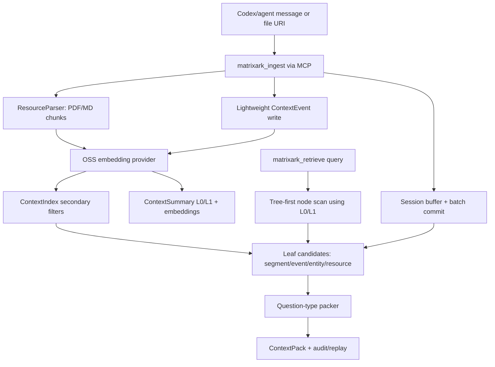

# MatrixArk Message + Resource Debug Trace

This debug run ingests LOCOMO-style multi-turn conversation messages and several PDF/Markdown resources, then retrieves one ContextPack. It is meant for inspecting exactly what MatrixArk writes and reads during ingestion, extraction, chunking, summary generation, embedding storage, tree traversal, secondary-index filtering, packing, audit, and replay.

## Pipeline Diagram



## Re-run

```bash
MATRIXARK_EMBEDDING_PROVIDER=deterministic python3 tools/run_matrixark_message_pdf_debug_trace.py --output-dir docs/debug/matrixark_message_resource_trace
```

## Configuration

- Event log: `/root/src/github-services/TemporalStore/docs/debug/matrixark_codex_cpp_100_message_trace/matrixark_message_resource_debug_trace.jsonl`
- Codex-style messages ingested: `100`
- Resource files ingested: `4`
- Embedding model: `matrixark-local-token-hash-v1`
- Embedding execution mode: `deterministic-token-hash`
- Query: `What is the current Project Aurora GPU approval, owner, budget cap, deadline, and runbook blocker?`
- Summary refresh: background interval `1000` ms, limit `64` dirty nodes per tick
- Node L1 policy: generate when child summaries, >=3 source events, or >=180 estimated source tokens
- Embedding note: This run completed with the local deterministic embedding backend. The local sentence-transformers OSS probe timed out before this trace was generated, so the data-flow artifact is complete but not an OSS-embedding proof.

## Data Model Field Guide

|model|purpose|important_fields|
|---|---|---|
|ContextNode|Filesystem-like topology. Messages/resources attach to a leaf node, parents are used for traversal.|node_hash, parent_hash, node_name, node_path, depth, scope_key|
|ContextEvent|Replayable extracted fact or raw conversational event.|event_id_hash, node_hash, source_ref, summary_text, event_type, entity_type, timestamp|
|ContextSegment|Batch/session topic segment when a logical window is committed.|segment_hash, node_hash, source_event_ids, summary_text, topic, time_range|
|ContextEntity|Evolving state for current preference/status/owner/budget/deadline.|entity_hash, entity_type, entity_name, state, source_ref, valid_from, stale_blockers|
|ResourceManifest|Logical imported file/resource version. Raw bytes stay outside TemporalStore.|resource_hash, raw_uri, resource_type, resource_version, content_hash, scope_key|
|ResourceChunk|Cited serving chunk from PDF/MD/etc.|chunk_hash, raw_uri, source_ref, text, token_estimate, unit_kind, page_number, heading_slug|
|ContextSummary|L0/L1 node/resource summary used for preview and tree traversal.|summary_hash, summary_type, node_hash, summary_text, source_event_ids, source_chunk_hashes|
|ContextEmbedding|Vector stored separately for summaries, chunks, events, entities, and resources.|embedding_type, ref_type, ref_hash, model, dim, vector|
|ContextIndex|TemporalStore-style posting rows for bounded secondary filters before similarity scoring.|data_model, index_name, timestamp_key_ms, ref_type, ref_hashes, node_hash|
|ContextPackAudit|Explains selected/dropped refs, scores, token costs, warnings, and replay path.|context_pack_id, selected_refs, dropped_refs, used_context_tokens, quality_warnings|

## Record Counts

|record_type|count|
|---|---|
|context_batch_commit|5|
|context_child_ref|6|
|context_debug_record|252|
|context_embedding|500|
|context_entity|129|
|context_entity_update_audit|20|
|context_event|213|
|context_extraction_audit|5|
|context_index|226|
|context_node|7|
|context_pack_audit|1|
|context_pack_telemetry|1|
|context_recall_reinforcement|12|
|context_segment|15|
|context_summary|124|
|context_summary_dirty|460|
|context_summary_refresh_audit|7|
|matrixark_audit_log|109|
|matrixark_metric|4|
|resource_chunk|19|
|resource_import_task|12|
|resource_manifest|4|
|resource_registry|4|
|session_buffer_event|104|

## Input Messages

|role|content|
|---|---|
|user|Alice from finance approved the GPU purchase request for Project Aurora after reviewing the Q3 budget.|
|assistant|Recorded: Project Aurora GPU purchase is approved by Alice in finance, pending procurement owner assignment.|
|user|Bob will own procurement, and the budget cap is 42000 dollars for the initial GPU batch.|
|assistant|I will track Bob as procurement owner and the 42000 dollar cap for the initial batch.|
|user|The deadline is July 15, 2026, and the runbook says finance approval must be attached before vendor selection.|
|assistant|The active deadline is July 15, 2026. Vendor selection requires the finance approval attachment.|
|user|Correction: Alice raised the cap to 45000 dollars after the backup GPU quote came in.|
|assistant|Updated: the current Project Aurora GPU budget cap is 45000 dollars.|

## Resources

|raw_uri|title|line_count|
|---|---|---|
|/root/src/github-services/TemporalStore/docs/debug/matrixark_codex_cpp_100_message_trace/fixtures/aurora_gpu_approval...|Project Aurora GPU Approval Packet - multi chunk 1|42|
|/root/src/github-services/TemporalStore/docs/debug/matrixark_codex_cpp_100_message_trace/fixtures/aurora_gpu_runbook.pdf|GPU Procurement Runbook - multi chunk 2|36|
|/root/src/github-services/TemporalStore/docs/debug/matrixark_codex_cpp_100_message_trace/fixtures/aurora_budget_updat...|Budget Update Memo - multi chunk 3|36|
|/root/src/github-services/TemporalStore/docs/debug/matrixark_codex_cpp_100_message_trace/fixtures/aurora_gpu_policy.md|Project Aurora GPU Policy - multi chunk 4|48|

## Resource Import Tasks

|status|raw_uri|resource_type|chunk_count|resource_fact_count|resource_entity_count|metrics|
|---|---|---|---|---|---|---|
|queued|/root/src/github-services/TemporalStore/docs/debug/matrixark_codex_cpp_100_message_trace/fixtures/aurora_gpu_approval...|pdf|||||
|running|/root/src/github-services/TemporalStore/docs/debug/matrixark_codex_cpp_100_message_trace/fixtures/aurora_gpu_approval...|pdf|||||
|completed|/root/src/github-services/TemporalStore/docs/debug/matrixark_codex_cpp_100_message_trace/fixtures/aurora_gpu_approval...|pdf|4|26|26|{"chunk_count": 4, "cloud_bucket": "", "cloud_key": "", "dedupe_count": 0, "duration_ms": 176.558, "embedding_count":...|
|queued|/root/src/github-services/TemporalStore/docs/debug/matrixark_codex_cpp_100_message_trace/fixtures/aurora_gpu_runbook.pdf|pdf|||||
|running|/root/src/github-services/TemporalStore/docs/debug/matrixark_codex_cpp_100_message_trace/fixtures/aurora_gpu_runbook.pdf|pdf|||||
|completed|/root/src/github-services/TemporalStore/docs/debug/matrixark_codex_cpp_100_message_trace/fixtures/aurora_gpu_runbook.pdf|pdf|4|16|16|{"chunk_count": 4, "cloud_bucket": "", "cloud_key": "", "dedupe_count": 0, "duration_ms": 27.125, "embedding_count": ...|
|queued|/root/src/github-services/TemporalStore/docs/debug/matrixark_codex_cpp_100_message_trace/fixtures/aurora_budget_updat...|pdf|||||
|running|/root/src/github-services/TemporalStore/docs/debug/matrixark_codex_cpp_100_message_trace/fixtures/aurora_budget_updat...|pdf|||||
|completed|/root/src/github-services/TemporalStore/docs/debug/matrixark_codex_cpp_100_message_trace/fixtures/aurora_budget_updat...|pdf|4|24|24|{"chunk_count": 4, "cloud_bucket": "", "cloud_key": "", "dedupe_count": 0, "duration_ms": 28.745, "embedding_count": ...|
|queued|/root/src/github-services/TemporalStore/docs/debug/matrixark_codex_cpp_100_message_trace/fixtures/aurora_gpu_policy.md|md|||||
|running|/root/src/github-services/TemporalStore/docs/debug/matrixark_codex_cpp_100_message_trace/fixtures/aurora_gpu_policy.md|md|||||
|completed|/root/src/github-services/TemporalStore/docs/debug/matrixark_codex_cpp_100_message_trace/fixtures/aurora_gpu_policy.md|md|7|43|43|{"chunk_count": 7, "cloud_bucket": "", "cloud_key": "", "dedupe_count": 0, "duration_ms": 31.329, "embedding_count": ...|

## Resource Chunks

|chunk_hash|raw_uri|source_ref|token_estimate|metadata.unit_kind|metadata.content_hash|text|
|---|---|---|---|---|---|---|
|5143435679319321803|/root/src/github-services/TemporalStore/docs/debug/matrixark_codex_cpp_100_message_trace/fixtures/aurora_gpu_approval...|/root/src/github-services/TemporalStore/docs/debug/matrixark_codex_cpp_100_message_trace/fixtures/aurora_gpu_approval...|191|pdf_page|720c7be01019a773|Project Aurora GPU Approval Packet - multi chunk 1 Section 1: Project Aurora GPU Approval Packet detail block 1. Deci...|
|6872583894133858550|/root/src/github-services/TemporalStore/docs/debug/matrixark_codex_cpp_100_message_trace/fixtures/aurora_gpu_approval...|/root/src/github-services/TemporalStore/docs/debug/matrixark_codex_cpp_100_message_trace/fixtures/aurora_gpu_approval...|188|pdf_page|9b882fefbd3645af|GPU purchase after finance review. Owner: Bob owns procurement and vendor coordination. Budget: Current approved cap ...|
|5237604755677213477|/root/src/github-services/TemporalStore/docs/debug/matrixark_codex_cpp_100_message_trace/fixtures/aurora_gpu_approval...|/root/src/github-services/TemporalStore/docs/debug/matrixark_codex_cpp_100_message_trace/fixtures/aurora_gpu_approval...|38|pdf_page|e137969293cbe04e|Purchase order must be ready by July 15, 2026. Risk: Vendor selection is blocked if finance approval is not attached....|
|8031527856535787489|/root/src/github-services/TemporalStore/docs/debug/matrixark_codex_cpp_100_message_trace/fixtures/aurora_gpu_approval...|/root/src/github-services/TemporalStore/docs/debug/matrixark_codex_cpp_100_message_trace/fixtures/aurora_gpu_approval...|74|pdf_page|587ac5e7a512034c|Section 6: Project Aurora GPU Approval Packet detail block 6. Decision: Alice approved the Project Aurora GPU purchas...|
|8354760456098096260|/root/src/github-services/TemporalStore/docs/debug/matrixark_codex_cpp_100_message_trace/fixtures/aurora_gpu_runbook.pdf|/root/src/github-services/TemporalStore/docs/debug/matrixark_codex_cpp_100_message_trace/fixtures/aurora_gpu_runbook....|186|pdf_page|0313c96e940d1622|GPU Procurement Runbook - multi chunk 2 Section 1: GPU Procurement Runbook detail block 1. Procedure: Attach finance ...|
|4650738149976925692|/root/src/github-services/TemporalStore/docs/debug/matrixark_codex_cpp_100_message_trace/fixtures/aurora_gpu_runbook.pdf|/root/src/github-services/TemporalStore/docs/debug/matrixark_codex_cpp_100_message_trace/fixtures/aurora_gpu_runbook....|185|pdf_page|6c56a242498780ef|approval attachment is missing, notify Alice and stop vendor selection. Audit: Store final vendor selection evidence ...|
|1310313782187323993|/root/src/github-services/TemporalStore/docs/debug/matrixark_codex_cpp_100_message_trace/fixtures/aurora_gpu_runbook.pdf|/root/src/github-services/TemporalStore/docs/debug/matrixark_codex_cpp_100_message_trace/fixtures/aurora_gpu_runbook....|52|pdf_page|4c7a07c8892e5757|, and finance approval a Section 6: GPU Procurement Runbook detail block 6. Procedure: Attach finance approval before...|
|2742397807387500168|/root/src/github-services/TemporalStore/docs/debug/matrixark_codex_cpp_100_message_trace/fixtures/aurora_gpu_runbook.pdf|/root/src/github-services/TemporalStore/docs/debug/matrixark_codex_cpp_100_message_trace/fixtures/aurora_gpu_runbook....|18|pdf_page|3ee24c7267185af3|Evidence 6: Project Aurora GPU approval, Bob owner, 45000 dollar cap, July 15 deadline, and finance approval a|
|8314910085049917383|/root/src/github-services/TemporalStore/docs/debug/matrixark_codex_cpp_100_message_trace/fixtures/aurora_budget_updat...|/root/src/github-services/TemporalStore/docs/debug/matrixark_codex_cpp_100_message_trace/fixtures/aurora_budget_updat...|195|pdf_page|de2a9bc06038ef48|Budget Update Memo - multi chunk 3 Section 1: Budget Update Memo detail block 1. Update: The backup GPU quote increas...|
|7704884266283764153|/root/src/github-services/TemporalStore/docs/debug/matrixark_codex_cpp_100_message_trace/fixtures/aurora_budget_updat...|/root/src/github-services/TemporalStore/docs/debug/matrixark_codex_cpp_100_message_trace/fixtures/aurora_budget_updat...|194|pdf_page|2f4ab05269fdd614|the valid active budget cap. Stale blocker: 42000 dollars is historical and should not be used for current-state answ...|
|29286121066499186|/root/src/github-services/TemporalStore/docs/debug/matrixark_codex_cpp_100_message_trace/fixtures/aurora_budget_updat...|/root/src/github-services/TemporalStore/docs/debug/matrixark_codex_cpp_100_message_trace/fixtures/aurora_budget_updat...|64|pdf_page|2544407b632b8feb|owner, 45000 dollar cap, July 15 deadline, and finance approval a Section 6: Budget Update Memo detail block 6. Updat...|
|5026033117958028411|/root/src/github-services/TemporalStore/docs/debug/matrixark_codex_cpp_100_message_trace/fixtures/aurora_budget_updat...|/root/src/github-services/TemporalStore/docs/debug/matrixark_codex_cpp_100_message_trace/fixtures/aurora_budget_updat...|18|pdf_page|3ee24c7267185af3|Evidence 6: Project Aurora GPU approval, Bob owner, 45000 dollar cap, July 15 deadline, and finance approval a|
|6543511345469216670|/root/src/github-services/TemporalStore/docs/debug/matrixark_codex_cpp_100_message_trace/fixtures/aurora_gpu_policy.md|/root/src/github-services/TemporalStore/docs/debug/matrixark_codex_cpp_100_message_trace/fixtures/aurora_gpu_policy.m...|9|markdown_section|b9cbfa5a70ed458c|Section 1: Project Aurora GPU Policy detail block 1.|
|7694896107608677350|/root/src/github-services/TemporalStore/docs/debug/matrixark_codex_cpp_100_message_trace/fixtures/aurora_gpu_policy.md|/root/src/github-services/TemporalStore/docs/debug/matrixark_codex_cpp_100_message_trace/fixtures/aurora_gpu_policy.m...|75|markdown_section|ffa1126859240b15|# Project Aurora GPU Policy Decision: Alice from finance approved the GPU purchase. Owner: Bob owns procurement and v...|
|921618713462230419|/root/src/github-services/TemporalStore/docs/debug/matrixark_codex_cpp_100_message_trace/fixtures/aurora_gpu_policy.md|/root/src/github-services/TemporalStore/docs/debug/matrixark_codex_cpp_100_message_trace/fixtures/aurora_gpu_policy.m...|75|markdown_section|3376f299c02dced7|# Project Aurora GPU Policy Decision: Alice from finance approved the GPU purchase. Owner: Bob owns procurement and v...|
|3862165818935540443|/root/src/github-services/TemporalStore/docs/debug/matrixark_codex_cpp_100_message_trace/fixtures/aurora_gpu_policy.md|/root/src/github-services/TemporalStore/docs/debug/matrixark_codex_cpp_100_message_trace/fixtures/aurora_gpu_policy.m...|75|markdown_section|6238425a99b103ca|# Project Aurora GPU Policy Decision: Alice from finance approved the GPU purchase. Owner: Bob owns procurement and v...|
|795233073302226884|/root/src/github-services/TemporalStore/docs/debug/matrixark_codex_cpp_100_message_trace/fixtures/aurora_gpu_policy.md|/root/src/github-services/TemporalStore/docs/debug/matrixark_codex_cpp_100_message_trace/fixtures/aurora_gpu_policy.m...|75|markdown_section|8bf2610c47eef6f2|# Project Aurora GPU Policy Decision: Alice from finance approved the GPU purchase. Owner: Bob owns procurement and v...|
|516237874045139596|/root/src/github-services/TemporalStore/docs/debug/matrixark_codex_cpp_100_message_trace/fixtures/aurora_gpu_policy.md|/root/src/github-services/TemporalStore/docs/debug/matrixark_codex_cpp_100_message_trace/fixtures/aurora_gpu_policy.m...|75|markdown_section|bd0b751a20f298b2|# Project Aurora GPU Policy Decision: Alice from finance approved the GPU purchase. Owner: Bob owns procurement and v...|
|1553121110785005829|/root/src/github-services/TemporalStore/docs/debug/matrixark_codex_cpp_100_message_trace/fixtures/aurora_gpu_policy.md|/root/src/github-services/TemporalStore/docs/debug/matrixark_codex_cpp_100_message_trace/fixtures/aurora_gpu_policy.m...|66|markdown_section|d1360fe30484a5bc|# Project Aurora GPU Policy Decision: Alice from finance approved the GPU purchase. Owner: Bob owns procurement and v...|

## Raw Conversation Events

|event_id_hash|context_event_key|classification|text|
|---|---|---|---|
|1121810234980183195|00000001782681920521:1121810234980183195|NEW_EVENT|user: Codex note [codex_hook_seq=001]: Alice from finance approved Project Aurora GPU procurement after Q3 budget rev...|
|1384573524671901516|00000001782681920523:1384573524671901516|NEW_EVENT|assistant: Codex assistant recorded [codex_hook_seq=002]: Bob owns procurement and vendor coordination for the Projec...|
|2125257195547140497|00000001782681920525:2125257195547140497|NEW_EVENT|user: Codex note [codex_hook_seq=003]: The active GPU budget cap is 45000 dollars after Alice approved the backup quote.|
|8512827713007962156|00000001782681920526:8512827713007962156|NEW_EVENT|assistant: Codex assistant recorded [codex_hook_seq=004]: The purchase order deadline is July 15, 2026.|
|736996325255486280|00000001782681920527:736996325255486280|NEW_EVENT|user: Codex note [codex_hook_seq=005]: Finance approval must be attached before vendor selection can proceed.|
|6394789393248722792|00000001782681920528:6394789393248722792|NEW_EVENT|assistant: Codex assistant recorded [codex_hook_seq=006]: The backup GPU quote should be compared against the primary...|
|1995848203220421216|00000001782681920530:1995848203220421216|NEW_EVENT|user: Codex note [codex_hook_seq=007]: If the approval attachment is missing, vendor selection must stop and Alice sh...|
|1343533381812067114|00000001782681920531:1343533381812067114|NEW_EVENT|assistant: Codex assistant recorded [codex_hook_seq=008]: The final vendor selection evidence must be stored with the...|
|5316910161454516146|00000001782681920532:5316910161454516146|NEW_EVENT|user: Codex note [codex_hook_seq=009]: The historical 42000 dollar cap is stale and must not be used for current-stat...|
|2629337939645338401|00000001782681920533:2629337939645338401|NEW_EVENT|assistant: Codex assistant recorded [codex_hook_seq=010]: The current answer should cite the resource packet or polic...|
|4182010324689526341|00000001782681920534:4182010324689526341|NEW_EVENT|user: Codex note [codex_hook_seq=011]: Alice from finance approved Project Aurora GPU procurement after Q3 budget rev...|
|7753273453629739034|00000001782681920536:7753273453629739034|NEW_EVENT|assistant: Codex assistant recorded [codex_hook_seq=012]: Bob owns procurement and vendor coordination for the Projec...|
|2215542785582467353|00000001782681920537:2215542785582467353|NEW_EVENT|user: Codex note [codex_hook_seq=013]: The active GPU budget cap is 45000 dollars after Alice approved the backup quote.|
|3960792337890032688|00000001782681920539:3960792337890032688|NEW_EVENT|assistant: Codex assistant recorded [codex_hook_seq=014]: The purchase order deadline is July 15, 2026.|
|1601441791255151397|00000001782681920541:1601441791255151397|NEW_EVENT|user: Codex note [codex_hook_seq=015]: Finance approval must be attached before vendor selection can proceed.|
|691279825868727816|00000001782681920542:691279825868727816|NEW_EVENT|assistant: Codex assistant recorded [codex_hook_seq=016]: The backup GPU quote should be compared against the primary...|
|3690486307937747296|00000001782681920544:3690486307937747296|NEW_EVENT|user: Codex note [codex_hook_seq=017]: If the approval attachment is missing, vendor selection must stop and Alice sh...|
|1993299817286887671|00000001782681920545:1993299817286887671|NEW_EVENT|assistant: Codex assistant recorded [codex_hook_seq=018]: The final vendor selection evidence must be stored with the...|
|5177347416272040204|00000001782681920547:5177347416272040204|NEW_EVENT|user: Codex note [codex_hook_seq=019]: The historical 42000 dollar cap is stale and must not be used for current-stat...|
|3224773610031651737|00000001782681920548:3224773610031651737|NEW_EVENT|assistant: Codex assistant recorded [codex_hook_seq=020]: The current answer should cite the resource packet or polic...|
|769317556220187861|00000001782681920564:769317556220187861|NEW_EVENT|user: Codex note [codex_hook_seq=021]: Alice from finance approved Project Aurora GPU procurement after Q3 budget rev...|
|987919680367910392|00000001782681920565:987919680367910392|NEW_EVENT|assistant: Codex assistant recorded [codex_hook_seq=022]: Bob owns procurement and vendor coordination for the Projec...|
|7272373012320168208|00000001782681920567:7272373012320168208|NEW_EVENT|user: Codex note [codex_hook_seq=023]: The active GPU budget cap is 45000 dollars after Alice approved the backup quote.|
|7864693227795528513|00000001782681920568:7864693227795528513|NEW_EVENT|assistant: Codex assistant recorded [codex_hook_seq=024]: The purchase order deadline is July 15, 2026.|
|1320113073147082769|00000001782681920570:1320113073147082769|NEW_EVENT|user: Codex note [codex_hook_seq=025]: Finance approval must be attached before vendor selection can proceed.|
|2703119878537667310|00000001782681920571:2703119878537667310|NEW_EVENT|assistant: Codex assistant recorded [codex_hook_seq=026]: The backup GPU quote should be compared against the primary...|
|1382733094019052631|00000001782681920573:1382733094019052631|NEW_EVENT|user: Codex note [codex_hook_seq=027]: If the approval attachment is missing, vendor selection must stop and Alice sh...|
|3671371123605513501|00000001782681920575:3671371123605513501|NEW_EVENT|assistant: Codex assistant recorded [codex_hook_seq=028]: The final vendor selection evidence must be stored with the...|
|4758286618279064588|00000001782681920576:4758286618279064588|NEW_EVENT|user: Codex note [codex_hook_seq=029]: The historical 42000 dollar cap is stale and must not be used for current-stat...|
|6686346130526053865|00000001782681920578:6686346130526053865|NEW_EVENT|assistant: Codex assistant recorded [codex_hook_seq=030]: The current answer should cite the resource packet or polic...|
|3873856530882120025|00000001782681920580:3873856530882120025|NEW_EVENT|user: Codex note [codex_hook_seq=031]: Alice from finance approved Project Aurora GPU procurement after Q3 budget rev...|
|4213253239706993855|00000001782681920581:4213253239706993855|NEW_EVENT|assistant: Codex assistant recorded [codex_hook_seq=032]: Bob owns procurement and vendor coordination for the Projec...|
|3821171007867588277|00000001782681920583:3821171007867588277|NEW_EVENT|user: Codex note [codex_hook_seq=033]: The active GPU budget cap is 45000 dollars after Alice approved the backup quote.|
|2390182890109937851|00000001782681920584:2390182890109937851|NEW_EVENT|assistant: Codex assistant recorded [codex_hook_seq=034]: The purchase order deadline is July 15, 2026.|
|959101260182171883|00000001782681920586:959101260182171883|NEW_EVENT|user: Codex note [codex_hook_seq=035]: Finance approval must be attached before vendor selection can proceed.|
|539081534477256118|00000001782681920588:539081534477256118|NEW_EVENT|assistant: Codex assistant recorded [codex_hook_seq=036]: The backup GPU quote should be compared against the primary...|
|2096663171175363304|00000001782681920589:2096663171175363304|NEW_EVENT|user: Codex note [codex_hook_seq=037]: If the approval attachment is missing, vendor selection must stop and Alice sh...|
|8624649714799588264|00000001782681920591:8624649714799588264|NEW_EVENT|assistant: Codex assistant recorded [codex_hook_seq=038]: The final vendor selection evidence must be stored with the...|
|5311313260235019932|00000001782681920593:5311313260235019932|NEW_EVENT|user: Codex note [codex_hook_seq=039]: The historical 42000 dollar cap is stale and must not be used for current-stat...|
|975793942100448592|00000001782681920594:975793942100448592|NEW_EVENT|assistant: Codex assistant recorded [codex_hook_seq=040]: The current answer should cite the resource packet or polic...|
|3912689383883020238|00000001782681920602:3912689383883020238|NEW_EVENT|user: Codex note [codex_hook_seq=041]: Alice from finance approved Project Aurora GPU procurement after Q3 budget rev...|
|5233132831181351657|00000001782681920603:5233132831181351657|NEW_EVENT|assistant: Codex assistant recorded [codex_hook_seq=042]: Bob owns procurement and vendor coordination for the Projec...|
|766990075220479623|00000001782681920604:766990075220479623|NEW_EVENT|user: Codex note [codex_hook_seq=043]: The active GPU budget cap is 45000 dollars after Alice approved the backup quote.|
|7409297551716440432|00000001782681920606:7409297551716440432|NEW_EVENT|assistant: Codex assistant recorded [codex_hook_seq=044]: The purchase order deadline is July 15, 2026.|
|6958441019883182430|00000001782681920607:6958441019883182430|NEW_EVENT|user: Codex note [codex_hook_seq=045]: Finance approval must be attached before vendor selection can proceed.|
|928090336919157135|00000001782681920608:928090336919157135|NEW_EVENT|assistant: Codex assistant recorded [codex_hook_seq=046]: The backup GPU quote should be compared against the primary...|
|3612554183180512024|00000001782681920610:3612554183180512024|NEW_EVENT|user: Codex note [codex_hook_seq=047]: If the approval attachment is missing, vendor selection must stop and Alice sh...|
|6042336170927986644|00000001782681920611:6042336170927986644|NEW_EVENT|assistant: Codex assistant recorded [codex_hook_seq=048]: The final vendor selection evidence must be stored with the...|
|387991089654584952|00000001782681920613:387991089654584952|NEW_EVENT|user: Codex note [codex_hook_seq=049]: The historical 42000 dollar cap is stale and must not be used for current-stat...|
|993945093010942302|00000001782681920614:993945093010942302|NEW_EVENT|assistant: Codex assistant recorded [codex_hook_seq=050]: The current answer should cite the resource packet or polic...|
|7430819991513505422|00000001782681920616:7430819991513505422|NEW_EVENT|user: Codex note [codex_hook_seq=051]: Alice from finance approved Project Aurora GPU procurement after Q3 budget rev...|
|3355268372818492227|00000001782681920617:3355268372818492227|NEW_EVENT|assistant: Codex assistant recorded [codex_hook_seq=052]: Bob owns procurement and vendor coordination for the Projec...|
|6503390361232636017|00000001782681920618:6503390361232636017|NEW_EVENT|user: Codex note [codex_hook_seq=053]: The active GPU budget cap is 45000 dollars after Alice approved the backup quote.|
|6870439554938733489|00000001782681920620:6870439554938733489|NEW_EVENT|assistant: Codex assistant recorded [codex_hook_seq=054]: The purchase order deadline is July 15, 2026.|
|7622831624686840266|00000001782681920621:7622831624686840266|NEW_EVENT|user: Codex note [codex_hook_seq=055]: Finance approval must be attached before vendor selection can proceed.|
|3385908427180263691|00000001782681920623:3385908427180263691|NEW_EVENT|assistant: Codex assistant recorded [codex_hook_seq=056]: The backup GPU quote should be compared against the primary...|
|8552251570315431835|00000001782681920624:8552251570315431835|NEW_EVENT|user: Codex note [codex_hook_seq=057]: If the approval attachment is missing, vendor selection must stop and Alice sh...|
|4079699747883885114|00000001782681920626:4079699747883885114|NEW_EVENT|assistant: Codex assistant recorded [codex_hook_seq=058]: The final vendor selection evidence must be stored with the...|
|4014653402930357748|00000001782681920627:4014653402930357748|NEW_EVENT|user: Codex note [codex_hook_seq=059]: The historical 42000 dollar cap is stale and must not be used for current-stat...|
|8111030154661662478|00000001782681920629:8111030154661662478|NEW_EVENT|assistant: Codex assistant recorded [codex_hook_seq=060]: The current answer should cite the resource packet or polic...|
|9013994348276437258|00000001782681920638:9013994348276437258|NEW_EVENT|user: Codex note [codex_hook_seq=061]: Alice from finance approved Project Aurora GPU procurement after Q3 budget rev...|
|4963075214334612105|00000001782681920640:4963075214334612105|NEW_EVENT|assistant: Codex assistant recorded [codex_hook_seq=062]: Bob owns procurement and vendor coordination for the Projec...|
|67921966867359129|00000001782681920642:67921966867359129|NEW_EVENT|user: Codex note [codex_hook_seq=063]: The active GPU budget cap is 45000 dollars after Alice approved the backup quote.|
|3250876378693100392|00000001782681920644:3250876378693100392|NEW_EVENT|assistant: Codex assistant recorded [codex_hook_seq=064]: The purchase order deadline is July 15, 2026.|
|7699044994294103774|00000001782681920647:7699044994294103774|NEW_EVENT|user: Codex note [codex_hook_seq=065]: Finance approval must be attached before vendor selection can proceed.|
|8274477151040548972|00000001782681920649:8274477151040548972|NEW_EVENT|assistant: Codex assistant recorded [codex_hook_seq=066]: The backup GPU quote should be compared against the primary...|
|2094407280755838399|00000001782681920650:2094407280755838399|NEW_EVENT|user: Codex note [codex_hook_seq=067]: If the approval attachment is missing, vendor selection must stop and Alice sh...|
|7952531790563059355|00000001782681920652:7952531790563059355|NEW_EVENT|assistant: Codex assistant recorded [codex_hook_seq=068]: The final vendor selection evidence must be stored with the...|
|7046077683447546841|00000001782681920653:7046077683447546841|NEW_EVENT|user: Codex note [codex_hook_seq=069]: The historical 42000 dollar cap is stale and must not be used for current-stat...|
|6701691241228183114|00000001782681920655:6701691241228183114|NEW_EVENT|assistant: Codex assistant recorded [codex_hook_seq=070]: The current answer should cite the resource packet or polic...|
|2828852376598157834|00000001782681920657:2828852376598157834|NEW_EVENT|user: Codex note [codex_hook_seq=071]: Alice from finance approved Project Aurora GPU procurement after Q3 budget rev...|
|6502183554064264418|00000001782681920659:6502183554064264418|NEW_EVENT|assistant: Codex assistant recorded [codex_hook_seq=072]: Bob owns procurement and vendor coordination for the Projec...|
|9170116452794795405|00000001782681920660:9170116452794795405|NEW_EVENT|user: Codex note [codex_hook_seq=073]: The active GPU budget cap is 45000 dollars after Alice approved the backup quote.|
|3106178237784506738|00000001782681920662:3106178237784506738|NEW_EVENT|assistant: Codex assistant recorded [codex_hook_seq=074]: The purchase order deadline is July 15, 2026.|
|7391948052093459673|00000001782681920664:7391948052093459673|NEW_EVENT|user: Codex note [codex_hook_seq=075]: Finance approval must be attached before vendor selection can proceed.|
|3933263387435229660|00000001782681920666:3933263387435229660|NEW_EVENT|assistant: Codex assistant recorded [codex_hook_seq=076]: The backup GPU quote should be compared against the primary...|
|8818356732024726398|00000001782681920668:8818356732024726398|NEW_EVENT|user: Codex note [codex_hook_seq=077]: If the approval attachment is missing, vendor selection must stop and Alice sh...|
|7878056893307111590|00000001782681920670:7878056893307111590|NEW_EVENT|assistant: Codex assistant recorded [codex_hook_seq=078]: The final vendor selection evidence must be stored with the...|
|3784189030850577715|00000001782681920672:3784189030850577715|NEW_EVENT|user: Codex note [codex_hook_seq=079]: The historical 42000 dollar cap is stale and must not be used for current-stat...|
|5853939330110130067|00000001782681920674:5853939330110130067|NEW_EVENT|assistant: Codex assistant recorded [codex_hook_seq=080]: The current answer should cite the resource packet or polic...|
|4020537525603672647|00000001782681920684:4020537525603672647|NEW_EVENT|user: Codex note [codex_hook_seq=081]: Alice from finance approved Project Aurora GPU procurement after Q3 budget rev...|
|9118681829357842652|00000001782681920686:9118681829357842652|NEW_EVENT|assistant: Codex assistant recorded [codex_hook_seq=082]: Bob owns procurement and vendor coordination for the Projec...|
|4079999714897977602|00000001782681920688:4079999714897977602|NEW_EVENT|user: Codex note [codex_hook_seq=083]: The active GPU budget cap is 45000 dollars after Alice approved the backup quote.|
|2571693801001934492|00000001782681920690:2571693801001934492|NEW_EVENT|assistant: Codex assistant recorded [codex_hook_seq=084]: The purchase order deadline is July 15, 2026.|
|1947160733608471570|00000001782681920692:1947160733608471570|NEW_EVENT|user: Codex note [codex_hook_seq=085]: Finance approval must be attached before vendor selection can proceed.|
|8543666761992791693|00000001782681920695:8543666761992791693|NEW_EVENT|assistant: Codex assistant recorded [codex_hook_seq=086]: The backup GPU quote should be compared against the primary...|
|8146886476058085410|00000001782681920697:8146886476058085410|NEW_EVENT|user: Codex note [codex_hook_seq=087]: If the approval attachment is missing, vendor selection must stop and Alice sh...|
|6825579169530952581|00000001782681920700:6825579169530952581|NEW_EVENT|assistant: Codex assistant recorded [codex_hook_seq=088]: The final vendor selection evidence must be stored with the...|
|9126224234407846696|00000001782681920703:9126224234407846696|NEW_EVENT|user: Codex note [codex_hook_seq=089]: The historical 42000 dollar cap is stale and must not be used for current-stat...|
|6936691682826446701|00000001782681920706:6936691682826446701|NEW_EVENT|assistant: Codex assistant recorded [codex_hook_seq=090]: The current answer should cite the resource packet or polic...|
|9051838721914678046|00000001782681920709:9051838721914678046|NEW_EVENT|user: Codex note [codex_hook_seq=091]: Alice from finance approved Project Aurora GPU procurement after Q3 budget rev...|
|5073111600920262960|00000001782681920712:5073111600920262960|NEW_EVENT|assistant: Codex assistant recorded [codex_hook_seq=092]: Bob owns procurement and vendor coordination for the Projec...|
|8676578092219901072|00000001782681920715:8676578092219901072|NEW_EVENT|user: Codex note [codex_hook_seq=093]: The active GPU budget cap is 45000 dollars after Alice approved the backup quote.|
|8202558118080443318|00000001782681920718:8202558118080443318|NEW_EVENT|assistant: Codex assistant recorded [codex_hook_seq=094]: The purchase order deadline is July 15, 2026.|
|7304189941612958581|00000001782681920721:7304189941612958581|NEW_EVENT|user: Codex note [codex_hook_seq=095]: Finance approval must be attached before vendor selection can proceed.|
|1819481038024103820|00000001782681920724:1819481038024103820|NEW_EVENT|assistant: Codex assistant recorded [codex_hook_seq=096]: The backup GPU quote should be compared against the primary...|
|6150203257087425281|00000001782681920728:6150203257087425281|NEW_EVENT|user: Codex note [codex_hook_seq=097]: If the approval attachment is missing, vendor selection must stop and Alice sh...|
|7536050020712117199|00000001782681920730:7536050020712117199|NEW_EVENT|assistant: Codex assistant recorded [codex_hook_seq=098]: The final vendor selection evidence must be stored with the...|
|2972817998733111597|00000001782681920732:2972817998733111597|NEW_EVENT|user: Codex note [codex_hook_seq=099]: The historical 42000 dollar cap is stale and must not be used for current-stat...|
|1598561979359791011|00000001782681920735:1598561979359791011|NEW_EVENT|assistant: Codex assistant recorded [codex_hook_seq=100]: The current answer should cite the resource packet or polic...|
|1833084272961788261|00000001782681920850:1833084272961788261|NEW_EVENT|tool: Import PDF resource for MatrixArk parsing: Project Aurora GPU Approval Packet - multi chunk 1|
|7300398913944833305|00000001782681921034:7300398913944833305|NEW_EVENT|tool: Import PDF resource for MatrixArk parsing: GPU Procurement Runbook - multi chunk 2|
|3838744270326157592|00000001782681921067:3838744270326157592|NEW_EVENT|tool: Import PDF resource for MatrixArk parsing: Budget Update Memo - multi chunk 3|
|6373894433077940511|00000001782681921099:6373894433077940511|NEW_EVENT|tool: Import Markdown resource for MatrixArk parsing: Project Aurora GPU Policy - multi chunk 4|

## Extracted Resource/Fact Events

|event_type|summary_text|source_ref|event_id_hash|context_event_key|
|---|---|---|---|---|
|resource_decision|resource_decision: Alice approved the Project Aurora GPU purchase after finance review|/root/src/github-services/TemporalStore/docs/debug/matrixark_codex_cpp_100_message_trace/fixtures/aurora_gpu_approval...|2814639569621191002|00000001782681920850:2814639569621191002|
|resource_owner|resource_owner: Bob owns procurement and vendor coordination|/root/src/github-services/TemporalStore/docs/debug/matrixark_codex_cpp_100_message_trace/fixtures/aurora_gpu_approval...|8093490486343135255|00000001782681920850:8093490486343135255|
|resource_cost|resource_cost: Current approved cap is 45000 dollars|/root/src/github-services/TemporalStore/docs/debug/matrixark_codex_cpp_100_message_trace/fixtures/aurora_gpu_approval...|7078627629398384987|00000001782681920850:7078627629398384987|
|resource_deadline|resource_deadline: Purchase order must be ready by July 15, 2026|/root/src/github-services/TemporalStore/docs/debug/matrixark_codex_cpp_100_message_trace/fixtures/aurora_gpu_approval...|2045323547845180270|00000001782681920850:2045323547845180270|
|resource_policy|resource_policy: be ready by July 15, 2026|/root/src/github-services/TemporalStore/docs/debug/matrixark_codex_cpp_100_message_trace/fixtures/aurora_gpu_approval...|314110043892721515|00000001782681920850:314110043892721515|
|resource_approval|resource_approval: Packet - multi chunk 1|/root/src/github-services/TemporalStore/docs/debug/matrixark_codex_cpp_100_message_trace/fixtures/aurora_gpu_approval...|7200630374136919037|00000001782681920850:7200630374136919037|
|resource_risk|resource_risk: Vendor selection is blocked if finance approval is not attached|/root/src/github-services/TemporalStore/docs/debug/matrixark_codex_cpp_100_message_trace/fixtures/aurora_gpu_approval...|5554917391742341548|00000001782681920850:5554917391742341548|
|resource_decision|resource_decision: Alice approved the Project Aurora GPU purchase after finance review|/root/src/github-services/TemporalStore/docs/debug/matrixark_codex_cpp_100_message_trace/fixtures/aurora_gpu_approval...|2566531353499944865|00000001782681920850:2566531353499944865|
|resource_owner|resource_owner: Bob owns procurement and vendor coordination|/root/src/github-services/TemporalStore/docs/debug/matrixark_codex_cpp_100_message_trace/fixtures/aurora_gpu_approval...|3233295453026438937|00000001782681920850:3233295453026438937|
|resource_cost|resource_cost: Current approved cap is 45000 dollars|/root/src/github-services/TemporalStore/docs/debug/matrixark_codex_cpp_100_message_trace/fixtures/aurora_gpu_approval...|3540387257665525722|00000001782681920850:3540387257665525722|
|resource_deadline|resource_deadline: Purchase order must be ready by July 15, 2026|/root/src/github-services/TemporalStore/docs/debug/matrixark_codex_cpp_100_message_trace/fixtures/aurora_gpu_approval...|6149059245314982581|00000001782681920850:6149059245314982581|
|resource_policy|resource_policy: be ready by July 15, 2026|/root/src/github-services/TemporalStore/docs/debug/matrixark_codex_cpp_100_message_trace/fixtures/aurora_gpu_approval...|4382722527767353837|00000001782681920850:4382722527767353837|
|resource_approval|resource_approval: cap is 45000 dollars|/root/src/github-services/TemporalStore/docs/debug/matrixark_codex_cpp_100_message_trace/fixtures/aurora_gpu_approval...|1710274622395829140|00000001782681920850:1710274622395829140|
|resource_risk|resource_risk: Vendor selection is blocked if finance approval is not attached|/root/src/github-services/TemporalStore/docs/debug/matrixark_codex_cpp_100_message_trace/fixtures/aurora_gpu_approval...|3146565759215911131|00000001782681920850:3146565759215911131|
|resource_owner|resource_owner: , 45000 dollar cap, July 15 deadline, and finance approval a|/root/src/github-services/TemporalStore/docs/debug/matrixark_codex_cpp_100_message_trace/fixtures/aurora_gpu_approval...|4118072204837241404|00000001782681920850:4118072204837241404|
|resource_deadline|resource_deadline: , and finance approval a|/root/src/github-services/TemporalStore/docs/debug/matrixark_codex_cpp_100_message_trace/fixtures/aurora_gpu_approval...|8827033051386062802|00000001782681920850:8827033051386062802|
|resource_policy|resource_policy: be ready by July 15, 2026|/root/src/github-services/TemporalStore/docs/debug/matrixark_codex_cpp_100_message_trace/fixtures/aurora_gpu_approval...|206602665793224746|00000001782681920850:206602665793224746|
|resource_approval|resource_approval: not attached|/root/src/github-services/TemporalStore/docs/debug/matrixark_codex_cpp_100_message_trace/fixtures/aurora_gpu_approval...|2568563569038629871|00000001782681920850:2568563569038629871|
|resource_risk|resource_risk: Vendor selection is blocked if finance approval is not attached|/root/src/github-services/TemporalStore/docs/debug/matrixark_codex_cpp_100_message_trace/fixtures/aurora_gpu_approval...|4762075368764168130|00000001782681920850:4762075368764168130|
|resource_decision|resource_decision: Alice approved the Project Aurora GPU purchase after finance review|/root/src/github-services/TemporalStore/docs/debug/matrixark_codex_cpp_100_message_trace/fixtures/aurora_gpu_approval...|8540515644323542757|00000001782681920850:8540515644323542757|
|resource_owner|resource_owner: Bob owns procurement and vendor coordination|/root/src/github-services/TemporalStore/docs/debug/matrixark_codex_cpp_100_message_trace/fixtures/aurora_gpu_approval...|7016612531089838693|00000001782681920850:7016612531089838693|
|resource_cost|resource_cost: Current approved cap is 45000 dollars|/root/src/github-services/TemporalStore/docs/debug/matrixark_codex_cpp_100_message_trace/fixtures/aurora_gpu_approval...|5139073409059563404|00000001782681920850:5139073409059563404|
|resource_deadline|resource_deadline: Purchase order must be ready by July 15, 2026|/root/src/github-services/TemporalStore/docs/debug/matrixark_codex_cpp_100_message_trace/fixtures/aurora_gpu_approval...|2950163196563807362|00000001782681920850:2950163196563807362|
|resource_policy|resource_policy: be ready by July 15, 2026|/root/src/github-services/TemporalStore/docs/debug/matrixark_codex_cpp_100_message_trace/fixtures/aurora_gpu_approval...|4646616100395779376|00000001782681920850:4646616100395779376|
|resource_approval|resource_approval: Packet detail block 6|/root/src/github-services/TemporalStore/docs/debug/matrixark_codex_cpp_100_message_trace/fixtures/aurora_gpu_approval...|3197979993891397574|00000001782681920850:3197979993891397574|
|resource_risk|resource_risk: Vendor selection is blocked if finance approval is not attached|/root/src/github-services/TemporalStore/docs/debug/matrixark_codex_cpp_100_message_trace/fixtures/aurora_gpu_approval...|7922076534779776167|00000001782681920850:7922076534779776167|
|resource_owner|resource_owner: , 45000 dollar cap, July 15 deadline, and finance approval a|/root/src/github-services/TemporalStore/docs/debug/matrixark_codex_cpp_100_message_trace/fixtures/aurora_gpu_runbook....|6796290632889682251|00000001782681921034:6796290632889682251|
|resource_deadline|resource_deadline: , and finance approval a|/root/src/github-services/TemporalStore/docs/debug/matrixark_codex_cpp_100_message_trace/fixtures/aurora_gpu_runbook....|2845871295825386061|00000001782681921034:2845871295825386061|
|resource_troubleshooting_step|resource_troubleshooting_step: multi chunk 2|/root/src/github-services/TemporalStore/docs/debug/matrixark_codex_cpp_100_message_trace/fixtures/aurora_gpu_runbook....|4776551462156951365|00000001782681921034:4776551462156951365|
|resource_approval|resource_approval: before vendor selection|/root/src/github-services/TemporalStore/docs/debug/matrixark_codex_cpp_100_message_trace/fixtures/aurora_gpu_runbook....|4132930023480900533|00000001782681921034:4132930023480900533|
|resource_procedure|resource_procedure: Attach finance approval before vendor selection|/root/src/github-services/TemporalStore/docs/debug/matrixark_codex_cpp_100_message_trace/fixtures/aurora_gpu_runbook....|2182511285403984509|00000001782681921034:2182511285403984509|
|resource_owner|resource_owner: , 45000 dollar cap, July 15 deadline, and finance approval a|/root/src/github-services/TemporalStore/docs/debug/matrixark_codex_cpp_100_message_trace/fixtures/aurora_gpu_runbook....|4846497637973056586|00000001782681921034:4846497637973056586|
|resource_deadline|resource_deadline: , and finance approval a|/root/src/github-services/TemporalStore/docs/debug/matrixark_codex_cpp_100_message_trace/fixtures/aurora_gpu_runbook....|2130403652928011520|00000001782681921034:2130403652928011520|
|resource_troubleshooting_step|resource_troubleshooting_step: detail block 4|/root/src/github-services/TemporalStore/docs/debug/matrixark_codex_cpp_100_message_trace/fixtures/aurora_gpu_runbook....|2858434688893241882|00000001782681921034:2858434688893241882|
|resource_approval|resource_approval: attachment is missing, notify Alice and stop vendor selection|/root/src/github-services/TemporalStore/docs/debug/matrixark_codex_cpp_100_message_trace/fixtures/aurora_gpu_runbook....|3618279737053586295|00000001782681921034:3618279737053586295|
|resource_procedure|resource_procedure: Attach finance approval before vendor selection|/root/src/github-services/TemporalStore/docs/debug/matrixark_codex_cpp_100_message_trace/fixtures/aurora_gpu_runbook....|4412789511244780161|00000001782681921034:4412789511244780161|
|resource_troubleshooting_step|resource_troubleshooting_step: detail block 6|/root/src/github-services/TemporalStore/docs/debug/matrixark_codex_cpp_100_message_trace/fixtures/aurora_gpu_runbook....|3062353187132071368|00000001782681921034:3062353187132071368|
|resource_approval|resource_approval: a|/root/src/github-services/TemporalStore/docs/debug/matrixark_codex_cpp_100_message_trace/fixtures/aurora_gpu_runbook....|2724204197346262294|00000001782681921034:2724204197346262294|
|resource_procedure|resource_procedure: Attach finance approval before vendor selection|/root/src/github-services/TemporalStore/docs/debug/matrixark_codex_cpp_100_message_trace/fixtures/aurora_gpu_runbook....|564723159686459405|00000001782681921034:564723159686459405|
|resource_owner|resource_owner: , 45000 dollar cap, July 15 deadline, and finance approval a|/root/src/github-services/TemporalStore/docs/debug/matrixark_codex_cpp_100_message_trace/fixtures/aurora_gpu_runbook....|2855686217718765799|00000001782681921034:2855686217718765799|
|resource_deadline|resource_deadline: , and finance approval a|/root/src/github-services/TemporalStore/docs/debug/matrixark_codex_cpp_100_message_trace/fixtures/aurora_gpu_runbook....|742090730955711414|00000001782681921034:742090730955711414|
|resource_approval|resource_approval: , Bob owner, 45000 dollar cap, July 15 deadline, and finance approval a|/root/src/github-services/TemporalStore/docs/debug/matrixark_codex_cpp_100_message_trace/fixtures/aurora_gpu_runbook....|8284672767568596211|00000001782681921034:8284672767568596211|
|resource_owner|resource_owner: , 45000 dollar cap, July 15 deadline, and finance approval a|/root/src/github-services/TemporalStore/docs/debug/matrixark_codex_cpp_100_message_trace/fixtures/aurora_budget_updat...|4608334566194645044|00000001782681921067:4608334566194645044|
|resource_cost|resource_cost: Update Memo - multi chunk 3|/root/src/github-services/TemporalStore/docs/debug/matrixark_codex_cpp_100_message_trace/fixtures/aurora_budget_updat...|2976963940753551112|00000001782681921067:2976963940753551112|
|resource_deadline|resource_deadline: , and finance approval a|/root/src/github-services/TemporalStore/docs/debug/matrixark_codex_cpp_100_message_trace/fixtures/aurora_budget_updat...|6910919359203530208|00000001782681921067:6910919359203530208|
|resource_policy|resource_policy: not be used for current-state answers|/root/src/github-services/TemporalStore/docs/debug/matrixark_codex_cpp_100_message_trace/fixtures/aurora_budget_updat...|6413795762517647296|00000001782681921067:6413795762517647296|
|resource_approval|resource_approval: r: Alice confirmed the updated cap|/root/src/github-services/TemporalStore/docs/debug/matrixark_codex_cpp_100_message_trace/fixtures/aurora_budget_updat...|1440978724657461876|00000001782681921067:1440978724657461876|
|resource_risk|resource_risk: 42000 dollars is historical and should not be used for current-state answers|/root/src/github-services/TemporalStore/docs/debug/matrixark_codex_cpp_100_message_trace/fixtures/aurora_budget_updat...|1479729521614162540|00000001782681921067:1479729521614162540|
|resource_procedure|resource_procedure: ed the updated cap|/root/src/github-services/TemporalStore/docs/debug/matrixark_codex_cpp_100_message_trace/fixtures/aurora_budget_updat...|3051486195791057420|00000001782681921067:3051486195791057420|
|resource_owner|resource_owner: , 45000 dollar cap, July 15 deadline, and finance approval a|/root/src/github-services/TemporalStore/docs/debug/matrixark_codex_cpp_100_message_trace/fixtures/aurora_budget_updat...|3751368930587678899|00000001782681921067:3751368930587678899|
|resource_cost|resource_cost: cap|/root/src/github-services/TemporalStore/docs/debug/matrixark_codex_cpp_100_message_trace/fixtures/aurora_budget_updat...|3263416405124276823|00000001782681921067:3263416405124276823|
|resource_deadline|resource_deadline: , and finance approval a|/root/src/github-services/TemporalStore/docs/debug/matrixark_codex_cpp_100_message_trace/fixtures/aurora_budget_updat...|2838159664399470821|00000001782681921067:2838159664399470821|
|resource_policy|resource_policy: not be used for current-state answers|/root/src/github-services/TemporalStore/docs/debug/matrixark_codex_cpp_100_message_trace/fixtures/aurora_budget_updat...|3555969077101476319|00000001782681921067:3555969077101476319|
|resource_approval|resource_approval: r: Alice confirmed the updated cap|/root/src/github-services/TemporalStore/docs/debug/matrixark_codex_cpp_100_message_trace/fixtures/aurora_budget_updat...|6731387720325796146|00000001782681921067:6731387720325796146|
|resource_risk|resource_risk: 42000 dollars is historical and should not be used for current-state answers|/root/src/github-services/TemporalStore/docs/debug/matrixark_codex_cpp_100_message_trace/fixtures/aurora_budget_updat...|8422480234971180880|00000001782681921067:8422480234971180880|
|resource_procedure|resource_procedure: ed the updated cap|/root/src/github-services/TemporalStore/docs/debug/matrixark_codex_cpp_100_message_trace/fixtures/aurora_budget_updat...|856709553691712955|00000001782681921067:856709553691712955|
|resource_owner|resource_owner: , 45000 dollar cap, July 15 deadline, and finance approval a|/root/src/github-services/TemporalStore/docs/debug/matrixark_codex_cpp_100_message_trace/fixtures/aurora_budget_updat...|6373911970506381127|00000001782681921067:6373911970506381127|
|resource_cost|resource_cost: Update Memo detail block 6|/root/src/github-services/TemporalStore/docs/debug/matrixark_codex_cpp_100_message_trace/fixtures/aurora_budget_updat...|5231866402818501898|00000001782681921067:5231866402818501898|
|resource_deadline|resource_deadline: , and finance approval a|/root/src/github-services/TemporalStore/docs/debug/matrixark_codex_cpp_100_message_trace/fixtures/aurora_budget_updat...|1184424853586687242|00000001782681921067:1184424853586687242|
|resource_policy|resource_policy: not be used for current-state answers|/root/src/github-services/TemporalStore/docs/debug/matrixark_codex_cpp_100_message_trace/fixtures/aurora_budget_updat...|7412224032203258293|00000001782681921067:7412224032203258293|
|resource_approval|resource_approval: a|/root/src/github-services/TemporalStore/docs/debug/matrixark_codex_cpp_100_message_trace/fixtures/aurora_budget_updat...|6566458112945946561|00000001782681921067:6566458112945946561|
|resource_risk|resource_risk: 42000 dollars is historical and should not be used for current-state answers|/root/src/github-services/TemporalStore/docs/debug/matrixark_codex_cpp_100_message_trace/fixtures/aurora_budget_updat...|5177086856497620400|00000001782681921067:5177086856497620400|
|resource_procedure|resource_procedure: ed the updated cap|/root/src/github-services/TemporalStore/docs/debug/matrixark_codex_cpp_100_message_trace/fixtures/aurora_budget_updat...|705115992324596393|00000001782681921067:705115992324596393|
|resource_owner|resource_owner: , 45000 dollar cap, July 15 deadline, and finance approval a|/root/src/github-services/TemporalStore/docs/debug/matrixark_codex_cpp_100_message_trace/fixtures/aurora_budget_updat...|3288655205677799663|00000001782681921067:3288655205677799663|
|resource_deadline|resource_deadline: , and finance approval a|/root/src/github-services/TemporalStore/docs/debug/matrixark_codex_cpp_100_message_trace/fixtures/aurora_budget_updat...|8603737497351397470|00000001782681921067:8603737497351397470|
|resource_approval|resource_approval: , Bob owner, 45000 dollar cap, July 15 deadline, and finance approval a|/root/src/github-services/TemporalStore/docs/debug/matrixark_codex_cpp_100_message_trace/fixtures/aurora_budget_updat...|4053049263670904605|00000001782681921067:4053049263670904605|
|resource_policy|resource_policy: detail block 1|/root/src/github-services/TemporalStore/docs/debug/matrixark_codex_cpp_100_message_trace/fixtures/aurora_gpu_policy.m...|6971885034724684272|00000001782681921099:6971885034724684272|
|resource_decision|resource_decision: Alice from finance approved the GPU purchase|/root/src/github-services/TemporalStore/docs/debug/matrixark_codex_cpp_100_message_trace/fixtures/aurora_gpu_policy.m...|9125481230344509635|00000001782681921099:9125481230344509635|
|resource_owner|resource_owner: Bob owns procurement and vendor coordination|/root/src/github-services/TemporalStore/docs/debug/matrixark_codex_cpp_100_message_trace/fixtures/aurora_gpu_policy.m...|5029221622908395390|00000001782681921099:5029221622908395390|
|resource_cost|resource_cost: The current cap is 45000 dollars|/root/src/github-services/TemporalStore/docs/debug/matrixark_codex_cpp_100_message_trace/fixtures/aurora_gpu_policy.m...|7422399709266121244|00000001782681921099:7422399709266121244|
|resource_deadline|resource_deadline: The purchase order must be ready by July 15, 2026|/root/src/github-services/TemporalStore/docs/debug/matrixark_codex_cpp_100_message_trace/fixtures/aurora_gpu_policy.m...|5391964488329685653|00000001782681921099:5391964488329685653|
|resource_policy|resource_policy: Decision: Alice from finance approved the GPU purchase|/root/src/github-services/TemporalStore/docs/debug/matrixark_codex_cpp_100_message_trace/fixtures/aurora_gpu_policy.m...|2078880397540648532|00000001782681921099:2078880397540648532|
|resource_approval|resource_approval: the GPU purchase|/root/src/github-services/TemporalStore/docs/debug/matrixark_codex_cpp_100_message_trace/fixtures/aurora_gpu_policy.m...|9097749292620103826|00000001782681921099:9097749292620103826|
|resource_risk|resource_risk: Vendor selection must stop if finance approval is missing|/root/src/github-services/TemporalStore/docs/debug/matrixark_codex_cpp_100_message_trace/fixtures/aurora_gpu_policy.m...|8657785979590153953|00000001782681921099:8657785979590153953|
|resource_decision|resource_decision: Alice from finance approved the GPU purchase|/root/src/github-services/TemporalStore/docs/debug/matrixark_codex_cpp_100_message_trace/fixtures/aurora_gpu_policy.m...|9181548613596731453|00000001782681921099:9181548613596731453|
|resource_owner|resource_owner: Bob owns procurement and vendor coordination|/root/src/github-services/TemporalStore/docs/debug/matrixark_codex_cpp_100_message_trace/fixtures/aurora_gpu_policy.m...|221118528192985342|00000001782681921099:221118528192985342|
|resource_cost|resource_cost: The current cap is 45000 dollars|/root/src/github-services/TemporalStore/docs/debug/matrixark_codex_cpp_100_message_trace/fixtures/aurora_gpu_policy.m...|6440308217962102784|00000001782681921099:6440308217962102784|
|resource_deadline|resource_deadline: The purchase order must be ready by July 15, 2026|/root/src/github-services/TemporalStore/docs/debug/matrixark_codex_cpp_100_message_trace/fixtures/aurora_gpu_policy.m...|936455133299363618|00000001782681921099:936455133299363618|
|resource_policy|resource_policy: Decision: Alice from finance approved the GPU purchase|/root/src/github-services/TemporalStore/docs/debug/matrixark_codex_cpp_100_message_trace/fixtures/aurora_gpu_policy.m...|5359279247571845893|00000001782681921099:5359279247571845893|
|resource_approval|resource_approval: the GPU purchase|/root/src/github-services/TemporalStore/docs/debug/matrixark_codex_cpp_100_message_trace/fixtures/aurora_gpu_policy.m...|3773519269059802910|00000001782681921099:3773519269059802910|
|resource_risk|resource_risk: Vendor selection must stop if finance approval is missing|/root/src/github-services/TemporalStore/docs/debug/matrixark_codex_cpp_100_message_trace/fixtures/aurora_gpu_policy.m...|1734369487122280166|00000001782681921099:1734369487122280166|
|resource_decision|resource_decision: Alice from finance approved the GPU purchase|/root/src/github-services/TemporalStore/docs/debug/matrixark_codex_cpp_100_message_trace/fixtures/aurora_gpu_policy.m...|6112084531978607769|00000001782681921099:6112084531978607769|
|resource_owner|resource_owner: Bob owns procurement and vendor coordination|/root/src/github-services/TemporalStore/docs/debug/matrixark_codex_cpp_100_message_trace/fixtures/aurora_gpu_policy.m...|1540980751729223078|00000001782681921099:1540980751729223078|
|resource_cost|resource_cost: The current cap is 45000 dollars|/root/src/github-services/TemporalStore/docs/debug/matrixark_codex_cpp_100_message_trace/fixtures/aurora_gpu_policy.m...|2387895544784963781|00000001782681921099:2387895544784963781|
|resource_deadline|resource_deadline: The purchase order must be ready by July 15, 2026|/root/src/github-services/TemporalStore/docs/debug/matrixark_codex_cpp_100_message_trace/fixtures/aurora_gpu_policy.m...|6821933645234730961|00000001782681921099:6821933645234730961|
|resource_policy|resource_policy: Decision: Alice from finance approved the GPU purchase|/root/src/github-services/TemporalStore/docs/debug/matrixark_codex_cpp_100_message_trace/fixtures/aurora_gpu_policy.m...|4583014361607992607|00000001782681921099:4583014361607992607|
|resource_approval|resource_approval: the GPU purchase|/root/src/github-services/TemporalStore/docs/debug/matrixark_codex_cpp_100_message_trace/fixtures/aurora_gpu_policy.m...|1207640497962321042|00000001782681921099:1207640497962321042|
|resource_risk|resource_risk: Vendor selection must stop if finance approval is missing|/root/src/github-services/TemporalStore/docs/debug/matrixark_codex_cpp_100_message_trace/fixtures/aurora_gpu_policy.m...|265150315741531512|00000001782681921099:265150315741531512|
|resource_decision|resource_decision: Alice from finance approved the GPU purchase|/root/src/github-services/TemporalStore/docs/debug/matrixark_codex_cpp_100_message_trace/fixtures/aurora_gpu_policy.m...|6811965543630217488|00000001782681921099:6811965543630217488|
|resource_owner|resource_owner: Bob owns procurement and vendor coordination|/root/src/github-services/TemporalStore/docs/debug/matrixark_codex_cpp_100_message_trace/fixtures/aurora_gpu_policy.m...|2954719749911314659|00000001782681921099:2954719749911314659|
|resource_cost|resource_cost: The current cap is 45000 dollars|/root/src/github-services/TemporalStore/docs/debug/matrixark_codex_cpp_100_message_trace/fixtures/aurora_gpu_policy.m...|3522501658649981551|00000001782681921099:3522501658649981551|
|resource_deadline|resource_deadline: The purchase order must be ready by July 15, 2026|/root/src/github-services/TemporalStore/docs/debug/matrixark_codex_cpp_100_message_trace/fixtures/aurora_gpu_policy.m...|2004731747723030619|00000001782681921099:2004731747723030619|
|resource_policy|resource_policy: Decision: Alice from finance approved the GPU purchase|/root/src/github-services/TemporalStore/docs/debug/matrixark_codex_cpp_100_message_trace/fixtures/aurora_gpu_policy.m...|2919999454791363779|00000001782681921099:2919999454791363779|
|resource_approval|resource_approval: the GPU purchase|/root/src/github-services/TemporalStore/docs/debug/matrixark_codex_cpp_100_message_trace/fixtures/aurora_gpu_policy.m...|8138468446500853079|00000001782681921099:8138468446500853079|
|resource_risk|resource_risk: Vendor selection must stop if finance approval is missing|/root/src/github-services/TemporalStore/docs/debug/matrixark_codex_cpp_100_message_trace/fixtures/aurora_gpu_policy.m...|5671244338866901953|00000001782681921099:5671244338866901953|
|resource_decision|resource_decision: Alice from finance approved the GPU purchase|/root/src/github-services/TemporalStore/docs/debug/matrixark_codex_cpp_100_message_trace/fixtures/aurora_gpu_policy.m...|4759985493912175411|00000001782681921099:4759985493912175411|
|resource_owner|resource_owner: Bob owns procurement and vendor coordination|/root/src/github-services/TemporalStore/docs/debug/matrixark_codex_cpp_100_message_trace/fixtures/aurora_gpu_policy.m...|6266058593359710866|00000001782681921099:6266058593359710866|
|resource_cost|resource_cost: The current cap is 45000 dollars|/root/src/github-services/TemporalStore/docs/debug/matrixark_codex_cpp_100_message_trace/fixtures/aurora_gpu_policy.m...|8641279665624319746|00000001782681921099:8641279665624319746|
|resource_deadline|resource_deadline: The purchase order must be ready by July 15, 2026|/root/src/github-services/TemporalStore/docs/debug/matrixark_codex_cpp_100_message_trace/fixtures/aurora_gpu_policy.m...|3069385219810213861|00000001782681921099:3069385219810213861|
|resource_policy|resource_policy: Decision: Alice from finance approved the GPU purchase|/root/src/github-services/TemporalStore/docs/debug/matrixark_codex_cpp_100_message_trace/fixtures/aurora_gpu_policy.m...|3000904252291261669|00000001782681921099:3000904252291261669|
|resource_approval|resource_approval: the GPU purchase|/root/src/github-services/TemporalStore/docs/debug/matrixark_codex_cpp_100_message_trace/fixtures/aurora_gpu_policy.m...|162800863939727351|00000001782681921099:162800863939727351|
|resource_risk|resource_risk: Vendor selection must stop if finance approval is missing|/root/src/github-services/TemporalStore/docs/debug/matrixark_codex_cpp_100_message_trace/fixtures/aurora_gpu_policy.m...|5533061108390917515|00000001782681921099:5533061108390917515|
|resource_decision|resource_decision: Alice from finance approved the GPU purchase|/root/src/github-services/TemporalStore/docs/debug/matrixark_codex_cpp_100_message_trace/fixtures/aurora_gpu_policy.m...|1936644657263710436|00000001782681921099:1936644657263710436|
|resource_owner|resource_owner: Bob owns procurement and vendor coordination|/root/src/github-services/TemporalStore/docs/debug/matrixark_codex_cpp_100_message_trace/fixtures/aurora_gpu_policy.m...|6132660689106235731|00000001782681921099:6132660689106235731|
|resource_cost|resource_cost: The current cap is 45000 dollars|/root/src/github-services/TemporalStore/docs/debug/matrixark_codex_cpp_100_message_trace/fixtures/aurora_gpu_policy.m...|1084267674205553645|00000001782681921099:1084267674205553645|
|resource_deadline|resource_deadline: The purchase order must be ready by July 15, 2026|/root/src/github-services/TemporalStore/docs/debug/matrixark_codex_cpp_100_message_trace/fixtures/aurora_gpu_policy.m...|3556261524864143939|00000001782681921099:3556261524864143939|
|resource_policy|resource_policy: Decision: Alice from finance approved the GPU purchase|/root/src/github-services/TemporalStore/docs/debug/matrixark_codex_cpp_100_message_trace/fixtures/aurora_gpu_policy.m...|4062451561036031945|00000001782681921099:4062451561036031945|
|resource_approval|resource_approval: the GPU purchase|/root/src/github-services/TemporalStore/docs/debug/matrixark_codex_cpp_100_message_trace/fixtures/aurora_gpu_policy.m...|3448385814860593939|00000001782681921099:3448385814860593939|
|resource_risk|resource_risk: Vendor selection must stop if finance approval is missing|/root/src/github-services/TemporalStore/docs/debug/matrixark_codex_cpp_100_message_trace/fixtures/aurora_gpu_policy.m...|574588149727493200|00000001782681921099:574588149727493200|

## ContextEntities

|entity_hash|node_path|entity_type|entity_name|operator|state|source_ref|
|---|---|---|---|---|---|---|
|2815293100319762100||approval_state|Project Aurora GPU procurement|LLM_MERGE|Project Aurora GPU procurement after Q3 budget review||
|3333991953249509188||approval_state|backup quote|LLM_MERGE|the backup quote||
|2270425990485298677||approval_state|must be attached|LLM_MERGE|must be attached before vendor selection can proceed||
|1722827731307680407||approval_state|attachment|LLM_MERGE|attachment is missing, vendor selection must stop and Alice should be notified||
|2815293100319762100||approval_state|Project Aurora GPU procurement|LLM_MERGE|Project Aurora GPU procurement after Q3 budget review||
|3333991953249509188||approval_state|backup quote|LLM_MERGE|the backup quote||
|2270425990485298677||approval_state|must be attached|LLM_MERGE|must be attached before vendor selection can proceed||
|1722827731307680407||approval_state|attachment|LLM_MERGE|attachment is missing, vendor selection must stop and Alice should be notified||
|2815293100319762100||approval_state|Project Aurora GPU procurement|LLM_MERGE|Project Aurora GPU procurement after Q3 budget review||
|3333991953249509188||approval_state|backup quote|LLM_MERGE|the backup quote||
|2270425990485298677||approval_state|must be attached|LLM_MERGE|must be attached before vendor selection can proceed||
|1722827731307680407||approval_state|attachment|LLM_MERGE|attachment is missing, vendor selection must stop and Alice should be notified||
|2815293100319762100||approval_state|Project Aurora GPU procurement|LLM_MERGE|Project Aurora GPU procurement after Q3 budget review||
|3333991953249509188||approval_state|backup quote|LLM_MERGE|the backup quote||
|2270425990485298677||approval_state|must be attached|LLM_MERGE|must be attached before vendor selection can proceed||
|1722827731307680407||approval_state|attachment|LLM_MERGE|attachment is missing, vendor selection must stop and Alice should be notified||
|2815293100319762100||approval_state|Project Aurora GPU procurement|LLM_MERGE|Project Aurora GPU procurement after Q3 budget review||
|3333991953249509188||approval_state|backup quote|LLM_MERGE|the backup quote||
|2270425990485298677||approval_state|must be attached|LLM_MERGE|must be attached before vendor selection can proceed||
|1722827731307680407||approval_state|attachment|LLM_MERGE|attachment is missing, vendor selection must stop and Alice should be notified||
|7343877841316191174||resource_decision|decision:/root/src/github-services/TemporalStore/docs/debug/matrixark_codex_cpp_100_messa:Alice approved the Project ...|LATEST|resource_decision: Alice approved the Project Aurora GPU purchase after finance review. Source: Project Aurora GPU Ap...|/root/src/github-services/TemporalStore/docs/debug/matrixark_codex_cpp_100_message_trace/fixtures/aurora_gpu_approval...|
|341575863409295820||resource_owner|owner:/root/src/github-services/TemporalStore/docs/debug/matrixark_codex_cpp_100_messa:Bob owns procurement and vendo...|LATEST|resource_owner: Bob owns procurement and vendor coordination. Source: Project Aurora GPU Approval Packet - multi chun...|/root/src/github-services/TemporalStore/docs/debug/matrixark_codex_cpp_100_message_trace/fixtures/aurora_gpu_approval...|
|4742515836983693446||resource_cost|cost:/root/src/github-services/TemporalStore/docs/debug/matrixark_codex_cpp_100_messa:Current approved cap is 45000 d...|LATEST|resource_cost: Current approved cap is 45000 dollars. Source: Project Aurora GPU Approval Packet - multi chunk 1 Sect...|/root/src/github-services/TemporalStore/docs/debug/matrixark_codex_cpp_100_message_trace/fixtures/aurora_gpu_approval...|
|4017034477542177852||resource_deadline|deadline:/root/src/github-services/TemporalStore/docs/debug/matrixark_codex_cpp_100_messa:Purchase order must be read...|LATEST|resource_deadline: Purchase order must be ready by July 15, 2026. Source: Project Aurora GPU Approval Packet - multi ...|/root/src/github-services/TemporalStore/docs/debug/matrixark_codex_cpp_100_message_trace/fixtures/aurora_gpu_approval...|
|2010086078297561784||resource_policy|policy:/root/src/github-services/TemporalStore/docs/debug/matrixark_codex_cpp_100_messa:be ready by July 15, 2026|LATEST|resource_policy: be ready by July 15, 2026. Source: Project Aurora GPU Approval Packet - multi chunk 1 Section 1: Pro...|/root/src/github-services/TemporalStore/docs/debug/matrixark_codex_cpp_100_message_trace/fixtures/aurora_gpu_approval...|
|8438514479433250034||resource_approval|approval:/root/src/github-services/TemporalStore/docs/debug/matrixark_codex_cpp_100_messa:Packet - multi chunk 1|LATEST|resource_approval: Packet - multi chunk 1. Source: Project Aurora GPU Approval Packet - multi chunk 1 Section 1: Proj...|/root/src/github-services/TemporalStore/docs/debug/matrixark_codex_cpp_100_message_trace/fixtures/aurora_gpu_approval...|
|4344165806311250512||resource_risk|risk:/root/src/github-services/TemporalStore/docs/debug/matrixark_codex_cpp_100_messa:Vendor selection is blocked if ...|LATEST|resource_risk: Vendor selection is blocked if finance approval is not attached. Source: Project Aurora GPU Approval P...|/root/src/github-services/TemporalStore/docs/debug/matrixark_codex_cpp_100_message_trace/fixtures/aurora_gpu_approval...|
|5233124975770171700||resource_decision|decision:/root/src/github-services/TemporalStore/docs/debug/matrixark_codex_cpp_100_messa:Alice approved the Project ...|LATEST|resource_decision: Alice approved the Project Aurora GPU purchase after finance review. Source: GPU purchase after fi...|/root/src/github-services/TemporalStore/docs/debug/matrixark_codex_cpp_100_message_trace/fixtures/aurora_gpu_approval...|
|872551493916588658||resource_owner|owner:/root/src/github-services/TemporalStore/docs/debug/matrixark_codex_cpp_100_messa:Bob owns procurement and vendo...|LATEST|resource_owner: Bob owns procurement and vendor coordination. Source: GPU purchase after finance review. Owner: Bob o...|/root/src/github-services/TemporalStore/docs/debug/matrixark_codex_cpp_100_message_trace/fixtures/aurora_gpu_approval...|
|7160551304505939436||resource_cost|cost:/root/src/github-services/TemporalStore/docs/debug/matrixark_codex_cpp_100_messa:Current approved cap is 45000 d...|LATEST|resource_cost: Current approved cap is 45000 dollars. Source: GPU purchase after finance review. Owner: Bob owns proc...|/root/src/github-services/TemporalStore/docs/debug/matrixark_codex_cpp_100_message_trace/fixtures/aurora_gpu_approval...|
|6113265435180919849||resource_deadline|deadline:/root/src/github-services/TemporalStore/docs/debug/matrixark_codex_cpp_100_messa:Purchase order must be read...|LATEST|resource_deadline: Purchase order must be ready by July 15, 2026. Source: GPU purchase after finance review. Owner: B...|/root/src/github-services/TemporalStore/docs/debug/matrixark_codex_cpp_100_message_trace/fixtures/aurora_gpu_approval...|
|8782966309479567662||resource_policy|policy:/root/src/github-services/TemporalStore/docs/debug/matrixark_codex_cpp_100_messa:be ready by July 15, 2026|LATEST|resource_policy: be ready by July 15, 2026. Source: GPU purchase after finance review. Owner: Bob owns procurement an...|/root/src/github-services/TemporalStore/docs/debug/matrixark_codex_cpp_100_message_trace/fixtures/aurora_gpu_approval...|
|8890846641876768208||resource_approval|approval:/root/src/github-services/TemporalStore/docs/debug/matrixark_codex_cpp_100_messa:cap is 45000 dollars|LATEST|resource_approval: cap is 45000 dollars. Source: GPU purchase after finance review. Owner: Bob owns procurement and v...|/root/src/github-services/TemporalStore/docs/debug/matrixark_codex_cpp_100_message_trace/fixtures/aurora_gpu_approval...|
|8460801893909815672||resource_risk|risk:/root/src/github-services/TemporalStore/docs/debug/matrixark_codex_cpp_100_messa:Vendor selection is blocked if ...|LATEST|resource_risk: Vendor selection is blocked if finance approval is not attached. Source: GPU purchase after finance re...|/root/src/github-services/TemporalStore/docs/debug/matrixark_codex_cpp_100_message_trace/fixtures/aurora_gpu_approval...|
|5025038589107178972||resource_owner|owner:/root/src/github-services/TemporalStore/docs/debug/matrixark_codex_cpp_100_messa:, 45000 dollar cap, July 15 de...|LATEST|resource_owner: , 45000 dollar cap, July 15 deadline, and finance approval a. Source: Purchase order must be ready by...|/root/src/github-services/TemporalStore/docs/debug/matrixark_codex_cpp_100_message_trace/fixtures/aurora_gpu_approval...|
|1652599465542062138||resource_deadline|deadline:/root/src/github-services/TemporalStore/docs/debug/matrixark_codex_cpp_100_messa:, and finance approval a|LATEST|resource_deadline: , and finance approval a. Source: Purchase order must be ready by July 15, 2026. Risk: Vendor sele...|/root/src/github-services/TemporalStore/docs/debug/matrixark_codex_cpp_100_message_trace/fixtures/aurora_gpu_approval...|
|373156760748521546||resource_policy|policy:/root/src/github-services/TemporalStore/docs/debug/matrixark_codex_cpp_100_messa:be ready by July 15, 2026|LATEST|resource_policy: be ready by July 15, 2026. Source: Purchase order must be ready by July 15, 2026. Risk: Vendor selec...|/root/src/github-services/TemporalStore/docs/debug/matrixark_codex_cpp_100_message_trace/fixtures/aurora_gpu_approval...|
|1863446606116800934||resource_approval|approval:/root/src/github-services/TemporalStore/docs/debug/matrixark_codex_cpp_100_messa:not attached|LATEST|resource_approval: not attached. Source: Purchase order must be ready by July 15, 2026. Risk: Vendor selection is blo...|/root/src/github-services/TemporalStore/docs/debug/matrixark_codex_cpp_100_message_trace/fixtures/aurora_gpu_approval...|
|5591084205823613290||resource_risk|risk:/root/src/github-services/TemporalStore/docs/debug/matrixark_codex_cpp_100_messa:Vendor selection is blocked if ...|LATEST|resource_risk: Vendor selection is blocked if finance approval is not attached. Source: Purchase order must be ready ...|/root/src/github-services/TemporalStore/docs/debug/matrixark_codex_cpp_100_message_trace/fixtures/aurora_gpu_approval...|
|2205521884567586023||resource_decision|decision:/root/src/github-services/TemporalStore/docs/debug/matrixark_codex_cpp_100_messa:Alice approved the Project ...|LATEST|resource_decision: Alice approved the Project Aurora GPU purchase after finance review. Source: Section 6: Project Au...|/root/src/github-services/TemporalStore/docs/debug/matrixark_codex_cpp_100_message_trace/fixtures/aurora_gpu_approval...|
|2928734439246914216||resource_owner|owner:/root/src/github-services/TemporalStore/docs/debug/matrixark_codex_cpp_100_messa:Bob owns procurement and vendo...|LATEST|resource_owner: Bob owns procurement and vendor coordination. Source: Section 6: Project Aurora GPU Approval Packet d...|/root/src/github-services/TemporalStore/docs/debug/matrixark_codex_cpp_100_message_trace/fixtures/aurora_gpu_approval...|
|8746567683067713187||resource_cost|cost:/root/src/github-services/TemporalStore/docs/debug/matrixark_codex_cpp_100_messa:Current approved cap is 45000 d...|LATEST|resource_cost: Current approved cap is 45000 dollars. Source: Section 6: Project Aurora GPU Approval Packet detail bl...|/root/src/github-services/TemporalStore/docs/debug/matrixark_codex_cpp_100_message_trace/fixtures/aurora_gpu_approval...|
|4448127111905673119||resource_deadline|deadline:/root/src/github-services/TemporalStore/docs/debug/matrixark_codex_cpp_100_messa:Purchase order must be read...|LATEST|resource_deadline: Purchase order must be ready by July 15, 2026. Source: Section 6: Project Aurora GPU Approval Pack...|/root/src/github-services/TemporalStore/docs/debug/matrixark_codex_cpp_100_message_trace/fixtures/aurora_gpu_approval...|
|2824019580502213375||resource_policy|policy:/root/src/github-services/TemporalStore/docs/debug/matrixark_codex_cpp_100_messa:be ready by July 15, 2026|LATEST|resource_policy: be ready by July 15, 2026. Source: Section 6: Project Aurora GPU Approval Packet detail block 6. Dec...|/root/src/github-services/TemporalStore/docs/debug/matrixark_codex_cpp_100_message_trace/fixtures/aurora_gpu_approval...|
|2631116303157255500||resource_approval|approval:/root/src/github-services/TemporalStore/docs/debug/matrixark_codex_cpp_100_messa:Packet detail block 6|LATEST|resource_approval: Packet detail block 6. Source: Section 6: Project Aurora GPU Approval Packet detail block 6. Decis...|/root/src/github-services/TemporalStore/docs/debug/matrixark_codex_cpp_100_message_trace/fixtures/aurora_gpu_approval...|
|6924592846393931731||resource_risk|risk:/root/src/github-services/TemporalStore/docs/debug/matrixark_codex_cpp_100_messa:Vendor selection is blocked if ...|LATEST|resource_risk: Vendor selection is blocked if finance approval is not attached. Source: Section 6: Project Aurora GPU...|/root/src/github-services/TemporalStore/docs/debug/matrixark_codex_cpp_100_message_trace/fixtures/aurora_gpu_approval...|
|770310117501795815||resource_owner|owner:/root/src/github-services/TemporalStore/docs/debug/matrixark_codex_cpp_100_messa:, 45000 dollar cap, July 15 de...|LATEST|resource_owner: , 45000 dollar cap, July 15 deadline, and finance approval a. Source: GPU Procurement Runbook - multi...|/root/src/github-services/TemporalStore/docs/debug/matrixark_codex_cpp_100_message_trace/fixtures/aurora_gpu_runbook....|
|8181529421406571791||resource_deadline|deadline:/root/src/github-services/TemporalStore/docs/debug/matrixark_codex_cpp_100_messa:, and finance approval a|LATEST|resource_deadline: , and finance approval a. Source: GPU Procurement Runbook - multi chunk 2 Section 1: GPU Procureme...|/root/src/github-services/TemporalStore/docs/debug/matrixark_codex_cpp_100_message_trace/fixtures/aurora_gpu_runbook....|
|4374069724322691252||resource_troubleshooting|troubleshooting:/root/src/github-services/TemporalStore/docs/debug/matrixark_codex_cpp_100_messa:multi chunk 2|LATEST|resource_troubleshooting_step: multi chunk 2. Source: GPU Procurement Runbook - multi chunk 2 Section 1: GPU Procurem...|/root/src/github-services/TemporalStore/docs/debug/matrixark_codex_cpp_100_message_trace/fixtures/aurora_gpu_runbook....|
|7230300881537114565||resource_approval|approval:/root/src/github-services/TemporalStore/docs/debug/matrixark_codex_cpp_100_messa:before vendor selection|LATEST|resource_approval: before vendor selection. Source: GPU Procurement Runbook - multi chunk 2 Section 1: GPU Procuremen...|/root/src/github-services/TemporalStore/docs/debug/matrixark_codex_cpp_100_message_trace/fixtures/aurora_gpu_runbook....|
|2227001395385633687||resource_procedure|procedure:/root/src/github-services/TemporalStore/docs/debug/matrixark_codex_cpp_100_messa:Attach finance approval be...|LATEST|resource_procedure: Attach finance approval before vendor selection. Source: GPU Procurement Runbook - multi chunk 2 ...|/root/src/github-services/TemporalStore/docs/debug/matrixark_codex_cpp_100_message_trace/fixtures/aurora_gpu_runbook....|
|1301502301647634560||resource_owner|owner:/root/src/github-services/TemporalStore/docs/debug/matrixark_codex_cpp_100_messa:, 45000 dollar cap, July 15 de...|LATEST|resource_owner: , 45000 dollar cap, July 15 deadline, and finance approval a. Source: approval attachment is missing,...|/root/src/github-services/TemporalStore/docs/debug/matrixark_codex_cpp_100_message_trace/fixtures/aurora_gpu_runbook....|
|4673911503595960878||resource_deadline|deadline:/root/src/github-services/TemporalStore/docs/debug/matrixark_codex_cpp_100_messa:, and finance approval a|LATEST|resource_deadline: , and finance approval a. Source: approval attachment is missing, notify Alice and stop vendor sel...|/root/src/github-services/TemporalStore/docs/debug/matrixark_codex_cpp_100_message_trace/fixtures/aurora_gpu_runbook....|
|6077357260860185990||resource_troubleshooting|troubleshooting:/root/src/github-services/TemporalStore/docs/debug/matrixark_codex_cpp_100_messa:detail block 4|LATEST|resource_troubleshooting_step: detail block 4. Source: approval attachment is missing, notify Alice and stop vendor s...|/root/src/github-services/TemporalStore/docs/debug/matrixark_codex_cpp_100_message_trace/fixtures/aurora_gpu_runbook....|
|4795321694210409343||resource_approval|approval:/root/src/github-services/TemporalStore/docs/debug/matrixark_codex_cpp_100_messa:attachment is missing, noti...|LATEST|resource_approval: attachment is missing, notify Alice and stop vendor selection. Source: approval attachment is miss...|/root/src/github-services/TemporalStore/docs/debug/matrixark_codex_cpp_100_message_trace/fixtures/aurora_gpu_runbook....|
|4015290814626104469||resource_procedure|procedure:/root/src/github-services/TemporalStore/docs/debug/matrixark_codex_cpp_100_messa:Attach finance approval be...|LATEST|resource_procedure: Attach finance approval before vendor selection. Source: approval attachment is missing, notify A...|/root/src/github-services/TemporalStore/docs/debug/matrixark_codex_cpp_100_message_trace/fixtures/aurora_gpu_runbook....|
|2135796483957069843||resource_troubleshooting|troubleshooting:/root/src/github-services/TemporalStore/docs/debug/matrixark_codex_cpp_100_messa:detail block 6|LATEST|resource_troubleshooting_step: detail block 6. Source: , and finance approval a Section 6: GPU Procurement Runbook de...|/root/src/github-services/TemporalStore/docs/debug/matrixark_codex_cpp_100_message_trace/fixtures/aurora_gpu_runbook....|
|7258074518333403759||resource_approval|approval:/root/src/github-services/TemporalStore/docs/debug/matrixark_codex_cpp_100_messa:a|LATEST|resource_approval: a. Source: , and finance approval a Section 6: GPU Procurement Runbook detail block 6. Procedure: ...|/root/src/github-services/TemporalStore/docs/debug/matrixark_codex_cpp_100_message_trace/fixtures/aurora_gpu_runbook....|
|8655388516639944503||resource_procedure|procedure:/root/src/github-services/TemporalStore/docs/debug/matrixark_codex_cpp_100_messa:Attach finance approval be...|LATEST|resource_procedure: Attach finance approval before vendor selection. Source: , and finance approval a Section 6: GPU ...|/root/src/github-services/TemporalStore/docs/debug/matrixark_codex_cpp_100_message_trace/fixtures/aurora_gpu_runbook....|
|4628110028880532187||resource_owner|owner:/root/src/github-services/TemporalStore/docs/debug/matrixark_codex_cpp_100_messa:, 45000 dollar cap, July 15 de...|LATEST|resource_owner: , 45000 dollar cap, July 15 deadline, and finance approval a. Source: Evidence 6: Project Aurora GPU ...|/root/src/github-services/TemporalStore/docs/debug/matrixark_codex_cpp_100_message_trace/fixtures/aurora_gpu_runbook....|
|4781968329431595940||resource_deadline|deadline:/root/src/github-services/TemporalStore/docs/debug/matrixark_codex_cpp_100_messa:, and finance approval a|LATEST|resource_deadline: , and finance approval a. Source: Evidence 6: Project Aurora GPU approval, Bob owner, 45000 dollar...|/root/src/github-services/TemporalStore/docs/debug/matrixark_codex_cpp_100_message_trace/fixtures/aurora_gpu_runbook....|
|605641443967367184||resource_approval|approval:/root/src/github-services/TemporalStore/docs/debug/matrixark_codex_cpp_100_messa:, Bob owner, 45000 dollar c...|LATEST|resource_approval: , Bob owner, 45000 dollar cap, July 15 deadline, and finance approval a. Source: Evidence 6: Proje...|/root/src/github-services/TemporalStore/docs/debug/matrixark_codex_cpp_100_message_trace/fixtures/aurora_gpu_runbook....|
|5785207868111037057||resource_owner|owner:/root/src/github-services/TemporalStore/docs/debug/matrixark_codex_cpp_100_messa:, 45000 dollar cap, July 15 de...|LATEST|resource_owner: , 45000 dollar cap, July 15 deadline, and finance approval a. Source: Budget Update Memo - multi chun...|/root/src/github-services/TemporalStore/docs/debug/matrixark_codex_cpp_100_message_trace/fixtures/aurora_budget_updat...|
|6911306578425378127||resource_cost|cost:/root/src/github-services/TemporalStore/docs/debug/matrixark_codex_cpp_100_messa:Update Memo - multi chunk 3|LATEST|resource_cost: Update Memo - multi chunk 3. Source: Budget Update Memo - multi chunk 3 Section 1: Budget Update Memo ...|/root/src/github-services/TemporalStore/docs/debug/matrixark_codex_cpp_100_message_trace/fixtures/aurora_budget_updat...|
|8654071089702157671||resource_deadline|deadline:/root/src/github-services/TemporalStore/docs/debug/matrixark_codex_cpp_100_messa:, and finance approval a|LATEST|resource_deadline: , and finance approval a. Source: Budget Update Memo - multi chunk 3 Section 1: Budget Update Memo...|/root/src/github-services/TemporalStore/docs/debug/matrixark_codex_cpp_100_message_trace/fixtures/aurora_budget_updat...|
|6626880887777945698||resource_policy|policy:/root/src/github-services/TemporalStore/docs/debug/matrixark_codex_cpp_100_messa:not be used for current-state...|LATEST|resource_policy: not be used for current-state answers. Source: Budget Update Memo - multi chunk 3 Section 1: Budget ...|/root/src/github-services/TemporalStore/docs/debug/matrixark_codex_cpp_100_message_trace/fixtures/aurora_budget_updat...|
|2221801209033283651||resource_approval|approval:/root/src/github-services/TemporalStore/docs/debug/matrixark_codex_cpp_100_messa:r: Alice confirmed the upda...|LATEST|resource_approval: r: Alice confirmed the updated cap. Source: Budget Update Memo - multi chunk 3 Section 1: Budget U...|/root/src/github-services/TemporalStore/docs/debug/matrixark_codex_cpp_100_message_trace/fixtures/aurora_budget_updat...|
|6401523541189840387||resource_risk|risk:/root/src/github-services/TemporalStore/docs/debug/matrixark_codex_cpp_100_messa:42000 dollars is historical and...|LATEST|resource_risk: 42000 dollars is historical and should not be used for current-state answers. Source: Budget Update Me...|/root/src/github-services/TemporalStore/docs/debug/matrixark_codex_cpp_100_message_trace/fixtures/aurora_budget_updat...|
|9217315600826881121||resource_procedure|procedure:/root/src/github-services/TemporalStore/docs/debug/matrixark_codex_cpp_100_messa:ed the updated cap|LATEST|resource_procedure: ed the updated cap. Source: Budget Update Memo - multi chunk 3 Section 1: Budget Update Memo deta...|/root/src/github-services/TemporalStore/docs/debug/matrixark_codex_cpp_100_message_trace/fixtures/aurora_budget_updat...|
|8997441635493771404||resource_owner|owner:/root/src/github-services/TemporalStore/docs/debug/matrixark_codex_cpp_100_messa:, 45000 dollar cap, July 15 de...|LATEST|resource_owner: , 45000 dollar cap, July 15 deadline, and finance approval a. Source: the valid active budget cap. St...|/root/src/github-services/TemporalStore/docs/debug/matrixark_codex_cpp_100_message_trace/fixtures/aurora_budget_updat...|
|958222610099615380||resource_cost|cost:/root/src/github-services/TemporalStore/docs/debug/matrixark_codex_cpp_100_messa:cap|LATEST|resource_cost: cap. Source: the valid active budget cap. Stale blocker: 42000 dollars is historical and should not be...|/root/src/github-services/TemporalStore/docs/debug/matrixark_codex_cpp_100_message_trace/fixtures/aurora_budget_updat...|
|7042610308573307591||resource_deadline|deadline:/root/src/github-services/TemporalStore/docs/debug/matrixark_codex_cpp_100_messa:, and finance approval a|LATEST|resource_deadline: , and finance approval a. Source: the valid active budget cap. Stale blocker: 42000 dollars is his...|/root/src/github-services/TemporalStore/docs/debug/matrixark_codex_cpp_100_message_trace/fixtures/aurora_budget_updat...|
|988980939379350885||resource_policy|policy:/root/src/github-services/TemporalStore/docs/debug/matrixark_codex_cpp_100_messa:not be used for current-state...|LATEST|resource_policy: not be used for current-state answers. Source: the valid active budget cap. Stale blocker: 42000 dol...|/root/src/github-services/TemporalStore/docs/debug/matrixark_codex_cpp_100_message_trace/fixtures/aurora_budget_updat...|
|8626190407930764190||resource_approval|approval:/root/src/github-services/TemporalStore/docs/debug/matrixark_codex_cpp_100_messa:r: Alice confirmed the upda...|LATEST|resource_approval: r: Alice confirmed the updated cap. Source: the valid active budget cap. Stale blocker: 42000 doll...|/root/src/github-services/TemporalStore/docs/debug/matrixark_codex_cpp_100_message_trace/fixtures/aurora_budget_updat...|
|2227024973011232990||resource_risk|risk:/root/src/github-services/TemporalStore/docs/debug/matrixark_codex_cpp_100_messa:42000 dollars is historical and...|LATEST|resource_risk: 42000 dollars is historical and should not be used for current-state answers. Source: the valid active...|/root/src/github-services/TemporalStore/docs/debug/matrixark_codex_cpp_100_message_trace/fixtures/aurora_budget_updat...|
|4671130563215956585||resource_procedure|procedure:/root/src/github-services/TemporalStore/docs/debug/matrixark_codex_cpp_100_messa:ed the updated cap|LATEST|resource_procedure: ed the updated cap. Source: the valid active budget cap. Stale blocker: 42000 dollars is historic...|/root/src/github-services/TemporalStore/docs/debug/matrixark_codex_cpp_100_message_trace/fixtures/aurora_budget_updat...|
|2216361194023135532||resource_owner|owner:/root/src/github-services/TemporalStore/docs/debug/matrixark_codex_cpp_100_messa:, 45000 dollar cap, July 15 de...|LATEST|resource_owner: , 45000 dollar cap, July 15 deadline, and finance approval a. Source: owner, 45000 dollar cap, July 1...|/root/src/github-services/TemporalStore/docs/debug/matrixark_codex_cpp_100_message_trace/fixtures/aurora_budget_updat...|
|8223782732270947175||resource_cost|cost:/root/src/github-services/TemporalStore/docs/debug/matrixark_codex_cpp_100_messa:Update Memo detail block 6|LATEST|resource_cost: Update Memo detail block 6. Source: owner, 45000 dollar cap, July 15 deadline, and finance approval a ...|/root/src/github-services/TemporalStore/docs/debug/matrixark_codex_cpp_100_message_trace/fixtures/aurora_budget_updat...|
|3198888438692968133||resource_deadline|deadline:/root/src/github-services/TemporalStore/docs/debug/matrixark_codex_cpp_100_messa:, and finance approval a|LATEST|resource_deadline: , and finance approval a. Source: owner, 45000 dollar cap, July 15 deadline, and finance approval ...|/root/src/github-services/TemporalStore/docs/debug/matrixark_codex_cpp_100_message_trace/fixtures/aurora_budget_updat...|
|7351593339114153687||resource_policy|policy:/root/src/github-services/TemporalStore/docs/debug/matrixark_codex_cpp_100_messa:not be used for current-state...|LATEST|resource_policy: not be used for current-state answers. Source: owner, 45000 dollar cap, July 15 deadline, and financ...|/root/src/github-services/TemporalStore/docs/debug/matrixark_codex_cpp_100_message_trace/fixtures/aurora_budget_updat...|

## ContextSummaries

Showing latest version per stable logical summary key. `summary_hash` is identity; `summary_version_hash` changes with content/time.

|summary_type|summary_hash|summary_version_hash|updated_at_ms|node_path|summary_generation_policy.reason|summary_text|source_chunk_hashes|
|---|---|---|---|---|---|---|---|
|batch_l0|8581794222775185119||1782681920550|["tenant:tenant_codex", "user:deeproute", "session:debug-message-pdf-session", "conversation:project_aurora"]||user: Codex note [codex_hook_seq=001]: Alice from finance approved Project Aurora GPU procurement after Q3 budget rev...||
|batch_l0|5254110592662062276||1782681920596|["tenant:tenant_codex", "user:deeproute", "session:debug-message-pdf-session", "conversation:project_aurora"]||user: Codex note [codex_hook_seq=021]: Alice from finance approved Project Aurora GPU procurement after Q3 budget rev...||
|batch_l0|5415013635287272674||1782681920630|["tenant:tenant_codex", "user:deeproute", "session:debug-message-pdf-session", "conversation:project_aurora"]||user: Codex note [codex_hook_seq=041]: Alice from finance approved Project Aurora GPU procurement after Q3 budget rev...||
|batch_l0|8748018880951495540||1782681920676|["tenant:tenant_codex", "user:deeproute", "session:debug-message-pdf-session", "conversation:project_aurora"]||user: Codex note [codex_hook_seq=061]: Alice from finance approved Project Aurora GPU procurement after Q3 budget rev...||
|batch_l0|1096784787914952291||1782681920738|["tenant:tenant_codex", "user:deeproute", "session:debug-message-pdf-session", "conversation:project_aurora"]||user: Codex note [codex_hook_seq=081]: Alice from finance approved Project Aurora GPU procurement after Q3 budget rev...||
|node_l0||2113197511654868207|1782681921134|["tenant:tenant_codex", "user:deeproute", "resources", "project_aurora", "gpu_procurement"]|event_count_threshold|tenant:tenant_codex / user:deeproute / resources / project_aurora / gpu_procurement :: resource_owner owner:Project A...||
|node_l0||684495546094372356|1782681921134|["tenant:tenant_codex", "user:deeproute", "resources", "project_aurora"]|has_child_summaries|tenant:tenant_codex / user:deeproute / resources / project_aurora :: resource: /root/src/github-services/TemporalStor...||
|node_l0||1477535045599180896|1782681921134|["tenant:tenant_codex", "user:deeproute", "resources"]|l0_sufficient|tenant:tenant_codex / user:deeproute / resources :: tenant:tenant_codex user:deeproute resources||
|node_l0||9063619694587804450|1782681921134|["tenant:tenant_codex", "user:deeproute", "session:debug-message-pdf-session", "conversation:project_aurora"]|event_count_threshold|tenant:tenant_codex / user:deeproute / session:debug-message-pdf-session / conversation:project_aurora :: approval_st...||
|node_l0||3836188881454961709|1782681921134|["tenant:tenant_codex", "user:deeproute", "session:debug-message-pdf-session"]|has_child_summaries|tenant:tenant_codex / user:deeproute / session:debug-message-pdf-session :: user: Codex note [codex_hook_seq=001]: Al...||
|node_l0||8035769360207686105|1782681921134|["tenant:tenant_codex", "user:deeproute"]|l0_sufficient|tenant:tenant_codex / user:deeproute :: tenant:tenant_codex user:deeproute||
|node_l0||4815365982101992115|1782681921134|["tenant:tenant_codex"]|l0_sufficient|tenant:tenant_codex :: tenant:tenant_codex||
|node_l1||2113197511654868207|1782681921134|["tenant:tenant_codex", "user:deeproute", "resources", "project_aurora", "gpu_procurement"]|event_count_threshold|Context node tenant:tenant_codex / user:deeproute / resources / project_aurora / gpu_procurement. Rich overview: reso...||
|node_l1||684495546094372356|1782681921134|["tenant:tenant_codex", "user:deeproute", "resources", "project_aurora"]|has_child_summaries|Context node tenant:tenant_codex / user:deeproute / resources / project_aurora. Rich overview: resource: /root/src/gi...||
|node_l1||9063619694587804450|1782681921134|["tenant:tenant_codex", "user:deeproute", "session:debug-message-pdf-session", "conversation:project_aurora"]|event_count_threshold|Context node tenant:tenant_codex / user:deeproute / session:debug-message-pdf-session / conversation:project_aurora. ...||
|node_l1||3836188881454961709|1782681921134|["tenant:tenant_codex", "user:deeproute", "session:debug-message-pdf-session"]|has_child_summaries|Context node tenant:tenant_codex / user:deeproute / session:debug-message-pdf-session. Rich overview: user: Codex not...||
|resource_l0|8587687397373959225||1782681920850|["tenant:tenant_codex", "user:deeproute", "resources", "project_aurora", "gpu_procurement"]||resource: /root/src/github-services/TemporalStore/docs/debug/matrixark_codex_cpp_100_message_trace/fixtures/aurora_gp...|[5143435679319321803, 6872583894133858550, 5237604755677213477, 8031527856535787489]|
|resource_l0|3926024837847930470||1782681921034|["tenant:tenant_codex", "user:deeproute", "resources", "project_aurora", "gpu_procurement"]||resource: /root/src/github-services/TemporalStore/docs/debug/matrixark_codex_cpp_100_message_trace/fixtures/aurora_gp...|[8354760456098096260, 4650738149976925692, 1310313782187323993, 2742397807387500168]|
|resource_l0|8887609151967920340||1782681921067|["tenant:tenant_codex", "user:deeproute", "resources", "project_aurora", "gpu_procurement"]||resource: /root/src/github-services/TemporalStore/docs/debug/matrixark_codex_cpp_100_message_trace/fixtures/aurora_bu...|[8314910085049917383, 7704884266283764153, 29286121066499186, 5026033117958028411]|
|resource_l0|5069185339383238645||1782681921099|["tenant:tenant_codex", "user:deeproute", "resources", "project_aurora", "gpu_procurement"]||resource: /root/src/github-services/TemporalStore/docs/debug/matrixark_codex_cpp_100_message_trace/fixtures/aurora_gp...|[6543511345469216670, 7694896107608677350, 921618713462230419, 3862165818935540443, 795233073302226884, 5162378740451...|
|session_l0|8695652974415713980|4108664063084414482|1782681921099|["tenant:tenant_codex", "user:deeproute", "resources", "project_aurora", "gpu_procurement"]||user: Codex note [codex_hook_seq=001]: Alice from finance approved Project Aurora GPU procurement after Q3 budget rev...||
|session_l0|8695652974415713980|5337343385218068192|1782681920735|["tenant:tenant_codex", "user:deeproute", "session:debug-message-pdf-session", "conversation:project_aurora"]||user: Codex note [codex_hook_seq=001]: Alice from finance approved Project Aurora GPU procurement after Q3 budget rev...||

## Node L0/L1 Generation Policy

Showing latest refresh audit per node path. The raw audit log is append-only and may contain older refresh attempts for the same node.

|node_path|updated_at_ms|generated_summary_types|l1_policy.generate_l1|l1_policy.reason|l1_policy.token_estimate|source_event_count|source_summary_count|
|---|---|---|---|---|---|---|---|
|["tenant:tenant_codex", "user:deeproute", "resources", "project_aurora", "gpu_procurement"]|1782681921134|["node_l0", "node_l1"]|True|event_count_threshold|1150|8|0|
|["tenant:tenant_codex", "user:deeproute", "resources", "project_aurora"]|1782681921134|["node_l0", "node_l1"]|True|has_child_summaries|665|0|2|
|["tenant:tenant_codex", "user:deeproute", "resources"]|1782681921134|["node_l0"]|False|l0_sufficient|11|0|0|
|["tenant:tenant_codex", "user:deeproute", "session:debug-message-pdf-session", "conversation:project_aurora"]|1782681921134|["node_l0", "node_l1"]|True|event_count_threshold|338|8|0|
|["tenant:tenant_codex", "user:deeproute", "session:debug-message-pdf-session"]|1782681921134|["node_l0", "node_l1"]|True|has_child_summaries|388|0|2|
|["tenant:tenant_codex", "user:deeproute"]|1782681921134|["node_l0"]|False|l0_sufficient|9|0|0|
|["tenant:tenant_codex"]|1782681921134|["node_l0"]|False|l0_sufficient|5|0|0|

## Embeddings

Serving records compact `model` into `model_hash` and infer `dim` from the vector, so this table shows `model_ref` instead of an expanded model string.

|embedding_type|ref_type|ref_hash|model_ref|dim|preview|
|---|---|---|---|---|---|
|session_l0|summary|8695652974415713980|model_hash:2794525681328894881|32|[0.0, 0.0, 0.0, -0.21822, 0.43644, 0.0, -0.21822, 0.0]|
|event_text|event|1121810234980183195|model_hash:2794525681328894881|32|[0.0, 0.0, 0.0, -0.21822, 0.43644, 0.0, -0.21822, 0.0]|
|session_l0|summary|8695652974415713980|model_hash:2794525681328894881|32|[0.0, 0.0, -0.06667, -0.2, 0.46667, 0.0, -0.2, 0.0]|
|event_text|event|1384573524671901516|model_hash:2794525681328894881|32|[0.0, 0.0, -0.28868, 0.0, 0.28868, 0.0, 0.0, 0.0]|
|session_l0|summary|8695652974415713980|model_hash:2794525681328894881|32|[0.0, 0.0, -0.06565, -0.26261, 0.45957, 0.0, -0.19696, 0.0]|
|event_text|event|2125257195547140497|model_hash:2794525681328894881|32|[0.0, 0.0, 0.0, -0.4, 0.2, 0.2, -0.2, 0.0]|
|session_l0|summary|8695652974415713980|model_hash:2794525681328894881|32|[0.0, 0.0, -0.06565, -0.26261, 0.45957, 0.0, -0.19696, 0.0]|
|event_text|event|8512827713007962156|model_hash:2794525681328894881|32|[0.0, 0.0, 0.0, 0.53452, 0.0, -0.26726, -0.26726, 0.0]|
|session_l0|summary|8695652974415713980|model_hash:2794525681328894881|32|[0.0, 0.0, -0.06565, -0.26261, 0.45957, 0.0, -0.19696, 0.0]|
|event_text|event|736996325255486280|model_hash:2794525681328894881|32|[0.0, -0.2582, 0.0, -0.2582, 0.2582, 0.2582, -0.2582, 0.0]|
|session_l0|summary|8695652974415713980|model_hash:2794525681328894881|32|[0.0, 0.0, -0.06565, -0.26261, 0.45957, 0.0, -0.19696, 0.0]|
|event_text|event|6394789393248722792|model_hash:2794525681328894881|32|[0.26726, -0.26726, 0.0, -0.26726, 0.0, 0.26726, -0.26726, 0.26726]|
|session_l0|summary|8695652974415713980|model_hash:2794525681328894881|32|[0.0, 0.0, -0.06565, -0.26261, 0.45957, 0.0, -0.19696, 0.0]|
|event_text|event|1995848203220421216|model_hash:2794525681328894881|32|[0.20412, -0.20412, -0.40825, -0.20412, 0.20412, 0.20412, -0.20412, 0.0]|
|session_l0|summary|8695652974415713980|model_hash:2794525681328894881|32|[0.0, 0.0, -0.06565, -0.26261, 0.45957, 0.0, -0.19696, 0.0]|
|event_text|event|1343533381812067114|model_hash:2794525681328894881|32|[0.0, -0.2357, 0.0, 0.2357, -0.2357, 0.2357, -0.47141, 0.2357]|
|session_l0|summary|8695652974415713980|model_hash:2794525681328894881|32|[0.0, 0.0, -0.06565, -0.26261, 0.45957, 0.0, -0.19696, 0.0]|
|event_text|event|5316910161454516146|model_hash:2794525681328894881|32|[-0.2, -0.4, -0.2, 0.0, 0.2, 0.0, -0.2, -0.2]|
|session_l0|summary|8695652974415713980|model_hash:2794525681328894881|32|[0.0, 0.0, -0.06565, -0.26261, 0.45957, 0.0, -0.19696, 0.0]|
|event_text|event|2629337939645338401|model_hash:2794525681328894881|32|[0.0, 0.0, 0.20412, 0.40825, 0.0, 0.0, 0.0, 0.0]|
|session_l0|summary|8695652974415713980|model_hash:2794525681328894881|32|[0.0, 0.0, -0.06565, -0.26261, 0.45957, 0.0, -0.19696, 0.0]|
|event_text|event|4182010324689526341|model_hash:2794525681328894881|32|[0.0, 0.0, 0.0, -0.24254, 0.48507, 0.0, -0.24254, 0.0]|
|session_l0|summary|8695652974415713980|model_hash:2794525681328894881|32|[0.0, 0.0, -0.06565, -0.26261, 0.45957, 0.0, -0.19696, 0.0]|
|event_text|event|7753273453629739034|model_hash:2794525681328894881|32|[0.0, 0.26726, -0.26726, 0.0, 0.26726, 0.0, 0.0, 0.0]|
|session_l0|summary|8695652974415713980|model_hash:2794525681328894881|32|[0.0, 0.0, -0.06565, -0.26261, 0.45957, 0.0, -0.19696, 0.0]|
|event_text|event|2215542785582467353|model_hash:2794525681328894881|32|[0.0, 0.0, 0.0, -0.4, 0.2, 0.2, -0.2, 0.0]|
|session_l0|summary|8695652974415713980|model_hash:2794525681328894881|32|[0.0, 0.0, -0.06565, -0.26261, 0.45957, 0.0, -0.19696, 0.0]|
|event_text|event|3960792337890032688|model_hash:2794525681328894881|32|[0.0, 0.0, 0.0, 0.53452, 0.0, -0.26726, -0.26726, 0.0]|
|session_l0|summary|8695652974415713980|model_hash:2794525681328894881|32|[0.0, 0.0, -0.06565, -0.26261, 0.45957, 0.0, -0.19696, 0.0]|
|event_text|event|1601441791255151397|model_hash:2794525681328894881|32|[0.0, -0.2582, 0.0, -0.2582, 0.2582, 0.2582, -0.2582, 0.0]|
|session_l0|summary|8695652974415713980|model_hash:2794525681328894881|32|[0.0, 0.0, -0.06565, -0.26261, 0.45957, 0.0, -0.19696, 0.0]|
|event_text|event|691279825868727816|model_hash:2794525681328894881|32|[0.0, -0.26726, 0.0, -0.26726, -0.26726, 0.26726, -0.26726, 0.26726]|
|session_l0|summary|8695652974415713980|model_hash:2794525681328894881|32|[0.0, 0.0, -0.06565, -0.26261, 0.45957, 0.0, -0.19696, 0.0]|
|event_text|event|3690486307937747296|model_hash:2794525681328894881|32|[0.20412, -0.20412, -0.20412, -0.20412, 0.20412, 0.20412, -0.20412, 0.0]|
|session_l0|summary|8695652974415713980|model_hash:2794525681328894881|32|[0.0, 0.0, -0.06565, -0.26261, 0.45957, 0.0, -0.19696, 0.0]|
|event_text|event|1993299817286887671|model_hash:2794525681328894881|32|[0.0, -0.25, 0.0, 0.25, -0.25, 0.0, -0.5, 0.25]|
|session_l0|summary|8695652974415713980|model_hash:2794525681328894881|32|[0.0, 0.0, -0.06565, -0.26261, 0.45957, 0.0, -0.19696, 0.0]|
|event_text|event|5177347416272040204|model_hash:2794525681328894881|32|[-0.2, -0.4, -0.2, 0.0, 0.2, 0.0, -0.2, -0.2]|
|session_l0|summary|8695652974415713980|model_hash:2794525681328894881|32|[0.0, 0.0, -0.06565, -0.26261, 0.45957, 0.0, -0.19696, 0.0]|
|event_text|event|3224773610031651737|model_hash:2794525681328894881|32|[0.0, 0.0, 0.20412, 0.40825, 0.0, 0.0, 0.0, -0.20412]|
|entity_state|entity|2815293100319762100|model_hash:2794525681328894881|32|[0.0, 0.33333, 0.0, -0.33333, 0.33333, 0.0, 0.0, 0.0]|
|entity_state|entity|3333991953249509188|model_hash:2794525681328894881|32|[0.0, 0.5, 0.0, -0.5, 0.0, 0.0, 0.0, 0.0]|
|entity_state|entity|2270425990485298677|model_hash:2794525681328894881|32|[0.0, 0.0, 0.0, -0.37796, 0.0, 0.37796, -0.37796, 0.0]|
|entity_state|entity|1722827731307680407|model_hash:2794525681328894881|32|[0.30151, 0.0, -0.30151, -0.30151, 0.0, 0.30151, -0.30151, 0.0]|
|segment_text|segment|3310487977681670062|model_hash:2794525681328894881|32|[-0.16667, -0.25, -0.08333, 0.16667, 0.0, 0.08333, -0.16667, -0.16667]|
|segment_text|segment|6562043535644187605|model_hash:2794525681328894881|32|[0.0, 0.0, -0.10154, -0.3046, 0.20307, 0.10154, -0.20307, 0.0]|
|segment_text|segment|3511872965805367776|model_hash:2794525681328894881|32|[0.11396, -0.22792, 0.0, -0.45584, -0.11396, 0.22792, -0.34188, 0.22792]|
|batch_l0|summary|8581794222775185119|model_hash:2794525681328894881|32|[0.06681, -0.06681, -0.06681, -0.20045, 0.40089, 0.20045, -0.33408, 0.0]|
|session_l0|summary|8695652974415713980|model_hash:2794525681328894881|32|[0.0, 0.0, -0.06565, -0.26261, 0.45957, 0.0, -0.19696, 0.0]|
|event_text|event|769317556220187861|model_hash:2794525681328894881|32|[0.0, 0.0, 0.0, -0.24254, 0.48507, 0.0, -0.24254, 0.0]|
|session_l0|summary|8695652974415713980|model_hash:2794525681328894881|32|[0.0, 0.0, -0.06565, -0.26261, 0.45957, 0.0, -0.19696, 0.0]|
|event_text|event|987919680367910392|model_hash:2794525681328894881|32|[0.0, 0.28868, -0.28868, 0.0, 0.28868, 0.0, 0.0, 0.0]|
|session_l0|summary|8695652974415713980|model_hash:2794525681328894881|32|[0.0, 0.0, -0.06565, -0.26261, 0.45957, 0.0, -0.19696, 0.0]|
|event_text|event|7272373012320168208|model_hash:2794525681328894881|32|[0.0, 0.0, 0.0, -0.3849, 0.19245, 0.19245, -0.19245, 0.0]|
|session_l0|summary|8695652974415713980|model_hash:2794525681328894881|32|[0.0, 0.0, -0.06565, -0.26261, 0.45957, 0.0, -0.19696, 0.0]|
|event_text|event|7864693227795528513|model_hash:2794525681328894881|32|[0.0, 0.0, 0.0, 0.5, 0.0, -0.25, -0.5, 0.0]|
|session_l0|summary|8695652974415713980|model_hash:2794525681328894881|32|[0.0, 0.0, -0.06565, -0.26261, 0.45957, 0.0, -0.19696, 0.0]|
|event_text|event|1320113073147082769|model_hash:2794525681328894881|32|[0.0, -0.2582, 0.0, -0.2582, 0.2582, 0.2582, -0.2582, 0.0]|
|session_l0|summary|8695652974415713980|model_hash:2794525681328894881|32|[0.0, 0.0, -0.06565, -0.26261, 0.45957, 0.0, -0.19696, 0.0]|
|event_text|event|2703119878537667310|model_hash:2794525681328894881|32|[0.0, -0.25, 0.0, -0.25, 0.0, 0.25, -0.25, 0.25]|
|session_l0|summary|8695652974415713980|model_hash:2794525681328894881|32|[0.0, 0.0, -0.06565, -0.26261, 0.45957, 0.0, -0.19696, 0.0]|
|event_text|event|1382733094019052631|model_hash:2794525681328894881|32|[0.20412, -0.20412, -0.20412, -0.20412, 0.20412, 0.20412, -0.20412, 0.0]|
|session_l0|summary|8695652974415713980|model_hash:2794525681328894881|32|[0.0, 0.0, -0.06565, -0.26261, 0.45957, 0.0, -0.19696, 0.0]|
|event_text|event|3671371123605513501|model_hash:2794525681328894881|32|[0.0, -0.2357, 0.0, 0.2357, -0.2357, 0.2357, -0.47141, 0.2357]|
|session_l0|summary|8695652974415713980|model_hash:2794525681328894881|32|[0.0, 0.0, -0.06565, -0.26261, 0.45957, 0.0, -0.19696, 0.0]|
|event_text|event|4758286618279064588|model_hash:2794525681328894881|32|[-0.3849, -0.3849, -0.19245, 0.0, 0.19245, 0.0, -0.19245, -0.19245]|
|session_l0|summary|8695652974415713980|model_hash:2794525681328894881|32|[0.0, 0.0, -0.06565, -0.26261, 0.45957, 0.0, -0.19696, 0.0]|
|event_text|event|6686346130526053865|model_hash:2794525681328894881|32|[0.0, 0.0, 0.2132, 0.4264, 0.0, 0.0, 0.0, 0.0]|
|session_l0|summary|8695652974415713980|model_hash:2794525681328894881|32|[0.0, 0.0, -0.06565, -0.26261, 0.45957, 0.0, -0.19696, 0.0]|
|event_text|event|3873856530882120025|model_hash:2794525681328894881|32|[0.0, 0.0, 0.0, 0.0, 0.45883, 0.0, -0.22942, 0.0]|
|session_l0|summary|8695652974415713980|model_hash:2794525681328894881|32|[0.0, 0.0, -0.06565, -0.26261, 0.45957, 0.0, -0.19696, 0.0]|
|event_text|event|4213253239706993855|model_hash:2794525681328894881|32|[0.0, 0.26726, -0.26726, 0.0, 0.26726, 0.0, 0.0, 0.0]|
|session_l0|summary|8695652974415713980|model_hash:2794525681328894881|32|[0.0, 0.0, -0.06565, -0.26261, 0.45957, 0.0, -0.19696, 0.0]|
|event_text|event|3821171007867588277|model_hash:2794525681328894881|32|[0.0, 0.0, 0.0, -0.41703, 0.0, 0.20851, -0.20851, 0.0]|
|session_l0|summary|8695652974415713980|model_hash:2794525681328894881|32|[0.0, 0.0, -0.06565, -0.26261, 0.45957, 0.0, -0.19696, 0.0]|
|event_text|event|2390182890109937851|model_hash:2794525681328894881|32|[-0.26726, 0.0, 0.0, 0.53452, 0.0, -0.26726, -0.26726, 0.0]|
|session_l0|summary|8695652974415713980|model_hash:2794525681328894881|32|[0.0, 0.0, -0.06565, -0.26261, 0.45957, 0.0, -0.19696, 0.0]|
|event_text|event|959101260182171883|model_hash:2794525681328894881|32|[0.0, 0.0, 0.0, -0.27735, 0.27735, 0.27735, -0.27735, 0.0]|
|session_l0|summary|8695652974415713980|model_hash:2794525681328894881|32|[0.0, 0.0, -0.06565, -0.26261, 0.45957, 0.0, -0.19696, 0.0]|
|event_text|event|539081534477256118|model_hash:2794525681328894881|32|[0.0, -0.26726, 0.0, -0.26726, 0.0, 0.26726, -0.26726, 0.26726]|
|session_l0|summary|8695652974415713980|model_hash:2794525681328894881|32|[0.0, 0.0, -0.06565, -0.26261, 0.45957, 0.0, -0.19696, 0.0]|
|event_text|event|2096663171175363304|model_hash:2794525681328894881|32|[0.2132, -0.2132, -0.2132, -0.2132, 0.2132, 0.2132, -0.2132, 0.0]|
|session_l0|summary|8695652974415713980|model_hash:2794525681328894881|32|[0.0, 0.0, -0.06565, -0.26261, 0.45957, 0.0, -0.19696, 0.0]|
|event_text|event|8624649714799588264|model_hash:2794525681328894881|32|[0.0, -0.2357, 0.0, 0.2357, -0.2357, 0.2357, -0.47141, 0.2357]|
|session_l0|summary|8695652974415713980|model_hash:2794525681328894881|32|[0.0, 0.0, -0.06565, -0.26261, 0.45957, 0.0, -0.19696, 0.0]|
|event_text|event|5311313260235019932|model_hash:2794525681328894881|32|[-0.21822, -0.21822, -0.21822, 0.0, 0.21822, 0.0, -0.21822, -0.21822]|
|session_l0|summary|8695652974415713980|model_hash:2794525681328894881|32|[0.0, 0.0, -0.06565, -0.26261, 0.45957, 0.0, -0.19696, 0.0]|
|event_text|event|975793942100448592|model_hash:2794525681328894881|32|[0.0, 0.0, 0.19612, 0.39223, 0.0, 0.0, 0.0, 0.0]|
|entity_state|entity|2815293100319762100|model_hash:2794525681328894881|32|[0.0, 0.33333, 0.0, -0.33333, 0.33333, 0.0, 0.0, 0.0]|
|entity_state|entity|3333991953249509188|model_hash:2794525681328894881|32|[0.0, 0.5, 0.0, -0.5, 0.0, 0.0, 0.0, 0.0]|
|entity_state|entity|2270425990485298677|model_hash:2794525681328894881|32|[0.0, 0.0, 0.0, -0.37796, 0.0, 0.37796, -0.37796, 0.0]|
|entity_state|entity|1722827731307680407|model_hash:2794525681328894881|32|[0.30151, 0.0, -0.30151, -0.30151, 0.0, 0.30151, -0.30151, 0.0]|
|segment_text|segment|5878388290912076774|model_hash:2794525681328894881|32|[-0.26112, -0.17408, -0.08704, 0.17408, 0.0, 0.08704, -0.17408, -0.17408]|
|segment_text|segment|887778570909830363|model_hash:2794525681328894881|32|[0.0, 0.10154, -0.10154, -0.3046, 0.20307, 0.10154, -0.3046, 0.0]|
|segment_text|segment|4951840258123545018|model_hash:2794525681328894881|32|[0.0, -0.22222, 0.0, -0.44444, 0.0, 0.22222, -0.33333, 0.22222]|
|batch_l0|summary|5254110592662062276|model_hash:2794525681328894881|32|[0.0, 0.0, -0.06565, -0.19696, 0.39392, 0.19696, -0.39392, 0.0]|
|session_l0|summary|8695652974415713980|model_hash:2794525681328894881|32|[0.0, 0.0, -0.06565, -0.26261, 0.45957, 0.0, -0.19696, 0.0]|
|event_text|event|3912689383883020238|model_hash:2794525681328894881|32|[0.0, 0.0, 0.0, -0.21822, 0.43644, 0.0, -0.21822, 0.21822]|
|session_l0|summary|8695652974415713980|model_hash:2794525681328894881|32|[0.0, 0.0, -0.06565, -0.26261, 0.45957, 0.0, -0.19696, 0.0]|
|event_text|event|5233132831181351657|model_hash:2794525681328894881|32|[0.0, 0.25, -0.25, 0.0, 0.25, 0.0, 0.0, 0.0]|
|session_l0|summary|8695652974415713980|model_hash:2794525681328894881|32|[0.0, 0.0, -0.06565, -0.26261, 0.45957, 0.0, -0.19696, 0.0]|
|event_text|event|766990075220479623|model_hash:2794525681328894881|32|[0.0, 0.0, -0.2, -0.4, 0.2, 0.2, -0.2, 0.0]|
|session_l0|summary|8695652974415713980|model_hash:2794525681328894881|32|[0.0, 0.0, -0.06565, -0.26261, 0.45957, 0.0, -0.19696, 0.0]|
|event_text|event|7409297551716440432|model_hash:2794525681328894881|32|[0.0, 0.0, 0.0, 0.53452, 0.0, -0.26726, -0.26726, 0.0]|
|session_l0|summary|8695652974415713980|model_hash:2794525681328894881|32|[0.0, 0.0, -0.06565, -0.26261, 0.45957, 0.0, -0.19696, 0.0]|
|event_text|event|6958441019883182430|model_hash:2794525681328894881|32|[0.0, -0.2582, 0.0, -0.2582, 0.2582, 0.2582, -0.2582, 0.0]|
|session_l0|summary|8695652974415713980|model_hash:2794525681328894881|32|[0.0, 0.0, -0.06565, -0.26261, 0.45957, 0.0, -0.19696, 0.0]|
|event_text|event|928090336919157135|model_hash:2794525681328894881|32|[0.0, -0.26726, 0.0, -0.26726, 0.0, 0.26726, -0.26726, 0.26726]|
|session_l0|summary|8695652974415713980|model_hash:2794525681328894881|32|[0.0, 0.0, -0.06565, -0.26261, 0.45957, 0.0, -0.19696, 0.0]|
|event_text|event|3612554183180512024|model_hash:2794525681328894881|32|[0.22361, -0.22361, -0.22361, -0.22361, 0.22361, 0.22361, 0.0, 0.0]|
|session_l0|summary|8695652974415713980|model_hash:2794525681328894881|32|[0.0, 0.0, -0.06565, -0.26261, 0.45957, 0.0, -0.19696, 0.0]|
|event_text|event|6042336170927986644|model_hash:2794525681328894881|32|[0.0, -0.25, 0.0, 0.25, -0.25, 0.0, -0.5, 0.25]|
|session_l0|summary|8695652974415713980|model_hash:2794525681328894881|32|[0.0, 0.0, -0.06565, -0.26261, 0.45957, 0.0, -0.19696, 0.0]|
|event_text|event|387991089654584952|model_hash:2794525681328894881|32|[-0.2, -0.4, -0.2, 0.0, 0.2, 0.0, -0.2, -0.2]|
|session_l0|summary|8695652974415713980|model_hash:2794525681328894881|32|[0.0, 0.0, -0.06565, -0.26261, 0.45957, 0.0, -0.19696, 0.0]|
|event_text|event|993945093010942302|model_hash:2794525681328894881|32|[0.0, 0.0, 0.22361, 0.44721, 0.0, 0.0, 0.0, 0.0]|
|session_l0|summary|8695652974415713980|model_hash:2794525681328894881|32|[0.0, 0.0, -0.06565, -0.26261, 0.45957, 0.0, -0.19696, 0.0]|
|event_text|event|7430819991513505422|model_hash:2794525681328894881|32|[0.0, 0.0, 0.0, -0.21822, 0.43644, 0.0, -0.21822, 0.0]|
|session_l0|summary|8695652974415713980|model_hash:2794525681328894881|32|[0.0, 0.0, -0.06565, -0.26261, 0.45957, 0.0, -0.19696, 0.0]|
|event_text|event|3355268372818492227|model_hash:2794525681328894881|32|[0.0, 0.26726, -0.26726, 0.0, 0.26726, 0.0, 0.0, 0.0]|

## Secondary Indexes

|data_model|index_name|timestamp_key_ms|ref_type|ref_hashes|node_hash|
|---|---|---|---|---|---|
|context_batch_commit|event_type:confirmation|1782681920550||[]|2100209595829882121|
|context_batch_commit|classification:batch_memory|1782681920550||[]|2100209595829882121|
|context_batch_commit|status:observed|1782681920550||[]|2100209595829882121|
|context_batch_commit|source_type:message|1782681920550||[]|2100209595829882121|
|context_batch_commit|entity_type:approval_state|1782681920550||[]|2100209595829882121|
|context_batch_commit|segment_topic:plan_status|1782681920550||[]|2100209595829882121|
|context_batch_commit|segment_topic:approval_budget|1782681920550||[]|2100209595829882121|
|context_batch_commit|segment_topic:codex|1782681920550||[]|2100209595829882121|
|context_batch_commit|event_type:confirmation|1782681920596||[]|2100209595829882121|
|context_batch_commit|classification:batch_memory|1782681920596||[]|2100209595829882121|
|context_batch_commit|status:observed|1782681920596||[]|2100209595829882121|
|context_batch_commit|source_type:message|1782681920596||[]|2100209595829882121|
|context_batch_commit|entity_type:approval_state|1782681920596||[]|2100209595829882121|
|context_batch_commit|segment_topic:plan_status|1782681920596||[]|2100209595829882121|
|context_batch_commit|segment_topic:approval_budget|1782681920596||[]|2100209595829882121|
|context_batch_commit|segment_topic:codex|1782681920596||[]|2100209595829882121|
|context_batch_commit|event_type:confirmation|1782681920630||[]|2100209595829882121|
|context_batch_commit|classification:batch_memory|1782681920630||[]|2100209595829882121|
|context_batch_commit|status:observed|1782681920630||[]|2100209595829882121|
|context_batch_commit|source_type:message|1782681920630||[]|2100209595829882121|
|context_batch_commit|entity_type:approval_state|1782681920630||[]|2100209595829882121|
|context_batch_commit|segment_topic:plan_status|1782681920630||[]|2100209595829882121|
|context_batch_commit|segment_topic:approval_budget|1782681920630||[]|2100209595829882121|
|context_batch_commit|segment_topic:codex|1782681920630||[]|2100209595829882121|
|context_batch_commit|event_type:confirmation|1782681920676||[]|2100209595829882121|
|context_batch_commit|classification:batch_memory|1782681920676||[]|2100209595829882121|
|context_batch_commit|status:observed|1782681920676||[]|2100209595829882121|
|context_batch_commit|source_type:message|1782681920676||[]|2100209595829882121|
|context_batch_commit|entity_type:approval_state|1782681920676||[]|2100209595829882121|
|context_batch_commit|segment_topic:plan_status|1782681920676||[]|2100209595829882121|
|context_batch_commit|segment_topic:approval_budget|1782681920676||[]|2100209595829882121|
|context_batch_commit|segment_topic:codex|1782681920676||[]|2100209595829882121|
|context_batch_commit|event_type:confirmation|1782681920738||[]|2100209595829882121|
|context_batch_commit|classification:batch_memory|1782681920738||[]|2100209595829882121|
|context_batch_commit|status:observed|1782681920738||[]|2100209595829882121|
|context_batch_commit|source_type:message|1782681920738||[]|2100209595829882121|
|context_batch_commit|entity_type:approval_state|1782681920738||[]|2100209595829882121|
|context_batch_commit|segment_topic:plan_status|1782681920738||[]|2100209595829882121|
|context_batch_commit|segment_topic:approval_budget|1782681920738||[]|2100209595829882121|
|context_batch_commit|segment_topic:codex|1782681920738||[]|2100209595829882121|
|resource_summary|source_type:resource|1782681920850|summary|[8587687397373959225]|1737304210274426578|
|resource_summary|resource_type:pdf|1782681920850|summary|[8587687397373959225]|1737304210274426578|
|resource_chunk|source_type:resource|1782681920850|resource_chunk|[5143435679319321803]|1737304210274426578|
|resource_chunk|resource_type:pdf|1782681920850|resource_chunk|[5143435679319321803]|1737304210274426578|
|resource_chunk|unit_kind:pdf_page|1782681920850|resource_chunk|[5143435679319321803]|1737304210274426578|
|resource_chunk|keyword:project|1782681920850|resource_chunk|[5143435679319321803]|1737304210274426578|
|resource_chunk|keyword:aurora|1782681920850|resource_chunk|[5143435679319321803]|1737304210274426578|
|resource_chunk|keyword:gpu|1782681920850|resource_chunk|[5143435679319321803]|1737304210274426578|
|resource_chunk|keyword:approval|1782681920850|resource_chunk|[5143435679319321803]|1737304210274426578|
|resource_chunk|keyword:packet|1782681920850|resource_chunk|[5143435679319321803]|1737304210274426578|
|resource_chunk|keyword:multi|1782681920850|resource_chunk|[5143435679319321803]|1737304210274426578|
|resource_chunk|source_type:resource|1782681920850|resource_chunk|[6872583894133858550]|1737304210274426578|
|resource_chunk|resource_type:pdf|1782681920850|resource_chunk|[6872583894133858550]|1737304210274426578|
|resource_chunk|unit_kind:pdf_page|1782681920850|resource_chunk|[6872583894133858550]|1737304210274426578|
|resource_chunk|keyword:gpu|1782681920850|resource_chunk|[6872583894133858550]|1737304210274426578|
|resource_chunk|keyword:purchase|1782681920850|resource_chunk|[6872583894133858550]|1737304210274426578|
|resource_chunk|keyword:finance|1782681920850|resource_chunk|[6872583894133858550]|1737304210274426578|
|resource_chunk|keyword:review|1782681920850|resource_chunk|[6872583894133858550]|1737304210274426578|
|resource_chunk|keyword:owner|1782681920850|resource_chunk|[6872583894133858550]|1737304210274426578|
|resource_chunk|keyword:bob|1782681920850|resource_chunk|[6872583894133858550]|1737304210274426578|
|resource_chunk|source_type:resource|1782681920850|resource_chunk|[5237604755677213477]|1737304210274426578|
|resource_chunk|resource_type:pdf|1782681920850|resource_chunk|[5237604755677213477]|1737304210274426578|
|resource_chunk|unit_kind:pdf_page|1782681920850|resource_chunk|[5237604755677213477]|1737304210274426578|
|resource_chunk|keyword:purchase|1782681920850|resource_chunk|[5237604755677213477]|1737304210274426578|
|resource_chunk|keyword:order|1782681920850|resource_chunk|[5237604755677213477]|1737304210274426578|
|resource_chunk|keyword:must|1782681920850|resource_chunk|[5237604755677213477]|1737304210274426578|
|resource_chunk|keyword:ready|1782681920850|resource_chunk|[5237604755677213477]|1737304210274426578|
|resource_chunk|keyword:july|1782681920850|resource_chunk|[5237604755677213477]|1737304210274426578|
|resource_chunk|keyword:risk|1782681920850|resource_chunk|[5237604755677213477]|1737304210274426578|
|resource_chunk|source_type:resource|1782681920850|resource_chunk|[8031527856535787489]|1737304210274426578|
|resource_chunk|resource_type:pdf|1782681920850|resource_chunk|[8031527856535787489]|1737304210274426578|
|resource_chunk|unit_kind:pdf_page|1782681920850|resource_chunk|[8031527856535787489]|1737304210274426578|
|resource_chunk|keyword:section|1782681920850|resource_chunk|[8031527856535787489]|1737304210274426578|
|resource_chunk|keyword:project|1782681920850|resource_chunk|[8031527856535787489]|1737304210274426578|
|resource_chunk|keyword:aurora|1782681920850|resource_chunk|[8031527856535787489]|1737304210274426578|
|resource_chunk|keyword:gpu|1782681920850|resource_chunk|[8031527856535787489]|1737304210274426578|
|resource_chunk|keyword:approval|1782681920850|resource_chunk|[8031527856535787489]|1737304210274426578|
|resource_chunk|keyword:packet|1782681920850|resource_chunk|[8031527856535787489]|1737304210274426578|
|resource_summary|source_type:resource|1782681921034|summary|[3926024837847930470]|1737304210274426578|
|resource_summary|resource_type:pdf|1782681921034|summary|[3926024837847930470]|1737304210274426578|
|resource_chunk|source_type:resource|1782681921034|resource_chunk|[8354760456098096260]|1737304210274426578|
|resource_chunk|resource_type:pdf|1782681921034|resource_chunk|[8354760456098096260]|1737304210274426578|
|resource_chunk|unit_kind:pdf_page|1782681921034|resource_chunk|[8354760456098096260]|1737304210274426578|
|resource_chunk|keyword:gpu|1782681921034|resource_chunk|[8354760456098096260]|1737304210274426578|
|resource_chunk|keyword:procurement|1782681921034|resource_chunk|[8354760456098096260]|1737304210274426578|
|resource_chunk|keyword:runbook|1782681921034|resource_chunk|[8354760456098096260]|1737304210274426578|
|resource_chunk|keyword:multi|1782681921034|resource_chunk|[8354760456098096260]|1737304210274426578|
|resource_chunk|keyword:chunk|1782681921034|resource_chunk|[8354760456098096260]|1737304210274426578|
|resource_chunk|keyword:section|1782681921034|resource_chunk|[8354760456098096260]|1737304210274426578|
|resource_chunk|source_type:resource|1782681921034|resource_chunk|[4650738149976925692]|1737304210274426578|
|resource_chunk|resource_type:pdf|1782681921034|resource_chunk|[4650738149976925692]|1737304210274426578|
|resource_chunk|unit_kind:pdf_page|1782681921034|resource_chunk|[4650738149976925692]|1737304210274426578|
|resource_chunk|keyword:approval|1782681921034|resource_chunk|[4650738149976925692]|1737304210274426578|
|resource_chunk|keyword:attachment|1782681921034|resource_chunk|[4650738149976925692]|1737304210274426578|
|resource_chunk|keyword:missing|1782681921034|resource_chunk|[4650738149976925692]|1737304210274426578|
|resource_chunk|keyword:notify|1782681921034|resource_chunk|[4650738149976925692]|1737304210274426578|
|resource_chunk|keyword:alice|1782681921034|resource_chunk|[4650738149976925692]|1737304210274426578|
|resource_chunk|keyword:stop|1782681921034|resource_chunk|[4650738149976925692]|1737304210274426578|
|resource_chunk|source_type:resource|1782681921034|resource_chunk|[1310313782187323993]|1737304210274426578|
|resource_chunk|resource_type:pdf|1782681921034|resource_chunk|[1310313782187323993]|1737304210274426578|
|resource_chunk|unit_kind:pdf_page|1782681921034|resource_chunk|[1310313782187323993]|1737304210274426578|
|resource_chunk|keyword:finance|1782681921034|resource_chunk|[1310313782187323993]|1737304210274426578|
|resource_chunk|keyword:approval|1782681921034|resource_chunk|[1310313782187323993]|1737304210274426578|
|resource_chunk|keyword:section|1782681921034|resource_chunk|[1310313782187323993]|1737304210274426578|
|resource_chunk|keyword:gpu|1782681921034|resource_chunk|[1310313782187323993]|1737304210274426578|
|resource_chunk|keyword:procurement|1782681921034|resource_chunk|[1310313782187323993]|1737304210274426578|
|resource_chunk|keyword:runbook|1782681921034|resource_chunk|[1310313782187323993]|1737304210274426578|
|resource_chunk|source_type:resource|1782681921034|resource_chunk|[2742397807387500168]|1737304210274426578|
|resource_chunk|resource_type:pdf|1782681921034|resource_chunk|[2742397807387500168]|1737304210274426578|
|resource_chunk|unit_kind:pdf_page|1782681921034|resource_chunk|[2742397807387500168]|1737304210274426578|
|resource_chunk|keyword:evidence|1782681921034|resource_chunk|[2742397807387500168]|1737304210274426578|
|resource_chunk|keyword:project|1782681921034|resource_chunk|[2742397807387500168]|1737304210274426578|
|resource_chunk|keyword:aurora|1782681921034|resource_chunk|[2742397807387500168]|1737304210274426578|
|resource_chunk|keyword:gpu|1782681921034|resource_chunk|[2742397807387500168]|1737304210274426578|
|resource_chunk|keyword:approval|1782681921034|resource_chunk|[2742397807387500168]|1737304210274426578|
|resource_chunk|keyword:bob|1782681921034|resource_chunk|[2742397807387500168]|1737304210274426578|
|resource_summary|source_type:resource|1782681921067|summary|[8887609151967920340]|1737304210274426578|
|resource_summary|resource_type:pdf|1782681921067|summary|[8887609151967920340]|1737304210274426578|
|resource_chunk|source_type:resource|1782681921067|resource_chunk|[8314910085049917383]|1737304210274426578|
|resource_chunk|resource_type:pdf|1782681921067|resource_chunk|[8314910085049917383]|1737304210274426578|

## Retrieval Scan

Retrieval uses the same scope as ingestion. The intended order is: understand the query, apply scope and secondary-index filters, scan ContextNode L0/L1 summary embeddings to choose folders, fetch leaf candidates, then score segments/events/entities/resource chunks and pack the final ContextPack under the token budget. If a summary is missing, MatrixArk can still fall back to recent events/entities/chunks.

```json
{
  "dropped_refs": null,
  "pack_id": "1930143866220690696",
  "quality_warnings": null,
  "query": "What is the current Project Aurora GPU approval, owner, budget cap, deadline, and runbook blocker?",
  "recall_policy": null,
  "selected_refs": [
    {
      "ref_type": "entity",
      "session_continuity": "same_session",
      "text": "approval_state: backup quote = the backup quote"
    },
    {
      "context_class": "resource_fact",
      "ref_type": "event",
      "session_continuity": "same_session",
      "source_ref": "/root/src/github-services/TemporalStore/docs/debug/matrixark_codex_cpp_100_message_trace/fixtures/aurora_gpu_policy.md#heading=document",
      "text": "Section 1: Project Aurora GPU Policy detail block 1."
    },
    {
      "ref_type": "entity",
      "session_continuity": "same_session",
      "text": "approval_state: must be attached = must be attached before vendor selection can proceed"
    },
    {
      "ref_type": "entity",
      "session_continuity": "same_session",
      "text": "approval_state: Project Aurora GPU procurement = Project Aurora GPU procurement after Q3 budget review"
    },
    {
      "ref_type": "entity",
      "session_continuity": "same_session",
      "text": "approval_state: attachment = attachment is missing, vendor selection must stop and Alice should be notified"
    },
    {
      "context_class": "resource_fact",
      "ref_type": "event",
      "session_continuity": "same_session",
      "source_ref": "/root/src/github-services/TemporalStore/docs/debug/matrixark_codex_cpp_100_message_trace/fixtures/aurora_budget_update.pdf#page=2",
      "text": "Evidence 6: Project Aurora GPU approval, Bob owner, 45000 dollar cap, July 15 deadline, and finance approval a"
    },
    {
      "ref_type": "event",
      "session_continuity": "same_session",
      "text": "user: Codex note [codex_hook_seq=093]: The active GPU budget cap is 45000 dollars after Alice approved the backup quote."
    },
    {
      "ref_type": "event",
      "session_continuity": "same_session",
      "text": "user: Codex note [codex_hook_seq=053]: The active GPU budget cap is 45000 dollars after Alice approved the backup quote."
    },
    {
      "ref_type": "event",
      "session_continuity": "same_session",
      "text": "user: Codex note [codex_hook_seq=043]: The active GPU budget cap is 45000 dollars after Alice approved the backup quote."
    },
    {
      "ref_type": "event",
      "session_continuity": "same_session",
      "text": "user: Codex note [codex_hook_seq=063]: The active GPU budget cap is 45000 dollars after Alice approved the backup quote."
    },
    {
      "context_class": "resource_fact",
      "ref_type": "event",
      "session_continuity": "same_session",
      "source_ref": "/root/src/github-services/TemporalStore/docs/debug/matrixark_codex_cpp_100_message_trace/fixtures/aurora_gpu_approval_packet.pdf#page=1&section=2",
      "text": "Purchase order must be ready by July 15, 2026.\nRisk: Vendor selection is blocked if finance approval is not attached.\nEvidence 5: Project Aurora GPU approval, Bob owner, 45000 dollar cap, July 15 deadline, and finance approval a"
    },
    {
      "citation": "/root/src/github-services/TemporalStore/docs/debug/matrixark_codex_cpp_100_message_trace/fixtures/aurora_gpu_runbook.pdf#page=2",
      "metadata": {
        "citation": "/root/src/github-services/TemporalStore/docs/debug/matrixark_codex_cpp_100_message_trace/fixtures/aurora_gpu_runbook.pdf#page=2",
        "page": 2,
        "unit_kind": "pdf_page"
      },
      "ref_type": "resource_chunk",
      "resource_type": "pdf",
      "session_continuity": "same_session",
      "source_ref": "/root/src/github-services/TemporalStore/docs/debug/matrixark_codex_cpp_100_message_trace/fixtures/aurora_gpu_runbook.pdf#page=2",
      "text": "resource /root/src/github-services/TemporalStore/docs/debug/matrixark_codex_cpp_100_message_trace/fixtures/aurora_gpu_runbook.pdf /root/src/github-services/TemporalStore/docs/debug/matrixark_codex_cpp_100_message_trace/fixtures/aurora_gpu_runbook.pdf#page=2: Evidence 6: Project Aurora GPU approval, Bob owner, 45000 dollar cap, July 15 deadline, and finance approval a"
    },
    {
      "citation": "/root/src/github-services/TemporalStore/docs/debug/matrixark_codex_cpp_100_message_trace/fixtures/aurora_budget_update.pdf#page=2",
      "metadata": {
        "citation": "/root/src/github-services/TemporalStore/docs/debug/matrixark_codex_cpp_100_message_trace/fixtures/aurora_budget_update.pdf#page=2",
        "page": 2,
        "unit_kind": "pdf_page"
      },
      "ref_type": "resource_chunk",
      "resource_type": "pdf",
      "session_continuity": "same_session",
      "source_ref": "/root/src/github-services/TemporalStore/docs/debug/matrixark_codex_cpp_100_message_trace/fixtures/aurora_budget_update.pdf#page=2",
      "text": "resource /root/src/github-services/TemporalStore/docs/debug/matrixark_codex_cpp_100_message_trace/fixtures/aurora_budget_update.pdf /root/src/github-services/TemporalStore/docs/debug/matrixark_codex_cpp_100_message_trace/fixtures/aurora_budget_update.pdf#page=2: Evidence 6: Project Aurora GPU approval, Bob owner, 45000 dollar cap, July 15 deadline, and finance approval a"
    },
    {
      "context_class": "resource_fact",
      "ref_type": "event",
      "session_continuity": "same_session",
      "source_ref": "/root/src/github-services/TemporalStore/docs/debug/matrixark_codex_cpp_100_message_trace/fixtures/aurora_gpu_runbook.pdf#page=1&section=2",
      "text": ", and finance approval a\nSection 6: GPU Procurement Runbook detail block 6.\nProcedure: Attach finance approval before vendor selection.\nProcedure: Compare primary and backup GPU quotes before purchase order creation.\nTroubleshooting: If approval attachment is missing, notify Alice and stop vendor selection.\nAudit: Store final vendor selection evidence with the purchase order."
    },
    {
      "ref_type": "segment",
      "session_continuity": "same_session",
      "text": "0: Codex note [codex_hook_seq=041]: Alice from finance approved Project Aurora GPU procurement after Q3 budget review. 1: Codex assistant recorded [codex_hook_seq=042]: Bob owns procurement and vendor coordination for the Project Aurora GPU purchase. 2: Codex note [codex_hook_seq=043]: The active GPU budget cap is 45000 dollars after Alice approved the backup quote. 3: Codex assistant recorded [codex_hook_seq=044]..."
    },
    {
      "ref_type": "segment",
      "session_continuity": "same_session",
      "text": "0: Codex note [codex_hook_seq=001]: Alice from finance approved Project Aurora GPU procurement after Q3 budget review. 1: Codex assistant recorded [codex_hook_seq=002]: Bob owns procurement and vendor coordination for the Project Aurora GPU purchase. 2: Codex note [codex_hook_seq=003]: The active GPU budget cap is 45000 dollars after Alice approved the backup quote. 3: Codex assistant recorded [codex_hook_seq=004]..."
    },
    {
      "ref_type": "segment",
      "session_continuity": "same_session",
      "text": "0: Codex note [codex_hook_seq=061]: Alice from finance approved Project Aurora GPU procurement after Q3 budget review. 1: Codex assistant recorded [codex_hook_seq=062]: Bob owns procurement and vendor coordination for the Project Aurora GPU purchase. 2: Codex note [codex_hook_seq=063]: The active GPU budget cap is 45000 dollars after Alice approved the backup quote. 3: Codex assistant recorded [codex_hook_seq=064]..."
    },
    {
      "ref_type": "segment",
      "session_continuity": "same_session",
      "text": "0: Codex note [codex_hook_seq=081]: Alice from finance approved Project Aurora GPU procurement after Q3 budget review. 1: Codex assistant recorded [codex_hook_seq=082]: Bob owns procurement and vendor coordination for the Project Aurora GPU purchase. 2: Codex note [codex_hook_seq=083]: The active GPU budget cap is 45000 dollars after Alice approved the backup quote. 3: Codex assistant recorded [codex_hook_seq=084]..."
    },
    {
      "ref_type": "segment",
      "session_continuity": "same_session",
      "text": "0: Codex note [codex_hook_seq=021]: Alice from finance approved Project Aurora GPU procurement after Q3 budget review. 1: Codex assistant recorded [codex_hook_seq=022]: Bob owns procurement and vendor coordination for the Project Aurora GPU purchase. 2: Codex note [codex_hook_seq=023]: The active GPU budget cap is 45000 dollars after Alice approved the backup quote. 3: Codex assistant recorded [codex_hook_seq=024]..."
    },
    {
      "context_class": "resource_fact",
      "ref_type": "event",
      "session_continuity": "same_session",
      "source_ref": "/root/src/github-services/TemporalStore/docs/debug/matrixark_codex_cpp_100_message_trace/fixtures/aurora_budget_update.pdf#page=1&section=2",
      "text": "owner, 45000 dollar cap, July 15 deadline, and finance approval a\nSection 6: Budget Update Memo detail block 6.\nUpdate: The backup GPU quote increased the cap from 42000 dollars to 45000 dollars.\nCurrent state: 45000 dollars is the valid active budget cap.\nStale blocker: 42000 dollars is historical and should not be used for current-state answers.\nApprover: Alice confirmed the updated cap."
    },
    {
      "citation": "/root/src/github-services/TemporalStore/docs/debug/matrixark_codex_cpp_100_message_trace/fixtures/aurora_gpu_approval_packet.pdf#page=1&section=2",
      "metadata": {
        "citation": "/root/src/github-services/TemporalStore/docs/debug/matrixark_codex_cpp_100_message_trace/fixtures/aurora_gpu_approval_packet.pdf#page=1&section=2",
        "page": 1,
        "page_section": 2,
        "unit_kind": "pdf_page"
      },
      "ref_type": "resource_chunk",
      "resource_type": "pdf",
      "session_continuity": "same_session",
      "source_ref": "/root/src/github-services/TemporalStore/docs/debug/matrixark_codex_cpp_100_message_trace/fixtures/aurora_gpu_approval_packet.pdf#page=1&section=2",
      "text": "resource /root/src/github-services/TemporalStore/docs/debug/matrixark_codex_cpp_100_message_trace/fixtures/aurora_gpu_approval_packet.pdf /root/src/github-services/TemporalStore/docs/debug/matrixark_codex_cpp_100_message_trace/fixtures/aurora_gpu_approval_packet.pdf#page=1&section=2: Purchase order must be ready by July 15, 2026.\nRisk: Vendor selection is blocked if finance approval is not attached.\nEvidence 5: Project Aurora GPU approval, Bob owner, 45000 dollar cap, July 15 deadline, and finance approval a"
    },
    {
      "context_class": "resource_fact",
      "ref_type": "event",
      "session_continuity": "same_session",
      "source_ref": "/root/src/github-services/TemporalStore/docs/debug/matrixark_codex_cpp_100_message_trace/fixtures/aurora_gpu_policy.md#heading=project-aurora-gpu-policy",
      "text": "# Project Aurora GPU Policy\nDecision: Alice from finance approved the GPU purchase.\nOwner: Bob owns procurement and vendor coordination.\nBudget: The current cap is 45000 dollars.\nDeadline: The purchase order must be ready by July 15, 2026.\nBlocker: Vendor selection must stop if finance approval is missing.\nEvidence 6: Project Aurora GPU approval, Bob owner, 45000 dollar cap, July 15 deadline, and finance approval attachment blocker."
    },
    {
      "context_class": "resource_fact",
      "ref_type": "event",
      "session_continuity": "same_session",
      "source_ref": "/root/src/github-services/TemporalStore/docs/debug/matrixark_codex_cpp_100_message_trace/fixtures/aurora_gpu_approval_packet.pdf#page=2",
      "text": "Section 6: Project Aurora GPU Approval Packet detail block 6.\nDecision: Alice approved the Project Aurora GPU purchase after finance review.\nOwner: Bob owns procurement and vendor coordination.\nBudget: Current approved cap is 45000 dollars.\nDeadline: Purchase order must be ready by July 15, 2026.\nRisk: Vendor selection is blocked if finance approval is not attached.\nEvidence 6: Project Aurora GPU approval, Bob owner, 45000 dollar cap, July 15 deadline, and finance approval a"
    },
    {
      "context_class": "resource_fact",
      "ref_type": "event",
      "session_continuity": "same_session",
      "source_ref": "/root/src/github-services/TemporalStore/docs/debug/matrixark_codex_cpp_100_message_trace/fixtures/aurora_gpu_policy.md#heading=project-aurora-gpu-policy",
      "text": "# Project Aurora GPU Policy\nDecision: Alice from finance approved the GPU purchase.\nOwner: Bob owns procurement and vendor coordination.\nBudget: The current cap is 45000 dollars.\nDeadline: The purchase order must be ready by July 15, 2026.\nBlocker: Vendor selection must stop if finance approval is missing.\nEvidence 5: Project Aurora GPU approval, Bob owner, 45000 dollar cap, July 15 deadline, and finance approval attachment blocker.\nSection 6: Project Aurora GPU Policy detail block 6."
    }
  ],
  "used_context_tokens": 968
}
```

## ContextPack

```json
{
  "pack_id": "1930143866220690696",
  "question_type": "current_state",
  "recall": {
    "temporal": "latest"
  },
  "selected_refs": [
    {
      "ref_type": "entity",
      "session_continuity": "same_session",
      "text": "approval_state: backup quote = the backup quote"
    },
    {
      "context_class": "resource_fact",
      "ref_type": "event",
      "session_continuity": "same_session",
      "source_ref": "/root/src/github-services/TemporalStore/docs/debug/matrixark_codex_cpp_100_message_trace/fixtures/aurora_gpu_policy.md#heading=document",
      "text": "Section 1: Project Aurora GPU Policy detail block 1."
    },
    {
      "ref_type": "entity",
      "session_continuity": "same_session",
      "text": "approval_state: must be attached = must be attached before vendor selection can proceed"
    },
    {
      "ref_type": "entity",
      "session_continuity": "same_session",
      "text": "approval_state: Project Aurora GPU procurement = Project Aurora GPU procurement after Q3 budget review"
    },
    {
      "ref_type": "entity",
      "session_continuity": "same_session",
      "text": "approval_state: attachment = attachment is missing, vendor selection must stop and Alice should be notified"
    },
    {
      "context_class": "resource_fact",
      "ref_type": "event",
      "session_continuity": "same_session",
      "source_ref": "/root/src/github-services/TemporalStore/docs/debug/matrixark_codex_cpp_100_message_trace/fixtures/aurora_budget_update.pdf#page=2",
      "text": "Evidence 6: Project Aurora GPU approval, Bob owner, 45000 dollar cap, July 15 deadline, and finance approval a"
    },
    {
      "ref_type": "event",
      "session_continuity": "same_session",
      "text": "user: Codex note [codex_hook_seq=093]: The active GPU budget cap is 45000 dollars after Alice approved the backup quote."
    },
    {
      "ref_type": "event",
      "session_continuity": "same_session",
      "text": "user: Codex note [codex_hook_seq=053]: The active GPU budget cap is 45000 dollars after Alice approved the backup quote."
    },
    {
      "ref_type": "event",
      "session_continuity": "same_session",
      "text": "user: Codex note [codex_hook_seq=043]: The active GPU budget cap is 45000 dollars after Alice approved the backup quote."
    },
    {
      "ref_type": "event",
      "session_continuity": "same_session",
      "text": "user: Codex note [codex_hook_seq=063]: The active GPU budget cap is 45000 dollars after Alice approved the backup quote."
    },
    {
      "context_class": "resource_fact",
      "ref_type": "event",
      "session_continuity": "same_session",
      "source_ref": "/root/src/github-services/TemporalStore/docs/debug/matrixark_codex_cpp_100_message_trace/fixtures/aurora_gpu_approval_packet.pdf#page=1&section=2",
      "text": "Purchase order must be ready by July 15, 2026.\nRisk: Vendor selection is blocked if finance approval is not attached.\nEvidence 5: Project Aurora GPU approval, Bob owner, 45000 dollar cap, July 15 deadline, and finance approval a"
    },
    {
      "citation": "/root/src/github-services/TemporalStore/docs/debug/matrixark_codex_cpp_100_message_trace/fixtures/aurora_gpu_runbook.pdf#page=2",
      "metadata": {
        "citation": "/root/src/github-services/TemporalStore/docs/debug/matrixark_codex_cpp_100_message_trace/fixtures/aurora_gpu_runbook.pdf#page=2",
        "page": 2,
        "unit_kind": "pdf_page"
      },
      "ref_type": "resource_chunk",
      "resource_type": "pdf",
      "session_continuity": "same_session",
      "source_ref": "/root/src/github-services/TemporalStore/docs/debug/matrixark_codex_cpp_100_message_trace/fixtures/aurora_gpu_runbook.pdf#page=2",
      "text": "resource /root/src/github-services/TemporalStore/docs/debug/matrixark_codex_cpp_100_message_trace/fixtures/aurora_gpu_runbook.pdf /root/src/github-services/TemporalStore/docs/debug/matrixark_codex_cpp_100_message_trace/fixtures/aurora_gpu_runbook.pdf#page=2: Evidence 6: Project Aurora GPU approval, Bob owner, 45000 dollar cap, July 15 deadline, and finance approval a"
    },
    {
      "citation": "/root/src/github-services/TemporalStore/docs/debug/matrixark_codex_cpp_100_message_trace/fixtures/aurora_budget_update.pdf#page=2",
      "metadata": {
        "citation": "/root/src/github-services/TemporalStore/docs/debug/matrixark_codex_cpp_100_message_trace/fixtures/aurora_budget_update.pdf#page=2",
        "page": 2,
        "unit_kind": "pdf_page"
      },
      "ref_type": "resource_chunk",
      "resource_type": "pdf",
      "session_continuity": "same_session",
      "source_ref": "/root/src/github-services/TemporalStore/docs/debug/matrixark_codex_cpp_100_message_trace/fixtures/aurora_budget_update.pdf#page=2",
      "text": "resource /root/src/github-services/TemporalStore/docs/debug/matrixark_codex_cpp_100_message_trace/fixtures/aurora_budget_update.pdf /root/src/github-services/TemporalStore/docs/debug/matrixark_codex_cpp_100_message_trace/fixtures/aurora_budget_update.pdf#page=2: Evidence 6: Project Aurora GPU approval, Bob owner, 45000 dollar cap, July 15 deadline, and finance approval a"
    },
    {
      "context_class": "resource_fact",
      "ref_type": "event",
      "session_continuity": "same_session",
      "source_ref": "/root/src/github-services/TemporalStore/docs/debug/matrixark_codex_cpp_100_message_trace/fixtures/aurora_gpu_runbook.pdf#page=1&section=2",
      "text": ", and finance approval a\nSection 6: GPU Procurement Runbook detail block 6.\nProcedure: Attach finance approval before vendor selection.\nProcedure: Compare primary and backup GPU quotes before purchase order creation.\nTroubleshooting: If approval attachment is missing, notify Alice and stop vendor selection.\nAudit: Store final vendor selection evidence with the purchase order."
    },
    {
      "ref_type": "segment",
      "session_continuity": "same_session",
      "text": "0: Codex note [codex_hook_seq=041]: Alice from finance approved Project Aurora GPU procurement after Q3 budget review. 1: Codex assistant recorded [codex_hook_seq=042]: Bob owns procurement and vendor coordination for the Project Aurora GPU purchase. 2: Codex note [codex_hook_seq=043]: The active GPU budget cap is 45000 dollars after Alice approved the backup quote. 3: Codex assistant recorded [codex_hook_seq=044]..."
    },
    {
      "ref_type": "segment",
      "session_continuity": "same_session",
      "text": "0: Codex note [codex_hook_seq=001]: Alice from finance approved Project Aurora GPU procurement after Q3 budget review. 1: Codex assistant recorded [codex_hook_seq=002]: Bob owns procurement and vendor coordination for the Project Aurora GPU purchase. 2: Codex note [codex_hook_seq=003]: The active GPU budget cap is 45000 dollars after Alice approved the backup quote. 3: Codex assistant recorded [codex_hook_seq=004]..."
    },
    {
      "ref_type": "segment",
      "session_continuity": "same_session",
      "text": "0: Codex note [codex_hook_seq=061]: Alice from finance approved Project Aurora GPU procurement after Q3 budget review. 1: Codex assistant recorded [codex_hook_seq=062]: Bob owns procurement and vendor coordination for the Project Aurora GPU purchase. 2: Codex note [codex_hook_seq=063]: The active GPU budget cap is 45000 dollars after Alice approved the backup quote. 3: Codex assistant recorded [codex_hook_seq=064]..."
    },
    {
      "ref_type": "segment",
      "session_continuity": "same_session",
      "text": "0: Codex note [codex_hook_seq=081]: Alice from finance approved Project Aurora GPU procurement after Q3 budget review. 1: Codex assistant recorded [codex_hook_seq=082]: Bob owns procurement and vendor coordination for the Project Aurora GPU purchase. 2: Codex note [codex_hook_seq=083]: The active GPU budget cap is 45000 dollars after Alice approved the backup quote. 3: Codex assistant recorded [codex_hook_seq=084]..."
    },
    {
      "ref_type": "segment",
      "session_continuity": "same_session",
      "text": "0: Codex note [codex_hook_seq=021]: Alice from finance approved Project Aurora GPU procurement after Q3 budget review. 1: Codex assistant recorded [codex_hook_seq=022]: Bob owns procurement and vendor coordination for the Project Aurora GPU purchase. 2: Codex note [codex_hook_seq=023]: The active GPU budget cap is 45000 dollars after Alice approved the backup quote. 3: Codex assistant recorded [codex_hook_seq=024]..."
    },
    {
      "context_class": "resource_fact",
      "ref_type": "event",
      "session_continuity": "same_session",
      "source_ref": "/root/src/github-services/TemporalStore/docs/debug/matrixark_codex_cpp_100_message_trace/fixtures/aurora_budget_update.pdf#page=1&section=2",
      "text": "owner, 45000 dollar cap, July 15 deadline, and finance approval a\nSection 6: Budget Update Memo detail block 6.\nUpdate: The backup GPU quote increased the cap from 42000 dollars to 45000 dollars.\nCurrent state: 45000 dollars is the valid active budget cap.\nStale blocker: 42000 dollars is historical and should not be used for current-state answers.\nApprover: Alice confirmed the updated cap."
    },
    {
      "citation": "/root/src/github-services/TemporalStore/docs/debug/matrixark_codex_cpp_100_message_trace/fixtures/aurora_gpu_approval_packet.pdf#page=1&section=2",
      "metadata": {
        "citation": "/root/src/github-services/TemporalStore/docs/debug/matrixark_codex_cpp_100_message_trace/fixtures/aurora_gpu_approval_packet.pdf#page=1&section=2",
        "page": 1,
        "page_section": 2,
        "unit_kind": "pdf_page"
      },
      "ref_type": "resource_chunk",
      "resource_type": "pdf",
      "session_continuity": "same_session",
      "source_ref": "/root/src/github-services/TemporalStore/docs/debug/matrixark_codex_cpp_100_message_trace/fixtures/aurora_gpu_approval_packet.pdf#page=1&section=2",
      "text": "resource /root/src/github-services/TemporalStore/docs/debug/matrixark_codex_cpp_100_message_trace/fixtures/aurora_gpu_approval_packet.pdf /root/src/github-services/TemporalStore/docs/debug/matrixark_codex_cpp_100_message_trace/fixtures/aurora_gpu_approval_packet.pdf#page=1&section=2: Purchase order must be ready by July 15, 2026.\nRisk: Vendor selection is blocked if finance approval is not attached.\nEvidence 5: Project Aurora GPU approval, Bob owner, 45000 dollar cap, July 15 deadline, and finance approval a"
    },
    {
      "context_class": "resource_fact",
      "ref_type": "event",
      "session_continuity": "same_session",
      "source_ref": "/root/src/github-services/TemporalStore/docs/debug/matrixark_codex_cpp_100_message_trace/fixtures/aurora_gpu_policy.md#heading=project-aurora-gpu-policy",
      "text": "# Project Aurora GPU Policy\nDecision: Alice from finance approved the GPU purchase.\nOwner: Bob owns procurement and vendor coordination.\nBudget: The current cap is 45000 dollars.\nDeadline: The purchase order must be ready by July 15, 2026.\nBlocker: Vendor selection must stop if finance approval is missing.\nEvidence 6: Project Aurora GPU approval, Bob owner, 45000 dollar cap, July 15 deadline, and finance approval attachment blocker."
    },
    {
      "context_class": "resource_fact",
      "ref_type": "event",
      "session_continuity": "same_session",
      "source_ref": "/root/src/github-services/TemporalStore/docs/debug/matrixark_codex_cpp_100_message_trace/fixtures/aurora_gpu_approval_packet.pdf#page=2",
      "text": "Section 6: Project Aurora GPU Approval Packet detail block 6.\nDecision: Alice approved the Project Aurora GPU purchase after finance review.\nOwner: Bob owns procurement and vendor coordination.\nBudget: Current approved cap is 45000 dollars.\nDeadline: Purchase order must be ready by July 15, 2026.\nRisk: Vendor selection is blocked if finance approval is not attached.\nEvidence 6: Project Aurora GPU approval, Bob owner, 45000 dollar cap, July 15 deadline, and finance approval a"
    },
    {
      "context_class": "resource_fact",
      "ref_type": "event",
      "session_continuity": "same_session",
      "source_ref": "/root/src/github-services/TemporalStore/docs/debug/matrixark_codex_cpp_100_message_trace/fixtures/aurora_gpu_policy.md#heading=project-aurora-gpu-policy",
      "text": "# Project Aurora GPU Policy\nDecision: Alice from finance approved the GPU purchase.\nOwner: Bob owns procurement and vendor coordination.\nBudget: The current cap is 45000 dollars.\nDeadline: The purchase order must be ready by July 15, 2026.\nBlocker: Vendor selection must stop if finance approval is missing.\nEvidence 5: Project Aurora GPU approval, Bob owner, 45000 dollar cap, July 15 deadline, and finance approval attachment blocker.\nSection 6: Project Aurora GPU Policy detail block 6."
    }
  ],
  "used_context_tokens": 968
}
```

## Replay

```json
{
  "access": {
    "account_id": "acct_local",
    "agent_name": "codex",
    "api_key_id": "dev",
    "mode": "dev",
    "role": "dev_admin",
    "scope_key": "t=2466697514329931826|u=7836037686236352053|s=7498925135890267938|",
    "session_hash": 7498925135890267938,
    "session_id": "debug-message-pdf-session",
    "tenant_hash": 2466697514329931826,
    "tenant_id": "tenant_codex",
    "user_hash": 7836037686236352053,
    "user_id": "deeproute"
  },
  "context_pack_id": "1930143866220690696",
  "debug_records_available_with": "include_debug_records=true",
  "events": [
    {
      "context_pack_id": "1930143866220690696",
      "event_id_hash": 6971885034724684272,
      "node_hash": 1737304210274426578,
      "protected_until_ms": 1785273921356,
      "reason": "selected_in_context_pack",
      "record_type": "context_recall_reinforcement",
      "reinforced_at_ms": 1782681921356,
      "source_ref_hash": 6971885034724684272,
      "source_ref_type": "event"
    },
    {
      "context_pack_id": "1930143866220690696",
      "event_id_hash": 4053049263670904605,
      "node_hash": 1737304210274426578,
      "protected_until_ms": 1785273921356,
      "reason": "selected_in_context_pack",
      "record_type": "context_recall_reinforcement",
      "reinforced_at_ms": 1782681921356,
      "source_ref_hash": 4053049263670904605,
      "source_ref_type": "event"
    },
    {
      "context_pack_id": "1930143866220690696",
      "event_id_hash": 8676578092219901072,
      "node_hash": 2100209595829882121,
      "protected_until_ms": 1785273921356,
      "reason": "selected_in_context_pack",
      "record_type": "context_recall_reinforcement",
      "reinforced_at_ms": 1782681921356,
      "source_ref_hash": 8676578092219901072,
      "source_ref_type": "event"
    },
    {
      "context_pack_id": "1930143866220690696",
      "event_id_hash": 6503390361232636017,
      "node_hash": 2100209595829882121,
      "protected_until_ms": 1785273921356,
      "reason": "selected_in_context_pack",
      "record_type": "context_recall_reinforcement",
      "reinforced_at_ms": 1782681921356,
      "source_ref_hash": 6503390361232636017,
      "source_ref_type": "event"
    },
    {
      "context_pack_id": "1930143866220690696",
      "event_id_hash": 766990075220479623,
      "node_hash": 2100209595829882121,
      "protected_until_ms": 1785273921356,
      "reason": "selected_in_context_pack",
      "record_type": "context_recall_reinforcement",
      "reinforced_at_ms": 1782681921356,
      "source_ref_hash": 766990075220479623,
      "source_ref_type": "event"
    },
    {
      "context_pack_id": "1930143866220690696",
      "event_id_hash": 67921966867359129,
      "node_hash": 2100209595829882121,
      "protected_until_ms": 1785273921356,
      "reason": "selected_in_context_pack",
      "record_type": "context_recall_reinforcement",
      "reinforced_at_ms": 1782681921356,
      "source_ref_hash": 67921966867359129,
      "source_ref_type": "event"
    },
    {
      "context_pack_id": "1930143866220690696",
      "event_id_hash": 2568563569038629871,
      "node_hash": 1737304210274426578,
      "protected_until_ms": 1785273921356,
      "reason": "selected_in_context_pack",
      "record_type": "context_recall_reinforcement",
      "reinforced_at_ms": 1782681921356,
      "source_ref_hash": 2568563569038629871,
      "source_ref_type": "event"
    },
    {
      "context_pack_id": "1930143866220690696",
      "event_id_hash": 2724204197346262294,
      "node_hash": 1737304210274426578,
      "protected_until_ms": 1785273921356,
      "reason": "selected_in_context_pack",
      "record_type": "context_recall_reinforcement",
      "reinforced_at_ms": 1782681921356,
      "source_ref_hash": 2724204197346262294,
      "source_ref_type": "event"
    },
    {
      "context_pack_id": "1930143866220690696",
      "event_id_hash": 6566458112945946561,
      "node_hash": 1737304210274426578,
      "protected_until_ms": 1785273921356,
      "reason": "selected_in_context_pack",
      "record_type": "context_recall_reinforcement",
      "reinforced_at_ms": 1782681921356,
      "source_ref_hash": 6566458112945946561,
      "source_ref_type": "event"
    },
    {
      "context_pack_id": "1930143866220690696",
      "event_id_hash": 3448385814860593939,
      "node_hash": 1737304210274426578,
      "protected_until_ms": 1785273921356,
      "reason": "selected_in_context_pack",
      "record_type": "context_recall_reinforcement",
      "reinforced_at_ms": 1782681921356,
      "source_ref_hash": 3448385814860593939,
      "source_ref_type": "event"
    },
    {
      "context_pack_id": "1930143866220690696",
      "event_id_hash": 3197979993891397574,
      "node_hash": 1737304210274426578,
      "protected_until_ms": 1785273921356,
      "reason": "selected_in_context_pack",
      "record_type": "context_recall_reinforcement",
      "reinforced_at_ms": 1782681921356,
      "source_ref_hash": 3197979993891397574,
      "source_ref_type": "event"
    },
    {
      "context_pack_id": "1930143866220690696",
      "event_id_hash": 5533061108390917515,
      "node_hash": 1737304210274426578,
      "protected_until_ms": 1785273921356,
      "reason": "selected_in_context_pack",
      "record_type": "context_recall_reinforcement",
      "reinforced_at_ms": 1782681921356,
      "source_ref_hash": 5533061108390917515,
      "source_ref_type": "event"
    },
    {
      "auxiliary_candidate_count": 233,
      "context_pack_id": "1930143866220690696",
      "created_at_ms": 1782681921358,
      "dropped_ref_bucket_counts": {
        "deadline_exceeded": false,
        "dropped_ref_count": 117,
        "dropped_ref_detail_available_in_audit": true,
        "duplicate": 29,
        "max_selected_refs": 188
      },
      "dropped_ref_count": 117,
      "insufficient_context": false,
      "partial_context_pack": false,
      "primary_candidate_count": 257,
      "quality_warning_count": 0,
      "query_hash": 4807490640900981661,
      "question_type": "current_state",
      "record_type": "context_pack_telemetry",
      "remote_context_budget_tokens": 11488,
      "selected_ref_count": 24,
      "selected_ref_counts": {
        "compression": 0,
        "entity": 4,
        "event": 4,
        "resource_chunk": 3,
        "resource_entity_fact": 0,
        "resource_fact": 8,
        "segment": 5,
        "skill_section": 0,
        "summary": 0
      },
      "total_prompt_context_tokens": 968,
      "used_local_context_tokens": 0,
      "used_remote_context_tokens": 968
    },
    {
      "auxiliary_candidate_count": 233,
      "context_pack_id": "1930143866220690696",
      "created_at_ms": 1782681921357,
      "dropped_refs": {
        "budget_fill_policy": "quality_first",
        "cross_session_policy": {
          "decision": "always_consider_same_user_cross_session_when_session_scope_prefer",
          "enabled": true,
          "mode": "prefer",
          "strategy": "same_session_first_entity_bridge_then_bounded_cross_session"
        },
        "deadline_exceeded": false,
        "dropped_ref_count": 117,
        "dropped_ref_detail_available_in_audit": true,
        "duplicate": 29,
        "estimated_tokens": {
          "duplicate": 1570,
          "max_selected_refs": 13767
        },
        "max_selected_refs": 188,
        "min_score": 0.2,
        "shared_context_policy": {
          "decision": "tenant_or_global_shared_resources_and_skills_visible_after_access_scope_then_quota_bounded",
          "enabled": true,
          "mode": "bounded_shared_context",
          "strategy": "shared_resources_and_skills_live_outside_sessions_and_are_bounded_before_final_pack"
        }
      },
      "fanout_dropped_count": 0,
      "local_context_policy": {
        "local_context_count": 0,
        "local_context_tokens": 0,
        "remote_is_additive_only_within_remaining_budget": true,
        "safety_margin_tokens": 512
      },
      "max_candidates_per_node": 1024,
      "max_selected_refs": 24,
      "operational_visibility_policy": {
        "audit_mode": "full",
        "audit_sample_rate": 1.0,
        "rich_replay_audit": true,
        "telemetry_record": true
      },
      "packing_policy": "question_type_aware:current_state",
      "partial_context_pack": false,
      "payload_policy": {
        "mode": "compact_audit",
        "verbose_with": "MATRIXARK_AUDIT_DEBUG_PAYLOAD=1 or replay include_debug_records=true"
      },
      "primary_candidate_count": 257,
      "query": "What is the current Project Aurora GPU approval, owner, budget cap, deadline, and runbook blocker?",
      "question_type": "current_state",
      "record_type": "context_pack_audit",
      "remote_context_budget_tokens": 11488,
      "requested_max_context_tokens": 12000,
      "selected_ref_counts": {
        "compression": 0,
        "entity": 4,
        "event": 4,
        "resource_chunk": 3,
        "resource_entity_fact": 0,
        "resource_fact": 8,
        "segment": 5,
        "skill_section": 0,
        "summary": 0
      },
      "selected_refs": [
        {
          "ref_type": "entity",
          "session_continuity": "same_session",
          "text_preview": "approval_state: backup quote = the backup quote"
        },
        {
          "context_class": "resource_fact",
          "ref_type": "event",
          "session_continuity": "same_session",
          "source_ref": "/root/src/github-services/TemporalStore/docs/debug/matrixark_codex_cpp_100_message_trace/fixtures/aurora_gpu_policy.md#heading=document",
          "text_preview": "Section 1: Project Aurora GPU Policy detail block 1."
        },
        {
          "ref_type": "entity",
          "session_continuity": "same_session",
          "text_preview": "approval_state: must be attached = must be attached before vendor selection can proceed"
        },
        {
          "ref_type": "entity",
          "session_continuity": "same_session",
          "text_preview": "approval_state: Project Aurora GPU procurement = Project Aurora GPU procurement after Q3 budget review"
        },
        {
          "ref_type": "entity",
          "session_continuity": "same_session",
          "text_preview": "approval_state: attachment = attachment is missing, vendor selection must stop and Alice should be notified"
        },
        {
          "context_class": "resource_fact",
          "ref_type": "event",
          "session_continuity": "same_session",
          "source_ref": "/root/src/github-services/TemporalStore/docs/debug/matrixark_codex_cpp_100_message_trace/fixtures/aurora_budget_update.pdf#page=2",
          "text_preview": "Evidence 6: Project Aurora GPU approval, Bob owner, 45000 dollar cap, July 15 deadline, and finance approval a"
        },
        {
          "ref_type": "event",
          "session_continuity": "same_session",
          "text_preview": "user: Codex note [codex_hook_seq=093]: The active GPU budget cap is 45000 dollars after Alice approved the backup quote."
        },
        {
          "ref_type": "event",
          "session_continuity": "same_session",
          "text_preview": "user: Codex note [codex_hook_seq=053]: The active GPU budget cap is 45000 dollars after Alice approved the backup quote."
        },
        {
          "ref_type": "event",
          "session_continuity": "same_session",
          "text_preview": "user: Codex note [codex_hook_seq=043]: The active GPU budget cap is 45000 dollars after Alice approved the backup quote."
        },
        {
          "ref_type": "event",
          "session_continuity": "same_session",
          "text_preview": "user: Codex note [codex_hook_seq=063]: The active GPU budget cap is 45000 dollars after Alice approved the backup quote."
        },
        {
          "context_class": "resource_fact",
          "ref_type": "event",
          "session_continuity": "same_session",
          "source_ref": "/root/src/github-services/TemporalStore/docs/debug/m
```
