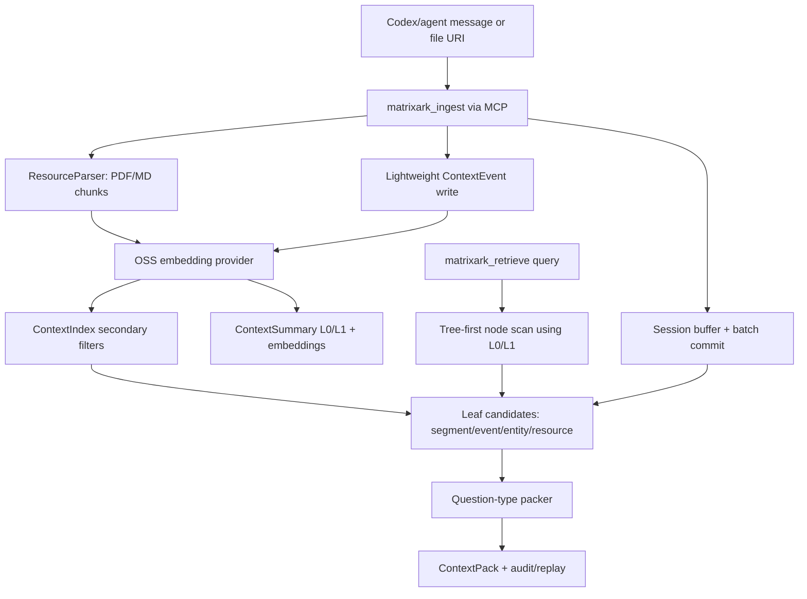

# MatrixArk Message + Resource Debug Trace

This debug run ingests LOCOMO-style multi-turn conversation messages and several PDF/Markdown resources, then retrieves one ContextPack. It is meant for inspecting exactly what MatrixArk writes and reads during ingestion, extraction, chunking, summary generation, embedding storage, tree traversal, secondary-index filtering, packing, audit, and replay.

## Live C++ Backend

This trace was rerun through the live C++ TemporalStore direct adapter after setting the SDK library path. The readiness probe passed hset/hget warmup against `deploy_ns/deploy_table`.

```json
{
  "attempt_log": [],
  "attempts": 1,
  "backend": "temporalstore-direct",
  "checks": {
    "mcp_process_started": true,
    "metaserver_reachable": {
      "address": "127.0.0.1:18000",
      "ok": true
    },
    "namespace_table_opened": true,
    "slot_coverage_verified_by_warmup_hset_hget": true
  },
  "metaserver": "127.0.0.1:18000",
  "probe": true,
  "reason": "codex_100_message_trace_probe",
  "status": "ready",
  "storage_prefix": "matrixark:codex_cpp_probe:1782632787",
  "topology": {
    "metaserver": "127.0.0.1:18000",
    "namespace": "deploy_ns",
    "storage_prefix": "matrixark:codex_cpp_probe:1782632787",
    "table": "deploy_table",
    "warmup_field": "1391363:1782632787347:8113295398980492858",
    "warmup_key": "matrixark:codex_cpp_probe:1782632787:readiness"
  },
  "warmup_key": "matrixark:codex_cpp_probe:1782632787:readiness"
}
```

## Pipeline Diagram



## Re-run

```bash
MATRIXARK_EMBEDDING_PROVIDER=deterministic python3 tools/run_matrixark_message_pdf_debug_trace.py --output-dir docs/debug/matrixark_message_resource_trace
```

## Configuration

- Event log: `/root/src/github-services/TemporalStore/docs/debug/matrixark_codex_cpp_100_message_trace/matrixark_message_resource_debug_trace.jsonl`
- Embedding model: `matrixark-local-token-hash-v1`
- Embedding execution mode: `deterministic-token-hash`
- Query: `What is the current Aurora GPU approval state, owner, budget, deadline, blocker, and which session/shared resources support it?`
- Summary refresh: background interval `1000` ms, limit `64` dirty nodes per tick
- Node L1 policy: generate when child summaries, >=3 source events, or >=180 estimated source tokens
- Embedding note: This run completed with the local deterministic embedding backend. The local sentence-transformers OSS probe timed out before this trace was generated, so the data-flow artifact is complete but not an OSS-embedding proof.

## Data Model Field Guide

|model|purpose|important_fields|
|---|---|---|
|ContextNode|Filesystem-like topology. Messages/resources attach to a leaf node, parents are used for traversal.|node_hash, parent_hash, node_name, node_path, depth, scope_key|
|ContextEvent|Replayable extracted fact or raw conversational event.|event_id_hash, node_hash, source_ref, summary_text, event_type, entity_type, timestamp|
|ContextSegment|Batch/session topic segment when a logical window is committed.|segment_hash, node_hash, source_event_ids, summary_text, topic, time_range|
|ContextEntity|Evolving state for current preference/status/owner/budget/deadline.|entity_hash, entity_type, entity_name, state, source_ref, valid_from, stale_blockers|
|ResourceManifest|Logical imported file/resource version. Raw bytes stay outside TemporalStore.|resource_hash, raw_uri, resource_type, resource_version, content_hash, scope_key|
|ResourceChunk|Cited serving chunk from PDF/MD/etc.|chunk_hash, raw_uri, source_ref, text, token_estimate, unit_kind, page_number, heading_slug|
|ContextSummary|L0/L1 node/resource summary used for preview and tree traversal.|summary_hash, summary_type, node_hash, summary_text, source_event_ids, source_chunk_hashes|
|ContextEmbedding|Vector stored separately for summaries, chunks, events, entities, and resources.|embedding_type, ref_type, ref_hash, model, dim, vector|
|ContextIndex|Bounded secondary filters before similarity scoring.|index_name, index_value, ref_type, ref_hash, node_hash, chunk_hash|
|ContextPackAudit|Explains selected/dropped refs, scores, token costs, warnings, and replay path.|context_pack_id, selected_refs, dropped_refs, used_context_tokens, quality_warnings|

## Record Counts

|record_type|count|
|---|---|
|context_batch_commit|5|
|context_child_ref|6|
|context_debug_record|163|
|context_embedding|354|
|context_entity|55|
|context_entity_update_audit|35|
|context_event|124|
|context_extraction_audit|5|
|context_index|704|
|context_node|7|
|context_pack_audit|1|
|context_segment|20|
|context_summary|151|
|context_summary_dirty|460|
|context_summary_refresh_audit|19|
|matrixark_audit_log|112|
|matrixark_metric|4|
|resource_chunk|4|
|resource_import_task|12|
|resource_manifest|4|
|resource_registry|4|
|session_buffer_event|104|

## Input Messages

|role|content|
|---|---|
|user|Codex note: Alice from finance approved Project Aurora GPU procurement after Q3 budget review. [codex_hook_seq=001]|
|assistant|MatrixArk should remember Alice approved the Project Aurora GPU procurement after finance review. [codex_hook_seq=002]|
|user|Codex note: Bob is the procurement owner for Project Aurora GPUs. [codex_hook_seq=003]|
|assistant|Tracked Bob as the Project Aurora GPU procurement owner. [codex_hook_seq=004]|
|user|Codex note: initial GPU budget cap was 42000 dollars. [codex_hook_seq=005]|
|assistant|Recorded historical initial GPU budget cap of 42000 dollars. [codex_hook_seq=006]|
|user|Codex correction: Alice raised the Project Aurora GPU cap to 45000 dollars after a backup quote. [codex_hook_seq=007]|
|assistant|Updated current Project Aurora GPU cap to 45000 dollars; 42000 is stale. [codex_hook_seq=008]|
|user|Codex note: purchase order deadline is July 15, 2026. [codex_hook_seq=009]|
|assistant|Tracked July 15, 2026 as the Project Aurora GPU purchase order deadline. [codex_hook_seq=010]|
|user|Codex note: finance approval attachment is required before vendor selection. [codex_hook_seq=011]|
|assistant|Tracked finance approval attachment as a blocker before vendor selection. [codex_hook_seq=012]|
|user|Codex note: if approval attachment is missing, notify Alice and stop vendor selection. [codex_hook_seq=013]|
|assistant|Tracked escalation: notify Alice and stop vendor selection when the approval attachment is missing. [codex_hook_seq=014]|
|user|Codex note: backup quote must be compared before creating the purchase order. [codex_hook_seq=015]|
|assistant|Tracked backup quote comparison as a required procurement step. [codex_hook_seq=016]|
|user|Codex note: final vendor evidence must be stored with the purchase order. [codex_hook_seq=017]|
|assistant|Tracked final vendor evidence storage with the purchase order. [codex_hook_seq=018]|
|user|Codex note: global tenant policy says GPU purchases require finance approval. [codex_hook_seq=019]|
|assistant|Tracked tenant shared GPU policy requiring finance approval. [codex_hook_seq=020]|
|user|Codex note: Alice from finance approved Project Aurora GPU procurement after Q3 budget review. [codex_hook_seq=021]|
|assistant|MatrixArk should remember Alice approved the Project Aurora GPU procurement after finance review. [codex_hook_seq=022]|
|user|Codex note: Bob is the procurement owner for Project Aurora GPUs. [codex_hook_seq=023]|
|assistant|Tracked Bob as the Project Aurora GPU procurement owner. [codex_hook_seq=024]|
|user|Codex note: initial GPU budget cap was 42000 dollars. [codex_hook_seq=025]|
|assistant|Recorded historical initial GPU budget cap of 42000 dollars. [codex_hook_seq=026]|
|user|Codex correction: Alice raised the Project Aurora GPU cap to 45000 dollars after a backup quote. [codex_hook_seq=027]|
|assistant|Updated current Project Aurora GPU cap to 45000 dollars; 42000 is stale. [codex_hook_seq=028]|
|user|Codex note: purchase order deadline is July 15, 2026. [codex_hook_seq=029]|
|assistant|Tracked July 15, 2026 as the Project Aurora GPU purchase order deadline. [codex_hook_seq=030]|
|user|Codex note: finance approval attachment is required before vendor selection. [codex_hook_seq=031]|
|assistant|Tracked finance approval attachment as a blocker before vendor selection. [codex_hook_seq=032]|
|user|Codex note: if approval attachment is missing, notify Alice and stop vendor selection. [codex_hook_seq=033]|
|assistant|Tracked escalation: notify Alice and stop vendor selection when the approval attachment is missing. [codex_hook_seq=034]|
|user|Codex note: backup quote must be compared before creating the purchase order. [codex_hook_seq=035]|
|assistant|Tracked backup quote comparison as a required procurement step. [codex_hook_seq=036]|
|user|Codex note: final vendor evidence must be stored with the purchase order. [codex_hook_seq=037]|
|assistant|Tracked final vendor evidence storage with the purchase order. [codex_hook_seq=038]|
|user|Codex note: global tenant policy says GPU purchases require finance approval. [codex_hook_seq=039]|
|assistant|Tracked tenant shared GPU policy requiring finance approval. [codex_hook_seq=040]|
|user|Codex note: Alice from finance approved Project Aurora GPU procurement after Q3 budget review. [codex_hook_seq=041]|
|assistant|MatrixArk should remember Alice approved the Project Aurora GPU procurement after finance review. [codex_hook_seq=042]|
|user|Codex note: Bob is the procurement owner for Project Aurora GPUs. [codex_hook_seq=043]|
|assistant|Tracked Bob as the Project Aurora GPU procurement owner. [codex_hook_seq=044]|
|user|Codex note: initial GPU budget cap was 42000 dollars. [codex_hook_seq=045]|
|assistant|Recorded historical initial GPU budget cap of 42000 dollars. [codex_hook_seq=046]|
|user|Codex correction: Alice raised the Project Aurora GPU cap to 45000 dollars after a backup quote. [codex_hook_seq=047]|
|assistant|Updated current Project Aurora GPU cap to 45000 dollars; 42000 is stale. [codex_hook_seq=048]|
|user|Codex note: purchase order deadline is July 15, 2026. [codex_hook_seq=049]|
|assistant|Tracked July 15, 2026 as the Project Aurora GPU purchase order deadline. [codex_hook_seq=050]|

## Resources

|raw_uri|title|line_count|
|---|---|---|
|/root/src/github-services/TemporalStore/docs/debug/matrixark_codex_cpp_100_message_trace/fixtures/session_aurora_runb...|Session Project Aurora Runbook|6|
|/root/src/github-services/TemporalStore/docs/debug/matrixark_codex_cpp_100_message_trace/fixtures/session_vendor_note...|Session Vendor Notes|4|
|/root/src/github-services/TemporalStore/docs/debug/matrixark_codex_cpp_100_message_trace/fixtures/tenant_shared_gpu_p...|Tenant Shared GPU Policy|4|
|/root/src/github-services/TemporalStore/docs/debug/matrixark_codex_cpp_100_message_trace/fixtures/global_procurement_...|Global Procurement Checklist|6|

## Resource Import Tasks

|status|raw_uri|resource_type|chunk_count|resource_fact_count|resource_entity_count|metrics|
|---|---|---|---|---|---|---|
|queued|/root/src/github-services/TemporalStore/docs/debug/matrixark_codex_cpp_100_message_trace/fixtures/session_aurora_runb...|md|||||
|running|/root/src/github-services/TemporalStore/docs/debug/matrixark_codex_cpp_100_message_trace/fixtures/session_aurora_runb...|md|||||
|completed|/root/src/github-services/TemporalStore/docs/debug/matrixark_codex_cpp_100_message_trace/fixtures/session_aurora_runb...|md|1|8|8|{"chunk_count": 1, "cloud_bucket": "", "cloud_key": "", "dedupe_count": 0, "duration_ms": 33.575, "embedding_count": ...|
|queued|/root/src/github-services/TemporalStore/docs/debug/matrixark_codex_cpp_100_message_trace/fixtures/session_vendor_note...|md|||||
|running|/root/src/github-services/TemporalStore/docs/debug/matrixark_codex_cpp_100_message_trace/fixtures/session_vendor_note...|md|||||
|completed|/root/src/github-services/TemporalStore/docs/debug/matrixark_codex_cpp_100_message_trace/fixtures/session_vendor_note...|md|1|2|2|{"chunk_count": 1, "cloud_bucket": "", "cloud_key": "", "dedupe_count": 0, "duration_ms": 22.482, "embedding_count": ...|
|queued|/root/src/github-services/TemporalStore/docs/debug/matrixark_codex_cpp_100_message_trace/fixtures/tenant_shared_gpu_p...|md|||||
|running|/root/src/github-services/TemporalStore/docs/debug/matrixark_codex_cpp_100_message_trace/fixtures/tenant_shared_gpu_p...|md|||||
|completed|/root/src/github-services/TemporalStore/docs/debug/matrixark_codex_cpp_100_message_trace/fixtures/tenant_shared_gpu_p...|md|1|4|4|{"chunk_count": 1, "cloud_bucket": "", "cloud_key": "", "dedupe_count": 0, "duration_ms": 24.22, "embedding_count": 1...|
|queued|/root/src/github-services/TemporalStore/docs/debug/matrixark_codex_cpp_100_message_trace/fixtures/global_procurement_...|md|||||
|running|/root/src/github-services/TemporalStore/docs/debug/matrixark_codex_cpp_100_message_trace/fixtures/global_procurement_...|md|||||
|completed|/root/src/github-services/TemporalStore/docs/debug/matrixark_codex_cpp_100_message_trace/fixtures/global_procurement_...|md|1|6|6|{"chunk_count": 1, "cloud_bucket": "", "cloud_key": "", "dedupe_count": 0, "duration_ms": 26.127, "embedding_count": ...|

## Resource Chunks

|chunk_hash|raw_uri|source_ref|token_estimate|metadata.unit_kind|metadata.content_hash|text|
|---|---|---|---|---|---|---|
|3421326024954399604|/root/src/github-services/TemporalStore/docs/debug/matrixark_codex_cpp_100_message_trace/fixtures/session_aurora_runb...|/root/src/github-services/TemporalStore/docs/debug/matrixark_codex_cpp_100_message_trace/fixtures/session_aurora_runb...|50|markdown_section|304f1c56fc7fe6bb|# Session Project Aurora Runbook Decision: Alice approved Project Aurora GPU procurement after Q3 budget review. Owne...|
|809810063827291865|/root/src/github-services/TemporalStore/docs/debug/matrixark_codex_cpp_100_message_trace/fixtures/session_vendor_note...|/root/src/github-services/TemporalStore/docs/debug/matrixark_codex_cpp_100_message_trace/fixtures/session_vendor_note...|39|markdown_section|71608b6fa564226e|# Session Vendor Notes Primary quote and backup quote must be compared before purchase order creation. If the finance...|
|4605002374107348868|/root/src/github-services/TemporalStore/docs/debug/matrixark_codex_cpp_100_message_trace/fixtures/tenant_shared_gpu_p...|/root/src/github-services/TemporalStore/docs/debug/matrixark_codex_cpp_100_message_trace/fixtures/tenant_shared_gpu_p...|38|markdown_section|9b646b69e706b8c3|# Tenant Shared GPU Policy All GPU purchases require finance approval before vendor selection. The procurement owner ...|
|4666534364776610246|/root/src/github-services/TemporalStore/docs/debug/matrixark_codex_cpp_100_message_trace/fixtures/global_procurement_...|/root/src/github-services/TemporalStore/docs/debug/matrixark_codex_cpp_100_message_trace/fixtures/global_procurement_...|17|markdown_section|57dc34bc0bb41431|# Global Procurement Checklist Confirm approver. Confirm owner. Confirm current budget. Confirm deadline. Confirm blo...|

## Extracted Events

|event_id_hash|node_path|internal_extraction.event_type|internal_extraction.entity_type|summary_text|source_ref|
|---|---|---|---|---|---|
|1224916742487410390||||||
|8826237263257051703||||||
|4291058255530803887||||||
|6034083218980984697||||||
|4028423468751923846||||||
|1732765001772050487||||||
|8062441603393940565||||||
|8695216978350991045||||||
|4566481606265050318||||||
|4797102059678911025||||||
|2052069849796389225||||||
|9038824302658839216||||||
|2418372085849409167||||||
|4191120267438248320||||||
|639612090295411068||||||
|2154183080778914598||||||
|6250967582824083223||||||
|2865096142568906826||||||
|4743784541440868850||||||
|7012784999386354129||||||
|8318581397768198363||||||
|3525461658293252063||||||
|571866135316936639||||||
|4371081504443866749||||||
|8265808495209439519||||||
|9001828891406822220||||||
|1782086539510200003||||||
|3249897613798198023||||||
|2661915641819942689||||||
|5222170850361125469||||||
|7354291662995730443||||||
|2149878705580782932||||||
|5066477866443990850||||||
|3489297636019128149||||||
|7448708534247744195||||||
|1188800405314271927||||||
|6308198498531895642||||||
|1490339642140378544||||||
|5183388989902360201||||||
|812195132907011755||||||
|6115681640478917530||||||
|7837570112835968834||||||
|3367938982900416557||||||
|1176718277221913094||||||
|1629913208108799379||||||
|6006690528513525669||||||
|8031624940281368575||||||
|4775144527506527718||||||
|2670204160492802403||||||
|4898259929359218547||||||
|8435205421933655551||||||
|4097211752443227139||||||
|845701105194239270||||||
|6758382008713916409||||||
|70615061625560193||||||
|7090468371786959307||||||
|5791760329385910664||||||
|672541590480893461||||||
|3437956975551862223||||||
|2783297448948170826||||||
|9170951949466173938||||||
|1897949788380583441||||||
|2994673037173783780||||||
|5650528957787954447||||||
|8332218331269417435||||||
|2724930627319933760||||||
|2547139685247032649||||||
|8478253932714296357||||||
|8733457600094240123||||||
|2778455134900366086||||||
|1722849267760437313||||||
|8596453832090011445||||||
|8448834135793494306||||||
|5462673688973085039||||||
|6634030350376718016||||||
|3915198050153505616||||||
|7324601013332673397||||||
|3947837644110294689||||||
|605890905852340165||||||
|4966021405597069007||||||

## Extracted Entities

|entity_hash|node_path|entity_type|entity_name|operator|state|source_ref|
|---|---|---|---|---|---|---|
|5836531670169431802||correction|correction|LATEST|current Project Aurora GPU cap to 45000 dollars||
|4741262115398430274||approval_state|Project Aurora GPU procurement after Q3 budget review|LLM_MERGE|Project Aurora GPU procurement after Q3 budget review||
|9172544170635257716||approval_state|the Project Aurora GPU procurement after finance review|LLM_MERGE|the Project Aurora GPU procurement after finance review||
|2184542580724976205||approval_state|attachment is required before vendor selection|LLM_MERGE|attachment is required before vendor selection||
|7935506643413717448||approval_state|attachment as a blocker before vendor selection|LLM_MERGE|attachment as a blocker before vendor selection||
|3673187688128573970||approval_state|attachment is missing, notify Alice and stop vendor selection|LLM_MERGE|attachment is missing, notify Alice and stop vendor selection||
|7731493721162453188||approval_state|attachment is missing|LLM_MERGE|attachment is missing||
|5836531670169431802||correction|correction|LATEST|current Project Aurora GPU cap to 45000 dollars||
|4741262115398430274||approval_state|Project Aurora GPU procurement after Q3 budget review|LLM_MERGE|Project Aurora GPU procurement after Q3 budget review||
|9172544170635257716||approval_state|the Project Aurora GPU procurement after finance review|LLM_MERGE|the Project Aurora GPU procurement after finance review||
|2184542580724976205||approval_state|attachment is required before vendor selection|LLM_MERGE|attachment is required before vendor selection||
|7935506643413717448||approval_state|attachment as a blocker before vendor selection|LLM_MERGE|attachment as a blocker before vendor selection||
|3673187688128573970||approval_state|attachment is missing, notify Alice and stop vendor selection|LLM_MERGE|attachment is missing, notify Alice and stop vendor selection||
|7731493721162453188||approval_state|attachment is missing|LLM_MERGE|attachment is missing||
|5836531670169431802||correction|correction|LATEST|current Project Aurora GPU cap to 45000 dollars||
|4741262115398430274||approval_state|Project Aurora GPU procurement after Q3 budget review|LLM_MERGE|Project Aurora GPU procurement after Q3 budget review||
|9172544170635257716||approval_state|the Project Aurora GPU procurement after finance review|LLM_MERGE|the Project Aurora GPU procurement after finance review||
|2184542580724976205||approval_state|attachment is required before vendor selection|LLM_MERGE|attachment is required before vendor selection||
|7935506643413717448||approval_state|attachment as a blocker before vendor selection|LLM_MERGE|attachment as a blocker before vendor selection||
|3673187688128573970||approval_state|attachment is missing, notify Alice and stop vendor selection|LLM_MERGE|attachment is missing, notify Alice and stop vendor selection||
|7731493721162453188||approval_state|attachment is missing|LLM_MERGE|attachment is missing||
|5836531670169431802||correction|correction|LATEST|current Project Aurora GPU cap to 45000 dollars||
|4741262115398430274||approval_state|Project Aurora GPU procurement after Q3 budget review|LLM_MERGE|Project Aurora GPU procurement after Q3 budget review||
|9172544170635257716||approval_state|the Project Aurora GPU procurement after finance review|LLM_MERGE|the Project Aurora GPU procurement after finance review||
|2184542580724976205||approval_state|attachment is required before vendor selection|LLM_MERGE|attachment is required before vendor selection||
|7935506643413717448||approval_state|attachment as a blocker before vendor selection|LLM_MERGE|attachment as a blocker before vendor selection||
|3673187688128573970||approval_state|attachment is missing, notify Alice and stop vendor selection|LLM_MERGE|attachment is missing, notify Alice and stop vendor selection||
|7731493721162453188||approval_state|attachment is missing|LLM_MERGE|attachment is missing||
|5836531670169431802||correction|correction|LATEST|current Project Aurora GPU cap to 45000 dollars||
|4741262115398430274||approval_state|Project Aurora GPU procurement after Q3 budget review|LLM_MERGE|Project Aurora GPU procurement after Q3 budget review||
|9172544170635257716||approval_state|the Project Aurora GPU procurement after finance review|LLM_MERGE|the Project Aurora GPU procurement after finance review||
|2184542580724976205||approval_state|attachment is required before vendor selection|LLM_MERGE|attachment is required before vendor selection||
|7935506643413717448||approval_state|attachment as a blocker before vendor selection|LLM_MERGE|attachment as a blocker before vendor selection||
|3673187688128573970||approval_state|attachment is missing, notify Alice and stop vendor selection|LLM_MERGE|attachment is missing, notify Alice and stop vendor selection||
|7731493721162453188||approval_state|attachment is missing|LLM_MERGE|attachment is missing||
|4147223848421954613||resource_decision|decision:Session Project Aurora Runbook:Alice approved Project Aurora GPU procurement after Q3 budge|LATEST|resource_decision: Alice approved Project Aurora GPU procurement after Q3 budget review. Source: # Session Project Au...|/root/src/github-services/TemporalStore/docs/debug/matrixark_codex_cpp_100_message_trace/fixtures/session_aurora_runb...|
|694149271968789687||resource_owner|owner:Session Project Aurora Runbook:Bob owns procurement and vendor coordination|LATEST|resource_owner: Bob owns procurement and vendor coordination. Source: # Session Project Aurora Runbook Decision: Alic...|/root/src/github-services/TemporalStore/docs/debug/matrixark_codex_cpp_100_message_trace/fixtures/session_aurora_runb...|
|4187998953461562090||resource_cost|cost:Session Project Aurora Runbook:review|LATEST|resource_cost: review. Source: # Session Project Aurora Runbook Decision: Alice approved Project Aurora GPU procureme...|/root/src/github-services/TemporalStore/docs/debug/matrixark_codex_cpp_100_message_trace/fixtures/session_aurora_runb...|
|3590194484566651749||resource_deadline|deadline:Session Project Aurora Runbook:purchase order must be ready by July 15, 2026|LATEST|resource_deadline: purchase order must be ready by July 15, 2026. Source: # Session Project Aurora Runbook Decision: ...|/root/src/github-services/TemporalStore/docs/debug/matrixark_codex_cpp_100_message_trace/fixtures/session_aurora_runb...|
|4328877061805382087||resource_troubleshooting|troubleshooting:Session Project Aurora Runbook:Decision: Alice approved Project Aurora GPU procurement afte|LATEST|resource_troubleshooting_step: Decision: Alice approved Project Aurora GPU procurement after Q3 budget review. Source...|/root/src/github-services/TemporalStore/docs/debug/matrixark_codex_cpp_100_message_trace/fixtures/session_aurora_runb...|
|7959088439118252518||resource_policy|policy:Session Project Aurora Runbook:be ready by July 15, 2026|LATEST|resource_policy: be ready by July 15, 2026. Source: # Session Project Aurora Runbook Decision: Alice approved Project...|/root/src/github-services/TemporalStore/docs/debug/matrixark_codex_cpp_100_message_trace/fixtures/session_aurora_runb...|
|819946950301428267||resource_approval|approval:Session Project Aurora Runbook:Project Aurora GPU procurement after Q3 budget review|LATEST|resource_approval: Project Aurora GPU procurement after Q3 budget review. Source: # Session Project Aurora Runbook De...|/root/src/github-services/TemporalStore/docs/debug/matrixark_codex_cpp_100_message_trace/fixtures/session_aurora_runb...|
|3583715407655466547||resource_procedure|procedure:Session Project Aurora Runbook:finance approval attachment is required before vendor select|LATEST|resource_procedure: finance approval attachment is required before vendor selection. Source: # Session Project Aurora...|/root/src/github-services/TemporalStore/docs/debug/matrixark_codex_cpp_100_message_trace/fixtures/session_aurora_runb...|
|2868032022130739008||resource_policy|policy:Session Vendor Notes:be compared before purchase order creation|LATEST|resource_policy: be compared before purchase order creation. Source: # Session Vendor Notes Primary quote and backup ...|/root/src/github-services/TemporalStore/docs/debug/matrixark_codex_cpp_100_message_trace/fixtures/session_vendor_note...|
|8533872629643209521||resource_approval|approval:Session Vendor Notes:attachment is missing, notify Alice and stop vendor selectio|LATEST|resource_approval: attachment is missing, notify Alice and stop vendor selection. Source: # Session Vendor Notes Prim...|/root/src/github-services/TemporalStore/docs/debug/matrixark_codex_cpp_100_message_trace/fixtures/session_vendor_note...|
|8617522945422572926||resource_owner|owner:Tenant Shared GPU Policy:must be named before a purchase order is created|LATEST|resource_owner: must be named before a purchase order is created. Source: # Tenant Shared GPU Policy All GPU purchase...|/root/src/github-services/TemporalStore/docs/debug/matrixark_codex_cpp_100_message_trace/fixtures/tenant_shared_gpu_p...|
|2384523282013684273||resource_cost|cost:Tenant Shared GPU Policy:changes must cite the approver and mark the prior cap as sta|LATEST|resource_cost: changes must cite the approver and mark the prior cap as stale. Source: # Tenant Shared GPU Policy All...|/root/src/github-services/TemporalStore/docs/debug/matrixark_codex_cpp_100_message_trace/fixtures/tenant_shared_gpu_p...|
|4267277378413791055||resource_policy|policy:Tenant Shared GPU Policy:All GPU purchases require finance approval before vendor sel|LATEST|resource_policy: All GPU purchases require finance approval before vendor selection. Source: # Tenant Shared GPU Poli...|/root/src/github-services/TemporalStore/docs/debug/matrixark_codex_cpp_100_message_trace/fixtures/tenant_shared_gpu_p...|
|5203693614185628801||resource_approval|approval:Tenant Shared GPU Policy:before vendor selection|LATEST|resource_approval: before vendor selection. Source: # Tenant Shared GPU Policy All GPU purchases require finance appr...|/root/src/github-services/TemporalStore/docs/debug/matrixark_codex_cpp_100_message_trace/fixtures/tenant_shared_gpu_p...|
|6043638994474310483||resource_owner|owner:Global Procurement Checklist:# Global Procurement Checklist Confirm approver. Confirm own|LATEST|resource_owner: # Global Procurement Checklist Confirm approver. Confirm owner. Confirm current budget. Confirm deadl...|/root/src/github-services/TemporalStore/docs/debug/matrixark_codex_cpp_100_message_trace/fixtures/global_procurement_...|
|6840645965573226875||resource_cost|cost:Global Procurement Checklist:# Global Procurement Checklist Confirm approver. Confirm own|LATEST|resource_cost: # Global Procurement Checklist Confirm approver. Confirm owner. Confirm current budget. Confirm deadli...|/root/src/github-services/TemporalStore/docs/debug/matrixark_codex_cpp_100_message_trace/fixtures/global_procurement_...|
|2357483323852460373||resource_deadline|deadline:Global Procurement Checklist:# Global Procurement Checklist Confirm approver. Confirm own|LATEST|resource_deadline: # Global Procurement Checklist Confirm approver. Confirm owner. Confirm current budget. Confirm de...|/root/src/github-services/TemporalStore/docs/debug/matrixark_codex_cpp_100_message_trace/fixtures/global_procurement_...|
|4467184542478641889||resource_approval|approval:Global Procurement Checklist:r|LATEST|resource_approval: r. Source: # Global Procurement Checklist Confirm approver. Confirm owner. Confirm current budget....|/root/src/github-services/TemporalStore/docs/debug/matrixark_codex_cpp_100_message_trace/fixtures/global_procurement_...|
|4147980808112194217||resource_risk|risk:Global Procurement Checklist:s before vendor selection|LATEST|resource_risk: s before vendor selection. Source: # Global Procurement Checklist Confirm approver. Confirm owner. Con...|/root/src/github-services/TemporalStore/docs/debug/matrixark_codex_cpp_100_message_trace/fixtures/global_procurement_...|
|4609806875217924317||resource_procedure|procedure:Global Procurement Checklist:Confirm approver|LATEST|resource_procedure: Confirm approver. Source: # Global Procurement Checklist Confirm approver. Confirm owner. Confirm...|/root/src/github-services/TemporalStore/docs/debug/matrixark_codex_cpp_100_message_trace/fixtures/global_procurement_...|

## Summaries

|summary_type|summary_hash|node_path|summary_generation_policy.reason|summary_text|source_chunk_hashes|
|---|---|---|---|---|---|
|session_l0|8695652974415713980|["tenant:tenant_codex", "user:deeproute", "session:debug-message-pdf-session", "conversation:project_aurora"]||user: Codex note: Alice from finance approved Project Aurora GPU procurement after Q3 budget review. [codex_hook_seq=...||
|session_l0|8695652974415713980|["tenant:tenant_codex", "user:deeproute", "session:debug-message-pdf-session", "conversation:project_aurora"]||user: Codex note: Alice from finance approved Project Aurora GPU procurement after Q3 budget review. [codex_hook_seq=...||
|session_l0|8695652974415713980|["tenant:tenant_codex", "user:deeproute", "session:debug-message-pdf-session", "conversation:project_aurora"]||user: Codex note: Alice from finance approved Project Aurora GPU procurement after Q3 budget review. [codex_hook_seq=...||
|session_l0|8695652974415713980|["tenant:tenant_codex", "user:deeproute", "session:debug-message-pdf-session", "conversation:project_aurora"]||user: Codex note: Alice from finance approved Project Aurora GPU procurement after Q3 budget review. [codex_hook_seq=...||
|session_l0|8695652974415713980|["tenant:tenant_codex", "user:deeproute", "session:debug-message-pdf-session", "conversation:project_aurora"]||user: Codex note: Alice from finance approved Project Aurora GPU procurement after Q3 budget review. [codex_hook_seq=...||
|session_l0|8695652974415713980|["tenant:tenant_codex", "user:deeproute", "session:debug-message-pdf-session", "conversation:project_aurora"]||user: Codex note: Alice from finance approved Project Aurora GPU procurement after Q3 budget review. [codex_hook_seq=...||
|session_l0|8695652974415713980|["tenant:tenant_codex", "user:deeproute", "session:debug-message-pdf-session", "conversation:project_aurora"]||user: Codex note: Alice from finance approved Project Aurora GPU procurement after Q3 budget review. [codex_hook_seq=...||
|session_l0|8695652974415713980|["tenant:tenant_codex", "user:deeproute", "session:debug-message-pdf-session", "conversation:project_aurora"]||user: Codex note: Alice from finance approved Project Aurora GPU procurement after Q3 budget review. [codex_hook_seq=...||
|session_l0|8695652974415713980|["tenant:tenant_codex", "user:deeproute", "session:debug-message-pdf-session", "conversation:project_aurora"]||user: Codex note: Alice from finance approved Project Aurora GPU procurement after Q3 budget review. [codex_hook_seq=...||
|session_l0|8695652974415713980|["tenant:tenant_codex", "user:deeproute", "session:debug-message-pdf-session", "conversation:project_aurora"]||user: Codex note: Alice from finance approved Project Aurora GPU procurement after Q3 budget review. [codex_hook_seq=...||
|session_l0|8695652974415713980|["tenant:tenant_codex", "user:deeproute", "session:debug-message-pdf-session", "conversation:project_aurora"]||user: Codex note: Alice from finance approved Project Aurora GPU procurement after Q3 budget review. [codex_hook_seq=...||
|session_l0|8695652974415713980|["tenant:tenant_codex", "user:deeproute", "session:debug-message-pdf-session", "conversation:project_aurora"]||user: Codex note: Alice from finance approved Project Aurora GPU procurement after Q3 budget review. [codex_hook_seq=...||
|session_l0|8695652974415713980|["tenant:tenant_codex", "user:deeproute", "session:debug-message-pdf-session", "conversation:project_aurora"]||user: Codex note: Alice from finance approved Project Aurora GPU procurement after Q3 budget review. [codex_hook_seq=...||
|session_l0|8695652974415713980|["tenant:tenant_codex", "user:deeproute", "session:debug-message-pdf-session", "conversation:project_aurora"]||user: Codex note: Alice from finance approved Project Aurora GPU procurement after Q3 budget review. [codex_hook_seq=...||
|session_l0|8695652974415713980|["tenant:tenant_codex", "user:deeproute", "session:debug-message-pdf-session", "conversation:project_aurora"]||user: Codex note: Alice from finance approved Project Aurora GPU procurement after Q3 budget review. [codex_hook_seq=...||
|session_l0|8695652974415713980|["tenant:tenant_codex", "user:deeproute", "session:debug-message-pdf-session", "conversation:project_aurora"]||user: Codex note: Alice from finance approved Project Aurora GPU procurement after Q3 budget review. [codex_hook_seq=...||
|session_l0|8695652974415713980|["tenant:tenant_codex", "user:deeproute", "session:debug-message-pdf-session", "conversation:project_aurora"]||user: Codex note: Alice from finance approved Project Aurora GPU procurement after Q3 budget review. [codex_hook_seq=...||
|session_l0|8695652974415713980|["tenant:tenant_codex", "user:deeproute", "session:debug-message-pdf-session", "conversation:project_aurora"]||user: Codex note: Alice from finance approved Project Aurora GPU procurement after Q3 budget review. [codex_hook_seq=...||
|session_l0|8695652974415713980|["tenant:tenant_codex", "user:deeproute", "session:debug-message-pdf-session", "conversation:project_aurora"]||user: Codex note: Alice from finance approved Project Aurora GPU procurement after Q3 budget review. [codex_hook_seq=...||
|session_l0|8695652974415713980|["tenant:tenant_codex", "user:deeproute", "session:debug-message-pdf-session", "conversation:project_aurora"]||user: Codex note: Alice from finance approved Project Aurora GPU procurement after Q3 budget review. [codex_hook_seq=...||
|batch_l0|6107213684211361378|["tenant:tenant_codex", "user:deeproute", "session:debug-message-pdf-session", "conversation:project_aurora"]||user: Codex note: Alice from finance approved Project Aurora GPU procurement after Q3 budget review. [codex_hook_seq=...||
|session_l0|8695652974415713980|["tenant:tenant_codex", "user:deeproute", "session:debug-message-pdf-session", "conversation:project_aurora"]||user: Codex note: Alice from finance approved Project Aurora GPU procurement after Q3 budget review. [codex_hook_seq=...||
|session_l0|8695652974415713980|["tenant:tenant_codex", "user:deeproute", "session:debug-message-pdf-session", "conversation:project_aurora"]||user: Codex note: Alice from finance approved Project Aurora GPU procurement after Q3 budget review. [codex_hook_seq=...||
|session_l0|8695652974415713980|["tenant:tenant_codex", "user:deeproute", "session:debug-message-pdf-session", "conversation:project_aurora"]||user: Codex note: Alice from finance approved Project Aurora GPU procurement after Q3 budget review. [codex_hook_seq=...||
|session_l0|8695652974415713980|["tenant:tenant_codex", "user:deeproute", "session:debug-message-pdf-session", "conversation:project_aurora"]||user: Codex note: Alice from finance approved Project Aurora GPU procurement after Q3 budget review. [codex_hook_seq=...||
|session_l0|8695652974415713980|["tenant:tenant_codex", "user:deeproute", "session:debug-message-pdf-session", "conversation:project_aurora"]||user: Codex note: Alice from finance approved Project Aurora GPU procurement after Q3 budget review. [codex_hook_seq=...||
|session_l0|8695652974415713980|["tenant:tenant_codex", "user:deeproute", "session:debug-message-pdf-session", "conversation:project_aurora"]||user: Codex note: Alice from finance approved Project Aurora GPU procurement after Q3 budget review. [codex_hook_seq=...||
|session_l0|8695652974415713980|["tenant:tenant_codex", "user:deeproute", "session:debug-message-pdf-session", "conversation:project_aurora"]||user: Codex note: Alice from finance approved Project Aurora GPU procurement after Q3 budget review. [codex_hook_seq=...||
|session_l0|8695652974415713980|["tenant:tenant_codex", "user:deeproute", "session:debug-message-pdf-session", "conversation:project_aurora"]||user: Codex note: Alice from finance approved Project Aurora GPU procurement after Q3 budget review. [codex_hook_seq=...||
|session_l0|8695652974415713980|["tenant:tenant_codex", "user:deeproute", "session:debug-message-pdf-session", "conversation:project_aurora"]||user: Codex note: Alice from finance approved Project Aurora GPU procurement after Q3 budget review. [codex_hook_seq=...||
|session_l0|8695652974415713980|["tenant:tenant_codex", "user:deeproute", "session:debug-message-pdf-session", "conversation:project_aurora"]||user: Codex note: Alice from finance approved Project Aurora GPU procurement after Q3 budget review. [codex_hook_seq=...||
|session_l0|8695652974415713980|["tenant:tenant_codex", "user:deeproute", "session:debug-message-pdf-session", "conversation:project_aurora"]||user: Codex note: Alice from finance approved Project Aurora GPU procurement after Q3 budget review. [codex_hook_seq=...||
|session_l0|8695652974415713980|["tenant:tenant_codex", "user:deeproute", "session:debug-message-pdf-session", "conversation:project_aurora"]||user: Codex note: Alice from finance approved Project Aurora GPU procurement after Q3 budget review. [codex_hook_seq=...||
|session_l0|8695652974415713980|["tenant:tenant_codex", "user:deeproute", "session:debug-message-pdf-session", "conversation:project_aurora"]||user: Codex note: Alice from finance approved Project Aurora GPU procurement after Q3 budget review. [codex_hook_seq=...||
|session_l0|8695652974415713980|["tenant:tenant_codex", "user:deeproute", "session:debug-message-pdf-session", "conversation:project_aurora"]||user: Codex note: Alice from finance approved Project Aurora GPU procurement after Q3 budget review. [codex_hook_seq=...||
|session_l0|8695652974415713980|["tenant:tenant_codex", "user:deeproute", "session:debug-message-pdf-session", "conversation:project_aurora"]||user: Codex note: Alice from finance approved Project Aurora GPU procurement after Q3 budget review. [codex_hook_seq=...||
|session_l0|8695652974415713980|["tenant:tenant_codex", "user:deeproute", "session:debug-message-pdf-session", "conversation:project_aurora"]||user: Codex note: Alice from finance approved Project Aurora GPU procurement after Q3 budget review. [codex_hook_seq=...||
|session_l0|8695652974415713980|["tenant:tenant_codex", "user:deeproute", "session:debug-message-pdf-session", "conversation:project_aurora"]||user: Codex note: Alice from finance approved Project Aurora GPU procurement after Q3 budget review. [codex_hook_seq=...||
|session_l0|8695652974415713980|["tenant:tenant_codex", "user:deeproute", "session:debug-message-pdf-session", "conversation:project_aurora"]||user: Codex note: Alice from finance approved Project Aurora GPU procurement after Q3 budget review. [codex_hook_seq=...||
|session_l0|8695652974415713980|["tenant:tenant_codex", "user:deeproute", "session:debug-message-pdf-session", "conversation:project_aurora"]||user: Codex note: Alice from finance approved Project Aurora GPU procurement after Q3 budget review. [codex_hook_seq=...||
|session_l0|8695652974415713980|["tenant:tenant_codex", "user:deeproute", "session:debug-message-pdf-session", "conversation:project_aurora"]||user: Codex note: Alice from finance approved Project Aurora GPU procurement after Q3 budget review. [codex_hook_seq=...||
|batch_l0|6318025746638951462|["tenant:tenant_codex", "user:deeproute", "session:debug-message-pdf-session", "conversation:project_aurora"]||user: Codex note: Alice from finance approved Project Aurora GPU procurement after Q3 budget review. [codex_hook_seq=...||
|session_l0|8695652974415713980|["tenant:tenant_codex", "user:deeproute", "session:debug-message-pdf-session", "conversation:project_aurora"]||user: Codex note: Alice from finance approved Project Aurora GPU procurement after Q3 budget review. [codex_hook_seq=...||
|session_l0|8695652974415713980|["tenant:tenant_codex", "user:deeproute", "session:debug-message-pdf-session", "conversation:project_aurora"]||user: Codex note: Alice from finance approved Project Aurora GPU procurement after Q3 budget review. [codex_hook_seq=...||
|session_l0|8695652974415713980|["tenant:tenant_codex", "user:deeproute", "session:debug-message-pdf-session", "conversation:project_aurora"]||user: Codex note: Alice from finance approved Project Aurora GPU procurement after Q3 budget review. [codex_hook_seq=...||
|session_l0|8695652974415713980|["tenant:tenant_codex", "user:deeproute", "session:debug-message-pdf-session", "conversation:project_aurora"]||user: Codex note: Alice from finance approved Project Aurora GPU procurement after Q3 budget review. [codex_hook_seq=...||
|session_l0|8695652974415713980|["tenant:tenant_codex", "user:deeproute", "session:debug-message-pdf-session", "conversation:project_aurora"]||user: Codex note: Alice from finance approved Project Aurora GPU procurement after Q3 budget review. [codex_hook_seq=...||
|session_l0|8695652974415713980|["tenant:tenant_codex", "user:deeproute", "session:debug-message-pdf-session", "conversation:project_aurora"]||user: Codex note: Alice from finance approved Project Aurora GPU procurement after Q3 budget review. [codex_hook_seq=...||
|node_l0||["tenant:tenant_codex"]|has_child_summaries|tenant:tenant_codex :: user: Codex note: Alice from finance approved Project Aurora GPU procurement after Q3 budget r...||
|session_l0|8695652974415713980|["tenant:tenant_codex", "user:deeproute", "session:debug-message-pdf-session", "conversation:project_aurora"]||user: Codex note: Alice from finance approved Project Aurora GPU procurement after Q3 budget review. [codex_hook_seq=...||
|node_l1||["tenant:tenant_codex"]|has_child_summaries|Context node tenant:tenant_codex. Rich overview: user: Codex note: Alice from finance approved Project Aurora GPU pro...||
|session_l0|8695652974415713980|["tenant:tenant_codex", "user:deeproute", "session:debug-message-pdf-session", "conversation:project_aurora"]||user: Codex note: Alice from finance approved Project Aurora GPU procurement after Q3 budget review. [codex_hook_seq=...||
|node_l0||["tenant:tenant_codex", "user:deeproute"]|has_child_summaries|tenant:tenant_codex / user:deeproute :: user: Codex note: Alice from finance approved Project Aurora GPU procurement ...||
|node_l1||["tenant:tenant_codex", "user:deeproute"]|has_child_summaries|Context node tenant:tenant_codex / user:deeproute. Rich overview: user: Codex note: Alice from finance approved Proje...||
|session_l0|8695652974415713980|["tenant:tenant_codex", "user:deeproute", "session:debug-message-pdf-session", "conversation:project_aurora"]||user: Codex note: Alice from finance approved Project Aurora GPU procurement after Q3 budget review. [codex_hook_seq=...||
|node_l0||["tenant:tenant_codex", "user:deeproute", "session:debug-message-pdf-session"]|has_child_summaries|tenant:tenant_codex / user:deeproute / session:debug-message-pdf-session :: user: Codex note: Alice from finance appr...||
|node_l1||["tenant:tenant_codex", "user:deeproute", "session:debug-message-pdf-session"]|has_child_summaries|Context node tenant:tenant_codex / user:deeproute / session:debug-message-pdf-session. Rich overview: user: Codex not...||
|session_l0|8695652974415713980|["tenant:tenant_codex", "user:deeproute", "session:debug-message-pdf-session", "conversation:project_aurora"]||user: Codex note: Alice from finance approved Project Aurora GPU procurement after Q3 budget review. [codex_hook_seq=...||
|node_l0||["tenant:tenant_codex", "user:deeproute", "session:debug-message-pdf-session", "conversation:project_aurora"]|event_count_threshold|tenant:tenant_codex / user:deeproute / session:debug-message-pdf-session / conversation:project_aurora :: user: Codex...||
|session_l0|8695652974415713980|["tenant:tenant_codex", "user:deeproute", "session:debug-message-pdf-session", "conversation:project_aurora"]||user: Codex note: Alice from finance approved Project Aurora GPU procurement after Q3 budget review. [codex_hook_seq=...||
|node_l1||["tenant:tenant_codex", "user:deeproute", "session:debug-message-pdf-session", "conversation:project_aurora"]|event_count_threshold|Context node tenant:tenant_codex / user:deeproute / session:debug-message-pdf-session / conversation:project_aurora. ...||
|session_l0|8695652974415713980|["tenant:tenant_codex", "user:deeproute", "session:debug-message-pdf-session", "conversation:project_aurora"]||user: Codex note: Alice from finance approved Project Aurora GPU procurement after Q3 budget review. [codex_hook_seq=...||
|session_l0|8695652974415713980|["tenant:tenant_codex", "user:deeproute", "session:debug-message-pdf-session", "conversation:project_aurora"]||user: Codex note: Alice from finance approved Project Aurora GPU procurement after Q3 budget review. [codex_hook_seq=...||
|session_l0|8695652974415713980|["tenant:tenant_codex", "user:deeproute", "session:debug-message-pdf-session", "conversation:project_aurora"]||user: Codex note: Alice from finance approved Project Aurora GPU procurement after Q3 budget review. [codex_hook_seq=...||
|session_l0|8695652974415713980|["tenant:tenant_codex", "user:deeproute", "session:debug-message-pdf-session", "conversation:project_aurora"]||user: Codex note: Alice from finance approved Project Aurora GPU procurement after Q3 budget review. [codex_hook_seq=...||
|session_l0|8695652974415713980|["tenant:tenant_codex", "user:deeproute", "session:debug-message-pdf-session", "conversation:project_aurora"]||user: Codex note: Alice from finance approved Project Aurora GPU procurement after Q3 budget review. [codex_hook_seq=...||
|session_l0|8695652974415713980|["tenant:tenant_codex", "user:deeproute", "session:debug-message-pdf-session", "conversation:project_aurora"]||user: Codex note: Alice from finance approved Project Aurora GPU procurement after Q3 budget review. [codex_hook_seq=...||
|session_l0|8695652974415713980|["tenant:tenant_codex", "user:deeproute", "session:debug-message-pdf-session", "conversation:project_aurora"]||user: Codex note: Alice from finance approved Project Aurora GPU procurement after Q3 budget review. [codex_hook_seq=...||
|session_l0|8695652974415713980|["tenant:tenant_codex", "user:deeproute", "session:debug-message-pdf-session", "conversation:project_aurora"]||user: Codex note: Alice from finance approved Project Aurora GPU procurement after Q3 budget review. [codex_hook_seq=...||
|session_l0|8695652974415713980|["tenant:tenant_codex", "user:deeproute", "session:debug-message-pdf-session", "conversation:project_aurora"]||user: Codex note: Alice from finance approved Project Aurora GPU procurement after Q3 budget review. [codex_hook_seq=...||
|batch_l0|1904016987030003908|["tenant:tenant_codex", "user:deeproute", "session:debug-message-pdf-session", "conversation:project_aurora"]||user: Codex note: Alice from finance approved Project Aurora GPU procurement after Q3 budget review. [codex_hook_seq=...||
|session_l0|8695652974415713980|["tenant:tenant_codex", "user:deeproute", "session:debug-message-pdf-session", "conversation:project_aurora"]||user: Codex note: Alice from finance approved Project Aurora GPU procurement after Q3 budget review. [codex_hook_seq=...||
|session_l0|8695652974415713980|["tenant:tenant_codex", "user:deeproute", "session:debug-message-pdf-session", "conversation:project_aurora"]||user: Codex note: Alice from finance approved Project Aurora GPU procurement after Q3 budget review. [codex_hook_seq=...||
|session_l0|8695652974415713980|["tenant:tenant_codex", "user:deeproute", "session:debug-message-pdf-session", "conversation:project_aurora"]||user: Codex note: Alice from finance approved Project Aurora GPU procurement after Q3 budget review. [codex_hook_seq=...||
|session_l0|8695652974415713980|["tenant:tenant_codex", "user:deeproute", "session:debug-message-pdf-session", "conversation:project_aurora"]||user: Codex note: Alice from finance approved Project Aurora GPU procurement after Q3 budget review. [codex_hook_seq=...||
|session_l0|8695652974415713980|["tenant:tenant_codex", "user:deeproute", "session:debug-message-pdf-session", "conversation:project_aurora"]||user: Codex note: Alice from finance approved Project Aurora GPU procurement after Q3 budget review. [codex_hook_seq=...||
|session_l0|8695652974415713980|["tenant:tenant_codex", "user:deeproute", "session:debug-message-pdf-session", "conversation:project_aurora"]||user: Codex note: Alice from finance approved Project Aurora GPU procurement after Q3 budget review. [codex_hook_seq=...||
|session_l0|8695652974415713980|["tenant:tenant_codex", "user:deeproute", "session:debug-message-pdf-session", "conversation:project_aurora"]||user: Codex note: Alice from finance approved Project Aurora GPU procurement after Q3 budget review. [codex_hook_seq=...||
|session_l0|8695652974415713980|["tenant:tenant_codex", "user:deeproute", "session:debug-message-pdf-session", "conversation:project_aurora"]||user: Codex note: Alice from finance approved Project Aurora GPU procurement after Q3 budget review. [codex_hook_seq=...||
|session_l0|8695652974415713980|["tenant:tenant_codex", "user:deeproute", "session:debug-message-pdf-session", "conversation:project_aurora"]||user: Codex note: Alice from finance approved Project Aurora GPU procurement after Q3 budget review. [codex_hook_seq=...||

## Node L0/L1 Generation Policy

|node_path|generated_summary_types|l1_policy.generate_l1|l1_policy.reason|l1_policy.token_estimate|source_event_count|source_summary_count|
|---|---|---|---|---|---|---|
|["tenant:tenant_codex"]|["node_l0", "node_l1"]|True|has_child_summaries|304|0|2|
|["tenant:tenant_codex", "user:deeproute"]|["node_l0", "node_l1"]|True|has_child_summaries|304|0|2|
|["tenant:tenant_codex", "user:deeproute", "session:debug-message-pdf-session"]|["node_l0", "node_l1"]|True|has_child_summaries|304|0|2|
|["tenant:tenant_codex", "user:deeproute", "session:debug-message-pdf-session", "conversation:project_aurora"]|["node_l0", "node_l1"]|True|event_count_threshold|202|8|0|
|["tenant:tenant_codex"]|["node_l0", "node_l1"]|True|has_child_summaries|1356|0|8|
|["tenant:tenant_codex", "user:deeproute"]|["node_l0", "node_l1"]|True|has_child_summaries|1001|0|6|
|["tenant:tenant_codex", "user:deeproute", "session:debug-message-pdf-session"]|["node_l0", "node_l1"]|True|has_child_summaries|645|0|4|
|["tenant:tenant_codex", "user:deeproute", "session:debug-message-pdf-session", "conversation:project_aurora"]|["node_l0", "node_l1"]|True|event_count_threshold|208|8|0|
|["tenant:tenant_codex"]|["node_l0", "node_l1"]|True|has_child_summaries|1363|0|8|
|["tenant:tenant_codex", "user:deeproute"]|["node_l0", "node_l1"]|True|has_child_summaries|1007|0|6|
|["tenant:tenant_codex", "user:deeproute", "session:debug-message-pdf-session"]|["node_l0", "node_l1"]|True|has_child_summaries|652|0|4|
|["tenant:tenant_codex", "user:deeproute", "session:debug-message-pdf-session", "conversation:project_aurora"]|["node_l0", "node_l1"]|True|event_count_threshold|213|8|0|
|["tenant:tenant_codex", "user:deeproute", "session:debug-message-pdf-session"]|["node_l0", "node_l1"]|True|has_child_summaries|304|0|2|
|["tenant:tenant_codex", "user:deeproute", "session:debug-message-pdf-session", "conversation:project_aurora"]|["node_l0", "node_l1"]|True|event_count_threshold|210|8|0|
|["tenant:tenant_codex"]|["node_l0", "node_l1"]|True|has_child_summaries|513|0|4|
|["tenant:tenant_codex", "user:deeproute"]|["node_l0", "node_l1"]|True|has_child_summaries|513|0|4|
|["tenant:tenant_codex", "user:deeproute", "resources"]|["node_l0", "node_l1"]|True|has_child_summaries|210|0|2|
|["tenant:tenant_codex", "user:deeproute", "resources", "project_aurora"]|["node_l0", "node_l1"]|True|has_child_summaries|210|0|2|
|["tenant:tenant_codex", "user:deeproute", "resources", "project_aurora", "gpu_procurement"]|["node_l0", "node_l1"]|True|event_count_threshold|263|8|0|

## Embeddings

|embedding_type|ref_type|ref_hash|model|dim|preview|
|---|---|---|---|---|---|
|session_l0|summary|8695652974415713980|None|32|[0.0, 0.0, 0.0, -0.21822, 0.43644, 0.0, -0.21822, 0.0]|
|event_text|event|1224916742487410390|None|32|[0.0, 0.0, 0.0, -0.21822, 0.43644, 0.0, -0.21822, 0.0]|
|session_l0|summary|8695652974415713980|None|32|[0.0, -0.06008, 0.0, -0.18025, 0.42059, 0.0, -0.30042, 0.0]|
|event_text|event|8826237263257051703|None|32|[0.0, -0.25, 0.0, 0.0, 0.25, 0.0, -0.5, 0.0]|
|session_l0|summary|8695652974415713980|None|32|[0.0, -0.05852, 0.0, -0.17556, 0.46816, 0.0, -0.2926, 0.0]|
|event_text|event|4291058255530803887|None|32|[0.0, 0.25, 0.0, 0.0, 0.5, 0.0, -0.25, 0.0]|
|session_l0|summary|8695652974415713980|None|32|[0.0, -0.05852, 0.0, -0.17556, 0.46816, 0.0, -0.2926, 0.0]|
|event_text|event|6034083218980984697|None|32|[0.0, 0.28868, 0.0, 0.0, 0.28868, 0.0, 0.0, 0.0]|
|session_l0|summary|8695652974415713980|None|32|[0.0, -0.05852, 0.0, -0.17556, 0.46816, 0.0, -0.2926, 0.0]|
|event_text|event|4028423468751923846|None|32|[0.0, -0.28868, 0.0, -0.28868, 0.28868, 0.28868, 0.0, 0.0]|
|session_l0|summary|8695652974415713980|None|32|[0.0, -0.05852, 0.0, -0.17556, 0.46816, 0.0, -0.2926, 0.0]|
|event_text|event|1732765001772050487|None|32|[0.35355, -0.35355, 0.0, 0.0, 0.0, 0.35355, 0.0, 0.0]|
|session_l0|summary|8695652974415713980|None|32|[0.0, -0.05852, 0.0, -0.17556, 0.46816, 0.0, -0.2926, 0.0]|
|event_text|event|8062441603393940565|None|32|[0.0, 0.0, -0.19245, -0.3849, 0.3849, 0.19245, 0.19245, 0.0]|
|session_l0|summary|8695652974415713980|None|32|[0.0, -0.05852, 0.0, -0.17556, 0.46816, 0.0, -0.2926, 0.0]|
|event_text|event|8695216978350991045|None|32|[-0.27735, -0.27735, 0.0, 0.0, 0.27735, 0.27735, 0.27735, -0.27735]|
|session_l0|summary|8695652974415713980|None|32|[0.0, -0.05852, 0.0, -0.17556, 0.46816, 0.0, -0.2926, 0.0]|
|event_text|event|4566481606265050318|None|32|[0.0, 0.0, 0.0, 0.0, 0.28868, -0.28868, -0.28868, 0.0]|
|session_l0|summary|8695652974415713980|None|32|[0.0, -0.05852, 0.0, -0.17556, 0.46816, 0.0, -0.2926, 0.0]|
|event_text|event|4797102059678911025|None|32|[0.0, 0.0, 0.0, 0.0, 0.27735, -0.27735, -0.27735, 0.0]|
|session_l0|summary|8695652974415713980|None|32|[0.0, -0.05852, 0.0, -0.17556, 0.46816, 0.0, -0.2926, 0.0]|
|event_text|event|2052069849796389225|None|32|[0.30151, 0.0, 0.0, -0.30151, 0.30151, 0.30151, 0.0, 0.0]|
|session_l0|summary|8695652974415713980|None|32|[0.0, -0.05852, 0.0, -0.17556, 0.46816, 0.0, -0.2926, 0.0]|
|event_text|event|9038824302658839216|None|32|[0.2582, 0.0, 0.0, 0.0, 0.0, 0.2582, 0.0, 0.0]|
|session_l0|summary|8695652974415713980|None|32|[0.0, -0.05852, 0.0, -0.17556, 0.46816, 0.0, -0.2926, 0.0]|
|event_text|event|2418372085849409167|None|32|[0.25, 0.0, -0.25, -0.25, 0.25, 0.25, 0.0, 0.0]|
|session_l0|summary|8695652974415713980|None|32|[0.0, -0.05852, 0.0, -0.17556, 0.46816, 0.0, -0.2926, 0.0]|
|event_text|event|4191120267438248320|None|32|[0.2582, 0.0, -0.2582, 0.0, 0.0, 0.2582, 0.0, 0.0]|
|session_l0|summary|8695652974415713980|None|32|[0.0, -0.05852, 0.0, -0.17556, 0.46816, 0.0, -0.2926, 0.0]|
|event_text|event|639612090295411068|None|32|[0.0, -0.27735, 0.0, -0.27735, 0.27735, 0.27735, -0.27735, 0.0]|
|session_l0|summary|8695652974415713980|None|32|[0.0, -0.05852, 0.0, -0.17556, 0.46816, 0.0, -0.2926, 0.0]|
|event_text|event|2154183080778914598|None|32|[0.0, 0.0, -0.35355, 0.0, -0.35355, 0.0, 0.0, 0.0]|
|session_l0|summary|8695652974415713980|None|32|[0.0, -0.05852, 0.0, -0.17556, 0.46816, 0.0, -0.2926, 0.0]|
|event_text|event|6250967582824083223|None|32|[0.0, -0.2582, 0.0, -0.2582, 0.0, 0.0, -0.5164, 0.2582]|
|session_l0|summary|8695652974415713980|None|32|[0.0, -0.05852, 0.0, -0.17556, 0.46816, 0.0, -0.2926, 0.0]|
|event_text|event|2865096142568906826|None|32|[0.0, 0.0, 0.0, 0.0, -0.31623, -0.31623, -0.31623, 0.0]|
|session_l0|summary|8695652974415713980|None|32|[0.0, -0.05852, 0.0, -0.17556, 0.46816, 0.0, -0.2926, 0.0]|
|event_text|event|4743784541440868850|None|32|[-0.22361, 0.0, 0.22361, -0.22361, 0.44721, 0.0, 0.0, -0.22361]|
|session_l0|summary|8695652974415713980|None|32|[0.0, -0.05852, 0.0, -0.17556, 0.46816, 0.0, -0.2926, 0.0]|
|event_text|event|7012784999386354129|None|32|[0.0, 0.0, 0.30151, 0.0, 0.30151, 0.0, 0.0, -0.30151]|
|entity_state|entity|5836531670169431802|None|32|[0.0, 0.0, 0.0, -0.30151, 0.30151, 0.30151, 0.30151, 0.0]|
|entity_state|entity|4741262115398430274|None|32|[0.0, 0.33333, 0.0, -0.33333, 0.33333, 0.0, 0.0, 0.0]|
|entity_state|entity|9172544170635257716|None|32|[0.0, 0.33333, 0.0, -0.33333, 0.33333, 0.0, 0.0, 0.0]|
|entity_state|entity|2184542580724976205|None|32|[0.37796, 0.37796, 0.0, -0.37796, 0.0, 0.37796, 0.0, 0.0]|
|entity_state|entity|7935506643413717448|None|32|[0.35355, 0.35355, 0.0, -0.35355, 0.0, 0.35355, 0.0, 0.0]|
|entity_state|entity|3673187688128573970|None|32|[0.35355, 0.35355, -0.35355, -0.35355, 0.0, 0.35355, 0.0, 0.0]|
|entity_state|entity|7731493721162453188|None|32|[0.5, 0.5, 0.0, 0.0, 0.0, 0.0, 0.0, 0.0]|
|segment_text|segment|1937553696014880511|None|32|[-0.26726, 0.0, 0.0, -0.26726, 0.26726, 0.26726, 0.26726, -0.26726]|
|segment_text|segment|6511399944888439537|None|32|[0.0, 0.23094, -0.11547, -0.23094, 0.23094, 0.0, -0.23094, 0.0]|
|segment_text|segment|7988491537606686888|None|32|[0.0, 0.0, -0.17678, -0.35355, 0.17678, 0.17678, 0.17678, 0.17678]|
|segment_text|segment|8167694861992004957|None|32|[0.08362, -0.25087, 0.0, -0.3345, 0.16725, 0.16725, -0.25087, 0.0]|
|batch_l0|summary|6107213684211361378|None|32|[0.05652, -0.05652, 0.0, -0.22609, 0.56523, 0.22609, -0.16957, 0.0]|
|session_l0|summary|8695652974415713980|None|32|[0.0, -0.05852, 0.0, -0.17556, 0.46816, 0.0, -0.2926, 0.0]|
|event_text|event|8318581397768198363|None|32|[0.0, 0.0, 0.0, -0.24254, 0.48507, 0.0, -0.24254, 0.0]|
|session_l0|summary|8695652974415713980|None|32|[0.0, -0.05852, 0.0, -0.17556, 0.46816, 0.0, -0.2926, 0.0]|
|event_text|event|3525461658293252063|None|32|[0.0, 0.0, 0.0, 0.0, 0.26726, 0.0, -0.53452, 0.0]|
|session_l0|summary|8695652974415713980|None|32|[0.0, -0.05852, 0.0, -0.17556, 0.46816, 0.0, -0.2926, 0.0]|
|event_text|event|571866135316936639|None|32|[0.0, 0.25, 0.0, 0.0, 0.5, 0.0, -0.25, 0.0]|
|session_l0|summary|8695652974415713980|None|32|[0.0, -0.05852, 0.0, -0.17556, 0.46816, 0.0, -0.2926, 0.0]|
|event_text|event|4371081504443866749|None|32|[0.0, 0.28868, 0.0, 0.0, 0.28868, 0.0, -0.28868, 0.0]|
|session_l0|summary|8695652974415713980|None|32|[0.0, -0.05852, 0.0, -0.17556, 0.46816, 0.0, -0.2926, 0.0]|
|event_text|event|8265808495209439519|None|32|[0.0, -0.28868, 0.0, -0.28868, 0.28868, 0.28868, 0.0, 0.0]|
|session_l0|summary|8695652974415713980|None|32|[0.0, -0.05852, 0.0, -0.17556, 0.46816, 0.0, -0.2926, 0.0]|
|event_text|event|9001828891406822220|None|32|[0.0, -0.31623, 0.0, 0.0, 0.0, 0.31623, 0.0, 0.0]|
|session_l0|summary|8695652974415713980|None|32|[0.0, -0.05852, 0.0, -0.17556, 0.46816, 0.0, -0.2926, 0.0]|
|event_text|event|1782086539510200003|None|32|[0.0, 0.0, 0.0, -0.3849, 0.3849, 0.19245, 0.19245, 0.0]|
|session_l0|summary|8695652974415713980|None|32|[0.0, -0.05852, 0.0, -0.17556, 0.46816, 0.0, -0.2926, 0.0]|
|event_text|event|3249897613798198023|None|32|[-0.27735, -0.27735, 0.0, 0.0, 0.27735, 0.27735, 0.27735, -0.27735]|
|session_l0|summary|8695652974415713980|None|32|[0.0, -0.05852, 0.0, -0.17556, 0.46816, 0.0, -0.2926, 0.0]|
|event_text|event|2661915641819942689|None|32|[-0.28868, 0.0, 0.0, 0.0, 0.28868, -0.28868, -0.28868, 0.0]|
|session_l0|summary|8695652974415713980|None|32|[0.0, -0.05852, 0.0, -0.17556, 0.46816, 0.0, -0.2926, 0.0]|
|event_text|event|5222170850361125469|None|32|[0.0, 0.0, 0.0, 0.0, 0.27735, -0.27735, -0.27735, 0.0]|
|session_l0|summary|8695652974415713980|None|32|[0.0, -0.05852, 0.0, -0.17556, 0.46816, 0.0, -0.2926, 0.0]|
|event_text|event|7354291662995730443|None|32|[0.30151, 0.0, 0.0, 0.0, 0.30151, 0.30151, 0.0, 0.0]|
|session_l0|summary|8695652974415713980|None|32|[0.0, -0.05852, 0.0, -0.17556, 0.46816, 0.0, -0.2926, 0.0]|
|event_text|event|2149878705580782932|None|32|[0.2582, 0.0, 0.0, 0.0, 0.0, 0.2582, 0.0, 0.0]|
|session_l0|summary|8695652974415713980|None|32|[0.0, -0.05852, 0.0, -0.17556, 0.46816, 0.0, -0.2926, 0.0]|
|event_text|event|5066477866443990850|None|32|[0.26726, 0.0, -0.26726, -0.26726, 0.0, 0.26726, 0.0, 0.0]|
|session_l0|summary|8695652974415713980|None|32|[0.0, -0.05852, 0.0, -0.17556, 0.46816, 0.0, -0.2926, 0.0]|
|event_text|event|3489297636019128149|None|32|[0.0, 0.0, -0.27735, 0.0, 0.0, 0.27735, 0.0, 0.0]|
|session_l0|summary|8695652974415713980|None|32|[0.0, -0.05852, 0.0, -0.17556, 0.46816, 0.0, -0.2926, 0.0]|
|event_text|event|7448708534247744195|None|32|[0.0, 0.0, 0.0, -0.30151, 0.30151, 0.30151, -0.30151, 0.0]|
|session_l0|summary|8695652974415713980|None|32|[0.0, -0.05852, 0.0, -0.17556, 0.46816, 0.0, -0.2926, 0.0]|
|event_text|event|1188800405314271927|None|32|[0.0, 0.0, -0.35355, 0.0, 0.0, 0.0, 0.0, 0.0]|
|session_l0|summary|8695652974415713980|None|32|[0.0, -0.05852, 0.0, -0.17556, 0.46816, 0.0, -0.2926, 0.0]|
|event_text|event|6308198498531895642|None|32|[0.0, -0.2582, 0.0, -0.2582, 0.0, 0.0, -0.5164, 0.2582]|
|session_l0|summary|8695652974415713980|None|32|[0.0, -0.05852, 0.0, -0.17556, 0.46816, 0.0, -0.2926, 0.0]|
|event_text|event|1490339642140378544|None|32|[0.0, 0.0, 0.0, 0.0, -0.31623, 0.0, -0.31623, 0.0]|
|session_l0|summary|8695652974415713980|None|32|[0.0, -0.05852, 0.0, -0.17556, 0.46816, 0.0, -0.2926, 0.0]|
|event_text|event|5183388989902360201|None|32|[-0.22361, 0.22361, 0.22361, -0.22361, 0.44721, 0.0, 0.0, -0.22361]|
|session_l0|summary|8695652974415713980|None|32|[0.0, -0.05852, 0.0, -0.17556, 0.46816, 0.0, -0.2926, 0.0]|
|event_text|event|812195132907011755|None|32|[0.0, 0.0, 0.30151, 0.0, 0.30151, 0.0, 0.0, 0.0]|
|entity_state|entity|5836531670169431802|None|32|[0.0, 0.0, 0.0, -0.30151, 0.30151, 0.30151, 0.30151, 0.0]|
|entity_state|entity|4741262115398430274|None|32|[0.0, 0.33333, 0.0, -0.33333, 0.33333, 0.0, 0.0, 0.0]|
|entity_state|entity|9172544170635257716|None|32|[0.0, 0.33333, 0.0, -0.33333, 0.33333, 0.0, 0.0, 0.0]|
|entity_state|entity|2184542580724976205|None|32|[0.37796, 0.37796, 0.0, -0.37796, 0.0, 0.37796, 0.0, 0.0]|
|entity_state|entity|7935506643413717448|None|32|[0.35355, 0.35355, 0.0, -0.35355, 0.0, 0.35355, 0.0, 0.0]|
|entity_state|entity|3673187688128573970|None|32|[0.35355, 0.35355, -0.35355, -0.35355, 0.0, 0.35355, 0.0, 0.0]|
|entity_state|entity|7731493721162453188|None|32|[0.5, 0.5, 0.0, 0.0, 0.0, 0.0, 0.0, 0.0]|
|segment_text|segment|2561490432390984979|None|32|[-0.26726, 0.0, 0.0, -0.26726, 0.26726, 0.26726, 0.26726, -0.26726]|
|segment_text|segment|9121087383339939761|None|32|[0.0, 0.212, -0.106, -0.212, 0.318, 0.0, -0.318, 0.0]|
|segment_text|segment|3652908752233938309|None|32|[0.0, 0.0, 0.0, -0.35355, 0.17678, 0.17678, 0.17678, 0.17678]|
|segment_text|segment|7050032488574781482|None|32|[0.0, -0.18033, 0.0, -0.36067, 0.18033, 0.18033, -0.2705, 0.0]|
|batch_l0|summary|6318025746638951462|None|32|[0.0, 0.0, 0.0, -0.22829, 0.57073, 0.22829, -0.22829, 0.0]|
|session_l0|summary|8695652974415713980|None|32|[0.0, -0.05852, 0.0, -0.17556, 0.46816, 0.0, -0.2926, 0.0]|
|event_text|event|6115681640478917530|None|32|[0.0, 0.0, 0.0, -0.21822, 0.43644, 0.0, -0.21822, 0.21822]|
|session_l0|summary|8695652974415713980|None|32|[0.0, -0.05852, 0.0, -0.17556, 0.46816, 0.0, -0.2926, 0.0]|
|event_text|event|7837570112835968834|None|32|[0.0, 0.0, 0.0, 0.0, 0.2357, 0.0, -0.47141, 0.0]|
|session_l0|summary|8695652974415713980|None|32|[0.0, -0.05852, 0.0, -0.17556, 0.46816, 0.0, -0.2926, 0.0]|
|event_text|event|3367938982900416557|None|32|[0.0, 0.25, -0.25, 0.0, 0.5, 0.0, -0.25, 0.0]|
|session_l0|summary|8695652974415713980|None|32|[0.0, -0.05852, 0.0, -0.17556, 0.46816, 0.0, -0.2926, 0.0]|
|event_text|event|1176718277221913094|None|32|[0.0, 0.28868, 0.0, 0.0, 0.28868, 0.0, 0.0, 0.0]|
|session_l0|summary|8695652974415713980|None|32|[0.0, -0.05852, 0.0, -0.17556, 0.46816, 0.0, -0.2926, 0.0]|
|event_text|event|1629913208108799379|None|32|[0.0, -0.28868, 0.0, -0.28868, 0.28868, 0.28868, 0.0, 0.0]|
|session_l0|summary|8695652974415713980|None|32|[0.0, -0.05852, 0.0, -0.17556, 0.46816, 0.0, -0.2926, 0.0]|
|event_text|event|6006690528513525669|None|32|[0.0, -0.35355, 0.0, 0.0, 0.0, 0.35355, 0.0, 0.0]|
|session_l0|summary|8695652974415713980|None|32|[0.0, -0.05852, 0.0, -0.17556, 0.46816, 0.0, -0.2926, 0.0]|
|event_text|event|8031624940281368575|None|32|[0.0, 0.0, 0.0, -0.37139, 0.37139, 0.18569, 0.37139, 0.0]|
|node_l0|node|3263141514618168867|None|32|[0.0, 0.0, 0.0, 0.0, 0.44721, 0.0, -0.44721, 0.0]|
|node_l1|node|3263141514618168867|None|32|[0.0, 0.0, 0.0, -0.19487, 0.51966, 0.09743, -0.29231, 0.0]|

## Secondary Indexes

|index_name|ref_type|ref_hash|chunk_hash|node_path|
|---|---|---|---|---|
|event_type:confirmation|event|1224916742487410390|||
|classification:new_event|event|1224916742487410390|||
|status:observed|event|1224916742487410390|||
|source_type:message|event|1224916742487410390|||
|event_type:confirmation|event|8826237263257051703|||
|classification:new_event|event|8826237263257051703|||
|status:observed|event|8826237263257051703|||
|source_type:message|event|8826237263257051703|||
|event_type:dialogue_batch|event|4291058255530803887|||
|classification:new_event|event|4291058255530803887|||
|status:observed|event|4291058255530803887|||
|source_type:message|event|4291058255530803887|||
|event_type:dialogue_batch|event|6034083218980984697|||
|classification:new_event|event|6034083218980984697|||
|status:observed|event|6034083218980984697|||
|source_type:message|event|6034083218980984697|||
|event_type:dialogue_batch|event|4028423468751923846|||
|classification:new_event|event|4028423468751923846|||
|status:observed|event|4028423468751923846|||
|source_type:message|event|4028423468751923846|||
|event_type:dialogue_batch|event|1732765001772050487|||
|classification:new_event|event|1732765001772050487|||
|status:observed|event|1732765001772050487|||
|source_type:message|event|1732765001772050487|||
|event_type:correction|event|8062441603393940565|||
|classification:new_event|event|8062441603393940565|||
|status:observed|event|8062441603393940565|||
|source_type:message|event|8062441603393940565|||
|event_type:correction|event|8695216978350991045|||
|classification:new_event|event|8695216978350991045|||
|status:observed|event|8695216978350991045|||
|source_type:message|event|8695216978350991045|||
|event_type:dialogue_batch|event|4566481606265050318|||
|classification:new_event|event|4566481606265050318|||
|status:observed|event|4566481606265050318|||
|source_type:message|event|4566481606265050318|||
|event_type:dialogue_batch|event|4797102059678911025|||
|classification:new_event|event|4797102059678911025|||
|status:observed|event|4797102059678911025|||
|source_type:message|event|4797102059678911025|||
|event_type:dialogue_batch|event|2052069849796389225|||
|classification:new_event|event|2052069849796389225|||
|status:observed|event|2052069849796389225|||
|source_type:message|event|2052069849796389225|||
|event_type:dialogue_batch|event|9038824302658839216|||
|classification:new_event|event|9038824302658839216|||
|status:observed|event|9038824302658839216|||
|source_type:message|event|9038824302658839216|||
|event_type:dialogue_batch|event|2418372085849409167|||
|classification:new_event|event|2418372085849409167|||
|status:observed|event|2418372085849409167|||
|source_type:message|event|2418372085849409167|||
|event_type:dialogue_batch|event|4191120267438248320|||
|classification:new_event|event|4191120267438248320|||
|status:observed|event|4191120267438248320|||
|source_type:message|event|4191120267438248320|||
|event_type:dialogue_batch|event|639612090295411068|||
|classification:new_event|event|639612090295411068|||
|status:observed|event|639612090295411068|||
|source_type:message|event|639612090295411068|||
|event_type:dialogue_batch|event|2154183080778914598|||
|classification:new_event|event|2154183080778914598|||
|status:observed|event|2154183080778914598|||
|source_type:message|event|2154183080778914598|||
|event_type:dialogue_batch|event|6250967582824083223|||
|classification:new_event|event|6250967582824083223|||
|status:observed|event|6250967582824083223|||
|source_type:message|event|6250967582824083223|||
|event_type:dialogue_batch|event|2865096142568906826|||
|classification:new_event|event|2865096142568906826|||
|status:observed|event|2865096142568906826|||
|source_type:message|event|2865096142568906826|||
|event_type:dialogue_batch|event|4743784541440868850|||
|classification:new_event|event|4743784541440868850|||
|status:observed|event|4743784541440868850|||
|source_type:message|event|4743784541440868850|||
|event_type:dialogue_batch|event|7012784999386354129|||
|classification:new_event|event|7012784999386354129|||
|status:observed|event|7012784999386354129|||
|source_type:message|event|7012784999386354129|||
|event_type:correction|||||
|classification:correction|||||
|status:observed|||||
|source_type:message|||||
|entity_type:correction|||||
|entity_type:approval_state|||||
|segment_topic:plan_status|||||
|segment_topic:task_decision|||||
|event_type:confirmation|event|8318581397768198363|||
|classification:new_event|event|8318581397768198363|||
|status:observed|event|8318581397768198363|||
|source_type:message|event|8318581397768198363|||
|event_type:confirmation|event|3525461658293252063|||
|classification:new_event|event|3525461658293252063|||
|status:observed|event|3525461658293252063|||
|source_type:message|event|3525461658293252063|||
|event_type:dialogue_batch|event|571866135316936639|||
|classification:new_event|event|571866135316936639|||
|status:observed|event|571866135316936639|||
|source_type:message|event|571866135316936639|||
|event_type:dialogue_batch|event|4371081504443866749|||
|classification:new_event|event|4371081504443866749|||
|status:observed|event|4371081504443866749|||
|source_type:message|event|4371081504443866749|||
|event_type:dialogue_batch|event|8265808495209439519|||
|classification:new_event|event|8265808495209439519|||
|status:observed|event|8265808495209439519|||
|source_type:message|event|8265808495209439519|||
|event_type:dialogue_batch|event|9001828891406822220|||
|classification:new_event|event|9001828891406822220|||
|status:observed|event|9001828891406822220|||
|source_type:message|event|9001828891406822220|||
|event_type:correction|event|1782086539510200003|||
|classification:new_event|event|1782086539510200003|||
|status:observed|event|1782086539510200003|||
|source_type:message|event|1782086539510200003|||
|event_type:correction|event|3249897613798198023|||
|classification:new_event|event|3249897613798198023|||
|status:observed|event|3249897613798198023|||
|source_type:message|event|3249897613798198023|||

## Retrieval Scan

Retrieval uses the same scope as ingestion. The intended order is: understand the query, apply scope and secondary-index filters, scan ContextNode L0/L1 summary embeddings to choose folders, fetch leaf candidates, then score segments/events/entities/resource chunks and pack the final ContextPack under the token budget. If a summary is missing, MatrixArk can still fall back to recent events/entities/chunks.

```json
{
  "context_pack_id": "cpp-native-1782632828-348",
  "dropped_refs": {},
  "quality_warnings": [],
  "query": "What is the current Aurora GPU approval state, owner, budget, deadline, blocker, and which session/shared resources support it?",
  "recall_policy": {
    "cross_session": {
      "budget_guidance": "default cross-session budget is conservative: 20% of MatrixArk remote budget, 30% for current-state/latest queries, capped by max_budget_tokens; same-session, resources, and skills keep the rest",
      "budget_ratio": 0.2,
      "budget_tokens": 1536,
      "enabled": true,
      "entity_bridge_selected_ref_count": 0,
      "max_budget_tokens": 1536,
      "max_candidates": 24,
      "max_sessions": 3,
      "mode": "prefer",
      "parallelism": 4,
      "remote_budget_tokens": 11488,
      "selected_ref_count": 0,
      "selected_session_count": 0,
      "selected_tokens": 0,
      "strategy": "same_session_first_entity_bridge_then_bounded_cross_session"
    },
    "native_context_pack": {
      "backend": "cpp_direct",
      "enabled": true,
      "scan_filter_score_pack": true
    },
    "native_response_contract": {
      "backend_role": "scan_filter_score_pack",
      "python_hot_path_records": 0,
      "python_role": "dispatch_request_receive_context_pack",
      "raw_records_returned_to_python": false
    },
    "ranking": {
      "budget_fill_policy": "quality_first",
      "max_global_candidates": 512,
      "max_selected_refs": 24,
      "min_similarity_score": 0.2,
      "quality_first_budget_underfill_allowed": true
    },
    "rerank": {
      "cross_session_rerank_enabled": true,
      "cross_session_signals": [
        "entity_state",
        "resource_fact_citation",
        "answer_event",
        "compression",
        "summary_demotion"
      ],
      "enabled": true,
      "heavy_rerank_enabled": false,
      "mode": "native_weighted_recall_plus_cross_session_rerank"
    },
    "scan_stats": {
      "backend": "temporalstore-direct",
      "dropped_by_scope": 0,
      "dropped_by_type": 1292,
      "execution_mode": "cpp_direct_native_context_pack",
      "native_pack_assembly": true,
      "native_prefix_scan": true,
      "native_secondary_index_prefilter": true,
      "returned_records": 348,
      "scanned_records": 2350,
      "secondary_index_dropped_candidate_count": 0,
      "secondary_index_matched_candidate_count": 320
    },
    "secondary_index_filter": {
      "applied_before_embedding_scoring": true,
      "dropped_candidate_count": 0,
      "enabled": true,
      "matched_candidate_count": 320,
      "native_backend": true
    },
    "session_continuity": {
      "cross_session_selected_ref_count": 0,
      "entity_bridge_selected_ref_count": 0,
      "mode": "prefer",
      "policy": "same-session continuity first; entity state bridges cross-session memory; cross-session evidence remains eligible under account/tenant/user scope",
      "same_session_selected_ref_count": 24
    },
    "stage_latency_budgets": {
      "enabled": true,
      "over_budget_stages": [],
      "source": "deadline_derived",
      "stages": {
        "audit": {
          "budget_ms": 6000,
          "elapsed_ms": 0.0,
          "over_budget": false
        },
        "candidate_fetch": {
          "budget_ms": 24000,
          "elapsed_ms": 0.0,
          "over_budget": false
        },
        "node_traversal": {
          "budget_ms": 18000,
          "elapsed_ms": 0.0,
          "over_budget": false
        },
        "pack": {
          "budget_ms": 18000,
          "elapsed_ms": 0.0,
          "over_budget": false
        },
        "query_understanding": {
          "budget_ms": 18000,
          "elapsed_ms": 3.867,
          "over_budget": false
        },
        "rerank_score": {
          "budget_ms": 36000,
          "elapsed_ms": 0.0,
          "over_budget": false
        }
      }
    },
    "tree_traversal": {
      "candidate_records_after_tree": 348,
      "enabled": true,
      "fallback_to_flat": false,
      "native_backend": true,
      "selected_leaf_count": 2,
      "selected_node_count": 2,
      "summary_embeddings": [
        "node_l0",
        "node_l1"
      ]
    }
  },
  "selected_refs": [
    {
      "ref_type": "entity",
      "score": 0.9494,
      "session_continuity": "same_session",
      "source_ref": "/root/src/github-services/TemporalStore/docs/debug/matrixark_codex_cpp_100_message_trace/fixtures/session_aurora_runbook.md#heading=session-project-aurora-runbook",
      "text": "resource_approval: Project Aurora GPU procurement after Q3 budget review. Source: # Session Project Aurora Runbook Decision: Alice approved Project Aurora GPU procurement after Q3 budget review. Owner: Bob owns procurement and vendor coordination. Current cap: 45000 dollars. Historical stale cap: 42000 dollars. Deadline: purchase order must be ready by Ju...",
      "token_estimate": 90
    },
    {
      "ref_type": "entity",
      "score": 0.9494,
      "session_continuity": "same_session",
      "source_ref": "/root/src/github-services/TemporalStore/docs/debug/matrixark_codex_cpp_100_message_trace/fixtures/session_aurora_runbook.md#heading=session-project-aurora-runbook",
      "text": "resource_procedure: finance approval attachment is required before vendor selection. Source: # Session Project Aurora Runbook Decision: Alice approved Project Aurora GPU procurement after Q3 budget review. Owner: Bob owns procurement and vendor coordination. Current cap: 45000 dollars. Historical stale cap: 42000 dollars. Deadline: purchase order must be ...",
      "token_estimate": 90
    },
    {
      "ref_type": "entity",
      "score": 0.9494,
      "session_continuity": "same_session",
      "source_ref": "/root/src/github-services/TemporalStore/docs/debug/matrixark_codex_cpp_100_message_trace/fixtures/session_aurora_runbook.md#heading=session-project-aurora-runbook",
      "text": "resource_cost: review. Source: # Session Project Aurora Runbook Decision: Alice approved Project Aurora GPU procurement after Q3 budget review. Owner: Bob owns procurement and vendor coordination. Current cap: 45000 dollars. Historical stale cap: 42000 dollars. Deadline: purchase order must be ready by July 15, 2026. Procedure: finance approval attachment...",
      "token_estimate": 90
    },
    {
      "ref_type": "entity",
      "score": 0.8906,
      "session_continuity": "same_session",
      "source_ref": "/root/src/github-services/TemporalStore/docs/debug/matrixark_codex_cpp_100_message_trace/fixtures/session_aurora_runbook.md#heading=session-project-aurora-runbook",
      "text": "resource_policy: be ready by July 15, 2026. Source: # Session Project Aurora Runbook Decision: Alice approved Project Aurora GPU procurement after Q3 budget review. Owner: Bob owns procurement and vendor coordination. Current cap: 45000 dollars. Historical stale cap: 42000 dollars. Deadline: purchase order must be ready by July 15, 2026. Procedure: financ...",
      "token_estimate": 90
    },
    {
      "ref_type": "entity",
      "score": 0.8906,
      "session_continuity": "same_session",
      "source_ref": "/root/src/github-services/TemporalStore/docs/debug/matrixark_codex_cpp_100_message_trace/fixtures/session_aurora_runbook.md#heading=session-project-aurora-runbook",
      "text": "resource_deadline: purchase order must be ready by July 15, 2026. Source: # Session Project Aurora Runbook Decision: Alice approved Project Aurora GPU procurement after Q3 budget review. Owner: Bob owns procurement and vendor coordination. Current cap: 45000 dollars. Historical stale cap: 42000 dollars. Deadline: purchase order must be ready by July 15, 2...",
      "token_estimate": 90
    },
    {
      "ref_type": "entity",
      "score": 0.8906,
      "session_continuity": "same_session",
      "source_ref": "/root/src/github-services/TemporalStore/docs/debug/matrixark_codex_cpp_100_message_trace/fixtures/session_aurora_runbook.md#heading=session-project-aurora-runbook",
      "text": "resource_owner: Bob owns procurement and vendor coordination. Source: # Session Project Aurora Runbook Decision: Alice approved Project Aurora GPU procurement after Q3 budget review. Owner: Bob owns procurement and vendor coordination. Current cap: 45000 dollars. Historical stale cap: 42000 dollars. Deadline: purchase order must be ready by July 15, 2026....",
      "token_estimate": 90
    },
    {
      "ref_type": "entity",
      "score": 0.8906,
      "session_continuity": "same_session",
      "source_ref": "/root/src/github-services/TemporalStore/docs/debug/matrixark_codex_cpp_100_message_trace/fixtures/session_aurora_runbook.md#heading=session-project-aurora-runbook",
      "text": "resource_decision: Alice approved Project Aurora GPU procurement after Q3 budget review. Source: # Session Project Aurora Runbook Decision: Alice approved Project Aurora GPU procurement after Q3 budget review. Owner: Bob owns procurement and vendor coordination. Current cap: 45000 dollars. Historical stale cap: 42000 dollars. Deadline: purchase order must...",
      "token_estimate": 90
    },
    {
      "ref_type": "resource_fact",
      "score": 0.8694,
      "session_continuity": "same_session",
      "source_ref": "/root/src/github-services/TemporalStore/docs/debug/matrixark_codex_cpp_100_message_trace/fixtures/session_aurora_runbook.md#heading=session-project-aurora-runbook",
      "text": "# Session Project Aurora Runbook\nDecision: Alice approved Project Aurora GPU procurement after Q3 budget review.\nOwner: Bob owns procurement and vendor coordination.\nCurrent cap: 45000 dollars. Historical stale cap: 42000 dollars.\nDeadline: purchase order must be ready by July 15, 2026.\nProcedure: finance approval attachment is required before vendor selection.",
      "token_estimate": 91
    },
    {
      "ref_type": "resource_fact",
      "score": 0.8694,
      "session_continuity": "same_session",
      "source_ref": "/root/src/github-services/TemporalStore/docs/debug/matrixark_codex_cpp_100_message_trace/fixtures/session_aurora_runbook.md#heading=session-project-aurora-runbook",
      "text": "# Session Project Aurora Runbook\nDecision: Alice approved Project Aurora GPU procurement after Q3 budget review.\nOwner: Bob owns procurement and vendor coordination.\nCurrent cap: 45000 dollars. Historical stale cap: 42000 dollars.\nDeadline: purchase order must be ready by July 15, 2026.\nProcedure: finance approval attachment is required before vendor selection.",
      "token_estimate": 91
    },
    {
      "ref_type": "resource_fact",
      "score": 0.8694,
      "session_continuity": "same_session",
      "source_ref": "/root/src/github-services/TemporalStore/docs/debug/matrixark_codex_cpp_100_message_trace/fixtures/session_aurora_runbook.md#heading=session-project-aurora-runbook",
      "text": "# Session Project Aurora Runbook\nDecision: Alice approved Project Aurora GPU procurement after Q3 budget review.\nOwner: Bob owns procurement and vendor coordination.\nCurrent cap: 45000 dollars. Historical stale cap: 42000 dollars.\nDeadline: purchase order must be ready by July 15, 2026.\nProcedure: finance approval attachment is required before vendor selection.",
      "token_estimate": 91
    },
    {
      "ref_type": "resource_fact",
      "score": 0.8694,
      "session_continuity": "same_session",
      "source_ref": "/root/src/github-services/TemporalStore/docs/debug/matrixark_codex_cpp_100_message_trace/fixtures/session_aurora_runbook.md#heading=session-project-aurora-runbook",
      "text": "# Session Project Aurora Runbook\nDecision: Alice approved Project Aurora GPU procurement after Q3 budget review.\nOwner: Bob owns procurement and vendor coordination.\nCurrent cap: 45000 dollars. Historical stale cap: 42000 dollars.\nDeadline: purchase order must be ready by July 15, 2026.\nProcedure: finance approval attachment is required before vendor selection.",
      "token_estimate": 91
    },
    {
      "ref_type": "resource_fact",
      "score": 0.8694,
      "session_continuity": "same_session",
      "source_ref": "/root/src/github-services/TemporalStore/docs/debug/matrixark_codex_cpp_100_message_trace/fixtures/session_aurora_runbook.md#heading=session-project-aurora-runbook",
      "text": "# Session Project Aurora Runbook\nDecision: Alice approved Project Aurora GPU procurement after Q3 budget review.\nOwner: Bob owns procurement and vendor coordination.\nCurrent cap: 45000 dollars. Historical stale cap: 42000 dollars.\nDeadline: purchase order must be ready by July 15, 2026.\nProcedure: finance approval attachment is required before vendor selection.",
      "token_estimate": 91
    },
    {
      "ref_type": "resource_fact",
      "score": 0.8694,
      "session_continuity": "same_session",
      "source_ref": "/root/src/github-services/TemporalStore/docs/debug/matrixark_codex_cpp_100_message_trace/fixtures/session_aurora_runbook.md#heading=session-project-aurora-runbook",
      "text": "# Session Project Aurora Runbook\nDecision: Alice approved Project Aurora GPU procurement after Q3 budget review.\nOwner: Bob owns procurement and vendor coordination.\nCurrent cap: 45000 dollars. Historical stale cap: 42000 dollars.\nDeadline: purchase order must be ready by July 15, 2026.\nProcedure: finance approval attachment is required before vendor selection.",
      "token_estimate": 91
    },
    {
      "ref_type": "resource_fact",
      "score": 0.8694,
      "session_continuity": "same_session",
      "source_ref": "/root/src/github-services/TemporalStore/docs/debug/matrixark_codex_cpp_100_message_trace/fixtures/session_aurora_runbook.md#heading=session-project-aurora-runbook",
      "text": "# Session Project Aurora Runbook\nDecision: Alice approved Project Aurora GPU procurement after Q3 budget review.\nOwner: Bob owns procurement and vendor coordination.\nCurrent cap: 45000 dollars. Historical stale cap: 42000 dollars.\nDeadline: purchase order must be ready by July 15, 2026.\nProcedure: finance approval attachment is required before vendor selection.",
      "token_estimate": 91
    },
    {
      "ref_type": "resource_fact",
      "score": 0.8694,
      "session_continuity": "same_session",
      "source_ref": "/root/src/github-services/TemporalStore/docs/debug/matrixark_codex_cpp_100_message_trace/fixtures/session_aurora_runbook.md#heading=session-project-aurora-runbook",
      "text": "# Session Project Aurora Runbook\nDecision: Alice approved Project Aurora GPU procurement after Q3 budget review.\nOwner: Bob owns procurement and vendor coordination.\nCurrent cap: 45000 dollars. Historical stale cap: 42000 dollars.\nDeadline: purchase order must be ready by July 15, 2026.\nProcedure: finance approval attachment is required before vendor selection.",
      "token_estimate": 91
    },
    {
      "ref_type": "entity",
      "score": 0.8318,
      "session_continuity": "same_session",
      "source_ref": "/root/src/github-services/TemporalStore/docs/debug/matrixark_codex_cpp_100_message_trace/fixtures/session_aurora_runbook.md#heading=session-project-aurora-runbook",
      "text": "resource_troubleshooting_step: Decision: Alice approved Project Aurora GPU procurement after Q3 budget review. Source: # Session Project Aurora Runbook Decision: Alice approved Project Aurora GPU procurement after Q3 budget review. Owner: Bob owns procurement and vendor coordination. Current cap: 45000 dollars. Historical stale cap: 42000 dollars. Deadlin...",
      "token_estimate": 90
    },
    {
      "ref_type": "entity",
      "score": 0.8318,
      "session_continuity": "same_session",
      "source_ref": "/root/src/github-services/TemporalStore/docs/debug/matrixark_codex_cpp_100_message_trace/fixtures/tenant_shared_gpu_policy.md#heading=tenant-shared-gpu-policy",
      "text": "resource_owner: must be named before a purchase order is created. Source: # Tenant Shared GPU Policy All GPU purchases require finance approval before vendor selection. The procurement owner must be named before a purchase order is created. Budget changes must cite the approver and mark the prior cap as stale.",
      "token_estimate": 78
    },
    {
      "ref_type": "entity",
      "score": 0.8318,
      "session_continuity": "same_session",
      "source_ref": "/root/src/github-services/TemporalStore/docs/debug/matrixark_codex_cpp_100_message_trace/fixtures/tenant_shared_gpu_policy.md#heading=tenant-shared-gpu-policy",
      "text": "resource_approval: before vendor selection. Source: # Tenant Shared GPU Policy All GPU purchases require finance approval before vendor selection. The procurement owner must be named before a purchase order is created. Budget changes must cite the approver and mark the prior cap as stale.",
      "token_estimate": 73
    },
    {
      "ref_type": "entity",
      "score": 0.8318,
      "session_continuity": "same_session",
      "source_ref": "/root/src/github-services/TemporalStore/docs/debug/matrixark_codex_cpp_100_message_trace/fixtures/tenant_shared_gpu_policy.md#heading=tenant-shared-gpu-policy",
      "text": "resource_cost: changes must cite the approver and mark the prior cap as stale. Source: # Tenant Shared GPU Policy All GPU purchases require finance approval before vendor selection. The procurement owner must be named before a purchase order is created. Budget changes must cite the approver and mark the prior cap as stale.",
      "token_estimate": 81
    },
    {
      "ref_type": "entity",
      "score": 0.8318,
      "session_continuity": "same_session",
      "source_ref": "/root/src/github-services/TemporalStore/docs/debug/matrixark_codex_cpp_100_message_trace/fixtures/tenant_shared_gpu_policy.md#heading=tenant-shared-gpu-policy",
      "text": "resource_policy: All GPU purchases require finance approval before vendor selection. Source: # Tenant Shared GPU Policy All GPU purchases require finance approval before vendor selection. The procurement owner must be named before a purchase order is created. Budget changes must cite the approver and mark the prior cap as stale.",
      "token_estimate": 83
    },
    {
      "ref_type": "segment",
      "score": 0.7894,
      "session_continuity": "same_session",
      "text": "0: Codex note: Alice from finance approved Project Aurora GPU procurement after Q3 budget review. [codex_hook_seq=041]\n1: MatrixArk should remember Alice approved the Project Aurora GPU procurement after finance review. [codex_hook_seq=042]\n4: Codex note: initial GPU budget cap was 42000 dollars. [codex_hook_seq=045]\n5: Recorded historical initial GPU budget cap of 42000 dollars. [codex_hook_seq=046]\n8: Codex note: purchase order deadline is July 15, 2026. [codex_hook_seq=049]\n9: Tracked July 15, 2026 as the Project Aurora GPU purchase order deadline. [codex_hook_seq=050]\n10: Codex note: finance approval attachment is required before vendor selection. [codex_hook_seq=051]\n11: Tracked finance approval attachment as a blocker before vendor selection. [codex_hook_seq=052]\n12: Codex note: if approval attachment is missing, notify Alice and stop vendor selection. [codex_hook_seq=053]\n13: Tracked escalation: notify Alice and stop vendor selection when the approval attachment is missing. [codex_hook_seq=054]\n14: Codex note: backup quote must be compared before creating the purchase order. [codex_hook_seq=055]\n16: Codex note: final vendor evidence must be stored with the purchase order. [codex_hook_seq=057]\n18: Codex note: global tenant policy says GPU purchases require finance approval. [codex_hook_seq=059]\n19: Tracked tenant shared GPU policy requiring finance approval. [codex_hook_seq=060]",
      "token_estimate": 352
    },
    {
      "ref_type": "segment",
      "score": 0.7894,
      "session_continuity": "same_session",
      "text": "0: Codex note: Alice from finance approved Project Aurora GPU procurement after Q3 budget review. [codex_hook_seq=021]\n1: MatrixArk should remember Alice approved the Project Aurora GPU procurement after finance review. [codex_hook_seq=022]\n4: Codex note: initial GPU budget cap was 42000 dollars. [codex_hook_seq=025]\n5: Recorded historical initial GPU budget cap of 42000 dollars. [codex_hook_seq=026]\n8: Codex note: purchase order deadline is July 15, 2026. [codex_hook_seq=029]\n9: Tracked July 15, 2026 as the Project Aurora GPU purchase order deadline. [codex_hook_seq=030]\n10: Codex note: finance approval attachment is required before vendor selection. [codex_hook_seq=031]\n11: Tracked finance approval attachment as a blocker before vendor selection. [codex_hook_seq=032]\n12: Codex note: if approval attachment is missing, notify Alice and stop vendor selection. [codex_hook_seq=033]\n13: Tracked escalation: notify Alice and stop vendor selection when the approval attachment is missing. [codex_hook_seq=034]\n14: Codex note: backup quote must be compared before creating the purchase order. [codex_hook_seq=035]\n16: Codex note: final vendor evidence must be stored with the purchase order. [codex_hook_seq=037]\n18: Codex note: global tenant policy says GPU purchases require finance approval. [codex_hook_seq=039]\n19: Tracked tenant shared GPU policy requiring finance approval. [codex_hook_seq=040]",
      "token_estimate": 352
    },
    {
      "ref_type": "segment",
      "score": 0.7894,
      "session_continuity": "same_session",
      "text": "0: Codex note: Alice from finance approved Project Aurora GPU procurement after Q3 budget review. [codex_hook_seq=061]\n1: MatrixArk should remember Alice approved the Project Aurora GPU procurement after finance review. [codex_hook_seq=062]\n4: Codex note: initial GPU budget cap was 42000 dollars. [codex_hook_seq=065]\n5: Recorded historical initial GPU budget cap of 42000 dollars. [codex_hook_seq=066]\n8: Codex note: purchase order deadline is July 15, 2026. [codex_hook_seq=069]\n9: Tracked July 15, 2026 as the Project Aurora GPU purchase order deadline. [codex_hook_seq=070]\n10: Codex note: finance approval attachment is required before vendor selection. [codex_hook_seq=071]\n11: Tracked finance approval attachment as a blocker before vendor selection. [codex_hook_seq=072]\n12: Codex note: if approval attachment is missing, notify Alice and stop vendor selection. [codex_hook_seq=073]\n13: Tracked escalation: notify Alice and stop vendor selection when the approval attachment is missing. [codex_hook_seq=074]\n14: Codex note: backup quote must be compared before creating the purchase order. [codex_hook_seq=075]\n16: Codex note: final vendor evidence must be stored with the purchase order. [codex_hook_seq=077]\n18: Codex note: global tenant policy says GPU purchases require finance approval. [codex_hook_seq=079]\n19: Tracked tenant shared GPU policy requiring finance approval. [codex_hook_seq=080]",
      "token_estimate": 352
    },
    {
      "ref_type": "segment",
      "score": 0.7894,
      "session_continuity": "same_session",
      "text": "0: Codex note: Alice from finance approved Project Aurora GPU procurement after Q3 budget review. [codex_hook_seq=081]\n1: MatrixArk should remember Alice approved the Project Aurora GPU procurement after finance review. [codex_hook_seq=082]\n4: Codex note: initial GPU budget cap was 42000 dollars. [codex_hook_seq=085]\n5: Recorded historical initial GPU budget cap of 42000 dollars. [codex_hook_seq=086]\n8: Codex note: purchase order deadline is July 15, 2026. [codex_hook_seq=089]\n9: Tracked July 15, 2026 as the Project Aurora GPU purchase order deadline. [codex_hook_seq=090]\n10: Codex note: finance approval attachment is required before vendor selection. [codex_hook_seq=091]\n11: Tracked finance approval attachment as a blocker before vendor selection. [codex_hook_seq=092]\n12: Codex note: if approval attachment is missing, notify Alice and stop vendor selection. [codex_hook_seq=093]\n13: Tracked escalation: notify Alice and stop vendor selection when the approval attachment is missing. [codex_hook_seq=094]\n14: Codex note: backup quote must be compared before creating the purchase order. [codex_hook_seq=095]\n16: Codex note: final vendor evidence must be stored with the purchase order. [codex_hook_seq=097]\n18: Codex note: global tenant policy says GPU purchases require finance approval. [codex_hook_seq=099]\n19: Tracked tenant shared GPU policy requiring finance approval. [codex_hook_seq=100]",
      "token_estimate": 352
    }
  ],
  "used_context_tokens": 3171
}
```

## ContextPack

```json
{
  "access": {
    "account_id": "acct_local",
    "agent_name": "codex",
    "api_key_id": "dev",
    "mode": "dev",
    "role": "dev_admin",
    "scope_key": "t=2466697514329931826|u=7836037686236352053|s=7498925135890267938|",
    "session_hash": 7498925135890267938,
    "session_id": "debug-message-pdf-session",
    "tenant_hash": 2466697514329931826,
    "tenant_id": "tenant_codex",
    "user_hash": 7836037686236352053,
    "user_id": "deeproute"
  },
  "backend": "temporalstore-direct",
  "context_pack_assembly": "native_cpp_direct",
  "context_pack_cache_hit": false,
  "context_pack_id": "cpp-native-1782632828-348",
  "context_pack_payload_policy": {
    "dropped_ref_details": "audit_only",
    "enable_debug_refs_with": "include_debug_refs=true or MATRIXARK_CONTEXT_PACK_DEBUG_REFS=1",
    "hashes_and_matched_indexes": "audit_only",
    "serving_refs": "compact"
  },
  "context_sources_order": [
    "entities",
    "events",
    "segments",
    "resources",
    "skills",
    "summaries"
  ],
  "dropped_refs": {},
  "packing_policy": "native_cpp_question_type_aware",
  "quality_warnings": [],
  "query": "What is the current Aurora GPU approval state, owner, budget, deadline, blocker, and which session/shared resources support it?",
  "question_type": "current_state",
  "recall_policy": {
    "cross_session": {
      "budget_guidance": "default cross-session budget is conservative: 20% of MatrixArk remote budget, 30% for current-state/latest queries, capped by max_budget_tokens; same-session, resources, and skills keep the rest",
      "budget_ratio": 0.2,
      "budget_tokens": 1536,
      "enabled": true,
      "entity_bridge_selected_ref_count": 0,
      "max_budget_tokens": 1536,
      "max_candidates": 24,
      "max_sessions": 3,
      "mode": "prefer",
      "parallelism": 4,
      "remote_budget_tokens": 11488,
      "selected_ref_count": 0,
      "selected_session_count": 0,
      "selected_tokens": 0,
      "strategy": "same_session_first_entity_bridge_then_bounded_cross_session"
    },
    "native_context_pack": {
      "backend": "cpp_direct",
      "enabled": true,
      "scan_filter_score_pack": true
    },
    "native_response_contract": {
      "backend_role": "scan_filter_score_pack",
      "python_hot_path_records": 0,
      "python_role": "dispatch_request_receive_context_pack",
      "raw_records_returned_to_python": false
    },
    "ranking": {
      "budget_fill_policy": "quality_first",
      "max_global_candidates": 512,
      "max_selected_refs": 24,
      "min_similarity_score": 0.2,
      "quality_first_budget_underfill_allowed": true
    },
    "rerank": {
      "cross_session_rerank_enabled": true,
      "cross_session_signals": [
        "entity_state",
        "resource_fact_citation",
        "answer_event",
        "compression",
        "summary_demotion"
      ],
      "enabled": true,
      "heavy_rerank_enabled": false,
      "mode": "native_weighted_recall_plus_cross_session_rerank"
    },
    "scan_stats": {
      "backend": "temporalstore-direct",
      "dropped_by_scope": 0,
      "dropped_by_type": 1292,
      "execution_mode": "cpp_direct_native_context_pack",
      "native_pack_assembly": true,
      "native_prefix_scan": true,
      "native_secondary_index_prefilter": true,
      "returned_records": 348,
      "scanned_records": 2350,
      "secondary_index_dropped_candidate_count": 0,
      "secondary_index_matched_candidate_count": 320
    },
    "secondary_index_filter": {
      "applied_before_embedding_scoring": true,
      "dropped_candidate_count": 0,
      "enabled": true,
      "matched_candidate_count": 320,
      "native_backend": true
    },
    "session_continuity": {
      "cross_session_selected_ref_count": 0,
      "entity_bridge_selected_ref_count": 0,
      "mode": "prefer",
      "policy": "same-session continuity first; entity state bridges cross-session memory; cross-session evidence remains eligible under account/tenant/user scope",
      "same_session_selected_ref_count": 24
    },
    "stage_latency_budgets": {
      "enabled": true,
      "over_budget_stages": [],
      "source": "deadline_derived",
      "stages": {
        "audit": {
          "budget_ms": 6000,
          "elapsed_ms": 0.0,
          "over_budget": false
        },
        "candidate_fetch": {
          "budget_ms": 24000,
          "elapsed_ms": 0.0,
          "over_budget": false
        },
        "node_traversal": {
          "budget_ms": 18000,
          "elapsed_ms": 0.0,
          "over_budget": false
        },
        "pack": {
          "budget_ms": 18000,
          "elapsed_ms": 0.0,
          "over_budget": false
        },
        "query_understanding": {
          "budget_ms": 18000,
          "elapsed_ms": 3.867,
          "over_budget": false
        },
        "rerank_score": {
          "budget_ms": 36000,
          "elapsed_ms": 0.0,
          "over_budget": false
        }
      }
    },
    "tree_traversal": {
      "candidate_records_after_tree": 348,
      "enabled": true,
      "fallback_to_flat": false,
      "native_backend": true,
      "selected_leaf_count": 2,
      "selected_node_count": 2,
      "summary_embeddings": [
        "node_l0",
        "node_l1"
      ]
    }
  },
  "remote_context_budget_tokens": 11488,
  "remote_context_refs": [
    {
      "ref_type": "entity",
      "score": 0.9494,
      "session_continuity": "same_session",
      "source_ref": "/root/src/github-services/TemporalStore/docs/debug/matrixark_codex_cpp_100_message_trace/fixtures/session_aurora_runbook.md#heading=session-project-aurora-runbook",
      "text": "resource_approval: Project Aurora GPU procurement after Q3 budget review. Source: # Session Project Aurora Runbook Decision: Alice approved Project Aurora GPU procurement after Q3 budget review. Owner: Bob owns procurement and vendor coordination. Current cap: 45000 dollars. Historical stale cap: 42000 dollars. Deadline: purchase order must be ready by Ju...",
      "token_estimate": 90
    },
    {
      "ref_type": "entity",
      "score": 0.9494,
      "session_continuity": "same_session",
      "source_ref": "/root/src/github-services/TemporalStore/docs/debug/matrixark_codex_cpp_100_message_trace/fixtures/session_aurora_runbook.md#heading=session-project-aurora-runbook",
      "text": "resource_procedure: finance approval attachment is required before vendor selection. Source: # Session Project Aurora Runbook Decision: Alice approved Project Aurora GPU procurement after Q3 budget review. Owner: Bob owns procurement and vendor coordination. Current cap: 45000 dollars. Historical stale cap: 42000 dollars. Deadline: purchase order must be ...",
      "token_estimate": 90
    },
    {
      "ref_type": "entity",
      "score": 0.9494,
      "session_continuity": "same_session",
      "source_ref": "/root/src/github-services/TemporalStore/docs/debug/matrixark_codex_cpp_100_message_trace/fixtures/session_aurora_runbook.md#heading=session-project-aurora-runbook",
      "text": "resource_cost: review. Source: # Session Project Aurora Runbook Decision: Alice approved Project Aurora GPU procurement after Q3 budget review. Owner: Bob owns procurement and vendor coordination. Current cap: 45000 dollars. Historical stale cap: 42000 dollars. Deadline: purchase order must be ready by July 15, 2026. Procedure: finance approval attachment...",
      "token_estimate": 90
    },
    {
      "ref_type": "entity",
      "score": 0.8906,
      "session_continuity": "same_session",
      "source_ref": "/root/src/github-services/TemporalStore/docs/debug/matrixark_codex_cpp_100_message_trace/fixtures/session_aurora_runbook.md#heading=session-project-aurora-runbook",
      "text": "resource_policy: be ready by July 15, 2026. Source: # Session Project Aurora Runbook Decision: Alice approved Project Aurora GPU procurement after Q3 budget review. Owner: Bob owns procurement and vendor coordination. Current cap: 45000 dollars. Historical stale cap: 42000 dollars. Deadline: purchase order must be ready by July 15, 2026. Procedure: financ...",
      "token_estimate": 90
    },
    {
      "ref_type": "entity",
      "score": 0.8906,
      "session_continuity": "same_session",
      "source_ref": "/root/src/github-services/TemporalStore/docs/debug/matrixark_codex_cpp_100_message_trace/fixtures/session_aurora_runbook.md#heading=session-project-aurora-runbook",
      "text": "resource_deadline: purchase order must be ready by July 15, 2026. Source: # Session Project Aurora Runbook Decision: Alice approved Project Aurora GPU procurement after Q3 budget review. Owner: Bob owns procurement and vendor coordination. Current cap: 45000 dollars. Historical stale cap: 42000 dollars. Deadline: purchase order must be ready by July 15, 2...",
      "token_estimate": 90
    },
    {
      "ref_type": "entity",
      "score": 0.8906,
      "session_continuity": "same_session",
      "source_ref": "/root/src/github-services/TemporalStore/docs/debug/matrixark_codex_cpp_100_message_trace/fixtures/session_aurora_runbook.md#heading=session-project-aurora-runbook",
      "text": "resource_owner: Bob owns procurement and vendor coordination. Source: # Session Project Aurora Runbook Decision: Alice approved Project Aurora GPU procurement after Q3 budget review. Owner: Bob owns procurement and vendor coordination. Current cap: 45000 dollars. Historical stale cap: 42000 dollars. Deadline: purchase order must be ready by July 15, 2026....",
      "token_estimate": 90
    },
    {
      "ref_type": "entity",
      "score": 0.8906,
      "session_continuity": "same_session",
      "source_ref": "/root/src/github-services/TemporalStore/docs/debug/matrixark_codex_cpp_100_message_trace/fixtures/session_aurora_runbook.md#heading=session-project-aurora-runbook",
      "text": "resource_decision: Alice approved Project Aurora GPU procurement after Q3 budget review. Source: # Session Project Aurora Runbook Decision: Alice approved Project Aurora GPU procurement after Q3 budget review. Owner: Bob owns procurement and vendor coordination. Current cap: 45000 dollars. Historical stale cap: 42000 dollars. Deadline: purchase order must...",
      "token_estimate": 90
    },
    {
      "ref_type": "resource_fact",
      "score": 0.8694,
      "session_continuity": "same_session",
      "source_ref": "/root/src/github-services/TemporalStore/docs/debug/matrixark_codex_cpp_100_message_trace/fixtures/session_aurora_runbook.md#heading=session-project-aurora-runbook",
      "text": "# Session Project Aurora Runbook\nDecision: Alice approved Project Aurora GPU procurement after Q3 budget review.\nOwner: Bob owns procurement and vendor coordination.\nCurrent cap: 45000 dollars. Historical stale cap: 42000 dollars.\nDeadline: purchase order must be ready by July 15, 2026.\nProcedure: finance approval attachment is required before vendor selection.",
      "token_estimate": 91
    },
    {
      "ref_type": "resource_fact",
      "score": 0.8694,
      "session_continuity": "same_session",
      "source_ref": "/root/src/github-services/TemporalStore/docs/debug/matrixark_codex_cpp_100_message_trace/fixtures/session_aurora_runbook.md#heading=session-project-aurora-runbook",
      "text": "# Session Project Aurora Runbook\nDecision: Alice approved Project Aurora GPU procurement after Q3 budget review.\nOwner: Bob owns procurement and vendor coordination.\nCurrent cap: 45000 dollars. Historical stale cap: 42000 dollars.\nDeadline: purchase order must be ready by July 15, 2026.\nProcedure: finance approval attachment is required before vendor selection.",
      "token_estimate": 91
    },
    {
      "ref_type": "resource_fact",
      "score": 0.8694,
      "session_continuity": "same_session",
      "source_ref": "/root/src/github-services/TemporalStore/docs/debug/matrixark_codex_cpp_100_message_trace/fixtures/session_aurora_runbook.md#heading=session-project-aurora-runbook",
      "text": "# Session Project Aurora Runbook\nDecision: Alice approved Project Aurora GPU procurement after Q3 budget review.\nOwner: Bob owns procurement and vendor coordination.\nCurrent cap: 45000 dollars. Historical stale cap: 42000 dollars.\nDeadline: purchase order must be ready by July 15, 2026.\nProcedure: finance approval attachment is required before vendor selection.",
      "token_estimate": 91
    },
    {
      "ref_type": "resource_fact",
      "score": 0.8694,
      "session_continuity": "same_session",
      "source_ref": "/root/src/github-services/TemporalStore/docs/debug/matrixark_codex_cpp_100_message_trace/fixtures/session_aurora_runbook.md#heading=session-project-aurora-runbook",
      "text": "# Session Project Aurora Runbook\nDecision: Alice approved Project Aurora GPU procurement after Q3 budget review.\nOwner: Bob owns procurement and vendor coordination.\nCurrent cap: 45000 dollars. Historical stale cap: 42000 dollars.\nDeadline: purchase order must be ready by July 15, 2026.\nProcedure: finance approval attachment is required before vendor selection.",
      "token_estimate": 91
    },
    {
      "ref_type": "resource_fact",
      "score": 0.8694,
      "session_continuity": "same_session",
      "source_ref": "/root/src/github-services/TemporalStore/docs/debug/matrixark_codex_cpp_100_message_trace/fixtures/session_aurora_runbook.md#heading=session-project-aurora-runbook",
      "text": "# Session Project Aurora Runbook\nDecision: Alice approved Project Aurora GPU procurement after Q3 budget review.\nOwner: Bob owns procurement and vendor coordination.\nCurrent cap: 45000 dollars. Historical stale cap: 42000 dollars.\nDeadline: purchase order must be ready by July 15, 2026.\nProcedure: finance approval attachment is required before vendor selection.",
      "token_estimate": 91
    },
    {
      "ref_type": "resource_fact",
      "score": 0.8694,
      "session_continuity": "same_session",
      "source_ref": "/root/src/github-services/TemporalStore/docs/debug/matrixark_codex_cpp_100_message_trace/fixtures/session_aurora_runbook.md#heading=session-project-aurora-runbook",
      "text": "# Session Project Aurora Runbook\nDecision: Alice approved Project Aurora GPU procurement after Q3 budget review.\nOwner: Bob owns procurement and vendor coordination.\nCurrent cap: 45000 dollars. Historical stale cap: 42000 dollars.\nDeadline: purchase order must be ready by July 15, 2026.\nProcedure: finance approval attachment is required before vendor selection.",
      "token_estimate": 91
    },
    {
      "ref_type": "resource_fact",
      "score": 0.8694,
      "session_continuity": "same_session",
      "source_ref": "/root/src/github-services/TemporalStore/docs/debug/matrixark_codex_cpp_100_message_trace/fixtures/session_aurora_runbook.md#heading=session-project-aurora-runbook",
      "text": "# Session Project Aurora Runbook\nDecision: Alice approved Project Aurora GPU procurement after Q3 budget review.\nOwner: Bob owns procurement and vendor coordination.\nCurrent cap: 45000 dollars. Historical stale cap: 42000 dollars.\nDeadline: purchase order must be ready by July 15, 2026.\nProcedure: finance approval attachment is required before vendor selection.",
      "token_estimate": 91
    },
    {
      "ref_type": "resource_fact",
      "score": 0.8694,
      "session_continuity": "same_session",
      "source_ref": "/root/src/github-services/TemporalStore/docs/debug/matrixark_codex_cpp_100_message_trace/fixtures/session_aurora_runbook.md#heading=session-project-aurora-runbook",
      "text": "# Session Project Aurora Runbook\nDecision: Alice approved Project Aurora GPU procurement after Q3 budget review.\nOwner: Bob owns procurement and vendor coordination.\nCurrent cap: 45000 dollars. Historical stale cap: 42000 dollars.\nDeadline: purchase order must be ready by July 15, 2026.\nProcedure: finance approval attachment is required before vendor selection.",
      "token_estimate": 91
    },
    {
      "ref_type": "entity",
      "score": 0.8318,
      "session_continuity": "same_session",
      "source_ref": "/root/src/github-services/TemporalStore/docs/debug/matrixark_codex_cpp_100_message_trace/fixtures/session_aurora_runbook.md#heading=session-project-aurora-runbook",
      "text": "resource_troubleshooting_step: Decision: Alice approved Project Aurora GPU procurement after Q3 budget review. Source: # Session Project Aurora Runbook Decision: Alice approved Project Aurora GPU procurement after Q3 budget review. Owner: Bob owns procurement and vendor coordination. Current cap: 45000 dollars. Historical stale cap: 42000 dollars. Deadlin...",
      "token_estimate": 90
    },
    {
      "ref_type": "entity",
      "score": 0.8318,
      "session_continuity": "same_session",
      "source_ref": "/root/src/github-services/TemporalStore/docs/debug/matrixark_codex_cpp_100_message_trace/fixtures/tenant_shared_gpu_policy.md#heading=tenant-shared-gpu-policy",
      "text": "resource_owner: must be named before a purchase order is created. Source: # Tenant Shared GPU Policy All GPU purchases require finance approval before vendor selection. The procurement owner must be named before a purchase order is created. Budget changes must cite the approver and mark the prior cap as stale.",
      "token_estimate": 78
    },
    {
      "ref_type": "entity",
      "score": 0.8318,
      "session_continuity": "same_session",
      "source_ref": "/root/src/github-services/TemporalStore/docs/debug/matrixark_codex_cpp_100_message_trace/fixtures/tenant_shared_gpu_policy.md#heading=tenant-shared-gpu-policy",
      "text": "resource_approval: before vendor selection. Source: # Tenant Shared GPU Policy All GPU purchases require finance approval before vendor selection. The procurement owner must be named before a purchase order is created. Budget changes must cite the approver and mark the prior cap as stale.",
      "token_estimate": 73
    },
    {
      "ref_type": "entity",
      "score": 0.8318,
      "session_continuity": "same_session",
      "source_ref": "/root/src/github-services/TemporalStore/docs/debug/matrixark_codex_cpp_100_message_trace/fixtures/tenant_shared_gpu_policy.md#heading=tenant-shared-gpu-policy",
      "text": "resource_cost: changes must cite the approver and mark the prior cap as stale. Source: # Tenant Shared GPU Policy All GPU purchases require finance approval before vendor selection. The procurement owner must be named before a purchase order is created. Budget changes must cite the approver and mark the prior cap as stale.",
      "token_estimate": 81
    },
    {
      "ref_type": "entity",
      "score": 0.8318,
      "session_continuity": "same_session",
      "source_ref": "/root/src/github-services/TemporalStore/docs/debug/matrixark_codex_cpp_100_message_trace/fixtures/tenant_shared_gpu_policy.md#heading=tenant-shared-gpu-policy",
      "text": "resource_policy: All GPU purchases require finance approval before vendor selection. Source: # Tenant Shared GPU Policy All GPU purchases require finance approval before vendor selection. The procurement owner must be named before a purchase order is created. Budget changes must cite the approver and mark the prior cap as stale.",
      "token_estimate": 83
    },
    {
      "ref_type": "segment",
      "score": 0.7894,
      "session_continuity": "same_session",
      "text": "0: Codex note: Alice from finance approved Project Aurora GPU procurement after Q3 budget review. [codex_hook_seq=041]\n1: MatrixArk should remember Alice approved the Project Aurora GPU procurement after finance review. [codex_hook_seq=042]\n4: Codex note: initial GPU budget cap was 42000 dollars. [codex_hook_seq=045]\n5: Recorded historical initial GPU budget cap of 42000 dollars. [codex_hook_seq=046]\n8: Codex note: purchase order deadline is July 15, 2026. [codex_hook_seq=049]\n9: Tracked July 15, 2026 as the Project Aurora GPU purchase order deadline. [codex_hook_seq=050]\n10: Codex note: finance approval attachment is required before vendor selection. [code
```

## Replay

```json
{
  "access": {
    "account_id": "acct_local",
    "agent_name": "codex",
    "api_key_id": "dev",
    "mode": "dev",
    "role": "dev_admin",
    "scope_key": "t=2466697514329931826|u=7836037686236352053|s=7498925135890267938|",
    "session_hash": 7498925135890267938,
    "session_id": "debug-message-pdf-session",
    "tenant_hash": 2466697514329931826,
    "tenant_id": "tenant_codex",
    "user_hash": 7836037686236352053,
    "user_id": "deeproute"
  },
  "context_pack_id": "cpp-native-1782632828-348",
  "debug_records_available_with": "include_debug_records=true",
  "events": [
    {
      "auxiliary_candidate_count": 0,
      "context_pack_id": "cpp-native-1782632828-348",
      "created_at_ms": 1782632828630,
      "fanout_dropped_count": 0,
      "max_candidates_per_node": 0,
      "max_selected_refs": 0,
      "packing_policy": "native_cpp_question_type_aware",
      "partial_context_pack": false,
      "payload_policy": {
        "mode": "compact_audit",
        "verbose_with": "MATRIXARK_AUDIT_DEBUG_PAYLOAD=1 or replay include_debug_records=true"
      },
      "primary_candidate_count": 0,
      "query": "What is the current Aurora GPU approval state, owner, budget, deadline, blocker, and which session/shared resources support it?",
      "question_type": "current_state",
      "record_type": "context_pack_audit",
      "remote_context_budget_tokens": 11488,
      "requested_max_context_tokens": 12000,
      "selected_ref_counts": {
        "entity": 12,
        "resource_fact": 8,
        "segment": 4
      },
      "selected_refs": [
        {
          "ref_type": "entity",
          "score": 0.9494,
          "session_continuity": "same_session",
          "source_ref": "/root/src/github-services/TemporalStore/docs/debug/matrixark_codex_cpp_100_message_trace/fixtures/session_aurora_runbook.md#heading=session-project-aurora-runbook",
          "text_preview": "resource_approval: Project Aurora GPU procurement after Q3 budget review. Source: # Session Project Aurora Runbook Decision: Alice approved Project Aurora GPU p ...[truncated]",
          "token_estimate": 90
        },
        {
          "ref_type": "entity",
          "score": 0.9494,
          "session_continuity": "same_session",
          "source_ref": "/root/src/github-services/TemporalStore/docs/debug/matrixark_codex_cpp_100_message_trace/fixtures/session_aurora_runbook.md#heading=session-project-aurora-runbook",
          "text_preview": "resource_procedure: finance approval attachment is required before vendor selection. Source: # Session Project Aurora Runbook Decision: Alice approved Project A ...[truncated]",
          "token_estimate": 90
        },
        {
          "ref_type": "entity",
          "score": 0.9494,
          "session_continuity": "same_session",
          "source_ref": "/root/src/github-services/TemporalStore/docs/debug/matrixark_codex_cpp_100_message_trace/fixtures/session_aurora_runbook.md#heading=session-project-aurora-runbook",
          "text_preview": "resource_cost: review. Source: # Session Project Aurora Runbook Decision: Alice approved Project Aurora GPU procurement after Q3 budget review. Owner: Bob owns ...[truncated]",
          "token_estimate": 90
        },
        {
          "ref_type": "entity",
          "score": 0.8906,
          "session_continuity": "same_session",
          "source_ref": "/root/src/github-services/TemporalStore/docs/debug/matrixark_codex_cpp_100_message_trace/fixtures/session_aurora_runbook.md#heading=session-project-aurora-runbook",
          "text_preview": "resource_policy: be ready by July 15, 2026. Source: # Session Project Aurora Runbook Decision: Alice approved Project Aurora GPU procurement after Q3 budget rev ...[truncated]",
          "token_estimate": 90
        },
        {
          "ref_type": "entity",
          "score": 0.8906,
          "session_continuity": "same_session",
          "source_ref": "/root/src/github-services/TemporalStore/docs/debug/matrixark_codex_cpp_100_message_trace/fixtures/session_aurora_runbook.md#heading=session-project-aurora-runbook",
          "text_preview": "resource_deadline: purchase order must be ready by July 15, 2026. Source: # Session Project Aurora Runbook Decision: Alice approved Project Aurora GPU procureme ...[truncated]",
          "token_estimate": 90
        },
        {
          "ref_type": "entity",
          "score": 0.8906,
          "session_continuity": "same_session",
          "source_ref": "/root/src/github-services/TemporalStore/docs/debug/matrixark_codex_cpp_100_message_trace/fixtures/session_aurora_runbook.md#heading=session-project-aurora-runbook",
          "text_preview": "resource_owner: Bob owns procurement and vendor coordination. Source: # Session Project Aurora Runbook Decision: Alice approved Project Aurora GPU procurement a ...[truncated]",
          "token_estimate": 90
        },
        {
          "ref_type": "entity",
          "score": 0.8906,
          "session_continuity": "same_session",
          "source_ref": "/root/src/github-services/TemporalStore/docs/debug/matrixark_codex_cpp_100_message_trace/fixtures/session_aurora_runbook.md#heading=session-project-aurora-runbook",
          "text_preview": "resource_decision: Alice approved Project Aurora GPU procurement after Q3 budget review. Source: # Session Project Aurora Runbook Decision: Alice approved Proje ...[truncated]",
          "token_estimate": 90
        },
        {
          "ref_type": "resource_fact",
          "score": 0.8694,
          "session_continuity": "same_session",
          "source_ref": "/root/src/github-services/TemporalStore/docs/debug/matrixark_codex_cpp_100_message_trace/fixtures/session_aurora_runbook.md#heading=session-project-aurora-runbook",
          "text_preview": "# Session Project Aurora Runbook\nDecision: Alice approved Project Aurora GPU procurement after Q3 budget review.\nOwner: Bob owns procurement and vendor coordina ...[truncated]",
          "token_estimate": 91
        },
        {
          "ref_type": "resource_fact",
          "score": 0.8694,
          "session_continuity": "same_session",
          "source_ref": "/root/src/github-services/TemporalStore/docs/debug/matrixark_codex_cpp_100_message_trace/fixtures/session_aurora_runbook.md#heading=session-project-aurora-runbook",
          "text_preview": "# Session Project Aurora Runbook\nDecision: Alice approved Project Aurora GPU procurement after Q3 budget review.\nOwner: Bob owns procurement and vendor coordina ...[truncated]",
          "token_estimate": 91
        },
        {
          "ref_type": "resource_fact",
          "score": 0.8694,
          "session_continuity": "same_session",
          "source_ref": "/root/src/github-services/TemporalStore/docs/debug/matrixark_codex_cpp_100_message_trace/fixtures/session_aurora_runbook.md#heading=session-project-aurora-runbook",
          "text_preview": "# Session Project Aurora Runbook\nDecision: Alice approved Project Aurora GPU procurement after Q3 budget review.\nOwner: Bob owns procurement and vendor coordina ...[truncated]",
          "token_estimate": 91
        },
        {
          "ref_type": "resource_fact",
          "score": 0.8694,
          "session_continuity": "same_session",
          "source_ref": "/root/src/github-services/TemporalStore/docs/debug/matrixark_codex_cpp_100_message_trace/fixtures/session_aurora_runbook.md#heading=session-project-aurora-runbook",
          "text_preview": "# Session Project Aurora Runbook\nDecision: Alice approved Project Aurora GPU procurement after Q3 budget review.\nOwner: Bob owns procurement and vendor coordina ...[truncated]",
          "token_estimate": 91
        },
        {
          "ref_type": "resource_fact",
          "score": 0.8694,
          "session_continuity": "same_session",
          "source_ref": "/root/src/github-services/TemporalStore/docs/debug/matrixark_codex_cpp_100_message_trace/fixtures/session_aurora_runbook.md#heading=session-project-aurora-runbook",
          "text_preview": "# Session Project Aurora Runbook\nDecision: Alice approved Project Aurora GPU procurement after Q3 budget review.\nOwner: Bob owns procurement and vendor coordina ...[truncated]",
          "token_estimate": 91
        },
        {
          "ref_type": "resource_fact",
          "score": 0.8694,
          "session_continuity": "same_session",
          "source_ref": "/root/src/github-services/TemporalStore/docs/debug/matrixark_codex_cpp_100_message_trace/fixtures/session_aurora_runbook.md#heading=session-project-aurora-runbook",
          "text_preview": "# Session Project Aurora Runbook\nDecision: Alice approved Project Aurora GPU procurement after Q3 budget review.\nOwner: Bob owns procurement and vendor coordina ...[truncated]",
          "token_estimate": 91
        },
        {
          "ref_type": "resource_fact",
          "score": 0.8694,
          "session_continuity": "same_session",
          "source_ref": "/root/src/github-services/TemporalStore/docs/debug/matrixark_codex_cpp_100_message_trace/fixtures/session_aurora_runbook.md#heading=session-project-aurora-runbook",
          "text_preview": "# Session Project Aurora Runbook\nDecision: Alice approved Project Aurora GPU procurement after Q3 budget review.\nOwner: Bob owns procurement and vendor coordina ...[truncated]",
          "token_estimate": 91
        },
        {
          "ref_type": "resource_fact",
          "score": 0.8694,
          "session_continuity": "same_session",
          "source_ref": "/root/src/github-services/TemporalStore/docs/debug/matrixark_codex_cpp_100_message_trace/fixtures/session_aurora_runbook.md#heading=session-project-aurora-runbook",
          "text_preview": "# Session Project Aurora Runbook\nDecision: Alice approved Project Aurora GPU procurement after Q3 budget review.\nOwner: Bob owns procurement and vendor coordina ...[truncated]",
          "token_estimate": 91
        },
        {
          "ref_type": "entity",
          "score": 0.8318,
          "session_continuity": "same_session",
          "source_ref": "/root/src/github-services/TemporalStore/docs/debug/matrixark_codex_cpp_100_message_trace/fixtures/session_aurora_runbook.md#heading=session-project-aurora-runbook",
          "text_preview": "resource_troubleshooting_step: Decision: Alice approved Project Aurora GPU procurement after Q3 budget review. Source: # Session Project Aurora Runbook Decision ...[truncated]",
          "token_estimate": 90
        },
        {
          "ref_type": "entity",
          "score": 0.8318,
          "session_continuity": "same_session",
          "source_ref": "/root/src/github-services/TemporalStore/docs/debug/matrixark_codex_cpp_100_message_trace/fixtures/tenant_shared_gpu_policy.md#heading=tenant-shared-gpu-policy",
          "text_preview": "resource_owner: must be named before a purchase order is created. Source: # Tenant Shared GPU Policy All GPU purchases require finance approval before vendor se ...[truncated]",
          "token_estimate": 78
        },
        {
          "ref_type": "entity",
          "score": 0.8318,
          "session_continuity": "same_session",
          "source_ref": "/root/src/github-services/TemporalStore/docs/debug/matrixark_codex_cpp_100_message_trace/fixtures/tenant_shared_gpu_policy.md#heading=tenant-shared-gpu-policy",
          "text_preview": "resource_approval: before vendor selection. Source: # Tenant Shared GPU Policy All GPU purchases require finance approval before vendor selection. The procureme ...[truncated]",
          "token_estimate": 73
        },
        {
          "ref_type": "entity",
          "score": 0.8318,
          "session_continuity": "same_session",
          "source_ref": "/root/src/github-services/TemporalStore/docs/debug/matrixark_codex_cpp_100_message_trace/fixtures/tenant_shared_gpu_policy.md#heading=tenant-shared-gpu-policy",
          "text_preview": "resource_cost: changes must cite the approver and mark the pr
```
