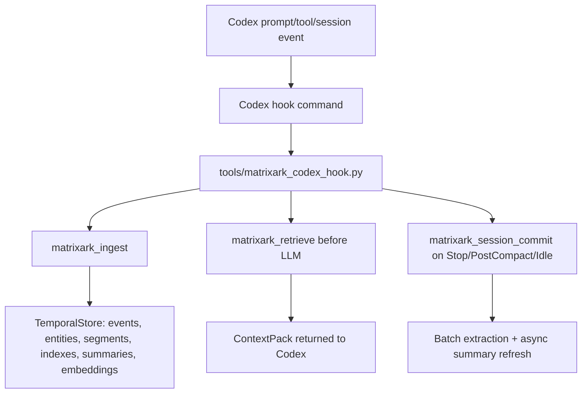
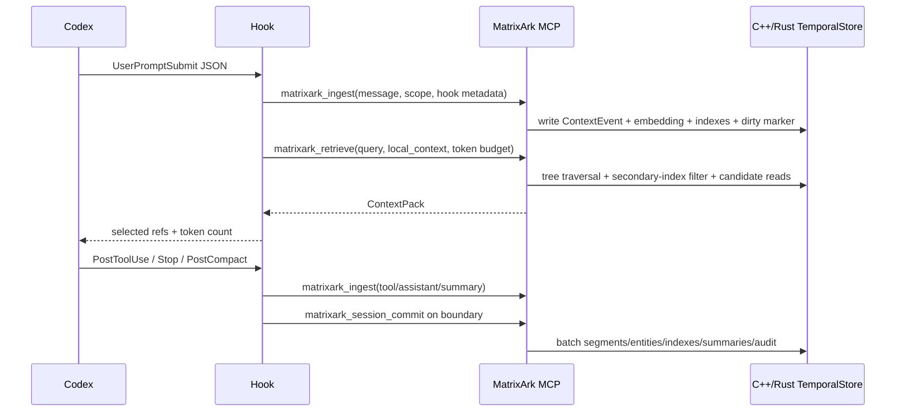

# MatrixArk Codex MCP And Hook Installation Manual

This manual explains how Codex connects to MatrixArk, how automatic hooks differ from MCP tool calls, and how to call the MatrixArk ingestion, extraction, retrieval, feedback, replay, resource, and skill APIs from Codex.

MatrixArk should not require Codex, Claude, Cursor, or another agent to understand MatrixArk's internal data models. The agent sends messages, local context hints, files, and lifecycle events. MatrixArk resolves identity, extracts context, writes TemporalStore records, refreshes summaries, retrieves a ContextPack, and records audit/replay data.

## 1. Two Integration Modes



Use both modes when possible:

| Mode | What it does | When to use |
|---|---|---|
| MCP tools | Exposes `matrixark_ingest`, `matrixark_retrieve`, `matrixark_feedback`, `matrixark_replay`, admin, resource, and skill APIs to Codex. | Reliable default in Codex Desktop and Codex CLI. Good for explicit agent calls and debugging. |
| Codex hooks | Automatically captures lifecycle events and calls MatrixArk without the agent remembering to call tools. | Best for always-on ingestion, retrieval before LLM, tool-result capture, and session commits. |

Important: MCP by itself does not automatically ingest every message. Codex must call the MCP tool, or a hook must call the MCP server on each lifecycle event.

## 2. Install MatrixArk MCP For Codex

### Recommended local C++ TemporalStore MCP config

Add this to `C:\Users\Deeproute\.codex\config.toml`:

```toml
[mcp_servers.matrixark]
command = "wsl.exe"
args = ["--cd", "/root/src/github-services/TemporalStore", "-e", "bash", "-lc", "exec tools/matrixark_mcp_cpp_server.sh"]
startup_timeout_sec = 180
```

Why `startup_timeout_sec` matters: if the C++ TemporalStore topology or OSS models are warming up, Codex can otherwise report:

```text
MCP client for `matrixark` timed out after 120 seconds.
```

Set `startup_timeout_sec = 180` or `240` for local development.

### Rust backend MCP config

Use this when validating Rust parity:

```toml
[mcp_servers.matrixark]
command = "wsl.exe"
args = ["--cd", "/root/src/github-services/TemporalStore", "-e", "bash", "-lc", "exec tools/matrixark_mcp_rust_server.sh"]
startup_timeout_sec = 180
```

If a Rust-specific launcher is not present in a checkout, use the generic MCP server with environment variables:

```toml
[mcp_servers.matrixark]
command = "wsl.exe"
args = ["--cd", "/root/src/github-services/TemporalStore", "-e", "bash", "-lc", "MATRIXARK_MCP_BACKEND=temporalstore-rust exec python3 tools/matrixark_mcp_server.py --line-json"]
startup_timeout_sec = 180
```

### Local debug MCP config

Use this only for API debugging without C++/Rust storage:

```toml
[mcp_servers.matrixark]
command = "wsl.exe"
args = ["--cd", "/root/src/github-services/TemporalStore", "-e", "bash", "-lc", "MATRIXARK_MCP_BACKEND=local exec python3 tools/matrixark_mcp_server.py --line-json"]
startup_timeout_sec = 60
```

Restart Codex after editing `config.toml`.

## 3. Backend Environment Variables

The C++ hook launcher `tools/matrixark_codex_cpp_hook.sh` defaults to:

```bash
MATRIXARK_MCP_BACKEND=temporalstore-direct
MATRIXARK_TEMPORALSTORE_METASERVER=127.0.0.1:18000
MATRIXARK_TEMPORALSTORE_NAMESPACE=deploy_ns
MATRIXARK_TEMPORALSTORE_TABLE=deploy_table
MATRIXARK_TEMPORALSTORE_PREFIX=matrixark:codex-hook
TEMPORALSTORE_LIB=/root/src/github-services/TemporalStore/output-ubuntu22/release/sdk/lib/libbcache2.so
MATRIXARK_HOOK_FAIL_OPEN=1
MATRIXARK_HOOK_AUTOSTART_CPP=1
```

The Rust hook launcher `tools/matrixark_codex_rust_hook.sh` defaults to:

```bash
MATRIXARK_MCP_BACKEND=temporalstore-rust
MATRIXARK_TEMPORALSTORE_PREFIX=matrixark:codex-hook:rust
MATRIXARK_TEMPORALSTORE_RUST_CLI=/root/src/github-services/TemporalStore/sdk/rust/temporalstore/target/release/matrixark_record_log
MATRIXARK_HOOK_FAIL_OPEN=1
```

Production hook mode should not write a local JSONL record log. Set
`MATRIXARK_MCP_PROFILE=production` and use `MATRIXARK_MCP_BACKEND` with
`temporalstore-direct` or `temporalstore-rust`; when the backend is omitted in
production profile, MatrixArk defaults to the native TemporalStore path and
refuses local `record_log` unless `MATRIXARK_ALLOW_LOCAL_BACKEND=1` is set for
debugging.

Local identity defaults for hooks:

```bash
MATRIXARK_ACCOUNT_ID=acct_codex
MATRIXARK_TENANT_ID=tenant_codex
MATRIXARK_USER_ID=$USERNAME
MATRIXARK_TEAM=codex
MATRIXARK_PROJECT=local
MATRIXARK_SESSION_COMMIT_THRESHOLD=20
MATRIXARK_IDLE_COMMIT_TIMEOUT_MS=600000
MATRIXARK_HOOK_MAX_CONTEXT_TOKENS=1024
```

For local product mode, MatrixArk can also use these defaults:

```text
account_id = acct_local
tenant_id  = derived from agent name, for example tenant_codex
user_id    = local OS user unless an API key/SSO mapping resolves a MatrixArk user
session_id = optional; captured from hook/MCP payload when available
```

In cloud mode, the API key resolves and enforces the final account, tenant, user, scopes, and allowed sessions. The agent can send hints, but MatrixArk remains the authority.

## 4. Install Codex Hooks

Codex hook availability depends on the Codex surface/version. If hooks are not visible in the desktop command palette, use MCP tools first. If the Codex runtime supports `.codex/hooks.json`, install lifecycle hooks like this in the project or user Codex config area:

```json
{
  "hooks": {
    "UserPromptSubmit": [
      {
        "command": "/root/src/github-services/TemporalStore/tools/matrixark_codex_cpp_hook.sh --event UserPromptSubmit",
        "timeout_ms": 60000
      }
    ],
    "PostToolUse": [
      {
        "command": "/root/src/github-services/TemporalStore/tools/matrixark_codex_cpp_hook.sh --event PostToolUse",
        "timeout_ms": 60000
      }
    ],
    "Stop": [
      {
        "command": "/root/src/github-services/TemporalStore/tools/matrixark_codex_cpp_hook.sh --event Stop",
        "timeout_ms": 60000
      }
    ],
    "PostCompact": [
      {
        "command": "/root/src/github-services/TemporalStore/tools/matrixark_codex_cpp_hook.sh --event PostCompact",
        "timeout_ms": 60000
      }
    ]
  }
}
```

Use the Rust hook launcher for Rust parity:

```json
{
  "hooks": {
    "UserPromptSubmit": [
      {
        "command": "/root/src/github-services/TemporalStore/tools/matrixark_codex_rust_hook.sh --event UserPromptSubmit",
        "timeout_ms": 60000
      }
    ],
    "Stop": [
      {
        "command": "/root/src/github-services/TemporalStore/tools/matrixark_codex_rust_hook.sh --event Stop",
        "timeout_ms": 60000
      }
    ]
  }
}
```

Recommended hook lifecycle:

| Codex event | MatrixArk action |
|---|---|
| `UserPromptSubmit` | Ingest user message, append session buffer, retrieve ContextPack before LLM. |
| `PostToolUse` | Ingest tool result summary, file refs, command state, and useful output. |
| `Stop` | Ingest assistant/final signal and force session commit. |
| `PostCompact` | Ingest compacted session summary and force session commit. |
| `IdleTimeout` / `SessionIdle` | Commit pending session window without requiring a new message. |

## 5. What Codex Sends

Codex hook payloads vary. `tools/matrixark_codex_hook.py` extracts message text from common fields:

```text
prompt
user_prompt
input
text
message
params.prompt
params.input
params.text
turn.input
messages[].content
items[].content
raw_text
```

It extracts session identity in this order:

```text
1. explicit --session-id or MATRIXARK_SESSION_ID
2. payload fields: session_id, thread_id, conversation_id, transcript_id
3. payload path hash: transcript_path, conversation_path, thread_path, log_path
4. persisted local fallback under MATRIXARK_CODEX_SESSION_STATE_DIR
```

It also preserves compact local context when present:

```text
local_context
context
open_files
active_files
files
buffers
selected_text
selection
tool_outputs
terminal_output
```

Codex does not need to send MatrixArk schemas. It sends what it knows. MatrixArk extracts `ContextEvent`, `ContextEntity`, `ContextSegment`, `ContextIndex`, `ContextSummary`, and `ContextEmbedding` internally.

## 6. End-To-End Hook Behavior



On a single incoming message, MatrixArk does lightweight online work:

```text
one message arrives
-> write ContextEvent
-> write event embedding
-> write session_buffer_event
-> update lightweight session/node summaries
-> mark node summary dirty
-> retrieve ContextPack if this is UserPromptSubmit
-> return immediately
```

Later, batch extraction runs:

```text
pending messages >= 20, or Stop/PostCompact, or idle timeout, or manual commit
-> one-pass batch extraction
-> write ContextSegment records
-> update ContextEntity state
-> write ContextIndex records
-> write batch summary and embeddings
-> clear/supersede session buffer markers
```

## 7. MCP API Calls

The examples below are what Codex or any MCP client can call. The MCP server schema enforces required fields; optional fields can be omitted for local debugging.

### Ingest one message

Minimal local message:

```json
{
  "messages": [
    {"role": "user", "content": "Alice approved the GPU request after finance reviewed the budget."}
  ]
}
```

Scoped message with hook metadata:

```json
{
  "kind": "message",
  "messages": [
    {"role": "user", "content": "Alice approved the GPU request after finance reviewed the budget."}
  ],
  "scope": {
    "account_id": "acct_local",
    "tenant_id": "tenant_codex",
    "user_id": "deeproute",
    "session_id": "codex:local:demo"
  },
  "metadata": {
    "source": "codex_mcp",
    "node_path": [
      "account:acct_local",
      "tenant:tenant_codex",
      "principal:user:deeproute",
      "collection:sessions",
      "session:codex:local:demo"
    ]
  },
  "agent_hook": {
    "source": "codex",
    "hook_type": "before_llm",
    "hook_id": "manual-demo-001",
    "observed_at_ms": 1782420000000,
    "trigger": "UserPromptSubmit",
    "auto_captured": true
  }
}
```

### Batch extract a session window

Use this for VikingMem-style logical session extraction after enough messages accumulate:

```json
{
  "messages": [
    {"role": "user", "content": "I prefer Qwen for local tests."},
    {"role": "assistant", "content": "Noted. We'll use Qwen locally."},
    {"role": "user", "content": "Also keep C++ TemporalStore as the production baseline."}
  ],
  "scope": {
    "account_id": "acct_local",
    "tenant_id": "tenant_codex",
    "user_id": "deeproute",
    "session_id": "codex:local:demo"
  },
  "threshold_messages": 20,
  "force": true,
  "metadata": {"source": "manual_batch_extract"}
}
```

### Commit pending session events

```json
{
  "scope": {
    "account_id": "acct_local",
    "tenant_id": "tenant_codex",
    "user_id": "deeproute",
    "session_id": "codex:local:demo"
  },
  "commit_reason": "hook_boundary",
  "threshold_messages": 20,
  "force": true
}
```

Commit policies:

```text
pending messages >= 20  -> threshold commit
Stop/PostCompact        -> hook_boundary commit
idle > 10-30 minutes    -> idle_timeout commit
agent request           -> manual_api commit
rolling window          -> commit next 20 pending messages, not the whole session
```

### Retrieve context

```json
{
  "query": "What GPU approvals are current, and what budget risks were mentioned?",
  "scope": {
    "account_id": "acct_local",
    "tenant_id": "tenant_codex",
    "user_id": "deeproute",
    "session_id": "codex:local:demo"
  },
  "max_context_tokens": 2048,
  "local_context": [
    {"ref": "open-buffer:planner.md", "text": "GPU budget planning notes..."}
  ]
}
```

Retrieval flow:

```text
raw query
-> query understanding
-> secondary-index filter planning
-> tree-first traversal with node_l0/node_l1 embeddings
-> retrieve events/entities/segments/resources/skills
-> staleness and temporal scoring
-> token-budget packing
-> ContextPack + ContextPackAudit
```

### Feedback

```json
{
  "context_pack_id": "ctxpack_123",
  "messages": [
    {"role": "assistant", "content": "Final answer: Alice approved the GPU request, but finance still needs the latest budget revision."}
  ],
  "accepted_refs": ["context_event:approval_gpu_1"],
  "rejected_refs": [],
  "scope": {
    "account_id": "acct_local",
    "tenant_id": "tenant_codex",
    "user_id": "deeproute",
    "session_id": "codex:local:demo"
  }
}
```

Short feedback such as `yes`, `correct`, or `approved` is only treated as confirmation when MatrixArk has prior context: a `context_pack_id`, accepted refs, or bounded same-session prior messages/summaries.

### Replay

```json
{
  "context_pack_id": "ctxpack_123",
  "scope": {
    "account_id": "acct_local",
    "tenant_id": "tenant_codex",
    "user_id": "deeproute"
  }
}
```

Replay explains what was selected, dropped, blocked, repaired, or used as prior context.

### Ingestion dashboard

```json
{
  "scope": {
    "account_id": "acct_local",
    "tenant_id": "tenant_codex",
    "user_id": "deeproute"
  },
  "table": "messages",
  "page_size": 50
}
```

Supported dashboard tables include messages, resources, skills, events, entities, and context packs when enabled by the backend.

## 8. Resource And Skill Ingestion Through MCP

### Local resource file

```json
{
  "kind": "resource",
  "messages": [
    {"role": "user", "content": "Import resource file:///home/deeproute/docs/runbook.pdf"}
  ],
  "raw_uri": "file:///home/deeproute/docs/runbook.pdf",
  "resource_type": "pdf",
  "raw_storage_mode": "local",
  "wait": true,
  "scope": {
    "account_id": "acct_local",
    "tenant_id": "tenant_codex",
    "user_id": "deeproute"
  },
  "metadata": {
    "source": "codex_resource_import",
    "node_path": ["account:acct_local", "tenant:tenant_codex", "principal:user:deeproute", "collection:resources"]
  }
}
```

### Cloud resource file

For MatrixArk cloud, the agent can either send an existing S3/object-store URI or upload through MatrixArk first if that upload API is enabled. After upload, the ingest call should contain the stable `raw_uri`:

```json
{
  "kind": "resource",
  "messages": [
    {"role": "user", "content": "Import cloud resource s3://matrixark-user-files/acct_local/runbook.pdf"}
  ],
  "raw_uri": "s3://matrixark-user-files/acct_local/runbook.pdf",
  "resource_type": "pdf",
  "raw_storage_mode": "s3",
  "s3_bucket": "matrixark-user-files",
  "s3_prefix": "acct_local/",
  "wait": false,
  "scope": {
    "account_id": "acct_local",
    "tenant_id": "tenant_codex",
    "user_id": "deeproute"
  }
}
```

Raw bytes are not stored in TemporalStore. TemporalStore stores `raw_uri`, chunks, citations, summaries, embeddings, indexes, registry records, import task state, and replay/audit records.

### Skill bundle or SKILL.md

```json
{
  "kind": "skill",
  "messages": [
    {"role": "user", "content": "Import skill file:///home/deeproute/.codex/skills/build-debug/SKILL.md"}
  ],
  "raw_uri": "file:///home/deeproute/.codex/skills/build-debug/SKILL.md",
  "resource_type": "skill",
  "raw_storage_mode": "local",
  "wait": true,
  "scope": {
    "account_id": "acct_local",
    "tenant_id": "tenant_codex",
    "user_id": "deeproute"
  },
  "metadata": {
    "source": "codex_skill_import",
    "node_path": ["account:acct_local", "tenant:tenant_codex", "principal:user:deeproute", "collection:skills"]
  }
}
```

Skill ingestion writes:

```text
SkillManifest
SkillSection
ResourceChunk(resource_type=skill)
ContextSummary(skill_l0 / skill_summary)
ContextEmbedding(skill_l0, skill_summary, skill sections/chunks)
ContextIndex(skill_name, skill_trigger, skill_tool, source_type=skill)
```

Retrieval selects only relevant skill sections, never the full skill bundle by default.

## 9. Manual Hook Smoke Tests

### Local backend hook smoke

```bash
cd /root/src/github-services/TemporalStore
printf '%s\n' '{"prompt":"Alice approved the GPU request.","thread_id":"manual-hook-demo","cwd":"/root/src/github-services/TemporalStore"}' \
  | MATRIXARK_MCP_BACKEND=local \
    python3 tools/matrixark_codex_hook.py \
      --event UserPromptSubmit \
      --backend local \
      --event-log /tmp/matrixark-hook-local.jsonl
```

Expected output includes:

```json
{
  "status": "ok",
  "event": "UserPromptSubmit",
  "session_id": "codex:manual-hook-demo",
  "retrieve": {
    "selected_ref_count": 1
  }
}
```

### C++ TemporalStore hook smoke

```bash
cd /root/src/github-services/TemporalStore
printf '%s\n' '{"prompt":"Alice approved the GPU request.","thread_id":"manual-hook-cpp","cwd":"/root/src/github-services/TemporalStore"}' \
  | MATRIXARK_ACCOUNT_ID=acct_local \
    MATRIXARK_TENANT_ID=tenant_codex \
    MATRIXARK_USER_ID="${USER:-deeproute}" \
    tools/matrixark_codex_cpp_hook.sh --event UserPromptSubmit
```

### Rust TemporalStore hook smoke

```bash
cd /root/src/github-services/TemporalStore
printf '%s\n' '{"prompt":"Alice approved the GPU request.","thread_id":"manual-hook-rust","cwd":"/root/src/github-services/TemporalStore"}' \
  | MATRIXARK_ACCOUNT_ID=acct_local \
    MATRIXARK_TENANT_ID=tenant_codex \
    MATRIXARK_USER_ID="${USER:-deeproute}" \
    tools/matrixark_codex_rust_hook.sh --event UserPromptSubmit
```

## 10. MCP Smoke Test

List tools through the configured C++ MCP launcher:

```powershell
$req = '{"jsonrpc":"2.0","id":1,"method":"tools/list","params":{}}' + "`n"
Set-Content -NoNewline -Encoding ascii "$env:TEMP\matrixark-mcp-smoke.jsonl" $req
wsl --cd /root/src/github-services/TemporalStore -e bash -lc 'timeout 30s tools/matrixark_mcp_cpp_server.sh --line-json < /mnt/c/Users/Deeproute/AppData/Local/Temp/matrixark-mcp-smoke.jsonl | head -c 1000'
```

Call a tool directly over line JSON:

```bash
cd /root/src/github-services/TemporalStore
cat > /tmp/matrixark-ingest-call.jsonl <<'JSON'
{"jsonrpc":"2.0","id":1,"method":"tools/call","params":{"name":"matrixark_ingest","arguments":{"messages":[{"role":"user","content":"Alice approved the GPU request."}],"scope":{"account_id":"acct_local","tenant_id":"tenant_codex","user_id":"deeproute","session_id":"manual-mcp-demo"}}}}
JSON
MATRIXARK_MCP_BACKEND=local python3 tools/matrixark_mcp_server.py --line-json < /tmp/matrixark-ingest-call.jsonl
```

## 11. What To Verify In MatrixArk

After a successful hook or MCP ingest, check:

```text
matrixark_ingestion_dashboard(table=messages)
matrixark_ingestion_dashboard(table=events)
matrixark_ingestion_dashboard(table=entities)
matrixark_ingestion_dashboard(table=context_packs)
matrixark_retrieve(query="what did Alice approve?")
matrixark_replay(context_pack_id="...")
```

Expected data model flow:

```text
message/hook payload
-> ContextEvent(raw replayable evidence)
-> ContextEmbedding(event_text)
-> session_buffer_event
-> ContextIndex(event_type, entity_type, keywords, source_type, session/user scope)
-> ContextSummaryDirty
-> async ContextSummary(node_l0/node_l1)
-> ContextEmbedding(node_l0/node_l1)
-> ContextPackAudit after retrieval
```

For resource/skill imports, also check:

```text
ResourceImportTask
ResourceManifest / ResourceRegistry
ResourceChunk
SkillManifest / SkillRegistry
SkillSection
ContextSummary(resource_l0 / skill_l0)
ContextEmbedding(resource_chunk / skill section / summaries)
ContextIndex(source_type, resource_type, unit_kind, heading_slug, relative_path, skill_trigger, skill_tool)
```

## 12. Troubleshooting

| Symptom | Likely cause | Fix |
|---|---|---|
| MCP startup timeout | C++/Rust backend or models are warming up. | Increase `startup_timeout_sec` to 180 or 240. |
| `MATRIXARK_CPP_TEMPORALSTORE_ENDPOINT is not set` | HTTP gateway mode requested but endpoint is missing. | Use `tools/matrixark_mcp_cpp_server.sh` direct SDK mode or set the gateway endpoint. |
| `Slot not found` / `Partition info not found` | TemporalStore topology is still installing slots. | Run backend readiness/warmup and retry after metaserver reports slot coverage. |
| MCP tools work but messages are not automatic | MCP is callable, not a lifecycle hook by itself. | Install hook commands or ask Codex to call `matrixark_ingest` explicitly. |
| Hook blocks Codex | Backend slow or unavailable. | Keep `MATRIXARK_HOOK_FAIL_OPEN=1` so Codex continues and MatrixArk logs a warning. |
| No stable session id | Codex payload lacks thread/session fields. | Set `MATRIXARK_SESSION_ID` or rely on the fallback state file under `MATRIXARK_CODEX_SESSION_STATE_DIR`. |
| OSS model fallback | Model path missing or network download failed. | Set `MATRIXARK_EMBEDDING_MODEL_PATH` and use local downloaded model files. |

## 13. Production Defaults

For production-like Codex integration:

```text
C++ TemporalStore remains the production-performance baseline.
Rust TemporalStore should use the long-lived gateway/binding path, not process-per-operation CLI mode.
Hooks should fail open to avoid breaking the agent loop.
MCP API keys should scope account/tenant/user/session access.
MatrixArk should own extraction and schema mapping; agents send simple messages, files, and hints.
Summaries refresh asynchronously; ingestion should not wait for L0/L1 regeneration.
ContextPackAudit and replay should be enabled for every retrieval.
```

## 14. Minimal Agent Contract

For a normal message, the smallest useful MCP call is:

```json
{
  "messages": [
    {"role": "user", "content": "The finance owner approved the GPU budget."}
  ]
}
```

For reliable multi-user isolation, send at least:

```json
{
  "messages": [
    {"role": "user", "content": "The finance owner approved the GPU budget."}
  ],
  "scope": {
    "account_id": "acct_local",
    "tenant_id": "tenant_codex",
    "user_id": "deeproute",
    "session_id": "codex:thread:123"
  }
}
```

MatrixArk can infer defaults locally, but production should use an API key and explicit or hook-captured `user_id` / `session_id` for audit and isolation.
