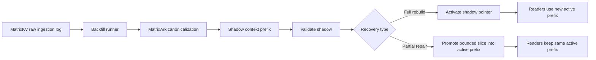

# MatrixArk Context Backfill Manual

## Overview

MatrixArk context backfill replays the MatrixArk raw ingestion log stored in MatrixKV or TemporalStore into a context-serving prefix. It is built for LLM context management recovery and migration work where the source raw log must remain immutable while serving indexes, summaries, entities, embeddings, and audit records are rebuilt or repaired.

The default workflow is shadow-first:

1. Read raw records from the live dual-write source prefix such as `matrixark:mcp:raw_ingestion`. Older deployments that used a different raw prefix can still pass it explicitly with `--source-prefix`.
2. Materialize serving records with the same MatrixArk canonicalization path used by live ingestion.
3. Write those serving records into a separate target prefix.
4. Validate the target prefix.
5. Either activate the whole shadow prefix or promote only a bounded repair slice into the active prefix.

The runner is intentionally conservative. It does not delete source records, it does not mutate source records, and it requires explicit confirmation for in-place writes, activation, and incremental repair promotion.

## When To Use It

Use this backfill path for:

- rebuilding a new context-serving prefix from the raw MatrixArk ingestion log
- repairing a bounded sequence gap after a partition restore
- replaying tenant, user, or session-specific slices
- validating a shadow context prefix before production cutover
- promoting a partial repair into the active prefix without switching the whole active pointer
- auditing the exact source range and filters used for a recovery job

Avoid it for arbitrary MatrixKV keyspace scans. The source is the MatrixArk direct-adapter raw record log format, not a generic key discovery tool.

## Mental Model



The raw log is the durable source of truth. The context-serving prefix is derived state. Shadow backfills and partial repairs are ways to rebuild derived state safely.

## Source Log Layout

The preferred source layout is the sharded direct-adapter log:

```text
<prefix>:record_count
<prefix>:records:<000000 shard> field <00000000000000000000 offset> -> JSON record
```

Example:

```text
matrixark:mcp:raw_ingestion:record_count = 2500000
matrixark:mcp:raw_ingestion:records:000012 field 00000000000000012345 -> { ... raw record ... }
```

Live ingestion writes raw API, batch, stream, resource, and feedback envelopes to this raw prefix before writing materialized serving records to the active TemporalStore context prefix. The raw-message store is selectable:

- `temporalstore` is the default. Use it when TemporalStore should be the single system for immutable raw messages and derived context-serving records.
- `matrixkv` is the alternate raw-message store. Use it when MatrixKV should remain the raw ingestion log while TemporalStore serves materialized context.

That dual-write contract keeps the raw log immutable and keeps serving scans free of raw envelopes.

Pass the selected source store with `--raw-backend=temporalstore` or `--raw-backend=matrixkv`. The prefix layout is the same, but the backend label is part of checkpoint fingerprints, generated idempotency keys, manifests, Prometheus labels, and target append options. This prevents a MatrixKV repair job from accidentally resuming a TemporalStore raw-log job with the same source and target prefixes.

The runner also supports the legacy index layout:

```text
<prefix>:record_index
<prefix>:records field <record_id> -> JSON record
```

If both metadata keys are missing, the runner can fall back to bounded hash scanning over:

```text
<prefix>:records:<shard>
```

The scan starts at `--start-seq`, respects `--end-seq`, and stops after `--source-scan-max-empty-shards` consecutive empty shards when no explicit end sequence is supplied.

## Target Layout

A target prefix stores materialized serving records in the same sharded format:

```text
<target-prefix>:record_count
<target-prefix>:records:<000000 shard> field <00000000000000000000 offset> -> JSON serving record
<target-prefix>:idempotency field <idempotency_key> -> target sequence
<target-prefix>:dead_letter field <sequence> -> failed source record preview
<target-prefix>:dead_letter_count
<target-prefix>:backfill_manifest field <job_id> -> JSON manifest
```

The manifest records the source prefix, target prefix, mode, source range, partial filters, checkpoint key, and final summary. This is the main audit artifact for production recovery.

## Modes

| Mode | Purpose | Mutates source | Mutates target | Confirmation required |
| --- | --- | --- | --- | --- |
| `shadow` | Build a separate derived context prefix | No | Yes | No |
| `validate_shadow` | Dry-run source scan and compare expected count to target | No | No | No |
| `activate_shadow` | Flip active prefix pointer to a validated shadow prefix | No | Metadata only | `--confirm-activate=YES` |
| `rollback_activation` | Restore the previous active prefix recorded by an activation job | No | Metadata only | `--confirm-rollback=YES` |
| `incremental_repair` | Promote a bounded shadow repair slice into active prefix | No | Yes | `--confirm-incremental-repair=YES` |
| `in_place` | Write derived records into source prefix | No source deletion, but same prefix is target | Yes | `--confirm-in-place=YES` |

Production use should prefer `shadow`, `validate_shadow`, `activate_shadow`, `rollback_activation`, and `incremental_repair`. `in_place` is intentionally guarded and should be rare.

## Quick Start: Full Shadow Backfill

Use the wrapper for Ubuntu 22 local or server-style operation:

```bash
JOB_ID=context-backfill-001 \
SOURCE_PREFIX=matrixark:mcp:raw_ingestion \
RAW_BACKEND=temporalstore \
TARGET_PREFIX=matrixark:context_backfill:context-backfill-001 \
DRY_RUN=0 \
BATCH_SIZE=1024 \
bash tools/run_matrixark_context_backfill_ubuntu22.sh
```

Equivalent direct Python invocation:

```bash
python3 tools/matrixark_context_backfill.py \
  --metaserver=127.0.0.1:65000 \
  --namespace=matrixark \
  --table=context \
  --source-prefix=matrixark:mcp:raw_ingestion \
  --raw-backend=temporalstore \
  --target-prefix=matrixark:context_backfill:context-backfill-001 \
  --job-id=context-backfill-001 \
  --batch-size=1024 \
  --dry-run=0 \
  --resume=1
```

The command prints a JSON summary. It also writes Prometheus-compatible metrics when `--prometheus-output` is set, or when the wrapper uses its default `/tmp/matrixark_context_backfill_<job_id>.prom` path.

MatrixKV raw-log source option:

```bash
MATRIXARK_RAW_INGESTION_BACKEND=matrixkv \
python3 tools/matrixark_context_backfill.py \
  --source-prefix=matrixark:mcp:raw_ingestion \
  --raw-backend=matrixkv \
  --target-prefix=matrixark:context_backfill:matrixkv-source-trial \
  --job-id=matrixkv-source-trial \
  --batch-size=1024 \
  --dry-run=0 \
  --resume=1
```

## Dry Run First

The default is `--dry-run=1`. A dry run scans and materializes in memory, but does not write target records, checkpoint state, manifests, or dead letters.

```bash
python3 tools/matrixark_context_backfill.py \
  --source-prefix=matrixark:mcp:raw_ingestion \
  --target-prefix=matrixark:context_backfill:trial \
  --job-id=trial \
  --batch-size=1024 \
  --dry-run=1
```

Use dry runs to estimate source volume, verify source readability, and inspect expected serving-record counts before writing anything.

## Backfill Throughput Benchmark

Use `tools/matrixark_context_backfill_benchmark.py` as the local repeatable speed gate for the backfill path itself. It seeds a local raw ingestion log, runs a full shadow backfill, builds a bounded incremental repair shadow, then promotes that repair into an active prefix. Run it for both raw-message store options before claiming a performance improvement.

```bash
python3 tools/matrixark_context_backfill_benchmark.py \
  --records=10000 \
  --batch-size=1024 \
  --incremental-records=1000 \
  --payload-bytes=128 \
  --raw-backends=both \
  --json-output=/tmp/matrixark_context_backfill_bench.json
```

For release or CI gating, add explicit minimum QPS thresholds. The command exits with code `2` and writes `status=failed` when either raw backend falls below the configured floor:

```bash
python3 tools/matrixark_context_backfill_benchmark.py \
  --records=10000 \
  --batch-size=1024 \
  --incremental-records=1000 \
  --payload-bytes=128 \
  --raw-backends=both \
  --min-full-shadow-qps=5000 \
  --min-incremental-repair-qps=1500 \
  --json-output=/tmp/matrixark_context_backfill_bench_gate.json
```

Key output:

| Field | Meaning |
| --- | --- |
| `results[].full_shadow.qps` | Materialized serving records written per second for a full shadow rebuild. |
| `results[].incremental_shadow.qps` | Serving records written per second while creating a bounded repair shadow. |
| `results[].incremental_repair.qps` | Active-prefix promotion throughput, including validation and bounded replay. |
| `qps_summary` | Average full and incremental QPS across the selected raw backends. |
| `performance_gate` | Optional per-backend pass/fail checks for `--min-full-shadow-qps` and `--min-incremental-repair-qps`. |

Local mode is an in-process correctness and regression signal. For production capacity numbers, run the same batch sizes through `tools/matrixark_context_backfill.py` against a real TemporalStore/MatrixKV deployment and compare the resulting JSON summaries and Prometheus output.

## Resume And Checkpoints

The checkpoint key is scoped to the job, source prefix, raw backend, target, and partial spec:

```text
matrixark:backfill:<job_id>:checkpoint:<hash(source_prefix,raw_backend,target_prefix,partial_spec)>
```

This prevents a partial repair from accidentally resuming from a full-backfill checkpoint, and it prevents TemporalStore raw-source jobs from sharing checkpoint state with MatrixKV raw-source jobs. With `--resume=1`, the next run starts after the last successfully processed source sequence for the exact same source, raw backend, target, and partial filter.

Checkpoint values are JSON audit records. Current runners write `version=2`, `last_sequence`, `updated_at_ms`, job/source/target/raw-backend labels, the partial filter spec, batch size, and committed counters for scanned, written, duplicate, failed, dead-letter, source batches, and target batches. Older checkpoints that contain only a bare integer sequence are still accepted, so existing jobs can resume after an upgrade.

Every run summary and manifest includes a `resume_state` block with `resume_requested`, `requested_start_seq`, `effective_start_seq`, `checkpoint_key`, `checkpoint_found`, `checkpoint_format`, and `checkpoint_last_sequence`. Use this block in runbooks and automation to prove whether a job resumed from a JSON checkpoint, a legacy integer checkpoint, or no checkpoint at all.

Checkpoints advance after the pending target batch is flushed and counted. After a restart, the runner may replay at most the last uncommitted batch. Target-side idempotency keys prevent duplicate appends for already written records.

Use `--resume=0` when intentionally rerunning a job from `--start-seq`.

## Dead Letters

A corrupt, missing, or unreadable source record increments `failed` and `dead_letter`. The runner writes a bounded preview to:

```text
<target-prefix>:dead_letter
<target-prefix>:dead_letter_count
```

By default, a bad record does not stop the job. Use `--fail-fast` for debugging or for strict migration gates where any bad source record should stop the run.


## Dual-Write Ingestion Performance Benchmark

Live ingestion now writes every incoming MatrixArk payload to two places before the ingestion call returns:

1. the immutable raw-message ingestion log under `matrixark:mcp:raw_ingestion`, stored in TemporalStore by default or MatrixKV when selected
2. the materialized TemporalStore context-serving log under the active serving prefix

Use `tools/matrixark_dual_write_ingestion_benchmark.py` to measure that synchronous path. The timer wraps `append_many`, so reported QPS and latency include both native append calls: raw-message append plus serving TemporalStore append.

Local smoke, no TemporalStore cluster required:

```bash
python3 tools/matrixark_dual_write_ingestion_benchmark.py \
  --mode=local \
  --records=10000 \
  --workers=4 \
  --batch-size=128 \
  --payload-bytes=128 \
  --raw-backend=temporalstore \
  --json-output=/tmp/matrixark_dual_write_bench.json
```

Local MatrixKV raw-message option:

```bash
MATRIXARK_RAW_INGESTION_BACKEND=matrixkv \
python3 tools/matrixark_dual_write_ingestion_benchmark.py \
  --mode=local \
  --records=10000 \
  --workers=4 \
  --batch-size=128 \
  --payload-bytes=128 \
  --raw-backend=matrixkv
```

Direct TemporalStore/MatrixKV measurement against a running local cluster:

```bash
TEMPORALSTORE_LIBRARY_PATH=/path/to/libtemporalstore_sdk.so \
python3 tools/matrixark_dual_write_ingestion_benchmark.py \
  --mode=direct \
  --metaserver=127.0.0.1:65000 \
  --namespace=matrixark \
  --table=context \
  --storage-prefix=matrixark:mcp:bench \
  --records=100000 \
  --workers=8 \
  --batch-size=256 \
  --payload-bytes=256 \
  --raw-backend=temporalstore
```

Key output fields:

| Field | Meaning |
| --- | --- |
| `ingestion_qps` | Records per second observed by callers after both writes complete. |
| `caller_visible_batch_latency_ms` | Latency percentiles for one `append_many` call, including raw and serving writes. |
| `caller_visible_record_latency_ms_estimate` | Batch latency divided by batch size, useful for quick per-record comparison across batch sizes. |
| `raw_backend` | Raw-message storage option measured by the run: `temporalstore` or `matrixkv`. |
| `raw_record_count_observed` | Raw-message ingestion records appended. This should equal `records`. |
| `serving_log_entries_observed` | Serving append-log entries. This can be lower than raw records because the serving path can bundle records and also writes secondary index entries. |
| `local_native_call_counts` | Local-mode proof that both the selected raw append path and `native_append_queue` were called. |
| `dual_write_return_policy` | Confirms the measured return boundary: raw append and serving append both finished before return. |

Recommended scale matrix:

| Profile | Records | Workers | Batch size | Payload | Purpose |
| --- | ---: | ---: | ---: | ---: | --- |
| smoke | 1,000 | 2-4 | 50-128 | 64-128 B | validates the benchmark and dual-write counters |
| baseline | 100,000 | 4 | 128 | 128 B | comparable daily regression signal |
| high concurrency | 1,000,000 | 8-32 | 256-1024 | 256 B | saturates ingestion write path |
| large payload | 100,000 | 4-8 | 64-256 | 1-4 KB | measures context-rich payload impact |

For production-style numbers, use `--mode=direct` with a real local or Docker TemporalStore cluster. Local mode is intentionally a fast correctness and harness smoke; it does not represent disk, network, Raft, or shared-store latency.

## Batch Backfills

Batch backfills are the normal path for full or large-range rebuilds. A batch backfill is not a different mode; it is `shadow` mode with a production-sized `--batch-size`, resumable checkpoints, and batch read/write APIs enabled by the backend.

Use batch backfills when:

- rebuilding a full context-serving prefix
- replaying a large raw-log sequence range
- running a tenant-wide repair with many matching records
- validating sustained MatrixKV or TemporalStore ingestion throughput

The runner batches source references first, then uses `batch_hget` when the backend exposes it. Materialized target records are accumulated up to `--batch-size` and written with `matrixark_append_records` when available, then `batch_hset`, then single-record fallback.

### Batch Size Guide

| Workload | Suggested `--batch-size` | Notes |
| --- | --- | --- |
| Small repair | `128` to `256` | Better control and easier debugging |
| Normal production backfill | `1024` | Good default for throughput and memory |
| Large rebuild with stable target latency | `2048` to `4096` | Increase only after watching write latency and memory |
| Unstable target or high dead-letter risk | `128` to `512` | Keeps retry windows smaller |

A larger batch improves throughput only when target append latency remains stable. If target writes slow down, increase in-flight timeouts or reduce `--batch-size` before rerunning.

### Batch Backfill Example

```bash
python3 tools/matrixark_context_backfill.py \
  --source-prefix=matrixark:mcp:raw_ingestion \
  --target-prefix=matrixark:context_backfill:full-20260702 \
  --job-id=full-20260702 \
  --start-seq=0 \
  --batch-size=1024 \
  --dry-run=0 \
  --resume=1 \
  --prometheus-output=/tmp/matrixark_context_backfill_full_20260702.prom
```

For a bounded batch replay, always set both range endpoints:

```bash
python3 tools/matrixark_context_backfill.py \
  --source-prefix=matrixark:mcp:raw_ingestion \
  --target-prefix=matrixark:context_backfill:range-40m-45m \
  --job-id=range-40m-45m \
  --start-seq=40000000 \
  --end-seq=45000000 \
  --batch-size=2048 \
  --dry-run=0 \
  --resume=1
```

### Batch Backfill Production Checks

Before the run:

- confirm the source prefix and record-count/index metadata
- choose a unique target prefix and job id
- run the exact command with `--dry-run=1` first
- confirm expected `scanned`, `written`, and `filtered` counts
- confirm Prometheus output path and log capture

During the run:

- watch `source_batches`, `target_batches`, `scan_qps`, and target write latency
- watch `failed` and `dead_letter`; stop if they are unexpected
- watch `duplicate`; high duplicate on a first run usually means the target prefix was reused

After the run:

- run `validate_shadow` with the same source range and partial flags
- confirm `expected_records`, `actual_records`, `expected_type_counts`, and `actual_type_counts` match in strict mode
- preserve the manifest under `<target-prefix>:backfill_manifest`
- activate only after validation and context-quality checks pass

## Roll Back A Shadow Activation

Every successful `activate_shadow` stores the old active prefix under:

```text
<active-prefix-key>:previous:<activation-job-id>
```

If a newly activated shadow needs to be backed out, use `rollback_activation` with the activation job id. The command is metadata-only: it restores the active prefix pointer and writes a rollback audit record. It does not delete the shadow prefix or rewrite source raw records.

Dry run first:

```bash
python3 tools/matrixark_context_backfill.py \
  --mode=rollback_activation \
  --job-id=rollback-context-backfill-001-dry-run \
  --rollback-job-id=context-backfill-001 \
  --confirm-rollback=YES \
  --dry-run=1
```

Apply the rollback:

```bash
python3 tools/matrixark_context_backfill.py \
  --mode=rollback_activation \
  --job-id=rollback-context-backfill-001 \
  --rollback-job-id=context-backfill-001 \
  --confirm-rollback=YES \
  --dry-run=0
```

The rollback audit is stored at:

```text
<active-prefix-key>:rollback_audit field <rollback-job-id>
```

Keep the shadow prefix intact until readers and retrieval quality are confirmed after rollback.

## Partial Backfills

Partial backfills repair only a slice of raw ingestion data. They are useful after partition restore, tenant/session-specific recovery, or a known raw-log sequence gap.

A partial job is explicit:

```bash
--partial=1
```

By default, a partial job must include either a bounded sequence range or at least one filter. This guard prevents an accidental unbounded job that only looks partial by name.

### Partial Filters

Supported filters:

```text
--partial-record-types=context_event,context_summary
--partial-tenant-ids=tenant-a,tenant-b
--partial-user-ids=user-1,user-2
--partial-session-ids=session-1,session-2
--partial-filter-json='{"kind":"message"}'
--partial-filter-json='{"scope":{"team":"infra"}}'
```

Record type matches the raw record's top-level `record_type`. Tenant, user, and session filters check top-level fields and `scope` fields. JSON filters are exact-match filters for top-level fields; the special `scope` object matches individual scope keys.

### Partial Backfill Example

```bash
python3 tools/matrixark_context_backfill.py \
  --partial=1 \
  --partial-tenant-ids=tenant-a \
  --partial-session-ids=session-42 \
  --source-prefix=matrixark:mcp:raw_ingestion \
  --target-prefix=matrixark:context_repair:tenant-a-session-42 \
  --job-id=repair-tenant-a-session-42 \
  --start-seq=400000 \
  --end-seq=450000 \
  --batch-size=1024 \
  --dry-run=0 \
  --resume=1
```

`validate_shadow` also compares serving record type counts, not only total record counts. A shadow prefix with the right total count but the wrong materialized record types fails strict validation.

The summary includes:

```json
{
  "partial": {
    "enabled": true,
    "record_types": [],
    "tenant_ids": ["tenant-a"],
    "user_ids": [],
    "session_ids": ["session-42"],
    "filter_json": {}
  },
  "metrics": {
    "scanned": 50000,
    "filtered": 49120,
    "written": 880
  }
}
```

`filtered` means the source record was readable but did not match the partial spec.

## Validate Shadow

Before cutover or repair promotion, validate the candidate prefix:

```bash
python3 tools/matrixark_context_backfill.py \
  --mode=validate_shadow \
  --source-prefix=matrixark:mcp:raw_ingestion \
  --target-prefix=matrixark:context_backfill:context-backfill-001 \
  --job-id=context-backfill-001 \
  --batch-size=1024
```

Validation performs a dry-run source scan using the same range and partial filters. It compares expected materialized records to target record count and checks dead letters.

Strict validation is enabled by default. Use `--validation-strict=0` only when the target prefix is expected to contain validated extra records from a compatible previous run.

For partial validation, repeat the same partial flags used for the shadow job:

```bash
python3 tools/matrixark_context_backfill.py \
  --mode=validate_shadow \
  --partial=1 \
  --partial-session-ids=session-42 \
  --source-prefix=matrixark:mcp:raw_ingestion \
  --target-prefix=matrixark:context_repair:tenant-a-session-42 \
  --job-id=repair-tenant-a-session-42 \
  --start-seq=400000 \
  --end-seq=450000
```

## Full Activation

For a full rebuild, activation is a metadata flip. It does not copy records and does not rewrite source data.

```bash
python3 tools/matrixark_context_backfill.py \
  --mode=activate_shadow \
  --confirm-activate=YES \
  --source-prefix=matrixark:mcp:raw_ingestion \
  --target-prefix=matrixark:context_backfill:context-backfill-001 \
  --job-id=context-backfill-001 \
  --dry-run=0
```

The active prefix key defaults to:

```text
matrixark:context:active_prefix
```

Activation writes:

```text
matrixark:context:active_prefix = <target-prefix>
matrixark:context:active_prefix:previous:<job_id> = <previous-prefix>
matrixark:context:active_prefix:audit field <job_id> -> JSON audit
```

## Rollback After Full Activation

Rollback is another active-prefix metadata update to the previous prefix stored at:

```text
matrixark:context:active_prefix:previous:<job_id>
```

Do not delete source raw records during rollback. Do not rewrite source raw records. If the shadow prefix is bad, switch the active pointer back and keep the bad shadow prefix for audit until the incident review is complete.

## Incremental Backfills And Repair Promotion

Incremental backfills repair a bounded slice of derived context state without rebuilding or switching the entire active prefix. The safe production pattern is still shadow-first: build a shadow repair prefix, validate it, then promote the same bounded slice into the active prefix with `incremental_repair`.

Use incremental backfills when:

- only a source sequence range was missed
- only one tenant, user, or session needs repair
- a primary partition restore left derived serving data incomplete
- the existing active prefix should remain live
- replay cost for a full rebuild is unnecessary

Incremental repair is different from full activation:

| Property | Full activation | Incremental repair |
| --- | --- | --- |
| Writes new target records | During shadow build | During shadow build and active promotion |
| Changes active prefix pointer | Yes | No |
| Requires bounded range | Recommended | Required |
| Requires confirmation | `--confirm-activate=YES` | `--confirm-incremental-repair=YES` |
| Retry behavior | Revalidate and rerun activation | Safe to rerun; idempotency skips already promoted records |

### Incremental Prechecks

Before promoting a repair slice:

- identify the exact raw-log range with `--start-seq` and `--end-seq`
- use partial filters when the incident is tenant, user, or session scoped
- confirm the active prefix key resolves to the intended active context prefix
- build the shadow repair prefix with `--dry-run=0`
- run `validate_shadow` with the exact same range and partial filters
- confirm `failed == 0` and `dead_letter == 0` unless an incident owner explicitly accepts exceptions

### Step 1: Build Shadow Repair Prefix

```bash
python3 tools/matrixark_context_backfill.py \
  --partial=1 \
  --partial-session-ids=session-42 \
  --source-prefix=matrixark:mcp:raw_ingestion \
  --target-prefix=matrixark:context_repair:session-42 \
  --job-id=repair-session-42 \
  --start-seq=1200000 \
  --end-seq=1255000 \
  --batch-size=1024 \
  --dry-run=0 \
  --resume=1
```

### Step 2: Validate Shadow Repair Prefix

```bash
python3 tools/matrixark_context_backfill.py \
  --mode=validate_shadow \
  --partial=1 \
  --partial-session-ids=session-42 \
  --source-prefix=matrixark:mcp:raw_ingestion \
  --target-prefix=matrixark:context_repair:session-42 \
  --job-id=repair-session-42 \
  --start-seq=1200000 \
  --end-seq=1255000
```

### Step 3: Promote Into Active Prefix

```bash
python3 tools/matrixark_context_backfill.py \
  --mode=incremental_repair \
  --confirm-incremental-repair=YES \
  --partial=1 \
  --partial-session-ids=session-42 \
  --source-prefix=matrixark:mcp:raw_ingestion \
  --target-prefix=matrixark:context_repair:session-42 \
  --job-id=repair-session-42 \
  --start-seq=1200000 \
  --end-seq=1255000 \
  --batch-size=1024 \
  --dry-run=0
```

`incremental_repair` resolves the active prefix from `--active-prefix-key`. If that pointer is unavailable, pass the target explicitly:

```bash
--repair-active-prefix=matrixark:context:active
```

Promotion writes an audit entry to:

```text
matrixark:context:active_prefix:incremental_repair_audit field <job_id>
```

The active prefix pointer remains unchanged. The active target receives newly materialized serving records for the same source range and partial spec used by the shadow repair. Target-side idempotency keys make the promotion retryable: rerunning the same command should increase `duplicate`, not append a second copy.

### Incremental Postchecks

After promotion:

- inspect the incremental repair audit entry
- confirm active target `record_count` increased only by the expected new records
- rerun a read/query smoke for the repaired tenant, session, or sequence range
- compare before/after retrieval quality for representative context-pack refs
- keep the shadow repair prefix until the incident review is complete


## In-Place Mode

In-place mode is for legacy or isolated maintenance prefixes where the same prefix is intentionally used as both source and target. Do not run in-place mode against the live dual-write raw prefix (`matrixark:mcp:raw_ingestion`), because that prefix must stay an immutable MatrixKV ingestion log.

```bash
python3 tools/matrixark_context_backfill.py   --mode=in_place   --confirm-in-place=YES   --source-prefix=matrixark:legacy-context   --job-id=in-place-job   --dry-run=0
```

This mode is guarded because it mixes source and target namespaces. Prefer shadow or incremental repair for production recovery.


## Wrapper Environment Variables

`tools/run_matrixark_context_backfill_ubuntu22.sh` maps environment variables to CLI flags:

| Environment variable | CLI flag | Default |
| --- | --- | --- |
| `JOB_ID` | `--job-id` | timestamp |
| `SOURCE_PREFIX` | `--source-prefix` | `matrixark:mcp:raw_ingestion` |
| `TARGET_PREFIX` | `--target-prefix` | `matrixark:context_backfill:<job_id>` |
| `MODE` | `--mode` | `shadow` |
| `DRY_RUN` | `--dry-run` | `1` |
| `RESUME` | `--resume` | `1` |
| `BATCH_SIZE` | `--batch-size` | `256` |
| `PARTIAL` | `--partial` | `0` |
| `PARTIAL_RECORD_TYPES` | `--partial-record-types` | empty |
| `PARTIAL_TENANT_IDS` | `--partial-tenant-ids` | empty |
| `PARTIAL_USER_IDS` | `--partial-user-ids` | empty |
| `PARTIAL_SESSION_IDS` | `--partial-session-ids` | empty |
| `PARTIAL_FILTER_JSON` | `--partial-filter-json` | empty |
| `PARTIAL_REQUIRE_BOUNDED` | `--partial-require-bounded` | `1` |
| `METASERVER` | `--metaserver` | `MATRIXARK_METASERVER` or `127.0.0.1:65000` |
| `NAMESPACE` | `--namespace` | `MATRIXARK_NAMESPACE` or `matrixark` |
| `TABLE` | `--table` | `MATRIXARK_TABLE` or `context` |
| `PROM_OUTPUT` | `--prometheus-output` | `/tmp/matrixark_context_backfill_<job_id>.prom` |

Example wrapper partial repair:

```bash
JOB_ID=repair-session-42 \
MODE=shadow \
SOURCE_PREFIX=matrixark:mcp:raw_ingestion \
TARGET_PREFIX=matrixark:context_repair:session-42 \
PARTIAL=1 \
PARTIAL_SESSION_IDS=session-42 \
DRY_RUN=0 \
BATCH_SIZE=1024 \
bash tools/run_matrixark_context_backfill_ubuntu22.sh \
  --start-seq=1200000 \
  --end-seq=1255000
```

## Output Summary

Typical summary fields:

```json
{
  "status": "ok",
  "job_id": "repair-session-42",
  "source_prefix": "matrixark:mcp:raw_ingestion",
  "target_prefix": "matrixark:context_repair:session-42",
  "mode": "shadow",
  "partial": { "enabled": true },
  "elapsed_ms": 12345,
  "scan_qps": 5000.0,
  "manifest_key": "matrixark:context_repair:session-42:backfill_manifest",
  "metrics": {
    "scanned": 55000,
    "filtered": 54000,
    "skipped": 0,
    "written": 1000,
    "duplicate": 0,
    "failed": 0,
    "dead_letter": 0,
    "context_events": 700,
    "context_entities": 100,
    "context_summaries": 100,
    "context_embeddings": 50,
    "context_indexes": 50,
    "context_audits": 0,
    "source_batches": 54,
    "target_batches": 1,
    "scan_hash_batches": 0
  }
}
```

Important metrics:

- `scanned`: source records read or attempted
- `filtered`: source records excluded by partial filters
- `skipped`: readable source records that do not materialize into serving records
- `written`: materialized serving records appended to target
- `duplicate`: records skipped by idempotency
- `failed`: source records that failed read or materialization
- `dead_letter`: failed records written to dead-letter output
- `source_batches`: read batches
- `target_batches`: target append batches
- `scan_hash_batches`: source batches discovered through hash scan fallback

## Prometheus Metrics

The runner emits Prometheus text format. The main metric families are:

```text
matrixark_context_backfill_records_total{job_id="...",status="scanned"}
matrixark_context_backfill_records_total{job_id="...",status="filtered"}
matrixark_context_backfill_records_total{job_id="...",status="written"}
matrixark_context_backfill_serving_records_total{job_id="...",type="context_event"}
matrixark_context_backfill_batches_total{job_id="...",phase="source"}
matrixark_context_backfill_batches_total{job_id="...",phase="target"}
matrixark_context_backfill_batches_total{job_id="...",phase="scan_hash"}
```

Recommended production alerts:

- `failed > 0` for strict migrations
- `dead_letter > 0` for any production repair
- `written == 0` when a non-empty repair was expected
- high `duplicate` on first run, which can indicate an unintended rerun or reused target prefix
- high `filtered / scanned` when partial filters may be too narrow

## Performance And Batch Tuning

Start with `--batch-size=1024` for larger jobs. Use `256` for small repairs or when target latency is unstable. Treat `4096` as an upper-end starting point only after a smaller batch has proven stable.

The runner uses:

- `batch_hget` for source reads when available
- `matrixark_append_records` for target writes when available
- `batch_hset` fallback when append is unavailable
- single-record fallback only when no batch API exists

For very large jobs:

1. Run a dry run against the exact range or partial filters.
2. Start with `--batch-size=1024`.
3. Watch `source_batches`, `target_batches`, scan QPS, and target service latency.
4. Increase batch size only if target write latency and memory remain stable.
5. Keep `--resume=1` so restarts do not begin from zero.
6. Prefer bounded ranges for incident work; reserve open-ended scans for controlled full rebuilds.
7. If source metadata is missing and `scan_hash_batches` is high, set `--end-seq` or tune `--source-scan-max-empty-shards`.

## Production Runbooks

### Full Rebuild Runbook

1. Choose a unique `JOB_ID`.
2. Run shadow backfill with `--dry-run=1`.
3. Run shadow backfill with `--dry-run=0`.
4. Run `validate_shadow`.
5. Inspect metrics and dead letters.
6. Run `activate_shadow --confirm-activate=YES --dry-run=0`.
7. Monitor readers and context quality.
8. Keep previous prefix for rollback until validation is complete.

### Partial Repair Runbook

1. Identify the source range and filters.
2. Run partial shadow backfill with `--dry-run=1`.
3. Run partial shadow backfill with `--dry-run=0`.
4. Run `validate_shadow` with the same partial flags.
5. Run `incremental_repair --confirm-incremental-repair=YES --dry-run=0`.
6. Inspect incremental repair audit.
7. Retry the same command if needed; idempotency prevents duplicate active appends.

### Partition Restore Runbook

1. Determine the raw-log sequence range affected by the restored partition.
2. If the impact is tenant/session-specific, add partial filters.
3. Build a shadow repair prefix named after the incident or partition.
4. Validate the shadow repair prefix.
5. Promote with `incremental_repair`.
6. Compare active context retrieval before and after repair.
7. Preserve manifests and audit records for incident review.

## Troubleshooting

### `partial backfill requires --end-seq or at least one partial filter`

The job used `--partial=1` without a bounded range or filter. Add `--end-seq`, a partial filter, or explicitly set `--partial-require-bounded=0` for controlled internal testing.

### Validation reports `actual_records` lower than `expected_records`

The shadow prefix is incomplete. Check whether the original backfill used the same `start_seq`, `end_seq`, and partial flags. Re-run the shadow backfill with `--resume=1`.

### Validation reports dead letters

Inspect:

```text
<target-prefix>:dead_letter
<target-prefix>:dead_letter_count
```

Fix source corruption or accept the loss only through an explicit incident decision. Do not activate a full rebuild with unexpected dead letters.

### High duplicate count

This usually means the target prefix already has idempotency markers for the same source records. Confirm that the target prefix and job id are intentional. For retrying the same job, duplicates are expected and safe.

### No records written

Check:

- source prefix is correct
- `record_count` or `record_index` exists, or bounded `scan_hash` can discover shards
- `--start-seq` and `--end-seq` cover the intended range
- partial filters are not too narrow
- source raw records are valid MatrixArk records

### Hash scan stops too early

When source metadata is missing, increase:

```bash
--source-scan-max-empty-shards=<N>
```

Prefer setting `--end-seq` whenever possible so scans are bounded by an explicit range.

### Active prefix is missing during incremental repair

Pass it explicitly:

```bash
--repair-active-prefix=matrixark:context:active
```

Or set the active pointer under `--active-prefix-key` before promotion.

## Safety Rules

- Never delete or rewrite the source raw log as part of backfill.
- Use shadow mode by default.
- Validate before activation or repair promotion.
- Keep full rebuild activation separate from incremental repair promotion.
- Use bounded ranges for incident repairs.
- Preserve target manifests, audit records, and dead letters until the recovery review is complete.
- Reuse the exact same partial flags for shadow, validation, and incremental repair.
- Prefer retrying with `--resume=1`; idempotency handles already written records.

## Local Test Commands

Run unit tests:

```bash
PYTHONPATH=tools python3 tools/test_matrixark_context_backfill.py
```

Run a local JSON KV smoke with partial filters:

```bash
python3 tools/matrixark_context_backfill.py \
  --local-kv=/tmp/matrixark_backfill_kv.json \
  --source-prefix=matrixark:mcp:raw_ingestion \
  --target-prefix=shadow:partial-cli \
  --job-id=cli-partial \
  --partial=1 \
  --partial-session-ids=s2 \
  --start-seq=0 \
  --end-seq=3 \
  --dry-run=0 \
  --resume=0 \
  --batch-size=2
```

Validate repository readiness:

```bash
python3 tools/validate_open_source_readiness.py
python3 tools/validate_codex_mcp_parity.py
```

## CLI Reference

Core flags:

```text
--metaserver
--namespace
--table
--library-path
--source-prefix
--target-prefix
--mode
--job-id
--start-seq
--end-seq
--batch-size
--dry-run
--resume
--fail-fast
--prometheus-output
```

Safety flags:

```text
--confirm-in-place=YES
--confirm-activate=YES
--confirm-incremental-repair=YES
--skip-validation=0|1
--validation-strict=0|1
```

Partial flags:

```text
--partial=0|1
--partial-record-types
--partial-tenant-ids
--partial-user-ids
--partial-session-ids
--partial-filter-json
--partial-require-bounded=0|1
```

Repair and activation flags:

```text
--active-prefix-key
--repair-active-prefix
```

Source discovery flag:

```text
--source-scan-max-empty-shards
```
