# MatrixArk Context Management: Ingestion, Extraction, Retrieval, And Temporal Compression

Date: 2026-07-01

This blog explains how MatrixArk context management works today. It covers the path from agent messages and resources into TemporalStore, how extraction turns text into events/entities/summaries/embeddings/indexes, how retrieval scans the ContextNode tree layer by layer, and how temporal compression keeps long histories searchable without always scoring every raw event.

The implementation is intentionally split:

- Python MCP layer: API, auth/scope resolution, parser/model orchestration, request shaping, and debug/reporting.
- C++/Rust TemporalStore layer: durable hot serving records, timestamp-keyed event storage, batch writes, prefix scans, secondary-index postings, cache/persistence/eviction, and native retrieval/pack paths as they become available.
- Optional model workers: OSS/OpenAI-compatible extraction, summaries, embeddings, rerankers, OCR/VLM parsing, and judge/reader benchmark paths.

## One-Minute Mental Model

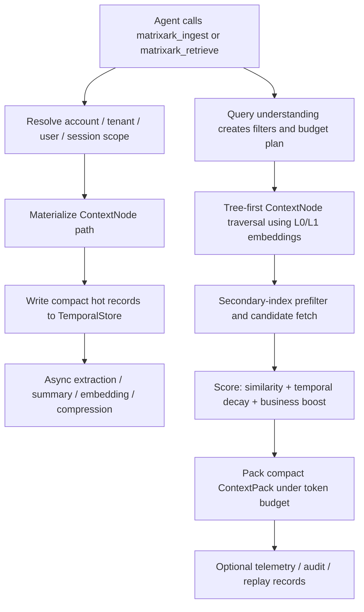

MatrixArk stores the current serving memory as a set of connected records rather than one giant blob. The important rule is that every serving record has a stable scope and node attachment, so retrieval can avoid scanning everything.

## Scope And Routing

Every request is resolved at the boundary into a canonical access scope:

```json
{
  "account_id": "acct_local",
  "tenant_id": "tenant_codex",
  "user_id": "deeproute",
  "session_id": "debug-message-pdf-session",
  "agent_name": "codex"
}
```

The hot-path serving shape should prefer compact IDs:

- `scope_key`: canonical tenant/user/session isolation key.
- `node_hash`: the ContextNode attachment point.
- `timestamp_key_ms`: the primary ordering key for time-series event records.
- `ref_hash`: stable reference ID for events, entities, summaries, chunks, and sections.

Verbose strings such as full paths, raw provider payloads, and debug extraction payloads should live in audit/debug records or cold metadata, not in every hot serving record.

## ContextNode Tree

ContextNodes organize memory into a tree. Callers do not manually create nodes; MatrixArk derives and ensures the path.

Typical paths:

```text
tenant:tenant_codex
tenant:tenant_codex/user:deeproute
tenant:tenant_codex/user:deeproute/session:debug-message-pdf-session
tenant:tenant_codex/user:deeproute/session:debug-message-pdf-session/conversation:project_aurora
tenant:tenant_codex/user:deeproute/resources/project_aurora/gpu_procurement
tenant:tenant_codex/shared/resources/policies
global/resources/public_docs
```

Shared resources and shared skills should not live under a session. They should live under tenant/shared or global paths, then access control decides visibility before scoring.

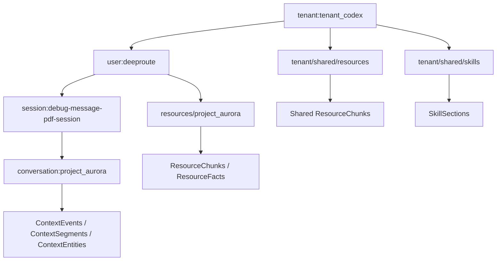

Physical placement can be distributed across shards. For serving, the important design is stable routing: records for the same hot node/session should use the same route key when we want locality, while shared/global resources can be separately partitioned and quota-limited.

## Message Ingestion Today

For a normal agent message, the MCP tool accepts:

```json
{
  "kind": "message",
  "messages": [
    {"role": "user", "content": "Alice approved the GPU purchase."}
  ],
  "scope": {
    "account_id": "acct_local",
    "tenant_id": "tenant_codex",
    "user_id": "deeproute",
    "session_id": "debug-message-pdf-session"
  },
  "metadata": {
    "node_path": [
      "tenant:tenant_codex",
      "user:deeproute",
      "session:debug-message-pdf-session",
      "conversation:project_aurora"
    ]
  },
  "storage_options": {
    "storage_family": "shared_store",
    "write_mode": "async"
  }
}
```

Message ingest writes a compact raw `ContextEvent`, attaches it to a ContextNode, appends a session-buffer marker, marks summaries dirty, and optionally schedules async extraction.

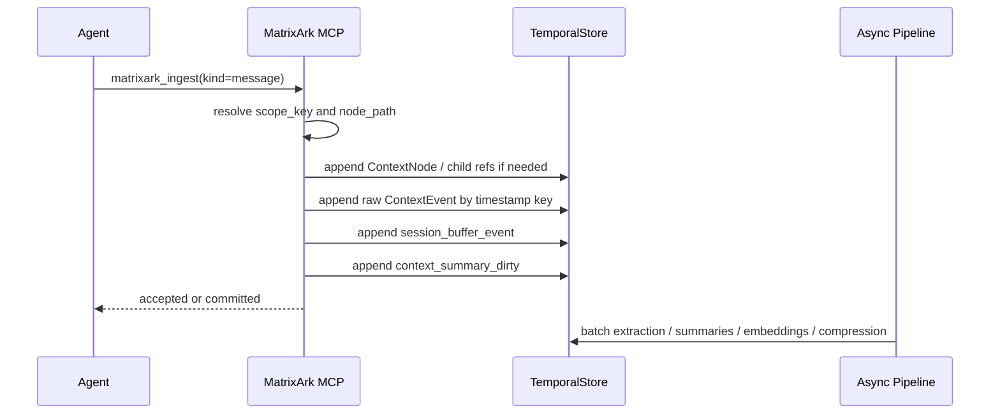

### ContextEvent

ContextEvent is the raw or extracted observation. The primary ordering key is timestamp-like:

```text
context_event_key = 00000001782681920521:1121810234980183195
```

That key means:

- first part: ingestion timestamp in milliseconds, left-padded for lexical ordering;
- second part: event hash, used as a tie-breaker so multiple events in the same millisecond do not overwrite each other.

Minimal serving fields:

```json
{
  "record_type": "context_event",
  "event_id_hash": 1121810234980183195,
  "node_hash": 2100209595829882121,
  "timestamp_key_ms": 1782681920521,
  "source_type": "message",
  "text": "user: Alice approved the GPU purchase.",
  "event_type": "confirmation"
}
```

Fields that should not be in the serving hot path:

- full `scope` object when `scope_key` is enough;
- full node path when `node_hash` is enough;
- raw provider payloads;
- `internal_extraction.*`;
- repeated status fields when the default is active/observed;
- duplicated model strings;
- debug-only classification when every value is `NEW_EVENT`.

## Batch Extraction

Batch extraction converts pending same-session ContextEvents into derived memory:

- `ContextEntity`: evolving state such as owner, approval state, budget cap, preference, current plan.
- `ContextSegment`: small thematic grouping for a rolling conversation window.
- `ContextSummary`: L0/L1 summaries for nodes or batches.
- `ContextEmbedding`: vector records for event text, entity state, summaries, chunks, sections.
- `ContextIndex`: compact postings used before vector scoring.

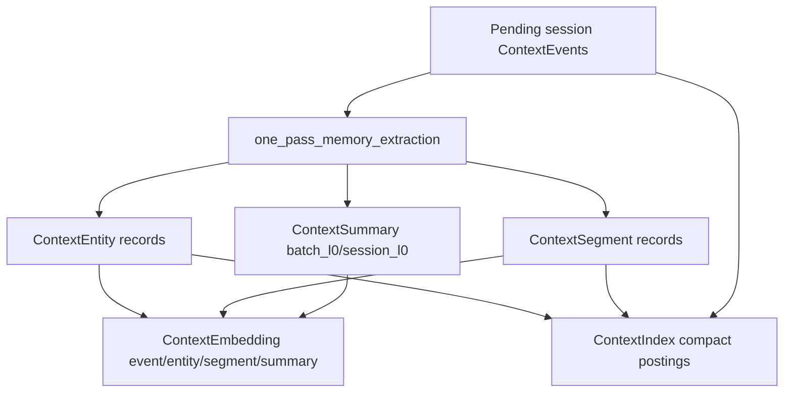

Today deterministic extraction is still used as a CI/dev fallback. Production should prefer OSS/OpenAI-compatible extraction where configured, while emitting the same internal schema.

### ContextEntity

Entities represent the latest useful state. They are the bridge across sessions.

Minimal serving fields:

```json
{
  "record_type": "context_entity",
  "entity_hash": 7343877841316191174,
  "node_hash": 2100209595829882121,
  "entity_type": "approval_state",
  "name": "Project Aurora GPU purchase",
  "state": "Approved by Alice after finance review.",
  "operator": "LATEST",
  "source_ref": "event:1121810234980183195"
}
```

`LLM_MERGE` should only be used when a real merge model or deterministic merge policy is production-ready. Otherwise, use explicit operators such as `LATEST`, `APPEND_EVIDENCE`, `CORRECT`, or `DELETE`.

## Resource Ingestion

Resources are parsed into cited chunks. Raw bytes should stay in local storage, S3, or object storage and be referenced by `raw_uri`.

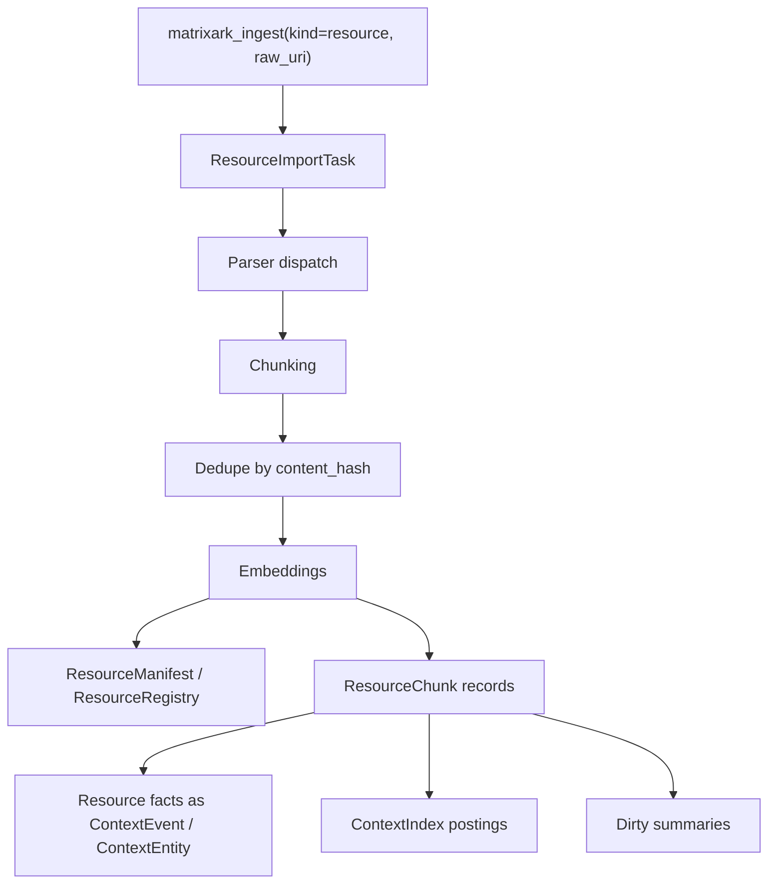

Supported parser families today include text/Markdown/log, HTML, PDF, Office files, CSV/TSV/XLSX row groups, JSON/JSONL, directories/repos, and image/scanned-document OCR/VLM command paths when configured.

### ResourceChunk

Chunks are citation-friendly serving evidence.

Minimal serving fields:

```json
{
  "record_type": "resource_chunk",
  "chunk_hash": 5143435679319321803,
  "resource_hash": 826404229911,
  "node_hash": 91423188001,
  "raw_uri_ref": 42,
  "source_ref": "doc:42#page=1",
  "unit_kind": "pdf_page",
  "content_hash": "720c7be01019a773",
  "token_estimate": 191,
  "text": "Project Aurora GPU Approval Packet..."
}
```

To save space, repeated `raw_uri` strings should be dictionary encoded:

```json
{
  "raw_uri_ref": 42,
  "raw_uri_dictionary": {
    "42": "s3://matrixark-prod/resources/acct/tenant/project/aurora.pdf"
  }
}
```

Resource facts are optional extracted events/entities with `source_chunk_hash`. They should be limited to answer-dense facts such as decisions, owners, costs, deadlines, policies, API contracts, and troubleshooting steps. Not every chunk needs extracted events.

## Skill Ingestion

Skills are not just generic Markdown. `SKILL.md` and bundles produce skill records:

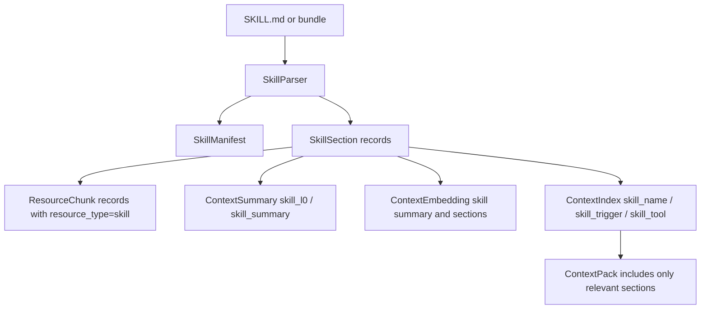

Skill retrieval is separate from normal event/entity/resource retrieval. It has its own quota and returns only relevant instructions, not the entire skill bundle by default.

## Summaries: L0 And L1

Summaries live as separate `ContextSummary` records. Events do not duplicate summaries, and embeddings are separate `ContextEmbedding` records.

Current policy:

- Leaf node summary: generated from recent raw events, entities, segments, resource chunks, or skill sections attached to that leaf.
- Parent summary: generated from child summaries plus selected entity/operator state.
- Parent summary is not a full recursive scan of every raw leaf event.
- If L0/L1 is missing or stale, retrieval falls back to indexes, recent event/entity embeddings, and lexical matching.

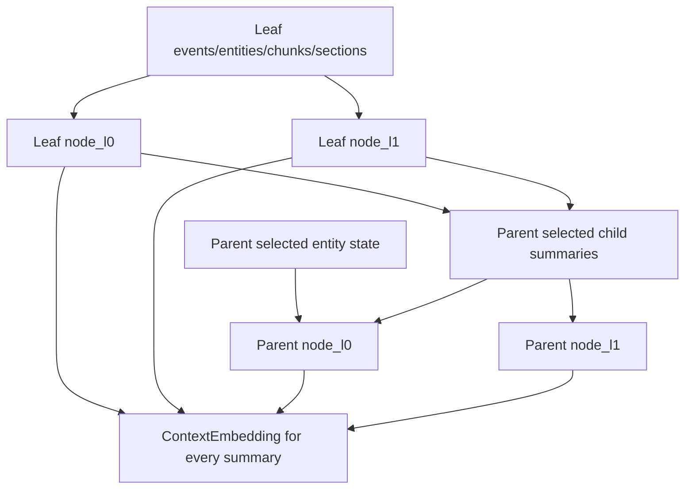

L0 is the short routing/preview summary. L1 is richer and carries more content for broader traversal. Production should use OSS/LLM summarization when configured; deterministic summarization remains a fallback.

## Embeddings

Embedding records are stored separately so hot records do not repeat vector/model metadata.

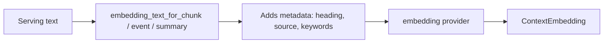

Embedding types include:

- `event_text`
- `entity_state`
- `segment_text`
- `node_l0`
- `node_l1`
- `resource_chunk`
- `resource_l0`
- `skill_section`
- `skill_summary`
- `compression_summary`

Model metadata should be grouped by model reference rather than repeated as a long string in every embedding row.

## Secondary Indexes

Secondary indexes are not meant to be one tiny row per event forever. Current direction is compact postings, similar to long-sequence feature indexing:

```json
{
  "record_type": "context_index",
  "data_model": "context_event",
  "index_name": "event_type:confirmation",
  "timestamp_key_ms": 1782681900000,
  "node_hash": 2100209595829882121,
  "ref_hashes": [1121810234980183195, 1384573524671901516]
}
```

Mechanism:

1. Query understanding produces index terms:

```json
{
  "query_type": "current_state",
  "secondary_filters": {
    "event_type": ["confirmation"],
    "entity_type": ["approval_state"],
    "source_type": ["message", "resource"],
    "keyword": ["gpu", "approval"]
  },
  "temporal_window": {"mode": "latest"}
}
```

2. Retrieval filters by scope first.
3. It scans compact postings such as `event_type:confirmation`.
4. It intersects/boosts candidate refs before embedding similarity.
5. It only fetches leaf records inside selected nodes.

This avoids scoring every event in every session.

## Retrieval

Retrieval is a staged pipeline with deadlines and budgets.

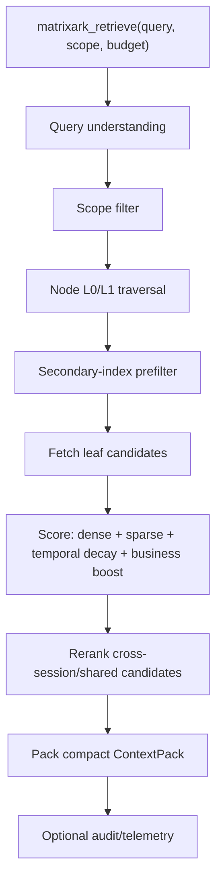

Retrieval uses multiple lanes:

- same-session continuity first;
- cross-session same-user memory when useful;
- shared tenant/global resources with a quota;
- skills in a separate skill-section quota;
- compressed events for old history;
- raw old events only when high-confidence evidence is required.

Recommended budget defaults:

- `max_context_tokens`: agent-supplied when possible; otherwise MatrixArk default.
- `local_context_tokens`: visible local context already present in the agent prompt.
- `remote_budget = max_context_tokens - local_context_tokens - safety_margin`.
- same-session and entity state should usually get the first claim.
- cross-session should be capped and quality-gated, not always fully spent.
- shared resources and skills should have explicit quotas.

## ContextPack

The serving ContextPack should be compact.

Good serving shape:

```json
{
  "context_pack_id": "cpp-native-1782632828-348",
  "local_context_refs": [],
  "groups": {
    "same_session": [
      {"type": "event", "text": "Alice approved the GPU purchase.", "source": "event:1121810"}
    ],
    "entities": [
      {"name": "Project Aurora GPU purchase", "state": "Approved by Alice."}
    ],
    "resources": [
      {"source": "doc:42#page=1", "text": "Approval packet..."}
    ],
    "skills": [
      {"name": "matrixark-debug", "section": "Retrieval diagnostics", "text": "..."}
    ]
  },
  "used_context_tokens": 1420,
  "quality_warnings": []
}
```

Keep out of the serving ContextPack unless debug mode is enabled:

- repeated hashes;
- full access object;
- cache-hit booleans;
- per-stage latency details;
- dropped refs;
- full recall policy;
- model/provider raw payloads;
- repeated `same_session` or `event` strings on every item.

Those belong in telemetry or audit/debug records.

## Audit, Replay, And Telemetry

Audit/replay is MatrixArk-specific observability. It is valuable, but it should be sampled or disabled by default for high-QPS serving.

Recommended modes:

- `off`: no per-request replay payload, only counters.
- `sampled`: keep detailed audit for a configurable sample rate.
- `debug`: keep selected/dropped refs, token costs, score reasons, stale/superseded decisions, and replay links.
- `compliance`: retain audit according to enterprise policy, preferably in MatrixKV/SQL or cold object storage.

Telemetry should remain always on as counters/histograms:

- ingest/retrieve QPS;
- p50/p95/p99 latency;
- timeout count;
- partial ContextPack count;
- token pressure;
- dirty summary lag;
- resource import lag;
- embedding/extraction latency;
- audit write failures;
- backend readiness;
- C++ vs Rust backend identity and storage mode.

## Temporal Compression

Temporal compression is not the same as time-weighted recall.

- Time-weighted recall: query-time ranking; no data mutation.
- Temporal compression: background lifecycle work; creates summary records for old raw events and can later make raw events eligible for deletion.

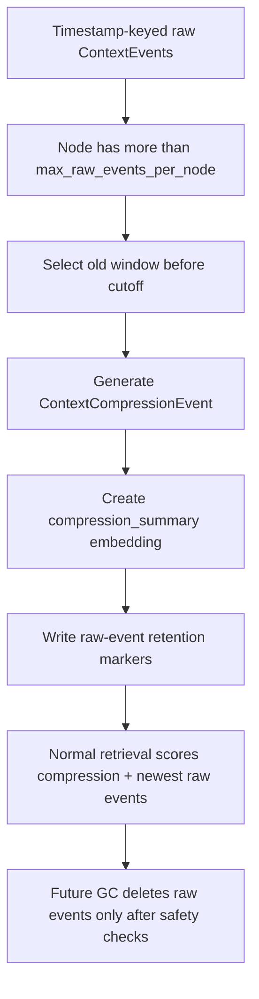

Compression record:

```json
{
  "record_type": "context_compression_event",
  "compression_id_hash": 773920331,
  "node_hash": 2100209595829882121,
  "source_event_ids": [101, 102, 103],
  "source_start_ms": 1782000000000,
  "source_end_ms": 1782200000000,
  "summary_text": "Older Project Aurora discussions established Alice approval and Bob ownership.",
  "retention_policy": {
    "raw_events_remain_replayable": true,
    "ttl_marker_only": true,
    "evict_after_ms": 1784792000000
  }
}
```

Current production gap:

- Compression summaries and TTL markers exist.
- Physical raw-event GC is not fully automatic yet.
- A native C++/Rust `matrixark_gc_expired_context_events` worker should use timestamp indexes, no-cache cold scans, bounded batches, tombstones, and retention/audit safety gates.

## Durable Storage Growth

If no GC/compaction runs, local/shared durable storage grows forever.

Current layers:

- Cache eviction removes hot memory/SSD residency.
- Temporal compression reduces retrieval cost.
- WAL/checkpoint GC can reclaim old replication artifacts.
- Rust block store has segment GC, delayed destroy, and purge paths.
- MatrixArk raw ContextEvent physical deletion is not fully automatic yet.

Recommended lifecycle:

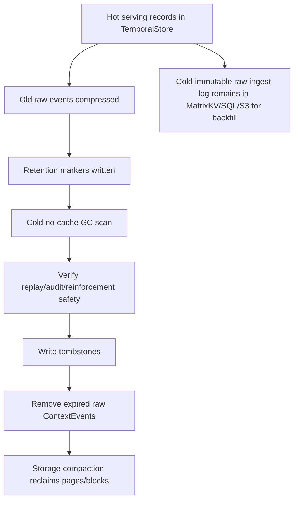

The best architecture is:

- TemporalStore: hot serving memory and retrieval indexes.
- MatrixKV or SQL-compatible cold metadata DB: immutable raw agent ingestion log, portal/admin metadata, backfill source, audit-light replay.
- S3/object storage: large raw files/resources referenced by `raw_uri`.

## Backfill

Backfill should replay raw ingestion messages from MatrixKV/SQL into TemporalStore in batches:

1. Read raw immutable agent messages by account/tenant/user/session/time range.
2. Normalize the MatrixArk envelope.
3. Batch append raw ContextEvents by timestamp key.
4. Run batch extraction windows.
5. Refresh summaries.
6. Generate embeddings.
7. Rebuild compact secondary-index postings.
8. Run retrieval validation queries.
9. Mark backfill checkpoint.

Backfill should use large native batch append and should not use local JSONL full scans.

## C++ And Rust Parity Expectations

Both backends should pass the same shared contracts:

- ingest raw ContextEvents;
- extraction into events/entities/segments;
- async summary refresh;
- L0/L1 traversal;
- secondary-index prefilter;
- resource/skill/event/entity retrieval;
- compact ContextPack packing;
- optional audit/replay;
- temporal compression;
- storage mode routing: shared async/sync, Raft async/sync, no-metaserver local mode where supported.

The MCP layer should eventually become a thin dispatcher:

```text
Python MCP:
  auth, scope, model/parser orchestration, request shaping

C++/Rust TemporalStore:
  batch append, timestamp-keyed events, compact secondary postings,
  prefix scan, candidate fetch, scoring, pack assembly,
  TTL/GC/compaction, metrics
```

## What Is Production-Ready Today

Good today:

- ContextNode materialization.
- Timestamp-keyed ContextEvent references.
- Message/resource/skill ingestion.
- Resource chunks and skill sections.
- Entity/event/segment extraction path.
- L0/L1 summary records and embeddings.
- Secondary-index query planning and compact postings direction.
- Compact serving ContextPack path.
- Time-weighted recall.
- Temporal compression summaries and retention markers.
- Metrics and debug reports.

Still needs hardening:

- Full native C++/Rust pack/scoring parity everywhere.
- Production OSS extraction/summarization as default instead of deterministic fallback.
- Physical raw ContextEvent GC.
- No-cache cold scan worker for compression/GC.
- Dictionary encoding for repeated paths/model names/raw URIs.
- Stronger C++/Rust full benchmark proof under same model/backend config.
- Portal controls for audit sampling, retention, replay, and cold backfill.

## Final Design Direction

MatrixArk should optimize for:

- same-session continuity first;
- cross-session entity state as the bridge;
- shared resources and skills as governed context;
- temporal compression for old history;
- compact ContextPack serving output;
- telemetry by default;
- audit/replay sampled or explicitly enabled;
- TemporalStore for hot serving;
- MatrixKV/SQL/S3 for cold immutable history and backfill.

That gives MatrixArk the right product shape: OpenViking-like resource handling, VikingMem-like event/entity temporal memory, plus stronger operational governance and replay when the user actually needs it.
