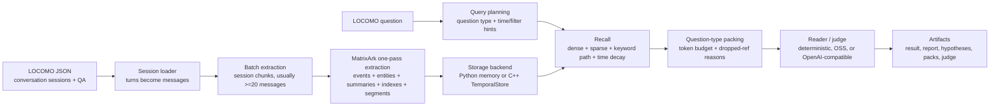

# MatrixArk LOCOMO Benchmark Walkthrough: C++ TemporalStore vs Python Memory

This note explains how the LOCOMO benchmark flows through MatrixArk, what differs between the Python memory backend and the C++ TemporalStore-backed path, and what data is injected into each logical TemporalStore context model.

## 1. What LOCOMO Tests

LOCOMO is a long-term conversational memory benchmark. A dataset item contains a long conversation split into dated sessions, plus question-answer pairs that ask for facts across time. The important benchmark behaviors are:

- **Single-hop memory**: one turn contains the answer.
- **Multi-hop memory**: the answer requires combining evidence across turns or sessions.
- **Temporal memory**: the question depends on dates, before/after ordering, or current/latest state.
- **Update memory**: old facts are superseded by newer facts.
- **Evidence recall**: the system should retrieve the turns that justify the final answer.

MatrixArk uses LOCOMO to test whether a context system can ingest long conversations, extract useful memory, retrieve the right evidence under a token budget, and produce a good answer with a reader/judge model.

## 2. Benchmark Workflow



The full benchmark runner saves six canonical artifacts per run:

- `result.json`
- `report.json`
- `report.md`
- `hypotheses.jsonl`
- `context_packs.jsonl`
- `judge.jsonl`

MatrixArk reports its own scores separately from VikingMem paper numbers until dataset version, reader, judge, prompt, and scoring protocol are matched.

## 3. Python Memory vs C++ TemporalStore

Both backends run the same MatrixArk extraction, retrieval, entity, summary, packing, and benchmark logic. The difference is the storage boundary.

| Area | Python memory backend | C++ TemporalStore backend |
|---|---|---|
| Purpose | Fast dev, CI, logical debugging | Production storage validation and parity testing |
| Storage | In-process / JSONL-style local records | Native C++ TemporalStore SDK/proxy-backed record log |
| Data shape | MatrixArk logical records | Same logical records serialized into TemporalStore hash fields |
| Benchmark meaning | Proves model mapping and ranking logic | Proves the same flow survives native C++ writes/reads |
| Expected score | Should match C++ logically when records/config match | Should be on par with Python memory if storage behavior is stable |
| Failure mode | Python bugs, extraction/ranking bugs | Native SDK/proxy, hset/query, persistence, log sharding, latency |

Current C++ benchmark parity uses a MatrixArk-compatible C++ TemporalStore record log:

```text
{storage_prefix}:record_count
  -> total logical MatrixArk records

{storage_prefix}:records:000000
  HSET 00000000000000000000 -> JSON(context_event)
  HSET 00000000000000000001 -> JSON(context_embedding)
  HSET 00000000000000000002 -> JSON(context_entity)
  ...

{storage_prefix}:records:000001
  HSET 00000000000000000256 -> JSON(...)
```

The C++ path validates that ingestion and retrieval read back the same MatrixArk logical records from TemporalStore. The next deeper stage is moving more scoring/query operators into native C++ context APIs, but the benchmark-visible contract is already the same logical record stream.

## 4. Example LOCOMO-Style Conversations

### Example A: Approval And Budget

```text
Session date: 2026-06-01
User: Alice says the GPU purchase request needs finance review.
Assistant: Bob says the requested budget is $42,000.
User: Alice approved the GPU purchase after finance review.

Question: Who approved the GPU purchase?
Answer: Alice.
```

What MatrixArk injects:

- `ContextEvent` for each turn.
- `ContextEmbedding` for event text and summaries.
- `ContextIndex` terms such as `event_type:confirmation`, `team`, `project`, and extracted keywords.
- `ContextSummary` for the batch L0 summary.
- `ContextSegment` for the coherent approval/budget topic.
- `ContextEntity` if the extractor identifies a durable state such as purchase status, approval state, budget, or project state.

Retrieval behavior:

- Query terms match `GPU`, `purchase`, `approved`.
- Sparse lexical score promotes the exact approval turn.
- Dense score and node summary score keep the correct session/node.
- Time decay keeps recent approval context high.
- The pack policy for fact questions puts the answer-bearing event before broad summaries.

### Example B: Preference Supersession

```text
Session date: 2026-06-03
User: I prefer Python for dashboards.

Session date: 2026-06-12
User: Actually, I prefer Rust for low-latency storage work now.

Question: What language does the user currently prefer for low-latency storage?
Answer: Rust.
```

What MatrixArk injects:

- `ContextEvent` for both preference statements.
- `ContextEntity` of type `preference`, updated from the old preference to the newer one.
- `stale_blocker` or supersession metadata so the old Python preference remains replayable but does not win current-state retrieval.
- `ContextIndex` terms for `preference`, `language`, `rust`, `python`, and scope.
- `ContextPackAudit` records that the current answer came from the newer entity state and that the older fact was stale evidence.

Retrieval behavior:

- Current-state questions read `ContextEntity` first.
- Old raw events stay available for historical questions.
- The stale blocker helps prevent the model from mixing old and current preferences.

### Example C: Temporal Location

```text
Session date: 2026-03-02
User: I moved to Seattle today.

Session date: 2026-04-10
User: I moved to Austin for the new infra project.

Question: Where was the user before April 10?
Answer: Seattle.
```

What MatrixArk injects:

- `ContextEvent` for both moves.
- `ContextEntity` of type `location`, current value Austin, previous value Seattle.
- Source refs to both raw events.
- `ContextIndex` terms for `location`, `Seattle`, `Austin`, and session date hints.
- `ContextSummary` describing the location timeline.

Retrieval behavior:

- The query planner recognizes `before April 10`.
- It avoids using only the latest entity state because the question is historical.
- It retrieves the older Seattle event and may include the Austin event as a temporal boundary.

## 5. Logical Data Models Injected During LOCOMO

### ContextEvent

One record per ingested message or extracted memory event.

```json
{
  "record_type": "context_event",
  "event_id_hash": 912345,
  "batch_id_hash": 778801,
  "node_hash": 440011,
  "node_path": ["locomo", "sample_0", "session_1"],
  "text": "dia_3 [2026-06-01] Alice: Alice approved the GPU purchase after finance review.",
  "summary_text": "Alice approved the GPU purchase after finance review.",
  "scope": {"user_id": "locomo-0", "team": "locomo", "session_id": "locomo-0-session-1-b0"},
  "internal_extraction": {
    "mode": "batch",
    "event_type": "confirmation",
    "classification": "event",
    "batch_id_hash": 778801
  },
  "prior_context": {"prior_refs": []}
}
```

Why it matters:

- Raw replay evidence lives here.
- TemporalStore can keep fresh event pages hot and let old pages persist/cool.
- Retrieval can use event time, node path, event type, score, and source refs.

### ContextEntity

Evolving state extracted from events, similar to VikingMem entity memory but stored through MatrixArk's hidden internal schema.

```json
{
  "record_type": "context_entity",
  "entity_hash": 551210,
  "batch_id_hash": 778801,
  "node_hash": 440011,
  "node_path": ["locomo", "sample_0", "session_1"],
  "entity_type": "preference",
  "entity_name": "language_preference",
  "state": "User currently prefers Rust for low-latency storage work.",
  "previous_state": "User preferred Python for dashboards.",
  "confidence": 0.86,
  "operator": "LATEST",
  "source_refs": ["event:912345"],
  "updated_at_ms": 1782100000000
}
```

Why it matters:

- Current-state questions can read entity state before scanning raw timelines.
- Superseded facts remain replayable but should not answer current/latest questions.
- Entity state improves LOCOMO update and temporal reasoning categories.

### ContextSummary

L0/L1 summary record for a node, batch, session, or compressed time window.

```json
{
  "record_type": "context_summary",
  "summary_type": "batch_l0",
  "summary_hash": 891234,
  "batch_id_hash": 778801,
  "node_hash": 440011,
  "node_path": ["locomo", "sample_0", "session_1"],
  "summary_text": "The session covers GPU purchase review, the $42,000 budget, and Alice's approval.",
  "source_entity_hashes": [551210],
  "source_segment_hashes": [661020],
  "updated_at_ms": 1782100000000
}
```

Why it matters:

- Node traversal scores the summary before reading many raw events.
- Summary embeddings can be stored in `ContextEmbedding`.
- Summaries support token-efficient recall and future temporal compression.

### ContextEmbedding

Stored vector-like representation for events, entities, summaries, and segments. In local tests this may use deterministic token-hash embeddings or OSS/OpenAI-compatible model embeddings depending on configuration.

```json
{
  "record_type": "context_embedding",
  "embedding_type": "batch_l0",
  "ref_type": "summary",
  "ref_hash": 891234,
  "node_hash": 440011,
  "dim": 384,
  "model": "sentence-transformers/all-MiniLM-L6-v2",
  "vector": "[normalized float32 bytes or compact test vector]"
}
```

Why it matters:

- MatrixArk does not need a separate VectorDB for this benchmark path.
- Layer-by-layer node traversal scores bounded sibling candidates.
- Temporal filtering and compression keep candidate sets small enough for exact scoring.

### ContextIndex

Secondary index / keyword record for filters and lexical fallback.

```json
{
  "record_type": "context_index",
  "index_name": "event_type:confirmation",
  "index_hash": 334455,
  "batch_id_hash": 778801,
  "node_hash": 440011,
  "node_path": ["locomo", "sample_0", "session_1"],
  "scope": {"user_id": "locomo-0", "team": "locomo"},
  "updated_at_ms": 1782100000000
}
```

Why it matters:

- Filters can narrow candidates before scoring.
- The auxiliary keyword path uses node path, index terms, event/entity/segment text as a keyword-graph-like fallback.
- Future production work can replace the current lightweight lexical scoring with BM25 or SPLADE-style sparse indexes.

### ContextSegment

Topic-centered segment extracted from a batch. This is MatrixArk's practical version of intelligent memory segmentation.

```json
{
  "record_type": "context_segment",
  "segment_hash": 661020,
  "batch_id_hash": 778801,
  "node_hash": 440011,
  "node_path": ["locomo", "sample_0", "session_1"],
  "topic": "approval_budget",
  "coordinate_tuples": [[0, 2]],
  "message_indexes": [0, 1, 2],
  "saliency_score": 0.91,
  "summary_text": "GPU budget review and approval.",
  "text": "Alice says the GPU purchase needs finance review. Bob says the budget is $42,000. Alice approved it.",
  "non_contiguous": false
}
```

Why it matters:

- It avoids blindly chunking every message.
- It can consolidate scattered but related turns.
- It gives the reader compact, answer-dense evidence.

### ContextCompressionEvent

Time-bounded compressed memory for old/cold windows.

```json
{
  "record_type": "context_compression_event",
  "compression_hash": 220019,
  "node_hash": 440011,
  "node_path": ["locomo", "sample_0", "session_1"],
  "operator": "TIME_COMPRESS",
  "source_time_range": {"from_ms": 1780000000000, "to_ms": 1780600000000},
  "summary_text": "Older June purchase discussions centered on GPU budget and review status.",
  "source_refs": ["event:900001", "event:900002"],
  "answer_hidden": false
}
```

Why it matters:

- Compression should reduce old context volume without hiding answer-bearing facts.
- Benchmark gates require `compression_answer_hidden_count == 0`.
- Recent raw events remain high fidelity; older inactive windows can be summarized.

### ContextPackAudit

Replayable audit for each retrieval.

```json
{
  "record_type": "context_pack_audit",
  "context_pack_id": "pack-locomo-0-14",
  "query": "Who approved the GPU purchase?",
  "question_type": "fact",
  "selected_refs": ["event:912345", "segment:661020", "summary:891234"],
  "blocked_refs": [],
  "dropped_refs": [
    {"ref": "event:901111", "reason": "low_score"},
    {"ref": "summary:889999", "reason": "over_budget"}
  ],
  "used_context_tokens": 784,
  "packing_policy": "question_type_aware",
  "recall_policy": "dense_sparse_keyword_time_decay",
  "created_at_ms": 1782100100000
}
```

Why it matters:

- Every answer can be replayed.
- Dropped-token accounting supports token-efficiency metrics.
- Python vs C++ parity can compare context packs record by record.

## 6. Recall And Packing Logic

For each LOCOMO question, MatrixArk runs:

```text
raw question
-> question type detection
-> scope/time/filter planning
-> node summary scoring
-> event/entity/segment recall
-> time decay + business weighting
-> auxiliary keyword fallback
-> question-type-aware packing
-> reader/judge
```

The recall score follows the VikingMem-style idea:

```text
Sfinal = (1 - wtime - wbusi) * Sorigin + wtime * Stime + wbusi * Sbusi
```

Where:

- `Sorigin` combines dense similarity, sparse lexical score, and node/segment signals.
- `Stime` keeps recent memory strong and decays older memory outside the freshness window.
- `Sbusi` boosts important event types or instance-level importance.

Question-type packing:

- **date**: session date + exact turn first.
- **fact**: extracted observation first.
- **evidence**: raw dialogue first.
- **multi-hop**: multiple sessions/entities.
- **current-state/update**: entity state + stale blockers.
- **why/emotion**: answer-bearing sentence first.

## 7. How To Run

Python logic smoke tests:

```bash
cd <repo>
PYTHONPATH=. python3 tools/test_matrixark_mcp_server.py
PYTHONPATH=. python3 tools/test_matrixark_batch_memory.py
```

C++ TemporalStore-backed LOCOMO run:

```bash
cd <repo>
PYTHONPATH=. python3 tools/run_matrixark_dataset_benchmark.py \
  --dataset locomo \
  --input /path/to/locomo.json \
  --backend temporalstore-direct \
  --storage-prefix locomo_cpp_full \
  --reader deterministic \
  --max-context-tokens 2000 \
  --output-dir artifacts/matrixark_benchmarks/locomo_cpp
```

OpenAI-compatible reader/judge run:

```bash
export OPENAI_API_KEY=...
export MATRIXARK_READER_PROVIDER=openai
export MATRIXARK_READER_MODEL=gpt-4o-mini
export MATRIXARK_JUDGE_PROVIDER=openai
export MATRIXARK_JUDGE_MODEL=gpt-4o-mini

PYTHONPATH=. python3 tools/run_matrixark_dataset_benchmark.py \
  --dataset locomo \
  --input /path/to/locomo.json \
  --backend temporalstore-direct \
  --storage-prefix locomo_cpp_gpt4o_mini \
  --reader openai \
  --judge openai \
  --max-context-tokens 2000 \
  --output-dir artifacts/matrixark_benchmarks/locomo_cpp_gpt4o_mini
```

## 8. What To Compare Between Python And C++

For parity, compare:

- Number of records written by type.
- Context pack selected refs.
- Context recall.
- Evidence turn recall.
- Used context tokens.
- Dropped refs and dropped token categories.
- Final answer and judge score.
- Latency by stage.
- Native C++ write/read warnings or status errors.

If Python and C++ differ, first check whether the C++ record log returned all records in the same order/count. If record parity is good but score differs, inspect query-time pack construction and dropped refs.

## 9. Key Takeaway

LOCOMO tests whether MatrixArk can turn long, dated conversation history into replayable temporal context. Python memory proves the logical pipeline quickly. C++ TemporalStore proves the same logical records can be persisted and retrieved through the production storage boundary. The target is identical benchmark behavior with C++ storage, while keeping TemporalStore as the single serving store for events, entities, summaries, indexes, embeddings, compression records, and context-pack audits.
