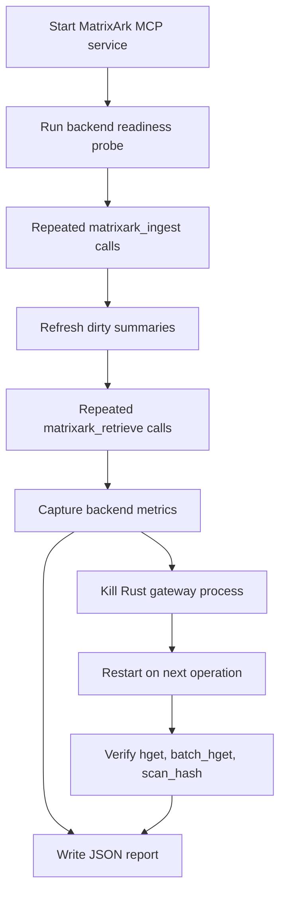

# MatrixArk MCP Scale And Failover Testing

This document describes the local MCP service robustness gate for MatrixArk. It tests the same agent-facing MCP JSON-RPC path that Codex, Claude, Cursor, and other tools call, then verifies that the long-lived Rust TemporalStore gateway can restart without losing data.

## What The Test Covers



The gate validates MCP startup, backend readiness, repeated ingest/retrieve, summary refresh, metrics capture, Rust gateway restart, post-restart readback, batch append/read, and prefix scan. This is not a LOCOMO or LongMemEval quality benchmark. It is a smaller service robustness check that should pass before larger dataset runs.

## Rust Command

Build the Rust record-log gateway first:

```bash
cargo build -p temporalstore-rust --bin matrixark_record_log
```

Run the MCP scale/failover gate:

```bash
python3 tools/run_matrixark_mcp_scale_failover_test.py \
  --backend rust \
  --rust-cli target/debug/matrixark_record_log \
  --ingest-count 40 \
  --retrieve-count 20 \
  --report-json /tmp/matrixark_mcp_scale_failover_rust.json
```

Expected high-level result:

```json
{
  "status": "passed",
  "mcp_scale": {"ok": true},
  "rust_gateway_failover": {"ok": true}
}
```

For failover, the report should show different `before_pid` and `after_pid`, while `value_after_restart` remains the value written before the process was killed.

## Local Debug Command

The local backend path checks MCP protocol behavior without a native storage backend:

```bash
python3 tools/run_matrixark_mcp_scale_failover_test.py \
  --backend local \
  --ingest-count 10 \
  --retrieve-count 4 \
  --report-json /tmp/matrixark_mcp_scale_failover_local.json
```

## Report Fields

The JSON report includes:

- `status`: `passed` or `failed`.
- `mcp_scale.readiness`: backend readiness result.
- `mcp_scale.ingest_latency`: min/avg/p50/p95/p99/max for ingest calls.
- `mcp_scale.retrieve_latency`: min/avg/p50/p95/p99/max for retrieval calls.
- `mcp_scale.metrics`: backend metrics snapshot.
- `rust_gateway_failover.before_pid` and `after_pid`.
- `rust_gateway_failover.batch_values` and `scan_count`.

## Acceptance Criteria

The gate passes only when backend readiness returns `ready=true`, all MCP calls complete without errors, retrieval returns selected context refs, Rust backend restart preserves data, batch read/write and prefix scan work after restart, and backend metrics can be captured.

If this gate fails, larger LOCOMO/LongMemEval runs should not be used as proof of production robustness until the MCP service or native backend issue is fixed.
