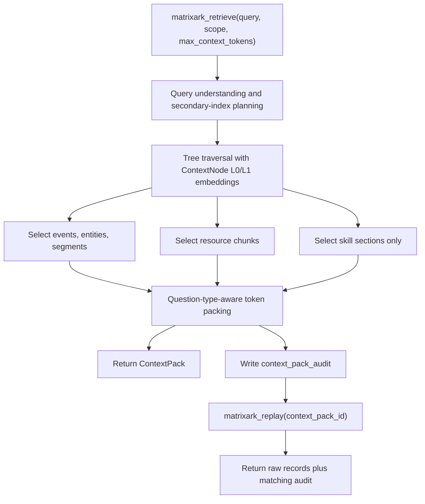
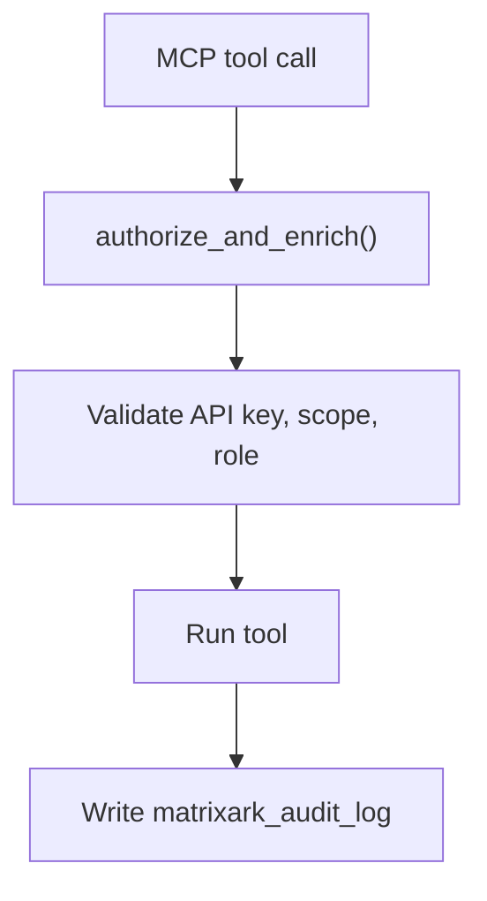
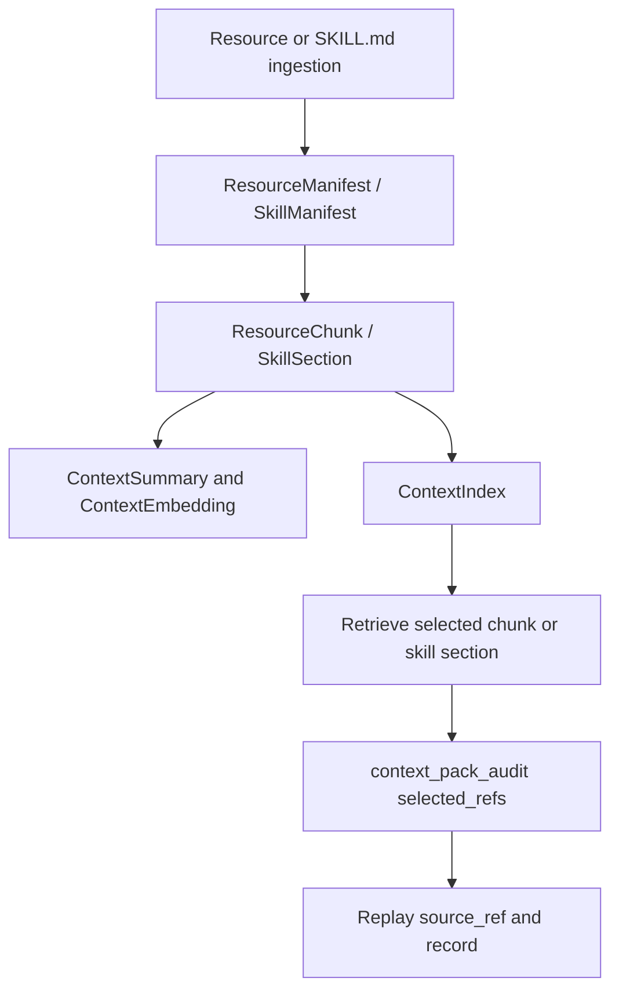

# MatrixArk Replay And Audit Pipeline

This document explains how MatrixArk replay and audit work for messages, resources, skills, retrieved ContextPacks, and access-management actions. The short answer is: yes, replay and audit are wired now for local, C++, and Rust-backed runs. Retrieval writes a replayable `context_pack_audit`, operational/API actions write `matrixark_audit_log`, and `matrixark_replay` can return the event log needed to reconstruct what was selected.

## Why This Matters

Replay and audit are the safety layer for LLM context management. They answer:

- What did MatrixArk return to the agent?
- Which events, entities, segments, resource chunks, and skill sections were selected?
- Which refs were dropped, and why?
- Which retrieval policy, tree traversal, secondary index filters, and token budget were used?
- Which account, tenant, user, session, or API key performed the action?
- Can we reproduce the ContextPack later for debugging, compliance, or benchmark reporting?

## Retrieval To Replay Flow



During retrieval, MatrixArk builds a `ContextPack` and writes a matching `context_pack_audit` record. That audit record stores enough information to explain the pack without relying on the model's final answer.

## What `context_pack_audit` Stores

`context_pack_audit` is written after retrieval. It includes:

- `context_pack_id`
- `query`
- `scope`
- `summary_text`
- `selected_refs`
- `selected_ref_counts`
- `context_assembly_policy`
- `dropped_refs`
- `layer_scores`
- `tree_traversal`
- `secondary_index_filter`
- `question_type`
- `packing_policy`
- `recall_policy`
- `local_context_policy`
- `used_local_context_tokens`
- `used_remote_context_tokens`
- `total_prompt_context_tokens`
- `remote_context_budget_tokens`
- `primary_candidate_count`
- `auxiliary_candidate_count`
- `created_at_ms`

The important fields for debugging are `selected_refs`, `dropped_refs`, `tree_traversal`, `secondary_index_filter`, and token counts.

## Selected Refs

`selected_refs` are compacted before audit storage so the audit stays small, but they still preserve the key replay metadata:

- `ref_type`: `event`, `entity`, `segment`, `resource_chunk`, `skill_section`, or compression summary
- `ref_hash`
- `node_hash`
- `node_path`
- `source_ref`
- `source_chunk_hash`
- `score`
- `selection_reason`
- `matched_index_terms`
- `token_estimate`
- `citation` or source metadata when available

For skills, MatrixArk records selected `skill_section` refs, not whole skill bundles by default. That makes replay precise: the audit shows exactly which instruction section was injected into the ContextPack.

## Dropped Refs

Dropped refs explain why candidates did not enter the final pack. Typical reasons:

- `over_budget`
- `duplicate`
- `stale_or_superseded`
- `low_score`
- `access_scope_denied`
- `secondary_index_filter_miss`
- `disabled_skill`

This is how benchmark and production debugging can tell whether a failure was caused by retrieval, access control, stale data, or token pressure.

## Access Audit Flow



MatrixArk separately writes `matrixark_audit_log` records for API and admin actions. These are access-management and operations audit logs, separate from ContextPack replay.

Examples of audited actions:

- `context.ingest`
- `context.batch_extract`
- `context.session_commit`
- `context.retrieve`
- `context.replay`
- `context.refresh_summaries`
- `resource.list`
- `skill.list`
- `skill.update`
- `backend.ready`
- `backend.metrics`
- admin actions such as account creation, user update, key rotation, and SSO mapping

Each audit log includes:

- action name
- account / tenant / user identity
- API key id when present
- status
- compact details
- timestamp

## Replay API

The MCP tool is:

```json
{
  "name": "matrixark_replay",
  "arguments": {
    "context_pack_id": "123"
  }
}
```

The current replay implementation flushes pending audit buffers, then returns the stored records for the current backend/prefix. Consumers find the matching `context_pack_audit` by `context_pack_id`, then use its `selected_refs` to inspect the source records.

For local JSONL, C++ direct, and Rust record-log backends, this means replay reads the same persisted MatrixArk record stream used by retrieval.

## Audit Buffering

For direct C++ and Rust-backed adapters, ContextPack audit writes can be buffered so retrieval latency is not dominated by audit persistence.

Modes:

- `sync`: write audit immediately
- `buffered`: append to an in-process buffer and flush in the background
- `drop`: skip ContextPack audit writes for extreme load testing only

Important rule: `matrixark_replay` calls `flush_audits()` first, so replay has a chance to see the latest buffered `context_pack_audit` before it returns records.

## Resource And Skill Replay



Resource replay works through `resource_chunk` refs. Skill replay works through `skill_section` refs.

For a skill import, MatrixArk writes:

- `skill_manifest`
- `skill_registry`
- `skill_section`
- `resource_chunk` with `resource_type=skill`
- `context_summary` with `summary_type=skill_l0`
- `context_embedding` for `skill_l0`, `skill_summary`, `skill_section`, and `resource_chunk`
- `context_index` for `skill_name`, `skill_trigger`, `skill_tool`, `source_type:skill`, and `resource_type:skill`

When retrieval selects a skill, the ContextPack contains only the relevant `skill_section` refs. Replay points back to the exact section text and source reference.

## C++ And Rust Status

The same replay/audit contract is validated through the resource/skill backend parity harness for:

- local JSONL backend
- C++ TemporalStore backend
- Rust TemporalStore record-log backend

The latest parity runs verify:

- `context_pack_audit` records are written
- selected refs are replayable
- resource packs replay resource chunks
- skill packs replay skill sections
- access audit includes retrieve, replay, resource list, skill list, and skill update actions
- C++ and Rust preserve the same logical record types

## Debug Commands

Local resource/skill replay and audit check:

```bash
cd <workspace>/Codex/2026-06-10/pull-rust-temporalstore-code-from-matrixarkai/work/TemporalStoreTestCorpus
TEMPORALSTORE_CONSUMER_REPO=<workspace>/Codex/2026-06-10/pull-rust-temporalstore-code-from-matrixarkai/work/TemporalStore \
MATRIXARK_EMBEDDING_PROVIDER=hash \
MATRIXARK_REQUIRE_OSS_EMBEDDINGS=0 \
MATRIXARK_UNDERSTANDING_PROVIDER=rules \
MATRIXARK_REQUIRE_OSS_UNDERSTANDING=0 \
python3 tools/run_matrixark_resource_skill_backend_parity.py --backends local --run-id replay-audit-local
```

C++ replay and audit check:

```bash
TEMPORALSTORE_CONSUMER_REPO=<workspace>/Codex/2026-06-10/pull-rust-temporalstore-code-from-matrixarkai/work/TemporalStore \
MATRIXARK_EMBEDDING_PROVIDER=hash \
MATRIXARK_REQUIRE_OSS_EMBEDDINGS=0 \
MATRIXARK_UNDERSTANDING_PROVIDER=rules \
MATRIXARK_REQUIRE_OSS_UNDERSTANDING=0 \
python3 tools/run_matrixark_resource_skill_backend_parity.py --backends cpp --run-id replay-audit-cpp
```

Rust replay and audit check:

```bash
TEMPORALSTORE_CONSUMER_REPO=<workspace>/Codex/2026-06-10/pull-rust-temporalstore-code-from-matrixarkai/work/TemporalStore \
MATRIXARK_EMBEDDING_PROVIDER=hash \
MATRIXARK_REQUIRE_OSS_EMBEDDINGS=0 \
MATRIXARK_UNDERSTANDING_PROVIDER=rules \
MATRIXARK_REQUIRE_OSS_UNDERSTANDING=0 \
MATRIXARK_TEMPORALSTORE_RUST_ROOT=/tmp/matrixark-rust-replay-audit \
python3 tools/run_matrixark_resource_skill_backend_parity.py --backends rust --run-id replay-audit-rust
```

## What To Look For In Reports

The generated parity report should show:

- `context_pack_audits_written: true`
- `resource_pack_replayable: true`
- `skill_pack_replayable: true`
- `access_audit_retrieve: true`
- `access_audit_replay: true`
- `access_audit_resource_list: true`
- `access_audit_skill_list: true`
- `access_audit_skill_update: true`

In `storage_records.record_counts`, expect:

- `context_pack_audit`
- `matrixark_audit_log`
- `resource_chunk`
- `skill_section`
- `context_event`
- `context_entity`
- `context_index`
- `context_summary`
- `context_embedding`

## Current Limitations

- Replay currently returns the backend record stream plus the matching audit record, rather than a minimal replay-only bundle. This is excellent for debugging and parity tests, but a production API can later return a narrower object with only matching source records.
- Buffered audit mode is designed for serving latency. If the process crashes before flushing, the last buffered audit records may be missing unless `sync` mode is used.
- Audit logs are compact. They intentionally do not store raw resource bytes; they point to `raw_uri`, `source_ref`, chunk hashes, and selected record refs.

## Recommended Production Policy

- Use buffered ContextPack audit for normal serving.
- Use sync audit for regulated or benchmark runs.
- Keep `matrixark_audit_log` enabled for access/API actions.
- Always record selected refs, dropped refs, token counts, tree traversal, and secondary-index filter details.
- Keep raw files in local/object storage and replay through `raw_uri` plus cited chunks, not copied file bytes.
