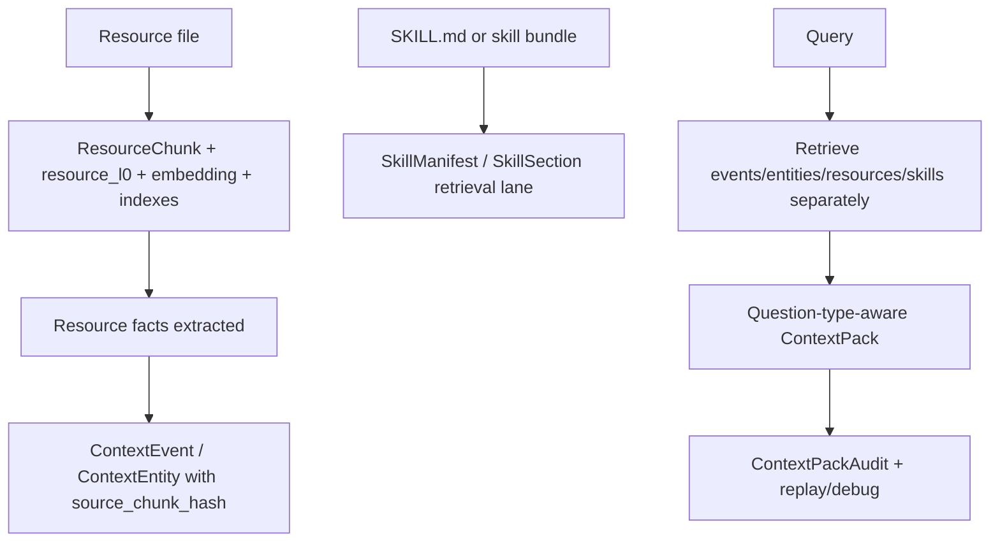
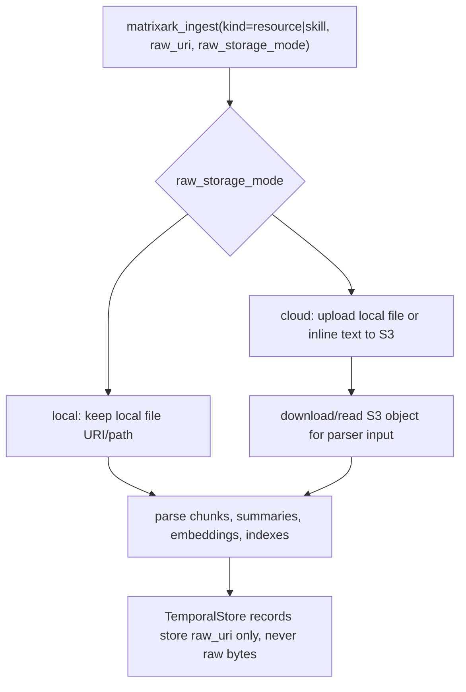
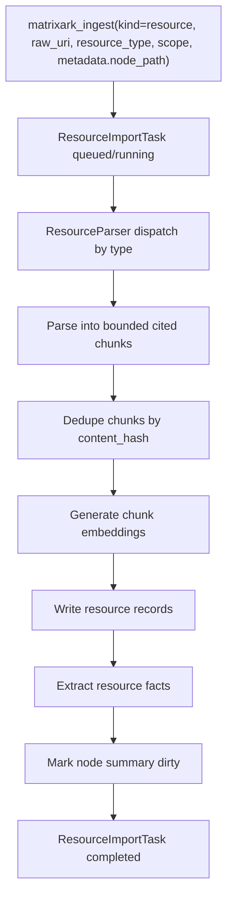
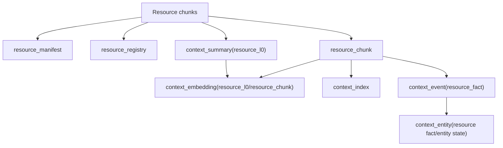
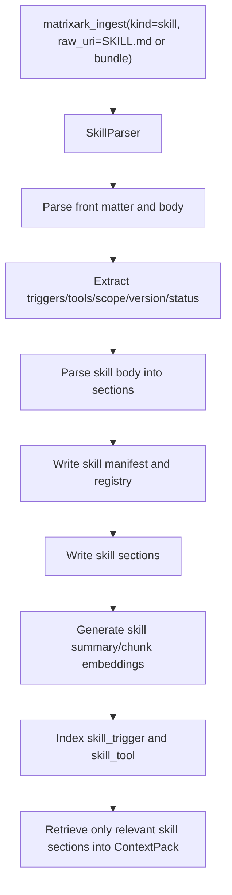
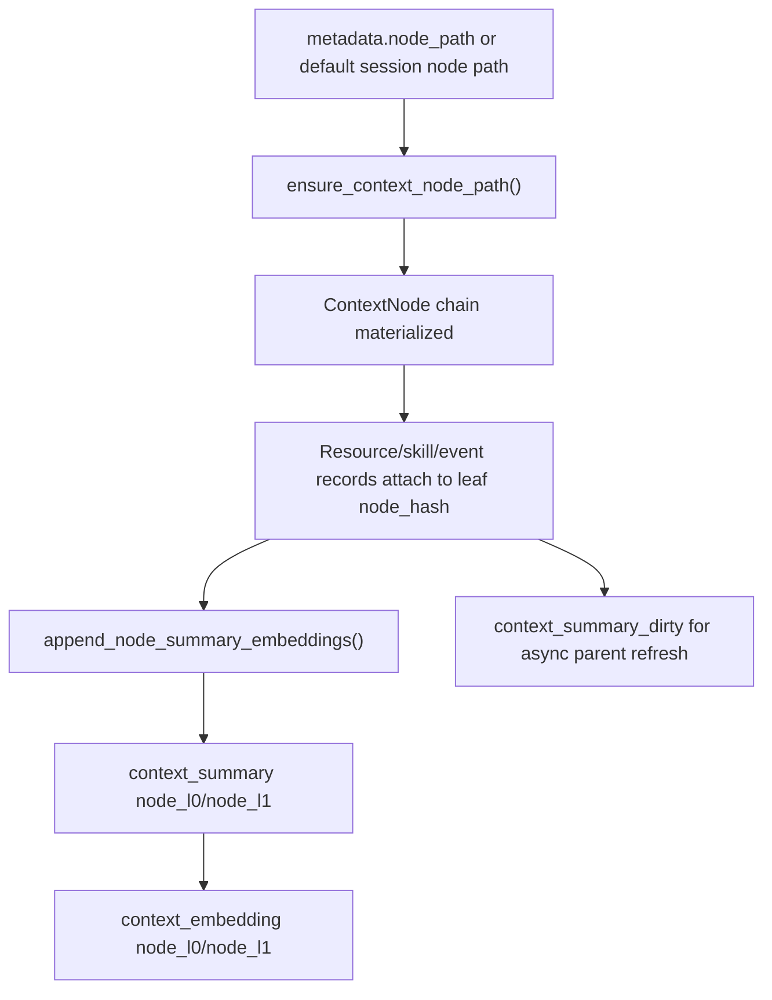
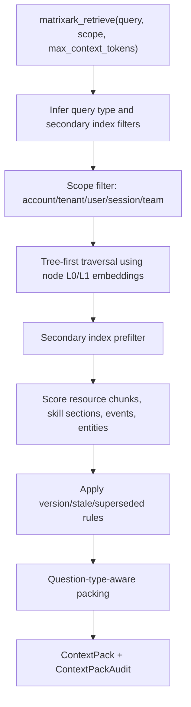

# MatrixArk Resource And Skill Parsing Pipeline

This document explains how MatrixArk ingests resources and skills, parses them into serving-ready chunks, generates embeddings, extracts facts into context memory, and writes the resulting records into TemporalStore-backed context models.

The important product boundary is simple: callers send a `raw_uri`, optional `resource_type`, `scope`, and `metadata.node_path`. MatrixArk owns parsing, chunking, extraction, indexing, summaries, embeddings, and ContextPack assembly.

## Product Serving Model

MatrixArk keeps four lanes separate:

| Lane | Stored as | Retrieval role |
|---|---|---|
| Resources | cited `ResourceChunk` records, `resource_l0` summaries, `ContextEmbedding`, and `ContextIndex` records | Source evidence with citations. Chunks answer "show me the policy/runbook/source" questions. |
| Resource facts | normal `ContextEvent` and `ContextEntity` records with `source_chunk_hash` and `source_ref` | Compact memory extracted from resources: decisions, owners, deadlines, costs, approvals, procedures, risks, API contracts, and troubleshooting facts. |
| Skills | separate `SkillManifest`, `SkillRegistry`, and `SkillSection` records, plus skill summaries, embeddings, and skill indexes | Operational instructions. Retrieval returns only relevant skill sections, not the whole skill bundle by default. |
| Audit/replay | `ContextPackAudit`, debug records, selected/dropped refs, token costs, access decisions, stale/superseded reasons | Observability and governance. Audit explains why retrieval/extraction behaved a certain way; it is not a primary serving memory lane. |

This gives MatrixArk OpenViking-like resource handling, VikingMem-like event/entity memory, and stronger MatrixArk-specific replay/debug governance in one TemporalStore-native model.



## Raw File Storage Modes

MatrixArk MCP supports both local and cloud handling for resource and skill files.



Local mode:

- Set `raw_storage_mode=local`, or omit it when `deployment_scope` is not `cloud`.
- MatrixArk stores the caller-provided `raw_uri`, such as `/repo/runbooks/gpu.md`.
- The parser reads the local path directly.
- TemporalStore stores parsed serving data and the local URI, not raw bytes.

Cloud mode:

- Set `raw_storage_mode=cloud`, or set `deployment_scope=cloud`.
- MatrixArk uploads a local file or inline resource text to S3 before parsing.
- Existing `s3://...` URIs are accepted and downloaded to a temporary parser file.
- TemporalStore stores the resolved `s3://bucket/key` as `raw_uri`.
- The original caller value is preserved as `requested_raw_uri`.
- Parser citations and chunk `source_ref` values are rewritten to the S3 URI.

Cloud configuration:

- `s3_bucket` or `MATRIXARK_RESOURCE_S3_BUCKET`
- `s3_prefix` or `MATRIXARK_RESOURCE_S3_PREFIX` (defaults to `matrixark/raw`)
- optional `MATRIXARK_S3_ENDPOINT_URL` or `AWS_ENDPOINT_URL_S3` for S3-compatible storage
- standard AWS credentials/profile/region environment variables when using AWS S3

The records expose `raw_storage_mode`, `raw_storage_policy`, `upload_status`, `cloud_bucket`, and `cloud_key` for import tasks, manifests, registries, and list APIs.

## Current Resource Flow



Supported parser inputs now include:

- `.md`, `.txt`, `.log`
- `.html`
- `.pdf`
- `.docx`, `.pptx`, `.xlsx`
- `.csv`, `.tsv`
- `.json`, `.jsonl`
- local directories and repos, skipping folders such as `.git`, `node_modules`, `target`, `build`, caches, and virtualenvs
- images and scanned documents through the OCR/VLM command path when configured

Raw bytes are not copied into TemporalStore. TemporalStore stores `raw_uri`, parsed chunks, citations, summaries, embeddings, secondary indexes, registry records, import task state, and replay metadata.

## Chunking

MatrixArk creates bounded, citation-friendly chunks. The chunk text stays readable for final prompts, while embedding text can include richer metadata.

Chunking rules:

- Markdown, HTML, text, and logs: heading-aware sections first, then bounded token/character windows.
- CSV, TSV, and XLSX: row-group/table chunks rather than one tiny row per chunk.
- JSON and JSONL: top-level object/path chunks or record groups.
- PDF, PPTX, and DOCX: page, slide, paragraph, and table-derived chunks with source position metadata.
- Code and directories: preserve relative paths; use symbol-aware parsing when available, otherwise bounded token windows.
- Images/scanned PDFs: emit VLM/OCR-derived caption chunks when the provider command is configured; otherwise keep parse warnings.

Each `resource_chunk` includes:

- `chunk_hash`
- `source_ref`
- `text`
- `token_estimate`
- `content_hash`
- `resource_version`
- `unit_kind`
- `relative_path`
- optional `heading_slug`, `page_number`, `slide_number`, `row_range`, and `parse_warnings`

`content_hash` powers dedupe. `resource_version` powers refresh semantics: a new version creates new chunks, old chunks remain replayable, and superseded chunks are excluded from normal retrieval unless historical replay asks for them.

## Embeddings


The text used for citations and prompt evidence is not always identical to the text used for embedding. `embedding_text_for_chunk()` enriches the embedding payload with source ref, relative path, heading path, table columns, keywords, and chunk content so retrieval can match both semantic content and structural hints.

`context_embedding` records are written for:

- `resource_chunk`
- `resource_l0`
- `skill_l0`
- `skill_summary`
- resource-derived `event_text`
- resource-derived `entity_state`
- node-level `node_l0` and `node_l1` summaries when summary refresh runs

Embedding provider configuration:

```bash
export MATRIXARK_EMBEDDING_PROVIDER=oss
export MATRIXARK_EMBEDDING_MODEL=sentence-transformers/all-MiniLM-L6-v2
export MATRIXARK_EMBEDDING_MODEL_PATH=/models/all-MiniLM-L6-v2
export MATRIXARK_REQUIRE_OSS_EMBEDDINGS=1
```

If local OSS models are unavailable in test mode, deterministic hashing embeddings can still be used for CI/debugging, but benchmark claims should identify the provider explicitly.

## Resource Records Written



Data models written during resource ingestion:

- `resource_import_task`: lifecycle state, progress, parse warnings, chunk counts, failure details, and timing metrics.
- `resource_manifest`: one logical imported resource version, including `raw_uri`, `resource_hash`, `resource_version`, parser info, scope, and summary ref.
- `resource_registry`: discovery/listing record with access scope and version status.
- `resource_chunk`: bounded cited serving chunk with source metadata and dedupe/version fields.
- `context_summary`: `resource_l0` summary for traversal, preview, and broad exploration queries.
- `context_embedding`: vectors for resource summaries, chunks, extracted facts, and entity states.
- `context_index`: secondary filters such as `source_type`, `resource_type`, `unit_kind`, `keyword`, `heading_slug`, and `relative_path`.
- `context_event`: extracted resource facts such as approval, policy, deadline, owner, cost, procedure, risk, troubleshooting step, or API contract.
- `context_entity`: evolving state derived from extracted resource facts, linked back to the source chunk/event.

Resource-specific extraction runs after chunking. It turns useful document facts into `ContextEvent` and `ContextEntity` records with `source_chunk_hash` and `source_ref`, so retrieval can return compact facts first while still citing the original chunk.

Important: a `ResourceChunk` remains the cited source of truth. A resource-derived `ContextEvent` or `ContextEntity` is the compact memory extracted from that chunk. Retrieval can select either one depending on the question type, and audit/replay links the compact fact back to the chunk.

## Skill Flow



The skill parser treats `SKILL.md` as a governed prompt/context asset, not just a generic Markdown resource. It extracts:

- `name`
- `description`
- `triggers`
- `allowed_tools`
- `owner_scope`
- `examples`
- `permissions`
- `inputs`
- `outputs`
- `precedence`
- `status`
- `version`
- `category`
- bundle files and manifest metadata

Skill records written:

- `skill_manifest`
- `skill_registry`
- `skill_section`
- `resource_chunk` with `resource_type=skill`
- `context_summary` with `skill_l0`
- `context_embedding(skill_summary/skill_l0/resource_chunk)`
- `context_index(skill_name/skill_trigger/skill_tool/source_type/resource_type)`

Retrieval returns only relevant skill sections. It does not stuff an entire skill bundle into the ContextPack by default, and MatrixArk does not turn skill instructions into ordinary resource facts unless a future explicit skill-fact extractor is enabled.

## ContextNode And Summary Injection



Callers do not manually create `ContextNode` records. MatrixArk materializes the node path from `metadata.node_path` or a default session/resource path derived from account, tenant, user, session, resource type, and source identity.

Resource, skill, event, entity, and summary records attach to the leaf `node_hash`. Summary generation writes L0/L1 summaries and embeddings for tree-first traversal. Parent summaries are refreshed asynchronously through dirty markers, so ingestion remains lightweight.

Default summary refresh policy:

- Event/resource/skill writes mark dirty node prefixes and return without regenerating parent summaries inline.
- The MCP summary refresher wakes every `MATRIXARK_SUMMARY_REFRESH_INTERVAL_MS`, default `1000` ms, and refreshes up to `MATRIXARK_SUMMARY_REFRESH_LIMIT`, default `64`, dirty nodes per tick.
- The worker writes versioned `ContextSummary(node_l0)` and `ContextEmbedding(node_l0)` for every refreshed node.
- It writes `ContextSummary(node_l1)` and `ContextEmbedding(node_l1)` when the node has enough accumulated content, child summaries, or event volume to need a richer overview.
- Session/resource boundaries may still call `matrixark_refresh_summaries` immediately when the caller needs freshness before retrieval.

The serving rule is important: summaries are an optimization, not a correctness dependency. If a node summary is missing or stale, retrieval falls back to event, entity, chunk, and recent raw embeddings.

## Retrieval



Retrieval behavior:

- Access scope is applied before scoring: account, tenant, user, session, and team filters decide eligibility.
- Tree traversal uses node L0/L1 summary embeddings to select promising folders/nodes before leaf-level retrieval.
- Secondary indexes can prefilter candidates before embedding similarity: `source_type`, `resource_type`, `unit_kind`, `keyword`, `heading_slug`, `relative_path`, `skill_trigger`, `skill_tool`, `entity_type`, and `event_type`.
- Resource chunks, resource-derived facts, entities, and skill sections are selected separately, then packed together under token budget.
- Resource facts participate in the normal event/entity lane. Resource chunks remain the cited evidence lane. Skill sections remain the instruction lane.
- Disabled skills are excluded.
- Superseded resource chunks are excluded unless historical replay is requested.
- ContextPack audit records selected/dropped refs, scores, token cost, version, stale/superseded state, access decision, and citation.

Packing policy prefers answer-dense evidence:

- facts: extracted resource/event observation first
- procedures: relevant skill section or troubleshooting chunk first
- evidence: raw cited chunk first
- current state: entity state plus source chunk/event
- broad exploration: L0/L1 node/resource summaries first

## Injection Completeness Gate

The resource/skill parity runner now fails unless the complete serving model is injected. A passing run proves all of these records exist and are replayable:

| Area | Required records |
| --- | --- |
| Tree | `ContextNode`, `ContextChildRef`, `ContextSummary`, `ContextSummaryDirty` |
| Resource lifecycle | `ResourceImportTask`, `ResourceManifest`, `ResourceRegistry`, `ResourceChunk`, `MatrixArkMetric` |
| Skill lifecycle | `SkillManifest`, `SkillRegistry`, `SkillSection`, skill-backed `ResourceChunk` |
| Facts and state | resource-derived `ContextEvent`, resource-derived `ContextEntity` |
| Serving indexes | `ContextEmbedding`, `ContextIndex` for resource type, skill trigger/tool, keyword, heading, unit kind, event type, and entity type |
| Replay and governance | `ContextPackAudit`, access-management audit rows for list/update/retrieve/replay |

Important product boundary:

- Resource files are fact sources. MatrixArk extracts resource decisions, policies, owners, costs, approvals, troubleshooting steps, and API contracts into `ContextEvent` / `ContextEntity` records with `source_chunk_hash` and `source_ref`.
- Skill files are instruction sources. MatrixArk stores them as `SkillManifest`, `SkillRegistry`, `SkillSection`, skill summaries, embeddings, and indexes. It does not convert skill instructions into business facts by default; retrieval selects only relevant skill sections into the ContextPack.

## Test Commands

Run local resource/skill parity:

```bash
cd /root/src/github-services/TemporalStore
python3 third_party/TemporalStoreTestCorpus/tools/run_matrixark_resource_skill_backend_parity.py --backends local
```

Run C++ live parity after topology readiness:

```bash
cd /root/src/github-services/TemporalStore
python3 third_party/TemporalStoreTestCorpus/tools/run_matrixark_resource_skill_backend_parity.py --backends cpp
```

Run Rust live parity:

```bash
cd /root/src/github-services/TemporalStore
python3 third_party/TemporalStoreTestCorpus/tools/run_matrixark_resource_skill_backend_parity.py --backends rust
```

Run combined comparison:

```bash
cd /root/src/github-services/TemporalStore
python3 third_party/TemporalStoreTestCorpus/tools/run_matrixark_resource_skill_backend_parity.py --backends cpp rust
```

## Debug Checklist

For a resource or skill import, inspect these records in order:

1. `resource_import_task`: confirms lifecycle and parser status.
2. `resource_manifest` / `skill_manifest`: confirms identity, version, and parser metadata.
3. `resource_registry` / `skill_registry`: confirms discovery and access scope.
4. `resource_chunk` / `skill_section`: confirms cited serving units.
5. `context_embedding`: confirms chunk, summary, fact, and entity vectors were generated.
6. `context_index`: confirms filterable fields were written.
7. `context_event`: confirms extracted facts were injected.
8. `context_entity`: confirms evolving resource-derived state was updated.
9. `context_summary`: confirms L0/L1 summary records are available for traversal.
10. `context_pack_audit`: confirms retrieval selected/dropped refs and why.

## Current Design Takeaway

MatrixArk uses Python for parser/model-worker responsibilities and C++/Rust TemporalStore backends for serving storage, indexes, embeddings, audits, and retrieval. This keeps the document ecosystem flexible while making the serving path TemporalStore-native, replayable, scoped, and ready for both local and distributed deployments.
