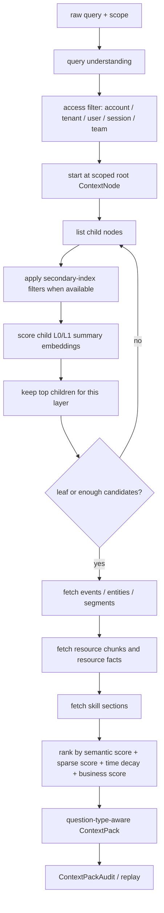

# MatrixArk Resource And Skill Tree Retrieval

## Where Resources And Skills Live

Resources and skills are stored under normal `ContextNode` paths. They are not a separate global side index.

Typical resource path:

```text
tenant:<tenant_id>
└── user:<user_id> or team:<team_id>
    └── resources
        └── <collection or type>
            └── <resource_slug>
```

Typical skill path:

```text
tenant:<tenant_id>
└── user:<user_id> or team:<team_id>
    └── skills
        └── <skill_name>
```

For tests and local imports, callers may pass a shorter `metadata.node_path`, for example:

```text
resources/runbooks/gpu
resources/policies/budget
skills/context-debugger
```

MatrixArk materializes every prefix as a `context_node` and writes `context_child_ref` edges between adjacent layers. A resource or skill leaf node then owns the serving records below it.

## Resource Records At The Leaf

Resource ingestion writes:

- `resource_import_task`
- `resource_manifest`
- `resource_registry`
- `resource_chunk`
- `context_summary` with `resource_l0`
- `context_embedding` for `resource_l0`, `resource_chunk`, `event_text`, and `entity_state`
- `context_index` entries such as `source_type:resource`, `resource_type:<type>`, `unit_kind:<kind>`, `keyword:<term>`, `heading_slug:<slug>`, and `relative_path:<path>`
- resource-derived `context_event` records for extracted facts
- resource-derived `context_entity` records for evolving state, with `source_chunk_hash` and `source_ref`

Raw bytes are not stored in TemporalStore. The store keeps `raw_uri`, chunks, citations, summaries, embeddings, indexes, registries, task state, and replay/audit records.

## Skill Records At The Leaf

`SKILL.md` ingestion writes:

- `skill_manifest`
- `skill_registry`
- `skill_section`
- `resource_chunk` with `resource_type=skill`
- `context_summary` with `skill_l0`
- `context_embedding` for `skill_l0`, `skill_summary`, and skill section chunks
- `context_index` entries such as `source_type:skill`, `resource_type:skill`, `skill_name:<name>`, `skill_trigger:<trigger>`, and `skill_tool:<tool>`

Skills are retrieved separately from ordinary memory and resources, then packed as only the relevant skill sections. MatrixArk should not stuff an entire skill bundle into the prompt by default.

## Layer-By-Layer Retrieval

Retrieval is tree-first:



The current Python MCP runtime reports this in every retrieve response:

```json
{
  "recall_policy": {
    "tree_traversal": {
      "enabled": true,
      "summary_embeddings": ["node_l0", "node_l1"],
      "selected_node_count": 4,
      "selected_path_count": 4,
      "selected_leaf_count": 2,
      "fallback_to_flat": false
    },
    "secondary_index_filter": {
      "enabled": true,
      "applied_before_embedding_scoring": true
    }
  }
}
```

If a node summary embedding is missing or stale, retrieval may fall back to flat candidate scoring for correctness. That fallback must be visible as `fallback_to_flat=true`; it is not the desired steady state for production resource/skill retrieval.

## How Secondary Indexes Help

The query parser extracts general filters before vector scoring, for example:

- `source_type:resource`
- `source_type:skill`
- `resource_type:pdf`
- `resource_type:skill`
- `unit_kind:table_rows`
- `keyword:approval`
- `skill_trigger:replay_evidence`
- `skill_tool:matrixark_replay`
- `entity_type:policy`
- `event_type:resource_fact`

These filters prune candidates before embedding similarity. The layer scan then scores fewer child folders and fewer leaf records.

## C++ And Rust Parity Gate

The shared parity runner validates both backends from ingestion through retrieval:

```bash
cd /root/src/github-services/TemporalStoreTestCorpus
TEMPORALSTORE_CONSUMER_REPO=/tmp/temporalstore-mcp-scale-failover \
  python3 tools/run_matrixark_resource_skill_backend_parity.py --backends cpp rust
```

It verifies:

- resource and skill import records
- chunks, manifests, registries, summaries, embeddings, and secondary indexes
- resource facts as `context_event` and `context_entity`
- resource retrieval and skill-section retrieval
- disabled-skill exclusion
- cross-user isolation
- replayable `context_pack_audit`
- tree traversal metadata for resource and skill queries

For quick local debugging:

```bash
TEMPORALSTORE_CONSUMER_REPO=/tmp/temporalstore-mcp-scale-failover \
  python3 tools/run_matrixark_resource_skill_backend_parity.py --backends local
```

