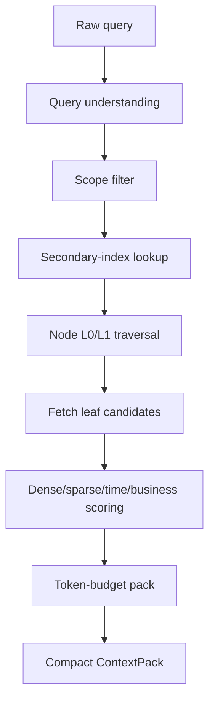

# MatrixArk Secondary Index Timestamp Filtering

This note explains the difference between the `ContextEvent` primary timestamp key and the timestamp copied into secondary-index postings. It also shows how query understanding should use secondary indexes to filter candidates before embedding similarity, sparse lexical scoring, and final ContextPack assembly.

## Short Answer

`ContextEvent` should be ordered by ingestion/event time. The timestamp is the primary ordering key for the event timeline.

Secondary-index rows also carry a timestamp, but that timestamp is not a second event primary key. It is the ordered posting key for an inverted index. It lets MatrixArk ask questions like:

- "Find recent confirmation events."
- "Find PDF chunks about GPU approval."
- "Find skill sections triggered by replay."
- "Find node-level batch hints newer than a given time."

So repeated timestamps in the debug table usually mean one object or one batch produced multiple index terms. MatrixArk now materializes those as compact posting rows for serving/debug output, and the Rust TemporalStore engine stores them as timestamp-keyed index series rather than verbose per-ref records in ContextPack.

## Old Solution Versus Current Shape

### Old Solution: One Verbose ContextIndex Record Per Term

The first MatrixArk context-index implementation wrote many standalone
`context_index` records. Each event, chunk, entity, skill section, or batch could
emit several records like this:

```json
{
  "data_model": "context_event",
  "index_name": "event_type:confirmation",
  "timestamp_key_ms": 1782681920550,
  "ref_type": "event",
  "ref_hash": 1121810234980183195,
  "node_hash": 2100209595829882121,
  "node_path": ["tenant:tenant_codex", "user:deeproute", "session:s1"],
  "scope_key": "t=2466|u=7836|s=7498|",
  "created_at_ms": 1782681920550
}
```

That worked for debugging, but it scaled poorly:

- every indexed term became its own serving record;
- scope, node path, hashes, timestamps, and model strings were repeated;
- PDFs/resources generated too many low-value keyword rows;
- retrieval had to materialize noisy rows before it could score real candidates;
- ContextPack/debug output leaked implementation details and wasted tokens.

In short, the old shape treated secondary indexes like normal context objects.
That is the wrong serving model at scale.

### Current Shape: TemporalStore-Style Posting Lists

The current target is the older TemporalStore/feature-store style: one primary
time-ordered series for the data model, plus compact secondary posting lists that
point into that primary series.

Primary event series:

```text
context_event/{scope_key}/{node_hash}/{timestamp_key_ms}:{event_id_hash}
```

Secondary posting series:

```text
secondary_index/{scope_key}/{data_model}/{index_name}/{posting_time}:{posting_id}
```

Compact posting value:

```json
{
  "r": 1121810234980183195
}
```

For node or batch hints:

```json
{
  "n": 2100209595829882121
}
```

What this means in practice:

- `ContextEvent`, `ResourceChunk`, `SkillSection`, and `ContextEntity` keep the
  actual serving payload.
- `ContextIndex` is a lookup structure, not user-facing content.
- A posting stores only enough to route retrieval to a candidate ref or node.
- Large postings split only after `MATRIXARK_MAX_SECONDARY_INDEX_REFS_PER_POSTING`
  so one hot term does not create an unbounded value.
- ContextPack returns selected evidence text, not raw index rows.

### What It Looks Like Now In Debug Output

The debug page may still show a table, but that table should be interpreted as a
rendered view of posting lists, not as one heavyweight object per event.

Example rendered rows:

```text
data_model            index_name                  timestamp_key_ms  refs  node_hash
context_event         event_type:confirmation     1782681920550     12    -
resource_chunk        resource_type:pdf           1782681920550     8     -
context_batch_commit  event_type:confirmation     1782681920550     0     2100209595829882121
```

The first row means:

```text
At posting time 1782681920550, event_type:confirmation points to 12 event refs.
```

The third row means:

```text
At posting time 1782681920550, confirmation-related batch memory exists under node 2100209595829882121.
```

It does not mean the event timestamp is duplicated as a second primary key. It
means each inverted list is independently time ordered.

## ContextEvent Primary Key

A `ContextEvent` has a time-ordered key so events under a node or segment can be scanned chronologically.

Example logical key:

```text
context_event/{scope_key}/{node_hash}/{timestamp_key_ms}:{event_id_hash}
```

Example value:

```json
{
  "text": "Alice approved the Project Aurora GPU purchase after finance review.",
  "event_type": "confirmation",
  "source_type": "message",
  "source_ref": "codex:debug-message-pdf-session:001"
}
```

The timestamp key is used for:

- latest-first retrieval;
- time-window filtering;
- temporal compression windows;
- TTL/GC decisions after compression;
- replay of a node or session timeline.

The event value should not need to repeat large scope strings, node paths, summary text, embeddings, or debug extraction payloads.

## Secondary Index Posting Timestamp

A secondary index posting is a compact pointer from an index term to one or more candidate records or candidate nodes.

The debug table may show fields like:

```text
data_model            index_name                  timestamp_key_ms  ref_type  ref_hashes  node_hash
context_batch_commit  event_type:confirmation     1782681920550              []          2100209595829882121
context_batch_commit  classification:batch_memory 1782681920550              []          2100209595829882121
```

This compact posting shape means:

- `index_name` is the lookup term.
- `timestamp_key_ms` is the time ordering for that posting bucket.
- `ref_hashes=[]` means this posting is a node or batch hint, not a direct event/chunk/entity ref.
- `node_hash=2100209595829882121` tells retrieval which node to enter after the index lookup.
- `data_model` tells retrieval which candidate family the posting points at.

In other words, the first row says:

```text
At time 1782681920550, node 2100209595829882121 had batch memory related to confirmation events.
```

Retrieval can use this to select or boost that node before fetching leaf events/entities/segments.

## Why Timestamps Repeat

One event, chunk, entity, skill section, or batch can produce several index terms.

Example event:

```json
{
  "event_type": "confirmation",
  "source_type": "message",
  "keyword": ["gpu", "approval"]
}
```

This can produce postings:

```text
event_type:confirmation  -> 1782681920550:event_hash
source_type:message      -> 1782681920550:event_hash
keyword:gpu              -> 1782681920550:event_hash
keyword:approval         -> 1782681920550:event_hash
```

The timestamp repeats because each posting belongs to a different inverted list. The final ContextPack should not include these posting internals unless debug mode is enabled.

## How Filtering Works

Retrieval should run in this order:



Query understanding emits a small structured plan:

```json
{
  "query_type": "fact_lookup",
  "secondary_filters": {
    "source_type": ["message", "resource"],
    "event_type": ["confirmation"],
    "resource_type": ["pdf"],
    "keyword": ["gpu", "approval"]
  },
  "temporal_window": {
    "mode": "latest"
  }
}
```

Then retrieval applies the plan:

1. Scope first: only records visible to the account/tenant/user/session/team are eligible.
2. Lookup postings:
   - `event_type:confirmation`
   - `keyword:gpu`
   - `keyword:approval`
   - `resource_type:pdf`
3. Intersect or union based on the query plan:
   - strict fact queries prefer intersection;
   - broad exploration may use union with boosts.
4. Convert postings into candidate nodes or candidate refs.
5. Score only those candidates, instead of scanning all events/chunks.

## Concrete Examples

### Example 1: "What did Alice approve about the GPU budget?"

Query understanding:

```json
{
  "query_type": "fact_lookup",
  "secondary_filters": {
    "event_type": ["confirmation", "approval"],
    "keyword": ["alice", "gpu", "budget"],
    "source_type": ["message", "resource"]
  },
  "temporal_window": {"mode": "latest"}
}
```

Filtering:

```text
visible scope
-> postings(event_type:confirmation)
-> postings(keyword:gpu)
-> postings(keyword:alice)
-> intersect or score-merge postings
-> fetch candidate events/resource facts/chunks
-> dense/sparse score
-> pack best evidence
```

The final ContextPack should contain human-usable text and citations, not index rows.

### Example 2: "Show the GPU approval PDF section."

Query understanding:

```json
{
  "query_type": "resource_evidence",
  "secondary_filters": {
    "source_type": ["resource"],
    "resource_type": ["pdf"],
    "unit_kind": ["pdf_page"],
    "keyword": ["gpu", "approval"]
  }
}
```

Filtering:

```text
source_type:resource
AND resource_type:pdf
AND keyword:gpu
AND keyword:approval
-> candidate resource_chunk refs
-> score chunk embeddings
-> return cited chunk text
```

### Example 3: "Which skill handles replay?"

Query understanding:

```json
{
  "query_type": "procedure",
  "secondary_filters": {
    "source_type": ["skill"],
    "skill_trigger": ["replay"],
    "skill_tool": ["matrixark_replay"]
  }
}
```

Filtering:

```text
source_type:skill
AND (skill_trigger:replay OR skill_tool:matrixark_replay)
-> candidate skill sections
-> pack only relevant instructions
```

## What Indexes Should Remain

Keep only high-signal, bounded indexes:

```text
source_type
resource_type
unit_kind
event_type
entity_type
skill_trigger
skill_tool
relative_path
heading_slug
keyword
```

The keyword index must be capped per object. Low-selectivity fields should not be indexed by default.

Disable or avoid by default:

```text
classification:new_event
classification:batch_memory
status:observed
always-active status flags
debug/provider fields
full node_path strings
```

These fields create many postings but rarely reduce candidates.

## Production Storage Shape

The debug table can show one row per visible posting or one grouped row per
posting bucket. Production storage should use TemporalStore-native inverted
lists, not verbose context-object records.

Recommended logical layout:

```text
secondary_index/{scope_key}/{data_model}/{index_name}/{posting_time}:{posting_id}
```

For node or batch hints:

```text
secondary_index/{scope_key}/context_batch_commit/{index_name}/{posting_time}:{node_hash}
```

The posting value should be compact. Direct refs can be grouped:

```json
{
  "r": [1121810234980183195, 1384573524671901516]
}
```

Node hints can stay separate:

```json
{
  "n": 2100209595829882121
}
```

If a posting bucket grows too large, split it:

```text
secondary_index/{scope_key}/{data_model}/{index_name}/{posting_time}:part0001
secondary_index/{scope_key}/{data_model}/{index_name}/{posting_time}:part0002
```

The serving ContextPack should not include these index implementation fields. They belong in debug/audit when enabled.

## Recommended Cleanup

1. Keep `timestamp_key_ms` as the primary order key for `ContextEvent`.
2. Keep `timestamp_key_ms` in secondary postings only as the ordered index key.
3. Do not include index timestamps, hashes, and node hints in ContextPack by default.
4. Group debug rows by `(data_model, index_name, timestamp_key_ms, node_hash)` and show counts instead of every posting when possible.
5. Cap secondary index terms per object with dynamic config.
6. Remove low-signal index terms from default extraction/indexing.
7. Push filtering into C++/Rust TemporalStore native APIs so Python does not materialize large posting lists.

## Practical Rule

If a field is useful for retrieval prefiltering, store it in `ContextIndex`.

If a field is useful for answering the user, store it in the source record or ContextPack.

If a field is useful only for debugging why retrieval behaved a certain way, store it in audit/debug records, sampled or disabled by default.
