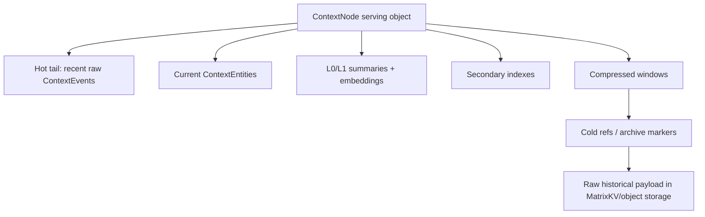
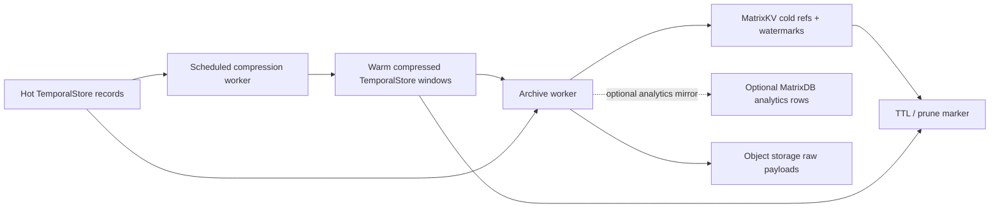
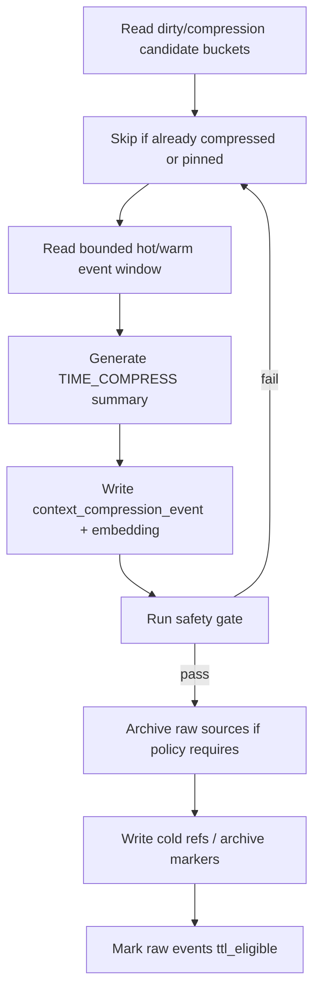
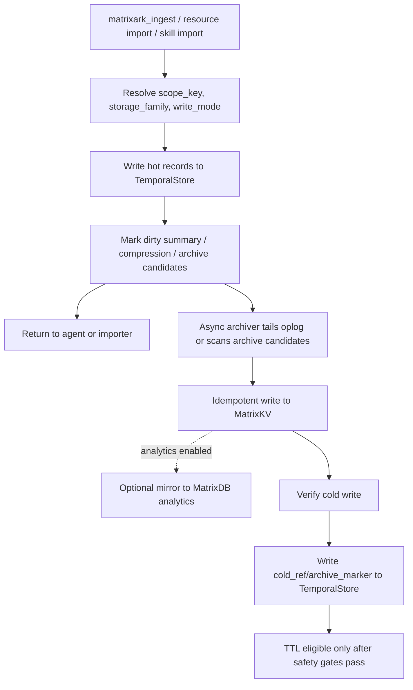
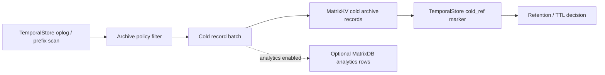
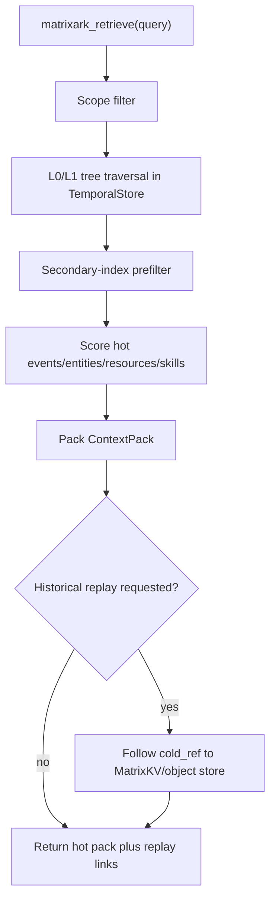

# MatrixArk Cold Archive Design: TemporalStore, MatrixKV, And MatrixDB

## Summary

MatrixArk should not preserve long history by synchronously double-writing every hot request to TemporalStore plus MatrixDB or MatrixKV. The production design is an async archive pipeline with a clear split: **MatrixKV is the default authoritative cold/offline store**, while **MatrixDB is an optional append-heavy analytics sink**.

- **TemporalStore** remains the hot serving store for active context retrieval, tree traversal, current entity state, embeddings, summaries, indexes, and compact operational telemetry.
- **MatrixKV** stores strongly consistent control-plane and cold archive data: users, accounts, API keys, retention policies, archive watermarks, cold refs, idempotency state, compliance pointers, replay/debug manifests, and SQL-visible cold records.
- **MatrixDB** is optional for high-QPS append and analytics: benchmark traces, token/quality metrics, dashboard aggregates, sampled observability streams, and offline analysis tables.

The important rule is: hot ingestion writes once to TemporalStore. A background archiver tails or scans TemporalStore records, writes cold history idempotently to MatrixKV, optionally mirrors analytics rows to MatrixDB, verifies the write, then records a compact cold pointer back in TemporalStore. Synchronous dual-write should be an optional compliance mode, not the default path.

## Why Not Double Write On The Hot Path

Synchronous double-write creates problems exactly where MatrixArk needs predictable latency:

- ingestion latency becomes the max of TemporalStore plus MatrixKV/MatrixDB;
- partial failure creates split-brain history unless there is a transaction across systems;
- retries can duplicate events without strong idempotency;
- benchmark and agent requests inherit offline analytics cost;
- every resource chunk, audit payload, and debug trace increases hot-path write amplification.

TemporalStore already has append/oplog semantics and replayable context records. Use that as the source for an outbox-style archiver instead of asking the API request to preserve history in two stores at once.

## Large Object Problem

TemporalStore is primarily the serving store. It should answer current user,
agent, resource, skill, and recent-history queries with bounded latency. If one
logical context object keeps every raw event forever, the object eventually
becomes mostly old compressed history plus cold raw payloads. That is the wrong
shape for serving:

- hot retrieval wastes time walking old windows that should be represented by
  summaries;
- summary refresh and time compression may repeatedly touch cold pages;
- replay/audit records can become larger than serving records;
- compaction pressure grows with data that is rarely used online;
- object-level locks, cache residency, and prefix scans become noisy.

The serving object should instead look like this:



Normal serving scans the hot tail, current entities, indexes, summaries, and
compressed windows. It follows cold refs only for replay, compliance, deep
debug, or explicit historical queries.

## Historical Data Management Options

### Option 1: TemporalStore-Only Progressive Compression

Keep all raw events in TemporalStore. Periodically create
`context_compression_event` records and prefer those summaries during retrieval.
Raw events remain in the same TemporalStore object or prefix.

**Pros**

- simplest deployment and debugging story;
- no cross-store archive worker;
- replay always reads from the serving store;
- strong local consistency with the hot path.

**Cons**

- serving objects still grow without bound;
- cold raw events compete with hot data for cache and compaction;
- background compression may scan old blocks/pages repeatedly;
- expensive for large users, long-running agents, PDFs, repos, and resource
  imports;
- weaker story for offline analytics than MatrixDB.

**Use when**

- local single-user deployments;
- short retention;
- early CI and small benchmark runs;
- compliance does not require long-term cold retention.

### Option 2: TemporalStore Hot Set + MatrixKV Cold Archive + Optional MatrixDB Analytics

TemporalStore keeps active serving records, current state, summaries, indexes,
embeddings, compressed windows, and compact cold refs. MatrixKV stores the
authoritative cold archive: archive watermarks, policy, cold-ref metadata,
SQL-visible cold records, replay/debug manifests, and compliance-critical
audit pointers. MatrixDB optionally stores high-QPS analytics rows such as
benchmark traces, token/quality metrics, dashboard aggregates, and sampled
observability streams.

**Pros**

- keeps TemporalStore small and serving-focused;
- keeps cold history strongly consistent and SQL-friendly through MatrixKV;
- allows MatrixDB to focus on high-volume analytics instead of serving as the
  cold source of truth;
- supports retention policies, audit dashboards, and replay debugging;
- avoids synchronous dual-write on hot requests;
- lets C++/Rust optimize hot retrieval without becoming an analytics database.

**Cons**

- requires archive workers, idempotency, watermarks, and verification;
- eventual archive consistency must be visible in task/ops status;
- replay can cross MatrixKV/object storage and may be slower than hot retrieval;
- more operational components.

**Use when**

- production cloud;
- enterprise audit and portal analytics;
- many agents/users/resources;
- long retention with bounded serving latency.

**Recommendation:** this is the default production design.

### Option 3: TemporalStore Hot Set + Object Storage Raw Payloads

TemporalStore stores hot records, summaries, embeddings, indexes, and cold refs.
Raw old events and large resource chunks are compressed into files such as
`s3://.../context_event_window.json.zst`. MatrixKV stores the pointer and
checksum. MatrixDB is optional.

**Pros**

- lowest storage cost for raw history;
- good for large PDFs, repos, tool logs, traces, and full replay payloads;
- raw bytes stay out of TemporalStore;
- easy lifecycle and retention integration with S3-compatible storage.

**Cons**

- object storage is not ideal for ad hoc analytics without MatrixDB;
- replay latency is higher;
- requires chunk manifests and checksums;
- harder to query historical details by SQL unless also indexed elsewhere.

**Use when**

- raw history is large but rarely queried;
- compliance requires retention but not frequent SQL analytics;
- resource chunks or tool-output payloads dominate storage.

### Option 4: TemporalStore Internal Tiering

TemporalStore itself keeps hot pages and cold pages in different internal tiers.
Cold pages may be compressed, evicted from memory/cache, or moved to cheaper
block/object storage while still addressed by TemporalStore metadata.

**Pros**

- one logical database API;
- C++/Rust can optimize page layout, min/max timestamp indexes, and prefetch;
- no external MatrixDB required for simple historical replay;
- strong fit with TemporalStore-native temporal ordering.

**Cons**

- more storage-engine complexity;
- still not a replacement for MatrixDB-style analytics;
- needs careful cache, compaction, TTL, and page-index design;
- can hide cold-history cost inside serving queries if not bounded.

**Use when**

- embedded/local deployments need one binary;
- C++/Rust engine work is prioritized;
- historical replay needs to remain within TemporalStore APIs.

### Option 5: Query-Driven Lazy Compression

Do not schedule compression. When a query touches an old time window, compress
that window on demand, store the summary, and use it next time.

**Pros**

- avoids background work for never-used history;
- naturally follows real recall demand;
- useful as a fallback for missed compression windows.

**Cons**

- first query against an old window can be slow;
- hard to guarantee benchmark latency;
- compression quality depends on query timing;
- not enough for retention/TTL because old raw data may remain forever.

**Use when**

- paired with scheduled compression as a fallback;
- low-volume local mode;
- exploratory historical replay.

## Recommended Hybrid

Use a three-tier lifecycle:

1. **Hot serving tier in TemporalStore**
   - recent raw events;
   - current entities;
   - resource/skill active chunks;
   - L0/L1 summaries and embeddings;
   - secondary indexes;
   - recent audits or sampled compact telemetry.

2. **Warm compressed tier in TemporalStore**
   - `context_compression_event` by node and time window;
   - source ids, source count, checksum, compression policy id;
   - summary embedding for tree traversal and retrieval;
   - cold refs for raw payload if archived.

3. **Cold history tier outside the serving path**
   - MatrixKV for watermarks, cold refs, retention policies, archive state,
     replay manifests, compliance audit pointers, and SQL-visible cold records;
   - MatrixDB optionally for benchmark traces, token/quality analytics,
     dashboard aggregates, and sampled high-volume observability;
   - object storage for large raw payloads and raw resource bytes.



## Should We Always Scan Cold Blocks Or Pages For Compression?

No. We should not always scan cold blocks/pages just to generate time-compressed
summaries. That would turn the background compression worker into a hidden full
history scanner and would make serving storage pay for offline lifecycle work.

The production rule should be:

> Compress from hot or warm indexed windows before data becomes cold. Once data
> is cold, only scan cold blocks/pages for bounded backfill, repair, compliance,
> or explicit historical replay.

### Why Not Full Cold Scans

- cold pages are intentionally evicted or archived because serving rarely needs
  them;
- repeated scans defeat cache and storage-tier separation;
- compression jobs can create unpredictable read amplification;
- large tenants or agents can starve small hot serving queries;
- if raw data was already archived, MatrixKV/object-storage reads may be cheaper and
  more controllable than TemporalStore page scans.

### Cold Scans Must Not Pollute Hot Cache

If a backfill, repair, compliance, or replay job must read old TemporalStore
blocks/pages, those reads should be treated as **cold lifecycle reads**, not
normal serving reads. They should not promote old pages into the hot cache or
resident memory set.

Required policy:

- cold scans use a separate low-priority scan path;
- cold scan reads are `no_cache_fill` / `no_promote` by default;
- cold scan reads do not update hot LRU admission except when explicitly
  reinforced by a user retrieval;
- cold scan buffers are bounded and separate from the serving cache;
- cold scan workers have lower IO and CPU priority than serving retrieval;
- cold scan metrics are separate from serving scan metrics;
- a cold scan can write a warm compression summary, but it must not warm all raw
  source pages unless the query/replay explicitly requests raw evidence.

In storage-engine terms, this means C++ and Rust should expose read options like:

```json
{
  "read_path": "cold_lifecycle_scan",
  "cache_policy": "no_fill",
  "promote_on_hit": false,
  "priority": "background",
  "deadline_ms": 30000,
  "max_bytes": 33554432
}
```

For local files, the implementation can use bounded scan buffers and OS cache
advice such as `POSIX_FADV_SEQUENTIAL` plus `POSIX_FADV_DONTNEED` after the
window is processed. For MatrixKV or object-storage archive reads, the scanner
should stream into worker-local buffers and never backfill the TemporalStore hot
page cache unless a recall reinforcement policy asks for it.

The one exception is **recall reinforcement**: if a user query actually needs an
old raw event, MatrixArk may pin or warm that specific event/window. That should
be narrow and explicit, not a side effect of background compression.

### What To Use Instead

Maintain compact metadata that lets workers find compression candidates without
scanning raw cold pages:

| Metadata | Store | Purpose |
| --- | --- | --- |
| `node_time_bucket` | TemporalStore or MatrixKV | event count, min/max timestamp, byte estimate, compression state |
| `compression_watermark` | MatrixKV | oldest uncompressed timestamp per node/scope |
| `archive_watermark` | MatrixKV | oldest unarchived timestamp per node/scope |
| `page_time_range` | TemporalStore page metadata | min/max event timestamp and record count per block/page |
| `context_compression_event` | TemporalStore | warm summary used by retrieval |
| `context_archive_marker` | TemporalStore | pointer proving raw data was archived |
| `cold_ref` | MatrixKV | exact MatrixKV/object location, optional MatrixDB analytics mirror id, and checksum |

With those records, the worker can select a bounded window such as:

```text
scope_key = acct|tenant|user
node_id = n123
window = [2026-01-01, 2026-01-08)
state = uncompressed AND hot_or_warm
limit = 5_000 events or 8 MB
```

The worker should read only the selected windows, generate one summary, record
source ids/checksum, and update the watermark. It should not scan every old page
looking for possible work.

## Compression Worker Policy

Recommended defaults:

| Policy | Default | Why |
| --- | --- | --- |
| hot raw retention | 30-90 days | enough recent fidelity for serving |
| compression cadence | every few minutes to hourly | decoupled from ingest latency |
| minimum window size | 20 events or 1 day | avoid tiny summaries |
| maximum window size | 5k events or 8-32 MB | bounded latency and memory |
| page scan mode | metadata/index first | avoid cold full scans |
| cold scan mode | disabled by default | backfill/repair only |
| LLM compression | async optional | cost controlled, not hot path |
| safety gate | required before TTL | do not hide answer-bearing facts |
| reinforcement | recall pins or warms old refs | prevent pruning useful history |

Worker flow:



## Serving Query Policy

Serving retrieval should be explicit about when it touches old data:

1. Traverse `ContextNode` L0/L1 summaries.
2. Apply secondary-index filters.
3. Score current entities, recent events, active resource chunks, active skill
   sections, and warm compression summaries.
4. Pack under token budget.
5. Follow cold refs only if:
   - the query asks for historical replay;
   - the warm compression summary says it has answer-bearing sources;
   - compliance/debug mode is enabled;
   - benchmark safety validation explicitly requests raw source replay.

This keeps normal context retrieval fast while preserving the ability to replay
or inspect raw history.

## C++/Rust Implementation Requirements

Both C++ and Rust should expose the same lifecycle primitives:

- append `ContextEvent` with timestamp-keyed ordering;
- update per-node time-bucket metadata during ingest;
- mark compression candidates without scanning raw history;
- scan candidate windows by scope, node, timestamp, and state;
- write `context_compression_event` and summary embedding;
- write/read `context_archive_marker` and `cold_ref`;
- expose bounded cold replay APIs with deadlines;
- emit metrics:
  - compression candidate count;
  - compression lag;
  - compressed event count;
  - cold scan count;
  - cold scan bytes;
  - archive lag;
  - TTL eligible count;
  - compression safety failures;
  - replay cold-ref fetch latency.

The key C++/Rust parity rule is that both backends can serve the same hot
records and compression summaries without requiring MatrixKV or MatrixDB on the
retrieval hot path. MatrixKV is the cold archive/control-plane complement;
MatrixDB is the optional analytics complement. Neither should be a normal
serving dependency.

## Store Responsibilities

| Data class | Default store | Reason |
| --- | --- | --- |
| Active `ContextEvent` | TemporalStore | Hot retrieval, temporal ordering, time-weighted recall |
| Active `ContextEntity` | TemporalStore | Current-state answers, stale blockers, valid-as-of state |
| `ContextSummary` L0/L1 | TemporalStore | Tree-first traversal and prompt orientation |
| `ContextEmbedding` | TemporalStore | Serving-time similarity and node traversal |
| `ContextIndex` | TemporalStore | Secondary-index prefilter before scoring |
| Active resource chunks and skill sections | TemporalStore | Cited evidence and prompt assembly |
| Compact ContextPack telemetry | TemporalStore, sampled | Serving observability and replay pointer |
| Full ContextPack replay/debug payload | MatrixKV cold table or object storage with MatrixKV pointer | Large, offline, strongly consistent replay source |
| User/account/API key metadata | MatrixKV or MySQL-compatible MatrixKV SQL | Strong consistency and portal queries |
| Archive watermarks and cold refs | MatrixKV | Durable control-plane coordination |
| Long-term audit and metrics | MatrixKV for compliance-critical records; MatrixDB optional for aggregates | Strong audit source plus cheap analytics |
| Raw file bytes | Object storage or local file store | TemporalStore stores `raw_uri`, not bytes |

## Write Path



Hot writes should remain bounded:

1. Validate auth and scope once.
2. Append events, entities, summaries, indexes, embeddings, and minimal telemetry to TemporalStore.
3. Mark records as candidates for archive, compression, or summary refresh.
4. Return immediately for sync API calls, or report task progress for async imports.
5. Let the archiver and summary/compression workers do slow work out of band.

## Archive Pipeline

The archiver is an at-least-once worker with idempotent upserts.



Recommended idempotency key:

```text
archive_key = hash(scope_key, record_type, record_id, record_version, archive_epoch)
```

The worker should be safe to restart:

- maintain `archive_watermark` in MatrixKV;
- write cold rows with `ON CONFLICT DO UPDATE` or equivalent;
- verify row counts and checksums before updating TemporalStore cold refs;
- never delete hot/raw records until cold refs and compression safety pass;
- keep poison records in a retry/dead-letter table with parse/write error details.

## What Counts As "Not Used" Data

Do not move data cold simply because it is old. A record becomes cold-archive eligible only when all required conditions pass.

Suggested policy inputs:

- age exceeds the hot window, for example 30 to 90 days for messages;
- recall count is low, or last recalled time is older than the reinforcement window;
- no active `ContextEntity` depends on it as the latest valid state;
- it is represented by a verified compression summary or still has a cold pointer;
- it is not a stale blocker required for current-state correctness;
- it is not part of an active resource version or current skill version;
- benchmark/import safety gates did not flag it as answer-bearing and hidden.

Suggested data states:

| State | Meaning | Normal retrieval |
| --- | --- | --- |
| `hot_active` | Fully served from TemporalStore | Included |
| `hot_compressed` | Raw event still present, compression summary preferred | Summary first, raw on replay |
| `cold_archived` | Cold copy verified, hot record can be compacted | Use cold ref only for historical replay |
| `ttl_eligible` | Safe to prune raw payload, keep pointer and summary | Not scanned normally |
| `pinned` | User/compliance/benchmark pinned | Never prune until unpinned |

## Data Model Additions

Keep hot serving records small. Put rich debug and cold details in archive records.

### `context_archive_marker`

Stored in TemporalStore.

```json
{
  "record_type": "context_archive_marker",
  "scope_key": "acct_local|tenant_codex|user_deeproute",
  "source_ref": "event:01HX...",
  "source_type": "context_event",
  "archive_state": "cold_archived",
  "cold_ref_id": "coldref_01HX...",
  "cold_store": "matrixkv",
  "archive_epoch": "2026-06",
  "archived_at_ms": 1782600000000,
  "checksum": "sha256:...",
  "retention_policy_id": "retention_default_90d"
}
```

### `context_cold_ref`

Stored in MatrixKV and optionally mirrored as a compact TemporalStore marker.

```json
{
  "cold_ref_id": "coldref_01HX...",
  "scope_key": "acct_local|tenant_codex|user_deeproute",
  "record_type": "context_event",
  "record_id": "event_01HX...",
  "record_version": 3,
  "matrixkv_table": "matrixark_context_cold_records",
  "matrixdb_analytics_table": "matrixark_context_event_history",
  "object_uri": "s3://matrixark-history/acct_local/2026/06/event_01HX.json.zst",
  "checksum": "sha256:...",
  "created_at_ms": 1782600000000
}
```

### `archive_job_state`

Stored in MatrixKV.

```json
{
  "job_id": "archive_worker_default",
  "scope_prefix": "acct_local|tenant_codex",
  "last_watermark_ms": 1782600000000,
  "last_record_key": "context_event/2026/06/...",
  "status": "running",
  "last_error": null,
  "updated_at_ms": 1782600010000
}
```

### `retention_policy`

Stored in MatrixKV.

```json
{
  "retention_policy_id": "retention_default_90d",
  "hot_window_days": 90,
  "min_recall_count_to_pin": 2,
  "compression_required": true,
  "cold_archive_required": true,
  "raw_event_ttl_after_archive_days": 30,
  "audit_sample_rate": 0.05,
  "full_replay_sample_rate": 0.01
}
```

## Retrieval Behavior



Default retrieval should not scan MatrixDB. Normal serving stays in TemporalStore. Historical replay, compliance inspection, and deep debug follow MatrixKV cold refs, then load object-storage payloads only when raw evidence is explicitly requested. MatrixDB is optional for offline analytics, cold search jobs, dashboards, and aggregate reporting.

## Compression And Retention Safety

Temporal compression and cold archive should work together:

1. Generate `context_compression_event` for old event windows.
2. Store source event ids, node path, temporal window, and summary embedding.
3. Run compression safety gate, including benchmark answer-hidden checks where applicable.
4. Archive raw source events to MatrixKV cold tables or object storage.
5. Write verified cold refs to TemporalStore.
6. Mark raw events TTL eligible only after both compression and archive are verified.

If an old record is recalled, feedback or retrieval reinforcement can move it back to `hot_active` or pin it.

## Audit And Replay Policy

Full replay/audit can be expensive. The default should be telemetry-first and sampling-based:

- always store compact operational metrics in TemporalStore;
- sample full `context_pack_audit` payloads according to policy;
- write full replay/debug payloads to MatrixKV or object storage when enabled;
- optionally mirror sampled replay/debug rows to MatrixDB for offline analytics;
- store compliance-critical admin/key/SSO actions in MatrixKV with no sampling;
- keep `context_pack_id` and selected ref summaries hot enough for support/debug.

This gives MatrixArk operational visibility similar to production memory systems without making every retrieval write a large replay record.

## C++ And Rust Responsibilities

C++ and Rust TemporalStore backends should implement the same hot/cold boundary:

- native append and batch append for hot context records;
- prefix scan by `scope_key`, record type, node, and timestamp;
- archive candidate scans by state and age;
- compact `context_archive_marker` records;
- cold-ref lookup by id;
- metrics for archive lag, archive failures, cold-ref hits, TTL candidates, and replay fetches;
- consistent structured errors for archive-not-ready, cold-ref-missing, and retention-blocked.

Python MCP/model workers can orchestrate policies initially, but storage-facing primitives must be shared by C++ and Rust so benchmarks and production behavior stay aligned.

## Metrics

Expose these in the portal and Prometheus/Grafana:

- `matrixark_archive_candidates_total`
- `matrixark_archive_batches_total`
- `matrixark_archive_records_total`
- `matrixark_archive_failures_total`
- `matrixark_archive_lag_ms`
- `matrixark_cold_ref_hits_total`
- `matrixark_cold_ref_missing_total`
- `matrixark_ttl_candidates_total`
- `matrixark_ttl_pruned_total`
- `matrixark_replay_cold_fetch_latency_ms`
- `matrixark_matrixdb_analytics_mirror_latency_ms`
- `matrixark_hot_store_bytes_estimate`
- `matrixark_cold_store_bytes_estimate`

## Product Defaults

Recommended defaults:

- hot serving data stays in TemporalStore;
- raw bytes stay in object/local file storage and are referenced by `raw_uri`;
- portal/account/API-key metadata uses MatrixKV SQL or MySQL;
- long replay/debug manifests and cold records go to MatrixKV or object storage;
- benchmark traces, token/quality metrics, and dashboard aggregates may mirror to MatrixDB;
- full replay audit is sampled unless compliance mode requires every request;
- cold archive is async and idempotent;
- synchronous dual-write is disabled by default and allowed only in explicit compliance mode.

## Acceptance Gates

MatrixArk should claim this design is production-ready only when:

- hot ingestion does not synchronously depend on MatrixKV or MatrixDB;
- archiver can restart from MatrixKV watermark without losing or duplicating records;
- every cold ref has a checksum and replay test;
- TemporalStore raw event pruning is blocked until cold archive and compression safety pass;
- C++ and Rust shared tests cover archive markers, cold refs, retention policies, and replay fetches;
- the portal can show hot vs cold record counts, archive lag, and replay status per account/tenant/user.

## Implementation Backlog

1. Add logical record types: `context_archive_marker`, `context_cold_ref`, `archive_job_state`, and `retention_policy`.
2. Add an archive worker that tails TemporalStore or scans archive candidates by prefix/time.
3. Add MatrixKV cold archive tables for cold refs, archive watermarks, retention policies, replay manifests, compliance audit pointers, and SQL-visible cold records.
4. Add optional MatrixDB analytics tables for benchmark traces, token/quality metrics, dashboard aggregates, sampled retrieval traces, and offline reports.
5. Add retrieval replay path that follows cold refs only when requested.
6. Add retention safety gates tied to temporal compression and benchmark answer-hidden checks.
7. Add C++/Rust shared corpus tests for archive, restore, replay, TTL, and failure recovery.
