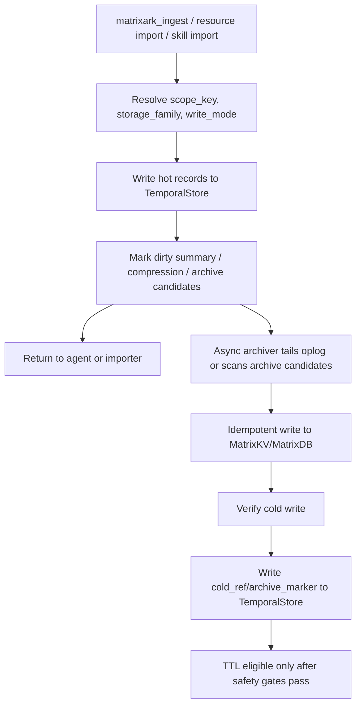
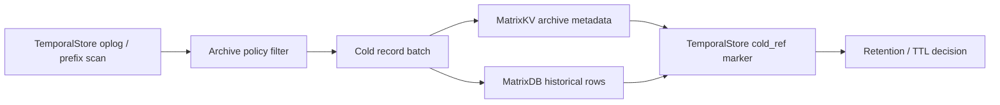
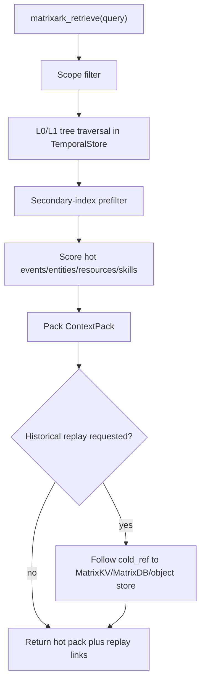

# MatrixArk Cold Archive Design: TemporalStore, MatrixKV, And MatrixDB

## Summary

MatrixArk should not preserve long history by synchronously double-writing every hot request to TemporalStore plus MatrixDB or MatrixKV. The production design is an async archive pipeline:

- **TemporalStore** remains the hot serving store for active context retrieval, tree traversal, current entity state, embeddings, summaries, indexes, and compact operational telemetry.
- **MatrixKV** stores strongly consistent control-plane and archive metadata: users, accounts, API keys, retention policies, archive watermarks, cold refs, idempotency state, and compliance pointers.
- **MatrixDB** stores analytical and cold-history data: full replay/debug payloads, historical ContextPacks, benchmark traces, token/quality metrics, long-term audit, and offline analysis tables.

The important rule is: hot ingestion writes once to TemporalStore. A background archiver tails or scans TemporalStore records, writes cold history idempotently to MatrixKV/MatrixDB, verifies the write, then records a compact cold pointer back in TemporalStore. Synchronous dual-write should be an optional compliance mode, not the default path.

## Why Not Double Write On The Hot Path

Synchronous double-write creates problems exactly where MatrixArk needs predictable latency:

- ingestion latency becomes the max of TemporalStore plus MatrixKV/MatrixDB;
- partial failure creates split-brain history unless there is a transaction across systems;
- retries can duplicate events without strong idempotency;
- benchmark and agent requests inherit offline analytics cost;
- every resource chunk, audit payload, and debug trace increases hot-path write amplification.

TemporalStore already has append/oplog semantics and replayable context records. Use that as the source for an outbox-style archiver instead of asking the API request to preserve history in two stores at once.

## Store Responsibilities

| Data class | Default store | Reason |
| --- | --- | --- |
| Active `ContextEvent` | TemporalStore | Hot retrieval, temporal ordering, time-weighted recall |
| Active `ContextEntity` | TemporalStore | Current-state answers, stale blockers, valid-as-of state |
| `ContextSummary` L0/L1 | TemporalStore | Tree-first traversal and prompt orientation |
| `ContextEmbedding` | TemporalStore | Serving-time similarity and node traversal |
| `ContextIndex` | TemporalStore | Secondary-index prefilter before scoring |
| Active resource chunks and skill sections | TemporalStore | Cited evidence and prompt assembly |
| Compact ContextPack telemetry | TemporalStore, sampled | Serving observability and replay pointer |
| Full ContextPack replay/debug payload | MatrixDB, optional MatrixKV pointer | Large, offline, rarely queried on serving path |
| User/account/API key metadata | MatrixKV or MySQL-compatible MatrixKV SQL | Strong consistency and portal queries |
| Archive watermarks and cold refs | MatrixKV | Durable control-plane coordination |
| Long-term audit and metrics | MatrixDB | Aggregation, dashboards, offline analysis |
| Raw file bytes | Object storage or local file store | TemporalStore stores `raw_uri`, not bytes |

## Write Path



Hot writes should remain bounded:

1. Validate auth and scope once.
2. Append events, entities, summaries, indexes, embeddings, and minimal telemetry to TemporalStore.
3. Mark records as candidates for archive, compression, or summary refresh.
4. Return immediately for sync API calls, or report task progress for async imports.
5. Let the archiver and summary/compression workers do slow work out of band.

## Archive Pipeline

The archiver is an at-least-once worker with idempotent upserts.



Recommended idempotency key:

```text
archive_key = hash(scope_key, record_type, record_id, record_version, archive_epoch)
```

The worker should be safe to restart:

- maintain `archive_watermark` in MatrixKV;
- write cold rows with `ON CONFLICT DO UPDATE` or equivalent;
- verify row counts and checksums before updating TemporalStore cold refs;
- never delete hot/raw records until cold refs and compression safety pass;
- keep poison records in a retry/dead-letter table with parse/write error details.

## What Counts As "Not Used" Data

Do not move data cold simply because it is old. A record becomes cold-archive eligible only when all required conditions pass.

Suggested policy inputs:

- age exceeds the hot window, for example 30 to 90 days for messages;
- recall count is low, or last recalled time is older than the reinforcement window;
- no active `ContextEntity` depends on it as the latest valid state;
- it is represented by a verified compression summary or still has a cold pointer;
- it is not a stale blocker required for current-state correctness;
- it is not part of an active resource version or current skill version;
- benchmark/import safety gates did not flag it as answer-bearing and hidden.

Suggested data states:

| State | Meaning | Normal retrieval |
| --- | --- | --- |
| `hot_active` | Fully served from TemporalStore | Included |
| `hot_compressed` | Raw event still present, compression summary preferred | Summary first, raw on replay |
| `cold_archived` | Cold copy verified, hot record can be compacted | Use cold ref only for historical replay |
| `ttl_eligible` | Safe to prune raw payload, keep pointer and summary | Not scanned normally |
| `pinned` | User/compliance/benchmark pinned | Never prune until unpinned |

## Data Model Additions

Keep hot serving records small. Put rich debug and cold details in archive records.

### `context_archive_marker`

Stored in TemporalStore.

```json
{
  "record_type": "context_archive_marker",
  "scope_key": "acct_local|tenant_codex|user_deeproute",
  "source_ref": "event:01HX...",
  "source_type": "context_event",
  "archive_state": "cold_archived",
  "cold_ref_id": "coldref_01HX...",
  "cold_store": "matrixdb",
  "archive_epoch": "2026-06",
  "archived_at_ms": 1782600000000,
  "checksum": "sha256:...",
  "retention_policy_id": "retention_default_90d"
}
```

### `context_cold_ref`

Stored in MatrixKV and optionally mirrored as a compact TemporalStore marker.

```json
{
  "cold_ref_id": "coldref_01HX...",
  "scope_key": "acct_local|tenant_codex|user_deeproute",
  "record_type": "context_event",
  "record_id": "event_01HX...",
  "record_version": 3,
  "matrixdb_table": "matrixark_context_event_history",
  "object_uri": "s3://matrixark-history/acct_local/2026/06/event_01HX.json.zst",
  "checksum": "sha256:...",
  "created_at_ms": 1782600000000
}
```

### `archive_job_state`

Stored in MatrixKV.

```json
{
  "job_id": "archive_worker_default",
  "scope_prefix": "acct_local|tenant_codex",
  "last_watermark_ms": 1782600000000,
  "last_record_key": "context_event/2026/06/...",
  "status": "running",
  "last_error": null,
  "updated_at_ms": 1782600010000
}
```

### `retention_policy`

Stored in MatrixKV.

```json
{
  "retention_policy_id": "retention_default_90d",
  "hot_window_days": 90,
  "min_recall_count_to_pin": 2,
  "compression_required": true,
  "cold_archive_required": true,
  "raw_event_ttl_after_archive_days": 30,
  "audit_sample_rate": 0.05,
  "full_replay_sample_rate": 0.01
}
```

## Retrieval Behavior



Default retrieval should not scan MatrixDB. MatrixDB is for offline analytics, long-term replay, cold search jobs, and dashboards. Serving should follow cold refs only when the user asks for historical replay, compliance inspection, or deep debug.

## Compression And Retention Safety

Temporal compression and cold archive should work together:

1. Generate `context_compression_event` for old event windows.
2. Store source event ids, node path, temporal window, and summary embedding.
3. Run compression safety gate, including benchmark answer-hidden checks where applicable.
4. Archive raw source events to MatrixDB/object storage.
5. Write verified cold refs to TemporalStore.
6. Mark raw events TTL eligible only after both compression and archive are verified.

If an old record is recalled, feedback or retrieval reinforcement can move it back to `hot_active` or pin it.

## Audit And Replay Policy

Full replay/audit can be expensive. The default should be telemetry-first and sampling-based:

- always store compact operational metrics in TemporalStore;
- sample full `context_pack_audit` payloads according to policy;
- write full replay/debug payloads to MatrixDB when enabled;
- store compliance-critical admin/key/SSO actions in MatrixKV or MatrixDB with no sampling;
- keep `context_pack_id` and selected ref summaries hot enough for support/debug.

This gives MatrixArk operational visibility similar to production memory systems without making every retrieval write a large replay record.

## C++ And Rust Responsibilities

C++ and Rust TemporalStore backends should implement the same hot/cold boundary:

- native append and batch append for hot context records;
- prefix scan by `scope_key`, record type, node, and timestamp;
- archive candidate scans by state and age;
- compact `context_archive_marker` records;
- cold-ref lookup by id;
- metrics for archive lag, archive failures, cold-ref hits, TTL candidates, and replay fetches;
- consistent structured errors for archive-not-ready, cold-ref-missing, and retention-blocked.

Python MCP/model workers can orchestrate policies initially, but storage-facing primitives must be shared by C++ and Rust so benchmarks and production behavior stay aligned.

## Metrics

Expose these in the portal and Prometheus/Grafana:

- `matrixark_archive_candidates_total`
- `matrixark_archive_batches_total`
- `matrixark_archive_records_total`
- `matrixark_archive_failures_total`
- `matrixark_archive_lag_ms`
- `matrixark_cold_ref_hits_total`
- `matrixark_cold_ref_missing_total`
- `matrixark_ttl_candidates_total`
- `matrixark_ttl_pruned_total`
- `matrixark_replay_matrixdb_fetch_latency_ms`
- `matrixark_hot_store_bytes_estimate`
- `matrixark_cold_store_bytes_estimate`

## Product Defaults

Recommended defaults:

- hot serving data stays in TemporalStore;
- raw bytes stay in object/local file storage and are referenced by `raw_uri`;
- portal/account/API-key metadata uses MatrixKV SQL or MySQL;
- long replay/debug/benchmark traces go to MatrixDB;
- full replay audit is sampled unless compliance mode requires every request;
- cold archive is async and idempotent;
- synchronous dual-write is disabled by default and allowed only in explicit compliance mode.

## Acceptance Gates

MatrixArk should claim this design is production-ready only when:

- hot ingestion does not synchronously depend on MatrixDB;
- archiver can restart from MatrixKV watermark without losing or duplicating records;
- every cold ref has a checksum and replay test;
- TemporalStore raw event pruning is blocked until cold archive and compression safety pass;
- C++ and Rust shared tests cover archive markers, cold refs, retention policies, and replay fetches;
- the portal can show hot vs cold record counts, archive lag, and replay status per account/tenant/user.

## Implementation Backlog

1. Add logical record types: `context_archive_marker`, `context_cold_ref`, `archive_job_state`, and `retention_policy`.
2. Add an archive worker that tails TemporalStore or scans archive candidates by prefix/time.
3. Add MatrixKV metadata tables for cold refs, archive watermarks, and retention policies.
4. Add MatrixDB history tables for events, entities, resource chunks, ContextPacks, audits, and benchmark traces.
5. Add retrieval replay path that follows cold refs only when requested.
6. Add retention safety gates tied to temporal compression and benchmark answer-hidden checks.
7. Add C++/Rust shared corpus tests for archive, restore, replay, TTL, and failure recovery.
