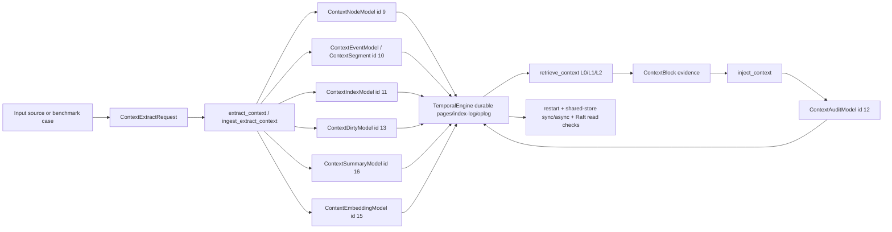

# Rust Context Pipeline Debug Trace

Last validated: 2026-06-25

This page records a real end-to-end Rust TemporalStore context pipeline run. It is intended for
debugging and tracing ingestion, extraction, retrieval, injection, and benchmark replay through the
Rust code path.

## Command

```bash
CARGO_TARGET_DIR=/tmp/temporalstore-context-workflow-target \
  cargo run -p temporalstore-rust --bin context_workflow_harness \
  > /tmp/temporalstore-real-context-workflow.log

python3 tools/validate_aws_validation_log.py \
  --job temporalstore-context-workflow-validation \
  --log /tmp/temporalstore-real-context-workflow.log
```

Validation result:

```text
temporalstore-context-workflow-validation: JSON validation passed
```

The harness creates a real `TemporalEngine` with local cache, page-store, and index directories,
executes durable context commands, then validates restart replay, shared-store sync replay,
shared-store async replay, Raft replica reads, and unified corpus readiness.

## Run Metrics

| Field | Value |
| --- | --- |
| `management_ready` | `true` |
| `ingest_extract_ready` | `true` |
| `retrieve_pipeline_ready` | `true` |
| `benchmark_ready` | `true` |
| `external_benchmark_ready` | `true` |
| `external_benchmark_dataset` | `locomo_style+longmemeval_s_style` |
| `external_benchmark_case_count` | `18` |
| `external_benchmark_hit_at_k` | `1.0` |
| `external_benchmark_mean_reciprocal_rank` | `0.5555556` |
| `external_benchmark_answer_term_coverage` | `1.0` |
| `external_benchmark_missing_expected_terms` | `0` |
| `external_benchmark_zero_hit_queries` | `0` |
| `external_benchmark_rust_context_event_ingest` | `true` |
| `external_benchmark_ingested_source_sets` | `18` |
| `external_benchmark_retrieved_source_sets` | `18` |
| `external_benchmark_total_retrieved_blocks` | `108` |

Category breakdown:

| Category | Cases | Hit@K | MRR | Answer Terms | Zero Hit |
| --- | ---: | ---: | ---: | ---: | ---: |
| `entity_alias` | 2 | 1.0 | 0.5 | 1.0 | 0 |
| `memory_update` | 3 | 1.0 | 0.6666667 | 1.0 | 0 |
| `multi_hop_reasoning` | 1 | 1.0 | 0.5 | 1.0 | 0 |
| `quantity` | 2 | 1.0 | 0.75 | 1.0 | 0 |
| `single_hop` | 4 | 1.0 | 0.5 | 1.0 | 0 |
| `social_link` | 2 | 1.0 | 0.5 | 1.0 | 0 |
| `temporal` | 4 | 1.0 | 0.5 | 1.0 | 0 |

## Data Flow



## Main Harness Input

The main non-benchmark trace uses the Rust harness input below:

```json
{
  "shard_id": 1,
  "tenant_hash": 20260616,
  "source_kind": "incident",
  "source_id": "mock-incident-1",
  "title": "Checkout risk incident",
  "body": "Customer checkout failed. Payment risk score spiked. The proxy retried safely and support asked for root cause.",
  "timestamp_ms": 1000,
  "provider": {
    "provider_name": "mock-openai-compatible",
    "provider_kind": "mock",
    "mock_mode": true
  }
}
```

Observed pipeline output summary from this run:

| Field | Value |
| --- | --- |
| `retrieve_block_count` | `3` |
| `selected_block_count` | `3` |
| `blocked_block_count` | `0` |
| `audit_selected_ref_count` | `3` |
| `injected_prompt_contains_context` | `true` |
| `provider_name` | `mock-openai-compatible` |

The multi-source ingest/extract path in the same run accepted two sources, failed zero sources, and
created two unique context nodes. Source kind coverage was one incident and one ticket.

## Model Data Written By Rust

### `ContextNodeModel` / `ContextNode`

Purpose: node-level entity or source summary record.

For each benchmark source, Rust creates:

```json
{
  "node_hash": "stable_hash64(external:<tenant_hash>:<source_kind>:<source_id>)",
  "parent_hash": 0,
  "kind": "1=document, 2=chat, 3=ticket, 4=code, 5=incident, 6=user_event",
  "canonical_name": "<source title, compacted>",
  "l0": "<title>: <body>, truncated to 32 words",
  "last_event_time_ms": "1000 + source_count - source_index"
}
```

Rust still accepts older node JSON fields such as `status`, `summary_dirty`,
`l1_ref`, and `raw_metadata_ref` for compatibility, but new C++/Rust parity
payloads keep those out of the hot node record. L1 text belongs in
`ContextSummary`; dirty state belongs in `ContextSummaryDirtyMarker`; provenance
belongs in resource/audit sidecars.

The main harness extraction writes the node through:

```text
Command::ContextUpsertNode
```

### `ContextEventModel` / `ContextSegment`

Purpose: timestamp-keyed event/segment text persisted in Rust TemporalStore pages.

For each benchmark source, Rust creates:

```json
{
  "event_id_hash": "stable_hash64(external-event:<source_id>:<body>)",
  "event_time_ms": "1000 + source_count - source_index",
  "ingestion_time_ms": "1000 + source_count - source_index",
  "type": 1,
  "confidence": 1.0,
  "importance": 1.0,
  "text": "<source body>"
}
```

Rust still accepts older event JSON fields such as `kind`, `actor_hash`,
`status`, `valid_until_ms`, `source_ref`, `related_node_hashes`, and
`compact_attrs`, but new writes encode only the compact C++ parity event shape.
Source, status, entity, and event-time-bucket lookups are represented as
secondary indexes rather than fields embedded in every hot event value.

The event is written through:

```text
Command::ContextWriteEvent { first_write_only: false }
```

### `ContextIndexModel` / `ContextIndexRef`

Purpose: secondary lookup from source or extracted attributes back to the primary event timeline.

Rust also mirrors the C++ `WRITE_EXTRACTED_EVENT` debug flow. A single
`ContextWriteExtractedEvent` call writes the event and fans out default internal indexes:

```json
{
  "event_object_key": "ctx:event:<tenant_hash>:<node_hash>",
  "written_indexes": [
    "event_kind",
    "entity",
    "status",
    "source",
    "event_time_bucket"
  ],
  "disabled_indexes": [
    "source"
  ]
}
```

The translated C++ test verifies six index writes for an event with two entity hashes, and verifies
that a disabled source index returns zero refs when queried.

For the benchmark replay, Rust writes a source secondary index:

```json
{
  "index_name": "source",
  "index_value_hash": "stable_hash64(<source_id>)",
  "scope_hash": 0,
  "event_time_ms": "<same event_time_ms>",
  "index_ref": {
    "primary_node_hash": "<node_hash>",
    "primary_event_time_ms": "<same event_time_ms>",
    "event_id_hash": "<event_id_hash>"
  }
}
```

Command:

```text
Command::ContextWriteIndexRef
```

### `ContextDirtyModel` / `ContextSummaryDirtyMarker`

Purpose: mark nodes whose summaries need refresh.

```json
{
  "node_hash": "<node_hash>",
  "event_time_ms": "<same event_time_ms>",
  "reason": 1,
  "propagate_depth": 1
}
```

Command:

```text
Command::ContextMarkSummaryDirty
```

### `ContextSummaryModel` / `ContextSummary`

Purpose: persist generated L0/L1 summaries for retrieval, node-context queries, and later
compression/refresh workflows.

Every Rust extraction now writes:

```json
[
  {
    "node_hash": "<node_hash>",
    "level": 1,
    "text": "<generated L0 summary>",
    "valid_from_ms": "<event_time_ms>"
  },
  {
    "node_hash": "<node_hash>",
    "level": 2,
    "text": "<generated L1 summary>",
    "valid_from_ms": "<event_time_ms>"
  }
]
```

Command:

```text
Command::ContextUpsertSummary
```

### `ContextEmbeddingModel` / `ContextEmbedding`

Purpose: persist OSS/OpenViking-provider embedding evidence for node summaries and event text.

Every Rust extraction now writes deterministic local embeddings seeded by the selected provider's
`embedding_model`, so OSS profiles such as `sentence-transformers/all-MiniLM-L6-v2`,
`nomic-embed-text`, and `BAAI/bge-m3` produce persisted `ContextEmbedding` records without claiming
a live model endpoint was called.

```json
[
  {
    "level": 1,
    "ref": "node_l0",
    "vector_dimensions": 16,
    "updated_at_ms": "<event_time_ms>"
  },
  {
    "level": 2,
    "ref": "node_l1",
    "vector_dimensions": 16,
    "updated_at_ms": "<event_time_ms>"
  },
  {
    "level": 3,
    "ref": "event_text",
    "vector_dimensions": 16,
    "updated_at_ms": "<event_time_ms>"
  }
]
```

Command:

```text
Command::ContextUpsertEmbedding
```

## C++-Style Query Debug Object

Rust retrieval now emits a verbose query-understanding object shaped for parity with the C++
query-index debug pages. The object keeps the older compact fields and adds explicit
filter-group accounting and selected-ref ordering:

```json
{
  "question_type": "semantic_recall",
  "secondary_index_filter_groups": [["query_term:checkout"]],
  "verbose_filter_groups": [
    {
      "group_id": "filter_group_1",
      "group_kind": "lexical_prefilter",
      "terms": ["query_term:checkout"],
      "candidate_count": 1,
      "matched_count": 1,
      "dropped_count": 0,
      "selected_count": 1,
      "candidate_ref_hashes": ["<bounded ref hash sample>"],
      "matched_ref_hashes": ["<bounded ref hash sample>"],
      "dropped_ref_hashes": [],
      "selected_ref_hashes": ["<bounded selected ref hash sample>"]
    }
  ],
  "prefilter_candidate_sample": [
    {
      "record_type": "context_event",
      "candidate_terms": [
        "event_kind:5",
        "record_type:context_event",
        "source_type:message"
      ],
      "passes_secondary_index_prefilter": true
    }
  ],
  "selected_refs": [
    {
      "rank": 1,
      "uri": "tsctx://tenant/<tenant>/node/<node>/event/<time>",
      "source_ref": "mock-incident-1",
      "tier": "l2",
      "ref_hash": "<stable selected ref hash>",
      "node_hash": "<node_hash>",
      "event_time_ms": 1000,
      "relevance_score": 100,
      "matched_filter_groups": ["filter_group_1"]
    }
  ]
}
```

The important parity points are:

| Field | Purpose |
| --- | --- |
| `verbose_filter_groups` | Shows the C++-style query-understanding filter groups used for secondary-index or lexical prefiltering. |
| `candidate_ref_hashes` / `matched_ref_hashes` / `dropped_ref_hashes` | Bounded samples explaining which event refs were considered, matched, or rejected before scoring. |
| `selected_refs` | Final injection/retrieval order with rank, source ref, URI, tier, ref hash, event time, and relevance score. |
| `matched_filter_groups` | Explains which query/filter group selected each evidence block. |

This does not claim byte-for-byte C++ debug JSON compatibility; it gives Rust and C++ the same
behavioral trace concepts so shared tests can compare query understanding, evidence selection, and
prompt-injection ordering.

### `ContextAuditModel` / `ContextPackAudit`

Purpose: record which blocks were selected or blocked for prompt injection.

In this run:

```json
{
  "selected_refs": 3,
  "blocked_refs": 0,
  "session_hash": 99,
  "query_id": "context-harness-query",
  "prompt_contains_context": true
}
```

Command path: `inject_context` persists selected and blocked refs as ContextPackAudit evidence.

### Additional Context Models

The current Rust model descriptor set includes the C++ Context family:

| Model | ID | Key Family | Status In Rust |
| --- | ---: | --- | --- |
| `ContextNodeModel` | 9 | `ctx:node` | exercised by extraction/retrieval |
| `ContextEventModel` / `ContextSegment` | 10 | `ctx:event` | exercised by extraction/retrieval and benchmark replay |
| `ContextIndexModel` | 11 | `ctx:index` | exercised by source secondary index replay |
| `ContextAuditModel` | 12 | `ctx:audit` | exercised by injection |
| `ContextDirtyModel` | 13 | `ctx:dirty` | exercised by extraction |
| `ContextChildModel` | 14 | `ctx:child` | covered by shared context corpus tests |
| `ContextEmbeddingModel` | 15 | `ctx:embedding` | covered by shared context corpus tests |
| `ContextSummaryModel` | 16 | `ctx:summary` | covered by shared context corpus tests |
| `ContextCompressionModel` | 17 | `ctx:compression` | covered by shared context corpus tests |
| `ContextEntityModel` | 18 | `ctx:entity` | covered by entity parity tests and docs |

## Concrete Benchmark Case Trace

Sample case: `locomo-current-preference`

Input:

```json
{
  "dataset": "locomo_style",
  "query_id": "locomo-current-preference",
  "query": "What is Alice's current office choice after the payment problem?",
  "expected_terms": ["downtown"],
  "sources": [
    {
      "title": "Earlier preference",
      "body": "Earlier memory: Alice preferred the airport office before the later change.",
      "kind": "chat"
    },
    {
      "title": "Latest preference update",
      "body": "During the latest conversation, Alice replaced her office preference with the downtown location after the billing issue was resolved.",
      "kind": "chat"
    }
  ]
}
```

Observed retrieval output:

```json
{
  "query_id": "locomo-current-preference",
  "hit": true,
  "rank": 2,
  "retrieved_blocks": 6,
  "zero_hit": false,
  "retrieval_ms": 690,
  "selected_source_ids": [
    "Earlier preference",
    "tsctx://tenant/17052395458312835944/node/12802052639897310847/source/Earlier preference",
    "tsctx://tenant/17052395458312835944/node/12802052639897310847/source/Earlier preference",
    "Latest preference update",
    "tsctx://tenant/17052395458312835944/node/13043118786761979731/source/Latest preference update",
    "tsctx://tenant/17052395458312835944/node/13043118786761979731/source/Latest preference update"
  ]
}
```

The six retrieved blocks are the L0/L1/L2 projections for the two source nodes. The expected answer
term `downtown` is present in the retrieved evidence, so the case contributes a successful Hit@K and
answer-term match.

## Rust Code Paths Used

| Stage | Rust Function / Command |
| --- | --- |
| Single-source extraction | `extract_context` |
| Batched ingestion plus extraction | `ingest_extract_context` |
| Durable node write | `Command::ContextUpsertNode` |
| Durable timestamped segment write | `Command::ContextWriteEvent` |
| Durable extracted-event fanout | `Command::ContextWriteExtractedEvent` |
| Durable secondary index write | `Command::ContextWriteIndexRef` |
| Dirty summary marker | `Command::ContextMarkSummaryDirty` |
| Retrieval | `retrieve_context` |
| Prompt injection | `inject_context` |
| Audit persistence | `ContextPackAudit` through injection |
| Restart validation | `verify_restart_replay` |
| Shared-store validation | `verify_shared_store_replay` in sync and async modes |
| Raft read validation | harness Raft replica read check |

## Debugging Notes

- This run uses Rust TemporalStore for ingestion, extraction, storage, retrieval, injection, restart
  replay, shared-store replay, and Raft read validation.
- Python is only used after the Rust run to validate the emitted JSON log.
- The benchmark section is the built-in LOCOMO/LongMemEval-style fixture, not a live GPT-4o-mini or
  OpenViking reader run.
- `external_benchmark_direct_source_scoring=false`, which confirms the score is not computed by
  bypassing Rust retrieval.
- `external_benchmark_all_source_replay=false` for this default harness run. Full all-source
  dataset replay remains a separate benchmark gate.
