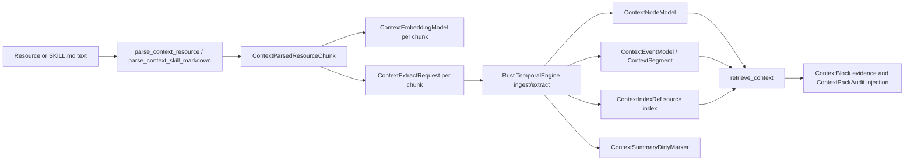

# Rust Context Resource And Skill Parser Parity

Shared case: `context_resource_skill_parser_openviking_parity`.

Rust now has a Rust-native parser path for OpenViking-style resources and Codex `SKILL.md` files. The parser is intentionally behavior-compatible with the C++ MatrixArk helper in `<cpp-temporalstore-checkout>/tools/matrixark_resource_parser.py`: it creates stable source refs, bounded chunks, token estimates, embedding refs, and metadata that can feed context ingestion/extraction/retrieval.

## Resource Parser

Input example:

```markdown
# Incident

Checkout latency increased because the payment dependency timed out.

## Fix

Rollback the payment gateway canary and verify p95 latency.
```

Rust API:

```rust
let report = parse_context_resource(ContextResourceParseRequest {
    raw_uri: "viking://resources/runbook.md".to_string(),
    resource_type: Some("md".to_string()),
    text,
    max_chunk_chars: 1400,
    overlap_chars: 120,
    chunk_hash_base: None,
});
```

Output shape:

- `resource_type`: normalized resource type such as `md`, `txt`, or `skill`.
- `resource_hash`: stable hash of the resource URI.
- `uri_scheme` and `resource_title`: normalized source classification for file,
  `viking://`, HTTP, Git, and other OpenViking-style resource identifiers.
- `source_refs`: all stable chunk refs in emission order.
- `chunks[].source_ref`: stable refs such as `runbook.md#heading=incident`, `runbook.md#heading=fix`, or `notes.txt#paragraph=0`.
- `chunks[].parent_source_ref`: parent heading ref for nested markdown sections.
- `chunks[].heading_path`: hierarchical heading slugs for query/debug traces.
- `chunks[].content_hash`: stable hash of the chunk source ref and content.
- `chunks[].metadata`: `heading`, `heading_slug`, `heading_level`, `heading_path`,
  `line_start`, `line_end`, `chunk_index`, `unit_index`, `split_index`,
  `resource_type`, `uri_scheme`, `resource_title`, `content_hash`,
  optional `linked_refs`, and optional `code_language` / `chunk_kind=code`.
- `chunks[].token_estimate`: whitespace-token estimate used by context prompt packing.
- `chunks[].embedding_ref_hash`: stable ref hash for `ContextEmbeddingModel`.

Each chunk can be converted to a deterministic embedding record:

```rust
let embedding = context_resource_chunk_embedding(&chunk, report.embedding_model.as_str(), now_ms);
```

## Skill And Tool Parser

Input example:

```markdown
---
name: payment-incident
description: Debug payment incident context.
---

# Payment Incident

## When To Use

Use when checkout latency or payment risk spikes.
```

Rust API:

```rust
let skill = parse_context_skill_markdown("skills/payment-incident/SKILL.md", text);
```

Output shape:

- `skill_name`: `name` from front matter, or inferred from the path.
- `description`: front matter `description`, or first non-heading paragraph.
- `front_matter`: normalized `SKILL.md` front-matter key/value metadata for routing and debug traces.
- `version` and `owner_scope`: skill lifecycle/routing metadata for Codex and
  OpenViking-style skill registries.
- `tag_refs`: normalized values from `tags`, `tag`, `categories`, or `category` front-matter fields.
- `capability_refs`: capability sections such as `when-to-use`, `tools`, `instructions`, `resources`, `references`, `examples`, and `capabilities`.
- `allowed_tools`: values from `allowed_tools`, `allowed_tool`, `tools`, or
  `tooling` front-matter. YAML-style multiline lists and inline arrays are both
  supported.
- `triggers`: normalized trigger/activation refs from front matter.
- `model_refs`: model/provider refs for model-switching and OSS/commercial
  provider policy traces.
- `tool_refs`: normalized bullet/numbered-list entries from `Tools`, `Tooling`, or `Commands` sections.
- `instruction_refs`: normalized bullet/numbered-list entries from `Instructions`, `Workflow`, `Steps`, or `When To Use` sections.
- `resource_refs`: normalized resource/reference ids from `Resources` or `References` sections, including markdown link targets such as `[Runbook](viking://resources/runbook.md)`.
- `example_refs`: normalized example text from `Examples` sections for prompt/debug trace parity.
- `parser_warnings`: non-fatal parser diagnostics retained for debugging traces.
- `resource`: the underlying `ContextResourceParseReport` with `resource_type=skill`.

## Data Flow



The focused Rust tests verify resource refs, `SKILL.md` front matter, tag refs, capability sections, tool refs, instruction refs, resource/reference refs, example refs, chunk embeddings, and end-to-end ingestion/retrieval. `parsed_resource_and_skill_chunks_feed_rust_ingestion_and_retrieval` parses one markdown resource and one skill, converts every parsed chunk into a `ContextExtractRequest`, persists each chunk embedding through `ContextUpsertEmbedding`, runs `ingest_extract_context`, verifies `retrieve_context` returns evidence about payment dependency rollback and p95 latency, and queries the embeddings back through `ContextQueryEmbeddings`.

## C++ Parity Notes

- C++ helper parity source: `<cpp-temporalstore-checkout>/tools/matrixark_resource_parser.py`.
- C++ tests: `<cpp-temporalstore-checkout>/tools/test_matrixark_resource_parser.py`.
- Rust shared case: `context_resource_skill_parser_openviking_parity`.
- Rust parser is not a viking filesystem clone; it produces Rust TemporalStore context inputs with OpenViking-compatible source refs and chunk metadata.

## Validation

```bash
cargo test -p temporalstore-rust context_resource --lib -- --test-threads=1
cargo test -p temporalstore-rust context_skill --lib -- --test-threads=1
cargo test -p temporalstore-rust parsed_resource_and_skill_chunks_feed_rust_ingestion_and_retrieval --lib -- --test-threads=1

python3 tools/run_temporalstore_unified_tests.py --validate-only
```
