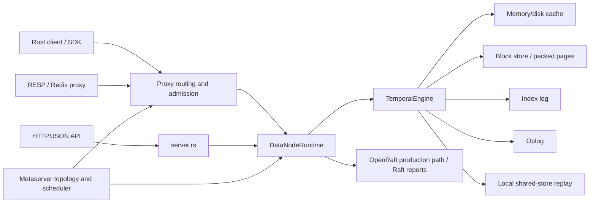
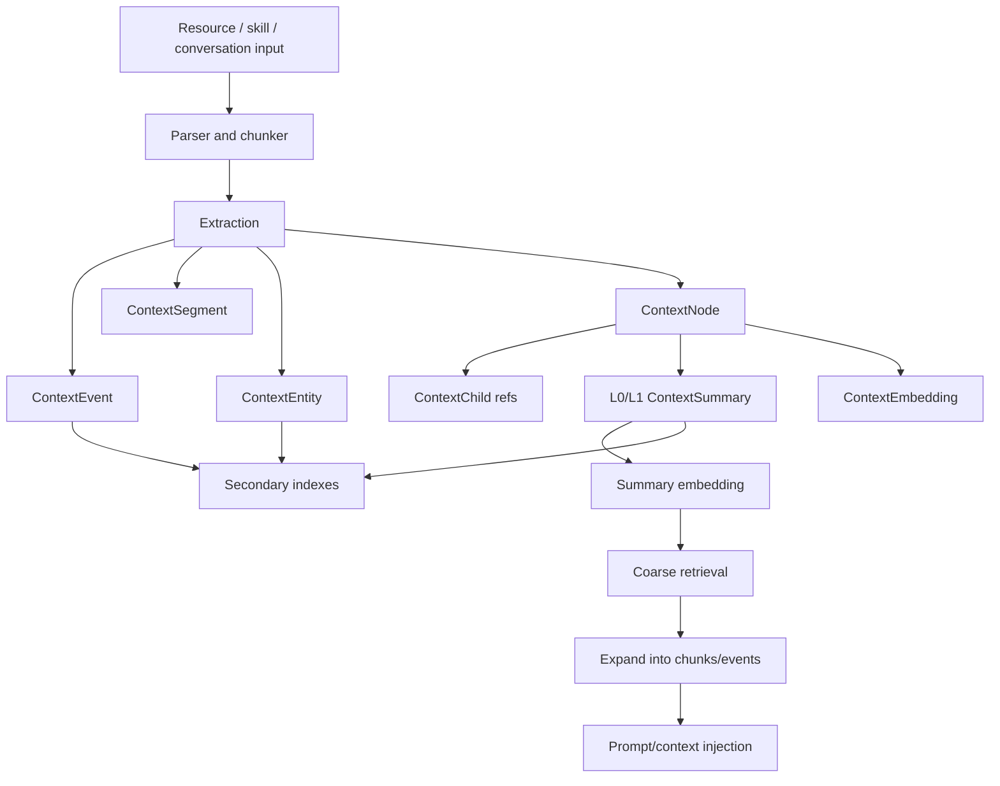

# Rust TemporalStore Code Deep Dive

## Scope

This document is a code-oriented map of the Rust TemporalStore implementation in
`crates/temporalstore-rust`. It focuses on how the Rust code is organized, where
major product behavior lives, how data flows through storage, Raft, context
management, client/proxy paths, and what the current test and parity posture
looks like versus the shared C++/Rust test corpus.

Rust TemporalStore is intentionally Rust-native. The production surfaces are
HTTP/JSON, RESP, tonic-style service contracts, Rust SDK/client paths, shared
store replay, and OpenRaft-backed readiness evidence. brpc/thrift wire
compatibility and byte-for-byte C++ page/log layout are not part of the Rust
runtime contract unless separately re-scoped.

## Top-Level Crate Map

The main Rust crate exposes the following public modules from
`crates/temporalstore-rust/src/lib.rs`:

| Module | Primary role |
| --- | --- |
| `types` | Shared command, response, table, shard, feature, sequence, IPS, risk, context, storage, and readiness types. |
| `engine` | Core execution engine, shard state, command dispatch, durable writes, storage/cache integration, admin reports. |
| `lock_store` | Page envelopes, page addresses, packed timestamp/value page records, slot dump/load and recovery helpers. |
| `cache` | Memory and disk block cache accounting, admission/eviction stats, cache refill behavior. |
| `index_log` | Durable index-log append/replay path used by engine recovery. |
| `oplog` | Durable operation-log append/replay path. |
| `shared_store` | Local file/shared-store checkpoint, replay, cursor, and retention logic. |
| `replica_replay` | Secondary replay and async/sync replica validation helpers. |
| `raft` | Rust-native Raft abstractions, OpenRaft production evidence model, local test fixtures, snapshot/failover reports. |
| `data_node` | Data-node runtime, shard lifecycle, scheduler tasks, lifecycle snapshots, data-node admin surface. |
| `meta` | Metaserver topology, table/shard lifecycle, scheduler task reports, membership tokens. |
| `rebalance` | Rebalance and placement planning. |
| `client` | Typed Rust client, topology sync, retry budgets, route invalidation, product API wrappers. |
| `proxy` | Proxy routing, admission, topology-version cache, backend quarantine, C++ alias replacement routes. |
| `redis` | RESP command parsing and Redis-compatible command execution over the TemporalStore engine. |
| `http` | HTTP request/response helpers shared by service binaries. |
| `ingestion` | Kafka/Flink-style ingestion record mapping, offset/checkpoint/dead-letter reports. |
| `context_workflow` | Context ingestion, extraction, embeddings, summaries, retrieval, injection, debug traces, resource/skill paths. |
| `readiness` | Production readiness gates, blocker reports, evidence mapping. |
| `control` | Control-plane helper types and admin command wiring. |
| `sdk` | Higher-level SDK-facing helpers. |
| `e2e` | End-to-end harness support. |
| `partition_id` | Partition and shard ID helpers. |

The crate also has several production and validation binaries under
`crates/temporalstore-rust/src/bin`, including server, metaserver, benchmark,
context workflow, Raft, storage, readiness, and shared-corpus harnesses.

## High-Level Runtime Flow



The common request path is:

1. A request enters through client, proxy, RESP, or HTTP.
2. Proxy/client logic resolves table and shard routing using cached topology.
3. The data-node runtime checks lifecycle state and request admission.
4. `TemporalEngine` dispatches a `Command` to the target shard.
5. Mutating commands update in-memory indexes and append durable state through
   index-log, oplog, block store, shared-store, and Raft evidence paths where
   enabled.
6. Reads use index state first, then cache/block-store/shared-store refill paths.
7. Admin/readiness endpoints expose the current evidence and blockers.

## Command And Data Model Core

`types.rs` is the product contract center. It defines:

- `Command`: string, hash, set, feature, sequence, IPS, risk, Redis/admin,
  context, ingestion, storage, and lifecycle commands.
- `CommandResponse`: typed results for each command family.
- Product-specific structs such as feature points, sequence rows, IPS rows,
  risk metadata, context nodes/events/segments/entities, storage reports, cache
  reports, and Raft/readiness reports.

This is the main place to inspect when comparing Rust behavior with C++ product
APIs, because most higher-level surfaces eventually map into these command and
response types.

## Engine Deep Dive

`engine.rs` is the largest and most important production file. It owns
`TemporalEngine`, shard maps, command dispatch, durable execution, recovery, and
admin reports.

Key responsibilities:

- Table and shard lifecycle management.
- Product command dispatch in `execute_on_shard`.
- Durable mutation handling in `execute_durable` and checked execution paths.
- Packed timestamp/value storage integration for timeline-like data.
- Index-log and oplog append/replay.
- Cache invalidation and refill accounting.
- Storage lifecycle reports, slot summaries, dump/load reports, and readiness
  inputs.
- Context model persistence through the same command model used by benchmark and
  resource/skill pipelines.

The engine is intentionally the shared substrate for product APIs. That means a
Redis command, typed Rust client call, context ingestion pipeline command, or
proxy-routed HTTP command should converge into the same engine behavior instead
of maintaining parallel product implementations.

## Storage And Cache

Rust storage keeps a Rust-native page envelope and log format. C++ parity is
tracked as behavior and migration/replay parity, not byte-for-byte internal
layout parity.

Important files:

- `block_store.rs`: page segments, page addresses, page envelopes, packed
  timestamp/value records, slot dump/load metadata, corruption/recovery helpers.
- `cache.rs`: block-cache stats, hit/miss/fill counters, admission and eviction
  accounting.
- `shared_store.rs`: local shared-store checkpoints, replay cursors, follower
  retention, sync/async replay evidence.
- `replica_replay.rs`: secondary replay reports and async/sync replica checks.
- `index_log.rs` and `oplog.rs`: durable replay order inputs.

Storage recovery is designed around the order:

1. extent/page manifest inspection
2. page segment inspection
3. checkpoint or slot dump manifest
4. index-log tail
5. oplog tail

The current readiness posture emphasizes:

- orphan page detection
- missing and stale page references
- corrupt page/index/oplog/snapshot evidence
- follower-cursor safe GC
- cache pressure and refill
- shared-store sync/async replay
- unified storage corpus cases

## Context Workflow

`context_workflow.rs` is the Rust-native context pipeline implementation. It is
also the main benchmark substrate for LOCOMO, LongMemEval, resource/skill
ingestion, and MCP/Codex style context paths.

The context pipeline covers:

- resource and skill ingestion
- text parsing and chunking
- context event, segment, entity, node, child-ref, embedding, summary, and
  compression records
- L0/L1 summaries
- embedding labels and provider metadata
- secondary indexes for refs, entities, resources, skills, and summaries
- retrieval via summaries and expanded evidence
- prompt/context injection packs
- OpenViking-style debug traces for query flow

The canonical data flow is:



For benchmarks, Python may still orchestrate dataset conversion and scoring, but
accepted evidence requires Rust TemporalStore as the ingestion, storage,
retrieval, and replay backend. Python-only diagnostic runs are not production
benchmark evidence.

## Raft And Distributed Runtime

`raft.rs` contains the Rust Raft abstraction layer, reports, local fixtures, and
production evidence types. The repository has moved toward production OpenRaft
mode as the readiness-eligible path. Local Raft models are retained as unit-test
fixtures only and must not satisfy production readiness.

Key Raft concerns represented in the Rust code and shared cases:

- log-store durability evidence
- applied-index fences
- snapshot build/install/restart recovery
- leader election and transfer
- membership add/promote/remove
- follower lag and catch-up
- secondary-read eligibility
- stale-read rejection
- RustRaft-style operational metrics and fault scenario coverage

Production readiness should depend on multi-process OpenRaft evidence for both
data-node and metaserver paths, not on local in-process fixtures.

## Data Node, Metaserver, Proxy, And Client

### Data Node

`data_node.rs` owns runtime execution around the engine:

- shard lifecycle states such as loading, serving, readonly, reloading,
  unloading, and failed
- load/reload/unload task handling
- lifecycle snapshot persistence
- lifecycle barriers for read/write admission
- admin inspection and topology validation reports
- interaction with Raft and shared-store evidence

### Metaserver

`meta.rs` models control-plane state:

- table/shard topology
- transitional table and shard states
- scheduler tasks and retry history
- membership tokens and generation checks
- topology history and operational reports

The C++ parity target here is behavior: scheduler-owned topology and membership
changes, durable replay, stale token rejection, and real data-node process
coordination.

### Proxy

`proxy.rs` handles:

- topology-version guarded routing
- table and shard route invalidation
- backend health quarantine and probing
- readonly/write-disabled/drop-percent admission
- degraded and overload reports
- Rust-native migration routes and C++ alias replacement paths

### Client

`client.rs` provides:

- typed table APIs
- topology sync and background refresh semantics
- separate read/write retry budgets
- stale route invalidation
- route quarantine handling
- Neptune/deployment placement hooks
- context and product API wrappers

## API And Binary Surfaces

Important binaries include:

- `server.rs`: HTTP/JSON data-node API, context APIs, storage admin, ingestion,
  Raft and readiness routes.
- `metaserver.rs`: metaserver API and scheduler/admin surfaces.
- `redis_proxy.rs`: RESP-compatible proxy path.
- `readiness_gate.rs`: production readiness service checks.
- `context_workflow_harness.rs`: context pipeline validation.
- `context_benchmark_report.rs`: LOCOMO/LongMemEval style report generation.
- Raft/storage harness binaries for rollout, secondary replication, storage
  production, and fault validation.

## Unified C++/Rust Test Corpus Posture

The shared corpus is the product-behavior contract intended to be consumed by
both Rust and C++.

Current inventory snapshot from the repo tooling:

| Metric | Count |
| --- | ---: |
| Shared corpus cases | 150 |
| Shared corpus steps | 312 |
| Existing-test linked steps | 107 |
| Rust attributed tests counted by script | 552 |
| TemporalStore Rust attributed tests from validator | 545 |

Shared families currently include:

- storage/cache parity
- data Raft parity
- context pipeline parity
- context benchmark parity
- ingestion parity
- proxy/client/control-plane parity
- data-node lifecycle parity
- metaserver control-plane parity
- ops/scale parity
- Codex/MCP parity
- Redis/admin product parity

Adapter status is still mixed. Raft has native plus static gate coverage,
benchmarks have a native adapter contract, and several families still depend on
temporary static surface gates until the executable C++ adapter side is broader.

## LOC And File Hot Spots

Rust code inventory from local counting:

| Area | Files | Code LOC | Total LOC |
| --- | ---: | ---: | ---: |
| Rust total | 75 | 103,495 | 109,105 |
| Rust production path based | 58 | 75,402 | 79,494 |
| Rust test path based | 17 | 28,093 | 29,611 |
| `temporalstore-rust` source tree | 65 | 99,789 | 105,127 |
| `temporalstore-snapshot` | 6 | 1,306 | 1,429 |

Largest implementation files:

| File | Code LOC | Notes |
| --- | ---: | --- |
| `engine.rs` | 16,316 | Core dispatch, storage, recovery, admin reports. |
| `raft.rs` | 8,974 | Raft model, reports, OpenRaft readiness evidence. |
| `context_workflow.rs` | 6,056 | Context/resource/skill pipeline and benchmarks. |
| `redis.rs` | 5,907 | RESP and Redis command behavior. |
| `bin/metaserver.rs` | 4,490 | Metaserver process surface. |
| `bin/server.rs` | 4,451 | Data-node/server process surface. |
| `meta.rs` | 3,862 | Topology and scheduler state. |
| `client.rs` | 3,359 | Typed client and routing behavior. |
| `proxy.rs` | 2,854 | Proxy route/admission/quarantine behavior. |
| `data_node.rs` | 2,715 | Data-node runtime and lifecycle. |

The biggest maintainability opportunities are `engine.rs`, `raft.rs`,
`context_workflow.rs`, `redis.rs`, and the server/metaserver binaries. Those
files carry many production responsibilities and would benefit from gradual
module splits that preserve public behavior and shared tests.

## Validation Commands

Useful focused checks:

```bash
cargo test -p temporalstore-rust --lib -- --test-threads=1
cargo test -p temporalstore-rust --tests -- --test-threads=1
python3 tools/run_temporalstore_unified_tests.py --validate-only
python3 tools/validate_no_duplicate_tests.py
python3 tools/validate_rust_product_test_guard.py
cargo run -p temporalstore-rust --bin context_workflow_harness
cargo run -p temporalstore-rust --bin readiness_gate -- --service-reports
```

Benchmark evidence checks should require Rust TemporalStore as the backend for
ingestion, extraction, retrieval, and replay. Live OSS or GPT-style reader
claims require a configured endpoint or API key and archived report metadata.

## Current Readiness Interpretation

The Rust codebase has substantial behavior coverage, but production readiness
should remain evidence based:

- Storage/cache readiness is strong for Rust-native local/shared-store paths,
  but broad deployment and external object-store evidence remains scoped
  separately.
- Raft readiness should be tied to OpenRaft multi-process evidence and not to
  local fixtures.
- Client/proxy readiness is Rust-native: HTTP/JSON, RESP, and tonic contracts
  replace brpc/thrift.
- Context benchmark readiness requires Rust TemporalStore backend evidence;
  paper-comparable VikingMem claims additionally require real dataset, live
  reader, full replay, and archived report fields.
- C++ parity should be measured by shared executable product behavior, not by
  LOC matching or internal implementation shape.

## Recommended Next Deep-Dive Work

1. Split `engine.rs` into storage lifecycle, command dispatch, product model,
   context, and admin report modules.
2. Split `raft.rs` into production adapter, local test fixture, snapshot,
   membership, metrics/admin, and harness report modules.
3. Split `context_workflow.rs` into resource lifecycle, skill registry,
   embedding provider, summary retrieval, benchmark runner, and debug trace
   modules.
4. Move more Rust-local product tests into shared corpus cases and keep only
   Rust internals in local tests.
5. Expand executable C++ adapters so shared corpus comparison can replace static
   surface gates family by family.
6. Keep all benchmark docs strict about whether a result is deterministic
   engineering evidence, live-reader evidence, or paper-comparable evidence.
