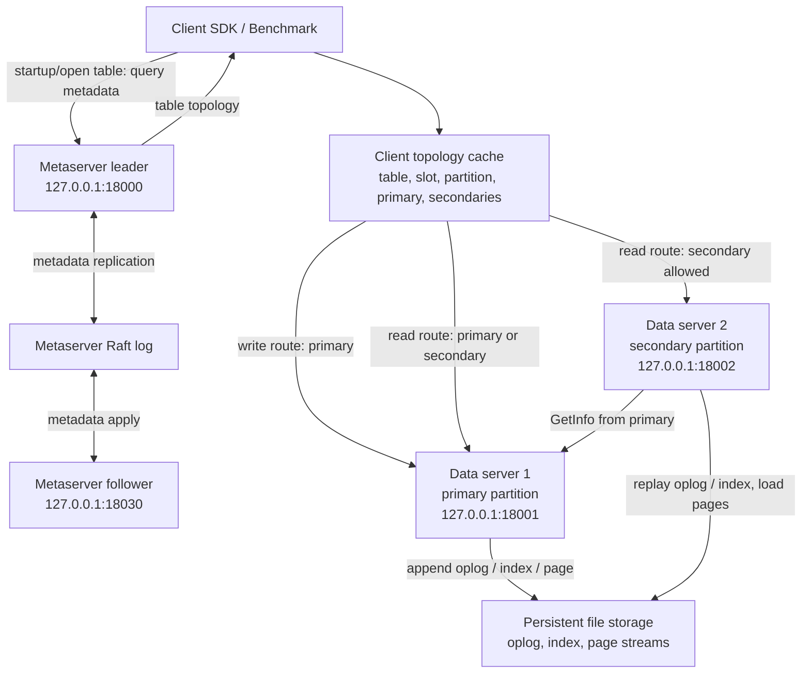
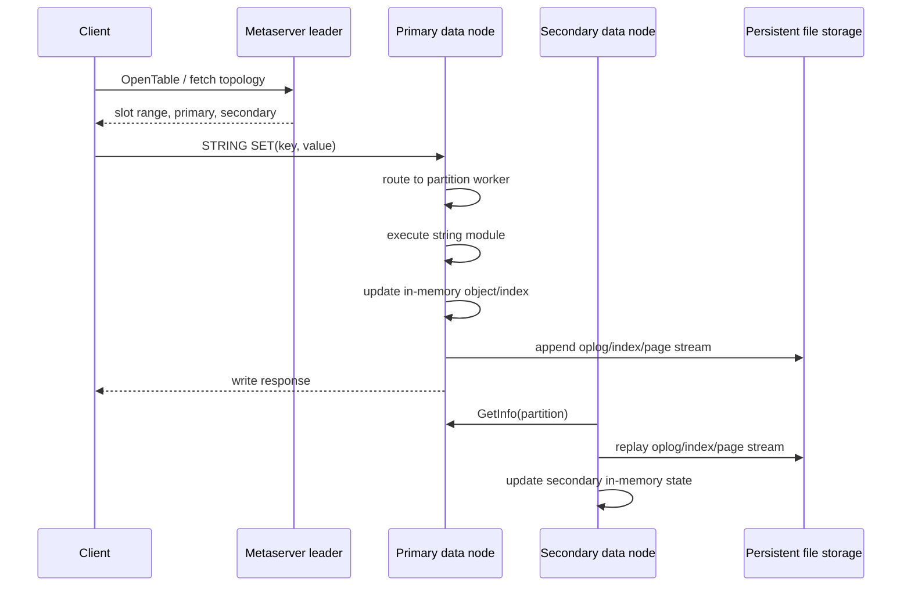
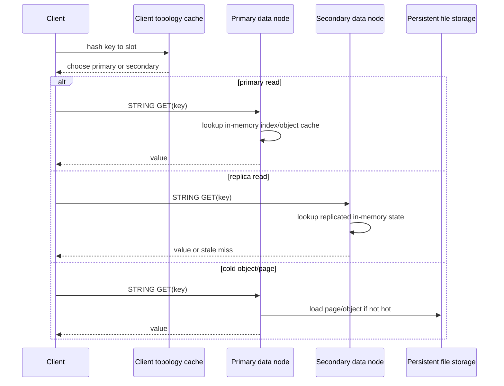

# TemporalStore Scale Test And Request Flow

## Test Setup

Date: 2026-05-27

Environment:

- WSL2 Ubuntu 22.04 on local Windows machine.
- TemporalStore local cluster: 2 metaservers, 2 data servers, 1 primary partition, 1 secondary partition.
- TemporalStore storage: persistent `file://` streams under `/tmp/temporalstore-deploy/runtime/storage`.
- TemporalStore build used for measured numbers: Debug/O0 build. A Release/O3 build was attempted, but third-party `-Werror=unused-result` warnings still block completion.
- Redis: Redis 6.0.16, local single-node server, tested with no persistence, AOF `everysec`, and AOF `always`.
- Workload: plain string `SET` then `GET`, 50,000 operations per phase.

Important: these numbers are smoke-scale numbers for local wiring and relative shape, not production capacity.

## Request Flow

## Write Path Breakdown

Breakdown:

- Metaserver is not on every data request after the client has topology.
- Writes are pinned to primary.
- The primary updates memory and durable streams.
- The secondary catches up asynchronously by using primary metadata plus persisted streams.
- If a read is routed to a secondary immediately after a write, it can be stale.

## Read Path Breakdown

## TemporalStore Results

Source: `/tmp/temporalstore-scale-/temporalstore.csv`

| Case | Phase | QPS | p50 ms | p95 ms | p99 ms | Errors |
|---|---:|---:|---:|---:|---:|---:|
| 50k ops, 32 clients, 128B, primary reads | SET | 1,474 | 20.18 | 36.25 | 46.37 | 0 |
| 50k ops, 32 clients, 128B, primary reads | GET | 3,728 | 8.01 | 14.55 | 18.51 | 0 |
| 50k ops, 64 clients, 128B, primary reads | SET | 1,284 | 47.32 | 76.70 | 101.33 | 0 |
| 50k ops, 64 clients, 128B, primary reads | GET | 3,031 | 19.95 | 32.32 | 41.76 | 0 |
| 50k ops, 32 clients, 1KB, primary reads | SET | 918 | 31.63 | 60.23 | 86.14 | 0 |
| 50k ops, 32 clients, 1KB, primary reads | GET | 2,703 | 10.83 | 20.81 | 28.80 | 0 |
| 50k ops, 32 clients, 128B, replica reads allowed | SET | 1,026 | 29.63 | 48.99 | 61.37 | 0 |
| 50k ops, 32 clients, 128B, replica reads allowed | GET | 3,965 | 7.19 | 16.21 | 22.83 | 0 |

Observed shape:

- Plain `STRING SET` is much slower than Redis in this local build.
- Reads improve slightly when replica reads are allowed, but the gain is small in this 2-node local run.
- Larger values reduce write QPS more than read QPS.
- Higher client concurrency did not improve this local build; p99 became worse, which suggests CPU/threading/logging overhead before storage bandwidth.

## Redis Results

Source: `/tmp/temporalstore-scale-/redis.csv`

| Case | Redis mode | SET QPS | GET QPS |
|---|---|---:|---:|
| 50k ops, 32 clients, 128B | no persistence | 10k to 24.6k | 13.1k to 23.2k |
| 50k ops, 64 clients, 128B | no persistence | 1.96k | 3.78k |
| 50k ops, 32 clients, 1KB | no persistence | 9.14k | 12.25k |
| 50k ops, 32 clients, 128B | AOF everysec | 5.79k to 10.18k | 10.62k to 12.94k |
| 50k ops, 64 clients, 128B | AOF everysec | 9.21k | 11.91k |
| 50k ops, 32 clients, 1KB | AOF everysec | 6.61k | 9.11k |
| 50k ops, 32 clients, 128B | AOF always | 0.97k to 1.14k | 11.39k to 13.17k |
| 50k ops, 64 clients, 128B | AOF always | 2.00k | 13.36k |
| 50k ops, 32 clients, 1KB | AOF always | 1.06k | 9.85k |

Redis observations:

- Redis is the right default for plain non-persistent string KV.
- Redis AOF `always` makes writes much closer to TemporalStore's current local write QPS, but Redis reads remain much faster for plain strings.
- Local WSL Redis numbers have visible variance, especially no-persistence duplicate runs.

## Storage Footprint

After this run:

| System | Path | Size |
|---|---|---:|
| TemporalStore | `/tmp/temporalstore-deploy/runtime/storage` | 93 MB |
| Redis no persistence | `/tmp/temporalstore-scale-/redis-none` | 4 KB |
| Redis AOF everysec | `/tmp/temporalstore-scale-/redis-everysec` | 12 MB |
| Redis AOF always | `/tmp/temporalstore-scale-/redis-always` | 12 MB |

TemporalStore stores page/index/oplog stream data; this is not directly comparable with Redis no-persistence storage.

## What This Means

For plain `STRING SET/GET`, Redis should win and customers should use Redis.

TemporalStore should be benchmarked where Redis is not a direct engine match:

- time-window aggregation
- risk/frequency cap
- long sequence feature serving
- large objects with cold/hot page behavior
- queryable persisted state after memory eviction
- custom storage-side functions

## Next Benchmark Work

1. Fix Release/O3 build blockers in bundled dependencies or add a benchmark build profile that suppresses third-party `unused-result` warnings.
2. Add TemporalStore feature/risk/sequence concurrent benchmarks, not only string KV.
3. Add cold-read test: write data, restart data nodes, measure first-read latency from file storage.
4. Add primary failure test: write load, stop primary, observe metaserver behavior and replica freshness.
5. Add disk/device metrics: iostat, process CPU, RSS, and storage bytes per op.
6. Add Redis application-side time-window implementation for an apples-to-apples risk-feature comparison.
