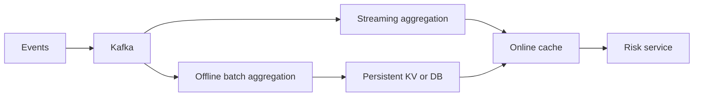
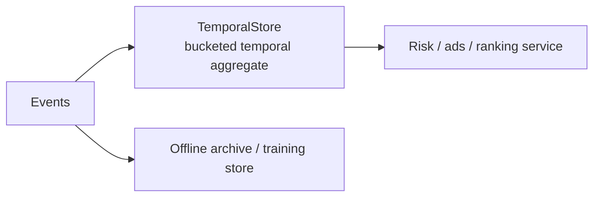

# TemporalStore: Online Temporal Features Without a Separate Aggregation Pipeline

Most online feature systems split one business question across several systems:

- a streaming pipeline computes recent counters
- a batch job computes historical aggregates
- a key-value store serves latest features
- a cache hides read latency
- a database or lake stores raw events for training and backfills

That architecture works, but it is expensive to operate and hard to change. Every new risk rule or ranking feature can require a new streaming job, a new materialization path, and careful reconciliation between offline and online values.

TemporalStore is designed around a different idea: keep high-cardinality temporal state close to the online serving engine. Instead of treating storage as a passive key-value cache, TemporalStore can store structured temporal objects and execute small, bounded computations inside the serving path.

The first strong use case is online feature serving for risk, fraud, ads, recommendation, and personalization workloads. The same design also has a natural AI-serving extension: store the fast-changing context, session, retrieval, cache-metadata, and serving-stat state around GPU inference systems.

## The Workload

Temporal features often look simple at the product level:

- `user_id -> count purchases in last 5 minutes`
- `device_id -> failed logins by country in last 30 minutes`
- `card_id -> unique merchants in last 24 hours`
- `merchant_id -> chargebacks in last 7 days`
- `campaign_id + user_id -> impressions in last 1 hour`
- `ip + account_id -> signup attempts in last 10 minutes`

The hard part is not the formula. The hard part is the shape:

- very high cardinality keys
- many small updates
- arbitrary serving windows
- filters on event dimensions
- low-latency online reads
- persistent state, not only best-effort cache
- online/offline consistency requirements

If each feature is precomputed by a separate batch or streaming job, feature development becomes slow. If every online query scans raw events, latency becomes unpredictable. TemporalStore sits between those extremes.

## TemporalAggregate Data Model

TemporalStore's `TemporalAggregate` model stores per-key, per-metric, per-dimension, per-time-bucket aggregate values.

An ingest request contains:

```text
key              entity key, such as user_id, device_id, card_id
metric           feature name, such as failed_login_count
dimensions       filters, such as country=US, result=failed
timestamp_ms     event time
bucket_width_ms  granularity, such as 60 seconds
value            increment or observed value
op               COUNT, SUM, MIN, or MAX
ttl_ms           optional object TTL
```

Internally, the model uses one hash object per entity key. Each aggregate bucket is stored as a hash field:

```text
HashObject(key)[metric | bucket_width | sorted_dimensions | bucket_id] = aggregate_value
```

For example:

```text
key = device_123
metric = failed_login_count
dimensions = country=US, result=failed
bucket_width = 60s
bucket_id = 28333333
value = 2
```

becomes conceptually:

```text
HashObject(device_123)[failed_login_count|60000|country=US&result=failed|00000000000028333333] = 2
```

The actual implementation uses length-prefixed field parts, a separator byte, sorted dimensions, and fixed-width bucket ids so the fields can be scanned by range.

## Aggregate Windows vs Sequence Windows

TemporalAggregate is optimized for scalar aggregate answers, not for returning raw event lists.

Good TemporalAggregate queries look like:

```text
user_id -> count purchases in last 5 minutes
device_id + country -> failed logins in last 30 minutes
merchant_id -> max chargeback score in last 7 days
campaign_id:user_id -> sum impressions in last hour
```

The result is one small value per metric/window, such as `count=12` or `max_score=0.93`. Query latency stays low because the server scans compact bucket cells and folds them with `COUNT`, `SUM`, `MIN`, or `MAX`. It does not scan or return every raw event.

Long behavior-history queries are different:

```text
user_id -> last 100 clicked item ids
user_id -> all ad exposures in a window with action/campaign filters
device_id -> timestamped login attempts with country and result fields
```

Those should use the Sequence/Feature model. Sequence-style queries return rows or points, so latency and response size depend on how many rows match the window and filters. TemporalAggregate and Sequence can live in the same cluster, but they serve different shapes:

```text
TemporalAggregate -> fast scalar window values
Sequence Feature  -> bounded lists / rows / behavior history
```

## AI Context And GPU-Serving Metadata

TemporalStore is not a GPU compute engine today, and it should not initially compete with GPU memory managers inside vLLM, SGLang, TensorRT-LLM, or LMCache. Those systems own tensor layout, device memory, pinned CPU memory, block scheduling, and attention-cache APIs.

The better first AI use case is the online state around GPU serving:

```text
session_id -> recent user/agent/tool timeline
user_id -> long-lived preference and memory events
tenant + model + prefix_hash -> KV-cache object metadata and reuse score
request_id -> token count, latency, routing, retry, and cost state
doc_chunk_id -> embedding version, source file, timestamp, and retrieval metadata
model + tenant + route -> rolling p95 latency and error counters
```

This state has the same shape as the feature-serving workloads TemporalStore is built for:

- high-cardinality keys
- many small writes
- bounded time-window reads
- structured context objects
- hot/cold serving tiers
- persistence beyond process memory

That suggests several future AI-specific data models:

| Model | What It Stores | Example |
|---|---|---|
| `SessionMemory` | timestamped conversation, tool, and observation events | build prompt context for an agent session |
| `KVCacheIndex` | prefix hashes, token ranges, cache object refs, TTL, reuse stats | find whether an LLM prefix can reuse remote cache |
| `EmbeddingMetadata` | chunk ids, embedding version, source pointer, freshness | pair with Milvus/Viking/vector DB |
| `GPUServingAggregate` | model/tenant/route counters and latency windows | autoscaling, throttling, cost control |
| `TensorBlockRef` | tensor-block metadata and storage locations | later cache coordination, not raw GPU ownership |

The product boundary matters. TemporalStore should store metadata, context timelines, indexes, counters, and references. Raw KV-cache tensors are large and model-layout-specific; they should remain in the inference/cache layer unless a user proves they need TemporalStore to own that payload. A credible AI roadmap starts with context and cache metadata, then integrates with LMCache-style systems before attempting raw tensor-block storage.

## How Ingestion Works

When an event arrives, the client sends an `INCR` request to the TemporalAggregate module.

Example event:

```text
10:01:20 device_123 failed login from country=US
```

Request:

```text
key = device_123
metric = failed_login_count
dimensions = country=US, result=failed
timestamp_ms = 10:01:20
bucket_width_ms = 60000
value = 1
op = COUNT
```

The server computes:

```text
bucket_id = timestamp_ms / bucket_width_ms
field = encode(metric, bucket_width, sorted_dimensions, bucket_id)
```

Then it updates one bucket value inside the hash object:

```text
old_value = HashObject(key)[field]
new_value = old_value + 1
HashObject(key)[field] = new_value
```

For `SUM`, the write adds the request value. For `MIN` and `MAX`, the write folds the new value into the bucket using the corresponding operator.

The important point is that TemporalStore does not need to append every raw event for this model. It writes the aggregate bucket directly. If 10,000 failed login events hit the same `(device, country, result, minute)` bucket, the stored value is still one bucket cell, not 10,000 raw rows.

That is why this model is useful for high-QPS frequency caps, counters, and risk features.

## How Query Works

A query specifies the same key, metric, dimensions, bucket width, operation, and a time range:

```text
key = device_123
metric = failed_login_count
dimensions = country=US, result=failed
start = 10:00
end = 10:30
bucket_width = 60s
op = COUNT
```

The server computes:

```text
start_bucket = start / bucket_width
end_bucket = (end - 1) / bucket_width + 1
prefix = encode(metric, bucket_width, sorted_dimensions)
```

Then it range-scans only fields between:

```text
prefix + start_bucket
prefix + end_bucket
```

For each matching bucket, it parses the bucket value and folds the result:

```text
COUNT/SUM -> add bucket values
MIN       -> min(bucket values)
MAX       -> max(bucket values)
```

The response contains both the folded value and the individual buckets:

```text
has_value = true
value = 3
buckets = [
  10:01 -> 2,
  10:02 -> 1
]
```

The query cost is proportional to the number of matching buckets, not the number of raw events. A 30-minute query at one-minute granularity scans at most 30 bucket cells for one exact dimension combination.

## Why This Is Flexible

Offline aggregation is efficient when the feature definition is stable:

```text
daily batch job -> precomputed feature table -> online materialization
```

But real risk and personalization features change often:

- change the time window from 30 minutes to 10 minutes
- add a filter such as `country=US`
- split by `result=failed`
- add a new merchant category dimension
- test a new bucket granularity
- run a new rule for a subset of traffic

With a pure offline pipeline, each change can require a new job or a new materialized feature. With TemporalAggregate, many of these changes can be expressed at write/query time:

- users can choose the entity key
- users can choose metric names
- users can choose dimensions
- users can choose bucket width
- users can query different windows over the same bucketed state
- users can add new aggregate metrics without building a separate streaming pipeline for every feature

This does not eliminate offline storage or training pipelines. Historical training data still belongs in a lake, warehouse, or offline feature store. TemporalStore's role is the online serving state: the low-latency, high-cardinality, frequently updated temporal state that has to answer production traffic now.

## One Store Instead of Many Moving Parts

A traditional system for a risk counter might look like this:



TemporalStore can simplify the online side:



The offline archive is still useful for training, replay, and audits. But the online serving path no longer needs a separate materialized table for every short-window feature.

## Concrete Feature Examples

### Failed Logins

```text
key = device_id
metric = failed_login_count
dimensions = country, result
bucket_width = 1 minute
op = COUNT
query = last 30 minutes where country=US and result=failed
```

Good for account takeover risk and abuse detection.

### Purchase Amount

```text
key = user_id
metric = purchase_amount
dimensions = merchant_type
bucket_width = 5 minutes
op = SUM
query = last 1 hour where merchant_type=grocery
```

Good for spend velocity and personalization.

### Chargeback Monitoring

```text
key = merchant_id
metric = chargeback_count
dimensions = card_country, payment_method
bucket_width = 1 hour
op = COUNT
query = last 7 days
```

Good for merchant risk scoring.

### Frequency Cap

```text
key = campaign_id:user_id
metric = impression_count
dimensions = placement, creative_type
bucket_width = 1 minute
op = COUNT
query = last 1 hour or last 24 hours
```

Good for ads serving and recommendation fatigue control.

## Where This Beats Plain KV

Plain key-value stores are excellent for latest-value lookup:

```text
user_id -> latest_profile_blob
```

Temporal features need more than latest lookup:

```text
user_id + metric + dimensions + time window -> aggregate value
```

With plain KV, the application usually has to choose between:

- store raw events and scan them at query time
- precompute every possible window/filter
- keep many derived counters with custom application logic

TemporalStore makes this a storage-side data model. The application sends feature semantics directly to the store, and the store handles bucket update, range scan, and fold.

## Current Implementation Notes

The current TemporalAggregate implementation supports:

- `COUNT`
- `SUM`
- `MIN`
- `MAX`
- exact-match dimensions
- bucketed time-window query
- per-entity hash object layout
- per-object TTL

The current implementation is intentionally simple. It does not yet provide every feature needed for a mature production product:

- no approximate distinct count yet
- no sub-key TTL per individual bucket yet
- no dimension wildcard query yet
- no built-in downsampling or rollup hierarchy yet
- no query planner for large multi-dimension fanout yet

Those are natural extensions, and the model leaves room for them. The core point is already visible: online temporal aggregation can be represented as a first-class storage model, not only as an external streaming job.

## Why It Matters

For many production systems, the bottleneck is not that engineers cannot compute a count. The bottleneck is that changing an online feature safely requires touching too many systems.

TemporalStore makes the online state programmable:

- ingest events directly into bounded temporal buckets
- query arbitrary serving windows over those buckets
- keep high-cardinality state close to the serving engine
- persist online feature state instead of treating it as disposable cache
- reduce dependence on one-off batch and streaming materialization jobs

That is the startup thesis: build the storage engine around the shape of modern online features, not around plain latest-value lookup.

For the cluster-level product architecture, see [TEMPORALSTORE_ONE_CLUSTER_TEMPORAL_FEATURES](TEMPORALSTORE_ONE_CLUSTER_TEMPORAL_FEATURES.md).
