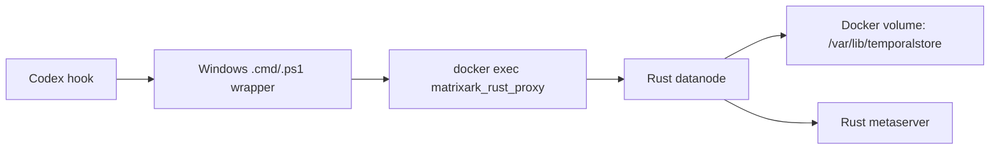

# Windows Docker Installation Manual

This guide installs Rust TemporalStore on Windows using Docker Desktop. The
normal open-source/runtime path does **not** require WSL: use a prebuilt Docker
image, run the container, and point clients or Codex hook wrappers at the
containerized Rust proxy.

WSL is only a maintainer convenience for rebuilding Linux release binaries and
building a local Docker image from source. End users should not need WSL for a
Windows Docker install.

## Runtime Shape

The Docker image contains the Rust TemporalStore service split:

```text
matrixark_rust_metaserver
matrixark_rust_datanode
matrixark_rust_proxy
matrixark_rust_direct_sdk
```

The container keeps the metaserver and datanode alive as long-running services.
Host clients call `matrixark_rust_proxy` through `docker exec`; the Python hook
does not embed storage.



## Dependencies

Required for no-WSL runtime install:

```text
Windows 10/11 or Windows Server
PowerShell 5.1 or newer
Docker Desktop with Linux containers
Prebuilt TemporalStore Docker image, either local or pullable
```

Required only if you install Codex hook wrappers:

```text
Windows Python 3, available as python.exe or python3.exe
TemporalStore Rust container running
Codex configured to execute the generated .cmd hook wrapper
```

Optional maintainer/build dependencies:

```text
WSL2 Linux distro
git, rustc, cargo inside WSL
```

## One-Command Runtime Install

If the image already exists locally:

```powershell
powershell -ExecutionPolicy Bypass `
  -File .\tools\install_windows_docker_temporalstore.ps1 `
  -SkipImagePull
```

If the image is available from a registry:

```powershell
powershell -ExecutionPolicy Bypass `
  -File .\tools\install_windows_docker_temporalstore.ps1 `
  -ImageName matrixark-temporalstore-rust:win-local `
  -PullImage
```

The installer:

- starts Docker Desktop and waits for the engine;
- validates or pulls the image;
- starts the TemporalStore container with a persistent Docker volume;
- validates health, write/read, and restart persistence;
- optionally writes Codex hook wrappers.

## Useful Options

```text
-ImageName <name:tag>             Default: matrixark-temporalstore-rust:win-local
-ContainerName <name>             Default: temporalstore-rust-win
-VolumeName <name>                Default: temporalstore-rust-win-data
-MetaPort <port>                  Default: 17101
-DataPort <port>                  Default: 17102
-PullImage                        Pull ImageName when it is not local
-SkipImagePull                    Require ImageName to already exist locally
-SkipRun                          Validate/build only, do not start the container
-SkipSmoke                        Skip health and write/read validation
-NoRestartPersistenceCheck        Skip restart persistence validation
-InstallCodexHookWrapper          Generate Windows .cmd/.ps1 wrappers for Codex
-WindowsRepoPath <path>           Windows path to this repo for hook wrapper use
-HookInstallDir <path>            Default: %USERPROFILE%\.matrixark\hooks
-HookPrefix <prefix>              Default: matrixark:codex-hook:rust
-InstallDockerDesktop             Install Docker Desktop through winget
-HttpProxy <url>                  Optional proxy for winget/Docker install
-HttpsProxy <url>                 Optional proxy for winget/Docker install
```

Maintainer-only options that require WSL:

```text
-BuildReleaseBinaries             Build Rust release binaries in WSL first
-BuildImageFromLocalBinaries      Build Docker image from local release binaries
-WslDistro <name>                 Default: auto-detect first WSL distro
-RepoPath <path>                  Default: /root/src/github-services/TemporalStore
-SkipImageBuild                   With build options, validate binaries but skip build
```

## Codex Hook Wrapper

Install Rust TemporalStore plus Windows hook wrappers:

```powershell
powershell -ExecutionPolicy Bypass `
  -File .\tools\install_windows_docker_temporalstore.ps1 `
  -SkipImagePull `
  -InstallCodexHookWrapper
```

The wrapper files are written to:

```text
%USERPROFILE%\.matrixark\hooks\matrixark-rust-proxy-docker.cmd
%USERPROFILE%\.matrixark\hooks\matrixark-codex-hook-rust-docker.cmd
%USERPROFILE%\.matrixark\hooks\matrixark-rust-proxy-docker.ps1
%USERPROFILE%\.matrixark\hooks\matrixark-codex-hook-rust-docker.ps1
```

Use this command as the Codex `UserPromptSubmit` hook command:

```text
%USERPROFILE%\.matrixark\hooks\matrixark-codex-hook-rust-docker.cmd
```

The hook wrapper sets:

```text
MATRIXARK_MCP_BACKEND=temporalstore-rust
MATRIXARK_TEMPORALSTORE_RUST_PROXY=<generated docker-exec proxy wrapper>
MATRIXARK_TEMPORALSTORE_PREFIX=matrixark:codex-hook:rust
MATRIXARK_TEMPORALSTORE_METASERVER=127.0.0.1:17101
```

The hook path is:

```text
Codex -> Windows .cmd wrapper -> Windows PowerShell wrapper
      -> Windows Python hook adapter
      -> Windows Docker Desktop
      -> docker exec -i temporalstore-rust-win matrixark_rust_proxy --serve
      -> Rust TemporalStore container
```

No WSL process participates in this runtime hook path.

## Maintainer: Build Image From Source

Use this only when refreshing the Docker image from the local source tree:

```powershell
powershell -ExecutionPolicy Bypass `
  -File .\tools\install_windows_docker_temporalstore.ps1 `
  -BuildReleaseBinaries `
  -BuildImageFromLocalBinaries
```

That mode uses WSL to run:

```bash
cd /root/src/github-services/TemporalStore
git fetch origin main
cargo build --release -p temporalstore-rust --bins
```

Then it copies only these release binaries into a temporary Windows Docker build
context:

```text
matrixark_rust_metaserver
matrixark_rust_datanode
matrixark_rust_proxy
matrixark_rust_direct_sdk
```

## Verify The Runtime

Check Docker status:

```powershell
$docker='C:\Program Files\Docker\Docker\resources\bin\docker.exe'
& $docker ps --filter "name=temporalstore-rust-win"
& $docker logs --tail 80 temporalstore-rust-win
```

Check health:

```powershell
Invoke-WebRequest -UseBasicParsing -Uri http://127.0.0.1:17101/health
Invoke-WebRequest -UseBasicParsing -Uri http://127.0.0.1:17102/health
```

The installer also performs a string write/read through the datanode and, unless
disabled, restarts the container and confirms the value still exists.

## Storage Layout

The container stores durable files in a Docker volume:

```text
temporalstore-rust-win-data:/var/lib/temporalstore
```

Inside the container:

```text
/var/lib/temporalstore/cache
/var/lib/temporalstore/pages
/var/lib/temporalstore/indexes
/var/lib/temporalstore/replica-replay-cursors
/var/lib/temporalstore/logs
```

Reset local state only when you intentionally want a clean TemporalStore:

```powershell
$docker='C:\Program Files\Docker\Docker\resources\bin\docker.exe'
& $docker rm -f temporalstore-rust-win
& $docker volume rm temporalstore-rust-win-data
```

## Troubleshooting

If Docker is not found, install or start Docker Desktop:

```powershell
powershell -ExecutionPolicy Bypass `
  -File .\tools\install_windows_docker_temporalstore.ps1 `
  -InstallDockerDesktop `
  -SkipRun `
  -SkipSmoke
```

If the image is missing, either pull a prebuilt image:

```powershell
powershell -ExecutionPolicy Bypass `
  -File .\tools\install_windows_docker_temporalstore.ps1 `
  -PullImage
```

or use the maintainer build path with WSL:

```powershell
powershell -ExecutionPolicy Bypass `
  -File .\tools\install_windows_docker_temporalstore.ps1 `
  -BuildReleaseBinaries `
  -BuildImageFromLocalBinaries
```

If Codex hook wrapper installation fails because Python is missing, install
Windows Python 3 and rerun with `-InstallCodexHookWrapper`. The TemporalStore
container itself does not require host Python.

If ports are already in use, choose different host/container ports:

```powershell
powershell -ExecutionPolicy Bypass `
  -File .\tools\install_windows_docker_temporalstore.ps1 `
  -MetaPort 18101 `
  -DataPort 18102
```
