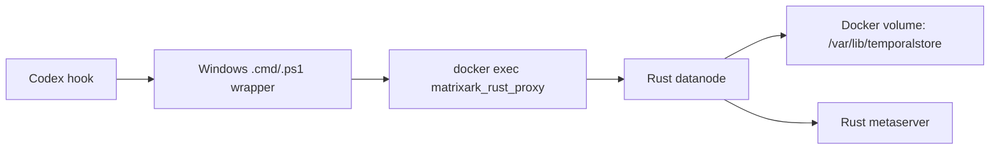

# Windows Docker Installation Manual

This guide installs Rust TemporalStore on Windows using Docker Desktop. The
normal open-source/runtime path does **not** require WSL. A fresh Windows user
only needs Docker Desktop, PowerShell, this repository, and a prebuilt Docker
image.

If you are not sure which platform guide to use, start with
[TemporalStore Install Guide](INSTALL.md).

## What This Installs

The installer starts one Linux container with Rust TemporalStore metaserver,
datanode, proxy, and direct SDK binaries. It creates a persistent Docker volume
for storage, checks health, runs a write/read smoke test, and can generate Codex
hook wrapper files.

WSL is only a maintainer convenience for rebuilding Linux release binaries and
building a local Docker image from source. End users should not need WSL for a
Windows Docker install.

## Runtime Shape

The Docker image contains the Rust TemporalStore service split:

```text
matrixark_rust_metaserver
matrixark_rust_datanode
matrixark_rust_proxy
matrixark_rust_direct_sdk
```

The container keeps the metaserver and datanode alive as long-running services.
This is **not** Rust embedded mode. Host clients call the containerized
`matrixark_rust_proxy` through `docker exec`; the Python hook is only a thin
adapter and does not embed storage.



## Dependencies

Required for no-WSL runtime install:

```text
Windows 10/11 or Windows Server
PowerShell 5.1 or newer
Docker Desktop with Linux containers
Prebuilt TemporalStore Docker image, either local or pullable
```

Fresh Windows setup:

```powershell
winget install --id Git.Git --accept-package-agreements --accept-source-agreements
winget install --id Python.Python.3.12 --accept-package-agreements --accept-source-agreements
winget install --id Docker.DockerDesktop --accept-package-agreements --accept-source-agreements
```

After installing Docker Desktop, start it once and wait until `docker info`
works in PowerShell.

Required only if you install Codex hook wrappers:

```text
Windows Python 3, available as python.exe or python3.exe
TemporalStore Rust container running
Codex configured to execute the generated .cmd hook wrapper
```

Optional maintainer/build dependencies:

```text
WSL2 Linux distro
git, rustc, cargo inside WSL
```

Clone the repo and run commands from the repo root:

```powershell
git clone https://github.com/matrixarkai/TemporalStore.git
cd TemporalStore
powershell -ExecutionPolicy Bypass `
  -File .\tools\install_windows_docker_temporalstore.ps1 `
  -CheckPrereqs
```

## One-Command Runtime Install

If the image already exists locally:

```powershell
powershell -ExecutionPolicy Bypass `
  -File .\tools\install_windows_docker_temporalstore.ps1 `
  -SkipImagePull
```

If the image is available from a registry:

```powershell
powershell -ExecutionPolicy Bypass `
  -File .\tools\install_windows_docker_temporalstore.ps1 `
  -ImageName matrixark-temporalstore-rust:win-local `
  -PullImage
```

The installer:

- starts Docker Desktop and waits for the engine;
- validates or pulls the image;
- starts the TemporalStore container with a persistent Docker volume;
- validates health, write/read, and restart persistence;
- optionally writes Codex hook wrappers.

## Useful Options

```text
-ImageName <name:tag>             Default: matrixark-temporalstore-rust:win-local
-ContainerName <name>             Default: temporalstore-rust-win
-VolumeName <name>                Default: temporalstore-rust-win-data
-MetaPort <port>                  Default: 17101
-DataPort <port>                  Default: 17102
-PullImage                        Pull ImageName when it is not local
-SkipImagePull                    Require ImageName to already exist locally
-SkipRun                          Validate/build only, do not start the container
-CheckPrereqs                     Check Docker, image/build prerequisites, and paths, then exit
-SkipSmoke                        Skip health and write/read validation
-NoRestartPersistenceCheck        Skip restart persistence validation
-InstallCodexHookWrapper          Generate Windows .cmd/.ps1 wrappers for Codex
-WindowsRepoPath <path>           Windows path to this repo for hook wrapper use
-HookInstallDir <path>            Default: %USERPROFILE%\.matrixark\hooks
-HookPrefix <prefix>              Default: matrixark:codex-hook:rust
-InstallDockerDesktop             Install Docker Desktop through winget
-HttpProxy <url>                  Optional proxy for winget/Docker install
-HttpsProxy <url>                 Optional proxy for winget/Docker install
```

Maintainer-only options that require WSL:

```text
-BuildReleaseBinaries             Build Rust release binaries in WSL first
-BuildImageFromLocalBinaries      Build Docker image from local release binaries
-WslDistro <name>                 Default: auto-detect first WSL distro
-RepoPath <path>                  Default: /opt/github-services/TemporalStore
-SkipImageBuild                   With build options, validate binaries but skip build
```

## Codex Hook Wrapper

Install Rust TemporalStore plus Windows hook wrappers:

```powershell
powershell -ExecutionPolicy Bypass `
  -File .\tools\install_windows_docker_temporalstore.ps1 `
  -SkipImagePull `
  -InstallCodexHookWrapper
```

The wrapper files are written to:

```text
%USERPROFILE%\.matrixark\hooks\matrixark-rust-proxy-docker.cmd
%USERPROFILE%\.matrixark\hooks\matrixark-codex-hook-rust-docker.cmd
%USERPROFILE%\.matrixark\hooks\matrixark-rust-proxy-docker.ps1
%USERPROFILE%\.matrixark\hooks\matrixark-codex-hook-rust-docker.ps1
```

Use this command as the Codex `UserPromptSubmit` hook command:

```text
%USERPROFILE%\.matrixark\hooks\matrixark-codex-hook-rust-docker.cmd
```

The hook wrapper sets:

```text
MATRIXARK_MCP_BACKEND=temporalstore-rust
MATRIXARK_TEMPORALSTORE_RUST_PROXY=<generated docker-exec proxy wrapper>
MATRIXARK_TEMPORALSTORE_PREFIX=matrixark:codex-hook:rust
MATRIXARK_TEMPORALSTORE_METASERVER=127.0.0.1:17101
```

The hook path is:

```text
Codex -> Windows .cmd wrapper -> Windows PowerShell wrapper
      -> Windows Python hook adapter
      -> Windows Docker Desktop
      -> docker exec -i temporalstore-rust-win matrixark_rust_proxy --serve
      -> Rust TemporalStore container
```

No WSL process participates in this runtime hook path.

### Ingestion Contract

Windows Docker ingestion is:

```text
Codex UserPromptSubmit payload
-> matrixark-codex-hook-rust-docker.cmd
-> matrixark_agent_hook.py
-> matrixark-rust-proxy-docker.cmd
-> docker exec -i temporalstore-rust-win matrixark_rust_proxy --serve
-> Rust metaserver + datanode in the container
-> /var/lib/temporalstore on the persistent Docker volume
```

So the Windows image must include `matrixark_rust_proxy`; otherwise Codex hook
ingestion is not supported. The proxy is the client boundary, while
`matrixark_rust_metaserver` and `matrixark_rust_datanode` are the long-lived
services. `matrixark_rust_direct_sdk` can also be shipped in the image for
future direct SDK clients, but the generated Windows Codex hook uses the proxy
wrapper because it is process-isolated and easy to invoke from Codex.


### Generated Hook Files

`matrixark-rust-proxy-docker.cmd` is a stable Windows command that starts a
single proxy request over Docker:

```text
powershell.exe -NoProfile -ExecutionPolicy Bypass ^
  -File "%USERPROFILE%\.matrixark\hooks\matrixark-rust-proxy-docker.ps1" %*
```

`matrixark-rust-proxy-docker.ps1` runs:

```powershell
docker exec -i temporalstore-rust-win `
  -e TS_CACHE_DIR=/var/lib/temporalstore/cache `
  -e TS_PAGE_STORE_DIR=/var/lib/temporalstore/pages `
  -e TS_INDEX_DIR=/var/lib/temporalstore/indexes `
  -e TS_REPLICA_REPLAY_CURSOR_DIR=/var/lib/temporalstore/replica-replay-cursors `
  matrixark_rust_proxy --serve
```

`matrixark-codex-hook-rust-docker.cmd` is the command to register with Codex.
It calls `matrixark-codex-hook-rust-docker.ps1`, which sets the TemporalStore
backend environment and runs:

```powershell
python.exe <repo>\tools\matrixark_agent_hook.py `
  --agent codex `
  --event UserPromptSubmit `
  --backend temporalstore-rust
```

The hook adapter reads the Codex hook payload from standard input when Codex
provides it. It sends the prompt envelope to Rust TemporalStore through
`MATRIXARK_TEMPORALSTORE_RUST_PROXY`.

### First Failure Checklist

If installation fails, check in this order:

```powershell
git --version
python --version
docker version
docker info
```

If ports are already in use:

```powershell
netstat -ano | findstr ":17101 :17102"
```

If the container starts but health fails:

```powershell
docker logs --tail 200 temporalstore-rust-win
```

The Windows smoke test only uses string write/read APIs. Context management,
Codex hook ingestion, and OSS model extraction are later layers.

### Hook Registration

Register this command for Codex `UserPromptSubmit`:

```text
%USERPROFILE%\.matrixark\hooks\matrixark-codex-hook-rust-docker.cmd
```

The hook should be global for the local Codex installation, not per task. When
Codex supports global hook configuration, use one global `UserPromptSubmit`
entry so new prompts from new or existing tasks go through the same command.

Expected global hook shape:

```json
{
  "hooks": {
    "UserPromptSubmit": [
      {
        "command": "%USERPROFILE%\\.matrixark\\hooks\\matrixark-codex-hook-rust-docker.cmd"
      }
    ]
  }
}
```

If your Codex build uses a different hook config file format, keep the same
command and lifecycle event. Do not create per-task hook scripts unless you are
debugging a single isolated task.

### Hook Payload And Scope

The hook adapter normalizes Codex input into one agent envelope:

```text
agent: codex
lifecycle event: UserPromptSubmit
backend: temporalstore-rust
prefix: matrixark:codex-hook:rust
thread/session id: from Codex payload when available
message text: visible user prompt from the hook payload
```

Use a real Codex thread/conversation/session id when Codex provides one. A fixed
debug session id should only be used for manual probes, never for real per-task
memory.

### Verify Hook Installation

First confirm the container is healthy:

```powershell
Invoke-WebRequest -UseBasicParsing -Uri http://127.0.0.1:17101/health
Invoke-WebRequest -UseBasicParsing -Uri http://127.0.0.1:17102/health
```

Then run a local wrapper smoke. This verifies the Windows command, Python hook
adapter, Docker proxy, and Rust TemporalStore are wired together:

```powershell
$payload = @{
  hook_event_name = "UserPromptSubmit"
  session_id = "manual-hook-smoke"
  transcript_path = ""
  prompt = "manual Windows Docker hook smoke"
} | ConvertTo-Json -Compress

$payload | & "$env:USERPROFILE\.matrixark\hooks\matrixark-codex-hook-rust-docker.cmd"
```

The command should return a JSON response with `"status": "ok"` and
`"ingested": true`. The installer runs this same hook smoke automatically when
`-InstallCodexHookWrapper` is used and `-SkipSmoke` is not set. After that, use
the MatrixArk management portal or query tool to fetch recent records under:

```text
prefix = matrixark:codex-hook:rust
session_id = manual-hook-smoke
```

If manual smoke works but real prompts do not appear, the Docker runtime is
healthy and the remaining issue is Codex hook registration/reload, not
TemporalStore storage.

## Claude Code Hook (via WSL)

Claude Code gets the same context engine as Codex under its own agent identity
(`matrixark:claude-hook:rust` vs `matrixark:codex-hook:rust`). Claude Code reads
`%USERPROFILE%\.claude\settings.json`, and the hook script runs through WSL, so
install it with the cross-agent installer and point `-WslRepo` at your clone
inside the WSL distro:

```powershell
powershell -ExecutionPolicy Bypass `
  -File .\integrations\agent-hooks\install\install.ps1 `
  -Agent claude -Mode wsl `
  -WslRepo /opt/github-services/TemporalStore
```

This registers the full Claude Code lifecycle against
`tools/matrixark_claude_hook.sh`. See
[Claude Code hook integration](matrixark_claude_hook_integration.md) for
backends, warm-up, and a quick check.

## Local Context Backfill

So retrieval is not cold on the first turn, warm TemporalStore from the local
Claude/Codex context on disk. The Claude hook and its backfill both run inside
WSL, and the ingester auto-detects the Windows user profile under
`/mnt/<drive>/Users`. Run it manually from the WSL distro:

```powershell
wsl -d <distro> -- bash -lc "cd <repo-in-wsl> && python3 tools/matrixark_local_backfill_ingester.py --agents claude,codex --dry-run"
wsl -d <distro> -- bash -lc "cd <repo-in-wsl> && python3 tools/matrixark_local_backfill_ingester.py --agents claude,codex"
```

For zero-effort auto-warm, set `MATRIXARK_BACKFILL_ON_START=1` in the WSL
environment that runs the Claude hook; the resumable backfill daemon then runs on
first `SessionStart`. See
[Memory Model And Local Context Backfill](INSTALL.md#memory-model-and-local-context-backfill)
for how it is resumable and dedup-safe.

## OSS Model Setup

The Windows Docker install keeps TemporalStore in Docker, but the Codex hook and
benchmark orchestration can still use the same baseline-style OSS
model setup from the Linux manual.

Recommended path:

```powershell
wsl -- bash -lc "cd /opt/github-services/TemporalStore && ./tools/install_context_oss_models.sh"
```

Then source the generated env file before running Linux-side benchmark or hook
commands:

```bash
source /opt/github-services/TemporalStore/.local/context-oss-models/context_oss_models.env
```

For a pure Windows hook, install Windows Python dependencies equivalent to
`tools/context_oss_models_requirements.txt`, then set:

```text
MATRIXARK_EMBEDDING_PROVIDER=oss
MATRIXARK_EMBEDDING_MODEL=sentence-transformers/all-MiniLM-L6-v2
MATRIXARK_EMBEDDING_MODEL_PATH=<local downloaded model path>
TEMPORALSTORE_READER_BASE_URL=http://127.0.0.1:11434/v1
TEMPORALSTORE_READER_MODEL=qwen2.5:0.5b
```

Ollama should expose an OpenAI-compatible endpoint at:

```text
http://127.0.0.1:11434/v1
```

The first open-source Windows path should prefer the Docker TemporalStore
runtime plus Linux/WSL OSS model setup for benchmarks. Host-Windows model setup
is supported, but it is more sensitive to Python, Torch, and GPU driver drift.

## Maintainer: Build Image From Source

Use this only when refreshing the Docker image from the local source tree:

```powershell
powershell -ExecutionPolicy Bypass `
  -File .\tools\install_windows_docker_temporalstore.ps1 `
  -BuildReleaseBinaries `
  -BuildImageFromLocalBinaries
```

That mode uses WSL to run:

```bash
cd /opt/github-services/TemporalStore
git fetch origin main
cargo build --release -p temporalstore-rust --bins
```

Then it copies only these release binaries into a temporary Windows Docker build
context:

```text
matrixark_rust_metaserver
matrixark_rust_datanode
matrixark_rust_proxy
matrixark_rust_direct_sdk
```

## Verify The Runtime

Check Docker status:

```powershell
$docker='C:\Program Files\Docker\Docker\resources\bin\docker.exe'
& $docker ps --filter "name=temporalstore-rust-win"
& $docker logs --tail 80 temporalstore-rust-win
```

Check health:

```powershell
Invoke-WebRequest -UseBasicParsing -Uri http://127.0.0.1:17101/health
Invoke-WebRequest -UseBasicParsing -Uri http://127.0.0.1:17102/health
```

The installer also performs a string write/read through the datanode and, unless
disabled, restarts the container and confirms the value still exists.

## Storage Layout

The container stores durable files in a Docker volume:

```text
temporalstore-rust-win-data:/var/lib/temporalstore
```

Inside the container:

```text
/var/lib/temporalstore/cache
/var/lib/temporalstore/pages
/var/lib/temporalstore/indexes
/var/lib/temporalstore/replica-replay-cursors
/var/lib/temporalstore/logs
```

Reset local state only when you intentionally want a clean TemporalStore:

```powershell
$docker='C:\Program Files\Docker\Docker\resources\bin\docker.exe'
& $docker rm -f temporalstore-rust-win
& $docker volume rm temporalstore-rust-win-data
```

## Troubleshooting

If Docker is not found, install or start Docker Desktop:

```powershell
powershell -ExecutionPolicy Bypass `
  -File .\tools\install_windows_docker_temporalstore.ps1 `
  -InstallDockerDesktop `
  -SkipRun `
  -SkipSmoke
```

If the image is missing, either pull a prebuilt image:

```powershell
powershell -ExecutionPolicy Bypass `
  -File .\tools\install_windows_docker_temporalstore.ps1 `
  -PullImage
```

or use the maintainer build path with WSL:

```powershell
powershell -ExecutionPolicy Bypass `
  -File .\tools\install_windows_docker_temporalstore.ps1 `
  -BuildReleaseBinaries `
  -BuildImageFromLocalBinaries
```

If Codex hook wrapper installation fails because Python is missing, install
Windows Python 3 and rerun with `-InstallCodexHookWrapper`. The TemporalStore
container itself does not require host Python.

If ports are already in use, choose different host/container ports:

```powershell
powershell -ExecutionPolicy Bypass `
  -File .\tools\install_windows_docker_temporalstore.ps1 `
  -MetaPort 18101 `
  -DataPort 18102
```
